# realman dual arm develop

## 通信配置

开发环境

- PC&OS：Nvidia Jetson Orin Nx + Ubuntu22.04
- PC_IP: 169.254.247.100
- Robot_1_IP: 169.254.247.18
- Robot_2_IP: 169.254.247.19

### 设置电脑端网络IP

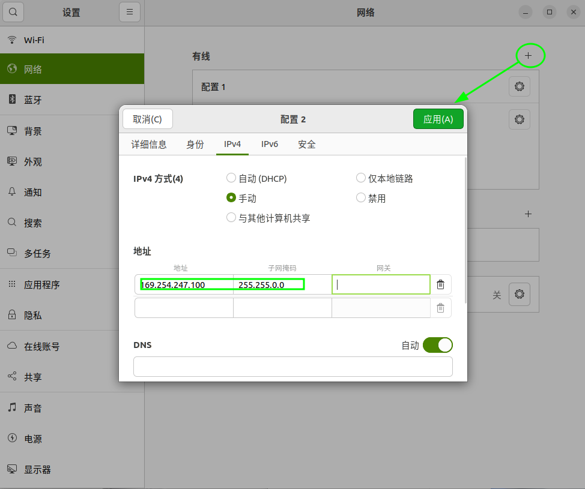


通信拓扑

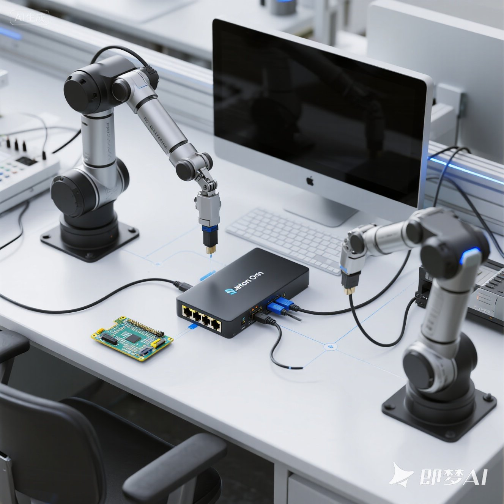

### 设置机械臂IP

在机械臂与示教器连接成功的基础上，可通过“配置 > 系统配置 > 通讯设置 > IP模式设置 > 目标IP文本框”中设置机械臂IP。 


#### 访问网页示教器

通过网页的形式访问机械臂示教器（出厂默认IP为 __192.168.1.18__ 或 __192.168.1.19__ ）


修改机器人IP 和网关

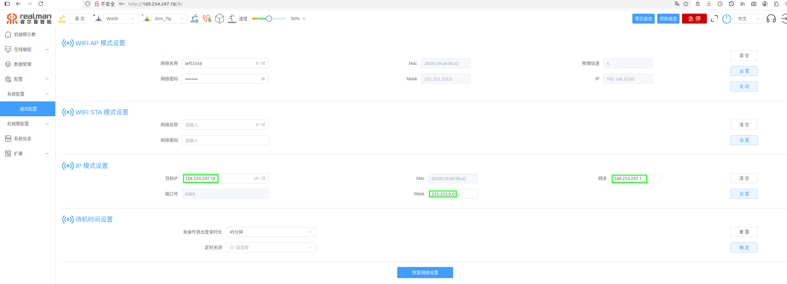


## API 相关

#### 开发指南

https://develop.realman-robotics.com/robot/summarize/


#### 下载资源

https://github.com/RealManRobot/RM_API/tree/main


#### 伺服模式API（关节角度 CANFD 透传 Service_Movej_CANFD）


##### ROS2 下使用

[参考链接](https://develop.realman-robotics.com/robot/ros2/ros2Description/#%E5%85%B3%E8%8A%82%E8%A7%92%E5%BA%A6canfd%E9%80%8F%E4%BC%A0jointpos-msg)

透传需要连续发送多个连续的点实现，单纯靠以下命令并不能实现功能，当前moveit2控制使用了角度透传的控制方式。

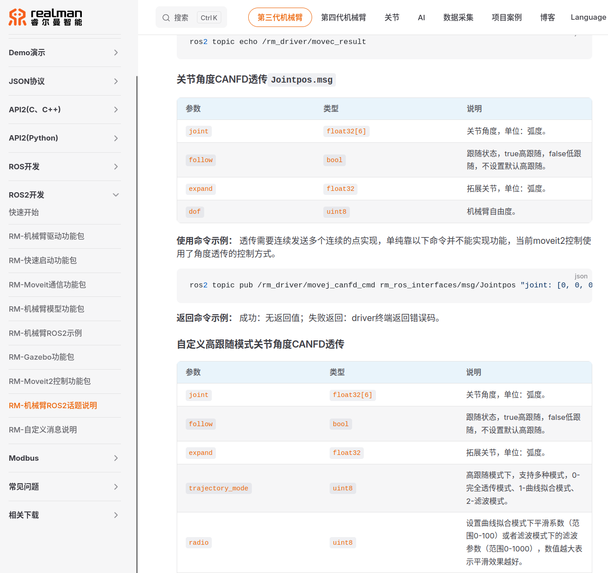


#### 源码说明

当您使用rm_sclerp_planner_node_1直接发布到`/rm_driver/movej_canfd_cmd`话题时，所有轨迹点都使用相同的跟随模式和轨迹模式参数。

在[rm_driver.cpp](javascript:void(0)) 中，[Arm_Movej_CANFD_Callback](javascript:void(0)) 函数处理接收到的关节角度命令：

```c++
void RmArm::Arm_Movej_CANFD_Callback(rm_ros_interfaces::msg::Jointpos::SharedPtr msg)
{
    float joint[7];
    bool follow;
    float expand;
    int32_t res;
    int trajectory_mode;
    int radio;
    std_msgs::msg::UInt32 movej_CANFD_data;

    for(int i = 0; i < 6; i++)
    {
        joint[i] = msg->joint[i] * RAD_DEGREE;
    }
    if(msg->dof == 7)
    {
        joint[6] = msg->joint[6] * RAD_DEGREE;
    }

    follow = msg->follow;
    expand = msg->expand * RAD_DEGREE;
    trajectory_mode = trajectory_mode_;
    radio = radio_;
    //std::cout<<"Service_Movej_CANFD_With_Radio is run!!!!"<<std::endl;
    // res = Rm_Api.Service_Movej_CANFD_With_Radio(m_sockhand, joint, follow, expand, trajectory_mode, radio);
    res = Rm_Api.rm_movej_canfd(robot_handle, joint, follow, expand, trajectory_mode, radio);
    
    movej_CANFD_data.data = res;
    if(movej_CANFD_data.data != 0)
    {
        RCLCPP_INFO (this->get_logger(),"Movej CANFD error code is %d\n",movej_CANFD_data.data);
    }
}
```

可以看到，所有通过[movej_canfd_cmd](javascript:void(0))话题发送的命令都使用相同的[trajectory_mode_](javascript:void(0))和[radio_](javascript:void(0))参数，这些参数是在驱动程序初始化时设置的默认值。

根据机械臂的API文档，[rm_movej_canfd](javascript:void(0))函数有以下参数：

- [follow](javascript:void(0)): true表示高跟随，false表示低跟随
- [trajectory_mode](javascript:void(0)): 高跟随模式下，0-完全透传模式、1-曲线拟合模式、2-滤波模式
- [radio](javascript:void(0)): 曲线拟合模式和滤波模式下的平滑系数

问题可能出现在以下几点：

1. **轨迹模式不合适**：如果使用的是完全透传模式(模式0)，机械臂可能对连续相同点的处理方式是忽略它们，特别是当这些点与当前实际位置非常接近时。
2. **高跟随模式设置不当**：如果使用高跟随模式，要求透传周期不超过10ms，而您的节点正好以10ms发布，这在边界上可能不够稳定。
3. **机械臂状态判断**：当机械臂已经处于目标位置时，即使发送命令，机械臂也可能判断不需要移动。

解决方案建议：

1. 尝试修改发布到`movej_canfd_cmd`话题的消息参数，特别是[follow](javascript:void(0))、[trajectory_mode](javascript:void(0))和[radio](javascript:void(0))参数，例如使用曲线拟合模式(模式1)。
2. 或者使用`movej_canfd_custom_cmd`话题，这样可以在每个消息中指定不同的[trajectory_mode](javascript:void(0))和[radio](javascript:void(0))值。
3. 确保在发布轨迹点时添加一个小的偏移量，即使是很小的值，以确保机械臂检测到位置变化。

这个问题的根本原因在于机械臂控制器对重复命令的处理方式，以及透传模式参数的设置可能不适合当前应用场景。


## 基于ROS2的开发配置

### realman ROS2开发指南

https://develop.realman-robotics.com/robot/ros2/getStarted/

### 功能包下载

https://github.com/RealManRobot/ros2_rm_robot/tree/humble


机械臂的ROS2支持是基于`ros2_rm_robot`功能包，以下为使用环境：

- 当前支持的机械臂有RM65系列、RM75系列、ECO63系列、ECO65系列、RML63系列和GEN72系列，详细可参考网址 [RealMan robots](https://www.realman-robotics.cn/)。
- ROS2最新版本为1.4.0，与机械臂控制器版本配套关系，请参考[版本变更说明](https://develop.realman-robotics.com/robot/releaseNotes/releaseNotes/#42281)。
- ROS2支持humble为Ubuntu版本是22.04。
- ROS2支持foxy为Ubuntu版本是20.04。

humble功能包下载地址：[humble](https://github.com/RealManRobot/ros2_rm_robot/tree/humble)。 foxy功能包下载地址：[foxy](https://github.com/RealManRobot/ros2_rm_robot/tree/foxy)。

### 环境搭建与配置

#### 搭建环境

##### 安装ROS2

我们提供了ROS2的安装脚本ros2_install.sh，该脚本位于rm_install功能包中的scripts文件夹下，在实际使用时我们需要移动到该路径执行如下指令。

```
sudo bash ros2_install.sh
```

如果不想使用脚本安装也可以参考网址 [ROS2_INSTALL](https://docs.ros.org/en/humble/Installation/Ubuntu-Install-Debians.html)。

##### 安装Moveit2

我们提供了Moveit2的安装脚本moveit2_install.sh，该脚本位于rm_install功能包中的scripts文件夹下，在实际使用时我们需要移动到该路径执行如下指令。

```
sudo bash moveit2_install.sh
```

如果不想使用脚本安装也可以参考网址 [Moveit2_INSTALL](https://moveit.ros.org/install-moveit2/binary/)进行安装。

##### 配置功能包环境

该脚本位于rm_driver功能包中的lib文件夹下，在实际使用时我们需要移动到该路径执行如下指令。

```
sudo bash lib_install.sh
```

##### 编译

以上执行成功后，可以执行如下指令进行功能包编译，首先需要构建工作空间，并将功能包文件导入工作空间下的src文件夹下，之后使用colcon build指令进行编译。

```
mkdir -p ~/ros2_ws/src
cp -r ros2_rm_robot ~/ros2_ws/src
cd ~/ros2_ws
colcon build --packages-select rm_ros_interfaces
source ./install/setup.bash
colcon build
```

编译完成后即可进行功能包的运行操作。

注：将上述指令中的 `~/ros2_ws` 替换成自己的项目工作空间对应的目录

##### 加载环境变量

编译成功后，需要将工作空间的 `setup.bash` 文件 source 到你的 shell 环境中，以便使用编译好的库和可执行文件。

```bash
source ~/ros2_ws/install/setup.bash
```

为了每次打开终端都生效，可以将其添加到你的 `~/.bashrc` 文件末尾：

```bash
echo "source ~/ros2_ws/install/setup.bash" >> ~/.bashrc
source ~/.bashrc
```

命令中的 __~/ros2_ws__ 可替换成实际的工作空间目录 

#### 功能运行

###### 功能包简介

1. 安装与环境配置([rm_install](https://github.com/RealManRobot/ros2_rm_robot/tree/humble/rm_install))

- 该功能包为机械臂使用辅助功能包，主要作用为介绍功能包使用环境安装与搭建方式，功能包的依赖库安装和功能包编译方法。

2. 硬件驱动([rm_driver](https://github.com/RealManRobot/ros2_rm_robot/tree/humble/rm_driver))

- 该功能包为机械臂的ROS2底层驱动功能包，其作用为订阅和发布机械臂底层相关话题信息。

3. 启动([rm_bringup](https://github.com/RealManRobot/ros2_rm_robot/tree/humble/rm_bringup))

- 该功能包为机械臂的节点启动功能包，其作用为快速启动多节点复合的机械臂功能。

4. 模型描述([rm_description](https://github.com/RealManRobot/ros2_rm_robot/tree/humble/rm_description))

- 该功能包为机械臂模型描述功能包，其作用为提供机械臂模型文件和模型加载节点，并为其他功能包提供机械臂关节间的坐标变换关系。

5. ROS消息接口([rm_ros_interfaces](https://github.com/RealManRobot/ros2_rm_robot/tree/humble/rm_ros_interfaces))

- 该功能包为机械臂的消息文件功能包，其作用为提供机械臂适配ROS2的所有控制消息和状态消息。

6. Moveit2配置([rm_moveit2_config](https://github.com/RealManRobot/ros2_rm_robot/tree/humble/rm_moveit2_config))

- 该功能包为机械臂的moveit2适配功能包，其作用为适配和实现各系列机械臂的moveit2规划控制功能，主要包括虚拟机械臂控制和真实机械臂控制两部分控制功能。

7. Moveit2与硬件驱动通信连接([rm_config](https://github.com/RealManRobot/ros2_rm_robot/tree/humble/rm_control))

- 该功能包为底层驱动功能包（rm_driver）和moveit2功能包（rm_moveit2_config）之间的通信连接功能包，主要功能为将moveit2的规划点进行细分然后通过透传的形式传递给底层驱动功能包控制机械臂运动。

8. Gazebo仿真机械臂控制([rm_gazebo](https://github.com/RealManRobot/ros2_rm_robot/tree/humble/rm_gazebo))

- 该功能包为gazebo仿真机械臂功能包，主要功能为在gazebo仿真环境中显示机械臂模型，可通过moveit2对仿真的机械臂进行规划控制。

9. 使用案例([rm_examples](https://github.com/RealManRobot/ros2_rm_robot/tree/humble/rm_example))

- 该功能包为机械臂的一些使用案例，主要功能为实现机械臂的一些基本的控制功能和运动功能的使用案例。

10. 技术文档([rm_docs](https://github.com/RealManRobot/ros2_rm_robot/tree/humble/rm_doc))

- 该功能包为介绍文档的功能包，其主要包括为对整体的功能包内容和使用方式进行总体介绍的文档和对每个功能包中的内容和使用方式进行详细介绍的文档。

以上为当前的十个功能包，每个功能包都有其独特的作用，详情请参考rm_doc功能包下的doc文件夹中的文档进行详细了解。

##### 运行虚拟机械臂

使用如下指令可以启动gazebo显示仿真机械臂，并同时启动moveit2进行仿真机械臂的规划操控。

```
source ~/ros2_ws/install/setup.bash
ros2 launch rm_gazebo gazebo_<arm_type>_demo.launch.py
ros2 launch rm_<arm_type>_config gazebo_moveit_demo.launch.py
```

（注：将上述指令中的 __~/ros2_ws__ 替换成自己的项目工作空间对应的目录）

<arm_type>需要使用65、75、eco65、eco63、63、gen72、gen72_II 字符进行代替，如使用RM65机械臂时，命令如下。

```
ros2 launch rm_gazebo gazebo_65_demo.launch.py
ros2 launch rm_65_config gazebo_moveit_demo.launch.py
```

启动成功后即可使用moveit2进行虚拟机械臂的控制。

##### 控制真实机械臂

1）运行底盘驱动节点（若无底盘可跳过）

```
ros2 launch rm_driver rm_<arm_type>_driver.launch.py
```

2）运行rm_description功能包文件。

- 启动标准版本机械臂的命令为：

```
ros2 launch rm_description rm_<arm_type>_display.launch.py
```
- 启动六维力版本机械臂的命令为(eco63、gen72、gen72_II不可用)：

```
ros2 launch rm_description rm_<arm_type>_6f_display.launch.py
```
- 启动一体化（控制柜集成到机械臂底座中）六维力版本机械臂的命令为(gen72、gen72_II不可用)：

```
ros2 launch rm_description rm_<arm_type>_6fb_display.launch.py
```
3）之后需要运行中间功能包rm_control的相关节点。

```
ros2 launch rm_control rm_<arm_type>_control.launch.py
```
4）最终需要启动控制真实机械臂的moveit2节点。

- 启动标准版本机械臂的命令为：

```
ros2 launch rm_<arm_type>_config real_moveit_demo.launch.py
```
- 启动六维力版本机械臂的命令为(eco63、gen72、gen72_II不可用)：

```
ros2 launch rm_<arm_type>_config real_moveit_demo_6f.launch.py
```
- 启动一体化六维力版本机械臂的命令为(gen72、gen72_II不可用)：

```
ros2 launch rm_<arm_type>_config real_moveit_demo_6fb.launch.py
```
注意：以上指令均需要将<arm_type>更换为对应的机械臂型号，可选择的型号有65、63、eco65、eco63、75、gen72、gen72_II。
完成以上操作后将会出现以下界面，我们可以通过拖动控制球的方式控制机械臂运动。

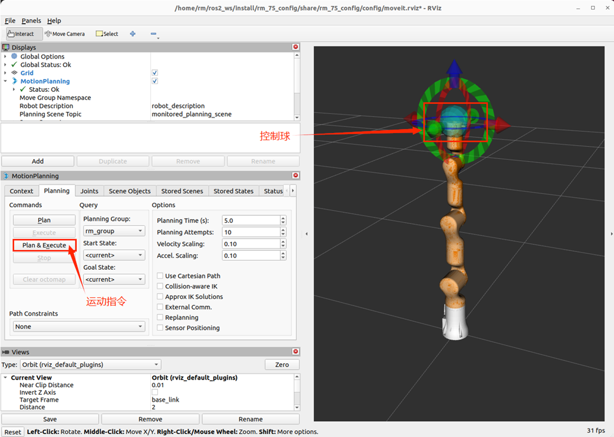

【注】：使用 Moveit2控制真实机械臂，在执行命令 ros2 launch rm_75_config real_moveit_demo_6fb.launch.py 之前，如果机械臂IP不是默认的 192.168.1.18，需要修改相关配置文件中的IP地址。
机械臂的IP地址配置在 rm_driver 包的配置文件中。对于RM-75机械臂，配置文件位于 src/ros2_rm_robot-humble/rm_driver/config/rm_75_config.yaml。
在 rm_75_config.yaml 文件中，默认的机械臂IP地址设置为：

```
arm_ip: "192.168.1.18"        #设置TCP连接时的IP
```
修改完成后，无需编译，直接运行指令

```
ros2 launch rm_75_config real_moveit_demo_6fb.launch.py
```

 


#### 安全提示

在使用机械臂时，为保证使用者安全，请参考如下操作规范。

- 每次使用前检查机械臂的安装情况，包括固定螺丝是否松动，机械臂是否存在震动、晃动的情况。
- 机械臂在运行过程中，人不可处于机械臂落下或工作范围内，也不可将其他物体放到机械臂动作的安全范围内。
- 在不使用机械臂时，应将机械臂置于安全位置，防止震动时机械臂跌落而损坏或砸伤其他物体。
- 在不使用机械臂时应及时断开机械臂电源。


### Error list

#### 动态链接库版本不匹配问题

##### 报错现象

在上述【 __编译__】环节中 执行 __colcon build__ 指令报错如下


##### 原因分析：

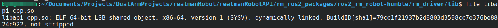

下载功能包内 __rm_driver/lib__ 下的 __libapi_cpp.so__ 版本为 __x86-64__

##### 解决方法：

将 __lib/linux_arm64_c++_v1.0.7__ 目录下的 __libapi_cpp.so__ 文件拷贝替换 __lib__ 文件夹下的同名文件(或者重命名并备份原文件)

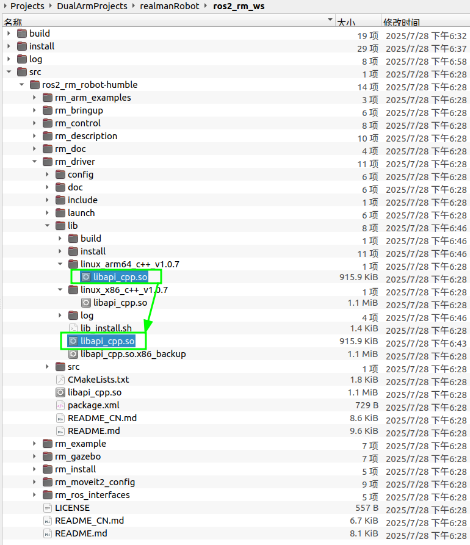


## 集成钧舵EVS08真空吸盘

### 参考资料 📔

[睿尔曼超轻量仿人机械臂--集成钧舵EVS08真空吸盘 - 李亚慧的文章 - 知乎](https://zhuanlan.zhihu.com/p/621048052)


------


##### 规划器测试 🏹 🪓 👻

起始位资


弧度制：-0.0509, 0.6369, 1.8329, 1.4736, -0.0057, 0.6149, -0.0495


目标位姿


弧度制：0.549, 0.594, 1.275, 1.294, 0.147, 0.454, -0.160


规划器计算结果


结论：姿态部分存在较大误差


否可以参考网站（https://github.com/RealManRobot/RM_API2/blob/main/Demo/RMDemo_Cpp/RMDemo_AlgoInterface/src/main.cpp） 中代码实现，在 test_fk.cpp 中的离线模式中指定机械臂型号，添加如下代码：

#include "rm_driver/rm_service.h"

RM_Service robotic_arm;

rm_robot_arm_model_e Mode = RM_MODEL_RM_65_E; 

rm_force_type_e Type = RM_MODEL_RM_B_E; 

printf("Set robot arm model to %d, sensor model to %d: Success\n", Mode, Type); 

robotic_arm.rm_algo_init_sys_data(Mode, Type);


// 初始化线程模式
	int init_result = rm_init(RM_TRIPLE_MODE_E);
	if (init_result != 0) {
	    RCLCPP_ERROR(this->get_logger(), "初始化线程模式失败，错误码: %d", init_result);
	    return;
	}
	RCLCPP_INFO(this->get_logger(), "线程模式初始化成功");


将上述问答内容按要求写入如下指定的文档和章节中：

文档名称：developLog.md

所属章节：新的章节——“debug 记录“

写入要求：不要覆盖和修改文档中已经存在的内容


## 基于螺旋球面插值的运动规划

在实例化 ScLERP 运动规划接口之前解析 URDF 模型，直接在 RmSclerpPlannerNode 构造函数中从 URDF 文件解析链接名称，这是一个更好的解决方案，因为它：

1. 完全避免了硬编码
2. 自动适应不同的 URDF 模型
3. 降低了配置复杂性
4. 提高了代码的健壮性和通用性

------


## 代码说明 🏌 ⛳

### 系统架构解析

#### 类图

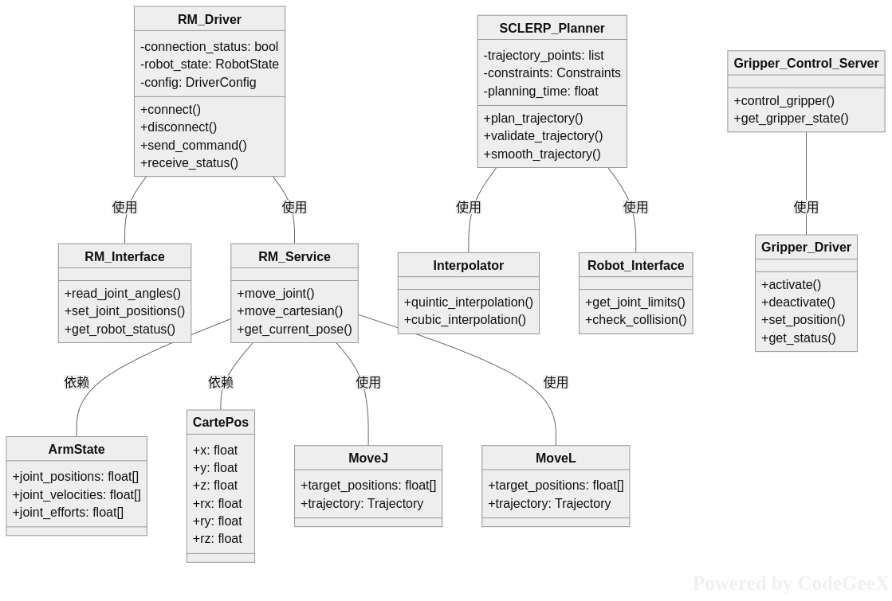

这个项目是一个完整的双臂机器人控制系统，主要用于控制睿尔曼(RealMan)机械臂及其末端夹爪。让我从系统架构和功能模块两个方面来详细解释：

##### 1. 系统整体架构

该项目采用模块化设计，主要分为四个核心子系统：

###### 1.1 机器人控制系统
- **RM_Driver**: 底层驱动模块，负责与机械臂硬件的直接通信
  - 管理连接状态和机器人状态
  - 提供基础的连接、断开、命令发送和状态接收功能

- **RM_Interface**: 接口抽象层，提供标准化的机器人控制接口
  - 读取关节角度
  - 设置关节位置
  - 获取机器人状态

- **RM_Service**: 服务层，实现高级控制功能
  - 关节运动控制
  - 笛卡尔空间运动
  - 当前位姿获取

###### 1.2 运动规划系统
- **SCLERP_Planner**: 核心规划器，实现轨迹规划功能
  - 轨迹点生成
  - 约束条件处理
  - 轨迹平滑处理

- **Interpolator**: 插值器，提供多种插值算法
  - 五次多项式插值
  - 三次样条插值

- **Robot_Interface**: 机器人接口，处理运动学约束
  - 关节限位检查
  - 碰撞检测

###### 1.3 机器人接口定义
定义了机器人控制所需的核心数据结构：
- **ArmState**: 机械臂状态信息
- **CartePos**: 笛卡尔空间位姿
- **MoveJ**: 关节运动指令
- **MoveL**: 直线运动指令

###### 1.4 夹爪控制系统
- **Gripper_Driver**: 夹爪硬件驱动
- **Gripper_Control_Server**: 夹爪控制服务器，提供ROS服务接口

##### 2. 主要功能特性

###### 2.1 机械臂控制功能
1. **基础运动控制**
   - 关节空间运动（MoveJ）
   - 笛卡尔空间直线运动（MoveL）
   - 圆弧运动（MoveC）

2. **高级运动功能**
   - 力位混合控制
   - 拖动示教
   - 轨迹复现

3. **状态监控**
   - 实时关节状态反馈
   - 错误检测和处理
   - 限位保护

###### 2.2 运动规划功能
1. **轨迹规划**
   - 平滑轨迹生成
   - 动力学约束处理
   - 避障规划

2. **插值算法**
   - 五次多项式插值
   - 三次样条插值
   - 自适应时间缩放

###### 2.3 夹爪控制功能
1. **基本控制**
   - 真空吸盘控制
   - 位置控制
   - 力控夹取

2. **状态监控**
   - 夹爪状态反馈
   - 错误处理

###### 2.4 系统集成特性
1. **ROS2集成**
   - 标准ROS2接口
   - 支持Action通信
   - 参数化配置

2. **多臂协同**
   - 支持双臂控制
   - 独立的规划器实例
   - 协调运动控制

##### 3. 应用场景

该系统主要用于：
1. **工业自动化**
   - 拾取放置作业
   - 装配任务
   - 物料搬运

2. **科研实验**
   - 运动规划算法研究
   - 人机协作
   - 力控制研究

3. **教育培训**
   - 机器人控制教学
   - ROS2开发实践

这个项目提供了一个完整的机器人控制解决方案，具有良好的模块化设计和扩展性，适合于各种机器人应用场景。

#### 时序图

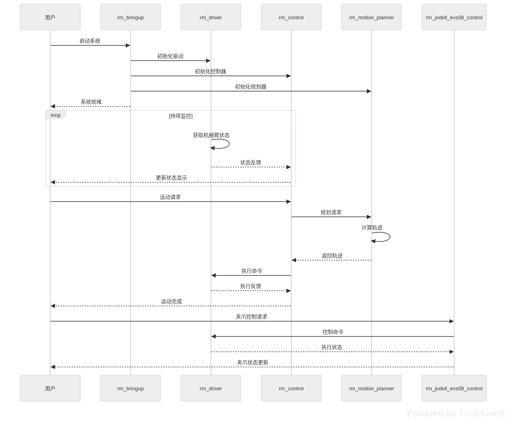

这是一个用于控制双臂机器人系统的ROS2项目,主要用于机器人的运动规划和控制。让我为您详细解析各个模块的功能和系统架构:

该项目采用模块化设计,包含5个主要功能包,通过ROS2话题和服务进行通信,实现完整的机器人控制功能。

##### 核心功能包说明

1. **rm_bringup** - 系统启动层
   - 负责整个系统的初始化和启动
   - 加载机器人URDF模型和配置文件
   - 启动其他所有功能包节点
   - 提供系统状态监控和诊断

2. **rm_driver** - 硬件驱动层
   - 直接与机器人硬件通信
   - 提供关节状态、力矩等传感器数据读取
   - 执行底层运动控制命令
   - 支持多种机器人型号(RM63/RM65/RM75等)

3. **rm_control** - 控制器层
   - 实现运动控制算法
   - 处理来自规划器的轨迹数据
   - 执行位置、速度、力矩控制
   - 监控和调整机器人运动状态

4. **rm_motion_planner** - 运动规划层
   - 提供轨迹规划功能
   - 支持SCLeRP(分段连续线性参考路径)规划算法
   - 处理碰撞检测和避障
   - 生成平滑的运动轨迹

5. **rm_jodell_evs08_control** - 末端执行器控制
   - 控制真空吸盘夹爪
   - 提供吸/放操作
   - 监控夹爪状态
   - 支持工具电压控制

##### 系统工作流程

1. **初始化阶段**:
   - Bringup启动并初始化各子系统
   - Driver建立与硬件的连接
   - Control加载控制参数
   - Planner准备规划算法
   - 系统就绪等待任务

2. **状态监控**:
   - Driver持续获取机器人状态
   - Control处理并转发状态信息
   - User通过可视化界面监控状态

3. **运动控制**:
   - User发送运动请求
   - Control将请求转发给Planner
   - Planner计算并生成轨迹
   - Control解析轨迹并发送命令
   - Driver执行实际运动
   - 系统反馈执行结果

4. **夹爪控制**:
   - User发送夹爪控制命令
   - Gripper模块处理并转换命令
   - Driver执行底层的夹爪控制
   - 系统返回夹爪状态

##### 技术特点

1. **模块化设计**
   - 各功能包职责明确
   - 接口标准化
   - 便于维护和扩展

2. **实时控制**
   - 支持高频率控制循环
   - 低延迟的运动控制
   - 精确的轨迹跟踪

3. **安全性**
   - 完整的状态监控
   - 碰撞检测
   - 紧急停止功能

4. **灵活性**
   - 支持多种机器人型号
   - 可配置的控制参数
   - 可扩展的功能模块

这个项目主要用于工业机器人自动化场景,如装配、搬运、检测等任务,特别适合需要精确运动控制的应用。

#### 流程图


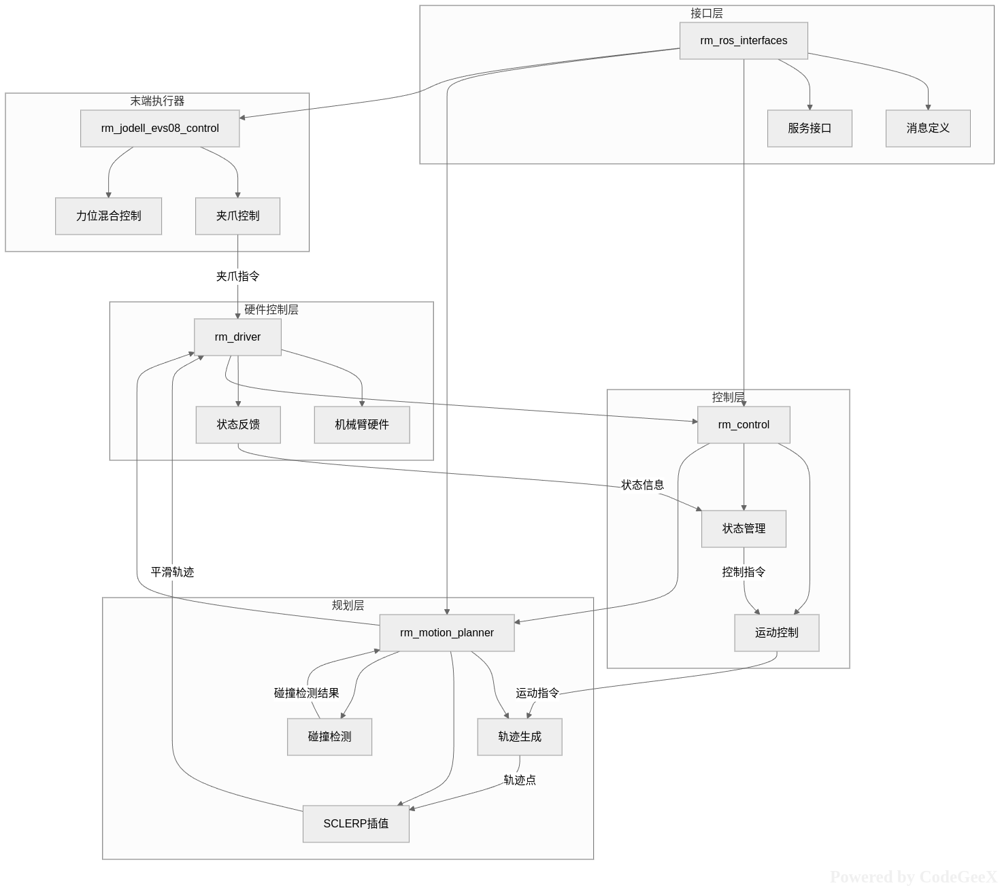

这个项目是一个基于ROS2的双臂机械臂控制系统，主要用于实现机械臂的运动规划、控制和末端执行器操作。系统采用分层架构设计，各层职责明确，通过标准化的接口进行通信。

##### 1. 系统架构

###### 1.1 硬件控制层
- **rm_driver**: 直接与机械臂硬件通信的底层驱动
  - 控制机械臂硬件执行实际运动
  - 获取机械臂状态反馈
  - 提供硬件抽象接口

###### 1.2 控制层
- **rm_control**: 实现运动控制和状态管理
  - 运动控制：执行具体的运动指令
  - 状态管理：监控和管理机械臂状态
  - 作为硬件层和规划层的桥梁

###### 1.3 规划层
- **rm_motion_planner**: 负责轨迹规划和插值计算
  - 轨迹生成：生成运动轨迹
  - SCLERP插值：实现平滑的轨迹插值
  - 碰撞检测：确保运动安全

###### 1.4 接口层
- **rm_ros_interfaces**: 定义系统通信接口
  - 消息定义：标准化的数据结构
  - 服务接口：提供功能调用接口
  - 确保各组件间的标准化通信

###### 1.5 末端执行器
- **rm_jodell_evs08_control**: 控制真空吸盘系统
  - 夹爪控制：控制末端执行器的动作
  - 力位混合控制：实现精确的力位混合控制

##### 2. 主要功能

###### 2.1 运动控制
- 支持多种运动模式（MoveJ、MoveL、MoveC等）
- 实现轨迹平滑和插值
- 支持力位混合控制

###### 2.2 规划功能
- 轨迹优化和生成
- 碰撞检测和避障
- 双臂协调规划

###### 2.3 末端执行器控制
- 真空吸盘控制
- 工具电压控制
- 状态监控和反馈

###### 2.4 状态管理
- 实时状态监控
- 错误处理和恢复
- 系统状态维护

##### 3. 工作流程

1. **规划阶段**：
   - motion_planner生成轨迹
   - 进行碰撞检测
   - SCLERP插值平滑轨迹

2. **控制阶段**：
   - control模块接收轨迹
   - 生成控制指令
   - 状态监控和管理

3. **执行阶段**：
   - driver接收控制指令
   - 控制硬件执行动作
   - 收集状态反馈

4. **末端执行器**：
   - 控制真空吸盘
   - 执行抓取和放置操作
   - 反馈执行状态

这个系统设计完整，功能丰富，可以满足复杂的双臂机械臂控制需求，特别适合需要精密操作和协调控制的场景。

### rm_motion_planner 功能包说明 🧩

#### rm_sclerp_planner_node.cpp

##### 简介

一个完整的ROS 2节点实现，具有参数配置和定时器功能。它支持通过参数配置起始和目标关节位置，并且可以从URDF文件中自动获取机器人链接名称。

只支持单臂控制，使用规划器 `sclerp_interface::ScLERPInterface::planMultiStageTrajectory`

##### 机械臂IP设置 💻


##### 通信链路 🚥

> rm_sclerp_planner_node -> rm_control -> rm_driver -> 机械臂硬件

整个通信流程：

1. **rm_sclerp_planner_node** (规划器)
   - 读取参数中的起始和目标关节角度
   - 使用ScLERP算法进行路径规划
   - 通过`/rm_group_controller/follow_joint_trajectory` action将轨迹发送给rm_control
2. **rm_control**（控制器）
   - 接收来自rm_sclerp_planner_node的轨迹
   - 使用三次样条插值对轨迹进行细化处理
   - 以20ms周期将轨迹点逐一发布到`/rm_driver/movej_canfd_cmd`话题
3. **rm_driver**（驱动器）
   - 订阅 `/rm_driver/movej_canfd_cmd` 话题
   - 将接收到的关节角度（弧度）转换为角度值
   - 调用底层 `API （rm_movej_canfd ）`将命令发送给机械臂


##### 启动流程 🔂

```bash
# 启动驱动
ros2 launch rm_driver rm_75_driver.launch.py

# 启动控制节点
ros2 launch rm_control rm_75_control.launch.py

# 启动运动规划器
ros2 launch rm_motion_planner test_sclerp_planner.launch.p
```

rm_sclerp_planner_node 通过以下步骤将轨迹发送给 rm_control：

1. 创建与 rm_control 通信的 action 客户端
2. 等待 rm_control 的 action 服务器启动
3. 使用 ScLERP 规划器生成包含位置、速度和加速度的完整轨迹数据
4. 将轨迹数据封装为 FollowJointTrajectory::Goal 消息
5. 通过 async_send_goal() 异步发送轨迹到 rm_control
6. 注册回调函数处理服务器响应和执行结果

这种设计实现了规划器与控制器的解耦，确保了系统的模块化和可扩展性

------


#### rm_sclerp_planner_node_1.cpp

**应用背景**

> 当 rm_sclerp_planner_node 中调用 ScLERPInterface::solve 函数时，生成的轨迹中只填充了关节位置（positions）数据，但没有填充速度（velocities）和加速度（accelerations）数据；根据当前节点的控制流程，这种轨迹数据传递给rm_control的时，会导致访问错误，终止 rm_control 节点。
>
> 为了解决上述问题，现决定对 rm_motion_planner 功能包作出如下几点改动：
>
> 1）建一个名为 rm_sclerp_planner_node_1.cpp 的节点源文件，整体框架与 rm_sclerp_planner_node.cpp 相似，不同之处见下文；
>
> 2）在 rm_sclerp_planner_node_1.cpp 中，用 ScLERPInterface::solve 函数进行轨迹点的生成，并去除与rm_control 通信的 action 客户端；同时增新一个类似 rm_control 中的定时器和回调函数，能够以 10ms 周期发布轨迹点到 /rm_driver/movej_canfd_cmd 话题，这样就能绕过 rm_control，直接实现 rm_sclerp_planner_node —> rm_driver 的控制流程；
>
> 3）新增名为 test_sclerp_planner_1.launch.py 的启动文件， 内容与 test_sclerp_planner.launch.py 相同，不同之处在于节点名称为 rm_sclerp_planner_node_1；
>
> 4）修改 CMakeLists.txt, 新增与 rm_sclerp_planner_node_1 节点相关的编译信

完成了以下四项改动：

1. 创建了新的节点源文件 rm_sclerp_planner_node_1.cpp

这个新文件基于原有的 rm_sclerp_planner_node.cpp，但做了以下关键改动：

- 移除了与 rm_control 通信的 action 客户端
- 添加了直接向 `/rm_driver/movej_canfd_cmd` 话题发布轨迹点的功能
- 实现了 10ms 周期的定时器回调函数来发布轨迹点
- 使用 `ScLERPInterface::solve` 方法生成轨迹数据

2. 创建了新的启动文件 test_sclerp_planner_1.launch.py

这个新启动文件与原来的 test_sclerp_planner.launch.py 内容相同，但将节点名称改为 rm_sclerp_planner_node_1。

3. 更新了 CMakeLists.txt 文件

在 CMakeLists.txt 中添加了对新节点 rm_sclerp_planner_node_1 的编译支持：

- 添加了新的可执行文件目标
- 配置了必要的包含目录和链接库
- 将新节点添加到安装目标中

4. 成功编译了修改后的包

经过修复 `ScLERPInterface::solve` 方法的参数使用问题后，整个 rm_motion_planner 包成功编译。

新实现的特点

1. **绕过 rm_control**：新节点直接将轨迹点发布到 `/rm_driver/movej_canfd_cmd` 话题，绕过了 rm_control 节点。

2. **10ms 发布周期**：使用定时器以 10ms 的周期发布轨迹点，确保实时性。

3. **直接控制**：实现了从规划器到驱动器的直接控制链路

   

##### 通信链路 🚥

> rm_sclerp_planner_node -> rm_driver -> 机械臂硬件


##### 启动流程 🔂

只需要启动以下组件:

1. **双臂驱动节点** - 处理与机械臂的通信
2. **双臂规划节点** - 生成并发布轨迹

```bash
# 启动驱动
ros2 launch rm_driver rm_75_driver.launch.py

# 启动运动规划器
ros2 launch rm_motion_planner test_sclerp_planner_1.launch.py
```


#### rm_dual_arm_sclerp_planner_node.cpp

##### 简介

只支持双臂控制，使用规划器 `sclerp_interface::ScLERPInterface::solve`

在同一个节点中管理两个机械臂的规划和控制，这种方法的优点是资源利用效率高，便于协调双臂操作。


##### 规划器节点源文件

rm_motion_planner/src/rm_sclerp_planner_node_1.cpp

**参数配置**：为每个机械臂分别配置参

```c++
// 为左臂和右臂分别配置起始和目标位置
this->declare_parameter<std::string>("left_arm.start_joint_positions", "0.0,0.0,0.0,0.0,0.0,0.0,0.0");
this->declare_parameter<std::string>("right_arm.start_joint_positions", "0.0,0.0,0.0,0.0,0.0,0.0,0.0");
this->declare_parameter<std::string>("left_arm.target_joint_positions", "0.1,0.1,0.1,0.1,0.1,0.1,0.1");
this->declare_parameter<std::string>("right_arm.target_joint_positions", "0.1,0.1,0.1,0.1,0.1,0.1,0.1");
```

**规划器实例**：为每个机械臂创建独立的规划器实例：

```c++
// 左臂轨迹发布者
rclcpp::Publisher<rm_ros_interfaces::msg::Jointpos>::SharedPtr left_arm_publisher_;
// 右臂轨迹发布者
rclcpp::Publisher<rm_ros_interfaces::msg::Jointpos>::SharedPtr right_arm_publisher_;
```

**话题发布者**：为每个机械臂创建独立的话题发布者

```c++
// 左臂轨迹发布者
rclcpp::Publisher<rm_ros_interfaces::msg::Jointpos>::SharedPtr left_arm_publisher_;
// 右臂轨迹发布者
rclcpp::Publisher<rm_ros_interfaces::msg::Jointpos>::SharedPtr right_arm_publisher_;
```

**关节状态订阅**：订阅两个机械臂的关节状态

```c++
// 左臂关节状态订阅者
rclcpp::Subscription<sensor_msgs::msg::JointState>::SharedPtr left_joint_state_sub_;
// 右臂关节状态订阅者
rclcpp::Subscription<sensor_msgs::msg::JointState>::SharedPtr right_joint_state_sub_;
```

**轨迹执行**：

```c++
// 左臂轨迹执行相关变量
trajectory_msgs::msg::JointTrajectory left_planned_trajectory_;
bool left_trajectory_executing_ = false;
size_t left_trajectory_point_index_ = 0;

// 右臂轨迹执行相关变量
trajectory_msgs::msg::JointTrajectory right_planned_trajectory_;
bool right_trajectory_executing_ = false;
size_t right_trajectory_point_index_ = 0;
```


**话题命名规范**

根据对 rm_driver 的分析，需要为双臂使用不同的话题名称：

- 左臂控制话题：`/left_arm/movej_canfd_cmd`
- 右臂控制话题：/right_arm/movej_canfd_cmd
- 左臂状态话题：`/left_arm/joint_states`
- 右臂状态话题：/right_arm/joint_states


##### YAML 参数文件

`rm_motion_planner/config/rm_dual_arm_sclerp_planner_params.yaml`

```yaml
rm_dual_arm_sclerp_planner_node:
  ros__parameters:
    # 左臂起始关节角度 (弧度)
    left_arm.start_joint_positions: "-0.0509, 0.6369, 1.8329, 1.4736, -0.0057, 0.6149, -0.0495"
    
    # 左臂目标关节角度 (弧度)
    left_arm.target_joint_positions: "0.549, 0.594, 1.275, 1.294, 0.147, 0.454, -0.160"
    
    # 左臂URDF文件路径（如果为空，则使用MoveIt的robot_description参数）
    left_arm.urdf_path: "/home/byd/Documents/Projects/DualArmProjects/realmanRobot/ros2_rm_ws/src/ros2_rm_robot-humble/rm_description/urdf/rm_75_6fb.urdf"

    # 右臂起始关节角度 (弧度)
    right_arm.start_joint_positions: "0.0, 0.0, 0.0, 0.0, 0.0, 0.0, 0.0"
    
    # 右臂目标关节角度 (弧度)
    right_arm.target_joint_positions: "0.1, 0.1, 0.1, 0.1, 0.1, 0.1, 0.1"
    
    # 右臂URDF文件路径（如果为空，则使用MoveIt的robot_description参数）
    right_arm.urdf_path: "/home/byd/Documents/Projects/DualArmProjects/realmanRobot/ros2_rm_ws/src/ros2_rm_robot-humble/rm_description/urdf/rm_75_6fb.urdf"
```


##### 规划器节点启动文件：launch

`rm_motion_planner/launch/rm_dual_arm_sclerp_planner.launch.py`


##### 驱动配置文件：config

`rm_driver/config/rm_left_arm_config.yaml`

`rm_driver/config/rm_right_arm_config.yaml`


对于双臂系统，需要为每个机械臂创建独立的驱动配置。可以在 `rm_driver/config` 目录中创建 left_arm_config.yaml 和 right_arm_config.yaml 文件：

left_arm_config.yaml 内容：

```yaml
rm_driver:
  ros__parameters:
    #robot param
    arm_ip: "192.168.1.18"        # 左臂IP地址
    tcp_port: 8080                # TCP连接端口
    arm_type: "RM_75"             # 机械臂型号设置 
    arm_dof: 7                    # 机械臂自由度设置
    udp_ip: "192.168.1.100"       # UDP主动上报IP
    udp_cycle: 5                  # UDP主动上报周期
    udp_port: 8089                # UDP主动上报端口
    udp_force_coordinate: 0       # 六维力基准坐标
    udp_hand: false               # 灵巧手UDP主动上报使能
    udp_plus_base: false          # 末端设备基础信息UDP主动上报使能
    udp_plus_state: false         # 末端设备实时信息UDP主动上报使能
    trajectory_mode: 0            # 轨迹模式
    radio: 0                      # 平滑系数
    arm_joints: ["joint1", "joint2", "joint3", "joint4", "joint5", "joint6", "joint7"]
```

right_arm_config.yaml 内容：

```yaml
rm_driver:
  ros__parameters:
    #robot param
    arm_ip: "192.168.1.19"        # 右臂IP地址
    tcp_port: 8080                # TCP连接端口
    arm_type: "RM_75"             # 机械臂型号设置 
    arm_dof: 7                    # 机械臂自由度设置
    udp_ip: "192.168.1.100"       # UDP主动上报IP
    udp_cycle: 5                  # UDP主动上报周期
    udp_port: 8090                # UDP主动上报端口（与左臂不同）
    udp_force_coordinate: 0       # 六维力基准坐标
    udp_hand: false               # 灵巧手UDP主动上报使能
    udp_plus_base: false          # 末端设备基础信息UDP主动上报使能
    udp_plus_state: false         # 末端设备实时信息UDP主动上报使能
    trajectory_mode: 0            # 轨迹模式
    radio: 0                      # 平滑系数
    arm_joints: ["joint1", "joint2", "joint3", "joint4", "joint5", "joint6", "joint7"
```


##### 双臂驱动节点启动文件：

`rm_driver/launch/rm_dual_arm_driver.launch.py`

##### 完整的双臂启动文件 :

`rm_bringup/launch/rm_ dual_arm_bringup.launch.py`

我们已经有了 `rm_dual_arm_sclerp_planner.launch.py` 启动文件，它用于启动规划器节点。但是，为了完整运行双臂系统，我们还需要一个更高级别的启动文件来同时启动：

1. 左臂驱动节点
2. 右臂驱动节点
3. 双臂规划器节点


##### 通信链路 🚥

> rm_sclerp_planner_node -> rm_driver -> 机械臂硬件


##### 启动流程 🔂

**单独启动规划器节点**（用于测试）：

```bash
ros2 launch rm_motion_planner rm_dual_arm_sclerp_planner.launch.py
```

**启动完整双臂系统**：

```bash
ros2 launch rm_bringup rm_dual_arm_bringup.launch.py
```


### rm_driver 功能包说明

> 前述回答中提及 rm_driver 是通过订阅 /rm_driver/movej_canfd_cmd 话题, 将接收到的关节角度（弧度）转换为角度值, 调用底层 API (rm_movej_canfd) 将命令发送给机械臂，控制机械臂运动。
>
> 请贴出详细的代码说明 rm_driver 是如何订阅 /rm_driver/movej_canfd_cmd 话题, 以及调用底层 API (rm_movej_canfd) 将命令发送给机械臂的。

#### 1. 话题订阅初始化

在 `RmArm` 构造函数中，通过以下代码订阅了`/rm_driver/movej_canfd_cmd`话题：

```c++
// 角度透传
Movej_CANFD_Cmd = this->create_subscription<rm_ros_interfaces::msg::Jointpos>("rm_driver/movej_canfd_cmd",rclcpp::ParametersQoS(),
    std::bind(&RmArm::Arm_Movej_CANFD_Callback,this,std::placeholders::_1),
    sub_opt4);
```

#### 2. 回调函数处理

当有消息发布到`/rm_driver/movej_canfd_cmd`话题时，会触发 `Arm_Movej_CANFD_Callback` 回调函数：

```c++
void RmArm::Arm_Movej_CANFD_Callback(rm_ros_interfaces::msg::Jointpos::SharedPtr msg)
{
    float joint[7];
    bool follow;
    float expand;
    int32_t res;
    int trajectory_mode;
    int radio;
    std_msgs::msg::UInt32 movej_CANFD_data;

    // 将接收到的关节角度（弧度）转换为角度值
    for(int i = 0; i < 6; i++)
    {
        joint[i] = msg->joint[i] * RAD_DEGREE;
    }
    if(msg->dof == 7)
    {
        joint[6] = msg->joint[6] * RAD_DEGREE;
    }

    follow = msg->follow;
    expand = msg->expand * RAD_DEGREE;
    trajectory_mode = trajectory_mode_;
    radio = radio_;
    
    // 调用底层API (rm_movej_canfd) 将命令发送给机械臂
    res = Rm_Api.rm_movej_canfd(robot_handle, joint, follow, expand, trajectory_mode, radio);
    
    movej_CANFD_data.data = res;
    if(movej_CANFD_data.data != 0)
    {
        RCLCPP_INFO (this->get_logger(),"Movej CANFD error code is %d\n",movej_CANFD_data.data);
    }
}
```

#### 3. 底层API调用

在回调函数中，通过以下代码调用底层API将命令发送给机械臂：

```c++
res = Rm_Api.rm_movej_canfd(robot_handle, joint, follow, expand, trajectory_mode, radio);
```

其中：

- `Rm_Api`是 `RM_Service` 类的实例
- `rm_movej_canfd`是底层 API 函数，用于发送关节角度命令
- `robot_handle`是机械臂的句柄
- `joint`是转换后的关节角度值（从弧度转换为角度）
- `follow`、`expand`、`trajectory_mode`、`radio`是其他控制参数

#### 4. 弧度到角度的转换

在回调函数中，通过以下代码将接收到的关节角度（弧度）转换为角度值：

```c++
// 将接收到的关节角度（弧度）转换为角度值
for(int i = 0; i < 6; i++)
{
    joint[i] = msg->joint[i] * RAD_DEGREE;
}
if(msg->dof == 7)
{
    joint[6] = msg->joint[6] * RAD_DEGREE;
}
```

其中 RAD_DEGREE 定义为：

```c++
#define RAD_DEGREE 57.295791433
```

这个常数是 180/π 的值，用于将弧度转换为角度。

#### 总结

整个流程如下：

1. rm_driver 订阅`/rm_driver/movej_canfd_cmd`话题
2. 当有消息到达时，触发 `Arm_Movej_CANFD_Callback` 回调函数
3. 回调函数将接收到的关节角度（弧度）转换为角度值
4. 调用底层 API `Rm_Api.rm_movej_canfd()`将命令发送给机械臂

这就是 rm_driver 如何订阅话题并调用底层 API 控制机械臂的完整过程


### rm_control 功能包说明

> 贴出详细的代码实现来说明： `rm_control` 接收来自 `rm_sclerp_planner_node` 的轨迹 ，使用三次样条插值对轨迹进行细化处理, 以 20ms 周期将轨迹点逐一发布到 `/rm_driver/movej_canfd_cmd` 话题


#### 1. 接收轨迹数据

`rm_control` 通过 `action` 服务接收来自 `rm_sclerp_planner_node` 的轨迹数据：

```c++
this->action_server_ = rclcpp_action::create_server<FollowJointTrajectory>(
            this, "/rm_group_controller/follow_joint_trajectory",
            std::bind(&Rm_Control::handle_goal, this, _1, _2),
            std::bind(&Rm_Control::handle_cancel, this, _1),
            std::bind(&Rm_Control::handle_accepted, this, _1));
```

当收到 `goal` 请求时，会调用 `execute_move` 函数处理轨迹数据：

```c++
void Rm_Control::execute_move(const std::shared_ptr<GoalHandleFJT> goal_handle)
{
    const auto goal = goal_handle->get_goal();
    int point_num = goal->trajectory.points.size();
    // ...
}
```


#### 2. 三次样条插值处理

当轨迹点数大于3时，`rm_control` 会使用三次样条插值进行细化处理：

```c++
/***********Start gubs 2021/9/16 修复Moveit在同一位姿重复规划执行导致rm_contorl异常停止的Bug***********/
if  (point_num > 3) //判断当moveit规划的路点数大于3时为有效规划并进行三次样条插值
{
    /* 各个关节位置 */
    double p_joint1[point_num];
    double p_joint2[point_num];
    // ... 其他关节变量定义

    for (i = 0; i < point_num; i++) 
    {
        // 提取轨迹点的位置、速度和加速度数据
        p_joint1[i] = goal->trajectory.points[i].positions[0];
        p_joint2[i] = goal->trajectory.points[i].positions[1];
        // ... 其他关节数据提取

        v_joint1[i] = goal->trajectory.points[i].velocities[0];
        v_joint2[i] = goal->trajectory.points[i].velocities[1];
        // ... 其他关节速度数据提取

        a_joint1[i] = goal->trajectory.points[i].accelerations[0];
        a_joint2[i] = goal->trajectory.points[i].accelerations[1];
        // ... 其他关节加速度数据提取

        time_from_start[i] = goal->trajectory.points[i].time_from_start.sec + goal->trajectory.points[i].time_from_start.nanosec/1e9;
    }

    cubicSpline spline;
    double max_time = time_from_start[point_num-1];
    time_from_start_.clear();

    // 对每个关节分别进行三次样条插值
    if (spline.loadData(time_from_start, p_joint1, point_num, 0, 0, cubicSpline::BoundType_First_Derivative))
    {
        p_joint1_.clear();
        v_joint1_.clear();
        a_joint1_.clear();
        x_out = -rate;
        while(x_out < max_time) {
            x_out += rate;
            spline.getYbyX(x_out, y_out);
            time_from_start_.push_back(x_out);  // 将新的时间存储，只需操作一次即可
            p_joint1_.push_back(y_out);
            v_joint1_.push_back(vel);
            a_joint1_.push_back(acc);
        }
        // ... 对其他关节进行同样的处理
    }
}
```


#### 3. 以20ms周期发布轨迹点

`rm_control` 使用定时器以20ms周期发布轨迹点到 `/rm_driver/movej_canfd_cmd` 话题：

```c++
// 定义20ms周期的定时器
State_Timer = this->create_wall_timer(std::chrono::milliseconds(20), 
    std::bind(&Rm_Control::timer_callback,this));

// 创建话题发布者
joint_pos_publisher = this->create_publisher<rm_ros_interfaces::msg::Jointpos>("/rm_driver/movej_canfd_cmd", qos);
```

定时器回调函数 `timer_callback` 负责逐一发布轨迹点：

```c++
void Rm_Control::timer_callback()
{
    joint_msg.follow = follow_;
    
    if(point_changed)
    {
        if(p2.vector_cnt < p2.vector_len)
        {
            if(arm_type_ == 75)
            {
                joint_msg.joint[0] = p_joint1_.at(p2.vector_cnt);
                joint_msg.joint[1] = p_joint2_.at(p2.vector_cnt);
                joint_msg.joint[2] = p_joint3_.at(p2.vector_cnt);
                joint_msg.joint[3] = p_joint4_.at(p2.vector_cnt);
                joint_msg.joint[4] = p_joint5_.at(p2.vector_cnt);
                joint_msg.joint[5] = p_joint6_.at(p2.vector_cnt);
                joint_msg.joint[6] = p_joint7_.at(p2.vector_cnt);
                this->joint_pos_publisher->publish(joint_msg);
            }
            else
            {
                joint_msg.joint[0] = p_joint1_.at(p2.vector_cnt);
                joint_msg.joint[1] = p_joint2_.at(p2.vector_cnt);
                joint_msg.joint[2] = p_joint3_.at(p2.vector_cnt);
                joint_msg.joint[3] = p_joint4_.at(p2.vector_cnt);
                joint_msg.joint[4] = p_joint5_.at(p2.vector_cnt);
                joint_msg.joint[5] = p_joint6_.at(p2.vector_cnt);
                this->joint_pos_publisher->publish(joint_msg);
            }
            
            p2.vector_cnt++;
        }
        else
        {
            // 轨迹点发布完成后的处理
            if(count_final_joint <= count_keep_send)
            {
                // 发送最后的轨迹点几次以确保到位
                // ...
            }
            else
            {
                // 重置计数器，准备处理下一条轨迹
                count_final_joint = 0;
                p2.vector_cnt = 0;
                p2.vector_len = 0;
                point_changed = false;
            }
        }
    }
}
```


#### 4. 三次样条插值算法实现

三次样条插值在 `cubicSpline` 类中实现，主要方法包括：

```c++
// 加载数据并计算样条插值
bool cubicSpline::loadData(double *x_data, double *y_data, int count, double bound1, double bound2, BoundType type)
{
    // ...
    return spline(type);
}

// 计算样条插值
bool cubicSpline::spline(BoundType type)
{
    // 使用追赶法解方程求二阶偏导数
    // ...
}

// 根据插值结果计算给定x值对应的y值，以及速度和加速度
bool cubicSpline::getYbyX(double &x_in, double &y_out)
{
    // 二分法查找x所在区间段
    // 计算y值、速度和加速度
    // ...
}
```


#### 总结

rm_control的工作流程如下：

1. 通过 `action` 服务接收来自 `rm_sclerp_planner_node` 的轨迹数据
2. 当轨迹点数大于 3 时，使用三次样条插值算法对轨迹进行细化处理
3. 将插值后的轨迹数据存储在全局变量中
4. 通过 20ms 周期的定时器逐一发布轨迹点到 `/rm_driver/movej_canfd_cmd` 话题
5. 每个轨迹点都包含7个关节的角度值，这些值由三次样条插值算法计算得出

这种设计确保了机械臂运动的平滑性和实时性，20ms的发布周期与rm_driver的处理能力相匹配，保证了控制指令的及时传递


### sclerp_motion_planner 功能包说明

这是一个第三方库，实现了ScLERP（Screw Linear Interpolation）运动规划算法。主要组件包括：

1. **sclerp_interface.h/cpp** - 提供了ScLERP算法的ROS 2接口，用于与URDF模型和KDL运动学库集成。
2. **interpolator.h** - 实现了五次插值算法，用于生成平滑的关节轨迹。
3. **gripper.h** - 包含夹爪控制相关的功能。

该库使用Eigen进行数学计算，通过URDF模型和KDL库处理机器人运动学，并生成符合速度和加速度限制的平滑轨迹。

#### 与rm_motion_planner 包之间的关系

1. `rm_motion_planner` 是一个应用层包，它使用 `sclerp_motion_planner` 提供的算法来实现具体的机器人运动规划功能。
2. `rm_motion_planner` 提供了 ROS2 节点接口，将 `sclerp_motion_planner` 的功能封装为 ROS2 服务，便于在 ROS2 系统中集成和使用。
3. `sclerp_motion_planner` 是一个独立的算法库，可以被其他 ROS 2包复用。

这种架构设计遵循了良好的软件工程实践，将算法实现与应用接口分离，提高了代码的可重用性和可维护性。


## QNA

### Q1：控制架构设计 🏠 🌉

当前节点控制机械臂的机制为：

1）`rm_sclerp_planner_node` (您正在测试的节点)

· 读取参数中的起始和目标关节角度， 使用 ScLERP算 法进行路径规划， 通过 `/rm_group_controller/follow_joint_trajectory action` 将轨迹发送给 `rm_control` 

2）rm_control

· 接收来自 `rm_sclerp_planner_node` 的轨迹 ，使用三次样条插值对轨迹进行细化处理, 以 20ms 周期将轨迹点逐一发布到 `/rm_driver/movej_canfd_cmd` 话题 

3）rm_driver

订阅 `/rm_driver/movej_canfd_cmd` 话题, 将接收到的关节角度（弧度）转换为角度值, 调用底层 API (rm_movej_canfd) 将命令发送给机械臂

而当前最新的 `rm_sclerp_planner_node` 采用 planMultiStageTrajectory() 方法，使用五次插值算法生成平滑轨迹；

而上述回答中也提及当轨迹点数大于 3 时，`rm_control` 中的 execute_move 函数会进行三次样条插值；

既然如此，那么整个机械臂的控制流程是否可以简化，即绕开 `rm_control`，`rm_sclerp_planner_node` 直接将轨迹点逐一发布到 `/rm_driver/movej_canfd_cmd` 话题 ，建立起 `rm_sclerp_planner_node --> rm_driver` 的通信链路？
	甚至进一步简化，将 “ `rm_driver` 订阅 `/rm_driver/movej_canfd_cmd` 话题, 将接收到的关节角度（弧度）转换为角度值, 调用底层 API (rm_movej_canfd) 将命令发送给机械臂“ 这一环节中的 ”调用底层 API (`rm_movej_canfd`) 将命令发送给机械臂” 提取出来放到 rm_sclerp_planner_node 中呢？

#### A：

##### 为什么不建议简化控制链路

虽然从表面上看，简化控制链路似乎能减少系统复杂性，但实际上这种简化会带来很多问题：

1. 实时性问题

机械臂控制需要严格的实时性保证。`rm_control` 节点专门设计用于处理实时控制任务：

- 以固定20ms周期发布轨迹点
- 处理紧急停止等安全相关事件
- 进行轨迹插值和优化

如果将这些任务交给规划节点，规划节点可能无法保证严格的实时性要求。

2. 安全性考虑

`rm_control` 节点提供了重要的安全功能：

- 监控机械臂状态
- 处理急停信号
- 确保轨迹的连续性和安全性

绕过这个节点会失去这些重要的安全保护机制。

3. 功能分离原则

当前架构遵循良好的软件工程原则：

- **规划层**（`rm_sclerp_planner_node`） : 负责生成高级轨迹
- **控制层**（`rm_control`）： 负责轨迹细化和实时控制
- **驱动层**（`rm_driver`）: 负责与硬件通信

这种分离使得系统更易于维护和扩展。

4. 轨迹插值的必要性

虽然 planMultiStageTrajectory() 已经使用五次插值生成了平滑轨迹，但 rm_control 中的三次样条插值仍然有其价值：

- 进一步细化轨迹点，确保控制器能够平滑地跟踪轨迹
- 处理轨迹点之间的时间同步问题
- 适应控制器的特定需求

5. 系统集成考虑

直接调用底层API会带来以下问题：

- 增加了规划节点的复杂性
- 破坏了模块间的解耦
- 使得系统难以维护和调试
- 可能导致重复开发已经存在的功能

##### 推荐方案

保持当前架构，但可以考虑以下优化：

1. **优化轨迹生成**：
   - 继续使用 planMultiStageTrajectory() 方法生成高质量轨迹
   - 调整参数以获得更好的轨迹质量
2. **改进 rm_control**：
   - 可以考虑在 rm_control 中增加对高质量轨迹的识别
   - 如果轨迹已经足够平滑，可以跳过不必要的插值处理
3. **参数优化**：
   - 调整轨迹生成频率以匹配控制器需求
   - 优化最大速度和加速度参数

##### 总结

虽然技术上可以实现您提出的简化方案，但这违背了机器人控制系统设计的最佳实践。保持现有的分层架构能够确保系统的实时性、安全性和可维护性。建议继续使用当前的架构，但可以通过优化各层之间的协作来提高整体性能。

##### 实施

上述回答中提及：当 rm_sclerp_planner_node 中调用 ScLERPInterface::solve 函数时，生成的轨迹中只填充了关节位置（positions）数据，但没有填充速度（velocities）和加速度（accelerations）数据；根据当前节点的控制流程，这种轨迹数据传递给rm_control的时，会导致访问错误，终止 rm_control 节点。
	为了解决上述问题，现决定对 rm_motion_planner 功能包作出如下几点改动：
	
1）保留 rm_sclerp_planner_node.cpp，新建一个名为 rm_sclerp_planner_node_1.cpp 的节点源文件，后者的整体框架与前者相似，不同之处见下文；
2）在  rm_sclerp_planner_node_1.cpp 中，用 ScLERPInterface::solve 函数进行轨迹点的生成，并去除与rm_control 通信的 action 客户端；同时增新一个类似 rm_control 中的定时器和回调函数，能够以 10ms 周期发布轨迹点到 /rm_driver/movej_canfd_cmd 话题，这样就能绕过 rm_control，直接实现 rm_sclerp_planner_node —> rm_driver 的控制流程；
3）新增名为 test_sclerp_planner_1.launch.py 的启动文件， 内容与 test_sclerp_planner.launch.py 相同，不同之处在于节点名称为 rm_sclerp_planner_node_1；
4）修改 CMakeLists.txt, 新增与  rm_sclerp_planner_node_1 节点相关的编译信息


### Q2：机械臂执行规划的轨迹运动时存在卡顿不平稳和跟随误差的问题  ⁉

#### 已知：当前节点代码通信链路/控制流程


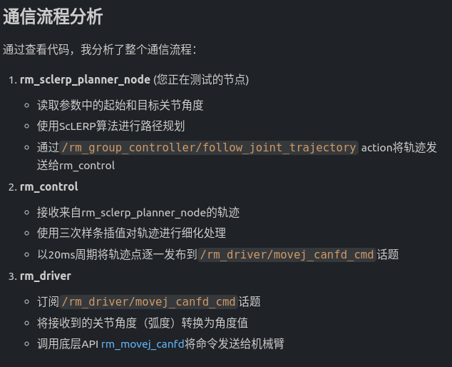

#### 分析：

##### rm_sclerp_planner_node 工作流程：生成轨迹数据并发布 🧩

`rm_sclerp_planner_node` 通过 `action` 发送轨迹给 `rm_control` 的详细实现

1. **Action客户端初始化**

在 RmSclerpPlannerNode 构造函数中，创建了与rm_control通信的action客户端：

```c++
// 创建action客户端，用于与rm_control通信
action_client_ptr_ = rclcpp_action::create_client<FollowJointTrajectory>(
    this->get_node_base_interface(),
    this->get_node_graph_interface(),
    this->get_node_logging_interface(),
    this->get_node_waitables_interface(),
    "/rm_group_controller/follow_joint_trajectory");
```

2. **等待Action服务器启动**

在 `timer_callback()` 函数中，等待 rm_control 的 action 服务器启动：

```cpp
// 等待action服务器启动
if (!action_client_ptr_->wait_for_action_server(std::chrono::seconds(1))) {
    RCLCPP_INFO(this->get_logger(), "等待rm_control的action服务器启动...");
    return;
}
```

3. **发送轨迹到rm_control**

在 `send_trajectory_to_control()` 函数中，将轨迹数据通过 `action` 发送给 `rm_control`：

```c++
void send_trajectory_to_control(const trajectory_msgs::msg::JointTrajectory & trajectory)
{
    // 创建目标消息
    auto goal_msg = FollowJointTrajectory::Goal();
    
    // 复制轨迹数据，包括位置、速度和加速度
    goal_msg.trajectory = trajectory;
    
    // 确保关节名称正确设置
    goal_msg.trajectory.joint_names = {"joint1", "joint2", "joint3", "joint4", "joint5", "joint6", "joint7"};
        
    // 确保轨迹点中包含速度和加速度数据
    for (auto & point : goal_msg.trajectory.points) {
        if (point.velocities.empty()) {
            point.velocities.resize(point.positions.size(), 0.0); // 默认速度为0
        }
        if (point.accelerations.empty()) {
            point.accelerations.resize(point.positions.size(), 0.0); // 默认加速度为0
        }
    }
    
    // 发送目标到action服务器
    RCLCPP_INFO(this->get_logger(), "发送轨迹到rm_control...");
    
    auto send_goal_options = rclcpp_action::Client<FollowJointTrajectory>::SendGoalOptions();
    send_goal_options.goal_response_callback = 
        [this](const GoalHandleFollowJointTrajectory::SharedPtr & goal_handle) {
            if (!goal_handle) {
                RCLCPP_ERROR(this->get_logger(), "目标被服务器拒绝");
            } else {
                RCLCPP_INFO(this->get_logger(), "目标被服务器接受，等待执行结果");
            }
        };
        
    send_goal_options.result_callback = 
        [this](const GoalHandleFollowJointTrajectory::WrappedResult & result) {
            switch (result.code) {
                case rclcpp_action::ResultCode::SUCCEEDED:
                    RCLCPP_INFO(this->get_logger(), "轨迹执行成功");
                    break;
                case rclcpp_action::ResultCode::ABORTED:
                    RCLCPP_ERROR(this->get_logger(), "目标被中止");
                    break;
                case rclcpp_action::ResultCode::CANCELED:
                    RCLCPP_ERROR(this->get_logger(), "目标被取消");
                    break;
                default:
                    RCLCPP_ERROR(this->get_logger(), "未知结果代码");
                    break;
            }
            rclcpp::shutdown();
        };

    auto goal_handle_future = action_client_ptr_->async_send_goal(goal_msg, send_goal_options);
}
```

4. **整体流程**

整个流程如下：

1. 在 `plan_and_execute` 函数中，使用 ScLERP 规划器生成完整的轨迹数据
2. 调用 `convertTrajectoryToJointTrajectory()` 函数将轨迹数据转换为 `JointTrajectory` 消息格式
3. 调用 `send_trajectory_to_control() 函数将轨迹发送给``rm_control`

5. Action**通信细节**

- **Action名称**：`/rm_group_controller/follow_joint_trajectory`
- **Action类型**：`control_msgs::action::FollowJointTrajectory`
- **通信方式**：异步发送目标，注册回调函数处理响应和结果

6. **轨迹数据完整性保证**

在发送轨迹之前，确保轨迹数据的完整性：

```c++
// 确保轨迹点中包含速度和加速度数据
for (auto & point : goal_msg.trajectory.points) {
    if (point.velocities.empty()) {
        point.velocities.resize(point.positions.size(), 0.0); // 默认速度为0
    }
    if (point.accelerations.empty()) {
        point.accelerations.resize(point.positions.size(), 0.0); // 默认加速度为0
    }
}
```

总结：

`rm_sclerp_planner_node` 通过以下步骤将轨迹发送给 `rm_control`：

- 创建与 rm_control 通信的 `action` 客户端
- 等待 `rm_control` 的 action 服务器启动
- 使用 ScLERP 规划器生成包含位置、速度和加速度的完整轨迹数据
- 将轨迹数据封装为 `FollowJointTrajectory::Goal` 消息
- 通过 async_send_goal() 异步发送轨迹到 `rm_control`
- 注册回调函数处理服务器响应和执行结果

这种设计实现了规划器与控制器的解耦，确保了系统的模块化和可扩展性


##### rm_control 工作流程：接受并处理轨迹数据再发布 🧩

`rm_control` 处理轨迹的详细实现

1. **接收轨迹数据**

`rm_control` 通过 `action` 服务接收来自 `rm_sclerp_planner_node` 的轨迹数据：

```c++
this->action_server_ = rclcpp_action::create_server<FollowJointTrajectory>(
            this, "/rm_group_controller/follow_joint_trajectory",
            std::bind(&Rm_Control::handle_goal, this, _1, _2),
            std::bind(&Rm_Control::handle_cancel, this, _1),
            std::bind(&Rm_Control::handle_accepted, this, _1));
```

当收到 `goal` 请求时，会调用 `execute_move` 函数处理轨迹数据：

```c++
void Rm_Control::execute_move(const std::shared_ptr<GoalHandleFJT> goal_handle)
{
    const auto goal = goal_handle->get_goal();
    int point_num = goal->trajectory.points.size();
    // ...
}
```

2. **三次样条插值处理**

当轨迹点数大于3时，`rm_control` 会使用三次样条插值进行细化处理：

```c++
/***********Start gubs 2021/9/16 修复Moveit在同一位姿重复规划执行导致rm_contorl异常停止的Bug***********/
if  (point_num > 3) //判断当moveit规划的路点数大于3时为有效规划并进行三次样条插值
{
    /* 各个关节位置 */
    double p_joint1[point_num];
    double p_joint2[point_num];
    // ... 其他关节变量定义

    for (i = 0; i < point_num; i++) 
    {
        // 提取轨迹点的位置、速度和加速度数据
        p_joint1[i] = goal->trajectory.points[i].positions[0];
        p_joint2[i] = goal->trajectory.points[i].positions[1];
        // ... 其他关节数据提取

        v_joint1[i] = goal->trajectory.points[i].velocities[0];
        v_joint2[i] = goal->trajectory.points[i].velocities[1];
        // ... 其他关节速度数据提取

        a_joint1[i] = goal->trajectory.points[i].accelerations[0];
        a_joint2[i] = goal->trajectory.points[i].accelerations[1];
        // ... 其他关节加速度数据提取

        time_from_start[i] = goal->trajectory.points[i].time_from_start.sec + goal->trajectory.points[i].time_from_start.nanosec/1e9;
    }

    cubicSpline spline;
    double max_time = time_from_start[point_num-1];
    time_from_start_.clear();

    // 对每个关节分别进行三次样条插值
    if (spline.loadData(time_from_start, p_joint1, point_num, 0, 0, cubicSpline::BoundType_First_Derivative))
    {
        p_joint1_.clear();
        v_joint1_.clear();
        a_joint1_.clear();
        x_out = -rate;
        while(x_out < max_time) {
            x_out += rate;
            spline.getYbyX(x_out, y_out);
            time_from_start_.push_back(x_out);  // 将新的时间存储，只需操作一次即可
            p_joint1_.push_back(y_out);
            v_joint1_.push_back(vel);
            a_joint1_.push_back(acc);
        }
        // ... 对其他关节进行同样的处理
    }
}
```

3. **以20ms周期发布轨迹点**

`rm_control` 使用定时器以 20ms 周期发布轨迹点到 `/rm_driver/movej_canfd_cmd` 话题：

```c++
// 定义20ms周期的定时器
State_Timer = this->create_wall_timer(std::chrono::milliseconds(20), 
    std::bind(&Rm_Control::timer_callback,this));

// 创建话题发布者
joint_pos_publisher = this->create_publisher<rm_ros_interfaces::msg::Jointpos>("/rm_driver/movej_canfd_cmd", qos);
```

(上述代码块位于 `xxx/ros2_rm_ws/src/ros2_rm_robot-humble/rm_control/src/rm_control.cpp`)


定时器回调函数 `timer_callback` 负责逐一发布轨迹点：

```c++
void Rm_Control::timer_callback()
{
    joint_msg.follow = follow_;
    
    if(point_changed)
    {
        if(p2.vector_cnt < p2.vector_len)
        {
            if(arm_type_ == 75)
            {
                joint_msg.joint[0] = p_joint1_.at(p2.vector_cnt);
                joint_msg.joint[1] = p_joint2_.at(p2.vector_cnt);
                joint_msg.joint[2] = p_joint3_.at(p2.vector_cnt);
                joint_msg.joint[3] = p_joint4_.at(p2.vector_cnt);
                joint_msg.joint[4] = p_joint5_.at(p2.vector_cnt);
                joint_msg.joint[5] = p_joint6_.at(p2.vector_cnt);
                joint_msg.joint[6] = p_joint7_.at(p2.vector_cnt);
                this->joint_pos_publisher->publish(joint_msg);
            }
            else
            {
                joint_msg.joint[0] = p_joint1_.at(p2.vector_cnt);
                joint_msg.joint[1] = p_joint2_.at(p2.vector_cnt);
                joint_msg.joint[2] = p_joint3_.at(p2.vector_cnt);
                joint_msg.joint[3] = p_joint4_.at(p2.vector_cnt);
                joint_msg.joint[4] = p_joint5_.at(p2.vector_cnt);
                joint_msg.joint[5] = p_joint6_.at(p2.vector_cnt);
                this->joint_pos_publisher->publish(joint_msg);
            }
            
            p2.vector_cnt++;
        }
        else
        {
            // 轨迹点发布完成后的处理
            if(count_final_joint <= count_keep_send)
            {
                // 发送最后的轨迹点几次以确保到位
                // ...
            }
            else
            {
                // 重置计数器，准备处理下一条轨迹
                count_final_joint = 0;
                p2.vector_cnt = 0;
                p2.vector_len = 0;
                point_changed = false;
            }
        }
    }
}
```

4. **三次样条插值算法实现**

三次样条插值在 `cubicSpline` 类中实现，主要方法包括：

```c++
// 加载数据并计算样条插值
bool cubicSpline::loadData(double *x_data, double *y_data, int count, double bound1, double bound2, BoundType type)
{
    // ...
    return spline(type);
}

// 计算样条插值
bool cubicSpline::spline(BoundType type)
{
    // 使用追赶法解方程求二阶偏导数
    // ...
}

// 根据插值结果计算给定x值对应的y值，以及速度和加速度
bool cubicSpline::getYbyX(double &x_in, double &y_out)
{
    // 二分法查找x所在区间段
    // 计算y值、速度和加速度
    // ...
}
```

**总结**

`rm_control` 的工作流程如下：

- 通过 action 服务接收来自 rm_sclerp_planner_node 的轨迹数据
- 当轨迹点数大于3时，使用三次样条插值算法对轨迹进行细化处理
- 将插值后的轨迹数据存储在全局变量中
- 通过 20ms 周期的定时器逐一发布轨迹点到 `/rm_driver/movej_canfd_cmd` 话题
- 每个轨迹点都包含7个关节的角度值，这些值由三次样条插值算法计算得出

这种设计确保了机械臂运动的平滑性和实时性，20ms 的发布周期与 `rm_driver` 的处理能力相匹配，保证了控制指令的及时传递。


##### rm_driver 工作流程：订阅话题并调用底层 API 🧩

1. **话题订阅初始化**

在`RmArm`构造函数中，通过以下代码订阅了`/rm_driver/movej_canfd_cmd`话题：

```c++
// 角度透传
Movej_CANFD_Cmd = this->create_subscription<rm_ros_interfaces::msg::Jointpos>("rm_driver/movej_canfd_cmd",rclcpp::ParametersQoS(),
    std::bind(&RmArm::Arm_Movej_CANFD_Callback,this,std::placeholders::_1),
    sub_opt4);
```

补充：`RmArm` 构造函数位置如下

```bash
xxx/ros2_rm_ws/src/ros2_rm_robot-humble/rm_driver/src/rm_driver.cpp
```


2. **回调函数处理**

当有消息发布到`/rm_driver/movej_canfd_cmd`话题时，会触发 `Arm_Movej_CANFD_Callback` 回调函数：

```c++
cppvoid RmArm::Arm_Movej_CANFD_Callback(rm_ros_interfaces::msg::Jointpos::SharedPtr msg)
{
    float joint[7];
    bool follow;
    float expand;
    int32_t res;
    int trajectory_mode;
    int radio;
    std_msgs::msg::UInt32 movej_CANFD_data;

    // 将接收到的关节角度（弧度）转换为角度值
    for(int i = 0; i < 6; i++)
    {
        joint[i] = msg->joint[i] * RAD_DEGREE;
    }
    if(msg->dof == 7)
    {
        joint[6] = msg->joint[6] * RAD_DEGREE;
    }

    follow = msg->follow;
    expand = msg->expand * RAD_DEGREE;
    trajectory_mode = trajectory_mode_;
    radio = radio_;
    
    // 调用底层API (rm_movej_canfd) 将命令发送给机械臂
    res = Rm_Api.rm_movej_canfd(robot_handle, joint, follow, expand, trajectory_mode, radio);
    
    movej_CANFD_data.data = res;
    if(movej_CANFD_data.data != 0)
    {
        RCLCPP_INFO (this->get_logger(),"Movej CANFD error code is %d\n",movej_CANFD_data.data);
    }
}
```


3. **底层API调用**

在回调函数中，通过以下代码调用底层API将命令发送给机械臂：

```c++
res = Rm_Api.rm_movej_canfd(robot_handle, joint, follow, expand, trajectory_mode, radio);
```

其中：

- `Rm_Api`是 RM_Service 类的实例

- `rm_movej_canfd`是底层 API 函数，用于发送关节角度命令

- `robot_handle`是机械臂的句柄

- `joint`是转换后的关节角度值（从弧度转换为角度）

- `follow`、`expand`、`trajectory_mode`、`radio`是其他控制参数

  

4. **弧度到角度的转换**

在回调函数中，通过以下代码将接收到的关节角度（弧度）转换为角度值：

```c++
// 将接收到的关节角度（弧度）转换为角度值
for(int i = 0; i < 6; i++)
{
    joint[i] = msg->joint[i] * RAD_DEGREE;
}
if(msg->dof == 7)
{
    joint[6] = msg->joint[6] * RAD_DEGREE;
}
```

其中 RAD_DEGREE 定义为：

```c++
#define RAD_DEGREE 57.295791433
```

这个常数是 180/π 的值，用于将弧度转换为角度。

**总结**

整个流程如下：

- rm_driver 订阅`/rm_driver/movej_canfd_cmd`话题
- 当有消息到达时，触发`Arm_Movej_CANFD_Callback` 回调函数
- 回调函数将接收到的关节角度（弧度）转换为角度值
- 调用底层API  `Rm_Api.rm_movej_canfd()`将命令发送给机械臂


### Q3：ROS2 节点程序编写规范问题

##### 执行节点，报错如下：

```bash
[rm_sclerp_planner_node_1-1] terminate called after throwing an instance of 'std::bad_weak_ptr' 
[rm_sclerp_planner_node_1-1] what(): bad_weak_ptr 
[ERROR] [rm_sclerp_planner_node_1-1]: process has died [pid 2689107, exit code -6, cmd '/home/byd/Documents/Projects/DualArmProjects/realmanRobot/ros2_rm_ws/install/rm_motion_planner/lib/rm_motion_planner/rm_sclerp_planner_node_1 --ros-args -r __node:=rm_sclerp_planner_node_1 --params-file /home/byd/Documents/Projects/DualArmProjects/realmanRobot/ros2_rm_ws/install/rm_motion_planner/share/rm_motion_planner/config/planner_params.yaml'].
```


A:

这个错误是由于在构造函数中调用 `initialize_planner` 导致的。在 ROS 2 节点构造函数中直接使用 `shared_from_this()` 会导致 `std::bad_weak_ptr` 异常，因为此时节点对象还没有完全构造完成。

看起来在类定义中重复声明了 `init_timer_` 成员变量。让我修复这个问题：

删除重复的 `init_timer_`声明

重新编译 `rm_motion_planner` 包

```
cd /home/byd/Documents/Projects/DualArmProjects/realmanRobot/ros2_rm_ws && colcon build --packages-select rm_motion_planner
```

很好！现在编译已经成功完成。让我们总结一下我们所做的修改：

1. 我们修复了类定义中重复的 `init_timer_` 成员变量声明问题
2. 我们将 `initialize_planner()` 调用从构造函数中移除，改为使用定时器延迟初始化，以避免 `std::bad_weak_ptr` 异常
3. 我们确保了订阅者类型的一致性，都使用 `sensor_msgs::msg::JointState`

现在您可以尝试重新运行节点，应该不会再出现之前的 `std::bad_weak_ptr` 错误了。

这些修改解决了以下问题：

1. **初始化问题**：通过延迟初始化避免在构造函数中使用 `shared_from_this()`
2. **类型一致性**：确保所有相关变量和函数使用一致的消息类型
3. **重复声明**：清理了类定义中重复的成员变量声明

现在节点应该能够正常启动并运行了。


##### 修改后的类实现如下：

```c++
class RmSclerpPlannerNode1 : public rclcpp::Node
{
public:
    using FollowJointTrajectory = control_msgs::action::FollowJointTrajectory;
    using GoalHandleFollowJointTrajectory = rclcpp_action::ClientGoalHandle<FollowJointTrajectory>;

    explicit RmSclerpPlannerNode1(const rclcpp::NodeOptions & options = rclcpp::NodeOptions())
    : Node("rm_sclerp_planner_node_1", options)
    {
        // 声明参数
        this->declare_parameter<std::string>("start_joint_positions", "0.0,0.0,0.0,0.0,0.0,0.0,0.0");
        this->declare_parameter<std::string>("target_joint_positions", "0.1,0.1,0.1,0.1,0.1,0.1,0.1");
        this->declare_parameter<std::string>("urdf_path", "");
        
        // 创建发布者，用于直接向rm_driver发送轨迹点
        joint_pos_publisher_ = this->create_publisher<rm_ros_interfaces::msg::Jointpos>(
            "/rm_driver/movej_canfd_cmd", 10);
            
        // 创建订阅者，用于获取当前关节位置
        // 修改订阅话题为/joint_states，这是rm_driver实际发布关节状态的话题
        joint_state_subscriber_ = this->create_subscription<sensor_msgs::msg::JointState>(
            "/joint_states", 10,
            std::bind(&RmSclerpPlannerNode1::joint_state_callback, this, std::placeholders::_1));

        // 创建定时器，用于周期性检查和执行任务
        timer_ = this->create_wall_timer(
            std::chrono::milliseconds(100),  // 100ms检查一次
            std::bind(&RmSclerpPlannerNode1::timer_callback, this));

        // 创建10ms定时器用于发布轨迹点
        trajectory_timer_ = this->create_wall_timer(
            std::chrono::milliseconds(20),
            std::bind(&RmSclerpPlannerNode1::trajectory_timer_callback, this));
        
        // 初始化轨迹点索引
        trajectory_point_index_ = 0;
        trajectory_executing_ = false;
        
        // 初始化 current_joint_positions_
        current_joint_positions_.fill(0.0);

        RCLCPP_INFO(this->get_logger(), "rm_sclerp_planner_node_1节点已经启动.");
        
        // 初始化规划器
        initialize_planner();
    }

private:
    // ScLERP规划器接口实例
    std::unique_ptr<sclerp_interface::ScLERPInterface> planner_interface_;
    
    // 发布者：用于发布关节轨迹点到rm_driver
    rclcpp::Publisher<rm_ros_interfaces::msg::Jointpos>::SharedPtr joint_pos_publisher_;
    
    // 订阅者：用于订阅当前关节状态
    rclcpp::Subscription<sensor_msgs::msg::JointState>::SharedPtr joint_state_subscriber_;
    
    // 定时器：用于定期执行规划和控制任务
    rclcpp::TimerBase::SharedPtr timer_;
    
    // 初始化定时器
    rclcpp::TimerBase::SharedPtr init_timer_;
    
    // 规划的轨迹
    trajectory_msgs::msg::JointTrajectory planned_trajectory_;
    
    // 轨迹执行相关变量
    bool trajectory_executing_ = false;
    size_t trajectory_point_index_ = 0;
    
    // 轨迹定时器：用于发布轨迹点
    rclcpp::TimerBase::SharedPtr trajectory_timer_;
    
    // 当前关节位置（从/joint_states话题获取）
    std::array<double, 7> current_joint_positions_;
    std::mutex joint_state_mutex_;  // 保护current_joint_positions_的互斥量
    
    .......
    
```


##### 按照上述修改后编译执行节点，报错依旧

​        执行编译后的节点，新的报错如下为

```bash
[ERROR] [rm_sclerp_planner_node_1-1]: process has died [pid 2728610, exit code -11, cmd '/home/byd/Documents/Projects/DualArmProjects/realmanRobot/ros2_rm_ws/install/rm_motion_planner/lib/rm_motion_planner/rm_sclerp_planner_node_1 --ros-args -r __node:=rm_sclerp_planner_node_1 --params-file /home/byd/Documents/Projects/DualArmProjects/realmanRobot/ros2_rm_ws/install/rm_motion_planner/share/rm_motion_planner/config/planner_params.yaml'].
```

​    


> 类中的 private 部分定义的规划器，发布者，订阅者，定时器，轨迹和轨迹定时器是否与 public 中的功能重合了？不是最佳实践？

在ROS 2的节点类设计中，将成员变量（如planner_interface_、发布者、订阅者、定时器等）放在private部分是**标准且推荐的做法**，原因如下：

**为什么将这些成员变量放在private部分是最佳实践**：

1. **封装原则**：
   - 这些成员变量是类的内部实现细节，不应该被外部直接访问
   - 通过private访问控制，可以防止外部代码意外修改这些关键组件
2. **ROS 2标准模式**：
   - 在ROS 2中，节点类通常将发布者、订阅者、定时器等作为private成员变量
   - 这些组件通过回调函数和类方法进行操作，而不是直接暴露给外部
3. **功能分离**：
   - public部分包含构造函数和可能的公共接口方法
   - private部分包含实现细节和内部状态管理

当前设计是合理且符合最佳实践的.

**为什么这种设计是正确的：**

1. **符合C++封装原则**：
   - 成员变量（如planner_interface_、发布者、订阅者等）作为private成员是标准做法
   - 这些是类的内部实现细节，不应该被外部直接访问
2. **public和private部分功能明确分离**：
   - **public部分**：构造函数和可能的公共接口方法
   - **private部分**：实现细节和内部状态管理
3. **ROS 2标准模式**：
   - 在ROS 2中，节点类通常将发布者、订阅者、定时器等作为private成员变量
   - 这些组件通过回调函数和类方法进行操作，而不是直接暴露给外部
4. **没有功能重合**：
   - public部分主要负责初始化和提供公共接口
   - private部分存储内部状态和组件引用
   - 两者职责分明，没有重合

具体分析：

- **planner_interface_**：作为private成员，只在类内部使用，通过public方法调用其功能
- **发布者和订阅者**：在构造函数中创建并保存为private成员，通过回调函数和方法使用
- **定时器**：在构造函数中创建，通过回调函数执行相关逻辑
- **轨迹相关变量**：作为内部状态管理，不直接暴露给外部

**结论：**

当前的设计**不是**功能重合，而是**良好的封装设计**。将这些组件放在private部分是ROS 2开发中的标准做法，有助于：

1. 保护内部实现细节
2. 防止外部代码意外修改关键组件
3. 提高代码的可维护性和可读性
4. 符合面向对象编程的封装原则

这种设计模式在ROS 2官方示例和大多数开源ROS 2项目中都能看到，是推荐的最佳实践。


### Q4：movej_canfd_cmd 透传实现细节

> 已知：rm_sclerp_planner_node_1中 所有通过movej_canfd_cmd话题发送的命令都使用相同的trajectory_mode_和radio_参数，这些参数是在驱动程序初始化时设置的默认值。
>
> 有如下疑问：
>
> 1） "rm_driver/movej_canfd_cmd" 话题在哪里可以看到源码？
>
> 2）rm_sclerp_planner_node_1直接发布到`/rm_driver/movej_canfd_cmd`话题时，rm_movej_canfd函数中的 follow， trajectory_mode, radio 参数的值是？
>
> 请贴出具体的代码实现加以说明


**1. `/rm_driver/movej_canfd_cmd` 话题源码位置**

该话题的订阅者实现在 rm_driver 包中：

文件路径：`/home/byd/Documents/Projects/DualArmProjects/realmanRobot/ros2_rm_ws/src/ros2_rm_robot-humble/rm_driver/src/rm_driver.cpp`

订阅代码：

```cpp
Movej_CANFD_Cmd = this->create_subscription<rm_ros_interfaces::msg::Jointpos>("rm_driver/movej_canfd_cmd",rclcpp::ParametersQoS(),
        std::bind(&RmArm::Arm_Movej_CANFD_Callback,this,std::placeholders::_1),
        sub_opt4);
```

**2. rm_sclerp_planner_node_1 发布到 `/rm_driver/movej_canfd_cmd` 话题时各参数的值**

在 rm_sclerp_planner_node_1.cpp 的 `trajectory_timer_callback()` 函数中，节点会发布 `Jointpos` 消息到 `/rm_driver/movej_canfd_cmd` 话题。发布时各参数的值如下：

```cpp
auto joint_msg = rm_ros_interfaces::msg::Jointpos();
joint_msg.dof = 7;              // 自由度设置为7
joint_msg.follow = true;        // 跟随模式设置为true
joint_msg.expand = 0.0;         // 扩展参数设置为0.0

// 关节位置从规划的轨迹点中获取
joint_msg.joint.assign(point.positions.begin(), point.positions.begin() + 7);
```

**3. rm_driver 如何处理 `/rm_driver/movej_canfd_cmd` 话题并调用底层 API**

在 rm_driver.cpp 中，`Arm_Movej_CANFD_Callback` 函数处理接收到的消息：

```c++
void RmArm::Arm_Movej_CANFD_Callback(rm_ros_interfaces::msg::Jointpos::SharedPtr msg)
{
    float joint[7];
    bool follow;
    float expand;
    int32_t res;
    int trajectory_mode;
    int radio;
    std_msgs::msg::UInt32 movej_CANFD_data;

    // 将关节角度从弧度转换为角度
    for(int i = 0; i < 6; i++)
    {
        joint[i] = msg->joint[i] * RAD_DEGREE;
    }
    if(msg->dof == 7)
    {
        joint[6] = msg->joint[6] * RAD_DEGREE;
    }

    // 获取消息中的参数
    follow = msg->follow;
    expand = msg->expand * RAD_DEGREE;
    
    // 注意：trajectory_mode 和 radio 参数使用的是 rm_driver 节点中的默认值，
    // 而不是从消息中获取的
    trajectory_mode = trajectory_mode_;  // 默认值为0
    radio = radio_;                      // 默认值为50

    // 调用底层API
    res = Rm_Api.rm_movej_canfd(robot_handle, joint, follow, expand, trajectory_mode, radio);
    
    // 处理结果
    movej_CANFD_data.data = res;
    if(movej_CANFD_data.data != 0)
    {
        RCLCPP_INFO (this->get_logger(),"Movej CANFD error code is %d\n",movej_CANFD_data.data);
    }
}
```

在 rm_driver.h 中，`trajectory_mode_` 和 `radio_` 的默认值定义如下：

```cpp
int trajectory_mode_ = 0;
int radio_ = 50; 
```

**总结**

1. **`/rm_driver/movej_canfd_cmd` 话题源码**：订阅实现在 `rm_driver/src/rm_driver.cpp` 文件中。
2. **`rm_sclerp_planner_node_1` 发布的参数值**：
   - `dof`: 7 (固定值)
   - `follow`: true (固定值)
   - `expand`: 0.0 (固定值)
   - `joint`: 从规划轨迹点中获取的关节角度值
3. **`rm_driver` 处理流程**：
   - 接收 `Jointpos` 消息
   - 将关节角度从弧度转换为角度
   - 提取 `follow` 和 `expand` 参数
   - 使用节点内部默认值设置 `trajectory_mode` (0) 和 `radio` (50)
   - 调用底层 API `Rm_Api.rm_movej_canfd` 发送命令给机械臂

需要注意的是，虽然 `Jointpos` 消息类型包含 `trajectory_mode` 和 `radio` 字段，但在当前的 `rm_driver` 实现中，这些值并未从消息中提取，而是使用了节点内部的默认值。


#### Q4.1：rm_sclerp_planner_node_1 到机械臂的数据传递流程

> 在 rm_sclerp_planner_node_1 节点通过发布轨迹点数据到 movej_canfd_cmd 话题上, 再由rm_driver 订阅该话题数据并以透传 CANFD 的方式驱动机械臂运动的这个过程中， movej_canfd_cmd 话题，rm_movej_canfd 函数，以及 Arm_Movej_CANFD_Callback 函数之间的一个调用关系或者数据传递流程是怎样的？请贴出代码实现以纤细说明


1. ##### 数据传递流程概述

```
rm_sclerp_planner_node_1 → /rm_driver/movej_canfd_cmd话题 → rm_driver::Arm_Movej_CANFD_Callback → rm_movej_canfd → 机械臂
```


2. ##### 详细代码实现

2.1 rm_sclerp_planner_node_1 发布轨迹点

在 rm_sclerp_planner_node_1.cpp 中创建发布者：

```cpp
// 创建发布者，用于直接向rm_driver发送轨迹点
joint_pos_publisher_ = this->create_publisher<rm_ros_interfaces::msg::Jointpos>(
    "/rm_driver/movej_canfd_cmd", 10);
```

在 `trajectory_timer_callback` 中发布轨迹点：

```cpp
// 创建消息并填充数据
auto joint_msg = rm_ros_interfaces::msg::Jointpos();
joint_msg.dof = 7;
joint_msg.follow = true;
joint_msg.expand = 0.0;

// 填充关节位置数据
if (point.positions.size() >= 7) {
    joint_msg.joint.assign(point.positions.begin(), point.positions.begin() + 7);
    
    // 发布消息
    joint_pos_publisher_->publish(joint_msg);
}
```

2.2 rm_driver 订阅话题

在 rm_driver.cpp 中创建订阅者：

```cpp
// 角度透传
Movej_CANFD_Cmd = this->create_subscription<rm_ros_interfaces::msg::Jointpos>("rm_driver/movej_canfd_cmd",rclcpp::ParametersQoS(),
    std::bind(&RmArm::Arm_Movej_CANFD_Callback,this,std::placeholders::_1),
    sub_opt4);
```

2.3 Arm_Movej_CANFD_Callback 处理

在 rm_driver.cpp 中的回调函数：

```cpp
void RmArm::Arm_Movej_CANFD_Callback(rm_ros_interfaces::msg::Jointpos::SharedPtr msg)
{
    float joint[7];
    bool follow;
    float expand;
    int32_t res;
    int trajectory_mode;
    int radio;
    std_msgs::msg::UInt32 movej_CANFD_data;
    
    // 将接收到的关节角度（弧度）转换为角度值
    for(int i = 0; i < 6; i++)
    {
        joint[i] = msg->joint[i] * RAD_DEGREE;
    }
    if(msg->dof == 7)
    {
        joint[6] = msg->joint[6] * RAD_DEGREE;
    }
    
    follow = msg->follow;
    expand = msg->expand * RAD_DEGREE;
    trajectory_mode = trajectory_mode_;
    radio = radio_;
    
    // 调用底层API (rm_movej_canfd) 将命令发送给机械臂
    res = Rm_Api.rm_movej_canfd(robot_handle, joint, follow, expand, trajectory_mode, radio);
    
    movej_CANFD_data.data = res;
    if(movej_CANFD_data.data != 0)
    {
        RCLCPP_INFO (this->get_logger(),"Movej CANFD error code is %d\n",movej_CANFD_data.data);
    }
}
```

3. ##### 数据传递过程详解

1）**轨迹点发布**：

- `rm_sclerp_planner_node_1` 以 20ms 周期发布 `Jointpos` 消息到 `/rm_driver/movej_canfd_cmd` 话题
- 每个消息包含 7 个关节的角度值（弧度）

2）**消息接收**：

- `rm_driver` 订阅该话题，收到消息后触发 Arm_Movej_CANFD_Callback 回调函数
- 回调函数接收到的 `msg` 包含关节角度数组、跟随标志、扩展角度等参数

3）**单位转换**：

- 将关节角度从弧度转换为角度（乘以 RAD_DEGREE = 57.295791433）
- 6自由度机械臂处理前6个关节，7自由度额外处理第7个关节

4）**底层调用**：

- 调用 `Rm_Api.rm_movej_canfd` 函数将命令发送给机械臂
- 传入转换后的角度值和其他控制参数

5）**错误处理**：

- 检查返回值，如果非零则输出错误信息

这个流程实现了从运动规划器到机械臂的直接控制，绕过了传统的 `rm_control` 节点，提高了响应速度和控制精度。

##### 4. 参数值说明

1. **follow 参数**：
   - 从消息中获取：`follow = msg->follow`
   - 在 rm_sclerp_planner_node_1 中设置为固定值：`joint_msg.follow = true`
2. **trajectory_mode 参数**：
   - 使用 rm_driver 中的默认值：`trajectory_mode = trajectory_mode_`
   - 默认值在 rm_driver 初始化时设置，通常为 0（完全透传模式）
3. **radio 参数**：
   - 使用 rm_driver 中的默认值：`radio = radio_`
   - 默认值在 rm_driver 初始化时设置，通常为 50

这个流程实现了从运动规划器到机械臂的直接控制，绕过了传统的 rm_control 节点，提高了响应速度和控制精度。


#### Q4.2：回调函数详解：Arm_Movej_CANFD_Callback

> rm_driver.cpp 中的回调函数 Arm_Movej_CANFD_Callback ，是在有数据发布到 /rm_driver/movej_canfd_cmd 话题上后就被触发吗？回调函数的“回调”具体是怎么个意思？请通俗的介绍以下回调函数这个语法/功能概念，以及它在当前节点实现中的应用说明


##### 1. 回调函数的基本概念

回调函数（Callback Function）是一种特殊的函数，它作为参数传递给另一个函数，并在特定事件发生时被"调用回来"。就像你订了一个外卖，商家会在餐品准备好后"回电"通知你取餐一样。

##### 2. Arm_Movej_CANFD_Callback 的触发机制

是的，当有数据发布到 `/rm_driver/movej_canfd_cmd` 话题上时，`Arm_Movej_CANFD_Callback` 函数就会被自动触发。这个机制是通过 < ROS2 的订阅者（Subscriber）>实现的：

```cpp
// 在 rm_driver.cpp 中创建订阅者
Movej_CANFD_Cmd = this->create_subscription<rm_ros_interfaces::msg::Jointpos>(
    "rm_driver/movej_canfd_cmd",  // 要订阅的话题名称
    rclcpp::ParametersQoS(),       // 服务质量
    std::bind(&RmArm::Arm_Movej_CANFD_Callback, this, std::placeholders::_1)  // 回调函数
);
```

##### 3. 回调函数的工作流程

1. **订阅设置**：
   - `rm_driver` 节点创建一个订阅者，监听 `/rm_driver/movej_canfd_cmd` 话题
   - 指定当收到消息时调用 `Arm_Movej_CANFD_Callback` 函数

2. **消息到达**：
   - 当有其他节点（如 `rm_sclerp_planner_node_1`）发布消息到该话题时
   - ROS2 框架自动接收到消息

3. **回调触发**：
   - ROS2 框架自动调用预先注册的回调函数
   - 将收到的消息作为参数传递给回调函数

##### 4. 回调函数的具体实现

```cpp
void RmArm::Arm_Movej_CANFD_Callback(rm_ros_interfaces::msg::Jointpos::SharedPtr msg)
{
    // 1. 数据处理：将接收到的关节角度（弧度）转换为角度值
    float joint[7];
    for(int i = 0; i < 6; i++)
    {
        joint[i] = msg->joint[i] * RAD_DEGREE;  // 弧度转角度
    }
    if(msg->dof == 7)
    {
        joint[6] = msg->joint[6] * RAD_DEGREE;
    }

    // 2. 提取其他控制参数
    bool follow = msg->follow;
    float expand = msg->expand * RAD_DEGREE;
    int trajectory_mode = trajectory_mode_;
    int radio = radio_;

    // 3. 调用底层API发送命令给机械臂
    int32_t res = Rm_Api.rm_movej_canfd(robot_handle, joint, follow, expand, trajectory_mode, radio);
    
    // 4. 错误处理
    if(res != 0)
    {
        RCLCPP_INFO(this->get_logger(), "Movej CANFD error code is %d\n", res);
    }
}
```

##### 5. 回调函数的优势

1. **异步处理**：
   - 主程序不需要阻塞等待消息
   - 可以继续执行其他任务

2. **事件驱动**：
   - 只有在特定事件（收到消息）发生时才执行
   - 提高了程序的响应性和效率

3. **解耦合**：
   - 发布者和订阅者不需要知道对方的存在
   - 通过话题机制实现松耦合通信

##### 6. 实际应用场景

在这个项目中，回调机制实现了以下流程：

```
rm_sclerp_planner_node_1 → /rm_driver/movej_canfd_cmd话题 → rm_driver::Arm_Movej_CANFD_Callback → 机械臂控制
```

- rm_sclerp_planner_node_1 定期发布轨迹点
- rm_driver 通过订阅收到这些点
- 回调函数处理每个轨迹点并控制机械臂运动
- 实现了高效、实时的运动控制

这种回调机制使得整个系统可以高效地处理实时的运动控制任务，而不需要轮询检查是否有新的控制指令。


#### Q4.3：`rm_driver/movej_canfd_cmd`话题以及参数值的问题。

关于`rm_driver/movej_canfd_cmd`话题以及参数值的问题。

##### 1)  rm_driver/movej_canfd_cmd 话题源码位置

在 ROS2 的 RealMan 机械臂驱动程序中，rm_driver/movej_canfd_cmd 话题的订阅和处理代码位于 rm_driver 包中。

具体来说：

1. 话题订阅代码在 `/src/ros2_rm_robot-humble/rm_driver/src/rm_driver.cpp` 文件中，大约在第2322行：

```cpp
Movej_CANFD_Cmd = this->create_subscription<rm_ros_interfaces::msg::Jointpos>("rm_driver/movej_canfd_cmd",rclcpp::ParametersQoS(),
    std::bind(&RmArm::Arm_Movej_CANFD_Callback,this,std::placeholders::_1),
    sub_opt4);
```

1. 消息处理回调函数 `Arm_Movej_CANFD_Callback` 定义在 `/src/ros2_rm_robot-humble/rm_driver/src/rm_driver.cpp` 文件中，大约在第282行：

```c++
void RmArm::Arm_Movej_CANFD_Callback(rm_ros_interfaces::msg::Jointpos::SharedPtr msg)
{
    float joint[7];
    bool follow;
    float expand;
    int32_t res;
    int trajectory_mode;
    int radio;
    std_msgs::msg::UInt32 movej_CANFD_data;

    for(int i = 0; i < 6; i++)
    {
        joint[i] = msg->joint[i] * RAD_DEGREE;
    }
    if(msg->dof == 7)
    {
        joint[6] = msg->joint[6] * RAD_DEGREE;
    }

    follow = msg->follow;
    expand = msg->expand * RAD_DEGREE;
    trajectory_mode = trajectory_mode_;
    radio = radio_;
    //std::cout<<"Service_Movej_CANFD_With_Radio is run!!!!"<<std::endl;
    // res = Rm_Api.Service_Movej_CANFD_With_Radio(m_sockhand, joint, follow, expand, trajectory_mode, radio);
    res = Rm_Api.rm_movej_canfd(robot_handle, joint, follow, expand, trajectory_mode, radio);
    
    movej_CANFD_data.data = res;
    if(movej_CANFD_data.data != 0)
    {
        RCLCPP_INFO (this->get_logger(),"Movej CANFD error code is %d\n",movej_CANFD_data.data);
    }
}
```

##### 2) rm_movej_canfd 函数中的 follow， trajectory_mode, radio 参数的值

根据源码分析，当 `rm_sclerp_planner_node_1` 直接发布到`/rm_driver/movej_canfd_cmd`话题时，`rm_movej_canfd` 函数中各参数的值如下：

1. **follow参数**：
   - 从消息中获取：`follow = msg->follow;`
   - 这个值直接来自发布到话题的消息中的 follow 字段
2. **trajectory_mode参数**：
   - 从类成员变量获取：`trajectory_mode = trajectory_mode_;`
   - 这个值不是从消息中获取的，而是使用rm_driver节点初始化时设置的默认值
3. **radio参数**：
   - 从类成员变量获取：`radio = radio_;`
   - 这个值同样不是从消息中获取的，而是使用rm_driver节点初始化时设置的默认值

在 rm_driver.h 文件中，这两个参数的默认值定义如下：

```c++
int trajectory_mode_ = 0;
int radio_ = 50;
```

因此，无论 rm_sclerp_planner_node_1 发送什么内容到`/rm_driver/movej_canfd_cmd`话题，只要使用的是标准的rm_driver 节点，rm_movej_canfd 函数中的 trajectory_mode 参数始终为 0，radio 参数始终为 50。

这正如您提到的：" rm_sclerp_planner_node_1 中所有通过 movej_canfd_cmd 话题发送的命令都使用相同的trajectory_mode_ 和 radio 参数，这些参数是在驱动程序初始化时设置的默认值。"

##### 总结

1. rm_driver/movej_canfd_cmd 话题的源码位于 rm_driver 包中，具体在 rm_driver.cpp 文件中
2. 当 rm_sclerp_planner_node_1 发布到该话题时：
   - follow 参数从消息中获取
   - trajectory_mode 参数使用默认值 0
   - radio 参数使用默认值 50

这解释了为什么所有通过该话题发送的命令都使用相同的 trajectory_mode 和 radio 参数。

------


## 临时🚥


请帮我实现上述几点改动


1. 分析 sclerp_interface.cpp 代码可知`ScLERPInterface::solve `：用于规划单阶段的关节轨迹。它根据初始关节值和目标末端位姿，调用底层运动规划器（如 `kinlib_solver_`）生成一条关节轨迹


已知realman 机械臂的控制方式之一为： 通过 rm_driver 订阅 /rm_driver/movej_canfd_cmd 话题, 将接收到的关节角度（弧度）转换为角度值, 调用底层 API (rm_movej_canfd) 将命令发送给机械臂


前述回答中提及 rm_driver 是通过订阅 /rm_driver/movej_canfd_cmd 话题, 将接收到的关节角度（弧度）转换为角度值, 调用底层 API (rm_movej_canfd) 将命令发送给机械臂，控制机械臂运动。

请贴出详细的代码说明 rm_driver 是如何订阅 /rm_driver/movej_canfd_cmd 话题, 以及调用底层 API (rm_movej_canfd) 将命令发送给机械臂的。


请贴出详细的代码实现来说明： rm_control 接收来自 rm_sclerp_planner_node 的轨迹 ，使用三次样条插值对轨迹进行细化处理, 以 20ms 周期将轨迹点逐一发布到 /rm_driver/movej_canfd_cmd 话题 


请贴出详细的代码实现来说明：rm_sclerp_planner_node 通过 /rm_group_controller/follow_joint_trajectory action 将轨迹发送给 rm_control 


------------------------------------------------------------------------------

1. 已知：

1)在节点源文件（rm_sclerp_planner_node_1.cpp) 中，轨迹点的计算流程为：先由目标关节角度 jointAngles_target 传入机械臂自身的正运动学接口函数 compute_fk_rm_api 中计算得到目标位姿 rm_pose_ ，再将目标位姿 rm_pose_  传入 tcpPose2HomogenMatrix 中获得目标关节角度对应的齐次变换矩阵 matrix_base2tcp_target，再将 matrix_base2tcp_target 输入规划器接口 solve 函数中计算得轨迹点 joint_trajectory，然后进行插值处理，最后通过话题发布给 rm_75_driver 执行轨迹点


------------------------------------------------------------------------------------------------------------------------------------------------------------------------------


------------------------------------------------------------------------------------------------------------------------------


------------------------------------------------------------------------------------------------------------------------------------------------------------

2025/08/24

已知节点之前实现机械臂执行轨迹的方法是是在节点的构造函数 RmSclerpPlannerNode1 中创建频率为20ms的话题发布者和订阅者，具体如下

public:

explicit RmSclerpPlannerNode1(const rclcpp::NodeOptions & options = rclcpp::NodeOptions())
    : Node("rm_sclerp_planner_node_1", options)
    {

// 声明参数

this->declare_parameter<std::string>("start_joint_positions", "0.0,0.0,0.0,0.0,0.0,0.0,0.0");

this->declare_parameter<std::string>("target_joint_positions", "0.1,0.1,0.1,0.1,0.1,0.1,0.1");

this->declare_parameter<std::string>("urdf_path", "");

// 创建发布者，用于直接向rm_driver发送轨迹点

joint_pos_publisher_ = this->create_publisher< rm_ros_interfaces::msg::Jointpos >(

"/rm_driver/movej_canfd_cmd", 20);

​            

// 创建订阅者，用于获取当前关节位置

// 修改订阅话题为 /joint_states，这是rm_driver实际发布关节状态的话题

joint_state_subscriber_ = this->create_subscription< sensor_msgs::msg::JointState >(

"/joint_states", 20,

std::bind(&RmSclerpPlannerNode1::joint_state_callback, this, std::placeholders::_1));

// 创建定时器，用于周期性检查和执行任务

 timer_ = this->create_wall_timer(

std::chrono::milliseconds(100),  // 100ms检查一次

std::bind(&RmSclerpPlannerNode1::timer_callback, this));

 // 创建20ms定时器用于发布轨迹点，与插值频率(50Hz)更好地匹配

trajectory_timer_ = this->create_wall_timer(

std::chrono::milliseconds(20),

std::bind(&RmSclerpPlannerNode1::trajectory_timer_callback, this));


而方案1：增加轨迹执行频率——修改轨迹执行定时器周期，从20ms改为根据参数设置；在节点中新增如下代码

// 创建10ms定时器用于发布轨迹点，提高轨迹执行频率

 int execution_rate; this->get_parameter("trajectory_execution_rate", execution_rate); 

auto timer_period = std::chrono::microseconds(1000000 / execution_rate); 

trajectory_timer_ = this->create_wall_timer(timer_period, std::bind(&RmSclerpPlannerNode1::trajectory_timer_callback, this));

同时


上述方案通过参数化配置（方案3和4），允许用户根据需要调整性能，我该如何自定义参数？是要在运行节点时输入这两个频率参数还是在 planner_params.yaml 设定参数名称和数值？


------------------------------------------------------------------------------------------------------------------------------


