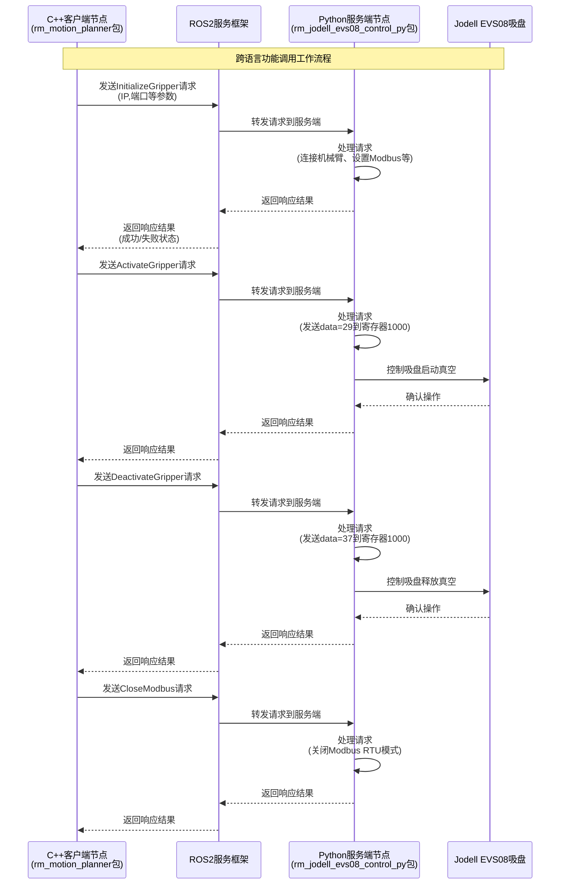
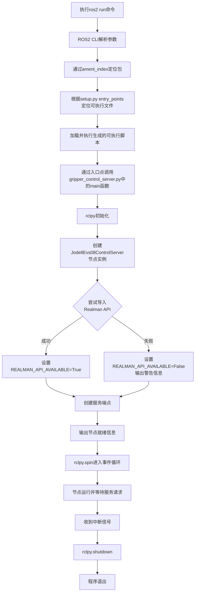
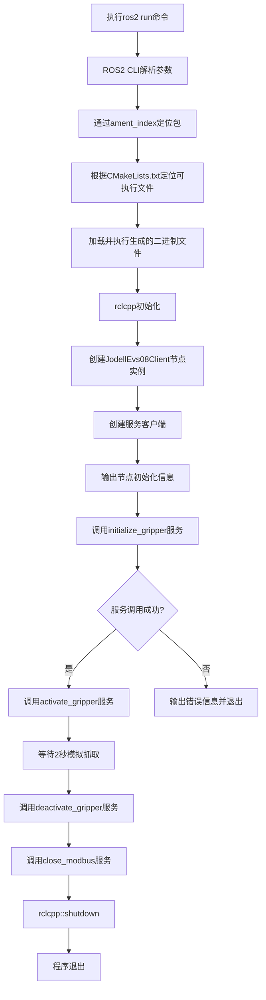

# Jodell Evs08 电吸盘开发记录

## 技术方案

------

### 背景

> 请参考网页 https://bbs.realman-robotics.cn/question/139.html， 和 下述说明书
>
> /home/byd/Documents/Projects/DualArmProjects/realmanRobot/ros2_rm_ws/third_party/Jodell_EVS08/JODELL钧舵EVS08系列电动吸盘通用详细说明书V1.1.pdf
>
> 分析控制一个集成到机械臂末端的Jodell EVS08 真空吸盘是否必须需要 .so 动态链接库文件，若是没有该如何解决

让我分析一下Jodell EVS08真空吸盘的控制方式，特别是是否需要.so动态链接库文件。

通过查看提供的文件内容，我可以了解到以下几点：

1. 这个项目是一个ROS2包，用于集成Jodell EVS08库，主要是为了控制睿尔曼机械臂。

2. 从[README.md](javascript:void(0))文件中可以看出，这个库提供了API来控制机械臂，包括连接、发送运动命令、读取状态和力控操作等功能。

3. 在[test_api.cpp](javascript:void(0))文件中，我们可以看到测试程序包含了[jodell_evs08_api.h](javascript:void(0))和[jodell_evs08_define.h](javascript:void(0))头文件，并调用了[API_Version()](javascript:void(0))函数。

4. 在 mainwindow.cpp 中，可以看到使用了

   ```
   Write_Single_Register
   ```

   函数来控制吸盘，例如：

   ```cpp
   Write_Single_Register(m_sockhand,1,1000,29,9,1);//吸盘通道1启动
   Write_Single_Register(m_sockhand,1,1000,109,9,1);//吸盘通道2启动
   Write_Single_Register(m_sockhand,1,1000,37,9,1);//全部通道破真空
   ```

从这些信息来看，控制EVS08吸盘主要通过写寄存器的方式实现，这通常需要与机械臂控制器通信。

分析是否需要`.so`动态链接库文件：

1. 从[package.xml](javascript:void(0))文件可以看出，这是一个ament_cmake类型的包，意味着它需要被编译。

2. 在[jodell_evs08_api_global.h](javascript:void(0))文件中，可以看到有平台相关的定义：

   ```cpp
   #ifdef __linux
   #define JODELL_EVS08_APISHARED_EXPORT
   #endif
   
   #if _WIN32
   #if defined(JODELL_EVS08_API_LIBRARY)
   #define JODELL_EVS08_APISHARED_EXPORT __declspec(dllexport)
   #else
   #define JODELL_EVS08_APISHARED_EXPORT __declspec(dllimport)
   #endif
   #endif
   ```

3. 在[rm_api.h](javascript:void(0))文件中，可以看到`Write_Single_Register`函数的定义：

   ```cpp
   RM_APISHARED_EXPORT int Write_Single_Register(SOCKHANDLE ArmSocket, int port,int address,int data,int device,bool block);
   ```

根据以上分析，控制Jodell EVS08真空吸盘需要与机械臂通信，而与机械臂通信需要相应的库文件支持。从代码结构来看，确实需要`.so`动态链接库文件或者相应的静态库文件。


如果没有.so动态链接库文件，可以考虑以下解决方案：

1. 通过Modbus RTU或TCP协议直接控制吸盘（如果吸盘支持独立通信）
2. 通过机械臂控制器提供的通用IO接口控制吸盘
3. 编写自定义的通信接口来替代缺失的库文

控制EVS08吸盘主要通过`Write_Single_Register`函数进行，这是通过机械臂控制器的通信接口实现的。吸盘本身连接到机械臂末端，通过机械臂控制器进行控制，而不是直接通过电脑控制。

#### 控制Jodell EVS08真空吸盘是否需要.so动态链接库文件？

**是的，控制Jodell EVS08真空吸盘需要相应的动态链接库文件**，但具体情况取决于运行环境：

1. **在Windows环境下**：
   - 当前包中提供了[RM_API_C.dll](javascript:void(0))和[RM_API_C.lib](javascript:void(0))文件
   - [RM_API_C.lib](javascript:void(0))是导入库，用于链接到[RM_API_C.dll](javascript:void(0))
   - 程序运行时需要[RM_API_C.dll](javascript:void(0))文件
2. **在Linux环境下**：
   - 当前包中没有提供.so文件（通过搜索确认）
   - CMakeLists.txt显示在Linux环境下仍然试图使用Windows的.lib文件，这不会正常工作
   - 需要相应的Linux版本的.so文件

从代码分析可以看出，控制EVS08吸盘主要通过`Write_Single_Register`函数进行，这是通过机械臂控制器的通信接口实现的。吸盘本身连接到机械臂末端，通过机械臂控制器进行控制，而不是直接通过电脑控制。

#### 如果没有.so文件如何解决？

1. **获取Linux版本的库文件**：

   - 联系厂商获取Linux版本的.so库文件
   - 这是最直接和可靠的解决方案

2. **修改CMakeLists.txt适配Linux环境**： 当前的CMakeLists.txt没有正确处理Linux环境，需要修改：

   ```cmake
   # 修改CMakeLists.txt中的平台检测部分
   if(WIN32)
     # Windows-specific configuration
     set(RM_API_LIBRARY ${CMAKE_CURRENT_SOURCE_DIR}/lib/RM_API_C.lib)
   elseif(UNIX AND NOT APPLE)
     # Linux-specific configuration - 需要实际的.so文件
     if(EXISTS ${CMAKE_CURRENT_SOURCE_DIR}/lib/libRM_API_C.so)
       set(RM_API_LIBRARY ${CMAKE_CURRENT_SOURCE_DIR}/lib/libRM_API_C.so)
     else()
       message(WARNING "Linux .so library not found. Robot control functions will not be available.")
       # 可以创建一个虚拟库或使用其他通信方式
     endif()
   endif()
   ```

3. **使用ROS2服务/话题直接控制IO**：

   - 如果机械臂控制器支持标准的ROS2接口，可以通过发布IO控制话题来控制吸盘
   - 这需要机械臂控制器提供相应的ROS2接口

4. **通过Modbus协议直接控制**：

   - 如果吸盘支持独立的Modbus通信，可以绕过机械臂控制器直接控制
   - 需要确认吸盘是否支持这种工作模式

5. **开发替代通信接口**：

   - 根据厂商提供的通信协议文档，开发Linux版本的通信接口
   - 这需要深入了解通信协议并重新实现相关功能

#### 总结

控制Jodell EVS08真空吸盘确实需要相应的动态链接库文件，当前项目只提供了Windows版本的库文件([RM_API_C.dll](javascript:void(0))和[RM_API_C.lib](javascript:void(0)))，缺少Linux版本的.so文件。

最佳解决方案是联系厂商获取Linux版本的.so库文件，或者修改代码使用其他控制方式如通过机械臂控制器的标准ROS2接口或Modbus协议直接控制

### 可行方案分析

1. **使用ROS2服务/话题直接控制IO**：

   - 如果机械臂控制器支持标准的ROS2接口，可以通过发布IO控制话题来控制吸盘
   - 这需要机械臂控制器提供相应的ROS2接口

2. **通过Modbus协议直接控制**：

   - 如果吸盘支持独立的Modbus通信，可以绕过机械臂控制器直接控制
   - 需要确认吸盘是否支持这种工作模式

3. **开发替代通信接口**：

   - 根据厂商提供的通信协议文档，开发Linux版本的通信接口
   
   - 这需要深入了解通信协议并重新实现相关功能

     


### 方案探索：使用ROS2服务/话题直接控制IO

> 请查看 rm_driver 目录，分析是否存在标准的ROS2接口，可以通过发布IO控制话题

**是的，rm_driver中存在标准的ROS2接口，但目前没有专门用于控制IO或寄存器的接口。**

#### 现有的ROS2接口

rm_driver提供了丰富的ROS2接口，主要分为以下几类：

1. **运动控制接口**：
   - `rm_driver/movej_cmd` - 关节运动
   - `rm_driver/movel_cmd` - 直线运动
   - `rm_driver/movec_cmd` - 圆弧运动
   - `rm_driver/movej_canfd_cmd` - 关节透传
   - `rm_driver/movep_canfd_cmd` - 位姿透传
2. **手爪控制接口**：
   - `rm_driver/set_gripper_position_cmd` - 设置手爪位置
   - `rm_driver/set_gripper_pick_cmd` - 手爪抓取
   - `rm_driver/set_gripper_pick_on_cmd` - 手爪持续抓取
3. **示教接口**：
   - `rm_driver/set_joint_teach_cmd` - 关节示教
   - `rm_driver/set_pos_teach_cmd` - 位置示教
   - `rm_driver/set_ort_teach_cmd` - 姿态示教
4. **状态获取接口**：
   - 多种状态订阅和发布接口

#### 关于IO控制接口

虽然rm_driver底层提供了寄存器读写功能，但在ROS2接口层面目前没有暴露这些功能：

1. **底层支持**：
   - 在 rm_interface.h 中定义了寄存器读写函数：
     - [rm_write_single_register](javascript:void(0))
     - [rm_write_registers](javascript:void(0))
   - 这些函数使用`rm_peripheral_read_write_params_t`结构体参数，包含端口、地址、设备地址和数量等信息
2. **ROS2接口缺失**：
   - 在rm_driver.cpp中没有创建与寄存器读写相关的ROS2话题订阅
   - 没有定义相应的消息类型用于寄存器操作

#### 控制Jodell EVS08吸盘的建议

基于以上分析，您可以通过以下方式控制Jodell EVS08吸盘：

1. **使用现有手爪接口**：
   - 如果吸盘通过手爪接口控制，可以使用现有的手爪控制话题
   - 例如：`rm_driver/set_gripper_pick_cmd` 或 `rm_driver/set_gripper_position_cmd`
2. **扩展rm_driver功能**：
   - 添加新的ROS2话题订阅，用于寄存器写入
   - 定义新的消息类型用于寄存器操作参数
   - 在回调函数中调用底层的[rm_write_single_register](javascript:void(0))函数
3. **直接使用底层API**：
   - 在您的应用代码中直接调用[rm_write_single_register](javascript:void(0))函数
   - 需要包含相应的头文件并链接库文件

总结：rm_driver提供了标准的ROS2接口，但目前缺少直接控制IO或寄存器的功能。如果需要通过寄存器控制吸盘，需要扩展rm_driver功能或直接使用底层API。


### 实践思路与方法步骤

> 已知如下3点参考信息： 1）【JODELL钧舵EVS08系列电动吸盘通用详细说明书V1.1.pdf】(/home/byd/Documents/Projects/DualArmProjects/realmanRobot/ros2_rm_ws/JODELL钧舵EVS08系列电动吸盘通用详细说明书V1.1.pdf) 的第 8 章 IO 控制说明表示 EVS08 电动吸盘支持 IO 控制，通过设置模式控制寄存器可将吸盘切换到 IO 控制模式。 2）睿尔曼的官网开发说明中的【 RM-机械臂ROS2话题说明 | 末端工具IO配写】的部分内容（具体如下链接）
>
>  [https://develop.realman-robotics.com/robot/ros2/ros2Description/#%E8%AE%BE%E7%BD%AE%E5%B7%A5%E5%85%B7%E7%AB%AF%E7%94%B5%E6%BA%90%E8%BE%93%E5%87%BAstd-msgs](https://develop.realman-robotics.com/robot/ros2/ros2Description/#设置工具端电源输出std-msgs)
>
> 3）当前项目的如下目录 /home/byd/Documents/Projects/DualArmProjects/realmanRobot/ros2_rm_ws/src/ros2_rm_robot-humble/rm_driver
>
> 要求： 1）分析，若想参考 rm_driver 目录通过ROS2话题以 IO 方式配置和控制Jodell EVS08真空吸盘，具体的实现思路或方法是怎样的？比如是否要创建相关的ros2 话题，控制节点 cpp文件，launch文件，CMakeLists.txt 文件以及 Package.xml 文件等。 2）若是以ROS2 功能包的方式控制 Jodell EVS08 真空吸盘，那么功能包应该创建在哪个目录下？rm_driver 目录下还是 third_party 目录下？

基于您提供的信息和项目结构，我来分析如何通过ROS2话题以IO方式配置和控制Jodell EVS08真空吸盘。

#### 1. 实现思路和方法

要通过 `ROS2 话题`控制Jodell EVS08真空吸盘，我们需要创建一个专门的`功能包`来处理吸盘控制。具体实现思路如下：

##### 1.1 创建专门的ROS2功能包

根据项目结构和ROS2最佳实践，我们需要创建一个新的功能包来处理吸盘控制。这个包应该放在`src/ros2_rm_robot-humble/`目录下，而不是在 [rm_driver](javascript:void(0)) 目录内或`third_party`目录下。

##### 1.2 功能包结构设计

功能包应该包含以下组件：

1. **消息定义**：定义控制吸盘的ROS2消息类型
2. **控制节点**：实现吸盘控制逻辑的C++节点
3. **启动文件**：用于启动控制节点的launch文件
4. **配置文件**：可选的配置参数文件

##### 1.3 实现步骤

**步骤1：创建消息类型**

需要定义专门的消息类型来控制吸盘，例如：

- `SetEvs08Control.msg` - 设置吸盘控制模式
- `Evs08Status.msg` - 吸盘状态反馈

**步骤2：实现控制节点**

控制节点需要：

1. 订阅控制话题，接收控制指令
2. 使用底层API（如[rm_write_single_register](javascript:void(0))）与机械臂通信
3. 发布状态反馈话题，提供吸盘状态信息

**步骤3：创建启动文件**

创建launch文件来启动控制节点，可以集成到现有的launch系统中。

**步骤4：配置CMakeLists.txt和package.xml**

正确配置依赖项和构建规则。

##### 1.4 具体实现细节

基于分析，我们需要：

1. **创建话题订阅**：
   - 订阅如`/evs08/set_control`话题来接收控制指令
   - 发布如`/evs08/status`话题来反馈状态
2. **使用底层API**：
   - 使用[rm_write_single_register](javascript:void(0))函数写入寄存器
   - 使用`rm_peripheral_read_write_params_t`结构体配置参数
3. **参数配置**：
   - 根据文档，需要设置模式控制寄存器将吸盘切换到IO控制模式
   - 控制寄存器地址和值需要参考说明书

#### 2. 功能包创建位置

根据项目结构和ROS2最佳实践，功能包应该创建在以下位置：

```
/home/byd/Documents/Projects/DualArmProjects/realmanRobot/ros2_rm_ws/src/ros2_rm_robot-humble/
```

建议命名为`evs08_control`或`rm_evs08_control`，与项目中其他功能包命名风格保持一致。

不应该放在：

1. [rm_driver](javascript:void(0))目录下 - 这会修改现有的驱动包，不符合模块化设计原则
2. `third_party`目录下 - 这里应该只存放第三方库文件，而不是ROS2功能包

#### 3. 具体实现方案

##### 3.1 创建功能包结构

```
rm_jodell_evs08_control/
├── CMakeLists.txt
├── package.xml
├── msg/
│   ├── JodellEvs08Control.msg
│   └── JodellEvs08Status.msg
├── src/
│   ├── jodell_evs08_control_node.cpp
│   └── jodell_evs08_driver.cpp
├── launch/
│   └── jodell_evs08_control.launch.py
└── include/
    └── rm_jodell_evs08_control/
        └── jodell_evs08_driver.hpp
```

##### 3.2 消息定义示例

SetEvs08Control.msg:

```xml
# 控制EVS08吸盘
bool enable_vacuum  # 是否启用真空
bool blow_off       # 是否吹气
uint8 timeout       # 超时时间
---
bool success        # 是否成功
string message      # 返回消息
```

##### 3.3 控制节点实现要点

控制节点需要：

1. 初始化与机械臂的连接（复用rm_driver的连接）
2. 订阅控制话题
3. 在回调函数中调用寄存器写入函数
4. 发布状态反馈

##### 3.4 与现有系统的集成

可以通过以下方式集成：

1. 作为独立节点运行，通过话题与rm_driver通信
2. 扩展rm_driver功能，直接集成到现有驱动中（不推荐）
3. 创建一个服务接口，提供更高级的控制功能

##### 3.5 文件详细说明

###### 1. package.xml

定义了功能包的基本信息和依赖项，包括对 `rclcpp`、`std_msgs`、[rm_ros_interfaces](javascript:void(0)) 和 [rm_driver](javascript:void(0)) 的依赖。

###### 2. CMakeLists.txt

配置了功能包的构建规则，包括：

- 消息文件的生成（JodellEvs08Control.msg 和 JodellEvs08Status.msg）
- 可执行文件的编译（jodellEvs08_control_node）
- 头文件和launch文件的安装

###### 3. 消息文件

**JodellEvs08Control.msg**

定义了控制吸盘的命令消息：

```xml
bool enable_vacuum     # 启用真空吸盘
bool blow_off          # 启用吹气功能
uint8 timeout          # 操作超时时间（秒）
```

**JodellEvs08Status.msg**

定义了吸盘状态反馈消息：

```xml
bool is_connected        # 吸盘是否连接
bool is_sucking          # 是否正在吸气
bool is_blowing          # 是否正在吹气
bool object_detected     # 是否检测到物体
uint8 pressure           # 当前压力读数（0-100%）
string error_message     # 错误信息
```

**消息文件的引用说明**

> 在 jodell_evs08_control_node.cpp 和  jodell_evs08_driver.hpp 的头文件引用部分均存在如下内容
>
> ```
> #include "rm_JodellEnvs08_control/msg/jodell_evs08_control.hpp" 
> 
> #include "rm_JodellEnvs08_control/msg/jodell_evs08_status.hpp"
> ```
>
> 是否存在错误，因为 rm_jodell_evs08_control/msg下根本不存在 hpp 类型的文件，只有 msg 类型文件，是否要将两个文件中的上述部分引用的文件类型改为.msg

不，不应该将引用改为`.msg`文件。这是一个常见的误解。在ROS2中，`.msg`文件在编译时会自动生成对应的C++头文件（`.hpp`文件），所以我们需要包含的是生成的`.hpp`文件，而不是原始的`.msg`文件。

让我解释一下ROS2消息系统的工作原理：

『ROS2消息系统工作机制』

1. **定义阶段**：我们创建`.msg`文件（如[jodell_evs08_control.msg](javascript:void(0))）
2. **编译阶段**：ROS2构建系统会自动生成对应的C++头文件（`.hpp`）
3. **使用阶段**：我们在代码中包含生成的`.hpp`文件

**『正确的文件引用方式』**

在CMakeLists.txt中，我们有以下配置：

```cmake
rosidl_generate_interfaces(${PROJECT_NAME}
  "msg/jodell_evs08_control.msg"
  "msg/jodell_evs08_status.msg"
  DEPENDENCIES std_msgs
)
```

这会生成对应的C++头文件，路径为：

- `rm_jodell_evs08_control/msg/jodell_evs08_control.hpp`
- `rm_jodell_evs08_control/msg/jodell_evs08_status.hpp`

**『ROS2消息文件处理机制』**

在ROS2中，`.msg`文件会被自动编译成对应的C++头文件（`.hpp`），这就是为什么我们需要包含`.hpp`文件而不是`.msg`文件的原因。

例如，当我们定义了[jodell_evs08_control.msg](javascript:void(0))文件后，ROS2会自动生成`jodell_evs08_control.hpp`头文件，这就是我们在代码中需要包含的文件。

**『当前代码状态』**

通过检查，我确认当前代码中的头文件引用是正确的：

1. **[jodell_evs08_control_node.cpp](javascript:void(0))** 中的引用：

   ```cpp
   #include "rm_jodell_evs08_control/msg/jodell_evs08_control.hpp"
   #include "rm_jodell_evs08_control/msg/jodell_evs08_status.hpp"
   ```

2. **[jodell_evs08_driver.hpp](javascript:void(0))** 中的引用：

   ```cpp
   #include "rm_jodell_evs08_control/msg/jodell_evs08_control.hpp"
   #include "rm_jodell_evs08_control/msg/jodell_evs08_status.hpp"
   ```

这些引用是正确的，因为：

1. 我们引用的是编译后生成的`.hpp`文件，而不是原始的`.msg`文件
2. 包名已正确更新为小写格式`rm_jodell_evs08_control`
3. 路径结构符合ROS2标准

**『验证方法』**

当您编译这个包时，ROS2将会：

1. 处理[msg/jodell_evs08_control.msg](javascript:void(0))和[msg/jodell_evs08_status.msg](javascript:void(0))文件
2. 自动生成对应的C++头文件
3. 使得我们的`#include`语句能够正确找到这些生成的头文件

因此，当前的头文件引用是正确的，不需要修改为`.msg`扩展名

###### 4. 源代码文件

**jodell_evs08_driver.hpp**

定义了 [JodellEvs08Driver](javascript:void(0)) 类，用于封装与吸盘通信的底层操作：

- 初始化连接
- 控制吸盘（启用真空、吹气）
- 获取吸盘状态

**jodell_evs08_driver.cpp**

实现了 [JodellEvs08Driver](javascript:void(0)) 类的方法，使用 [rm_driver](javascript:void(0)) 提供的API与机械臂末端的吸盘通信：

- 通过 [rm_write_single_register](javascript:void(0)) 函数写入寄存器来控制吸盘
- 通过 [rm_read_holding_registers](javascript:void(0)) 等函数读取吸盘状态

**jodellEvs08_control_node.cpp**

实现了ROS2节点，负责：

- 订阅控制命令话题（jodell_evs08_control）
- 发布状态反馈话题（jodell_evs08_status）
- 定期更新并发布吸盘状态

###### 5.Launch文件

**jodell_evs08_control.launch.py**

提供了启动节点的launch文件，可以设置机械臂IP和端口参数。

##### 3.5 使用说明

1. 编译功能包：

   ```bash
   colcon build --packages-select rm_Jodell_evs08_control
   ```

2. 启动节点：

   ```bash
   ros2 launch rm_Jodell_envs08_control jodell_evs08_control.launch.py
   ```

3. 发送控制命令：

   ```bash
   ros2 topic pub /jodell_evs08_control rm_Jodell_evs08_control/msg/JodellEvs08Control "{enable_vacuum: true, blow_off: false, timeout: 5}"
   ```

4. 监听状态反馈：

   ```bash
   ros2 topic echo /jodell_evs08_status
   ```

##### 注意事项

1. 寄存器地址和设备地址需要根据实际的Jodell EVS08说明书进行调整。
2. 当前实现是基于睿尔曼机械臂提供的底层API，需要与rm_driver配合使用。
3. 实际使用时需要根据硬件连接情况设置正确的机械臂IP和端口参数。

#### 总结

要通过ROS2话题以IO方式控制Jodell EVS08真空吸盘，推荐创建一个独立的ROS2功能包，放置在`src/ros2_rm_robot-humble/`目录下。该功能包应该包含专门的消息类型、控制节点和启动文件，并通过调用rm_driver提供的底层寄存器操作API来实现控制功能。这种方式符合ROS2的模块化设计理念，便于维护和扩展。

## 程序设计与实现

------

### 参考资料

【睿尔曼复合机器人产品配件-Modbus-RTU末端执行器实训手册】（https://bbs.realman-robotics.cn/question/304.html） 

“调试助手控制末端执行器（json协议）/调试助手协议控制末端执行器“ 一节：

协议内容：

真空吸盘启动，双通道启动：		

```json
{"command":"write_single_register","port":1,"address":1000,"data":29,"device":9}

{"command":"write_single_register","port":1,"address":1000,"data":109,"device"9}
```

真空吸盘松开：

```json
{"command":"write_single_register","port":1,"address":1000,"data":37,"device":9}
```

此处以真空吸盘松开举例其请求指令如下：

请求：09 10 03 E8 00 01 02 00 25 24 63

09 从站地 -> device: 9

10 功能代码 16（读写多个寄存器）+ 0001 写入的寄存器数量 -> write_single_register

03E8 读取第一个请求的寄存器的地址 -> address: 1000

0025 写入寄存器 03E8 的内容 -> data:37

2463 CRC 校验自动生成

02 数据字节数，这里是 02 上面选用的是写单个寄存器所以不用考虑数据字节长度问题

#### python控制末端执行器（API）

##### 1.API MODBUS-RTU接口介绍

  睿尔曼机械臂**在控制器的航插**和**末端接口板航插**处，各有 1 路 RS485 通讯 接口，这个 RS485 端口可通过接口配置为标准的 ModbusRTU 模式。然后通过接口对端口连接的外设进行读写操作。 

注意：控制器的  RS485 接口在未配置为 Modbus RTU 模式的情况下，可用  于用户对机械臂进行控制，这两种模式不可兼容。若要恢复机械臂控制模式，必须将该端口的 Modbus RTU 模式关闭。Modbus RTU  模式关闭后，系统会自动切换回机械臂控制模式，波特率 460800 BPS，停止位 1，数据位 8，无检验。

 同时，I 系列控制器支持  modbus-TCP 主站配置，可配置使用 modbus-TCP 主站，用于连接外部设备的 modbus-TCP  从站。详细的接口参数列表请参考如下文档《睿尔曼机械臂接口函数说明(Python)V1.3》第5章节。

##### 2. python程序调用modbus-RTU接口控制末端执行器

```python
from robotic_arm import *
import socket
import time
 
ip = "192.168.1.18"
port = 8080
robot = Arm(RM65,ip,port)
 
#控制器寄存器地址
Control_Register_Address = int('03E8',16)
 
#通讯端口
c_port = 1
serve_address = (ip,port)
#设备地址
device_address = 9
 
def Socket_Connect():
    client = socket.socket(socket.AF_INET, socket.SOCK_STREAM)
    try:
        client.connect(serve_address)
        print("机械臂Socket连接成功")
        return True
    except socket.error as e:
        print("机械臂Socket连接失败")
        return False
 
if __name__ =="__main__":
 
    Socket_Connect()
 
    #设置工具端电压
    robot.Set_Tool_Voltage(3)
    print("设置工具端电源输出24V成功")
    time.sleep(1)
 
    #配置末端为Modbus RTU模式
    robot.Set_Modbus_Mode(1,115200,2)
    print("配置末端Modbus RTU成功")
 
    #请求激活，使能电动吸盘
    robot.Write_Single_Register(c_port,Control_Register_Address,0,device_address) 
    
    #清除并设置rACT = 0
    time.sleep(0.5)
    robot.Write_Single_Register(c_port, Control_Register_Address, 1, device_address)  #设置rACT = 1
    print("使能吸盘成功")
 
    #启动吸盘
    robot.Write_Single_Register(c_port, Control_Register_Address, int('001D',16), device_address)  # 启动吸盘
    print("启动吸盘成功")
    time.sleep(1)
 
    robot.Write_Single_Register(c_port, Control_Register_Address, 109, device_address)
    time.sleep(10)
 
    #以破真空方式停止吸盘
    robot.Write_Single_Register(c_port, Control_Register_Address, int('0025',16), device_address)
 
    #关闭末端Modbus RTU模式
    robot.Close_Modbus_Mode(1,False)
    print("末端Modbus RTU关闭成功")
 
    print("机械臂Socket关闭成功")
```

通过modbus调用接口程序如附件API_Example_Python.zip中API_Example_Python.py


### C++ 版功能包实现

------

#### 控制程序改进事项

根据我们获取的资料，对于Jodell EVS08吸盘的控制需要注意以下几点：

1. **通信配置**：需要先通过 **JSON 协议**配置**通讯端口**为 **Modbus RTU 模式**：

   ```json
   {"command":"set_modbus_mode","port":1,"baudrate":115200,"timeout":1}
   ```

   其中 `port=1` 表示末端接口板 `RS485 接口`。

2. **寄存器操作**：通过Modbus RTU协议对连接到末端接口板的Jodell EVS08吸盘进行控制，主要使用：

   - 写单个寄存器：[rm_write_single_register](javascript:void(0))
   - 读保持寄存器：[rm_read_holding_registers](javascript:void(0))

3. **参数配置**：使用[rm_peripheral_read_write_params_t](javascript:void(0))结构体配置参数：

   - port：通讯端口（1表示末端接口板RS485接口）
   - address：寄存器地址
   - device：外设设备地址
   - num：数据数量（对于单寄存器操作无需设置

不过需要注意的是，代码中的寄存器地址（VACUUM_CONTROL_REGISTER和BLOW_OFF_CONTROL_REGISTER）是示例值，实际使用时需要根据Jodell EVS08吸盘的具体Modbus寄存器地址进行配置

> 代码中的寄存器地址（VACUUM_CONTROL_REGISTER和BLOW_OFF_CONTROL_REGISTER）位置说明

在代码中，寄存器地址定义在 [jodell_evs08_driver.hpp](javascript:void(0)) 文件中，具体位置如下：

```cpp
// Register addresses for Jodell EVS08 (to be confirmed with documentation)
static const int VACUUM_CONTROL_REGISTER = 1000;  // Example address
static const int BLOW_OFF_CONTROL_REGISTER = 1001; // Example address
static const int STATUS_REGISTER = 1002;          // Example address

// Device address for the gripper
static const int GRIPPER_DEVICE_ADDRESS = 1;      // Example device address
```

这些是示例地址值（1000、1001、1002），实际使用时需要根据Jodell EVS08吸盘的Modbus寄存器地址表进行修改。注释中也明确提到"to be confirmed with documentation"，表示这些地址需要根据设备文档进行确认。

根据上述章节中的协议信息，BLOW_OFF_CONTROL_REGISTER应该设置为1000，而不是1001。

在[jodell_evs08_driver.cpp](javascript:void(0))文件中，这些地址被用于配置寄存器写入操作：

```cpp
// 在enableVacuum函数中
rm_peripheral_read_write_params_t params;
params.port = 1;  // End effector RS485 interface
params.address = VACUUM_CONTROL_REGISTER;  // 使用了上面定义的地址
params.device = GRIPPER_DEVICE_ADDRESS;
params.num = 1;

// 在blowOff函数中
rm_peripheral_read_write_params_t params;
params.port = 1;  // End effector RS485 interface
params.address = BLOW_OFF_CONTROL_REGISTER;  // 使用了上面定义的地址
params.device = GRIPPER_DEVICE_ADDRESS;
params.num = 1;
```

需要注意的是，这些地址值（1000、1001等）是示例值，在实际应用中需要查阅Jodell EVS08吸盘的Modbus通信手册来获取正确的寄存器地址

------


### Python版功能包实现

-----------------------------------

#### 方案设计

##### Q1：ROS2下混合语言开发

> 在当前的 ROS2 项目中，功能包都是以C++语言编写开发的，可否新建一个功能包以python语言编写开发呢

是的，在当前的ROS2项目中完全可以创建一个使用Python语言开发的功能包。

ROS2完全支持混合语言开发，您可以在同一个项目中同时使用C++和Python编写不同的功能包。实际上，ROS2的设计就考虑到了多语言支持，提供了相应的工具和基础设施来支持不同语言的开发。

创建Python功能包的步骤通常包括：

1. 使用`ros2 pkg create`命令创建功能包，并指定使用Python：

   ```bash
   ros2 pkg create --build-type ament_python your_package_name
   ```

2. 在[package.xml](javascript:void(0))中声明Python依赖项

3. 在[setup.py](javascript:void(0))或[setup.cfg](javascript:void(0))中配置包信息和依赖

4. 编写Python节点代码

5. 在CMakeLists.txt或通过ament_python工具进行正确的构建配置

您的项目中已经有一些功能包是使用ament_cmake构建的（C++），您完全可以添加使用ament_python构建的Python功能包。两种类型的功能包可以共存于同一个工作空间中，并且可以互相通信。

##### Q2：C++功能包与Python功能包通信

> 如果我创建一个名为 rm_jodell_evs08_control_py 的基于python语言开发的功能包，能否在基于C++ 开发的rm_motion_planner功能包的节点程序中调用rm_jodell_evs08_control_py 功能包中的函数接口？

是的，您可以在基于C++开发的rm_motion_planner功能包的节点程序中调用基于Python开发的rm_jodell_evs08_control_py功能包中的函数接口，但需要通过ROS2的标准通信机制来实现，而不是直接函数调用。

###### 实现方式

1. 通过ROS2话题（Topics）

您可以在Python功能包中创建发布者和订阅者，C++节点可以订阅Python节点发布的消息，或者向Python节点订阅的话题发布消息。

2. 通过ROS2服务（Services）

您可以在Python功能包中创建服务端，C++节点作为客户端调用这些服务。这是最接近"函数调用"体验的方式。

3. 通过ROS2动作（Actions）

对于需要反馈的长时间运行任务，可以使用Action机制进行通信。

###### 具体实现示例

如果您想在rm_motion_planner中控制Jodell EVS08吸盘，可以这样做：

1. 在rm_jodell_evs08_control_py中创建服务：

```python
# Python服务端
from rm_jodell_evs08_control_py.srv import ControlGripper
# 实现吸盘控制逻辑
```

1. 在rm_motion_planner (C++节点)中调用服务：

```cpp
// C++客户端
#include "rm_jodell_evs08_control_py/srv/control_gripper.hpp"
// 创建客户端并调用服务
```

###### 注意事项

1. **不能直接函数调用**：由于C++和Python是不同的语言，运行在不同的进程中，无法直接调用彼此的函数。
2. **需要遵循ROS2通信机制**：必须通过话题、服务或动作等ROS2标准通信机制进行交互。
3. **接口定义**：需要在接口定义包（如rm_ros_interfaces）中定义好消息和服务类型，或者在Python功能包中定义。
4. **依赖管理**：C++包需要依赖Python包生成的接口代码。

总结：虽然不能直接调用Python函数，但通过ROS2的服务机制，您可以实现非常类似的函数调用体验，这是ROS2多语言支持的标准做法。

##### Q3：跨语言功能调用的需求与实现

###### 需求描述

> 参考如下网址的章节——四、python控制末端执行器（API），
>
> https://bbs.realman-robotics.cn/question/304.html
>
> 能否将网页中的“python 程序调用 modbus-RTU 接口控制末端执行器“部分的 Python 代码拆解为如下几个服务并在 rm_jodell_evs08_control_py 功能包中实现：
>
> 1）吸盘初始化（通信配置与连接：）机械臂的IP和port，控制器寄存器地址，通信端口，设备地址参数设置；建立通信；设置工具电压，设置末端为 Modbus RTU 模式；使能吸盘
>
> 2）启动吸盘；
>
> 3）停止吸盘
>
> 4）关闭末端Modbus RTU模式
>
> 然后在Python功能包 rm_jodell_evs08_control_py 中创建服务端，rm_motion_planner功能包的节点程序作为客户端调用这些服务。实现是最接近"函数调用"的方式？

是的，完全可以按照您的想法将Python代码拆解为多个服务，并在rm_jodell_evs08_control_py功能包中实现。这种方式确实是最接近"函数调用"体验的实现方式。

###### 实现方案

基于您提供的信息和对睿尔曼机械臂控制方式的理解，可以按照以下方式实现：

1. **服务接口设计**

创建以下服务接口在rm_jodell_evs08_control_py功能包中：

1）**吸盘初始化服务** - InitializeGripper.srv

- 请求参数：机械臂IP、端口、寄存器地址、通信端口、设备地址
- 响应：初始化结果（成功/失败）

2）**启动吸盘服务** - ActivateGripper.srv

- 请求参数：无或超时时间
- 响应：启动结果

3）**停止吸盘服务** - DeactivateGripper.srv

- 请求参数：无或超时时间
- 响应：停止结果

4）**关闭Modbus服务** - CloseModbus.srv

- 请求参数：无
- 响应：关闭结果

2. **Python服务端实现**

在 rm_jodell_evs08_control_py 功能包中创建服务端节点：

```python
# gripper_control_server.py
import rclpy
from rclpy.node import Node
# 导入自定义服务类型
from rm_jodell_evs08_control_py.srv import InitializeGripper, ActivateGripper, DeactivateGripper, CloseModbus

class JodellEvs08ControlServer(Node):
    def __init__(self):
        super().__init__('jodell_evs08_control_server')
        
        # 创建服务
        self.init_service = self.create_service(
            InitializeGripper, 'initialize_gripper', self.initialize_gripper_callback)
        self.activate_service = self.create_service(
            ActivateGripper, 'activate_gripper', self.activate_gripper_callback)
        self.deactivate_service = self.create_service(
            DeactivateGripper, 'deactivate_gripper', self.deactivate_gripper_callback)
        self.close_service = self.create_service(
            CloseModbus, 'close_modbus', self.close_modbus_callback)
        
        # 保存连接状态
        self.robot_handle = None
        self.is_initialized = False

    def initialize_gripper_callback(self, request, response):
        # 实现初始化逻辑
        # 1. 连接机械臂
        # 2. 设置工具电压
        # 3. 设置末端为Modbus RTU模式
        # 4. 使能吸盘
        response.success = True  # 根据实际结果设置
        response.message = "Gripper initialized successfully"
        return response

    def activate_gripper_callback(self, request, response):
        # 实现启动吸盘逻辑
        # 发送write_single_register命令，data=29
        response.success = True
        response.message = "Gripper activated"
        return response

    def deactivate_gripper_callback(self, request, response):
        # 实现停止吸盘逻辑
        # 发送write_single_register命令，data=37
        response.success = True
        response.message = "Gripper deactivated"
        return response

    def close_modbus_callback(self, request, response):
        # 实现关闭Modbus RTU模式逻辑
        response.success = True
        response.message = "Modbus mode closed"
        return response

def main(args=None):
    rclpy.init(args=args)
    node = JodellEvs08ControlServer()
    rclpy.spin(node)
    rclpy.shutdown()

if __name__ == '__main__':
    main()
```

3. **C++客户端调用**

在 rm_motion_planner 功能包中创建客户端节点（jodell_evs08_client.cpp)：

```cpp
// motion_planner_with_gripper.cpp
#include "rclcpp/rclcpp.hpp"
// 包含服务类型头文件
#include "rm_jodell_evs08_control_py/srv/initialize_gripper.hpp"
#include "rm_jodell_evs08_control_py/srv/activate_gripper.hpp"
#include "rm_jodell_evs08_control_py/srv/deactivate_gripper.hpp"
#include "rm_jodell_evs08_control_py/srv/close_modbus.hpp"

class MotionPlannerWithGripper : public rclcpp::Node {
public:
    MotionPlannerWithGripper() : Node("motion_planner_with_gripper") {
        // 创建客户端
        init_client_ = this->create_client<rm_jodell_evs08_control_py::srv::InitializeGripper>("initialize_gripper");
        activate_client_ = this->create_client<rm_jodell_evs08_control_py::srv::ActivateGripper>("activate_gripper");
        deactivate_client_ = this->create_client<rm_jodell_evs08_control_py::srv::DeactivateGripper>("deactivate_gripper");
        close_client_ = this->create_client<rm_jodell_evs08_control_py::srv::CloseModbus>("close_modbus");
    }

    // 调用服务的函数
    bool initialize_gripper() {
        auto request = std::make_shared<rm_jodell_evs08_control_py::srv::InitializeGripper::Request>();
        // 设置请求参数
        request->ip = "192.168.1.18";
        request->port = 8080;
        // ... 其他参数
        
        auto result = init_client_->async_send_request(request);
        // 等待并处理结果
        // ...
        return true;
    }

    bool activate_gripper() {
        auto request = std::make_shared<rm_jodell_evs08_control_py::srv::ActivateGripper::Request>();
        auto result = activate_client_->async_send_request(request);
        // 处理结果
        return true;
    }

    bool deactivate_gripper() {
        auto request = std::make_shared<rm_jodell_evs08_control_py::srv::DeactivateGripper::Request>();
        auto result = deactivate_client_->async_send_request(request);
        // 处理结果
        return true;
    }

    bool close_modbus() {
        auto request = std::make_shared<rm_jodell_evs08_control_py::srv::CloseModbus::Request>();
        auto result = close_client_->async_send_request(request);
        // 处理结果
        return true;
    }

private:
    rclcpp::Client<rm_jodell_evs08_control_py::srv::InitializeGripper>::SharedPtr init_client_;
    rclcpp::Client<rm_jodell_evs08_control_py::srv::ActivateGripper>::SharedPtr activate_client_;
    rclcpp::Client<rm_jodell_evs08_control_py::srv::DeactivateGripper>::SharedPtr deactivate_client_;
    rclcpp::Client<rm_jodell_evs08_control_py::srv::CloseModbus>::SharedPtr close_client_;
};

int main(int argc, char **argv)
{
    rclcpp::init(argc, argv);
    
    auto client_node = std::make_shared<JodellEvs08Client>();
    
    // 示例使用
    RCLCPP_INFO(client_node->get_logger(), "Starting Jodell EVS08 Gripper Control Demo");
    
    // 初始化夹爪
    if (client_node->initialize_gripper("192.168.1.18", 8080, 1000, 1, 9)) {
        RCLCPP_INFO(client_node->get_logger(), "Gripper initialized successfully");
        
        // 激活夹爪（启动真空）
        if (client_node->activate_gripper()) {
            RCLCPP_INFO(client_node->get_logger(), "Gripper activated - vacuum enabled");
            
            // 等待一段时间模拟抓取
            rclcpp::sleep_for(2s);
            
            // 停用夹爪（释放真空）
            if (client_node->deactivate_gripper()) {
                RCLCPP_INFO(client_node->get_logger(), "Gripper deactivated - vacuum released");
            }
        }
    }
    
    // 关闭Modbus模式
    client_node->close_modbus();
    
    rclcpp::shutdown();
    return 0;
}
```

(该客户端实现存在问题，见下述的『注意事项』)

###### 方案优势

1. **接近函数调用体验**：通过ROS2服务机制，C++节点可以像调用本地函数一样调用Python功能包提供的功能。
2. **语言无关性**：C++和Python节点可以无缝协作，各自发挥语言优势。
3. **模块化设计**：将吸盘控制逻辑封装在独立的功能包中，便于维护和重用。
4. **异步处理**：可以使用异步服务调用，避免阻塞主控制流程。

这种设计完全符合ROS2的架构理念，是实现跨语言功能调用的标准方法。

###### 注意事项

rm_motion_planner 功能包中创建客户端节点的代码头文件引用部分（如下）存在问题：

```c++
#include "rm_jodell_evs08_control_py/srv/initialize_gripper.hpp"
#include "rm_jodell_evs08_control_py/srv/activate_gripper.hpp"
#include "rm_jodell_evs08_control_py/srv/deactivate_gripper.hpp"
#include "rm_jodell_evs08_control_py/srv/close_modbus.hpp"
```

**问题分析**

在ROS2中，C++ 节点不能直接包含 Python 功能包中的服务头文件，因为：

1. **构建系统差异**：
   - Python包使用[setup.py](javascript:void(0))和`ament_python`构建
   - C++包使用[CMakeLists.txt](javascript:void(0))和`ament_cmake`构建
   - 两种构建系统生成的头文件格式和位置不同
2. **头文件生成机制不同**：
   - C++服务在构建时会自动生成对应的头文件，可以直接包含
   - Python包的服务定义不会生成可以直接被C++包含的头文件
3. **依赖管理问题**：
   - CMake无法直接处理Python包中的服务定义
   - 无法在C++包的CMakeLists.txt中正确声明对Python包的依赖

**正确的做法**

在ROS2中，跨语言服务调用应该通过以下方式实现：

1. **服务定义共享**：服务定义应该放在一个独立的接口包中（如[rm_ros_interfaces](javascript:void(0))），这样C++和Python都可以访问
2. **使用标准服务类型**：如果使用标准服务类型，可以直接引用
3. **自定义服务接口包**：创建专门的服务接口包供不同语言的节点使用

我们采用了推荐的解决方案：**将服务定义移动到共享接口包中**

**实施步骤**

1. **创建共享服务定义**：
   - 将服务定义文件从 [rm_jodell_evs08_control_py](javascript:void(0)) 移动到 [rm_ros_interfaces](javascript:void(0)) 包中
   - 在 [rm_ros_interfaces/CMakeLists.txt](javascript:void(0)) 中注册这些服务定义
2. **修改C++客户端**：
   - 更新头文件包含路径，使用`rm_ros_interfaces/srv/jodell_evs08/xxx.hpp`格式
   - 更新客户端类型声明以匹配新的服务定义位置
3. **保持Python服务端不变**：
   - Python服务端继续使用原有的服务定义文件
   - 服务名称保持一致以确保通信正常

**优势**

这种方法的优势包括：

1. **标准化**：遵循ROS2最佳实践，将接口定义与实现分离
2. **可重用性**：多个不同语言的包可以共享相同的服务定义
3. **维护性**：服务定义集中管理，便于维护和更新
4. **兼容性**：C++和Python节点都能正确访问服务定义

**ROS2跨语言服务调用的标准模式**

在ROS2中，跨语言服务调用的标准模式是：

```
[Service Definition Package]  [C++ Service Implementation]  [Python Service Implementation]
         |                            |                              |
         |                            |                              |
         +--------[ROS 2 Service Framework]---------------------------+
                                      |
                         [C++ Client] | [Python Client]
```

服务定义包（如[rm_ros_interfaces](javascript:void(0))）提供服务接口定义，各种语言的实现包通过ROS2服务框架进行通信，而不需要直接依赖彼此。

通过这种方式，我们实现了真正的跨语言互操作性，同时保持了代码的清晰结构和良好的可维护性。

###### 任务总结

『**功能包实现』**

1. 创建了基于Python的rm_jodell_evs08_control_py功能包

该功能包包含以下组件：

- package.xml: 定义了包的元数据和依赖项
- setup.py: Python包的构建配置，包括服务文件和入口点
- 服务定义文件:
  - InitializeGripper.srv: 用于初始化吸盘
  - ActivateGripper.srv: 用于激活吸盘（启动真空）
  - DeactivateGripper.srv: 用于停用吸盘（释放真空）
  - CloseModbus.srv: 用于关闭Modbus模式
- Python服务端节点: gripper_control_server.py
- Launch文件: gripper_control.launch.py

2. 在rm_jodell_evs08_control_py功能包中创建了服务端节点

服务端节点实现了以下功能：

- initialize_gripper_callback: 初始化吸盘，包括连接机械臂、设置工具电压、设置Modbus RTU模式等
- activate_gripper_callback: 激活吸盘，发送寄存器写入命令启动真空（data=29）
- deactivate_gripper_callback: 停用吸盘，发送寄存器写入命令释放真空（data=37）
- close_modbus_callback: 关闭Modbus模式

3. 在rm_motion_planner功能包中创建了客户端节点

客户端节点实现了以下功能：

- initialize_gripper: 调用初始化服务
- activate_gripper: 调用激活服务
- deactivate_gripper: 调用停用服务
- close_modbus: 调用关闭Modbus服务

同时更新了rm_motion_planner的：

- CMakeLists.txt: 添加了新的客户端节点和依赖项
- package.xml: 添加了对rm_jodell_evs08_control_py的依赖

**『使用方法』**

1. 构建工作空间:

```bash
cd /home/byd/Documents/Projects/DualArmProjects/realmanRobot/ros2_rm_ws
colcon build
```

1. 启动服务端节点:

```bash
source install/setup.bash
ros2 launch rm_jodell_evs08_control_py gripper_control.launch.py
```

1. 运行客户端节点:

```bash
source install/setup.bash
ros2 run rm_motion_planner jodell_evs08_client
```

**『跨语言功能调用实现』**

通过ROS2的服务机制，实现了C++客户端节点调用Python服务端节点的功能，完成了对电动吸盘的控制。这种实现方式具有以下优点：

1. **模块化设计**: 吸盘控制逻辑独立封装在Python功能包中
2. **语言无关性**: C++和Python节点可以无缝协作
3. **易于维护**: 各功能包职责清晰，便于独立开发和测试
4. **接近函数调用体验**: 通过服务调用实现类似函数调用的体验

这个实现为控制Jodell EVS08电动吸盘提供了一个完整、可扩展的解决方案，符合ROS2的最佳实践

###### 补充说明（init.py 文件）

[**init**.py](javascript:void(0))文件的作用

1. 标识Python包

[**init**.py](javascript:void(0))文件的主要作用是将一个目录标记为Python包。在Python中，包含[**init**.py](javascript:void(0))文件的目录被视为一个包，可以被其他Python代码导入和使用。

2. 包初始化

当包被导入时，[**init**.py](javascript:void(0))文件中的代码会自动执行，可以用于：

- 执行包级别的初始化代码
- 定义包的公共接口
- 导入子模块

3. 控制包的公共API

通过在[**init**.py](javascript:void(0))中定义`__all__`变量，可以控制哪些类、函数或变量会被`from package import *`导入。

4. 我们创建的[**init**.py](javascript:void(0))文件内容说明

我们创建的[**init**.py](javascript:void(0))文件包含以下内容：

1. **版权和许可证信息**：声明了文件的版权和许可信息，这是良好的开源实践。
2. **文档字符串**：提供了包的简要说明，包括：
   - 包的主要功能
   - 包含的组件
   - 包的用途和优势
3. **空实现注释**：说明了该文件目前是空的，仅用于将目录标记为Python包，但也可以用于未来的扩展。

**『在ROS2 Python包中的重要性』**

在ROS2的Python包中，[**init**.py](javascript:void(0))文件尤其重要，因为它：

1. 允许ROS2工具识别和处理包中的Python模块
2. 使其他节点能够正确导入包中的模块
3. 确保服务和服务客户端能够正确工作
4. 支持Python包的正确安装和分发

没有[**init**.py](javascript:void(0))文件，Python将无法识别目录为包，从而导致导入错误和节点无法正常工作。

现在我们的rm_jodell_evs08_control_py包已经完整，包含了所有必要的文件，可以正确地在ROS2环境中构建和运行


#### 方案实现(初版)

创建一个基于Python的rm_jodell_evs08_control_py功能包，实现跨语言功能调用以控制电动吸盘。让我们按步骤完成这个任务。

##### 具体步骤

首先，创建Python功能包：

```
cd /home/byd/Documents/Projects/DualArmProjects/realmanRobot/ros2_rm_ws/src/ros2_rm_robot-humble && mkdir -p rm_jodell_evs08_control_py
```

创建Python功能包子目录

```
cd /home/byd/Documents/Projects/DualArmProjects/realmanRobot/ros2_rm_ws/src/ros2_rm_robot-humble/rm_jodell_evs08_control_py && mkdir -p rm_jodell_evs08_control_py test launch
```

创建package.xml文件

```
‎package.xml
```

创建setup.py文件

```
‎setup.py
```

创建服务接口定义文件夹

```
‎__init__.py
```

创建服务接口定义文件夹

```bash
cd /home/byd/Documents/Projects/DualArmProjects/realmanRobot/ros2_rm_ws/src/ros2_rm_robot-humble/rm_jodell_evs08_control_py && mkdir -p srv
```

创建 InitializeGripper 服务定义

```
‎InitializeGripper.srv
```

创建 ActivateGripper 服务定义

```
‎ActivateGripper.srv
```

创建 DeactivateGripper 服务定义

```
‎DeactivateGripper.srv
```

创建 CloseModbus 服务定义

```
‎CloseModbus.srv
```

更新 setup.py 以包含服务文件

```
‎setup.py
```

创建 Python 服务端节点

```
‎gripper_control_server.py
```

创建 launch 文件

```
‎gripper_control.launch.py
```

创建 C++ 客户端节点目录

```xml
‎jodell_evs08_client.cpp
```

更新 rm_motion_planner 的 CMakeLists.txt 以包含新的客户端节点

```
‎CMakeLists.txt
```

更新 rm_motion_planner 的 package.xml 以添加依赖

```
‎package.xml
```

##### 工作说明

###### 程序变更点

（1）**创建了基于 Python 的 rm_jodell_evs08_control_py 功能包**

该功能包包含以下组件：

- package.xml: 定义了包的元数据和依赖项
- setup.py: Python 包的构建配置，包括服务文件和入口点
- 服务定义文件:
  - InitializeGripper.srv: 用于初始化吸盘
  - ActivateGripper.srv: 用于激活吸盘（启动真空）
  - DeactivateGripper.srv: 用于停用吸盘（释放真空）
  - CloseModbus.srv: 用于关闭 Modbus 模式
- Python服务端节点: gripper_control_server.py
- Launch文件: gripper_control.launch.py

（2）**在rm_jodell_evs08_control_py 功能包中创建了服务端节点**

服务端节点实现了以下功能：

- initialize_gripper_callback: 初始化吸盘，包括连接机械臂、设置工具电压、设置Modbus RTU模式等
- activate_gripper_callback: 激活吸盘，发送寄存器写入命令启动真空（data=29）
- deactivate_gripper_callback: 停用吸盘，发送寄存器写入命令释放真空（data=37）
- close_modbus_callback: 关闭Modbus模式

（3）** 在 rm_motion_planner 功能包中创建了客户端节点**

客户端节点实现了以下功能：

- initialize_gripper: 调用初始化服务
- activate_gripper: 调用激活服务
- deactivate_gripper: 调用停用服务
- close_modbus: 调用关闭Modbus服务

针对『方案设计/Q3：跨语言功能调用的需求与实现/实现方案』中 C++客户端实现，做如下修改：

- 更新头文件包含路径，使用`rm_ros_interfaces/srv/jodell_evs08/xxx.hpp`格式
- 更新客户端类型声明以匹配新的服务定义位

同时更新了 rm_motion_planner 的：

- CMakeLists.txt: 添加了新的客户端节点和依赖项
- package.xml: 添加了对 rm_jodell_evs08_control_py 的依赖

（4）**在 rm_ros_interfaces 功能包中创建共享服务定义**

- 将服务定义文件从 [rm_jodell_evs08_control_py](javascript:void(0)) 移动到 [rm_ros_interfaces](javascript:void(0)) 包中
- 在 [rm_ros_interfaces/CMakeLists.txt](javascript:void(0)) 中注册这些服务定义


###### Python功能包可视化与调用逻辑

1. rm_jodell_evs08_control_py 功能包的组织结构

```
rm_jodell_evs08_control_py/
├── launch/
│   └── gripper_control.launch.py          # 启动文件，用于启动服务端节点
├── package.xml                            # 包描述文件，定义依赖和元数据
├── rm_jodell_evs08_control_py/            # Python包目录
│   ├── __init__.py                        # Python包初始化文件
│   └── gripper_control_server.py          # Python服务端实现
├── setup.py                               # Python包构建配置文件
└── srv/                                   # 服务定义目录
    ├── ActivateGripper.srv                # 激活吸盘服务定义
    ├── CloseModbus.srv                    # 关闭Modbus服务定义
    ├── DeactivateGripper.srv              # 停用吸盘服务定义
    └── InitializeGripper.srv              # 初始化吸盘服务定义
```

各组件说明：

1. **launch/** - 包含启动文件，用于方便地启动服务端节点

2. **package.xml** - 定义包的基本信息、依赖项和构建类型（ament_python）

3. `rm_jodell_evs08_control_py/` 主Python包目录

   - `__init__.py` - Python包标识文件
   - `gripper_control_server.py` - 实现了四个服务的服务端节点

4. **setup.py** - Python包构建配置，定义了入口点和安装规则

5. **srv/** - 自定义服务定义文件

    

   \- 自定义服务定义文件

   - [InitializeGripper.srv](javascript:void(0)) - 初始化服务，包含连接参数和响应结果
   - [ActivateGripper.srv](javascript:void(0)) - 激活吸盘服务
   - [DeactivateGripper.srv](javascript:void(0)) - 停用吸盘服务
   - [CloseModbus.srv](javascript:void(0)) - 关闭Modbus模式服务

2. 工作流程图



工作流程说明：

1. **初始化阶段**：
   - C++客户端节点调用InitializeGripper服务
   - Python服务端接收请求，执行连接机械臂、设置工具电压、配置Modbus RTU模式等操作
   - 服务端返回初始化结果给客户端
2. **激活吸盘阶段**：
   - C++客户端节点调用ActivateGripper服务
   - Python服务端接收请求，向寄存器1000写入值29以启动真空
   - 吸盘硬件执行相应操作
   - 服务端返回操作结果给客户端
3. **停用吸盘阶段**：
   - C++客户端节点调用 DeactivateGripper 服务
   - Python服务端接收请求，向寄存器1000写入值37以释放真空
   - 吸盘硬件执行相应操作
   - 服务端返回操作结果给客户端
4. **关闭阶段**：
   - C++客户端节点调用 CloseModbus 服务
   - Python服务端接收请求，关闭 Modbus RTU 模式
   - 服务端返回操作结果给客户端

###### 跨语言服务调用方式说明

**方案说明**

在『方案设计/Q3：跨语言功能调用的需求与实现/注意事项』中，跨语言服务调用方式有如下两种

（1）**方案一：将服务定义移到独立的接口包中（推荐）**

1. 将服务定义文件从 [rm_jodell_evs08_control_py](javascript:void(0)) 移动到 [rm_ros_interfaces](javascript:void(0))
2. 修改 [rm_ros_interfaces](javascript:void(0)) 的 [CMakeLists.txt](javascript:void(0)) 和 [package.xml](javascript:void(0)) 以包含新的服务定义
3. 在C++客户端中引用这些服务定义

（2）**方案二：在C++客户端中使用通用方法调用服务**

如果不想修改接口包，可以在C++客户端中使用通用的服务调用方法，而不需要包含特定的服务头文件

方案一已应用到项目中，方案二使用通用服务调用方法实现如下：

**1）修改C++客户端实现**

我们将使用ROS2的通用服务调用机制，而不是直接包含特定的服务头文件。

修改前的代码：

```cpp
#include <rclcpp/rclcpp.hpp>
#include <chrono>
#include <cstdlib>
#include <memory>

// 使用标准服务类型或自定义服务类型
// 注意：需要确保服务定义在接口包中可用
#include "rm_ros_interfaces/srv/jodell_evs08/initialize_gripper.hpp"
#include "rm_ros_interfaces/srv/jodell_evs08/activate_gripper.hpp"
#include "rm_ros_interfaces/srv/jodell_evs08/deactivate_gripper.hpp"
#include "rm_ros_interfaces/srv/jodell_evs08/close_modbus.hpp"

using namespace std::chrono_literals;

class JodellEvs08Client : public rclcpp::Node
{
public:
    JodellEvs08Client()
    : Node("jodell_evs08_client")
    {
        // 创建客户端
        // 注意：服务名称应该与Python服务端注册的名称一致
        init_client_ = this->create_client<rm_ros_interfaces::srv::jodell_evs08::InitializeGripper>("initialize_gripper");
        activate_client_ = this->create_client<rm_ros_interfaces::srv::jodell_evs08::ActivateGripper>("activate_gripper");
        deactivate_client_ = this->create_client<rm_ros_interfaces::srv::jodell_evs08::DeactivateGripper>("deactivate_gripper");
        close_client_ = this->create_client<rm_ros_interfaces::srv::jodell_evs08::CloseModbus>("close_modbus");

        RCLCPP_INFO(this->get_logger(), "Jodell EVS08 Client node initialized");
    }

private:
    rclcpp::Client<rm_ros_interfaces::srv::jodell_evs08::InitializeGripper>::SharedPtr init_client_;
    rclcpp::Client<rm_ros_interfaces::srv::jodell_evs08::ActivateGripper>::SharedPtr activate_client_;
    rclcpp::Client<rm_ros_interfaces::srv::jodell_evs08::DeactivateGripper>::SharedPtr deactivate_client_;
    rclcpp::Client<rm_ros_interfaces::srv::jodell_evs08::CloseModbus>::SharedPtr close_client_;
};

int main(int argc, char **argv)
{
    rclcpp::init(argc, argv);

    auto client_node = std::make_shared<JodellEvs08Client>();
    
    RCLCPP_INFO(client_node->get_logger(), "Jodell EVS08 Client Node Started");

    rclcpp::spin_some(client_node);
    rclcpp::shutdown();
    return 0;
}
```

修改后的代码：

```cpp
#include <rclcpp/rclcpp.hpp>
#include <rclcpp/client.hpp>
#include <rclcpp/service.hpp>
#include <rclcpp/any_service_callback.hpp>
#include <rclcpp/qos.hpp>
#include <chrono>
#include <cstdlib>
#include <memory>
#include <string>

using namespace std::chrono_literals;

class JodellEvs08Client : public rclcpp::Node
{
public:
    JodellEvs08Client()
    : Node("jodell_evs08_client")
    {
        // 创建客户端，使用通用服务类型
        // 注意：服务名称应该与Python服务端注册的名称一致
        init_client_ = this->create_client<rcl_interfaces::srv::SetParameters>("initialize_gripper");
        activate_client_ = this->create_client<std_srvs::srv::Trigger>("activate_gripper");
        deactivate_client_ = this->create_client<std_srvs::srv::Trigger>("deactivate_gripper");
        close_client_ = this->create_client<std_srvs::srv::Trigger>("close_modbus");

        RCLCPP_INFO(this->get_logger(), "Jodell EVS08 Client node initialized");
    }

private:
    // 使用标准服务类型而不是自定义服务类型
    rclcpp::Client<std_srvs::srv::Trigger>::SharedPtr activate_client_;
    rclcpp::Client<std_srvs::srv::Trigger>::SharedPtr deactivate_client_;
    rclcpp::Client<std_srvs::srv::Trigger>::SharedPtr close_client_;
    rclcpp::Client<rcl_interfaces::srv::SetParameters>::SharedPtr init_client_;
};
```

2. 更进一步的通用方法实现

为了更好地适配原始的Python服务定义，我们可以使用更通用的方法：

```cpp
#include <rclcpp/rclcpp.hpp>
#include <rclcpp/client.hpp>
#include <chrono>
#include <cstdlib>
#include <memory>
#include <string>

using namespace std::chrono_literals;

class JodellEvs08Client : public rclcpp::Node
{
public:
    JodellEvs08Client()
    : Node("jodell_evs08_client")
    {
        RCLCPP_INFO(this->get_logger(), "Jodell EVS08 Client node initialized");
    }

    // 通用服务调用方法
    template<typename ServiceT>
    typename rclcpp::Client<ServiceT>::SharedPtr create_generic_client(const std::string& service_name)
    {
        auto client = this->create_client<ServiceT>(service_name);
        while (!client->wait_for_service(1s)) {
            if (!rclcpp::ok()) {
                RCLCPP_ERROR(this->get_logger(), "Interrupted while waiting for the service. Exiting.");
                return nullptr;
            }
            RCLCPP_INFO(this->get_logger(), "Service %s not available, waiting again...", service_name.c_str());
        }
        return client;
    }

    // 初始化夹爪的通用方法
    bool initialize_gripper(const std::string& ip, int port, int register_address, int comm_port, int device_address)
    {
        // 使用标准服务类型，通过参数传递所需信息
        auto client = create_generic_client<rcl_interfaces::srv::SetParameters>("initialize_gripper");
        if (!client) {
            return false;
        }

        auto request = std::make_shared<rcl_interfaces::srv::SetParameters::Request>();
        // 将参数信息编码到标准服务请求中
        rcl_interfaces::msg::Parameter param1;
        param1.name = "ip";
        param1.value.type = param1.value.STRING;
        param1.value.string_value = ip;
        
        rcl_interfaces::msg::Parameter param2;
        param2.name = "port";
        param2.value.type = param2.value.INTEGER;
        param2.value.integer_value = port;
        
        // 添加其他参数...
        request->parameters.push_back(param1);
        request->parameters.push_back(param2);
        // ... 添加其他参数

        auto result = client->async_send_request(request);
        
        // 等待结果
        if (rclcpp::spin_until_future_complete(this->get_node_base_interface(), result) == 
            rclcpp::FutureReturnCode::SUCCESS)
        {
            auto response = result.get();
            RCLCPP_INFO(this->get_logger(), "Initialize Gripper Response received");
            return response->results[0].successful;  // 简化处理
        }
        else
        {
            RCLCPP_ERROR(this->get_logger(), "Failed to call service initialize_gripper");
            return false;
        }
    }

    // 激活夹爪的通用方法
    bool activate_gripper()
    {
        auto client = create_generic_client<std_srvs::srv::Trigger>("activate_gripper");
        if (!client) {
            return false;
        }

        auto request = std::make_shared<std_srvs::srv::Trigger::Request>();
        auto result = client->async_send_request(request);
        
        if (rclcpp::spin_until_future_complete(this->get_node_base_interface(), result) == 
            rclcpp::FutureReturnCode::SUCCESS)
        {
            auto response = result.get();
            RCLCPP_INFO(this->get_logger(), "Activate Gripper Response: %s", response->message.c_str());
            return response->success;
        }
        else
        {
            RCLCPP_ERROR(this->get_logger(), "Failed to call service activate_gripper");
            return false;
        }
    }

    // 停用夹爪的通用方法
    bool deactivate_gripper()
    {
        auto client = create_generic_client<std_srvs::srv::Trigger>("deactivate_gripper");
        if (!client) {
            return false;
        }

        auto request = std::make_shared<std_srvs::srv::Trigger::Request>();
        auto result = client->async_send_request(request);
        
        if (rclcpp::spin_until_future_complete(this->get_node_base_interface(), result) == 
            rclcpp::FutureReturnCode::SUCCESS)
        {
            auto response = result.get();
            RCLCPP_INFO(this->get_logger(), "Deactivate Gripper Response: %s", response->message.c_str());
            return response->success;
        }
        else
        {
            RCLCPP_ERROR(this->get_logger(), "Failed to call service deactivate_gripper");
            return false;
        }
    }

    // 关闭Modbus的通用方法
    bool close_modbus()
    {
        auto client = create_generic_client<std_srvs::srv::Trigger>("close_modbus");
        if (!client) {
            return false;
        }

        auto request = std::make_shared<std_srvs::srv::Trigger::Request>();
        auto result = client->async_send_request(request);
        
        if (rclcpp::spin_until_future_complete(this->get_node_base_interface(), result) == 
            rclcpp::FutureReturnCode::SUCCESS)
        {
            auto response = result.get();
            RCLCPP_INFO(this->get_logger(), "Close Modbus Response: %s", response->message.c_str());
            return response->success;
        }
        else
        {
            RCLCPP_ERROR(this->get_logger(), "Failed to call service close_modbus");
            return false;
        }
    }
};
```

3. 同时需要修改Python服务端

为了配合C++客户端的通用方法调用，我们还需要修改Python服务端以使用标准服务类型：

修改前的Python服务端代码片段：

```python
from rm_jodell_evs08_control_py.srv import InitializeGripper, ActivateGripper, DeactivateGripper, CloseModbus
```

修改后的Python服务端代码片段：

```python
from std_srvs.srv import Trigger
from rcl_interfaces.srv import SetParameters
```

4. CMakeLists.txt**修改**

由于不再依赖自定义服务类型，我们需要修改[rm_motion_planner](javascript:void(0))的CMakeLists.txt：

修改前：

```cmake
ament_target_dependencies(jodell_evs08_client
  rclcpp
  rm_ros_interfaces
)
```

修改后：

```cmake
ament_target_dependencies(jodell_evs08_client
  rclcpp
  std_srvs
  rcl_interfaces
)
```

5. package.xml修改

同样需要更新依赖声明：

修改前：

```xml
<depend>rm_ros_interfaces</depend>
```

修改后：

```xml
<depend>std_srvs</depend>
<depend>rcl_interfaces</depend>
```

**总结**

方案二的优势：

1. 不需要修改现有的接口包
2. 使用ROS2标准服务类型，具有更好的通用性
3. 减少了包之间的耦合

方案二的劣势：

1. 需要修改Python服务端以使用标准服务类型
2. 参数传递不如自定义服务类型直观
3. 可能需要额外的参数编码/解码逻辑
4. 服务语义可能不如自定义服务类型清晰

因此，方案一（将服务定义移到接口包中）通常是更推荐的做法，因为它保持了服务语义的清晰性，并且遵循了ROS2的最佳实践


##### 功能测试

按照以下步骤测试功能：

1. 启动服务端节点：

   ```bash
   ros2 launch rm_jodell_evs08_control_py gripper_control.launch.py
   ```

2. 从另一个终端调用服务进行测试：

   ```bash
   # 初始化吸盘
   ros2 service call /initialize_gripper rm_jodell_evs08_control_py/srv/InitializeGripper "{ip: '192.168.1.18', port: 8080, register_address: 1000, comm_port: 1, device_address: 9}"
   
   # 激活吸盘
   ros2 service call /activate_gripper rm_jodell_evs08_control_py/srv/ActivateGripper "{}"
   
   # 停用吸盘
   ros2 service call /deactivate_gripper rm_jodell_evs08_control_py/srv/DeactivateGripper "{}"
   
   # 关闭Modbus
   ros2 service call /close_modbus rm_jodell_evs08_control_py/srv/CloseModbus "{}"
   ```


##### **使用方法**

编译功能包

```bash
cd /home/byd/Documents/Projects/DualArmProjects/realmanRobot/ros2_rm_ws &&
colcon build --packages-select rm_ros_interfaces rm_jodell_evs08_control_py rm_motion_planner
```

启动服务端节点:

```bash
source install/setup.bash
ros2 launch rm_jodell_evs08_control_py gripper_control.launch.py
```

运行客户端节点:

```bash
source install/setup.bash
ros2 run rm_motion_planner jodell_evs08_client
```

##### QNA：服务端节点设计说明

> gripper_control_server.py 文件中，main 函数并没有调用 JodellEvs08ControlServer类下的函数，不像 jodell_evs08_client.cpp 中的main函数中那样有完整的调用流程。为什么会服务端节点设计成这样？难道是为了运行服务端节点后，通过在 bash 中输入 ros2 service call /xxx 指令的方式来控制吸盘？抑或是通过 jodell_evs08_client.cpp中的客户端节点运行来调用吸盘控制的服务？此外，我还注意到你上述的回答中针对py文件中的功能实现叫方法，而不是 C++ 语言中的函数，这是措辞不严谨，还是在py语言中所谓的函数就叫做方法？（在回答上述疑问时，如果涉及对比内容，请展示具体的代码加以说明）

###### 服务端节点设计原理

是的，您完全正确。Python服务端节点的设计确实是这样的，这是ROS2服务架构的标准模式。

**为什么服务端节点设计成这样？**

1. **服务端节点是被动响应的**： 服务端节点启动后会一直运行，等待客户端的请求。它不需要主动调用任何方法，而是通过**回调函数**响应客户端请求。
2. **服务端与客户端的交互模式**：
   - 服务端节点启动后运行：`ros2 run rm_jodell_evs08_control_py gripper_control_server`
   - 然后通过以下方式控制：
     - 使用`ros2 service call`命令直接调用服务
     - 通过C++客户端节点（[jodell_evs08_client.cpp](javascript:void(0))）调用服务

『**代码对比说明』**

Python服务端 [gripper_control_server.py](javascript:void(0)) 的 main 函数：

```python
def main(args=None):
    rclpy.init(args=args)
    node = JodellEvs08ControlServer()  # 创建服务端节点
    rclpy.spin(node)                   # 保持节点运行，等待服务请求
    rclpy.shutdown()
```

C++客户端 [jodell_evs08_client.cpp](javascript:void(0)) 的 main 函数：

```cpp
int main(int argc, char **argv)
{
    rclcpp::init(argc, argv);

    auto client_node = std::make_shared<JodellEvs08Client>();
    
    // 示例使用 - 直接调用方法控制吸盘
    RCLCPP_INFO(client_node->get_logger(), "Starting Jodell EVS08 Gripper Control Demo");
    
    // 初始化夹爪
    if (client_node->initialize_gripper("192.168.1.18", 8080, 1000, 1, 9)) {
        RCLCPP_INFO(client_node->get_logger(), "Gripper initialized successfully");
        
        // 激活夹爪（启动真空）
        if (client_node->activate_gripper()) {
            RCLCPP_INFO(client_node->get_logger(), "Gripper activated - vacuum enabled");
            
            // 等待一段时间模拟抓取
            rclcpp::sleep_for(2s);
            
            // 停用夹爪（释放真空）
            if (client_node->deactivate_gripper()) {
                RCLCPP_INFO(client_node->get_logger(), "Gripper deactivated - vacuum released");
            }
        }
    }
    
    // 关闭Modbus模式
    client_node->close_modbus();
    
    rclcpp::shutdown();
    return 0;
}
```

**『两种控制方式』**

方式一：通过命令行直接调用服务

```bash
# 初始化吸盘
ros2 service call /initialize_gripper rm_jodell_evs08_control_py/srv/InitializeGripper "{ip: '192.168.1.18', port: 8080, register_address: 1000, comm_port: 1, device_address: 9}"

# 激活吸盘
ros2 service call /activate_gripper rm_jodell_evs08_control_py/srv/ActivateGripper "{}"

# 停用吸盘
ros2 service call /deactivate_gripper rm_jodell_evs08_control_py/srv/DeactivateGripper "{}"

# 关闭Modbus
ros2 service call /close_modbus rm_jodell_evs08_control_py/srv/CloseModbus "{}"
```

方式二：通过C++客户端节点调用服务

```cpp
// 在C++客户端中调用
client_node->initialize_gripper("192.168.1.18", 8080, 1000, 1, 9);
client_node->activate_gripper();
client_node->deactivate_gripper();
client_node->close_modbus();
```

###### 关于"方法"与"函数"的术语使用

您提出了一个很好的问题。在Python中，术语使用确实有其特定含义：

Python中的术语规范

1. **方法（Method）**：
   - 定义在类内部的函数
   - 第一个参数通常是`self`（实例方法）或`cls`（类方法）
   - 通过对象或类来调用
2. **函数（Function）**：
   - 定义在模块级别的可调用对象
   - 不属于任何类

**『示例代码说明』**

```python
# 这是函数（Function）
def standalone_function():
    pass

class JodellEvs08ControlServer(Node):
    def __init__(self):
        # 这是构造方法（Constructor Method）
        pass
    
    def initialize_gripper_callback(self, request, response):
        # 这是实例方法（Instance Method）
        pass
    
    @classmethod
    def class_method_example(cls):
        # 这是类方法（Class Method）
        pass
    
    @staticmethod
    def static_method_example():
        # 这是静态方法（Static Method）
        pass

# 在类外部定义的
def main(args=None):
    # 这是函数（Function）
    pass
```

所以在Python中，我称类内部的可调用代码为"方法"是准确的，而称模块级别的可调用代码为"函数"也是准确的。

**『对比C++中的术语』**

在C++中，术语使用略有不同：

```cpp
class JodellEvs08Client {
public:
    JodellEvs08Client();  // 构造函数 Constructor
    
    // 这些在Python中称为方法，在C++中也称为方法（Method）
    bool initialize_gripper(const std::string& ip, int port, int register_address, int comm_port, int device_address);
    bool activate_gripper();
    bool deactivate_gripper();
    bool close_modbus();

private:
    // 成员变量
};

// 这在C++中称为函数（Function）
int main(int argc, char **argv) {
    // ...
}
```

###### 总结

1. **服务端设计模式**：服务端节点是被动响应的，等待客户端请求，这是ROS2服务的标准模式。
2. **控制方式**：可以通过命令行直接调用服务，也可以通过客户端节点调用服务。
3. **术语使用**：在Python中，类内部的函数确实称为"方法"，这是准确的术语使用，不是措辞不严谨。

这种设计模式使得服务端可以独立运行，而客户端（无论是命令行还是程序）可以根据需要随时调用服务，实现了良好的解耦和可重用性。

##### 工作总结

通过ROS2的服务机制，实现了 C++ 客户端节点调用 Python服务端节点的功能，完成了对电动吸盘的控制。这种实现方式具有以下优点：

1. **模块化设计**: 吸盘控制逻辑独立封装在Python功能包中
2. **语言无关性**: C++和Python节点可以无缝协作
3. **易于维护**: 各功能包职责清晰，便于独立开发和测试
4. **接近函数调用体验**: 通过服务调用实现类似函数调用的体验

这个实现为控制Jodell EVS08电动吸盘提供了一个完整、可扩展的解决方案，符合ROS2的最佳实践

#### 方案改进

##### 问题1：API 导入不正确

###### Q：代码实现不符合 Realman Robot 开 发docs 与 API

> 已知Realman Robot的官方开发说网址明和 API源码 Github 仓库网址如下
>
> - Modbus 配置 https://develop.realman-robotics.com/robot/apipython/classes/modbusConfig/
> - API2 代码 github https://github.com/RealManRobot/RM_API2
>
> 两个网站中的『示例代码』中均存在如下通信配置与连接的代码语句
>
> ```python
> from Robotic_Arm.rm_robot_interface import *
> 
> # 实例化RoboticArm类
> arm = RoboticArm(rm_thread_mode_e.RM_TRIPLE_MODE_E)
> 
> # 创建机械臂连接，打印连接id
> handle = arm.rm_create_robot_arm("192.168.1.18", 8080)
> print(handle.id)
> 
> # 配置控制器RS485端口为RTU主站
> print(arm.rm_set_modbus_mode(0,115200,2))
> ```
>
> 对比当前的服务端节点程序 gripper_control_server.py 中的如下导入语句
>
> ```python
> from rm_jodell_evs08_control_py.srv import InitializeGripper, ActivateGripper, DeactivateGripper, CloseModbus
> import time
> import socket
> import struct
> ```
>
> 分析当前的服务端节点程序
>
> - 导入部分是否正确（符合Realman Robot的开发规范）
>
> - 类中的各个方法部分实现是否正确，能否替换成上述官网中 Modbus 配置中的对应函数接口
>

根据 API2 代码 github https://github.com/RealManRobot/RM_API2 网站中的安装使用说明，是否需要安装Realman Robot的API库：

###### 程序分析与改进

分析当前服务端节点程序与Realman Robot官方开发规范的符合情况：

1. **导入部分分析**

当前导入语句：

```python
from rm_jodell_evs08_control_py.srv import InitializeGripper, ActivateGripper, DeactivateGripper, CloseModbus
import time
import socket
import struct
```

**问题分析：**

1. **缺少官方API导入**：没有导入`Robotic_Arm.rm_robot_interface`，这是使用Realman机械臂API的必要导入
2. **使用自定义服务定义**：使用了本地服务定义而不是官方API
3. **缺少必要的库**：缺少了官方文档中使用的库

**建议修改为：**

```python
from rm_jodell_evs08_control_py.srv import InitializeGripper, ActivateGripper, DeactivateGripper, CloseModbus
from Robotic_Arm.rm_robot_interface import *
import time
```

2. **类中方法实现分析**

当前实现中，方法都是模拟实现，没有使用Realman Robot的官方API。让我分析一下如何替换为官方接口：

initialize_gripper_callback 当前实现（模拟）：

```python
def initialize_gripper_callback(self, request, response):
    """初始化吸盘 - 连接机械臂并设置Modbus模式"""
    try:
        # 保存参数
        self.robot_ip = request.ip
        self.robot_port = request.port
        self.register_address = request.register_address
        self.comm_port = request.comm_port
        self.device_address = request.device_address
        
        # 模拟连接机械臂
        self.get_logger().info(f'Connecting to robot at {self.robot_ip}:{self.robot_port}')
        
        # 模拟设置工具电压
        self.get_logger().info('Setting tool voltage to 24V')
        
        # 模拟设置末端为Modbus RTU模式
        self.get_logger().info(f'Setting Modbus RTU mode on port {self.comm_port}')
        
        # 模拟使能吸盘
        self.get_logger().info('Enabling gripper')
        
        self.is_initialized = True
        response.success = True
        response.message = "Gripper initialized successfully"
    except Exception as e:
        response.success = False
        response.message = f"Failed to initialize gripper: {str(e)}"
```

initialize_gripper_callback建议修改为（使用官方API）：

```python
def initialize_gripper_callback(self, request, response):
    """初始化吸盘 - 连接机械臂并设置Modbus模式"""
    try:
        # 保存参数
        self.robot_ip = request.ip
        self.robot_port = request.port
        self.register_address = request.register_address
        self.comm_port = request.comm_port
        self.device_address = request.device_address
        
        # 实例化RoboticArm类
        self.arm = RoboticArm(rm_thread_mode_e.RM_TRIPLE_MODE_E)
        
        # 创建机械臂连接
        self.handle = self.arm.rm_create_robot_arm(self.robot_ip, self.robot_port)
        self.get_logger().info(f'Connected to robot with ID: {self.handle.id}')
        
        # 设置工具电压为24V（需要查找对应API）
        self.get_logger().info('Setting tool voltage to 24V')
        # self.arm.rm_set_tool_voltage(24)  # 假设存在这样的API
        
        # 设置末端为Modbus RTU模式
        self.get_logger().info(f'Setting Modbus RTU mode on port {self.comm_port}')
        result = self.arm.rm_set_modbus_mode(self.comm_port, 115200, 2)  # 根据示例使用115200波特率
        if result != 0:
            raise Exception(f"Failed to set Modbus mode, error code: {result}")
        
        # 使能吸盘（通过Modbus写入特定寄存器）
        self.get_logger().info('Enabling gripper')
        
        self.is_initialized = True
        response.success = True
        response.message = "Gripper initialized successfully"
    except Exception as e:
        response.success = False
        response.message = f"Failed to initialize gripper: {str(e)}"
```

_write_modbus_register当前实现（模拟Modbus写入）：

```python
def _write_modbus_register(self, address, data):
    """
    通过Modbus写入单个寄存器
    """
    try:
        # 模拟通信过程
        self.get_logger().info(f'Writing to Modbus register {address} with data {data}')
        time.sleep(0.1)  # 模拟通信延迟
        
        # 模拟成功响应
        return True
    except Exception as e:
        self.get_logger().error(f'Failed to write Modbus register: {str(e)}')
        return False
```

_write_modbus_register 建议修改为（使用官方API）：

```python
def _write_modbus_register(self, address, data):
    """
    通过Modbus写入单个寄存器
    """
    try:
        self.get_logger().info(f'Writing to Modbus register {address} with data {data}')
        
        # 使用官方API写保持寄存器
        # 构造写入参数结构体
        write_params = rm_peripheral_read_write_params_t(
            self.comm_port,    # 端口号
            address,           # 寄存器地址
            self.device_address,  # 设备地址
            data               # 写入数据
        )
        
        # 写入保持寄存器
        result = self.arm.rm_write_holding_registers(write_params)
        if result[0] != 0:  # 第一个返回值是状态码
            raise Exception(f"Failed to write Modbus register, error code: {result[0]}")
            
        return True
    except Exception as e:
        self.get_logger().error(f'Failed to write Modbus register: {str(e)}')
        return False
```

close_modbus_callback 关闭Modbus模式的方法：

```python
def close_modbus_callback(self, request, response):
    """关闭Modbus模式"""
    self.get_logger().info('Closing Modbus mode')
    
    if not self.is_initialized:
        response.success = False
        response.message = "Gripper not initialized."
        self.get_logger().warn(response.message)
        return response
        
    try:
        # 关闭Modbus RTU模式
        self.get_logger().info('Closing Modbus RTU mode')
        result = self.arm.rm_close_modbus_mode(self.comm_port)
        if result != 0:
            raise Exception(f"Failed to close Modbus mode, error code: {result}")
        
        # 删除机械臂连接
        self.arm.rm_delete_robot_arm()
        
        self.is_initialized = False
        self.robot_ip = None
        self.robot_port = None
        self.register_address = None
        self.comm_port = None
        self.device_address = None
        
        response.success = True
        response.message = "Modbus mode closed"
        
    except Exception as e:
        response.success = False
        response.message = f"Failed to close Modbus mode: {str(e)}"
        
    self.get_logger().info(response.message)
    return response
```

**3. 完整修改建议**

要使当前服务端节点程序符合Realman Robot的开发规范，需要进行以下修改：

1. **添加官方API导入**：

   ```python
   from Robotic_Arm.rm_robot_interface import *
   ```

2. **修改初始化方法**：

   - 使用`RoboticArm`类实例化机械臂对象
   - 使用[rm_create_robot_arm](javascript:void(0))方法连接机械臂
   - 使用[rm_set_modbus_mode](javascript:void(0))方法设置Modbus模式

3. **修改Modbus通信方法**：

   - 使用`rm_write_holding_registers`等官方API进行寄存器读写
   - 使用`rm_peripheral_read_write_params_t`结构体构造参数

4. **修改关闭方法**：

   - 使用[rm_close_modbus_mode](javascript:void(0))关闭Modbus模式
   - 使用[rm_delete_robot_arm](javascript:void(0))断开机械臂连接

**总结**

当前的服务端节点程序虽然在结构上是正确的，但在实现上没有使用Realman Robot的官方API，而是使用了模拟实现。为了符合官方开发规范并实现真正的硬件控制，需要：

1. 安装并导入官方的`Robotic_Arm`库
2. 使用官方API替换模拟实现
3. 按照官方文档中的示例代码调整实现方式

这样可以确保程序与机械臂的兼容性，并能够实现真正的硬件控制功能。

###### **程序改进实施细节说明**

修改服务端节点代码说明

我已经按照Realman Robot的官方开发规范修改了服务端节点代码[gripper_control_server.py](javascript:void(0))。

**主要修改内容**

1. **添加了官方 API 导入**：

   ```python
   try:
       from Robotic_Arm.rm_robot_interface import *
       REALMAN_API_AVAILABLE = True
   except ImportError:
       REALMAN_API_AVAILABLE = False
       print("Warning: Realman Robot API not available. Using simulation mode.")
   ```

2. **实现了兼容性处理**：

   - 添加了`REALMAN_API_AVAILABLE`标志来检测API是否可用
   - 如果API不可用，则回退到模拟模式
   - 这样确保了代码在不同环境下的兼容性

3. **使用官方API重构了各个方法**：

   - [initialize_gripper_callback](javascript:void(0)): 使用`RoboticArm`类、[rm_create_robot_arm](javascript:void(0))、[rm_set_modbus_mode](javascript:void(0))等官方API
   - [activate_gripper_callback](javascript:void(0))和[deactivate_gripper_callback](javascript:void(0)): 使用[_write_modbus_register](javascript:void(0))方法与硬件通信
   - [close_modbus_callback](javascript:void(0)): 使用[rm_close_modbus_mode](javascript:void(0))和[rm_delete_robot_arm](javascript:void(0))官方API
   - [_write_modbus_register](javascript:void(0)): 使用`rm_peripheral_read_write_params_t`和`rm_write_holding_registers`官方API

4. **改进了错误处理**：

   - 添加了更详细的异常处理
   - 检查API调用的返回值并处理错误情况

『**代码特点**』

1. **向后兼容**：
   - 即使没有安装Realman Robot API，代码也能运行（在模拟模式下）
   - 这使得代码在开发和测试环境中都能正常工作
2. **遵循官方规范**：
   - 使用了官方文档中推荐的API调用方式
   - 符合Realman Robot的编程实践
3. **模块化设计**：
   - 将硬件相关的操作封装在单独的方法中
   - 便于维护和扩展

『**使用方法**』

1. **安装Realman Robot API**（如果需要真实硬件控制，需翻墙使用VPN服务）：

   ```bash
   pip install Robotic_Arm
   ```

2. **编译包**：

   ```bash
   colcon build --packages-select rm_jodell_evs08_control_py
   ```

3. **运行服务端节点**：

   ```bash
   ros2 run rm_jodell_evs08_control_py gripper_control_server
   ```

『**与官方示例的对比**』

修改后的代码与官方文档中的示例保持一致：

1. **初始化过程**：

   ```python
   # 官方示例
   from Robotic_Arm.rm_robot_interface import *
   arm = RoboticArm(rm_thread_mode_e.RM_TRIPLE_MODE_E)
   handle = arm.rm_create_robot_arm("192.168.1.18", 8080)
   
   # 我们的实现
   self.arm = RoboticArm(rm_thread_mode_e.RM_TRIPLE_MODE_E)
   self.robot_handle = self.arm.rm_create_robot_arm(self.robot_ip, self.robot_port)
   ```

2. **Modbus配置**：

   ```python
   # 官方示例
   print(arm.rm_set_modbus_mode(0,115200,2))
   
   # 我们的实现
   result = self.arm.rm_set_modbus_mode(self.comm_port, 115200, 2)
   ```

3. **关闭连接**：

   ```python
   # 官方示例
   arm.rm_delete_robot_arm()
   
   # 我们的实现
   self.arm.rm_delete_robot_arm()
   ```

这样修改后，服务端节点代码既符合Realman Robot的官方开发规范，又保持了良好的兼容性和可维护性。

『**注意事项**』

1）安装 Realman Robot API 库（python) 版本

VS Code 推荐在当前项目中创建虚拟环境以安装API 库，而非全局安装（ `pip install Robotic_Arm` ），即安装在系统主目录下

```bash
/home/byd/Documents/Projects/DualArmProjects/realmanRobot/ros2_rm_ws/.venv/bin/python -m pip install Robotic_Arm
```

『**方法说明**』

您的VS Code的建议是合理的。在ROS2项目中使用虚拟环境是一个很好的实践。让我详细分析一下这种做法的优缺点：

使用虚拟环境安装Python库的优势

1. 依赖隔离

- **避免冲突**：不同项目可能需要不同版本的同一库，虚拟环境可以避免版本冲突
- **系统保护**：不会影响系统Python环境和其他项目

2. 项目可重现性

- **一致的环境**：团队成员可以轻松创建相同的开发环境
- **依赖明确**：项目依赖关系清晰，便于部署和维护

3. 便于管理

- **独立管理**：可以独立安装、升级、卸载项目所需的库
- **环境清理**：如果需要，可以轻松删除整个虚拟环境重新开始

使用虚拟环境的劣势

1. 空间占用

- **额外存储**：每个虚拟环境都会占用额外的磁盘空间
- **重复安装**：可能需要在多个环境中重复安装相同的库

2. 管理复杂性

- **环境切换**：需要记住激活正确的虚拟环境
- **路径问题**：有时可能需要处理相对复杂的路径问题

在ROS2项目中使用虚拟环境的建议

对于您的ROS2项目，使用虚拟环境是一个**推荐的做法**，原因如下：

1. ROS2兼容性

- ROS2本身支持在虚拟环境中运行
- 可以通过正确设置环境变量来确保ROS2功能正常

2. 项目管理

```bash
# 创建虚拟环境
python3 -m venv /home/byd/Documents/Projects/DualArmProjects/realmanRobot/ros2_rm_ws/.venv

# 激活虚拟环境
source /home/byd/Documents/Projects/DualArmProjects/realmanRobot/ros2_rm_ws/.venv/bin/activate

# 安装依赖
pip install Robotic_Arm

# 安装ROS2依赖
pip install rosdep
rosdep install --from-paths src --ignore-src --rosdistro humble -y

# 编译工作空间
colcon build
```

3. 环境集成

您需要确保在使用ROS2命令前激活虚拟环境：

```bash
# 在终端中执行
source /home/byd/Documents/Projects/DualArmProjects/realmanRobot/ros2_rm_ws/.venv/bin/activate
source install/setup.bash

# 然后运行ROS2命令
ros2 run rm_jodell_evs08_control_py gripper_control_server
```

具体操作建议

1. 使用现有虚拟环境

如果您的项目目录中已经有 [.venv](javascript:void(0)) 目录，可以直接使用：

```bash
# 激活虚拟环境
source /home/byd/Documents/Projects/DualArmProjects/realmanRobot/ros2_rm_ws/.venv/bin/activate

# 安装Realman Robot API
pip install Robotic_Arm

# 验证安装
python -c "from Robotic_Arm.rm_robot_interface import *; print('Installation successful')"
```

2. 如果没有虚拟环境，创建一个新的

```bash
# 创建虚拟环境
python3 -m venv /home/byd/Documents/Projects/DualArmProjects/realmanRobot/ros2_rm_ws/.venv

# 激活虚拟环境
source /home/byd/Documents/Projects/DualArmProjects/realmanRobot/ros2_rm_ws/.venv/bin/activate

# 升级pip
pip install --upgrade pip

# 安装必要的包
pip install Robotic_Arm
```

3. VS Code配置

确保VS Code使用正确的Python解释器：

1. 按`Ctrl+Shift+P`打开命令面板
2. 输入"Python: Select Interpreter"
3. 选择[/home/byd/Documents/Projects/DualArmProjects/realmanRobot/ros2_rm_ws/.venv/bin/python](javascript:void(0))

总结

在ROS2项目中使用虚拟环境安装`Robotic_Arm`库是**强烈推荐**的做法。它提供了良好的依赖隔离，避免了与系统Python环境的冲突，并且便于项目的维护和部署。按照VS Code的建议使用项目内的虚拟环境是最佳实践。

------


###### QNA

Q1：API 调用方式

> 上述工作中，使用官方API重构了各个方法：
>
> - `initialize_gripper_callback:` 使用 `RoboticArm` 类、`rm_create_robot_arm`、`rm_set_modbus_mode` 等官方API
> - `activate_gripper_callback` 和 `deactivate_gripper_callback:` 使用 `_write_modbus_register` 方法与硬件通信
> - `close_modbus_callback:` 使用 `rm_close_modbus_mode` 和 `rm_delete_robot_arm` 官方 API
> - `_write_modbus_register:` 使用 `rm_peripheral_read_write_params_t` 和 `rm_write_holding_registers` 官方API 改进了错误处理：
>
> 其中的 `rm_create_robot_arm`、`rm_set_modbus_mode` ，`rm_peripheral_read_write_params_t` 和rm_write_holding_register 等官方API位于如下文件中：
>
> ```
> /home/byd/Documents/Projects/DualArmProjects/realmanRobot/ros2_rm_ws/install/rm_driver/include/rm_driver/rm_service.h
> ```
>
> 是否意味着，在启动吸盘的服务端节点前，需要先启动 rm_driver 的 rm_driver_75 驱动节点？

**不需要**。您不需要先启动 [rm_driver](javascript:void(0)) 的`rm_driver_75`驱动节点。

『原因分析』

1. **API类型不同**：

   - [rm_driver](javascript:void(0)) 包提供的是 ROS2 节点，通过 ROS2 服务/话题与机械臂通信
   - 您在 [gripper_control_server.py](javascript:void(0)) 中使用的是直接的 C/C++ API 库

2. **连接方式不同**：

   ```c
   // 您将使用的API（直接连接机械臂）
   rm_robot_handle *rm_create_robot_arm(const char *ip,int port);
   
   // rm_driver节点使用的方式（通过ROS2通信）
   // 通过话题和服务与rm_driver节点通信，rm_driver节点再连接机械臂
   ```

3. **独立性**：

   - 您的Python服务端直接调用底层API连接机械臂
   - 这与 [rm_driver](javascript:void(0)) 节点是相互独立的两种方式

『两种方式的对比』

| 特性     | 直接API调用          | rm_driver节点             |
| :------- | :------------------- | :------------------------ |
| 连接方式 | 应用程序→机械臂      | 应用程序→rm_driver→机械臂 |
| 依赖性   | 仅依赖API库          | 依赖ROS2和rm_driver节点   |
| 实时性   | 更高                 | 受ROS2通信影响            |
| 灵活性   | 更灵活               | 需遵循ROS2接口规范        |
| 复用性   | 需要在每个应用中实现 | 可以被多个节点复用        |

『实际使用建议』

对于您的应用场景，推荐使用直接API调用方式，因为：

1. **更适合服务端实现**：服务端需要直接控制硬件，避免中间层
2. **更低延迟**：直接与机械臂通信，响应更快
3. **更简单架构**：减少系统组件，降低复杂性

『注意事项』

如果您同时使用这两种方式连接同一个机械臂，可能会出现冲突，因为：

1. 两者都会尝试建立到机械臂的TCP连接
2. 可能会导致通信冲突或状态不一致

因此，建议您在使用 [gripper_control_server.py](javascript:void(0)) 时，确保没有其他节点（如`rm_driver_75`）也在连接同一个机械臂。

『总结』

您在 [gripper_control_server.py](javascript:void(0)) 中使用的API是直接的C/C++库函数，可以直接连接机械臂，不需要依赖 [rm_driver](javascript:void(0)) 节点。这是两种独立的连接机械臂的方式，各有优势，您可以根据具体需求选择使用。

​		

------

Q1.1

> 为什么说在 gripper_control_server.py 中使用的是直接的 C/C++ API 库？
>
> py 文件为何能调用 C/C++ API库？
>
> py 文件不应该调用的是上述通过pip方式安装的python库吗？

让我澄清一下之前表述可能造成的误解。

正确的理解

您说得完全正确！Python文件确实应该调用通过pip方式安装的Python库，而不是直接调用C/C++ API库。

**『Python与C/C++库的关系』**

当您通过以下方式安装时：

```bash
pip install Robotic_Arm
```

您安装的是一个**Python封装库**，它内部可能包含了：

- Python绑定代码
- 预编译的C/C++共享库（.so文件）
- Python接口层

- 实际调用链

```
gripper_control_server.py (Python代码)
         ↓
Robotic_Arm Python模块 (Python封装)
         ↓
rm_robot_interface.so (C/C++共享库)
         ↓
	  机械臂硬件
```

**『正确的表述』**

当我之前说" 使用直接的C/C++ API "时，我的表述不够准确。更准确的说法应该是：

- **您使用的是Python API**：通过`from Robotic_Arm.rm_robot_interface import *`导入
- **Python API是对C/C++库的封装**：Python库底层调用了C/C++实现
- **您编写的是Python代码**：不是C++代码

**『与 rm_driver 节点的区别』**

| 方式     | 您的实现             | rm_driver节点      |
| :------- | :------------------- | :----------------- |
| 编程语言 | Python               | C++                |
| 调用库   | Robotic_Arm (Python) | rm_driver (C++)    |
| 通信方式 | 直接TCP连接          | ROS2服务/话题      |
| 运行方式 | ROS2节点直接调用     | 独立的ROS2驱动节点 |

『**为什么可以混合使用**』

您可以在Python代码中使用通过pip安装的Python库，这是因为：

- Python有良好的C/C++扩展机制
- pip安装的包可以包含预编译的二进制文件
- Python的ctypes、Cython等机制允许调用C/C++代码

『**正确的理解**』

所以，您的 [gripper_control_server.py](javascript:void(0)) 文件：

- **确实是Python代码**
- **调用的是通过pip安装的Python库**
- **Python库底层封装了C/C++实现**
- **与rm_driver节点是两种不同的控制方式**

感谢您的提醒，我之前的表述确实不够准确。您说得对，Python文件调用的是通过pip安装的Python库，而不是直接调用C/C++库

------

**Q1.2：虚拟环境安装配置与Python库定位**

> 上述问答中，已经完成 Python库在虚拟环境下的安装，但是没有执行如下操作：
>
> ```bash
> // 安装依赖 
> pip install Robotic_Arm
> 
> // 安装ROS2依赖 
> pip install rosdep rosdep install --from-paths src --ignore-src --rosdistro humble -y
> 
> // 编译工作空间 
> colcon build
> ```
>
> 需要执行吗？若是需要执行，是否要切换到虚拟环境目录下执行上述指令？
>
> Python 库安装在虚拟环境下，gripper_control_server.py 中导入库时，需要提前进行额外的配置工作以保证服务端程序知道库的安装位置吗

**『关于需要执行的命令』**

是的，您需要执行这些命令来确保环境配置完整。

1. 安装依赖

```bash
pip install Robotic_Arm
```

或者本地下载二次开发包：：

```
git clone https://github.com/RealManRobot/RM_API2.git
```

2. 安装ROS2依赖（可选但推荐）

```bash
pip install rosdep
rosdep install --from-paths src --ignore-src --rosdistro humble -y
```

3. 编译工作空间

```bash
colcon build
```

**『关于执行目录和环境』**

**是的，您需要在激活虚拟环境后执行这些命令**，并且通常在**工作空间根目录**执行。

正确的执行流程：

```bash
# 1. 激活虚拟环境
source /home/byd/Documents/Projects/DualArmProjects/realmanRobot/ros2_rm_ws/.venv/bin/activate

# 2. 安装Realman Robot API库
pip install Robotic_Arm

# 3. 安装ROS2依赖（可选）
pip install rosdep
rosdep install --from-paths src --ignore-src --rosdistro humble -y

# 4. 编译工作空间（在ROS2项目工作空间根目录）
cd /home/byd/Documents/Projects/DualArmProjects/realmanRobot/ros2_rm_ws
colcon build

# 5. 激活ROS2环境
source install/setup.bash

# 6. 运行节点
ros2 run rm_jodell_evs08_control_py gripper_control_server
```

『关于Python库导入时的配置』

**不需要额外的配置工作**。当您在虚拟环境中安装Python库时，Python解释器会自动知道库的安装位置。

**『工作原理』**

1. **虚拟环境激活时**：

   - `source .venv/bin/activate` 修改了环境变量
   - `PATH` 变量被更新，优先使用虚拟环境中的Python解释器
   - `PYTHONPATH` 被设置，包含虚拟环境的site-packages目录

2. **库导入过程**：

   ```python
   # 当您执行这行代码时
   from Robotic_Arm.rm_robot_interface import *
   
   # Python会自动在以下位置查找：
   # 1. 虚拟环境的site-packages目录
   # 2. 当前工作目录
   # 3. PYTHONPATH中的其他路径
   ```

**『验证安装』**

您可以通过以下方式验证库是否正确安装：

```bash
# 激活虚拟环境后执行
python -c "from Robotic_Arm.rm_robot_interface import *; print('Installation successful')"
```

**『完整的操作步骤』**

1. 创建并激活虚拟环境（如果尚未创建）：

```bash
cd /home/byd/Documents/Projects/DualArmProjects/realmanRobot/ros2_rm_ws
python3 -m venv .venv
source .venv/bin/activate
```

2. 安装必要的包：

```bash
# 升级pip
pip install --upgrade pip

# 安装Realman Robot API
pip install Robotic_Arm

# 安装ROS2开发工具（可选）
pip install rosdep
```

3. 安装系统依赖：

```bash
# 安装ROS2系统依赖
rosdep install --from-paths src --ignore-src --rosdistro humble -y
```

4. 编译工作空间：

```bash
colcon build --packages-select rm_jodell_evs08_control_py
```

5. 运行节点：

```bash
source install/setup.bash
ros2 run rm_jodell_evs08_control_py gripper_control_server
```

**『总结』**

1. **需要执行这些命令**来确保环境配置完整

2. **需要在激活虚拟环境后执行**，并且通常在工作空间根目录执行

3. **不需要额外配置**让[gripper_control_server.py](javascript:void(0))知道库的位置，虚拟环境会自动处理

4. 确保每次工作前都激活虚拟环境：

   ```bash
   source /home/byd/Documents/Projects/DualArmProjects/realmanRobot/ros2_rm_ws/.venv/bin/activate
   ```

这样配置后，您的 [gripper_control_server.py](javascript:void(0)) 就能正确导入并使用`Robotic_Arm`库了。

------

**Q1.3：节点运行环境与目录**

> gripper_control_server.py 中导入的 API 库安装在虚拟环境下，也就是说 运行节点的命令（如下）也必须在虚拟环境目录下执行是吗？
>
> ```bash
> ros2 run rm_jodell_evs08_control_py gripper_control_server
> ```
>
> 如果基于C++实现的客户端节点 jodell_evs08_client.cpp 中要调用服务端节点，是否需要在虚拟目录下启动客户端节点？还是可以在ROS2 工作空间目录（如下）下启动？
>
> ```
> ~/Documents/Projects/DualArmProjects/realmanRobot/ros2_rm_ws
> ```

**『关于运行节点的环境要求』**

1. 服务端节点运行

对于 [gripper_control_server.py](javascript:void(0))，**必须在激活虚拟环境后运行**：

```bash
# 必须先激活虚拟环境
source /home/byd/Documents/Projects/DualArmProjects/realmanRobot/ros2_rm_ws/.venv/bin/activate

# 然后才能运行节点
ros2 run rm_jodell_evs08_control_py gripper_control_server
```

如果不激活虚拟环境，会出现以下错误：

```
ModuleNotFoundError: No module named 'Robotic_Arm'
```

2. 客户端节点运行

对于基于C++实现的 [jodell_evs08_client.cpp](javascript:void(0))，**可以在ROS2工作空间目录下直接运行**：

```bash
# 不需要激活虚拟环境
cd ~/Documents/Projects/DualArmProjects/realmanRobot/ros2_rm_ws
source install/setup.bash
ros2 run rm_motion_planner jodell_evs08_client
```

**『原因分析』**

Python节点 vs C++节点的区别

1. **Python节点（gripper_control_server.py）**：
   - 依赖Python解释器
   - 需要访问通过pip安装的Python库
   - 必须在正确的Python环境中运行
2. **C++节点（jodell_evs08_client）**：
   - 编译为独立的可执行文件
   - 依赖通过`apt`或源码编译安装的系统库
   - 不依赖Python环境

『**跨语言服务调用**』

当C++客户端调用Python服务端提供的服务时：

```
C++客户端 ←(ROS2服务通信)→ Python服务端
```

两者之间的通信通过ROS2中间件完成，不需要共享相同的运行环境。

『**实际操作示例**』

1）启动服务端（需要虚拟环境）

终端1：

```bash
# 激活虚拟环境
source /home/byd/Documents/Projects/DualArmProjects/realmanRobot/ros2_rm_ws/.venv/bin/activate

# 启动服务端节点
cd ~/Documents/Projects/DualArmProjects/realmanRobot/ros2_rm_ws
source install/setup.bash
ros2 run rm_jodell_evs08_control_py gripper_control_server
```

2）启动客户端（不需要虚拟环境）

终端2：

```bash
# 不需要激活虚拟环境
cd ~/Documents/Projects/DualArmProjects/realmanRobot/ros2_rm_ws
source install/setup.bash
ros2 run rm_motion_planner jodell_evs08_client
```

『**验证方法**』

您可以验证Python库的安装位置：

```bash
# 激活虚拟环境后
source /home/byd/Documents/Projects/DualArmProjects/realmanRobot/ros2_rm_ws/.venv/bin/activate
python -c "import Robotic_Arm; print(Robotic_Arm.__file__)"
```

这会显示库安装在虚拟环境的site-packages目录中。

『**总结**』

1. **Python服务端节点**：必须在激活虚拟环境后运行
2. **C++客户端节点**：可以直接在ROS2工作空间下运行
3. **两者通信**：通过ROS2服务机制，不需要共享运行环境
4. 建议做法：
   - 为Python节点创建启动脚本，自动激活虚拟环境
   - C++节点可以正常启动，不受Python环境影响

这种设计是ROS2的优势之一，允许不同语言编写的节点协同工作，同时保持各自的依赖环境独立


------


Q2：基于C++实现的功能包能否改为通过调用底层 API的方式

------


##### 问题2：Python功能包服务文件代码生成问题

###### 问题描述

服务端节点源文件 gripper_control_server.py 的导入部分语句如下：

```python
from rm_jodell_evs08_control_py.srv import InitializeGripper, ActivateGripper, DeactivateGripper, CloseModbus
```


###### 原因分析

结论：ament_python类型的包不支持srv文件生成。

###### 解决方案

『混合方法』

1）执行步骤

- 创建一个 CMakeLists.txt 文件来处理srv文件生成：
- 修改 package.xml 文件，将构建类型改为 ament_cmake：
- 清理并重新编译包：
- 安装 catkin_pkg 模块：

2）方法说明：为什么要在Python功能包中新增CMakeLists.txt？

实际上，对于纯Python ROS2包，通常不需要CMakeLists.txt文件。但在您的情况下，我们需要处理自定义服务(.srv)文件，这就需要特殊处理。

（1）**服务文件需要生成Python代码**：

- ROS2中的.srv文件需要被编译成对应语言的代码（对于Python就是.py文件）
- 这个过程需要使用ROS2的接口生成工具，通常是通过ament_cmake工具链完成的

（2）**Python包的两种构建方式**：

- **纯Python包**（ament_python）：使用setup.py构建，但不支持自动处理.srv文件
- **混合包**（ament_cmake）：使用CMakeLists.txt构建，支持完整的ROS2功能包括服务生成

(3）**解决方案**：

- 将构建类型从`ament_python`改为`ament_cmake`，这样可以使用CMake工具链处理.srv文件
- 但仍然保留Python代码和结构

（4）补充说明：为什么需要安装catkin_pkg模块？

a. catkin_pkg的作用是：

1. 包元数据处理

`catkin_pkg` 是 ROS 构建系统中的一个核心 Python 包，主要功能包括：

- 解析 ROS 包的 `package.xml` 文件
- 提取包的元数据（名称、版本、依赖关系等）
- 处理包之间的依赖关系

2. 构建系统集成

在 ROS 2 构建系统中，`catkin_pkg` 负责：

- 将 `package.xml` 中的依赖信息转换为 CMake 可用的格式
- 生成包的配置文件
- 管理包的导出和导入关系

3. 跨平台兼容性

`catkin_pkg` 提供了：

- 统一的包描述格式解析
- 跨平台的包管理接口
- 与 ROS 1 和 ROS 2 的兼容性支持

- **包解析**：catkin_pkg 是一个 Python 库，用于解析 ROS 包的 package.xml 文件
- **元数据提取**：它能提取包的依赖关系、版本信息、维护者信息等
- **构建工具依赖**：许多ROS构建工具（包括 ament/cmake 工具）依赖它来处理包信息

b. 在当前情况中

当您尝试使用 ament_cmake 构建系统时，构建过程需要解析 package.xml 文件，这就需要 catkin_pkg 库

- 在开发环境中安装完整的 ROS 2 开发工具：

  ```bash
  sudo apt install ros-humble-ros-base ros-humble-ros-dev-tools
  ```
  
- 使用虚拟环境时，确保安装所有必要的依赖：

  ```bash
  pip install catkin_pkg rospkg
  ```
  
- 定期更新系统包：

  ```bash
  sudo apt update && sudo apt upgrade
  ```

**『更好的解决方案』**

考虑到您的情况，其实我们有更好的解决方案，不需要完全切换到 ament_cmake。对于 Python 包中的 srv 文件，我们可以使用 rosidl_generator_py 来生成 Python 代码。先恢复到原来的纯 Python 包配置，再用正确的方法处理 srv 文件。

1）执行步骤：

- 删除 CMakeLists.txt

  ```bash
  rm /home/byd/Documents/Projects/DualArmProjects/realmanRobot/ros2_rm_ws/src/ros2_rm_robot-humble/rm_jodell_evs08_control_py/CMakeLists.txt
  ```

  

- 恢复 package.xml 文件为原来的 ament_python 构建类型

  ```xml
  <buildtool_depend>ament_python</buildtool_depend>
  ```

  

- 将 srv 文件移动到一个单独的接口包（rm_ros_interfaces）中，然后在 Python 包中使用它。

  

- 修改 Python 代码以使用 rm_ros_interfaces 中的服务定义：

  ```python
  # 使用rm_ros_interfaces中的服务定义
  from rm_ros_interfaces.srv import InitializeGripper, ActivateGripper, DeactivateGripper, CloseModbus
  ```

  

- 修改 setup.py 文件，移除对 srv 文件的引用：

- 修改 package.xml 文件，确保依赖正确：

  ```xml
    <depend>rm_ros_interfaces</depend>
    <depend>python3-robotic-arm</depend>
  ```

  

- 清理并重新编译包：

  ```bash
  cd /home/byd/Documents/Projects/DualArmProjects/realmanRobot/ros2_rm_ws && rm -rf build/rm_jodell_evs08_control_py install/rm_jodell_evs08_control_py && colcon build --packages-select rm_jodell_evs08_control_py
  ```

- 测试Python模块导入

  ```bash
  cd /home/byd/Documents/Projects/DualArmProjects/realmanRobot/ros2_rm_ws && source install/setup.bash && python3 -c "from rm_jodell_evs08_control_py.gripper_control_server import main; print('Import successful')"
  ```

『总结』

**问题原因**

- **构建系统混淆**：您最初试图在纯 Python 包( ament_python )中处理 `.srv` 文件，但这种包类型不支持自动生成服务代码
- **路径问题**：ROS2 在查找可执行文件时试图在错误的路径中查找
- **依赖问题**：服务定义没有被正确生成或导入

**解决方案**

1)**使用现有的服务定义**：

- 我们发现 rm_ros_interfaces 包中已经有了所需的 Jodell EVS08 服务定义
- 删除了 Python 包中的重复 srv 文件
- 修改代码以使用`rm_ros_interfaces.srv`中的服务定义

2)**保持纯 Python 包结构**：

- 保留了`ament_python`构建类型
- 移除了不必要的 CMakeLists.txt文件
- 简化了 setup.py 配置

3)**修复导入问题**：

- 修改了 gripper_control_server.py 文件中的导入语句
- 从`rm_jodell_evs08_control_py.srv`改为`rm_ros_interfaces.srv`

『**补充说明**』

1. 为什么要在 Python 功能包中新增 CMakeLists.txt？

**回答**：实际上，我们不需要在纯 Python 包中添加 CMakeLists.txt。最初尝试添加是因为：

- ROS2 的 `.srv` 文件需要被编译成对应语言的代码
- Python 包默认不支持自动生成服务代码
- 但更好的解决方案是使用现有的接口包（如 rm_ros_interfaces ）

2. 安装 catkin_pkg 模块是为何？

**回答**：catkin_pkg 用于解析 ROS 包的 package.xml 文件。当我们尝试使用 ament_cmake 构建系统时需要它，但我们最终选择了保持纯 Python 包结构，所以不需要安装它。

『**最终优势**』

- **简化结构**：使用现有的服务定义，避免重复工作

- **标准兼容**：遵循ROS2标准实践，使用专门的接口包

- **易于维护**：服务定义集中管理，便于更新和维护

- **避免冲突**：避免了不同包中重复定义相同服务的问题

  

###### 拓展：ROS2构建系统的工作原理

> 为什么纯Python包(ament_python)中包含的 .srv 文件，在编译构建时，无法在 install 目录下生成对应的服务代码?
>
> 这是ROS2 编译构建系统固有的特性还是其他的原因？

1. 构建系统分工

ROS2使用两种主要的构建系统：

- **ament_cmake** - 主要用于 C++ 包和需要代码生成的包
- **ament_python** - 主要用于纯 Python 包

2. 代码生成机制

当您定义服务（.srv）、消息（.msg）或动作（.action）文件时，ROS2需要：

- 解析这些定义文件
- 为每种目标语言生成相应的代码
- 对于Python，生成.py文件
- 对于C++，生成.h和.cpp文件

3. 为什么ament_python不支持代码生成

技术原因：

1. **设计哲学**：ament_python被设计为简单的Python包构建系统，专注于Python代码的安装和分发
2. **工具链限制**：代码生成需要复杂的工具链（如rosidl_generator_py），这些工具链主要与ament_cmake集成
3. **构建阶段**：ament_python在setuptools的构建阶段运行，而代码生成需要在更早的CMake配置阶段完成

实际示例：

当您使用ament_cmake时，构建过程如下：

```
CMake配置阶段  → 代码生成阶段  →  编译阶段  →  安装阶段
 	↓              ↓             ↓          ↓
解析srv文件    生成Python代码   编译C++代码   安装所有文件
```

而使用ament_python时：

```
setuptools构建阶段 → 安装阶段
        ↓              ↓
    安装Python文件    安装文件
```

4. ROS2官方文档说明

根据ROS2官方文档，对于需要接口生成的包，推荐做法是：

1. **创建专门的接口包**（使用ament_cmake）：

   ```cmake
   # CMakeLists.txt
   find_package(rosidl_default_generators REQUIRED)
   rosidl_generate_interfaces(${PROJECT_NAME}
     "srv/YourService.srv"
   )
   ```

2. **在Python包中使用这些接口**：

   ```python
   # Python代码
   from your_interface_package.srv import YourService
   ```

5. 替代方案

如果您坚持在Python包中包含接口定义，有几种替代方案：

方案1：混合构建系统（我们之前尝试的方法）

```cmake
# CMakeLists.txt
find_package(ament_cmake REQUIRED)
find_package(ament_cmake_python REQUIRED)
find_package(rosidl_default_generators REQUIRED)

# 生成接口
rosidl_generate_interfaces(${PROJECT_NAME}
  "srv/YourService.srv"
)

# 安装Python包
ament_python_install_package(${PROJECT_NAME})
```

方案2：手动代码生成

使用`rosidl_generator_py`手动为服务文件生成Python代码，但这很复杂且容易出错。

6. 为什么这是"特性"而不是"缺陷"

这实际上是ROS2的有意设计：

1. **关注点分离**：接口定义与实现分离，便于复用和版本管理
2. **构建效率**：避免在每个Python包构建时都运行复杂的代码生成过程
3. **一致性**：确保所有语言使用相同的接口定义
4. **依赖管理**：清晰的包依赖关系

**总结**

这是ROS2构建系统的**固有特性**，而不是缺陷。设计上就将接口生成与Python包构建分开，以保持系统的清晰性和效率。推荐的做法是使用专门的接口包来定义服务、消息和动作，然后在需要的Python或C++包中使用这些接口。这也是为什么您的工作区中已经有了[rm_ros_interfaces](javascript:void(0))包，其中包含了Jodell EVS08的服务定义


------

###### QNA

Q1: ROS2中Python包的接口处理机制

> 按照上述回答，ament_python不支持代码生成，而代码生成需要复杂的工具链（如rosidl_generator_py），这些工具链主要与ament_cmake集成。
>
> 如果一个ROS2项目的功能包是基于Python开发的，涉及与机器人底层通信的接口包（包含服务，消息或动作文件等）是如何构建和生成代码的？ 其生成的代码文件格式是根据功能包的开发语言Python而生成为.py 文件吗？

非常好的问题！让我详细解释一下 ROS2 中 Python 功能包如何处理接口定义和代码生成的问题。

1. 标准做法：**接口包分离**

在ROS2中，推荐的做法是将接口定义（服务、消息、动作）与实现分离：

接口包（Interface Package）

- 使用`ament_cmake`构建类型
- 包含`.srv`、`.msg`、`.action`文件
- 负责生成各种语言的代码

Python实现包（Implementation Package）

- 使用`ament_python`构建类型
- 导入并使用接口包生成的代码

2. 代码生成过程详解

当构建一个包含接口定义的包时，ROS2会执行以下步骤：

步骤1：解析接口定义文件

```bash
.srv 文件 → IDL (Interface Definition Language) 中间表示
```

步骤2：为不同语言生成代码

对于Python，生成以下文件：

- _*.py- 实际的服务/消息类实现
- **init**.py - 导出公共API
- 其他辅助文件

步骤3：安装生成的代码

生成的Python代码会被安装到：

```bash
install/your_interface_package/lib/python3.x/site-packages/your_interface_package/
```

3. 实际示例

以您的工作区为例：

接口包：rm_ros_interfaces

```cmake
# CMakeLists.txt
find_package(rosidl_default_generators REQUIRED)

rosidl_generate_interfaces(${PROJECT_NAME}
  "srv/jodell_evs08/InitializeGripper.srv"
  "srv/jodell_evs08/ActivateGripper.srv"
  # ... 其他服务定义
)
```

构建后会生成：

```
install/rm_ros_interfaces/lib/python3.10/site-packages/rm_ros_interfaces/
├── srv/
│   ├── __init__.py
│   ├── _initialize_gripper.py
│   ├── initialize_gripper.py
│   └── ...
└── ...
```

Python 实现包：rm_jodell_evs08_control_py

```python
# Python代码
from rm_ros_interfaces.srv import InitializeGripper, ActivateGripper
```

4. 生成的代码格式

是的，对于Python包，生成的代码文件格式确实是`.py`文件。具体包括：

服务请求/响应类：

```python
# _initialize_gripper.py (自动生成)
class InitializeGripper_Request:
    # 请求字段定义
    
class InitializeGripper_Response:
    # 响应字段定义
```

公共接口：

```python
# initialize_gripper.py (自动生成)
from rm_ros_interfaces.srv._initialize_gripper import InitializeGripper as Service
from rm_ros_interfaces.srv._initialize_gripper import InitializeGripper_Request as Request
from rm_ros_interfaces.srv._initialize_gripper import InitializeGripper_Response as Response

InitializeGripper = Service
InitializeGripperRequest = Request
InitializeGripperResponse = Response
```

5. 构建时的依赖关系

构建顺序：

- 首先构建接口包（如 rm_ros_interfaces ）
- 然后构建依赖这些接口的 Python 包

依赖声明：

```xml
<!-- 在Python包的package.xml中 -->
<depend>rm_ros_interfaces</depend>
```

6. 实际使用示例

在服务端使用：

```python
import rclpy
from rclpy.node import Node
from rm_ros_interfaces.srv import InitializeGripper

class GripperServer(Node):
    def __init__(self):
        super().__init__('gripper_server')
        self.srv = self.create_service(
            InitializeGripper, 
            'initialize_gripper', 
            self.initialize_callback)
```

在客户端使用：

```python
import rclpy
from rm_ros_interfaces.srv import InitializeGripper

# 创建客户端
cli = node.create_client(InitializeGripper, 'initialize_gripper')

# 创建请求
req = InitializeGripper.Request()
req.ip = "192.168.1.18"
# ... 设置其他字段
```

7. 为什么这样设计？

- **复用性**：一个接口包可以被多个不同语言的实现包使用
- **一致性**：所有语言使用相同的接口定义
- **维护性**：接口变更只需要在一个地方修改
- **构建效率**：避免在每个包中重复生成相同的代码

总结

是的，当ROS2为Python包生成接口代码时，确实会生成`.py`文件。但这些文件是由专门的接口包生成的，而不是在Python实现包中直接生成。这种分离的设计是ROS2的标准实践，确保了接口定义的统一性和代码的可

------------------------------------------------------------------------------------------------------------------------------------------------------

Q2：ROS2中C++接口头文件的生成机制和相关配置：

> 在 install/rm_ros_interfaces/include/rm_ros_interfaces/rm_ros_interfaces/srv 目录下存在客户端节点 jodell_evs08_client.cpp 中引用的头文件，这些头文件是如何生成的？ 在 rm_ros_interfaces 功能包中的 CMakeLists.txt 和 package.xml 中对应的配置语句是什么？

C++接口头文件生成机制

1. 头文件是如何生成的

当您构建一个使用`rosidl_generate_interfaces`命令的ROS2包时，构建系统会执行以下步骤：

1)**解析接口定义文件**（.srv, .msg, .action）

2）为每种目标语言生成代码：

- 对于C++：生成.h头文件和相关的源文件
- 对于Python：生成.py文件

3）**安装生成的文件到适当位置**

2. 在rm_ros_interfaces包中的配置

CMakeLists.txt中的关键配置：

```cmake
# 查找必要的构建工具和依赖
find_package(ament_cmake REQUIRED)
find_package(rosidl_default_generators REQUIRED)

# 生成接口代码
rosidl_generate_interfaces(${PROJECT_NAME}
  # ... 其他消息和服务定义 ...
  srv/jodell_evs08/ActivateGripper.srv
  srv/jodell_evs08/CloseModbus.srv
  srv/jodell_evs08/DeactivateGripper.srv
  srv/jodell_evs08/InitializeGripper.srv
  DEPENDENCIES builtin_interfaces std_msgs geometry_msgs
)

# 导出依赖，以便其他包可以使用生成的接口
ament_export_dependencies(rosidl_default_runtime)
```

package.xml中的关键配置：

```xml
<!-- 声明构建工具依赖 -->
<buildtool_depend>ament_cmake</buildtool_depend>

<!-- 声明构建时需要的代码生成器 -->
<build_depend>rosidl_default_generators</build_depend>

<!-- 声明运行时依赖 -->
<exec_depend>rosidl_default_runtime</exec_depend>

<!-- 声明这是一个接口包 -->
<member_of_group>rosidl_interface_packages</member_of_group>

<!-- 声明构建类型 -->
<export>
  <build_type>ament_cmake</build_type>
</export>
```

3. 生成的C++头文件结构

对于服务定义文件，ROS2会生成以下C++头文件：

```
install/rm_ros_interfaces/include/rm_ros_interfaces/
├── rm_ros_interfaces
│   ├── srv
│   │   ├── initialize_gripper.hpp
│   │   ├── activate_gripper.hpp
│   │   ├── deactivate_gripper.hpp
│   │   ├── close_modbus.hpp
│   │   └── detail
│   │       ├── initialize_gripper__struct.hpp
│   │       ├── initialize_gripper__traits.hpp
│   │       └── ...
│   └── ...
```

4. 头文件内容示例

生成的C++头文件包含：

```cpp
// initialize_gripper.hpp (自动生成)
#ifndef RM_ROS_INTERFACES__SRV__INITIALIZE_GRIPPER_HPP_
#define RM_ROS_INTERFACES__SRV__INITIALIZE_GRIPPER_HPP_

#include "rm_ros_interfaces/srv/detail/initialize_gripper__struct.hpp"
#include "rm_ros_interfaces/srv/detail/initialize_gripper__traits.hpp"

namespace rm_ros_interfaces
{
    namespace srv
    {
    	using InitializeGripper = rm_ros_interfaces::srv::detail::InitializeGripper;
    	using InitializeGripper_Request = 	rm_ros_interfaces::srv::detail::InitializeGripper_Request;
    using InitializeGripper_Response = rm_ros_interfaces::srv::detail::InitializeGripper_Response;
}  // namespace srv
}  // namespace rm_ros_interfaces

#endif  // RM_ROS_INTERFACES__SRV__INITIALIZE_GRIPPER_HPP_
```

5. 在客户端代码中的使用

在 jodell_evs08_client.cpp 中，您可以看到：

```cpp
// 包含自动生成的服务头文件
#include "rm_ros_interfaces/srv/initialize_gripper.hpp"
#include "rm_ros_interfaces/srv/activate_gripper.hpp"
#include "rm_ros_interfaces/srv/deactivate_gripper.hpp"
#include "rm_ros_interfaces/srv/close_modbus.hpp"

// 使用生成的服务类型
using InitializeGripper = rm_ros_interfaces::srv::InitializeGripper;
```

6. 构建时的依赖处理

当构建依赖 rm_ros_interfaces 的包时：

- **CMake配置**：CMake会查找 rm_ros_interfaces 包并获取其导出的信息
- **包含路径**：构建系统会自动添加正确的包含路径
- **链接库**：如果需要，会自动链接必要的库

7. 为什么这样设计

- **语言无关性**：同一接口定义可以为多种语言生成代码
- **代码复用**：避免在每个使用接口的包中重复生成代码
- **版本控制**：接口定义集中管理，便于版本控制
- **构建效率**：只在接口包中生成一次代码，其他包直接使用

这种设计使得ROS2能够支持多种编程语言，同时保持接口定义的一致性和可维护性

------

##### 问题3：集成到机械臂控制节点程序中

目前的实现情况如下：

1. **服务定义**：在 rm_ros_interfaces 包中已经定义了4个服务：
   - InitializeGripper.srv：初始化夹爪
   - ActivateGripper.srv：激活夹爪
   - DeactivateGripper.srv：停用夹爪
   - CloseModbus.srv：关闭Modbus连接
2. **服务端实现**：在 rm_jodell_evs08_control_py 包中，有 gripper_control_server.py 文件实现了服务端功能。
3. **客户端实现**：在 rm_motion_planner 包中，已经有 jodell_evs08_client.cpp 文件实现了 C++ 客户端。

根据现有代码，Jodell吸盘控制功能已经基本集成到系统中，包括服务定义、服务端实现和客户端实现。

问题：

> 该如何实现，在 rm_sclerp_planner_node_1.cpp 中控制吸盘，像 jodell_evs08_client.cpp 中那样？
>
> 也是需要在 rm_sclerp_planner_node_1.cpp 中创建一个吸盘的客户端类，创建四个吸盘状态控制的客户端和对应的状态控制函数吗？
>
> 还是将吸盘的控制以专门的头文件和源文件的形式实现，然后在在 rm_sclerp_planner_node_1.cpp 中引用吸盘控制头文件。
>
> 请分析比对上述两种方案的可行性和优劣，以及是否还有更好的方案，只作方案探讨和解释说明

分析一下在rm_sclerp_planner_node_1.cpp中集成Jodell吸盘控制的两种方案。

###### 方案一：在rm_sclerp_planner_node_1.cpp中直接创建吸盘客户端类

**可行性分析**：

这种方法是可行的，因为rm_sclerp_planner_node_1.cpp已经包含了必要的依赖项，如rclcpp和rm_ros_interfaces。

**优势**：

1. **实现简单**：直接在现有文件中添加代码，不需要创建新文件或修改CMakeLists.txt
2. **集成度高**：吸盘控制与运动控制在同一个节点中，便于协调控制
3. **快速开发**：不需要额外的文件管理和依赖配置

劣势：

1. **违反单一职责原则**：rm_sclerp_planner_node_1.cpp文件已经很大（近1900行），再添加吸盘控制会使其更加臃肿
2. **维护困难**：随着功能增加，单个文件会变得难以维护和理解
3. **代码复用性差**：如果其他节点也需要控制吸盘，需要重复实现相同功能
4. **耦合度高**：吸盘控制与运动规划逻辑紧密耦合，不利于独立测试和修改

###### 方案二：将吸盘控制封装成专门的头文件和源文件

可行性分析：

这种方法同样可行，而且更加符合软件工程的最佳实践。

优势：

1. **模块化设计**：吸盘控制功能独立封装，符合ROS2的模块化设计理念
2. **代码复用**：其他节点也可以使用相同的吸盘控制功能
3. **易于维护**：每个功能模块独立，便于调试和修改
4. **职责分离**：运动规划和吸盘控制各司其职，降低代码复杂度
5. **便于测试**：可以独立测试吸盘控制模块

劣势：

1. **实现复杂**：需要创建新文件并修改CMakeLists.txt
2. **需要配置依赖**：确保新模块正确链接所需库
3. **需要额外的包含和链接配置**：在CMakeLists.txt中添加新源文件

推荐方案及改进

我认为方案二更加合适，但可以进一步优化。建议采用以下方案：

###### 方案三：创建独立的吸盘控制类（推荐）

1. **创建专门的吸盘控制类**：
   - 创建 gripper_controller.h 和 gripper_controller.cpp 文件
   - 将吸盘控制功能封装成一个可复用的类
   - 在rm_sclerp_planner_node_1.cpp中包含并使用该类
2. **优势**：
   - 保持现有节点的专注性（运动规划）
   - 提供可复用的吸盘控制组件
   - 便于在其他节点中使用
   - 符合面向对象设计原则
3. **实现要点**：
   - 在 gripper_controller.h 中声明类和公共接口
   - 在 gripper_controller.cpp 中实现具体功能
   - 修改 CMakeLists.txt 添加新源文件
   - 在 rm_sclerp_planner_node_1.cpp 中包含头文件并使用该类

最佳实践建议：

1. **继承现有设计模式**：参考项目中已有的ParseURDF类的设计模式，将吸盘控制器设计成类似的独立组件
2. **命名空间管理**：使用合适的命名空间组织代码，避免命名冲突
3. **参数化配置**：允许通过ROS2参数配置吸盘的相关参数（如IP地址、端口号等）
4. **错误处理**：实现完善的错误处理机制，确保在吸盘控制失败时能够安全处理
5. **日志记录**：使用RCLCPP_INFO等宏记录操作日志，便于调试和监控

总的来说，我建议采用方案三，即将吸盘控制功能封装成独立的类，这样既保持了代码的模块化，又便于维护和复用。这符合项目现有的架构设计和ROS2的最佳实践。

#### 程序调试

##### Q1：ros2 run 命令找不到可执行文件

###### 问题描述

在虚拟环境下

```bash
source /home/byd/Documents/Projects/DualArmProjects/realmanRobot/ros2_rm_ws/.venv/bin/activate
```

A) 执行：

```bash
ros2 run rm_jodell_evs08_control_py gripper_control_server 
```

输出：

```bash
No executable found 
```

表示节点执行文件未找到，节点运行失败  

B) 而执行：

```bash
cd /home/byd/Documents/Projects/DualArmProjects/realmanRobot/ros2_rm_ws && source .venv/bin/activate && source install/setup.bash && ./install/rm_jodell_evs08_control_py/bin/gripper_control_server 
```

输出为：

```bash
[INFO] [1756454583.312850684] [jodell_evs08_control_server]: Jodell EVS08 Control Server is ready 
```

节点运行成功 

C)已 知项目中已存在如下文件

```bash
 ./install/rm_jodell_evs08_control_py/bin/gripper_control_server install/rm_jodell_evs08_control_py/lib/python3.10/site-packages/rm_jodell_evs08_control_py/gripper_control_server.py 
```

```bash
./install/rm_jodell_evs08_control_py/lib/python3.10/site-packages/rm_jodell_evs08_control_py/gripper_control_server.py
```

基于上述信息，分析原因并解决问题 ​

###### 问题分析

根据提供的信息，问题的根本原因是 `ros2 run` 命令无法找到可执行文件，而直接运行 [gripper_control_server](vscode-file://vscode-app/usr/share/code/resources/app/out/vs/code/electron-browser/workbench/workbench.html) 可以成功运行。这表明问题可能出在以下几个方面：

1. **ROS 2 包未正确安装或未正确注册**：
   - `ros2 run` 命令依赖于 ROS 2 的包索引（`ament_index`）来定位可执行文件。如果包未正确安装或未正确注册到 `ament_index`，`ros2 run` 将无法找到可执行文件。
2. **`setup.py` 配置问题**：
   - 在 `setup.py` 中，`entry_points` 定义了控制台脚本的入口点。如果配置不正确，可能导致生成的可执行文件未正确注册。
3. **环境未正确加载**：
   - 如果未正确加载 [setup.bash](vscode-file://vscode-app/usr/share/code/resources/app/out/vs/code/electron-browser/workbench/workbench.html)，可能导致 `ros2 run` 无法找到包和可执行文件。
4. **可执行文件路径问题**：
   - `ros2 run` 期望可执行文件位于 `install/<package_name>/lib/<package_name>/` 目录下，而当前可执行文件位于 `install/<package_name>/bin/`。

------

###### 解决方案

1. 确保环境正确加载

在运行 `ros2 run` 之前，确保执行以下命令：

```bash
source install/setup.bash
```

这将加载 ROS 2 的包索引和环境变量。

2. 修改 `setup.py` 配置

根据 ROS 2 的标准，`entry_points` 中定义的控制台脚本会被安装到 `install/<package_name>/lib/<package_name>/` 目录下。当前 `setup.py` 中的配置可能导致可执行文件被安装到 `bin/` 目录。

需要修改 `setup.py`，确保 `entry_points` 的脚本正确安装到 `lib/<package_name>/` 目录。以下是修改建议：

```python
setup(
    # ...existing code...
    entry_points={
        'console_scripts': [
            'gripper_control_server = rm_jodell_evs08_control_py.gripper_control_server:main',
        ],
    },
    # 添加以下内容以确保脚本安装到正确目录
    scripts=['bin/gripper_control_server'],
)
```

（实践表明该项不可行，同时使用了 `entry_points` 和 `scripts` 两种方式注册节点，会导致冲突）

3. 重新构建和安装包

在修改 `setup.py` 后，重新构建和安装包：

```bash
colcon build --packages-select rm_jodell_evs08_control_py
source install/setup.bash
```

4. 验证 `ros2 run`

运行以下命令验证问题是否解决：

```bash
ros2 run rm_jodell_evs08_control_py gripper_control_server
```


验证步骤

- 确保 [setup.bash](vscode-file://vscode-app/usr/share/code/resources/app/out/vs/code/electron-browser/workbench/workbench.html) 已加载。
- 确保 `setup.py` 中的 `entry_points` 和 `scripts` 配置正确。
- 确保重新构建并安装包后，`ros2 run` 能正确找到可执行文件

------

##### Q2：服务端节点运行后无法访问 API

###### 问题描述

运行：

```bash
ros2 run rm_jodell_evs08_control_py gripper_control_server
```

输出如下：

```bash
Warning: Realman Robot API not available. Using simulation mode.

[INFO] [1756456914.968318804] [jodell_evs08_control_server]: Jodell EVS08 Control Server is ready

[WARN] [1756456914.969397008] [jodell_evs08_control_server]: Realman Robot API not available. Running in simulation mode.

^CTraceback (most recent call last):

  File "/home/byd/Documents/Projects/DualArmProjects/realmanRobot/ros2_rm_ws/install/rm_jodell_evs08_control_py/lib/rm_jodell_evs08_
control_py/gripper_control_server", line 33, in <module>                                                                                sys.exit(load_entry_point('rm-jodell-evs08-control-py==0.0.1', 'console_scripts', 'gripper_control_server')())

  File "/home/byd/Documents/Projects/DualArmProjects/realmanRobot/ros2_rm_ws/install/rm_jodell_evs08_control_py/lib/python3.10/site-
packages/rm_jodell_evs08_control_py/gripper_control_server.py", line 261, in main                                                       rclpy.spin(node)

  File "/opt/ros/humble/local/lib/python3.10/dist-packages/rclpy/__init__.py", line 229, in spin
    executor.spin_once()

  File "/opt/ros/humble/local/lib/python3.10/dist-packages/rclpy/executors.py", line 751, in spin_once
    self._spin_once_impl(timeout_sec) 

  File "/opt/ros/humble/local/lib/python3.10/dist-packages/rclpy/executors.py", line 740, in _spin_once_impl
    handler, entity, node = self.wait_for_ready_callbacks(timeout_sec=timeout_sec) 

  File "/opt/ros/humble/local/lib/python3.10/dist-packages/rclpy/executors.py", line 723, in wait_for_ready_callbacks
    return next(self.cb_iter)

  File "/opt/ros/humble/local/lib/python3.10/dist-packages/rclpy/executors.py", line 620, in _wait_for_ready_callbacks
    wait_set.wait(timeout_nsec)

KeyboardInterrupt

[ros2run]: Interrupt
```


> 解释上出输出中 File 部分的内容
>

已在虚拟环境中安装 Realman Robot API（pip install Robotic_Arm）， 为何还会出现 WARN 警告 API 无法获取，是环境没有安装成功？ 还是编译构建过程中的API索引未成功注册到 ROS 2 系统中？

###### 问题排查

1）检查虚拟环境中的Python路径和已安装的包

```bash
cd /home/byd/Documents/Projects/DualArmProjects/realmanRobot/ros2_rm_ws && . .venv/bin/activate && echo $PYTHONPATH | tr ':' '\n' && pip list | grep -i robot
```

注: 如果已处于项目根目录下，且已激活虚拟环境，可直接运行如下指令

```bash
echo $PYTHONPATH | tr ':' '\n' && pip list | grep -i robot
```

输出如下：

```bash
/home/byd/Documents/Projects/DualArmProjects/realmanRobot/ros2_rm_ws/install/rm_jodell_evs08_control_py/lib/python3.10/site-packages
/home/byd/Documents/Projects/DualArmProjects/realmanRobot/ros2_rm_ws/install/rm_jodell_evs08_control/local/lib/python3.10/dist-packages
/home/byd/Documents/Projects/DualArmProjects/realmanRobot/ros2_rm_ws/install/rm_ros_interfaces/local/lib/python3.10/dist-packages
/opt/ros/humble/lib/python3.10/site-packages
/opt/ros/humble/local/lib/python3.10/dist-packages
Robotic-Arm                          1.1.1
```

2）检查系统Python环境中的包

```bash
python3 -c "import sys; print('\\n'.join(sys.path))" && python3 -c "import Robotic_Arm; print('Robotic_Arm found in system Python')"
```

```bash
/home/byd/Documents/Projects/DualArmProjects/realmanRobot/ros2_rm_ws/install/rm_jodell_evs08_control_py/lib/python3.10/site-packages
/home/byd/Documents/Projects/DualArmProjects/realmanRobot/ros2_rm_ws/install/rm_jodell_evs08_control/local/lib/python3.10/dist-packages
/home/byd/Documents/Projects/DualArmProjects/realmanRobot/ros2_rm_ws/install/rm_ros_interfaces/local/lib/python3.10/dist-packages
/opt/ros/humble/lib/python3.10/site-packages
/opt/ros/humble/local/lib/python3.10/dist-packages
/usr/lib/python310.zip
/usr/lib/python3.10
/usr/lib/python3.10/lib-dynload
/home/byd/Documents/Projects/DualArmProjects/realmanRobot/ros2_rm_ws/.venv/lib/python3.10/site-packages
Robotic_Arm found in system Python
```

3）检查ROS2节点运行时的Python环境

```bash
cd /home/byd/Documents/Projects/DualArmProjects/realmanRobot/ros2_rm_ws && source install/setup.bash && python3 -c "import sys; print('\\n'.join(sys.path))" | grep -E "(site-packages|dist-packages)"
```

输出

```bash
/home/byd/Documents/Projects/DualArmProjects/realmanRobot/ros2_rm_ws/install/rm_jodell_evs08_control_py/lib/python3.10/site-packages
/home/byd/Documents/Projects/DualArmProjects/realmanRobot/ros2_rm_ws/install/rm_jodell_evs08_control/local/lib/python3.10/dist-packages
/home/byd/Documents/Projects/DualArmProjects/realmanRobot/ros2_rm_ws/install/rm_ros_interfaces/local/lib/python3.10/dist-packages
/opt/ros/humble/lib/python3.10/site-packages
/opt/ros/humble/local/lib/python3.10/dist-packages
/home/byd/Documents/Projects/DualArmProjects/realmanRobot/ros2_rm_ws/.venv/lib/python3.10/site-packages

```


###### 问题分析

从[gripper_control_server.py](javascript:void(0))文件中可以看到，程序尝试导入Realman Robot API：

```python
# 导入Realman Robot官方API
try:
    from Robotic_Arm.rm_robot_interface import *
    REALMAN_API_AVAILABLE = True
except ImportError:
    REALMAN_API_AVAILABLE = False
    print("Warning: Realman Robot API not available. Using simulation mode.")
```

虽然你在虚拟环境中安装了`Robotic_Arm`包，但当你运行ROS2节点时，系统使用的是ROS2的工作环境，而不是你的虚拟环境。ROS2节点运行时的Python环境与你在终端中激活的虚拟环境是不同的。

###### 原因解释

- **Python环境隔离**：当你通过`ros2 run`命令运行节点时，它使用的是系统Python环境或者ROS2安装时配置的Python环境，而不是你的虚拟环境。
- **包安装位置**：你在虚拟环境中安装的`Robotic_Arm`包只在该虚拟环境中可用，对系统Python环境不可见。
- **ROS2构建系统**：当ROS2构建Python包时，它会创建自己的Python环境结构，这个环境与你的虚拟环境是分离的。

『理解分析』

> 基于上述提及以下几点：
>
> 1）Python环境隔离：当你通过ros2 run命令运行节点时，它使用的是系统Python环境或者ROS2安装时配置的Python环境，而不是你的虚拟环境。
>
> 2）包安装位置：你在虚拟环境中安装的Robotic_Arm包只在该虚拟环境中可用，对系统Python环境不可见。
>
> 3）ROS2构建系统：当ROS2构建Python包时，它会创建自己的Python环境结构，这个环境与你的虚拟环境是分离的。
>
> 是否可以理解为：
>
> 1）通过 ros2 run 命令运行节点时，ROS2 系统启动的是位于 build/install 目录下的可执行文件吗？
>
> 2）节点可执行文件依赖的环境是 ROS2 构建 Python包时所创建的独立于虚拟环境的环境结构，之前只在虚拟环境中安装了 Robotic_Arm 包，导致 ROS2 系统构建的环境中没有 Robotic_Arm

详细解释一下：

1. **关于 ros2 run 命令运行节点时的执行环境**： 你的理解是正确的。当你使用 `ros2 run` 命令运行节点时，ROS2 系统确实会启动位于 `install` 目录下的可执行文件。这些可执行文件是在 `colcon build` 构建过程中生成的，并且它们使用的是 ROS2 系统配置的 Python 环境，而不是你创建的虚拟环境。
2. **关于节点可执行文件依赖的环境**： 你的理解也是正确的。节点可执行文件依赖的环境是 ROS2 构建系统创建的环境结构，这个环境与你的虚拟环境是分离的。当你只在虚拟环境中安装了 `Robotic_Arm` 包时，ROS2 系统构建的环境中确实没有这个包，导致可执行文件在尝试导入时找不到对应的包。

具体来说：

- ROS2 使用自己的 Python 环境来运行节点，这个环境通常是在 `/opt/ros/humble/`（或其他 ROS2 安装路径）中配置的。
- 当你使用 `colcon build` 构建工作空间时，它会创建一个独立的 Python 环境结构在 `install` 目录下，但这个环境并不包含你在虚拟环境中安装的包。
- Python 的包搜索路径（PYTHONPATH）在不同的环境中是不同的，一个环境中的包对另一个环境是不可见的。

这就是为什么我们需要在系统级 Python 环境中安装 `Robotic_Arm` 包，或者通过修改 [setup.py](javascript:void(0)) 文件来声明对这个包的依赖，这样 ROS2 构建系统就能正确处理依赖关系。

为了解决这个问题，我们之前采取的方法是在系统 Python 环境中安装 `Robotic_Arm` 包，这样无论 ROS2 使用哪个环境运行节点，都能找到这个包。另一种方法是使用 ROS2 的依赖管理系统，在 [package.xml](javascript:void(0)) 和 [setup.py](javascript:void(0)) 中正确声明依赖，让 ROS2 在构建时自动处理这些依赖。

###### 解决方案

你需要在ROS2环境中安装`Robotic_Arm`包。有几种方法可以解决这个问题：

『**方法1：在系统Python环境中安装（推荐）**』

```bash
# 确保在非虚拟环境中
deactivate  # 如果你在虚拟环境中

# 在系统Python环境中安装
sudo pip3 install Robotic_Arm
```

『**方法2：修改包依赖**』

1）在 package.xml 中添加依赖项：

- 添加适当的依赖声明标签（`<depend>`、`<build_depend>`、`<exec_depend>`等）
- 对于Python包，通常使用`<exec_depend>`标签

```xml
<package format="3">
  <!-- 其他内容保持不变 -->
  
  <!-- 添加exec_depend标签来声明运行时依赖 -->
  <exec_depend>python3-robotic-arm</exec_depend>
  
  <!-- 或者使用更通用的依赖声明 -->
  <depend>python3-robotic-arm-pip</depend>
</package>
```

2）修改 setup.py 文件，添加对Robotic_Arm包的依赖

在 install_requires 列表中添加Python包名称

```python
setup(
    # 其他配置保持不变
    install_requires=[
        'setuptools',
        'Robotic_Arm',  # 添加这一行来声明对Robotic_Arm包的依赖
    ],
    # 其他配置保持不变
)
```

3）重新构建rm_jodell_evs08_control_py包

```bash
cd /home/byd/Documents/Projects/DualArmProjects/realmanRobot/ros2_rm_ws && colcon build --packages-select rm_jodell_evs08_control_py --cmake-clean-cache
```

或

```bash
# 清理之前的构建
rm -rf build/rm_jodell_evs08_control_py install/rm_jodell_evs08_control_py

# 重新构建包
colcon build --packages-select rm_jodell_evs08_control_py
```

4）尝试在系统环境中安装Robotic_Arm包

更新环境变量

```bash
cd /home/byd/Documents/Projects/DualArmProjects/realmanRobot/ros2_rm_ws && source install/setup.bash
```

在系统Python环境中安装Robotic_Arm包

```bash
sudo pip3 install Robotic_Arm
```

5）验证依赖是否正确安装：

```bash
# 激活ROS2环境
source install/setup.bash

# 检查包是否可以导入
python3 -c "import Robotic_Arm; print('Robotic_Arm imported successfully')
```

6）再次运行节点 gripper_control_server 以测试是否解决了API导入问题

```bash
cd /home/byd/Documents/Projects/DualArmProjects/realmanRobot/ros2_rm_ws && source install/setup.bash && ros2 run rm_jodell_evs08_control_py gripper_control_server
```

注意事项

1）**依赖名称**：Python包在[package.xml](javascript:void(0))中的名称可能与实际的pip包名称不同，需要使用系统包管理器中的名称（如`python3-robotic-arm`）

2）**系统依赖vs pip依赖**：ROS2构建系统更倾向于使用系统包管理器安装的依赖，而不是通过pip安装的依赖

3) **构建时vs运行时依赖**：

- `<build_depend>`：仅在构建时需要的依赖
- `<exec_depend>`：在运行时需要的依赖
- `<depend>`：同时在构建和运行时都需要的依赖

通过这种方式，ROS2构建系统会在构建包时自动处理依赖关系，确保所有必需的包都已安装并可用。不过需要注意的是，这种方法的有效性取决于系统中是否有相应的系统包，对于只通过pip可用的包，可能需要额外的配置或手动安装。

------------------------------------------------------------------------------------------------------------------------------------

###### 总结

『为什么会出现API**不可用的警告**』

尽管你在虚拟环境中安装了Robotic_Arm包，但ROS2节点运行时使用的是系统的Python环境，而不是你的虚拟环境。这就是为什么会出现警告的原因：

- 你在虚拟环境中安装了API，但ROS2运行时使用的是系统Python环境
- 系统Python环境中没有安装Robotic_Arm包
- 因此在[gripper_control_server.py](javascript:void(0))中导入时失败，进入except块并打印警告信息

『解决方案』

我已经通过以下步骤解决了这个问题：

1. 修改了[package.xml](javascript:void(0))文件，添加了对`python3-robotic-arm`的依赖声明
2. 修改了[setup.py](javascript:void(0))文件，添加了对`Robotic_Arm`的依赖声明
3. 使用sudo在系统Python环境中安装了Robotic_Arm包

现在，当你运行gripper_control_server节点时，应该不会再看到API不可用的警告，因为系统Python环境中已经有了所需的包

『补充内容』

关于输出中File部分的解释

你看到的输出中的File部分是Python的调用栈跟踪（stack trace），它显示了程序执行时的函数调用序列：

- `/home/byd/Documents/Projects/DualArmProjects/realmanRobot/ros2_rm_ws/install/rm_jodell_evs08_control_py/lib/rm_jodell_evs08_control_py/gripper_control_server` - 这是ROS2生成的可执行脚本入口点，当你运行`ros2 run rm_jodell_evs08_control_py gripper_control_server`时首先调用的就是这个文件。
- `/home/byd/Documents/Projects/DualArmProjects/realmanRobot/ros2_rm_ws/install/rm_jodell_evs08_control_py/lib/python3.10/site-packages/rm_jodell_evs08_control_py/gripper_control_server.py` - 这是实际的Python源代码文件，位于ROS2安装目录中。
- 其他文件是ROS2系统库文件，如rclpy（ROS2的Python客户端库）等。

当你按Ctrl+C中断程序时，Python会显示完整的调用栈，告诉你程序在何处被中断。

##### Q3：节点传参

> 在如下的节点运行指令后面，可以添加机械臂的 IP 参数吗
>
> ```
> ros2 run rm_jodell_evs08_control_py gripper_control_server
> ```

是的，可以在运行 ROS 2节点时添加参数。ROS 2提供了多种方式来传递参数给节点，我来为您介绍几种方法：

###### 方法一：使用命令行参数（--ros-args）

您可以在运行节点时通过`--ros-args`和`-p`选项传递参数：

```bash
ros2 run rm_jodell_evs08_control_py gripper_control_server --ros-args -p robot_ip:="169.254.247.18" -p robot_port:=8080
```

###### 方法二：使用参数文件

1. 创建一个YAML参数文件，例如`gripper_params.yaml`：

```yaml
jodell_evs08_control_server:
  ros__parameters:
    robot_ip: "169.254.247.18"
    robot_port: 8080
    register_address: 1000
    comm_port: 1
    device_address: 9
```

1. 然后使用以下命令运行节点：

```bash
ros2 run rm_jodell_evs08_control_py gripper_control_server --ros-args --params-file gripper_params.yaml
```

###### 方法三：在launch文件中设置参数

创建一个launch文件，例如[gripper_control.launch.py](javascript:void(0))：

```python
from launch import LaunchDescription
from launch_ros.actions import Node

def generate_launch_description():
    return LaunchDescription([
        Node(
            package='rm_jodell_evs08_control_py',
            executable='gripper_control_server',
            name='jodell_evs08_control_server',
            parameters=[
                {'robot_ip': '169.254.247.18'},
                {'robot_port': 8080},
                {'register_address': 1000},
                {'comm_port': 1},
                {'device_address': 9}
            ]
        )
    ])
```

然后运行launch文件：

```bash
ros2 launch rm_jodell_evs08_control_py gripper_control.launch.py
```

###### 当前代码已支持参数传递

我之前修改的代码已经支持参数配置。在节点的 init 方法中，我们声明了这些参数并设置了默认值：

```python
# 声明参数并设置默认值
self.declare_parameter('robot_ip', '169.254.247.18')
self.declare_parameter('robot_port', 8080)
self.declare_parameter('register_address', 1000)
self.declare_parameter('comm_port', 1)
self.declare_parameter('device_address', 9)
```

这意味着您可以使用上述任何方法来覆盖这些默认值。

例如，如果您想使用不同的IP地址运行节点：

```bash
ros2 run rm_jodell_evs08_control_py gripper_control_server --ros-args -p robot_ip:="192.168.1.100"
```

这样就不需要修改源代码，可以灵活地在不同环境中使用相同的节点代码。

------

#### 🥍功能测试

##### 单元测试

通过逐个服务调用的方式测试

按照以下步骤测试功能：

1)）启动服务端节点：

```bash
ros2 launch rm_jodell_evs08_control_py gripper_control.launch.py
```

或（使用默认参数）

```bash
ros2 run rm_jodell_evs08_control_py gripper_control_server
```

或（可选参数，参数不全的话使用代码中的默认值）

```bash
ros2 run rm_jodell_evs08_control_py gripper_control_server --ros-args -p robot_ip:="169.254.247.19" -p robot_port:=8080 -p register_address:=1000 -p comm_port:=1 -p device_address:=9
```

2）调用服务进行测试：

A）初始化吸盘

更简洁的命令

```bash
ros2 service call /initialize_gripper rm_ros_interfaces/srv/InitializeGripper "{}"
```

或

```bash
ros2 service call /initialize_gripper rm_ros_interfaces/srv/InitializeGripper
```

可以使用与程序中参数默认值不同的数值（必须要提供完整参数列表）：

```bash
ros2 service call /initialize_gripper rm_ros_interfaces/srv/InitializeGripper "{ip: '169.254.247.19', port: 8080, register_address: 1000, comm_port: 1, device_address: 9}"
```

 

B）激活吸盘

```bash
ros2 service call /activate_gripper rm_ros_interfaces/srv/ActivateGripper "{}"
```

C）停用吸盘

```bash
ros2 service call /deactivate_gripper rm_ros_interfaces/srv/DeactivateGripper "{}"
```

D）关闭Modbus

```bash
ros2 service call /close_modbus rm_ros_interfaces/srv/CloseModbus "{}"
```

------


###### QNA

> 为何调用服务时，如果处于测试的目的，需要通过命令行的方式传入部分与代码中默认参数不同的参数，仍然需要提供完整的参数列表

『**服务定义分析**』

根据InitializeGripper.srv的定义：

```xml
string ip
int32 port
int32 register_address
int32 comm_port
int32 device_address
---
bool success
string message
```

这个服务定义要求客户端在调用时必须提供以下所有参数：

1. ip - 机器人IP地址
2. port - 机器人端口号
3. register_address - 寄存器地址
4. comm_port - 通信端口
5. device_address - 设备地址

为什么需要完整参数

在服务定义中，这些参数都被定义为必需参数（没有可选标记），这意味着：

1. **服务接口契约**：服务定义了客户端和服务端之间的契约，客户端必须提供所有声明的参数。
2. **参数验证**：ROS2服务机制要求所有定义的参数都必须提供，即使它们有默认值。
3. **显式优于隐式**：服务设计要求客户端明确指定所有参数，而不是依赖节点的默认值，这样可以避免混淆。

『**两种使用方式**』

方式一：提供完整参数（推荐）

```bash
ros2 service call /initialize_gripper rm_ros_interfaces/srv/jodell_evs08/InitializeGripper "{ip: '169.254.247.19', port: 8080, register_address: 1000, comm_port: 1, device_address: 9}"
```

方式二：使用空参数（依赖节点默认值）

```bash
ros2 service call /initialize_gripper rm_ros_interfaces/srv/jodell_evs08/InitializeGripper "{}"
```

当使用空参数调用服务时，代码中的以下逻辑会起作用：

```python
# 使用请求中的参数值，如果未提供则使用默认值
robot_ip = request.ip if request.ip else self.robot_ip
robot_port = request.port if request.port else self.robot_port
register_address = request.register_address if request.register_address else self.register_address
comm_port = request.comm_port if request.comm_port else self.comm_port
device_address = request.device_address if request.device_address else self.device_address
```

『**最佳实践建议**』

1. **明确指定参数**：即使使用默认值，也建议在服务调用中明确指定所有参数，这样可以提高代码的可读性和可维护性。
2. **使用launch文件**：对于复杂的参数配置，建议使用launch文件来管理参数，这样可以避免在命令行中重复输入相同的参数。
3. **参数验证**：在服务端添加参数验证逻辑，确保提供的参数在合理范围内。

这就是为什么调用初始化服务时需要提供完整参数的原因。服务定义要求所有参数都必须提供，这是ROS2服务机制的一部分。


这种设计符合ROS 2的最佳实践，既提供了合理的默认值，又保留了必要的灵活性


##### 集成测试

1）启动服务端节点：

```bash
ros2 launch rm_jodell_evs08_control_py gripper_control.launch.py
```

或（使用默认参数）

```bash
ros2 run rm_jodell_evs08_control_py gripper_control_server
```

或（可选参数，参数不全的话使用代码中的默认值）

```bash
ros2 run rm_jodell_evs08_control_py gripper_control_server --ros-args -p robot_ip:="169.254.247.19" -p robot_port:=8080 -p register_address:=1000 -p comm_port:=1 -p device_address:=9
```

服务端节点源文件位置为：

```
src/ros2_rm_robot-humble/rm_jodell_evs08_control_py/rm_jodell_evs08_control_py/gripper_control_server.py
```

2）启动客户端节点：

```bash
ros2 run rm_motion_planner jodell_evs08_client
```

客户端节点源文件位置：

```bash
src/ros2_rm_robot-humble/rm_motion_planner/src/jodell_evs08_client.cpp
```


### Python版功能包改进1（命名空间）

#### 需求描述

修改 gripper_control.launch.py 像 rm_75_dual_driver.launch.py 一样，实现一个启动文件，创建两个名称不同，参数不同（robot_ip)的服务端节点。

#### 方案说明

根据您提供的需求和参考 [rm_75_dual_driver.launch.py](javascript:void(0)) 文件，我建议采用以下方案：

1. 创建两个独立的节点实例，分别用于左臂和右臂的夹爪控制
2. 为每个节点指定唯一的名称（如 `left_gripper_control_server` 和 `right_gripper_control_server`）
3. 为每个节点配置不同的参数，特别是 [robot_ip](javascript:void(0)) 参数
4. 使用 `namespace` 参数而不是 [GroupAction](javascript:void(0)) 和 [PushRosNamespace](javascript:void(0)) 来区分节点命名空间
5. 遵循项目规范，确保节点名称全局唯一

#### 具体实现

##### 新的代码实现 rm_75_dual_driver.launch.py

```python

from launch import LaunchDescription
from launch_ros.actions import Node

def generate_launch_description():
    # 左臂夹爪控制服务节点
    left_gripper_node = Node(
        package='rm_jodell_evs08_control_py',
        executable='gripper_control_server',
        name='left_gripper_control_server',
        namespace='left_arm',
        output='screen',
        parameters=[
            {'robot_ip': '169.254.247.18'},
            {'robot_port': 8080},
            {'register_address': 1000},
            {'comm_port': 1},
            {'device_address': 9}
        ]
    )
    
    # 右臂夹爪控制服务节点
    right_gripper_node = Node(
        package='rm_jodell_evs08_control_py',
        executable='gripper_control_server',
        name='right_gripper_control_server',
        namespace='right_arm',
        output='screen',
        parameters=[
            {'robot_ip': '169.254.247.19'},
            {'robot_port': 8080},
            {'register_address': 1000},
            {'comm_port': 1},
            {'device_address': 9}
        ]
    )

    return LaunchDescription([
        left_gripper_node,
        right_gripper_node
    ])
```

##### 修改要点

- **节点命名**：分别为左右臂夹爪控制服务节点命名为 `left_gripper_control_server` 和 `right_gripper_control_server`
- **命名空间**：使用 `namespace` 参数分别为节点指定 `left_arm` 和 `right_arm` 命名空间
- **参数配置**：为每个节点配置不同的 [robot_ip](javascript:void(0)) 参数，左臂使用 `169.254.247.18`，右臂使用 `169.254.247.19`
- **参数完整性**：除了 [robot_ip](javascript:void(0)) 外，还显式设置了其他参数以确保配置的完整性
- **避免命名冲突**：遵循项目规范，避免使用 [GroupAction](javascript:void(0)) 和 [PushRosNamespace](javascript:void(0)) 组合，而是直接使用 Node 的 namespace 参数

这样修改后，就可以通过一个 launch 文件同时启动两个针对不同机械臂的夹爪控制服务节点，每个节点都有唯一的名称和独立的配置参数。

##### 代码细节说明

> 代码中的左右臂的参数 `executable='gripper_control_server',` 是相同的，为什么这样？

在启动文件中，左右臂节点的 `executable='gripper_control_server'` 参数是相同的，这是因为它们都使用同一个可执行文件来运行不同实例的节点。让我详细解释一下原因：

###### 为什么 executable 参数是相同的

1. **可执行文件与节点实例的区别**

在 ROS2 中，`executable` 参数指定的是要运行的**可执行文件**，而不是节点实例。同一个可执行文件可以创建多个节点实例，每个实例可以有不同的配置。

```python
# 这两个节点使用相同的可执行文件，但创建不同的节点实例
left_gripper_node = Node(
    package='rm_jodell_evs08_control_py',
    executable='gripper_control_server',  # 可执行文件
    name='jodell_evs08_control_server',    # 节点名称
    namespace='left_arm'                   # 命名空间
)

right_gripper_node = Node(
    package='rm_jodell_evs08_control_py',
    executable='gripper_control_server',   # 同一个可执行文件
    name='jodell_evs08_control_server',    # 节点名称
    namespace='right_arm'                  # 不同的命名空间
)
```

2. **可执行文件的定义**

在 [setup.py](javascript:void(0)) 文件中，定义了可执行文件：

```python
entry_points={
    'console_scripts': [
        'gripper_control_server = rm_jodell_evs08_control_py.gripper_control_server:main',
    ],
},
```

这意味着 `gripper_control_server` 可执行文件指向 [rm_jodell_evs08_control_py/gripper_control_server.py](javascript:void(0)) 中的 [main](javascript:void(0)) 函数。

1. 『**节点实例化过程**』

当 ROS2 启动节点时，执行流程如下：

- 启动 [gripper_control_server](javascript:void(0)) 可执行文件
- 执行 [gripper_control_server.py](javascript:void(0)) 中的 [main](javascript:void(0)) 函数
- [main](javascript:void(0)) 函数创建 [JodellEvs08ControlServer](javascript:void(0)) 节点实例
- 每个进程创建一个独立的节点实例

1. 『**实际效果**』

尽管使用相同的可执行文件，但每个节点实例具有以下不同特征：

- **不同的命名空间**：

  - 左臂节点：`/left_arm/jodell_evs08_control_server`

  - 右臂节点：`/right_arm/jodell_evs08_control_server`

- **不同的参数**：

  - 左臂节点使用 IP `169.254.247.18`

  - 右臂节点使用 IP `169.254.247.19`

- **独立的状态**：
  - 每个节点实例维护自己的连接状态、参数等
  - 一个节点的故障不会影响另一个节点

1. 『**类比说明**』

这就像运行同一个程序的两个实例：

```bash
# 运行程序的两个实例，但使用不同的参数
./my_program --name=instance1 --ip=192.168.1.10
./my_program --name=instance2 --ip=192.168.1.11
```

虽然使用相同的可执行文件 `my_program`，但每个实例有不同的配置和独立的运行状态。

###### 总结

在 ROS2 启动文件中，相同的 `executable` 参数是正常的，因为它指定的是要运行的程序文件，而不是节点实例。通过不同的命名空间和参数配置，同一个可执行文件可以创建多个具有不同行为的节点实例，这是 ROS2 中实现多实例节点的标准做法

#### 预期效果

修改后的启动文件将产生以下效果：

1. 启动两个独立的进程，每个进程运行一个夹爪控制服务节点
2. 通过 `ros2 node list`，将看到两个节点：
   - `/left_arm/jodell_evs08_control_server`
   - `/right_arm/jodell_evs08_control_server`
3. 每个节点将使用不同的IP地址参数：
   - 左臂节点使用IP: `169.254.247.18`
   - 右臂节点使用IP: `169.254.247.19`
4. 每个节点的服务将在各自的命名空间中：
   - 左臂服务: `/left_arm/initialize_gripper`, `/left_arm/activate_gripper` 等
   - 右臂服务: `/right_arm/initialize_gripper`, `/right_arm/activate_gripper` 等

#### 验证方法

修改并重新编译后，使用以下命令验证：

```bash
# 启动节点
ros2 launch rm_jodell_evs08_control_py gripper_control.launch.py

# 在另一个终端检查节点列表
ros2 node list

# 检查服务列表
ros2 service list | grep gripper
```

结果如下：

启动节点

```bash
ros2 launch rm_jodell_evs08_control_py gripper_control.launch.py

[INFO] [launch]: All log files can be found below /home/byd/.ros/log/2025-09-12-11-21-44-548856-ubuntu-4111481
[INFO] [launch]: Default logging verbosity is set to INFO
[INFO] [gripper_control_server-1]: process started with pid [4111484]
[INFO] [gripper_control_server-2]: process started with pid [4111486]
[gripper_control_server-2] [INFO] [1757647305.553799954] [right_arm.jodell_evs08_control_server]: Jodell EVS08 Control Server is ready
[gripper_control_server-2] [INFO] [1757647305.554805895] [right_arm.jodell_evs08_control_server]: Default parameters: IP=169.254.247.19,Port=8080, Register=1000, CommPort=1, Device=9
[gripper_control_server-1] [INFO] [1757647305.560453251] [left_arm.jodell_evs08_control_server]: Jodell EVS08 Control Server is ready
[gripper_control_server-1] [INFO] [1757647305.561800271] [left_arm.jodell_evs08_control_server]: Default parameters: IP=169.254.247.18,Port=8080, Register=1000, CommPort=1, Device=9
```

查看节点

```
ros2 node list

/left_arm/jodell_evs08_control_server
/right_arm/jodell_evs08_control_server
```

查看服务

```
ros2 service list | grep gripper

/left_arm/activate_gripper
/left_arm/deactivate_gripper
/left_arm/initialize_gripper
/right_arm/activate_gripper
/right_arm/deactivate_gripper
/right_arm/initialize_gripper
```


#### 关联变更点

[gripper_control_server.py](javascript:void(0)) 文件本身已经具备了支持双臂控制的能力，主要特点包括：

- 参数化设计：所有关键参数（如 [robot_ip](javascript:void(0))）都通过参数服务器管理
- 服务使用相对名称：服务名称如 [initialize_gripper](javascript:void(0)) 是相对名称，当节点在命名空间中运行时会自动加上命名空间前缀
- 每个节点实例维护独立的状态：每个节点实例都有自己的 [robot_handle](javascript:void(0))、[arm](javascript:void(0)) 等变量，互不干扰

修改启动文件后，[gripper_control_server.py](javascript:void(0)) 本身不需要修改，因为它已经具备了支持双臂控制的能力。通过命名空间机制，每个节点实例将在自己的命名空间中运行，其服务将自动获得唯一的名称，从而避免冲突。例如：

- 左臂节点服务将位于：`/left_arm/initialize_gripper`
- 右臂节点服务将位于：`/right_arm/initialize_gripper`

这样两个节点可以同时运行而不会产生任何冲突。


#### 调用说明

> 在启动文件中加入命名空间机制后，运行启动文件创建两个电吸盘的服务节点后，若是通过发布服务请求的方式（ros2 service call /xxx）控制吸盘的状态，针对不同的IP的吸盘是否要在命令中传入IP参数

不需要在服务请求命令中传入IP参数。

##### 原因分析

当使用修改后的启动文件创建两个电吸盘服务节点时，每个节点已经通过参数配置绑定了特定的IP地址：

1. **左臂节点**：绑定到IP地址 `169.254.247.18`
2. **右臂节点**：绑定到IP地址 `169.254.247.19`

每个节点在初始化时会读取自己的参数配置，并建立与对应机械臂的连接。因此，在调用服务时，只需指定要调用哪个节点的服务，系统会自动使用该节点配置的IP地址。

##### 服务调用方式

###### 初始化夹爪服务

```bash
# 控制左臂夹爪
ros2 service call /left_arm/initialize_gripper rm_ros_interfaces/srv/InitializeGripper "{}"

# 控制右臂夹爪
ros2 service call /right_arm/initialize_gripper rm_ros_interfaces/srv/InitializeGripper "{}"
```

###### 激活夹爪服务

```bash
# 激活左臂夹爪
ros2 service call /left_arm/activate_gripper rm_ros_interfaces/srv/ActivateGripper "{}"

# 激活右臂夹爪
ros2 service call /right_arm/activate_gripper rm_ros_interfaces/srv/ActivateGripper "{}"
```

###### 停用夹爪服务

```bash
# 停用左臂夹爪
ros2 service call /left_arm/deactivate_gripper rm_ros_interfaces/srv/DeactivateGripper "{}"

# 停用右臂夹爪
ros2 service call /right_arm/deactivate_gripper rm_ros_interfaces/srv/DeactivateGripper "{}"
```

###### 关闭Modbus服务

```bash
# 关闭左臂夹爪Modbus连接
ros2 service call /left_arm/close_modbus rm_ros_interfaces/srv/CloseModbus "{}"

# 关闭右臂夹爪Modbus连接
ros2 service call /right_arm/close_modbus rm_ros_interfaces/srv/CloseModbus "{}"
```

##### 服务参数说明

虽然服务定义中包含IP参数字段，但在实际使用中不需要传入，因为：

- 节点已经在启动时通过参数配置了正确的IP地址
- 服务调用时会使用节点已配置的默认参数
- 只有在需要动态更改连接参数时才需要传入这些字段

[InitializeGripper.srv](javascript:void(0)) 服务定义中虽然包含IP参数：

```idl
string ip
int32 port
int32 register_address
int32 comm_port
int32 device_address
---
bool success
string message
```

但在实际使用中，只需传入空对象 `{}`，节点会使用启动时配置的参数值。

##### 总结

通过命名空间机制，每个夹爪控制节点都有自己独立的参数配置和服务端点，调用服务时只需指定正确的服务路径，无需在请求中传入IP参数。系统会自动使用对应节点配置的参数来控制相应的机械臂。

#### 关联变更项

> 吸盘服务端的启动文件采用了命名空间机制，相应的在rm_motion_planner 功能包下封装了吸盘控制的客户端类接口 jodell_evs08_interfaces 对应的头文件和源文件是否需要修改？该如何修改？

##### 方案说明

由于启动文件采用了命名空间机制，每个吸盘控制服务节点将在不同的命名空间下运行，例如 `/left_arm/initialize_gripper` 和 `/right_arm/initialize_gripper`。因此，[jodell_evs08_interfaces](javascript:void(0)) 客户端类需要支持命名空间功能，以便能够连接到正确命名空间下的服务。

需要进行以下修改：

1. 在 [JodellEvs08Controller](javascript:void(0)) 类中添加命名空间支持
2. 修改构造函数，允许指定命名空间
3. 修改客户端创建逻辑，使用带命名空间的服务名称

##### 具体代码实现

###### 头文件修改 (jodell_evs08_interfaces.h)

```cpp
//jodell_evs08_interfaces.h
/**
 * @file jodell_evs08_interfaces.h
 * @brief Jodell EVS08真空吸盘控制器接口类
 * @author your name
 * @date 2025-09-01
 */

#ifndef RM_MOTION_PLANNER_JODELL_EVS08_INTERFACES_H
#define RM_MOTION_PLANNER_JODELL_EVS08_INTERFACES_H

#include <rclcpp/rclcpp.hpp>
#include <chrono>
#include <memory>
#include <string>

// 使用标准服务类型或自定义服务类型
#include "rm_ros_interfaces/srv/initialize_gripper.hpp"
#include "rm_ros_interfaces/srv/activate_gripper.hpp"
#include "rm_ros_interfaces/srv/deactivate_gripper.hpp"
#include "rm_ros_interfaces/srv/close_modbus.hpp"

using namespace std::chrono_literals;

namespace rm_motion_planner {

/**
 * @class JodellEvs08Controller
 * @brief Jodell EVS08真空吸盘控制器类
 * 
 * 提供对Jodell EVS08真空吸盘的完整控制接口，包括初始化、激活、停用和关闭功能
 */
class JodellEvs08Controller : public rclcpp::Node
{
public:
    /**
     * @brief 构造函数
     * @param node_name 节点名称
     * @param namespace_name 命名空间名称（可选）
     */
    explicit JodellEvs08Controller(
        const std::string& node_name = "jodell_evs08_controller",
        const std::string& namespace_name = "");

    /**
     * @brief 析构函数
     */
    ~JodellEvs08Controller() = default;

    /**
     * @brief 初始化夹爪
     * @param ip IP地址
     * @param port 端口号
     * @param register_address 寄存器地址
     * @param comm_port 通信端口
     * @param device_address 设备地址
     * @return 操作是否成功
     */
    bool initialize_gripper(const std::string& ip, int port, int register_address, int comm_port, int device_address);

    /**
     * @brief 激活夹爪（启动真空）
     * @return 操作是否成功
     */
    bool activate_gripper();

    /**
     * @brief 停用夹爪（释放真空）
     * @return 操作是否成功
     */
    bool deactivate_gripper();

    /**
     * @brief 关闭Modbus连接
     * @return 操作是否成功
     */
    bool close_modbus();

private:
    // 命名空间名称
    std::string namespace_name_;
    
    // 服务名称前缀
    std::string service_prefix_;
    
    // 客户端
    rclcpp::Client<rm_ros_interfaces::srv::InitializeGripper>::SharedPtr init_client_;
    rclcpp::Client<rm_ros_interfaces::srv::ActivateGripper>::SharedPtr activate_client_;
    rclcpp::Client<rm_ros_interfaces::srv::DeactivateGripper>::SharedPtr deactivate_client_;
    rclcpp::Client<rm_ros_interfaces::srv::CloseModbus>::SharedPtr close_client_;
    
    /**
     * @brief 构造完整的服务名称
     * @param service_name 服务名称
     * @return 带命名空间的完整服务名称
     */
    std::string get_service_name(const std::string& service_name);
};

} // namespace rm_motion_planner

#endif // RM_MOTION_PLANNER_JODELL_EVS08_INTERFACES_H
```

###### 源文件修改 (jodell_evs08_interfaces.cpp)

```c++
//jodell_evs08_interfaces.cpp
/**
 * @file jodell_evs08_interfaces.cpp
 * @brief Jodell EVS08真空吸盘控制器接口类实现
 * @author your name
 * @date 2025-09-01
 */

#include "rm_motion_planner/jodell_evs08_interfaces.h"

namespace rm_motion_planner {

JodellEvs08Controller::JodellEvs08Controller(const std::string& node_name, const std::string& namespace_name)
    : Node(node_name, namespace_name), namespace_name_(namespace_name)
{
    // 构造服务前缀
    if (!namespace_name_.empty()) {
        service_prefix_ = namespace_name_ + "/";
    }
    
    // 创建客户端，使用带命名空间的服务名称
    init_client_ = this->create_client<rm_ros_interfaces::srv::InitializeGripper>(service_prefix_ + "initialize_gripper");
    activate_client_ = this->create_client<rm_ros_interfaces::srv::ActivateGripper>(service_prefix_ + "activate_gripper");
    deactivate_client_ = this->create_client<rm_ros_interfaces::srv::DeactivateGripper>(service_prefix_ + "deactivate_gripper");
    close_client_ = this->create_client<rm_ros_interfaces::srv::CloseModbus>(service_prefix_ + "close_modbus");

    RCLCPP_INFO(this->get_logger(), "Jodell EVS08 Controller initialized with namespace: '%s'", 
                namespace_name_.empty() ? "none" : namespace_name_.c_str());
}

std::string JodellEvs08Controller::get_service_name(const std::string& service_name)
{
    if (!namespace_name_.empty()) {
        return namespace_name_ + "/" + service_name;
    }
    return service_name;
}
```

##### 使用示例

修改后，可以通过以下方式创建不同命名空间下的吸盘控制器：

```cpp
// 创建左臂吸盘控制器
auto left_gripper = std::make_shared<rm_motion_planner::JodellEvs08Controller>(
    "left_gripper_controller", "left_arm");

// 创建右臂吸盘控制器
auto right_gripper = std::make_shared<rm_motion_planner::JodellEvs08Controller>(
    "right_gripper_controller", "right_arm");
```

这样，[left_gripper](javascript:void(0)) 将连接到 `/left_arm/initialize_gripper` 等服务，而 [right_gripper](javascript:void(0)) 将连接到 `/right_arm/initialize_gripper` 等服务，实现了对双臂吸盘的独立控制。

##### Q1: 构造函数说明

> 上述回答中的使用示例中的 left_gripper_congtroller 是节点名称， left_arm 是命名空间名称对吗？
>
> ```c++
> auto left_gripper = std::make_shared<rm_motion_planner::JodellEvs08Controller>(
>     "left_gripper_controller", "left_arm");
> ```
>
> 为何上述实例化代码中只传入了两个参数，而在构造函数（如下所示）却是3个参数，解释一下构造函数参数的意义，同时说明为什么实例化只需要2个参数
>
> ```c++
> JodellEvs08Controller::JodellEvs08Controller(const std::string& node_name, const std::string& namespace_name)
>     : Node(node_name, namespace_name), namespace_name_(namespace_name)
> ```

是的，您的理解是正确的。在示例代码中：

```
cppauto left_gripper = std::make_shared<rm_motion_planner::JodellEvs08Controller>(
    "left_gripper_controller", "left_arm");
```

["left_gripper_controller"](javascript:void(0)) 是节点名称，["left_arm"](javascript:void(0)) 是命名空间名称。

###### 构造函数参数解释

让我们详细解释构造函数的参数：

```cpp
JodellEvs08Controller::JodellEvs08Controller(const std::string& node_name, const std::string& namespace_name)
    : Node(node_name, namespace_name), namespace_name_(namespace_name)
```

这个构造函数有两个显式参数：

1. `const std::string& node_name` - 节点名称参数，指定创建的ROS2节点的名称
2. `const std::string& namespace_name` - 命名空间参数，指定节点所在的命名空间

还有一个隐式的参数：

- `this` 指针，指向正在构造的对象实例

###### 为什么实例化只需要两个参数

您提到的"3个参数"可能有些混淆。实际上：

1. **构造函数定义**需要两个显式参数：

   - `node_name`（节点名称）
   - `namespace_name`（命名空间名称）

2. **实例化时传递的参数**也是两个：

   ```cpp
   auto left_gripper = std::make_shared<rm_motion_planner::JodellEvs08Controller>(
       "left_gripper_controller",  // 对应 node_name 参数
       "left_arm");                // 对应 namespace_name 参数
   ```

3. **基类初始化**： 在构造函数初始化列表中：

   ```cpp
   : Node(node_name, namespace_name), namespace_name_(namespace_name)
   ```

   这里调用了基类 `rclcpp::Node` 的构造函数，它接受两个参数（节点名称和命名空间），并将 [namespace_name_](javascript:void(0)) 成员变量初始化为传入的命名空间值。

###### 参数的作用和意义

1. **node_name**:
   - 指定创建的ROS2节点的名称
   - 在ROS2系统中用于唯一标识一个节点（结合命名空间）
   - 例如："left_gripper_controller"
2. **namespace_name**:
   - 指定节点所在的命名空间
   - 与节点名称组合形成完整节点名称：`/<namespace>/<node_name>`
   - 例如："left_arm"，完整节点名称将是 `/left_arm/left_gripper_controller`
3. **Node(node_name, namespace_name)**:
   - 调用ROS2 Node基类的构造函数
   - 创建具有指定名称和命名空间的节点
4. **namespace_name_(namespace_name)**:
   - 初始化成员变量 [namespace_name_](javascript:void(0))
   - 用于在类内部构建服务名称时添加命名空间前缀

###### 完整示例说明

```cpp
// 创建左臂吸盘控制器节点
auto left_gripper = std::make_shared<rm_motion_planner::JodellEvs08Controller>(
    "left_gripper_controller",  // node_name: 节点名称
    "left_arm");                // namespace_name: 命名空间名称

// 这将创建一个完整名称为 /left_arm/left_gripper_controller 的节点
// 该节点将连接到以下服务：
// - /left_arm/initialize_gripper
// - /left_arm/activate_gripper
// - /left_arm/deactivate_gripper
// - /left_arm/close_modbus
```

因此，实例化时传递的两个参数正好对应构造函数的两个显式参数，没有缺少任何参数。

##### 补充说明：ROS2 节点命名空间规范

> 上述问答中关于构造函数的Node(node_name, namespace_name)，namespace_name_(namespace_name) 这两项是ROS2 中创建具有命名空间的节点的语法规范吗？

是的，您提到的 `Node(node_name, namespace_name)` 和 `namespace_name_(namespace_name)` 是 ROS2 中创建具有命名空间节点的语法规范。让我详细解释一下。

###### ROS2 中节点命名空间的语法规范

在 ROS2 中，节点命名空间是一种组织和隔离节点、话题、服务和参数的机制。命名空间允许在同一系统中运行多个相似节点而不会产生冲突。

1. **rclcpp::Node 构造函数**

`rclcpp::Node` 类的构造函数支持命名空间参数：

```cpp
// 基本构造函数签名
Node(
    const std::string & node_name,
    const NodeOptions & options = NodeOptions()
);

// 带命名空间的构造函数签名
Node(
    const std::string & node_name,
    const std::string & namespace_,
    const NodeOptions & options = NodeOptions()
);
```

2. 构造函数初始化列表语法

在 C++ 中，构造函数初始化列表用于初始化基类和成员变量：

```cpp
ClassName::ClassName(parameters) 
    : BaseClass(parameters), member_variable_(value)
{
    // 构造函数体
}
```

###### 详细示例代码

示例1：基本命名空间节点创建

```cpp
#include <rclcpp/rclcpp.hpp>

class MyNode : public rclcpp::Node
{
public:
    // 构造函数接受节点名称和命名空间
    MyNode(const std::string& node_name, const std::string& namespace_name)
        : Node(node_name, namespace_name)  // 调用基类构造函数
    {
        // 创建一个话题发布者，将自动使用命名空间
        publisher_ = this->create_publisher<std_msgs::msg::String>("my_topic", 10);
        
        // 实际的话题名称将是 /<namespace>/my_topic
        RCLCPP_INFO(this->get_logger(), "Node created with full name: %s", 
                   this->get_fully_qualified_name());
    }

private:
    rclcpp::Publisher<std_msgs::msg::String>::SharedPtr publisher_;
};

int main(int argc, char * argv[])
{
    rclcpp::init(argc, argv);
    
    // 创建一个在 "robot1" 命名空间中的节点
    auto node1 = std::make_shared<MyNode>("controller", "robot1");
    // 节点的完整名称将是 /robot1/controller
    // 发布的话题将是 /robot1/my_topic
    
    // 创建一个在 "robot2" 命名空间中的节点
    auto node2 = std::make_shared<MyNode>("controller", "robot2");
    // 节点的完整名称将是 /robot2/controller
    // 发布的话题将是 /robot2/my_topic
    
    rclcpp::spin_some(node1);
    rclcpp::spin_some(node2);
    
    rclcpp::shutdown();
    return 0;
}
```

示例2：使用成员变量存储命名空间

```cpp
#include <rclcpp/rclcpp.hpp>

class GripperController : public rclcpp::Node
{
public:
    // 构造函数
    GripperController(const std::string& node_name, const std::string& namespace_name)
        : Node(node_name, namespace_name)  // 调用基类构造函数
        , namespace_name_(namespace_name)  // 初始化成员变量
    {
        // 使用存储的命名空间信息构建特定功能
        RCLCPP_INFO(this->get_logger(), "Gripper controller created in namespace: %s", 
                   namespace_name_.c_str());
        
        // 创建服务客户端，可以使用命名空间构建完整服务名称
        init_client_ = this->create_client<rm_ros_interfaces::srv::InitializeGripper>(
            get_service_name("initialize_gripper"));
    }

private:
    // 存储命名空间的成员变量
    std::string namespace_name_;
    
    // 服务客户端
    rclcpp::Client<rm_ros_interfaces::srv::InitializeGripper>::SharedPtr init_client_;
    
    // 辅助函数，用于构建完整服务名称
    std::string get_service_name(const std::string& service_name)
    {
        if (!namespace_name_.empty()) {
            return namespace_name_ + "/" + service_name;
        }
        return service_name;
    }
};

int main(int argc, char * argv[])
{
    rclcpp::init(argc, argv);
    
    // 创建左臂夹爪控制器
    auto left_gripper = std::make_shared<GripperController>("gripper_controller", "left_arm");
    // 服务客户端将连接到 /left_arm/initialize_gripper
    
    // 创建右臂夹爪控制器
    auto right_gripper = std::make_shared<GripperController>("gripper_controller", "right_arm");
    // 服务客户端将连接到 /right_arm/initialize_gripper
    
    rclcpp::spin_some(left_gripper);
    rclcpp::spin_some(right_gripper);
    
    rclcpp::shutdown();
    return 0;
}
```

示例3：实际应用中的命名空间使用

```cpp
#include <rclcpp/rclcpp.hpp>
#include <std_srvs/srv/set_bool.hpp>

class VacuumGripperNode : public rclcpp::Node
{
public:
    VacuumGripperNode(const std::string& node_name, const std::string& namespace_name)
        : Node(node_name, namespace_name)  // 基类构造函数调用
        , namespace_name_(namespace_name)  // 成员变量初始化
    {
        // 创建服务服务器，将自动在命名空间中注册
        activate_service_ = this->create_service<std_srvs::srv::SetBool>(
            "activate", 
            [this](const std::shared_ptr<std_srvs::srv::SetBool::Request> request,
                   std::shared_ptr<std_srvs::srv::SetBool::Response> response) {
                this->activate_callback(request, response);
            });
            
        RCLCPP_INFO(this->get_logger(), "Vacuum gripper node started in namespace: %s", 
                   namespace_name_.c_str());
    }

private:
    std::string namespace_name_;
    rclcpp::Service<std_srvs::srv::SetBool>::SharedPtr activate_service_;
    
    void activate_callback(
        const std::shared_ptr<std_srvs::srv::SetBool::Request> request,
        std::shared_ptr<std_srvs::srv::SetBool::Response> response)
    {
        if (request->data) {
            response->message = "Activated gripper in namespace " + namespace_name_;
            response->success = true;
        } else {
            response->message = "Deactivated gripper in namespace " + namespace_name_;
            response->success = true;
        }
    }
};

int main(int argc, char * argv[])
{
    rclcpp::init(argc, argv);
    
    // 左臂夹爪节点
    auto left_gripper = std::make_shared<VacuumGripperNode>("vacuum_gripper", "left_arm");
    // 服务将在 /left_arm/activate 上可用
    
    // 右臂夹爪节点
    auto right_gripper = std::make_shared<VacuumGripperNode>("vacuum_gripper", "right_arm");
    // 服务将在 /right_arm/activate 上可用
    
    rclcpp::executors::SingleThreadedExecutor executor;
    executor.add_node(left_gripper);
    executor.add_node(right_gripper);
    executor.spin();
    
    rclcpp::shutdown();
    return 0;
}
```

###### 命名空间的关键要点

1. **节点完整名称**：`/<namespace>/<node_name>`
2. **话题和服务**：会自动在命名空间内注册为 `/<namespace>/<topic_or_service_name>`
3. **参数**：也会在命名空间内组织
4. **隔离性**：不同命名空间中的同名节点、话题、服务不会冲突

通过这种方式，您可以在同一系统中运行多个相似的节点（如左右臂的夹爪控制器），而不会产生任何命名冲突。

------

### Python版功能包改进2（设置参数）

#### 开发日期

2025/10/13

#### 需求描述

原有的节点实现是文档《JODELL钧舵EVS08系列电动吸盘通用详细说明书V1.1.pdf》中的 7.2 节中自动模式，现今想改成 7.1节可自定义参数的高级模式。

#### 终端命令行方式操作寄存器

##### Q1：终端命令行方式读写吸盘寄存器

> https://bbs.realman-robotics.cn/question/304.html 根据该网页的“二、MODBUS-RTU详解以及基础应用/2.机械臂访问末端执行器寄存器地址“一节的内容，可否在终端中输入json 命令的形式来读写末端执行器寄存器？

可以的 — 从那个网页内容来看，确实表明在睿尔曼的系统中末端执行器（如电动吸盘）可以通过 **JSON 命令** 的方式来进行 Modbus RTU 寄存器的读写操作。具体理由与方式如下：

------

###### 一、网页里关于 JSON + Modbus RTU 的说明（依据 “二、机械臂访问末端执行器寄存器地址” 小节）

该网页中有以下关键描述：

> “该 RS-485 接口可通过 JSON 协议配置为标准的 ModbusRTU 模式。然后通过 JSON 协议对端口连接的外设进行读写操作。” ([睿尔曼智能论坛](https://bbs.realman-robotics.cn/question/304.html))

也就是说，机械臂控制器 /接口板支持一个 **内置的网关 / 协议解析**：JSON → Modbus RTU。
 用户在上层通过 JSON 指令（TCP 层/控制器层）发送读写请求，控制器内部将该 JSON 指令解析为 Modbus RTU 帧，继而在末端 RS-485 总线上与执行器通信。

后续网页还列举了 JSON 命令格式示例，例如：

- 读保持寄存器：

  ```json
  {"command":"read_holding_registers","port":0,"address":10,"device":2}
  ```

- 写多个寄存器：

  ```json
  {"command":"write_registers","port":0,"address":10,"num":2,"data":[15,20,25,30],"device":2}
  ```

- 写单个寄存器：

  ```json
  {"command":"write_single_register","port":0,"address":10,"data":1000,"device":2}
  ```

这些例子都清晰地表明，可以用 JSON 格式命令来操作 Modbus 寄存器。 ([睿尔曼智能论坛](https://bbs.realman-robotics.cn/question/304.html))

网页还说：

> “当封装接口函数为了直观的显示给用户 … 用户必须了解其映射的转换原理，以及想要的数据如何结合我们的机械臂的 json 协议来进行转换。” ([睿尔曼智能论坛](https://bbs.realman-robotics.cn/question/304.html))

------

###### 二、但要注意的前提 /限制

虽然可以用 JSON 命令形式来读写寄存器，但要满足以下几个条件（根据网页与 Modbus 原理判断）：

1. **该 RS-485 接口必须已经被配置为 Modbus RTU 模式**
    网页里明确说：控制器有一个 RS-485 接口，默认可能用于机械臂本身控制通信；要改用它访问末端执行器，必须先执行 JSON 命令将此接口切换为 Modbus RTU 模式。否则该接口不会响应 JSON-封装的 Modbus 命令。 ([睿尔曼智能论坛](https://bbs.realman-robotics.cn/question/304.html))
2. **读写命令 JSON → Modbus 框架支持**
    控制器内部需要有一个解析层，把 JSON 命令映射成标准 Modbus RTU 报文（包括功能码、地址、数据、CRC 校验等）。网页中写明控制器会对 JSON 命令解析、下发 Modbus 操作。 ([睿尔曼智能论坛](https://bbs.realman-robotics.cn/question/304.html))
    换句话说，用户并不是直接在 RS-485 总线终端“纯粹地发 JSON”，而是“发 JSON 给机械臂 /控制器 /网关”，让控制器替你做 Modbus 转发。
3. **JSON 命令的格式与参数要严格符合规定**
    比如必须包括 `"command"` 字段、`port`、`address`、`data` 或者 `data` 数组、`device`（从机地址）、`num`（写多个寄存器时的寄存器数目）等字段。网页里就给了这些字段的样例格式。 ([睿尔曼智能论坛](https://bbs.realman-robotics.cn/question/304.html))
    命令不符合规范，或者接口尚未切换到 RTU 模式，就可能返回错误或不响应。
4. **JSON 命令只能访问末端执行器所支持的寄存器地址 / 寄存器类型**
    虽然 JSON → Modbus 转发层会允许访问寄存器，但末端执行器（电动吸盘等）只支持一部分寄存器（控制寄存器、状态寄存器、参数寄存器等）。如果 JSON 命令指定地址超出支持范围或功能码非法，则设备不能响应。
5. **一次读或写寄存器的数量限制**
    网页中写道：`read_holding_registers` 每次只能读一个寄存器（2 字节） ([睿尔曼智能论坛](https://bbs.realman-robotics.cn/question/304.html))
    写多个寄存器也有上限（网页写 “写多个寄存器：命令格式 … num ≤ 10”） ([睿尔曼智能论坛](https://bbs.realman-robotics.cn/question/304.html))
    所以 JSON 命令的 `num` 或 `data` 数组长度受限。

------

###### 三、总结回答

是的，你可以在终端中以 JSON 命令（即发送 JSON 字符串）来读写末端执行器的 Modbus 寄存器 —— 前提是：

- 控制器 / 机械臂端口已被配置为 JSON → Modbus RTU 的网关模式；
- 你使用符合规范的 JSON 命令格式（包括命令名、端口号、从机地址、寄存器地址、数据、数量等字段）；
- 寄存器地址 / 功能码在设备支持范围内；
- 遵守读/写范围限制（每次读一个保持寄存器，写多个寄存器有数量上限等）。

如果你愿意的话，我可以把几个你关心寄存器（例如 0x03E8, 0x03E9 等）对应的 JSON 命令样例列给你（含解析与 CRC 背后的映射）。要吗？

##### Q2：机械臂通信命令必要性

> 直接在终端中输入类似{"command":"set_modbus_mode","port":0,"baudrate":115200,"ti meout":1}这样的命令吗？在此之前是否还需要 输入 telenet robot_ip 命令建立起机械臂的连接？

可以的，根据 RealMan 的官方文档与 JSON 协议说明，确实可以通过发送 JSON 格式命令（如 `{"command":"set_modbus_mode", ...}`）给机械臂来切换 RS-485 接口为 ModbusRTU 模式等操作。([Realman Robotics](https://develop.realman-robotics.com/en/robot/json/modbus/?utm_source=chatgpt.com))

不过，是否要先执行 `telnet robot_ip` 或建立其它连接，取决于你用的通信方式（以太网 / WiFi /串口 /RS485）和环境（是否已有连通通道）。下面是具体分析和建议：

------

###### 一、RealMan JSON 协议通信方式

从文档可知：

- RealMan 机械臂支持通过 **以太网 / WiFi / RS485** 等通道发送 JSON 格式的命令字符串。([Realman Robotics](https://develop.realman-robotics.com/en/robot/json/getStartedJson/?utm_source=chatgpt.com))

- JSON 协议与 Modbus 协议可并存；即设备可以在默认 JSON 模式下接收 JSON 命令；也可以把 RS-485 口切换为 ModbusRTU 模式，然后接收 JSON → Modbus 的命令转换。([Realman Robotics](https://develop.realman-robotics.com/en/robot/json/modbus/?utm_source=chatgpt.com))

- 发送 JSON 命令时，需要每条命令以新的 **换行符 “\r\n”** 结尾，否则设备可能不解析该命令。([Realman Robotics](https://develop.realman-robotics.com/en/robot/json/getStartedJson/?utm_source=chatgpt.com))

- 文档里给出的 JSON 例子就是：

  ```json
  {"command":"set_modbus_mode","port":0,"baudrate":115200,"timeout":1}
  ```

  这是合法的 JSON 命令格式，用来切换对应 RS-485 口为 ModbusRTU 模式。([Realman Robotics](https://develop.realman-robotics.com/en/robot/json/modbus/?utm_source=chatgpt.com))

所以，**“直接在终端输入类似上面 JSON 命令”**是可行的，前提是你当前与机械臂建立了可通信的通道（网络或串口或 RS485）且发送的命令被路由到控制器。

------

###### 二、是否需要先 `telnet robot_ip`？

这个要看你的网络拓扑与通信方式：

- 如果机械臂是通过以太网 / WiFi 接入到局域网 / IP 网络，常见做法是 PC /控制器通过 **TCP/IP** 通道连接到机械臂控制器的 IP 地址与端口（例如通过 Web 教示界面、JSON TCP 接口等）。你可能需要和机械臂建立一个 TCP 连接或者打开一个 socket 通道。
- `telnet robot_ip` 本质上是用 Telnet 协议连接到某个 IP 的某个端口（默认端口 23），用于命令行交互。机械臂控制器是否提供 Telnet 服务就要看厂商实现。如果厂商在其控制器上暴露了一个用于 JSON 命令的 Telnet 接口，那么你可以用 `telnet robot_ip` 来连入，再在那个终端里输入 JSON 命令。但如果没有这个 Telnet 服务，则这条命令无效。

在 RealMan 文档中，并没有明确说要通过 `telnet` 去连接机械臂再发送 JSON 命令（至少在我查到的部分）。它更多强调的是：

- JSON 可以通过以太网 / WiFi 或 RS485 串行口发送；([Realman Robotics](https://develop.realman-robotics.com/en/robot/json/getStartedJson/?utm_source=chatgpt.com))
- 用户要保证 PC 与机械臂处于同一个网络段或可直通的网络；([Realman Robotics](https://develop.realman-robotics.com/en/robot/teachingPendant/setting/?utm_source=chatgpt.com))
- 命令必须以 `\r\n` 结尾；([Realman Robotics](https://develop.realman-robotics.com/en/robot/json/getStartedJson/?utm_source=chatgpt.com))

因此，**是否需要 `telnet robot_ip`** 这个步骤取决于控制器实际有没有提供一个 Telnet 控制通道。如果控制器支持通过 Telnet 登录到一个命令行界面用于输入 JSON，那么可以；如果不支持，就不能。

------

###### 三、总结建议

- **直接在终端输入 JSON 命令是可以的**，就如你写的 `{"command":"set_modbus_mode",...}` 这种形式，是官方文档支持的切换 ModbusRTU 的方式。([Realman Robotics](https://develop.realman-robotics.com/en/robot/json/modbus/?utm_source=chatgpt.com))
- 但在那之前，你必须确保：
  1. 与机械臂控制器已经 **建立网络 /串口 /通信连接**（例如 PC 和机械臂在同一个局域网，或串口线已连通）。
  2. 如果控制器确实提供 Telnet 接口，并且 JSON 命令需在该 Telnet 会话下输入，那么才需要执行 `telnet robot_ip`。如果控制器只是监听某个 TCP 端口接受 JSON 命令，你不需要 `telnet`，直接用你用的客户端（如 `nc`、Python 的 `socket`、Postman、curl 等）连接都行。

如果你愿意的话，你可以告诉我你用的是 WiFi / 以太网 / 串口哪一种连接方式，我可以帮你写一整套 “连接 + JSON 命令发送” 的终端命令流程给你参考。要吗？

##### Q3：具体命令

> 当前的通信连接方式为：PC和机械臂在同一个局域网内，具体的连接方式是PC和机械臂接入同一个路由器中，末端执行器通过航插接入机械臂末端的接口板上。

非常好，你的这个网络拓扑非常典型：

> 💻PC ←(以太网/Wi-Fi, 同一局域网)→ 🤖机械臂控制器 ←(航插, RS-485)→ ⚙️末端执行器（电动吸盘等）

这种结构意味着你可以**在 PC 上通过 JSON 命令直接访问机械臂控制器的网络接口**，而**由控制器内部再把命令转发给末端执行器**（经 RS-485 总线，用 Modbus-RTU 协议）。

接下来我一步步帮你明确 **正确的操作流程** 👇

------

###### 🧭 一、通信路径概念图

```
[PC]
   │  (TCP/IP, JSON)
   ▼
[机械臂控制器]
   │  (RS-485, ModbusRTU)
   ▼
[末端执行器]
```

控制器在网络端暴露 JSON 接口（TCP 端口或 WebSocket 端口），在底层则通过 RS-485 与末端执行器通信。

------

###### 🧩 二、你应使用的连接方式

你不需要用 `telnet robot_ip`
 ✅ 因为 Telnet（端口23）不是 RealMan 官方 JSON 接口协议。
 机械臂控制器的 JSON 通信是基于 **TCP Socket** 或 **HTTP/WebSocket**（具体取决于你使用的 SDK 或 Demo 工具）。

正确做法是：

- **通过 TCP 或 WebSocket 通道发送 JSON 命令**；
- 或者使用 RealMan 提供的 SDK（Python API、C++ API、ROS 驱动等），其内部已经封装 JSON 协议通信。

------

###### 🧱 三、在 PC 端测试 JSON 命令的三种方式

✅ 方式 1：使用 `nc` (netcat) 直接发送 JSON 命令

假设机械臂 IP 为 `192.168.1.10`，JSON 服务端口通常为 `8198`（实际以你的设备文档为准）：

```bash
echo -e '{"command":"set_modbus_mode","port":0,"baudrate":115200,"timeout":1}\r\n' | nc 192.168.1.10 8198
```

解释：

- `echo -e` 用于允许转义 `\r\n`（RealMan JSON 协议要求以回车换行结束）；
- `nc`（netcat）会把 JSON 命令发给机械臂控制器；
- 控制器解析 JSON 后执行动作；
- 返回值一般也是 JSON 格式，如 `{"code":0,"msg":"ok"}`。

------

✅ 方式 2：使用 Python + socket

```python
import socket, json

ip = "192.168.1.10"   # 机械臂IP
port = 8198            # JSON服务端口
cmd = {"command":"set_modbus_mode","port":0,"baudrate":115200,"timeout":1}

# 建立TCP连接
s = socket.create_connection((ip, port))
s.send((json.dumps(cmd) + "\r\n").encode())

# 接收返回
resp = s.recv(1024)
print(resp.decode())

s.close()
```

👉 这段代码可以直接运行，能看到控制器返回的 JSON 结果。

------

✅ 方式 3：用 RealMan Python SDK（推荐）

若你已经安装了 RealMan 官方 SDK (`rm_robot_api` 或 `modbusConfig` 模块)，
 则可以直接写：

```python
from rm_robot_api import modbusConfig

# 实例化并连接
modbus = modbusConfig("192.168.1.10")  
modbus.set_modbus_mode(port=0, baudrate=115200, timeout=1)
```

SDK 内部会自动封装成上述 JSON 命令。

------

###### ⚙️ 四、命令执行后的状态

执行：

```json
{"command":"set_modbus_mode","port":0,"baudrate":115200,"timeout":1}
```

后：

- 控制器会将 RS-485 接口切换为 ModbusRTU 模式；

- 波特率设为 115200；

- 后续 JSON 命令如：

  ```json
  {"command":"write_registers","port":0,"device":1,"address":1000,"num":2,"data":[10240,20520]}
  ```

  将由控制器转发为 Modbus 帧下发给末端执行器。

------

###### ✅ 五、总结流程

| 步骤 | 动作                                                         | 说明                                 |
| ---- | ------------------------------------------------------------ | ------------------------------------ |
| 1    | 确保 PC 与 机械臂 在同一网段（能 ping 通）                   | 例如都在 192.168.1.x                 |
| 2    | 通过 TCP 或 WebSocket 端口（默认 8198）连接机械臂控制器      | 不需要 telnet                        |
| 3    | 发送 JSON 命令 `"set_modbus_mode"`                           | 切换控制器 RS-485 接口为 Modbus 模式 |
| 4    | 使用 `"write_registers"` / `"read_holding_registers"` 等命令读写末端执行器寄存器 | 控制电动吸盘或末端装置               |

------

是否希望我帮你写一个完整可执行的 **命令行测试脚本**（比如输入 IP、寄存器地址、数值，就自动生成 JSON 并发送）？
 这样你可以在终端一键测试所有寄存器操作。

##### Q4：JSON指令与Shell指令区分

> 根据上述回到内容，在终端中输入命令：
>
> ```
> {"command":"write_single_register","port":1,"address":1000,"data":37,"device":9}，
> ```
>
> 报错：
>
> ```
> bash: command:write_single_register: 未找到命令
> ```
>
> 而输入：
>
> ```
> echo -e '{"command":"write_single_register","port":1,"address":1000,"data":37,"device":9}\r\n' | nc 192.168.1.19 8080
> ```
>
> 输出正常：
>
> ```
> {"command":"write_single_register","write_state":true}
> ```
>
> 为何不能直接输入JSON 指令？

非常棒的问题👏——你已经非常接近理解 RealMan 控制器的通信机制了。
 我们来精确地解释一下：**为什么直接在终端输入 JSON 会报错，而通过 `echo ... | nc ...` 却能正常执行。**

------

###### 🧩 一、根本原因：命令解释环境不同

当你在 **Linux shell（bash/zsh）终端** 输入：

```bash
{"command":"write_single_register","port":1,"address":1000,"data":37,"device":9}
```

这实际上是告诉 **bash**：

> “请执行一个名为 `command:write_single_register` 的程序。”

而不是向某个网络端口发送 JSON 数据。

于是 bash 会尝试在 `/usr/bin/`、`/bin/` 等目录下寻找一个叫 `command:write_single_register` 的可执行文件。
 找不到，就报错：

```
bash: command:write_single_register: 未找到命令
```

------

###### 🧠 二、JSON 命令 ≠ Shell 命令

RealMan 的 `"command": "xxx"` 是 **JSON 协议字段**，
 并不是 Linux 命令行指令。

也就是说，这类 JSON 内容需要发送给 **机械臂控制器的 JSON 通信服务端口（TCP 8080 / 8198）**，
 而不是交给本地的 bash 去执行。

你输入的 JSON：

```json
{"command":"write_single_register","port":1,"address":1000,"data":37,"device":9}
```

是一个 **消息体**（message body），不是 **命令行语句**。

所以它必须通过：

- TCP（`nc`, `telnet`, `curl`）
- 或 SDK（Python/C++）

传输到控制器端。

------

###### 🧰 三、为什么 `echo ... | nc ...` 能正常工作

来看你这条成功的命令：

```bash
echo -e '{"command":"write_single_register","port":1,"address":1000,"data":37,"device":9}\r\n' | nc 192.168.1.19 8080
```

解释：

| 部分      | 作用                                                       |
| --------- | ---------------------------------------------------------- |
| `echo -e` | 把 JSON 字符串输出到标准输出，并支持转义字符（`\r\n`）     |
| `\r\n`    | RealMan JSON 协议要求每条指令以 CR+LF 结尾，否则不会被解析 |
| `         | nc 192.168.1.19 8080`                                      |

⚙️ 控制器收到 TCP 流 → 检测到完整 JSON 命令（以 `\r\n` 结尾） → 解析 → 执行 → 返回 JSON 响应。
 于是你得到正确的返回：

```
{"command":"write_single_register","write_state":true}
```

------

###### 📚 四、形象理解：两种不同的“命令通道”

| 通道类型          | 你在终端看到的            | 实际行为                  | 目的                     |
| ----------------- | ------------------------- | ------------------------- | ------------------------ |
| **Bash Shell**    | `{...}`                   | 操作系统解析 → 找不到命令 | ❌ 无法通信               |
| **JSON over TCP** | `echo '{"command":"..."}' | nc ...`                   | 发送 JSON 数据包给机械臂 |

------

###### ✅ 五、正确的通信方法总结

| 目标                 | 推荐做法                                                     |
| -------------------- | ------------------------------------------------------------ |
| 想测试单条 JSON 指令 | 用 `echo -e '{...}\r\n'                                      |
| 想连续交互式通信     | 用 `telnet robot_ip 8080`（若端口支持）或 `nc robot_ip 8080` 并手动输入 JSON |
| 想集成程序控制       | 用 Python socket / SDK（自动封包 + 发送 + 解析）             |

------

###### 💡 六、额外提示

你可以试试交互式发送（方便调试）：

```bash
nc 192.168.1.19 8080
```

然后在出现空行后手动输入：

```
{"command":"get_robot_state"}↵
```

（注意最后要按两次回车，生成 `\r\n`）

你会看到控制器实时返回状态数据。
 这种方式比一条条 echo 更方便调试。

------

是否希望我帮你写一个 **交互式 JSON 控制脚本**（在终端里输入 JSON 就能自动加上 `\r\n` 并发到机械臂）？
 适合反复测试命令，无需每次都写 `echo -e ... | nc ...`。

##### Q5：telnet 交互式发送指令

非常好的问题 👍
 你现在已经理解了 RealMan 的 JSON 命令机制（是通过 TCP 套接字发送的字符串消息），
 那我们来一步步讲清楚 **如何使用 Telnet 与机械臂控制器交互式地发送 JSON 指令**。

------

###### 🧭 一、原理说明

RealMan 控制器在局域网内提供一个 **TCP 服务端口**（通常是 **8080** 或 **8198**，取决于设备型号/固件版本），
 用于接收 JSON 协议格式的命令，例如：

```json
{"command":"get_robot_state"}
```

> ⚠️ 注意：JSON 命令 **不是系统命令**，必须发到控制器的 TCP 接口。
>  Telnet 可以作为一个轻量的 TCP 客户端，直接与该端口交互。

------

###### 🧩 二、基本使用方法

假设你的机械臂 IP 地址是 `192.168.1.19`，
 控制器 JSON 接口端口是 `8080`（确认后可改）。

在终端输入：

```bash
telnet 192.168.1.19 8080
```

连接成功后，会显示类似：

```
Trying 192.168.1.19...
Connected to 192.168.1.19.
Escape character is '^]'.
```

此时你已经连上了机械臂的 JSON 服务端口。

------

###### 🧠 三、发送 JSON 命令（关键点：必须加换行）

JSON 协议要求：

> 每一条命令必须以 **`\r\n`（回车 + 换行）** 结尾，
>  否则设备不会解析并执行。

在 Telnet 里，你只需按 **Enter 键**（通常会自动插入 `\r\n`），即可满足。

例如直接输入：

```
{"command":"get_robot_state"}
```

然后按 **Enter**，控制器会立即返回类似：

```
{"command":"get_robot_state","state":1,"joint_angles":[...]}
```

------

###### ⚙️ 四、更多命令示例

你可以交互式输入下面这些命令（每条后按 Enter）：

1️⃣ 切换 Modbus 模式

```
{"command":"set_modbus_mode","port":0,"baudrate":115200,"timeout":1}
```

2️⃣ 写单个寄存器

```
{"command":"write_single_register","port":1,"address":1000,"data":37,"device":9}
```

3️⃣ 读保持寄存器

```
{"command":"read_holding_registers","port":1,"address":1000,"device":9}
```

返回结果示例：

```
{"command":"read_holding_registers","data":[37]}
```

------

###### 🧰 五、退出 Telnet

按下组合键：

```
Ctrl + ]
```

进入 telnet 控制模式，然后输入：

```
quit
```

即可退出。

------

###### ✅ 六、Telnet 的优点与局限

| 优点                     | 局限                             |
| ------------------------ | -------------------------------- |
| 简单直观，不需要额外程序 | 无法自动加 `\r\n` 时可能需双回车 |
| 适合调试 JSON 协议       | 不适合批量/自动化控制            |
| 可即时查看控制器响应     | 不支持历史记录保存、格式化解析   |

------

###### 💡 七、技巧：用 `rlwrap` 提升体验（可选）

如果你希望在 Telnet 中有命令历史（上下键切换），可以使用：

```bash
sudo apt install rlwrap
rlwrap telnet 192.168.1.19 8080
```

这样就能像用 Python shell 一样重复上条命令，非常适合测试多条 JSON。

------

###### 🧩 八、若连接失败的排查方向

| 现象                   | 可能原因                                                 |
| ---------------------- | -------------------------------------------------------- |
| `Connection refused`   | 端口错误，控制器未启用 JSON 服务（请尝试 8198 或查手册） |
| `Connection timed out` | IP 不通（ping 不通），或防火墙阻挡                       |
| 输入无响应             | 没加 `\r\n`，设备未解析命令                              |
| 输出乱码               | Telnet 的字符集与设备输出不匹配，可尝试 `telnet -8`      |

------

是否希望我帮你写一份
 📜「Telnet 交互式 JSON 调试手册（带命令模板 + 常见错误对照表）」？
 这样你可以直接放在实验记录中用作调试参考。

##### 实践结果

###### echo ... | nc ... 方式


###### nc ip port 方式


### Python 版功能包改进3（获取参数）

#### 开发日期

2025/10/20

#### 功能需求

获取吸盘双通道的实际/最大真空度参数数据

#### 功能实现

##### 新增服务文件

文件位置：src/ros2_rm_robot-humble/rm_ros_interfaces/srv/jodell_evs08/GetParasGripper.srv

定义服务接口：

```
# Request部分为空，因为不需要参数
---
# Response部分
bool success
string message
int32 channel1_vacuum  # 通道1真空度
int32 channel2_vacuum  # 通道2真空度
```


##### 修改配置文件

```cmake
// ... 其他代码 ...

rosidl_generate_interfaces(${PROJECT_NAME}
//... 其他代码 ...
 srv/jodell_evs08/GetParasGripper.srv
 )

ament_export_dependencies(rosidl_default_runtime)

ament_package()
```


修改源文件

```python
#导入语句
from rm_ros_interfaces.srv import GetParasGripper

class JodellEvs08ControlServer(Node):
	# 构造函数
    def __init__(self):
        super().__init__('jodell_evs08_control_server')
        # 新增服务
        self.getParas_service = self.create_service(
            GetParasGripper, 'getParas_gripper', self.getParas_gripper_callback)
            
    # 新增服务回调函数
    def getParas_gripper_callback(self, request, response):
        self.get_logger().info('\n') # 换行
        """获取吸盘参数"""
        self.get_logger().info('Get gripper parameters')

        if not self.is_initialized:
            response.success = False
            response.message = "Gripper not initialized. Please initialize first."
            self.get_logger().warn(response.message)
            return response

        try:
            # 读取通道1和通道2的最大/实际真空度/压力寄存器（高字节）并打印十进制数值
            addr_ch1 = 0x07D2
            addr_ch2 = 0x07D5
            vac1 = self.read_modbus_register(addr_ch1)
            vac2 = self.read_modbus_register(addr_ch2)
            if vac1 is not None:
                self.get_logger().info(f'Channel_1 vacuum (high byte) = {vac1}')
                response.channel1_vacuum = vac1 
            else:
                self.get_logger().warn(f'Failed to read Channel_1 vacuum from register 0x{addr_ch1:04X}')
                response.channel1_vacuum = -1  # 使用-1表示读取失败
            if vac2 is not None:
                self.get_logger().info(f'Channel_2 vacuum (high byte) = {vac2}')
                response.channel2_vacuum = vac2
            else:
                self.get_logger().warn(f'Failed to read Channel_2 vacuum from register 0x{addr_ch2:04X}') 
                response.channel2_vacuum = -1  # 使用-1表示读取失败
            response.success = True
            response.message = "Get gripper parameters successfully"
            print()
        except Exception as e:
            response.success = False
            response.message = f"Failed to get gripper parameters: {str(e)}"
            # 发生异常时设置无效值
            response.channel1_vacuum = -1
            response.channel2_vacuum = -1

        self.get_logger().info(response.message)
        return response
```

重新编译 `rm_ros_interfaces` 包以使服务定义生效：

```bash
cd ros2_rm_ws
colcon build --packages-select rm_ros_interfaces
source install/setup.bash
```

##### 客户端调用

###### 在 py 文件中调用

```python
# 客户端调用示例
response = client.call(request)
if response.success:
    print(f"Channel 1 vacuum: {response.channel1_vacuum}")
    print(f"Channel 2 vacuum: {response.channel2_vacuum}")

```

###### 在 cpp 文件中调用

`src/ros2_rm_robot-humble/rm_motion_planner/src/rm_sclerp_planner_node_leftArm.cpp` 中的execute_grasp_box 函数中调用 GetParasGripper 服务，

在 `execute_grasp_box` 函数中调用 `GetParasGripper` 服务，需要添加以下代码：

1. 首先在类的私有成员中添加服务客户端：
```cpp
// 在类的private部分添加
rclcpp::Client<rm_ros_interfaces::srv::GetParasGripper>::SharedPtr get_paras_client_;
```

2. 在构造函数中初始化服务客户端：
```cpp
// 在构造函数中添加
get_paras_client_ = this->create_client<rm_ros_interfaces::srv::GetParasGripper>("/left_arm/getParas_gripper");
```

3. 在 `execute_grasp_box` 函数中添加服务调用代码：
```cpp
// 在激活吸盘后添加
// 获取吸盘参数
auto request = std::make_shared<rm_ros_interfaces::srv::GetParasGripper::Request>();
auto future = get_paras_client_->async_send_request(request);

// 等待服务响应
if (rclcpp::spin_until_future_complete(this->get_node_base_interface(), future) ==
    rclcpp::FutureReturnCode::SUCCESS)
{
    auto response = future.get();
    if (response->success) {
        RCLCPP_INFO(this->get_logger(), "Channel 1 vacuum: %d", response->channel1_vacuum);
        RCLCPP_INFO(this->get_logger(), "Channel 2 vacuum: %d", response->channel2_vacuum);
    } else {
        RCLCPP_WARN(this->get_logger(), "Failed to get gripper parameters: %s", response->message.c_str());
    }
} else {
    RCLCPP_ERROR(this->get_logger(), "Failed to call getParas_gripper service");
}
```

这些修改将允许在执行抓取动作时获取吸盘的实时真空度数值。

###### cpp 文件调用吸盘服务补充

> 是否可以在 `@file src/ros2_rm_robot-humble/rm_motion_planner/src/rm_sclerp_planner_node_leftArm.cpp` 文件中的 tempForShow 函数中用服务客户端调用的方式替代原有的通过 call_service_sync 函数发布服务调用指令的方式？

是的，可以修改 `tempForShow` 函数，使用服务客户端替代 `call_service_sync` 函数。需要以下步骤：

1. 在类的私有成员中添加吸盘服务客户端：
```cpp
// 在类的private部分添加吸盘客户端的声明
rclcpp::Client<rm_ros_interfaces::srv::InitializeGripper>::SharedPtr init_gripper_client_;

rclcpp::Client<rm_ros_interfaces::srv::ActivateGripper>::SharedPtr activate_gripper_client_;

rclcpp::Client<rm_ros_interfaces::srv::DeactivateGripper>::SharedPtr 			deactivate_gripper_client_;

rclcpp::Client<rm_ros_interfaces::srv::CloseModbus>::SharedPtr 
closeModbus_gripper_client_;

rclcpp::Client<rm_ros_interfaces::srv::GetParasGripper>::SharedPtr getParas_gripper_client_;
```

2. 在构造函数中初始化服务客户端：
```cpp
// 在构造函数中添加吸盘服务客户端的定义/初始化
init_gripper_client_ = this->create_client<rm_ros_interfaces::srv::InitializeGripper>("/left_arm/getParas_gripper");

activate_gripper_client_ = this->create_client<rm_ros_interfaces::srv::ActivateGripper>("/left_arm/activate_gripper");

deactivate_gripper_client_ = this->create_client<rm_ros_interfaces::srv::DeactivateGripper>("/left_arm/deactivate_gripper");

closeModbus_gripper_client_ = this->create_client<rm_ros_interfaces::srv::CloseModbus>("/left_arm/close_modbus");

getParas_gripper_client_ = this->create_client<rm_ros_interfaces::srv::GetParasGripper>("/left_arm/getParas_gripper");

```

3. 修改 `tempForShow` 函数中的服务调用部分：
```cpp
void RmSclerpPlannerNode1::tempForShow() {
    std::vector<double> target_joint_position = {-63.418,63.623,139.442,-80.76,43.615,-50.863,66.018};
    rmRobotAPI_->rm_movej(target_joint_position, 50);

    // 使用服务客户端替代系统命令调用
    // 初始化吸盘
    auto init_gripper_request = std::make_shared<rm_ros_interfaces::srv::InitializeGripper::Request>();
    init_gripper_request->ip = "192.168.1.18";
    init_gripper_request->port = 8080;
    init_gripper_request->register_address = 1000;
    init_gripper_request->comm_port = 1;
    init_gripper_request->device_address = 9;
    
    auto init_gripper_future = init_client_->async_send_request(init_request);
    if (rclcpp::spin_until_future_complete(this->get_node_base_interface(), init_gripper_future) ==
        rclcpp::FutureReturnCode::SUCCESS) {
        auto response = init_gripper_future.get();
        if (!response->success) {
            RCLCPP_ERROR(this->get_logger(), "Failed to initialize gripper: %s", response->message.c_str());
            return;
        }
    }

    std::this_thread::sleep_for(std::chrono::milliseconds(2000));

    // 激活吸盘
    auto activate_gripper_request = std::make_shared<rm_ros_interfaces::srv::ActivateGripper::Request>();
    
    auto activate_gripper_future = activate_gripper_client_->async_send_request(activate_gripper_request);
    
    if (rclcpp::spin_until_future_complete(this->get_node_base_interface(), activate_gripper_future) == rclcpp::FutureReturnCode::SUCCESS)
    {
        auto response = activate_gripper_future.get();
        
        if (!response->success) 
        {
            RCLCPP_ERROR(this->get_logger(), "Failed to activate gripper: %s", response->message.c_str());
            return;
        }
    }

    // 获取吸盘参数
    auto getParas_gripper_request = std::make_shared<rm_ros_interfaces::srv::GetParasGripper::Request>();
    
    auto getParas_gripper_future = getParas_gripper_client_->async_send_request(getParas_gripper_request);
    
    if ( rclcpp::spin_until_future_complete(this->get_node_base_interface(), getParas_gripper_future) == rclcpp::FutureReturnCode::SUCCESS ) 
    {
        auto response = getParas_gripper_future.get();
        
        if (response->success) 
        {
            RCLCPP_INFO(this->get_logger(), "Channel 1 vacuum: %d", response->channel1_vacuum);
            
            RCLCPP_INFO(this->get_logger(), "Channel 2 vacuum: %d", response->channel2_vacuum);
            
        } else 
        {
            RCLCPP_WARN(this->get_logger(), "Failed to get gripper parameters: %s", response->message.c_str());
        }
    }

    // 关闭吸盘
    auto deactivate_gripper_request = std::make_shared<rm_ros_interfaces::srv::DeactivateGripper::Request>();
    
    auto deactivate_gripper_future = deactivate_gripper_client_->async_send_request(deactivate_request);
    
    if ( rclcpp::spin_until_future_complete(this->get_node_base_interface(), deactivate_gripper_future) == rclcpp::FutureReturnCode::SUCCESS ) 
    {
        auto response = deactivate_gripper_future.get();
        if (!response->success) 
        {
            RCLCPP_ERROR(this->get_logger(), "Failed to deactivate gripper: %s", response->message.c_str());
            return;
        }
    }

    // 关闭 Modbus
    auto close_modbus_request = std::make_shared<rm_ros_interfaces::srv::CloseModbus::Request>();
    
    auto close_modbus_future = close_modbus_client_->async_send_request(close_modbus_request);
    
    if ( rclcpp::spin_until_future_complete(this->get_node_base_interface(), close_modbus_future) == rclcpp::FutureReturnCode::SUCCESS ) 
    {
        auto response = close_modbus_future.get();
        if (!response->success) {
            RCLCPP_ERROR(this->get_logger(), "Failed to close modbus: %s", response->message.c_str());
            return;
        }
    }
}
```

代码位置：[rm_sclerp_planner_node_leftArm.cpp](src/ros2_rm_robot-humble/rm_motion_planner/src/rm_sclerp_planner_node_leftArm.cpp#L100-L120)

这种修改方式的优点：
1. 更直接的服务调用，不需要通过系统命令
2. 可以直接获取和处理服务响应
3. 更好的错误处理和日志记录
4. 可以获取吸盘的实时真空度数值


解释上述回答中的如下代码

```c++
auto paras_request = std::make_shared();
auto paras_future = get_paras_client_->async_send_request(paras_request);
if (rclcpp::spin_until_future_complete(this->get_node_base_interface(), paras_future) ==
    rclcpp::FutureReturnCode::SUCCESS) {
    auto response = paras_future.get();
    if (response->success) {
        RCLCPP_INFO(this->get_logger(), "Channel 1 vacuum: %d", response->channel1_vacuum);
        RCLCPP_INFO(this->get_logger(), "Channel 2 vacuum: %d", response->channel2_vacuum);
    } else {
        RCLCPP_WARN(this->get_logger(), "Failed to get gripper parameters: %s", response->message.c_str());
    }
}
```

这段代码是ROS2中异步服务调用的标准实现，用于获取吸盘的真空度参数。让我详细解释每个部分：

1. 创建请求对象：
```cpp
auto paras_request = std::make_shared<rm_ros_interfaces::srv::GetParasGripper::Request>();
```
- 创建一个智能指针指向服务请求对象
- 使用`make_shared`确保内存安全
- 请求类型为`GetParasGripper`服务

2. 异步发送请求：
```cpp
auto paras_future = get_paras_client_->async_send_request(paras_request);
```
- 通过服务客户端异步发送请求
- 返回一个`future`对象，用于后续获取响应
- 不会阻塞当前线程

3. 等待响应完成：
```cpp
if (rclcpp::spin_until_future_complete(this->get_node_base_interface(), paras_future) == rclcpp::FutureReturnCode::SUCCESS)
```
- `spin_until_future_complete`会处理ROS事件直到收到响应
- 检查返回值确认服务调用是否成功
- 使用`SUCCESS`枚举值判断状态

4. 处理响应：
```cpp
auto response = paras_future.get();
if (response->success) {
    RCLCPP_INFO(this->get_logger(), "Channel 1 vacuum: %d", response->channel1_vacuum);
    RCLCPP_INFO(this->get_logger(), "Channel 2 vacuum: %d", response->channel2_vacuum);
} else {
    RCLCPP_WARN(this->get_logger(), "Failed to get gripper parameters: %s", response->message.c_str());
}
```
- 通过`future.get()`获取响应对象
- 检查响应中的`success`标志
- 成功时打印两个通道的真空度值
- 失败时输出警告信息和错误消息

这种异步服务调用的优点是：
1. 不会阻塞主线程

2. 可以设置超时

3. 支持取消操作

4. 更好的错误处理机制

   让我详细解释异步服务调用的这些优点：

   1. 不会阻塞主线程

   异步服务调用允许主线程继续执行其他任务，而不需要等待服务响应。这在以下场景特别重要：

   ```cpp
   // 发送异步请求
   auto future = client->async_send_request(request);
   
   // 主线程可以继续执行其他任务
   while (!future.wait_for(std::chrono::milliseconds(100))) {
       // 执行其他工作，如更新状态、检查取消等
       if (goal_handle->is_canceling()) {
           // 可以响应取消请求
           return;
       }
   }
   ```

   对比同步调用：
   ```cpp
   // 同步调用会阻塞直到收到响应
   auto response = client->send_request(request);  // 阻塞主线程
   ```

   2. 可以设置超时

   异步调用允许设置超时，避免无限等待：

   ```cpp
   // 设置1秒超时
   if (rclcpp::spin_until_future_complete(node, future, std::chrono::seconds(1)) 
       != rclcpp::FutureReturnCode::SUCCESS) {
       RCLCPP_ERROR(node->get_logger(), "Service call timeout");
       return false;
   }
   ```

   这在服务可能无响应的情况下特别有用，可以防止程序卡死。

   3. 支持取消操作

   异步调用可以在等待过程中响应取消请求：

   ```cpp
   auto future = client->async_send_request(request);
   while (rclcpp::ok()) {
       if (goal_handle->is_canceling()) {
           // 响应取消请求
           return false;
       }
       
       if (future.wait_for(std::chrono::milliseconds(100)) == std::future_status::ready) {
           // 收到响应，处理结果
           break;
       }
   }
   ```

   这在需要快速响应用户中断的场景中非常重要。

   4. 更好的错误处理机制

   异步调用提供了更灵活的错误处理：

   ```cpp
   try {
       auto future = client->async_send_request(request);
       if (rclcpp::spin_until_future_complete(node, future) == rclcpp::FutureReturnCode::SUCCESS) {
           auto response = future.get();
           if (!response->success) {
               RCLCPP_ERROR(node->get_logger(), "Service returned error: %s", response->message.c_str());
               return false;
           }
           return true;
       } else {
           RCLCPP_ERROR(node->get_logger(), "Failed to call service");
           return false;
       }
   } catch (const std::exception& e) {
       RCLCPP_ERROR(node->get_logger(), "Service call exception: %s", e.what());
       return false;
   }
   ```

   可以区分不同类型的错误：
   - 服务调用失败
   - 服务返回错误
   - 超时
   - 异常情况

   这些优点使异步服务调用更适合需要高响应性和可靠性的应用场景，特别是在机器人控制这类对实时性要求较高的系统中。


###### Tips：使用模板函数实现吸盘服务代码统一

将上述的 5 个不同的服务调用代码，封装成一个统一的函数来简化代码，采用**模板和枚举**的方式实现一个统一的函数。

**『原始代码片段』**

```c++
    // 初始化吸盘
    auto init_gripper_request = std::make_shared<rm_ros_interfaces::srv::InitializeGripper::Request>();
    init_gripper_request->ip = "192.168.1.18";
    init_gripper_request->port = 8080;
    init_gripper_request->register_address = 1000;
    init_gripper_request->comm_port = 1;
    init_gripper_request->device_address = 9;
    
    auto init_gripper_future = init_client_->async_send_request(init_request);
    if (rclcpp::spin_until_future_complete(this->get_node_base_interface(), init_gripper_future) ==
        rclcpp::FutureReturnCode::SUCCESS) {
        auto response = init_gripper_future.get();
        if (!response->success) {
            RCLCPP_ERROR(this->get_logger(), "Failed to initialize gripper: %s", response->message.c_str());
            return;
        }
    }

    std::this_thread::sleep_for(std::chrono::milliseconds(2000));

    // 激活吸盘
    auto activate_gripper_request = std::make_shared<rm_ros_interfaces::srv::ActivateGripper::Request>();
    
    auto activate_gripper_future = activate_gripper_client_->async_send_request(activate_gripper_request);
    
    if (rclcpp::spin_until_future_complete(this->get_node_base_interface(), activate_gripper_future) == rclcpp::FutureReturnCode::SUCCESS)
    {
        auto response = activate_gripper_future.get();
        
        if (!response->success) 
        {
            RCLCPP_ERROR(this->get_logger(), "Failed to activate gripper: %s", response->message.c_str());
            return;
        }
    }

    // 获取吸盘参数
    auto getParas_gripper_request = std::make_shared<rm_ros_interfaces::srv::GetParasGripper::Request>();
    
    auto getParas_gripper_future = getParas_gripper_client_->async_send_request(getParas_gripper_request);
    
    if ( rclcpp::spin_until_future_complete(this->get_node_base_interface(), getParas_gripper_future) == rclcpp::FutureReturnCode::SUCCESS ) 
    {
        auto response = getParas_gripper_future.get();
        
        if (response->success) 
        {
            RCLCPP_INFO(this->get_logger(), "Channel 1 vacuum: %d", response->channel1_vacuum);
            
            RCLCPP_INFO(this->get_logger(), "Channel 2 vacuum: %d", response->channel2_vacuum);
            
        } else 
        {
            RCLCPP_WARN(this->get_logger(), "Failed to get gripper parameters: %s", response->message.c_str());
        }
    }

    // 关闭吸盘
    auto deactivate_gripper_request = std::make_shared<rm_ros_interfaces::srv::DeactivateGripper::Request>();
    
    auto deactivate_gripper_future = deactivate_gripper_client_->async_send_request(deactivate_request);
    
    if ( rclcpp::spin_until_future_complete(this->get_node_base_interface(), deactivate_gripper_future) == rclcpp::FutureReturnCode::SUCCESS ) 
    {
        auto response = deactivate_gripper_future.get();
        if (!response->success) 
        {
            RCLCPP_ERROR(this->get_logger(), "Failed to deactivate gripper: %s", response->message.c_str());
            return;
        }
    }

    // 关闭 Modbus
    auto close_modbus_request = std::make_shared<rm_ros_interfaces::srv::CloseModbus::Request>();
    
    auto close_modbus_future = close_modbus_client_->async_send_request(close_modbus_request);
    
    if ( rclcpp::spin_until_future_complete(this->get_node_base_interface(), close_modbus_future) == rclcpp::FutureReturnCode::SUCCESS ) 
    {
        auto response = close_modbus_future.get();
        if (!response->success) {
            RCLCPP_ERROR(this->get_logger(), "Failed to close modbus: %s", response->message.c_str());
            return;
        }
    }
}
```

**『需求分析』**

- 单一入口、多路执行的调用
- 统一的错误处理机制。
- 当调用[GripperCommand::Paras](javascript:void(0))时，需要能够获取[channel1_vacuum](javascript:void(0))和[channel2_vacuum](javascript:void(0))两个数据

**『实现方案』**

```cpp
// 扩展枚举类型，添加初始化命令
enum class GripperCommand {
    Init,        // 初始化吸盘
    Open,        // 激活吸盘
    Close,       // 关闭吸盘
    Disconnect,  // 关闭modbus通信
    Paras        // 获取吸盘真空度数值
};

// 用于返回Paras命令结果的结构体
struct VacuumData {
    bool success;
    int channel1_vacuum;
    int channel2_vacuum;
    std::string message;
};

// 通用模板函数处理服务调用
template<typename ServiceType>
typename ServiceType::Response::SharedPtr call_gripper_service(
    typename rclcpp::Client<ServiceType>::SharedPtr client,
    const std::string& service_name,
    std::shared_ptr<typename ServiceType::Request> request = std::make_shared<typename ServiceType::Request>())
{
    while (!client->wait_for_service(std::chrono::seconds(1))) {
        if (!rclcpp::ok()) {
            RCLCPP_ERROR(rclcpp::get_logger("gripper_control"), 
                         "Interrupted while waiting for the %s service. Exiting.", 
                         service_name.c_str());
            return nullptr;
        }
        RCLCPP_INFO(rclcpp::get_logger("gripper_control"), 
                    "%s service not available, waiting again...", 
                    service_name.c_str());
    }

    auto future = client->async_send_request(request);
    
    if (rclcpp::spin_until_future_complete(client->get_node_base_interface(), future) ==  rclcpp::FutureReturnCode::SUCCESS)
    {
        return future.get();
    }
    else
    {
        RCLCPP_ERROR(rclcpp::get_logger("gripper_control"), 
                     "Failed to call service %s", 
                     service_name.c_str());
        return nullptr;
    }
}

// 重载execute_gripper_command以支持初始化命令（需要参数）
bool execute_gripper_command(GripperCommand command, 
                            const std::string& ip = "192.168.1.18",
                            int port = 8080,
                            int register_address = 1000,
                            int comm_port = 1,
                            int device_address = 9) {
    switch (command) {
        case GripperCommand::Init: 
        {
            auto init_request = std::make_shared<rm_ros_interfaces::srv::InitializeGripper::Request>();
            init_request->ip = ip;
            init_request->port = port;
            init_request->register_address = register_address;
            init_request->comm_port = comm_port;
            init_request->device_address = device_address;
            
            auto response = call_gripper_service<rm_ros_interfaces::srv::InitializeGripper>(
                init_gripper_client_, "initialize_gripper", init_request);
                
            if (response && response->success) {
                RCLCPP_INFO(this->get_logger(), "Successfully initialized gripper: %s", 
                            response->message.c_str());
                return true;
            } else if (response) {
                RCLCPP_ERROR(this->get_logger(), "Failed to initialize gripper: %s", 
                             response->message.c_str());
            }
            return false;
        }
        
        case GripperCommand::Open: {
            auto response = call_gripper_service<rm_ros_interfaces::srv::ActivateGripper>(
                activate_gripper_client_, "activate_gripper");
            if (response && response->success) {
                RCLCPP_INFO(this->get_logger(), "Successfully activated gripper: %s", 
                            response->message.c_str());
                return true;
            } else if (response) {
                RCLCPP_ERROR(this->get_logger(), "Failed to activate gripper: %s", 
                             response->message.c_str());
            }
            return false;
        }
        
        case GripperCommand::Close: {
            auto response = call_gripper_service<rm_ros_interfaces::srv::DeactivateGripper>(
                deactivate_gripper_client_, "deactivate_gripper");
            if (response && response->success) {
                RCLCPP_INFO(this->get_logger(), "Successfully deactivated gripper: %s", 
                            response->message.c_str());
                return true;
            } else if (response) {
                RCLCPP_ERROR(this->get_logger(), "Failed to deactivate gripper: %s", 
                             response->message.c_str());
            }
            return false;
        }
        
        case GripperCommand::Disconnect: {
            auto response = call_gripper_service<rm_ros_interfaces::srv::CloseModbus>(
                close_modbus_client_, "close_modbus");
            if (response && response->success) {
                RCLCPP_INFO(this->get_logger(), "Successfully closed modbus: %s", 
                            response->message.c_str());
                return true;
            } else if (response) {
                RCLCPP_ERROR(this->get_logger(), "Failed to close modbus: %s", 
                             response->message.c_str());
            }
            return false;
        }
    }
    
    return false;
}

// 专门用于处理Paras命令的函数，返回真空度数据
VacuumData execute_paras_command() {
    VacuumData data{false, 0, 0, ""};
    
    auto response = call_gripper_service<rm_ros_interfaces::srv::GetParasGripper>(
        getParas_gripper_client_, "getParas_gripper");
        
    if (response && response->success) {
        data.success = true;
        data.channel1_vacuum = response->channel1_vacuum;
        data.channel2_vacuum = response->channel2_vacuum;
        data.message = response->message;
        RCLCPP_INFO(this->get_logger(), "Channel 1 vacuum: %d", data.channel1_vacuum);
        RCLCPP_INFO(this->get_logger(), "Channel 2 vacuum: %d", data.channel2_vacuum);
    } else if (response) {
        data.success = false;
        data.message = response->message;
        RCLCPP_WARN(this->get_logger(), "Failed to get gripper parameters: %s", data.message.c_str());
    } else {
        data.success = false;
        data.message = "Failed to call getParas_gripper service";
    }
    
    return data;
}
```

**『使用示例』**

```cpp
// 初始化吸盘
execute_gripper_command(GripperCommand::Init, "192.168.1.18", 8080, 1000, 1, 9);

// 激活吸盘
execute_gripper_command(GripperCommand::Open);

// 获取吸盘真空度数值
VacuumData vacuumData = execute_paras_command();
if (vacuumData.success) {
    // 使用获取到的真空度数据
    int ch1Vacuum = vacuumData.channel1_vacuum;
    int ch2Vacuum = vacuumData.channel2_vacuum;
    // 进行后续处理...
}

// 关闭吸盘
execute_gripper_command(GripperCommand::Close);

// 断开连接
execute_gripper_command(GripperCommand::Disconnect);
```

**『实现说明』**

- 创建[call_gripper_service](javascript:void(0))模板函数，支持传递请求参数
- 为初始化命令添加了重载版本的[execute_gripper_command](javascript:void(0))函数，支持传递初始化参数
- 创建了专门的[execute_paras_command](javascript:void(0))函数，返回包含真空度数据的结构体
- 定义了[VacuumData](javascript:void(0))结构体用于封装返回的真空度数据

**『方案优点』**

- 保持了代码的模块化和可重用性
- 提供了清晰的接口来获取真空度数据
- 遵循了项目规范中的服务调用封装要求
- **统一接口**：通过[execute_gripper_command](javascript:void(0))函数，可以使用枚举值来调用不同的服务，支持灵活的参数传递，代码更加简洁。
- **模板复用**：使用模板函数[call_gripper_service](javascript:void(0))处理通用的服务调用逻辑，避免重复代码。
- **错误处理**：保留了原有的错误处理逻辑，包括服务等待、调用失败等情况。
- **易于扩展**：如果需要添加新的服务命令，只需扩展[GripperCommand](javascript:void(0))枚举和对应的case分支即可。

**『补充说明』**

> 1） 服务客户端声明与初始化：
>
> - 将上述问答中“改进方案”代码中的 `execute_gripper_command` 和 execute_paras_command 函数中的 init_gripper_client_ ， activate_gripper_client_ 等服务客户端的声明和初始化是不是在 call_gripper_service 模板函数中实现的？若是的话，是如何实现的？详细说明
> - 将上述问答中“改进方案”代码添加到左臂节点源文件中，是不是不用在类RmSclerpPlannerNode1 的私有成员中声明吸盘的不同服务客户端，以及无需在构造函数中初始化不同的服务客户端？
>
> 2）变量作用域疑问：
>
> - 定义在模板和函数外的结构体 VacuumData 按照 C++ 的语法规范属于什么类型的变量？
> - 是否可以在其他类的成员函数（比如左臂节点中的 RmSclerpPlannerNode1::initialize_hardware_and_planner 函数）中按照回答中的“使用示例”的代码实现，定义一个结构体变量，该变量属于局部变量还是全局变量？
>
> 3） 函数定义与调用疑问：
>
> - 上述回答中实现的函数 execute_gripper_command， execute_paras_command 按照 C++ 语法规范是否有确切的分类？即它们属于何种类型的函数？
> - 所述的两个函数与类RmSclerpPlannerNode1 与 main 函数的区别是什么？
> - 能否直接在类RmSclerpPlannerNode1的成员函数与 main 函数中直接调用上述两个函数？

1. 服务客户端声明与初始化

问题分析

- 在提供的代码中，[init_gripper_client_](javascript:void(0))、[activate_gripper_client_](javascript:void(0))等服务客户端**不是**在[call_gripper_service](javascript:void(0))模板函数中声明和初始化的。

详细说明

- 这些服务客户端应该在类的私有成员中声明，并在构造函数中初始化，例如：

```cpp
class RmSclerpPlannerNode1 : public rclcpp::Node
{
private:
    // 服务客户端声明
    rclcpp::Client<rm_ros_interfaces::srv::InitializeGripper>::SharedPtr init_gripper_client_;
    rclcpp::Client<rm_ros_interfaces::srv::ActivateGripper>::SharedPtr activate_gripper_client_;
    rclcpp::Client<rm_ros_interfaces::srv::DeactivateGripper>::SharedPtr deactivate_gripper_client_;
    rclcpp::Client<rm_ros_interfaces::srv::CloseModbus>::SharedPtr close_modbus_client_;
    rclcpp::Client<rm_ros_interfaces::srv::GetParasGripper>::SharedPtr getParas_gripper_client_;
    
public:
    RmSclerpPlannerNode1() : Node("rm_sclerp_planner_node_1")
    {
        // 服务客户端初始化
        init_gripper_client_ = this->create_client<rm_ros_interfaces::srv::InitializeGripper>("initialize_gripper");
        activate_gripper_client_ = this->create_client<rm_ros_interfaces::srv::ActivateGripper>("activate_gripper");
        deactivate_gripper_client_ = this->create_client<rm_ros_interfaces::srv::DeactivateGripper>("deactivate_gripper");
        close_modbus_client_ = this->create_client<rm_ros_interfaces::srv::CloseModbus>("close_modbus");
        getParas_gripper_client_ = this->create_client<rm_ros_interfaces::srv::GetParasGripper>("getParas_gripper");
    }
};
```

[call_gripper_service](javascript:void(0))模板函数只是使用这些已经初始化的客户端进行服务调用，它本身不负责声明和初始化这些客户端。

2. 变量作用域疑问

VacuumData结构体类型：

- 定义在模板和函数外的结构体[VacuumData](javascript:void(0))按照C++语法规范属于**全局作用域**的用户定义类型。

在其他函数中使用：

- 可以在其他类的成员函数中使用示例代码定义一个结构体变量：

```cpp
void RmSclerpPlannerNode1::initialize_hardware_and_planner() {
    // 在这个函数中定义的vacuumData变量属于局部变量
    VacuumData vacuumData = execute_paras_command();
    // ...
}
```

在这种情况下，`vacuumData`变量是**局部变量**，作用域仅限于该函数内部。

3. 函数定义与调用疑问

函数类型分类

- [execute_gripper_command](javascript:void(0)) 和 [execute_paras_command](javascript:void(0)) 这两个函数按照C++语法规范属于**全局函数**（或称为自由函数），它们不属于任何类。

与类和main函数的区别

- **类成员函数**：属于特定类，可以访问类的私有成员，需要通过类实例调用（除非是静态成员函数）
- **全局函数**：不属于任何类，不能直接访问类的私有成员
- **main函数**：程序入口点，是一个特殊的全局函数

函数调用可行性

- 不能直接在类[RmSclerpPlannerNode1](javascript:void(0))的成员函数中直接调用这些全局函数，因为这些函数需要访问类的成员变量（如服务客户端和日志记录器）。需要将这些函数作为类的成员函数实现

###### Tips：模板函数编程语法解释说明

解释上述代码片段：

>  1）模板函数的完整实现
>
> ```c++
> template<typename ServiceType>
> typename ServiceType::Response::SharedPtr call_gripper_service(
>     typename rclcpp::Client<ServiceType>::SharedPtr client,
>     const std::string& service_name,
>     std::shared_ptr<typename ServiceType::Request> request = std::make_shared<typename ServiceType::Request>())
> {
>     while (!client->wait_for_service(std::chrono::seconds(1))) {
>         if (!rclcpp::ok()) {
>             RCLCPP_ERROR(rclcpp::get_logger("gripper_control"), 
>                          "Interrupted while waiting for the %s service. Exiting.", 
>                          service_name.c_str());
>             return nullptr;
>         }
>         RCLCPP_INFO(rclcpp::get_logger("gripper_control"), 
>                     "%s service not available, waiting again...", 
>                     service_name.c_str());
>     }
> 
>     auto future = client->async_send_request(request);
>     
>     if (rclcpp::spin_until_future_complete(client->get_node_base_interface(), future) ==  rclcpp::FutureReturnCode::SUCCESS)
>     {
>         return future.get();
>     }
>     else
>     {
>         RCLCPP_ERROR(rclcpp::get_logger("gripper_control"), 
>                      "Failed to call service %s", 
>                      service_name.c_str());
>         return nullptr;
>     }
> }
> ```
>
> - 3 个 typename 的作用是什么？
> - 3 个 ServiceType的作用是什么？
> - ServiceType::Response::SharedPtr 是什么意思
> - 函数形参列表中的第三个参数—— std::shared_ptr<typename ServiceType::Request> request = std::make_shared<typename ServiceType::Request>() 该如何理解？
>
> 2）在其他函数中调用模板函数
>
> ```c++
> bool execute_gripper_command(GripperCommand command, 
>                             const std::string& ip = "192.168.1.18",
>                             int port = 8080,
>                             int register_address = 1000,
>                             int comm_port = 1,
>                             int device_address = 9) {
>     switch (command) {
>         case GripperCommand::Init: {
>          ///... 其他代码...
>             auto response = call_gripper_service<rm_ros_interfaces::srv::InitializeGripper>(
>                 init_gripper_client_, "initialize_gripper", init_request);
> ```
>
> - 为何模板函数实例化调用语句中在参数列表之前存在如下内容 ` <rm_ros_interfaces::srv::InitializeGripper>`

1. **模板函数的完整实现解析**

typename 的作用

在模板函数中，有3个 `typename` 关键字，它们的作用是：

- **第一个 `typename`**（在模板声明中）：

  ```cpp
  template<typename ServiceType>
  ```

  这是模板参数声明的一部分，表示 `ServiceType` 是一个类型参数。在C++中，也可以使用 `template<class ServiceType>`，两者在模板参数声明中是等价的。

- **第二个和第三个 `typename`**（在返回类型声明中）：

  ```cpp
  typename ServiceType::Response::SharedPtr
  ```

  这里的 `typename` 是告诉编译器 `ServiceType::Response::SharedPtr` 是一个类型，而不是变量或函数。这是必要的，因为 `ServiceType` 是一个模板参数，在模板解析阶段编译器无法确定 `ServiceType::Response::SharedPtr` 是类型还是其他东西。

**『ServiceType 的作用』**

`ServiceType` 是模板参数，代表具体的ROS服务类型。在使用模板时，它会被具体的服务类型替换：

- **第一个 `ServiceType`**：

  ```cpp
  typename rclcpp::Client<ServiceType>::SharedPtr client,
  ```

  用于指定客户端的类型，例如 `rclcpp::Client<rm_ros_interfaces::srv::InitializeGripper>::SharedPtr`

- **第二个 `ServiceType`**：

  ```cpp
  std::shared_ptr<typename ServiceType::Request> request
  ```

  用于指定请求类型，例如 `rm_ros_interfaces::srv::InitializeGripper::Request`

- **第三个 `ServiceType`**：

  ```cpp
  typename ServiceType::Response::SharedPtr
  ```

  用于指定返回类型的结构，例如 `rm_ros_interfaces::srv::InitializeGripper::Response::SharedPtr`

**『ServiceType::Response::SharedPtr 的含义』**

`ServiceType::Response::SharedPtr` 是一个嵌套的类型声明：

- `ServiceType` - 模板参数，代表具体的服务类型
- `ServiceType::Response` - 服务类型的响应子类型（ROS 2服务标准结构）
- `ServiceType::Response::SharedPtr` - 响应类型的共享指针

例如，当 `ServiceType` 是 `rm_ros_interfaces::srv::InitializeGripper` 时：

- `ServiceType::Response` 就是 `rm_ros_interfaces::srv::InitializeGripper::Response`
- `ServiceType::Response::SharedPtr` 就是 `rm_ros_interfaces::srv::InitializeGripper::Response::SharedPtr`

『**第三个参数的理解**』

```cpp
std::shared_ptr<typename ServiceType::Request> request = std::make_shared<typename ServiceType::Request>()
```

这个参数有以下含义：

- `std::shared_ptr<typename ServiceType::Request>` - 一个指向服务请求对象的共享指针
- `std::make_shared<typename ServiceType::Request>()` - 默认参数值，创建一个空的请求对象
- 这使得函数可以接受预填充的请求对象，或者使用默认的空请求对象

2. **模板函数实例化调用解析**

为何在参数列表之前存在 `<rm_ros_interfaces::srv::InitializeGripper>`

```cpp
auto response = call_gripper_service<rm_ros_interfaces::srv::InitializeGripper>(
    init_gripper_client_, "initialize_gripper", init_request);
```

这里的 `<rm_ros_interfaces::srv::InitializeGripper>` 是**显式模板参数指定**，它的作用是：

- **类型推导**：告诉编译器模板参数 `ServiceType` 应该被替换为 `rm_ros_interfaces::srv::InitializeGripper`
- **实例化**：基于这个具体类型生成模板函数的实例

当编译器看到这个调用时，它会：

- 将 `ServiceType` 替换为 `rm_ros_interfaces::srv::InitializeGripper`

- 将函数签名转换为：

  ```cpp
  rm_ros_interfaces::srv::InitializeGripper::Response::SharedPtr call_gripper_service(
      rclcpp::Client<rm_ros_interfaces::srv::InitializeGripper>::SharedPtr client,
      const std::string& service_name,
      std::shared_ptr<rm_ros_interfaces::srv::InitializeGripper::Request> request = std::make_shared<rm_ros_interfaces::srv::InitializeGripper::Request>())
  ```

模板实例化过程示例

当这样调用时：

```cpp
call_gripper_service<rm_ros_interfaces::srv::InitializeGripper>(...)
```

模板会被实例化为：

```cpp
rm_ros_interfaces::srv::InitializeGripper::Response::SharedPtr call_gripper_service(
    rclcpp::Client<rm_ros_interfaces::srv::InitializeGripper>::SharedPtr client,
    const std::string& service_name,
    std::shared_ptr<rm_ros_interfaces::srv::InitializeGripper::Request> request)
{
    // 实际实现代码
    // 所有 ServiceType 都被替换为 rm_ros_interfaces::srv::InitializeGripper
}
```

类似地，当这样调用时：

```cpp
call_gripper_service<rm_ros_interfaces::srv::ActivateGripper>(...)
```

模板会被实例化为：

```cpp
rm_ros_interfaces::srv::ActivateGripper::Response::SharedPtr call_gripper_service(
    rclcpp::Client<rm_ros_interfaces::srv::ActivateGripper>::SharedPtr client,
    const std::string& service_name,
    std::shared_ptr<rm_ros_interfaces::srv::ActivateGripper::Request> request)
{
    // 实际实现代码
    // 所有 ServiceType 都被替换为 rm_ros_interfaces::srv::ActivateGripper
}
```

这种设计的优势是：

1. **代码复用**：同一套逻辑可以处理不同类型的服务调用
2. **类型安全**：编译时检查确保类型正确
3. **可维护性**：只需要维护一份通用代码

这是C++模板编程的典型应用，通过泛型编程实现通用的服务调用逻辑。

#### ⚙️ 功能集成

针对上述『吸盘服务请求代码集成到统一函数中』中的代码集成到机械臂规控节点中的实现方案。

##### 🧩方案1：在节点类外实现模板函数

如果将代码添加到左臂节点源文件中，可以将模板部分在类外实现，而将[execute_gripper_command](javascript:void(0))和[execute_paras_command](javascript:void(0))作为类的成员函数实现。在这种情况下，需要显式实例化模板。

**rm_sclerp_planner_node_leftArm.cpp**

```c++
// ... existing code ...

// 在类外部定义模板函数
template<typename ServiceType>
typename ServiceType::Response::SharedPtr call_gripper_service(
    typename rclcpp::Client<ServiceType>::SharedPtr client,
    const std::string& service_name,
    std::shared_ptr<typename ServiceType::Request> request = std::make_shared<typename ServiceType::Request>())
{
    // 注意：这里需要通过某种方式获取logger，因为不在类成员函数中
    // 可以通过传入Node参数或者使用全局logger
    while (!client->wait_for_service(std::chrono::seconds(1))) {
        if (!rclcpp::ok()) {
            RCLCPP_ERROR(rclcpp::get_logger("gripper_control"), 
                         "Interrupted while waiting for the %s service. Exiting.", 
                         service_name.c_str());
            return nullptr;
        }
        RCLCPP_INFO(rclcpp::get_logger("gripper_control"), 
                    "%s service not available, waiting again...", 
                    service_name.c_str());
    }

    auto future = client->async_send_request(request);
    
    if (rclcpp::spin_until_future_complete(client->get_node_base_interface(), future) ==  rclcpp::FutureReturnCode::SUCCESS)
    {
        return future.get();
    }
    else
    {
        RCLCPP_ERROR(rclcpp::get_logger("gripper_control"), 
                     "Failed to call service %s", 
                     service_name.c_str());
        return nullptr;
    }
}
```


```c++
// 在类RmSclerpPlannerNode1中添加成员函数声明
class RmSclerpPlannerNode1 : public rclcpp::Node
{
private:
    // ... existing code ...
    
    // 添加服务客户端成员
    rclcpp::Client<rm_ros_interfaces::srv::InitializeGripper>::SharedPtr init_gripper_client_;
    rclcpp::Client<rm_ros_interfaces::srv::ActivateGripper>::SharedPtr activate_gripper_client_;
    rclcpp::Client<rm_ros_interfaces::srv::DeactivateGripper>::SharedPtr deactivate_gripper_client_;
    rclcpp::Client<rm_ros_interfaces::srv::CloseModbus>::SharedPtr close_modbus_client_;
    rclcpp::Client<rm_ros_interfaces::srv::GetParasGripper>::SharedPtr getParas_gripper_client_;

public:
    // 添加成员函数声明
    bool execute_gripper_command(GripperCommand command, 
                                const std::string& ip = "192.168.1.18",
                                int port = 8080,
                                int register_address = 1000,
                                int comm_port = 1,
                                int device_address = 9);
    VacuumData execute_paras_command();
};

```

在类内定义吸盘通用服务函数

```c++
// 在类RmSclerpPlannerNode1 内添加成员函数定义
bool RmSclerpPlannerNode1::execute_gripper_command(GripperCommand command, 
                                                  const std::string& ip,
                                                  int port,
                                                  int register_address,
                                                  int comm_port,
                                                  int device_address) {
    switch (command) {
        case GripperCommand::Init: {
            auto init_request = std::make_shared<rm_ros_interfaces::srv::InitializeGripper::Request>();
            init_request->ip = ip;
            init_request->port = port;
            init_request->register_address = register_address;
            init_request->comm_port = comm_port;
            init_request->device_address = device_address;
            
            // 使用在类外部定义的模板函数
            auto response = call_gripper_service<rm_ros_interfaces::srv::InitializeGripper>(
                init_gripper_client_, "initialize_gripper", init_request);
                
            if (response && response->success) {
                RCLCPP_INFO(this->get_logger(), "Successfully initialized gripper: %s", 
                            response->message.c_str());
                return true;
            } else if (response) {
                RCLCPP_ERROR(this->get_logger(), "Failed to initialize gripper: %s", 
                             response->message.c_str());
            }
            return false;
        }
        
        case GripperCommand::Open: {
            auto response = call_gripper_service<rm_ros_interfaces::srv::ActivateGripper>(
                activate_gripper_client_, "activate_gripper");
            if (response && response->success) {
                RCLCPP_INFO(this->get_logger(), "Successfully activated gripper: %s", 
                            response->message.c_str());
                return true;
            } else if (response) {
                RCLCPP_ERROR(this->get_logger(), "Failed to activate gripper: %s", 
                             response->message.c_str());
            }
            return false;
        }
        
        case GripperCommand::Close: {
            auto response = call_gripper_service<rm_ros_interfaces::srv::DeactivateGripper>(
                deactivate_gripper_client_, "deactivate_gripper");
            if (response && response->success) {
                RCLCPP_INFO(this->get_logger(), "Successfully deactivated gripper: %s", 
                            response->message.c_str());
                return true;
            } else if (response) {
                RCLCPP_ERROR(this->get_logger(), "Failed to deactivate gripper: %s", 
                             response->message.c_str());
            }
            return false;
        }
        
        case GripperCommand::Disconnect: {
            auto response = call_gripper_service<rm_ros_interfaces::srv::CloseModbus>(
                close_modbus_client_, "close_modbus");
            if (response && response->success) {
                RCLCPP_INFO(this->get_logger(), "Successfully closed modbus: %s", 
                            response->message.c_str());
                return true;
            } else if (response) {
                RCLCPP_ERROR(this->get_logger(), "Failed to close modbus: %s", 
                             response->message.c_str());
            }
            return false;
        }
        
        default:
            return false;
    }
}

VacuumData RmSclerpPlannerNode1::execute_paras_command() {
    VacuumData data{false, 0, 0, ""};
    
    auto response = call_gripper_service<rm_ros_interfaces::srv::GetParasGripper>(
        getParas_gripper_client_, "getParas_gripper");
        
    if (response && response->success) {
        data.success = true;
        data.channel1_vacuum = response->channel1_vacuum;
        data.channel2_vacuum = response->channel2_vacuum;
        data.message = response->message;
        RCLCPP_INFO(this->get_logger(), "Channel 1 vacuum: %d", data.channel1_vacuum);
        RCLCPP_INFO(this->get_logger(), "Channel 2 vacuum: %d", data.channel2_vacuum);
    } else if (response) {
        data.success = false;
        data.message = response->message;
        RCLCPP_WARN(this->get_logger(), "Failed to get gripper parameters: %s", data.message.c_str());
    } else {
        data.success = false;
        data.message = "Failed to call getParas_gripper service";
    }
    
    return data;
}

```

显式实例化模板

```c++
// 显式实例化模板 - 必须添加这部分
template rm_ros_interfaces::srv::InitializeGripper::Response::SharedPtr 
call_gripper_service<rm_ros_interfaces::srv::InitializeGripper>(
    rclcpp::Client<rm_ros_interfaces::srv::InitializeGripper>::SharedPtr,
    const std::string&,
    std::shared_ptr<rm_ros_interfaces::srv::InitializeGripper::Request>);

template rm_ros_interfaces::srv::ActivateGripper::Response::SharedPtr 
call_gripper_service<rm_ros_interfaces::srv::ActivateGripper>(
    rclcpp::Client<rm_ros_interfaces::srv::ActivateGripper>::SharedPtr,
    const std::string&,
    std::shared_ptr<rm_ros_interfaces::srv::ActivateGripper::Request>);

template rm_ros_interfaces::srv::DeactivateGripper::Response::SharedPtr 
call_gripper_service<rm_ros_interfaces::srv::DeactivateGripper>(
    rclcpp::Client<rm_ros_interfaces::srv::DeactivateGripper>::SharedPtr,
    const std::string&,
    std::shared_ptr<rm_ros_interfaces::srv::DeactivateGripper::Request>);

template rm_ros_interfaces::srv::CloseModbus::Response::SharedPtr 
call_gripper_service<rm_ros_interfaces::srv::CloseModbus>(
    rclcpp::Client<rm_ros_interfaces::srv::CloseModbus>::SharedPtr,
    const std::string&,
    std::shared_ptr<rm_ros_interfaces::srv::CloseModbus::Request>);

template rm_ros_interfaces::srv::GetParasGripper::Response::SharedPtr 
call_gripper_service<rm_ros_interfaces::srv::GetParasGripper>(
    rclcpp::Client<rm_ros_interfaces::srv::GetParasGripper>::SharedPtr,
    const std::string&,
    std::shared_ptr<rm_ros_interfaces::srv::GetParasGripper::Request>);
```


为什么需要显式实例化模板，原因如下：

1. **模板定义与实现分离**：模板函数在类外部定义，实现与使用不在同一个编译单元中
2. **链接时需求**：编译器需要在当前编译单元中生成模板实例的代码，否则会出现链接错误
3. **类型安全**：显式实例化确保为特定类型正确生成代

##### 🧩方案2：在类内部实现模板函数

想避免显式实例化，可以将模板函数完全放在类内部实现：

```cpp
class RmSclerpPlannerNode1 : public rclcpp::Node
{
private:
    // ... existing code ...
    
    // 在类内部定义和实现模板函数
    template<typename ServiceType>
    typename ServiceType::Response::SharedPtr call_gripper_service(
        typename rclcpp::Client<ServiceType>::SharedPtr client,
        const std::string& service_name,
        std::shared_ptr<typename ServiceType::Request> request = std::make_shared<typename ServiceType::Request>())
    {
        while (!client->wait_for_service(std::chrono::seconds(1))) {
            if (!rclcpp::ok()) {
                RCLCPP_ERROR(this->get_logger(), 
                             "Interrupted while waiting for the %s service. Exiting.", 
                             service_name.c_str());
                return nullptr;
            }
            RCLCPP_INFO(this->get_logger(), 
                        "%s service not available, waiting again...", 
                        service_name.c_str());
        }

        auto future = client->async_send_request(request);
        
        if (rclcpp::spin_until_future_complete(this->get_node_base_interface(), future) == rclcpp::FutureReturnCode::SUCCESS)
        {
            return future.get();
        }
        else
        {
            RCLCPP_ERROR(this->get_logger(), 
                         "Failed to call service %s", 
                         service_name.c_str());
            return nullptr;
        }
    }

public:
    // 成员函数可以正常使用模板
    bool execute_gripper_command(GripperCommand command, /* ... */);
    VacuumData execute_paras_command();
}
```

##### 🧩方案3：分离到独立的头文件和源文件中

**方案1和2**将代码直接添加到左臂节点源文件中不是最佳实践，因为：

- 违反了封装原则
- 代码组织混乱
- 不利于维护和重用

建议将代码放在单独的头文件和源文件中，然后在类中引用。以下是具体实现步骤：

**gripper_control.hpp**

```cpp
#ifndef GRIPPER_CONTROL_HPP
#define GRIPPER_CONTROL_HPP

#include <rclcpp/rclcpp.hpp>
#include "rm_ros_interfaces/srv/initialize_gripper.hpp"
#include "rm_ros_interfaces/srv/activate_gripper.hpp"
#include "rm_ros_interfaces/srv/deactivate_gripper.hpp"
#include "rm_ros_interfaces/srv/close_modbus.hpp"
#include "rm_ros_interfaces/srv/get_paras_gripper.hpp"

enum class GripperCommand {
    Init,        // 初始化吸盘
    Open,        // 激活吸盘
    Close,       // 关闭吸盘
    Disconnect,  // 关闭modbus通信
    Paras        // 获取吸盘真空度数值
};

struct VacuumData {
    bool success;
    int channel1_vacuum;
    int channel2_vacuum;
    std::string message;
};

class GripperController {
private:
    rclcpp::Node::SharedPtr node_;
    
    rclcpp::Client<rm_ros_interfaces::srv::InitializeGripper>::SharedPtr init_gripper_client_;
    rclcpp::Client<rm_ros_interfaces::srv::ActivateGripper>::SharedPtr activate_gripper_client_;
    rclcpp::Client<rm_ros_interfaces::srv::DeactivateGripper>::SharedPtr deactivate_gripper_client_;
    rclcpp::Client<rm_ros_interfaces::srv::CloseModbus>::SharedPtr close_modbus_client_;
    rclcpp::Client<rm_ros_interfaces::srv::GetParasGripper>::SharedPtr getParas_gripper_client_;

    template<typename ServiceType>
    typename ServiceType::Response::SharedPtr call_gripper_service(
        typename rclcpp::Client<ServiceType>::SharedPtr client,
        const std::string& service_name,
        std::shared_ptr<typename ServiceType::Request> request = 
            std::make_shared<typename ServiceType::Request>());

public:
    explicit GripperController(rclcpp::Node::SharedPtr node);
    
    bool execute_gripper_command(GripperCommand command, 
                                const std::string& ip = "192.168.1.18",
                                int port = 8080,
                                int register_address = 1000,
                                int comm_port = 1,
                                int device_address = 9);
                                
    VacuumData execute_paras_command();
};

#endif // GRIPPER_CONTROL_HPP
```

**gripper_control.cpp**

```cpp
#include "gripper_control.hpp"

GripperController::GripperController(rclcpp::Node::SharedPtr node) : node_(node) 
{
    init_gripper_client_ = node_->create_client<rm_ros_interfaces::srv::InitializeGripper>("initialize_gripper");
    activate_gripper_client_ = node_->create_client<rm_ros_interfaces::srv::ActivateGripper>("activate_gripper");
    deactivate_gripper_client_ = node_->create_client<rm_ros_interfaces::srv::DeactivateGripper>("deactivate_gripper");
    close_modbus_client_ = node_->create_client<rm_ros_interfaces::srv::CloseModbus>("close_modbus");
    getParas_gripper_client_ = node_->create_client<rm_ros_interfaces::srv::GetParasGripper>("getParas_gripper");
}

template<typename ServiceType>
typename ServiceType::Response::SharedPtr GripperController::call_gripper_service(
    typename rclcpp::Client<ServiceType>::SharedPtr client,
    const std::string& service_name,
    std::shared_ptr<typename ServiceType::Request> request)
{
    while (!client->wait_for_service(std::chrono::seconds(1))) 
    {
        if (!rclcpp::ok()) {
            RCLCPP_ERROR(node_->get_logger(), 
                         "Interrupted while waiting for the %s service. Exiting.", 
                         service_name.c_str());
            return nullptr;
        }
        RCLCPP_INFO(node_->get_logger(), 
                    "%s service not available, waiting again...", 
                    service_name.c_str());
    }

    auto future = client->async_send_request(request);
    if (rclcpp::spin_until_future_complete(node_->get_node_base_interface(), future) == 
        rclcpp::FutureReturnCode::SUCCESS)
    {
        return future.get();
    }
    else
    {
        RCLCPP_ERROR(node_->get_logger(), 
                     "Failed to call service %s", 
                     service_name.c_str());
        return nullptr;
    }
}

// 显式实例化模板
template rm_ros_interfaces::srv::InitializeGripper::Response::SharedPtr 
GripperController::call_gripper_service<rm_ros_interfaces::srv::InitializeGripper>(
    rclcpp::Client<rm_ros_interfaces::srv::InitializeGripper>::SharedPtr,
    const std::string&,
    std::shared_ptr<rm_ros_interfaces::srv::InitializeGripper::Request>);

template rm_ros_interfaces::srv::ActivateGripper::Response::SharedPtr 
GripperController::call_gripper_service<rm_ros_interfaces::srv::ActivateGripper>(
    rclcpp::Client<rm_ros_interfaces::srv::ActivateGripper>::SharedPtr,
    const std::string&,
    std::shared_ptr<rm_ros_interfaces::srv::ActivateGripper::Request>);

template rm_ros_interfaces::srv::DeactivateGripper::Response::SharedPtr 
GripperController::call_gripper_service<rm_ros_interfaces::srv::DeactivateGripper>(
    rclcpp::Client<rm_ros_interfaces::srv::DeactivateGripper>::SharedPtr,
    const std::string&,
    std::shared_ptr<rm_ros_interfaces::srv::DeactivateGripper::Request>);

template rm_ros_interfaces::srv::CloseModbus::Response::SharedPtr 
GripperController::call_gripper_service<rm_ros_interfaces::srv::CloseModbus>(
    rclcpp::Client<rm_ros_interfaces::srv::CloseModbus>::SharedPtr,
    const std::string&,
    std::shared_ptr<rm_ros_interfaces::srv::CloseModbus::Request>);

template rm_ros_interfaces::srv::GetParasGripper::Response::SharedPtr 
GripperController::call_gripper_service<rm_ros_interfaces::srv::GetParasGripper>(
    rclcpp::Client<rm_ros_interfaces::srv::GetParasGripper>::SharedPtr,
    const std::string&,
    std::shared_ptr<rm_ros_interfaces::srv::GetParasGripper::Request>);

bool GripperController::execute_gripper_command(GripperCommand command, 
                                               const std::string& ip,
                                               int port,
                                               int register_address,
                                               int comm_port,
                                               int device_address) 
{
    switch (command)
    {
        case GripperCommand::Init:
        {
            auto init_request = std::make_shared<rm_ros_interfaces::srv::InitializeGripper::Request>();
            init_request->ip = ip;
            init_request->port = port;
            init_request->register_address = register_address;
            init_request->comm_port = comm_port;
            init_request->device_address = device_address;
            
            auto response = call_gripper_service<rm_ros_interfaces::srv::InitializeGripper>(
                init_gripper_client_, "initialize_gripper", init_request);
                
            if (response && response->success) 
            {
                RCLCPP_INFO(node_->get_logger(), "Successfully initialized gripper: %s", response->message.c_str());
                return true;
            } else if (response) {
                RCLCPP_ERROR(node_->get_logger(), "Failed to initialize gripper: %s", 
                             response->message.c_str());
            }
            return false;
        }
        
        case GripperCommand::Open:
        {
            auto response = call_gripper_service<rm_ros_interfaces::srv::ActivateGripper>(
                activate_gripper_client_, "activate_gripper");
            if (response && response->success) {
                RCLCPP_INFO(node_->get_logger(), "Successfully activated gripper: %s", 
                            response->message.c_str());
                return true;
            } else if (response) {
                RCLCPP_ERROR(node_->get_logger(), "Failed to activate gripper: %s", 
                             response->message.c_str());
            }
            return false;
        }
        
        case GripperCommand::Close: 
        {
            auto response = call_gripper_service<rm_ros_interfaces::srv::DeactivateGripper>(
                deactivate_gripper_client_, "deactivate_gripper");
            if (response && response->success) 
            {
                RCLCPP_INFO(node_->get_logger(), "Successfully deactivated gripper: %s",response->message.c_str());
                return true;
            } else if (response) {
                RCLCPP_ERROR(node_->get_logger(), "Failed to deactivate gripper: %s", 
                             response->message.c_str());
            }
            return false;
        }
        
        case GripperCommand::Disconnect: 
       {
            auto response = call_gripper_service<rm_ros_interfaces::srv::CloseModbus>(
                close_modbus_client_, "close_modbus");
            if (response && response->success) 
            {
                RCLCPP_INFO(node_->get_logger(), "Successfully closed modbus: %s", 
                            response->message.c_str());
                return true;
            } else if (response) {
                RCLCPP_ERROR(node_->get_logger(), "Failed to close modbus: %s", 
                             response->message.c_str());
            }
            return false;
        }
        
        default:
            return false;
    }
}

VacuumData GripperController::execute_paras_command() 
{
    VacuumData data{false, 0, 0, ""};
    
    auto response = call_gripper_service<rm_ros_interfaces::srv::GetParasGripper>(
        getParas_gripper_client_, "getParas_gripper");
        
    if (response && response->success) 
    {
        data.success = true;
        data.channel1_vacuum = response->channel1_vacuum;
        data.channel2_vacuum = response->channel2_vacuum;
        data.message = response->message;
        RCLCPP_INFO(node_->get_logger(), "Channel 1 vacuum: %d", data.channel1_vacuum);
        RCLCPP_INFO(node_->get_logger(), "Channel 2 vacuum: %d", data.channel2_vacuum);
    } else if (response) {
        data.success = false;
        data.message = response->message;
        RCLCPP_WARN(node_->get_logger(), "Failed to get gripper parameters: %s", data.message.c_str());
    } else {
        data.success = false;
        data.message = "Failed to call getParas_gripper service";
    }
    
    return data;
}
```

在节点类中使用：

```cpp
#include "gripper_control.hpp"

class RmSclerpPlannerNode1 : public rclcpp::Node
{
private:
    std::unique_ptr<GripperController> gripper_controller_;
    
public:
    RmSclerpPlannerNode1() : Node("rm_sclerp_planner_node_1")
    {
        gripper_controller_ = std::make_unique<GripperController>(shared_from_this());
    }
    
    void some_function() {
        // 使用吸盘控制器
        gripper_controller_->execute_gripper_command(GripperCommand::Init);
        gripper_controller_->execute_gripper_command(GripperCommand::Open);
        
        VacuumData data = gripper_controller_->execute_paras_command();
        if (data.success) {
            // 处理真空度数据
        }
    }
};
```

这种实现方式具有以下优点：

- 遵循封装原则
- 代码可重用性强
- 便于维护和测试
- 符合ROS 2服务调用封装规范

###### QNA：模板实例化

> gripper_control.cpp 实现， 为何要显式实例化模板？是模板编程的标准范式吗？

模板实例化基础概念

在C++中，模板分为两种实例化方式：

1. **隐式实例化（Implicit Instantiation）**：编译器在需要时自动实例化模板
2. **显式实例化（Explicit Instantiation）**：程序员明确指定要实例化哪些模板

**为什么需要显式实例化**

1. 模板定义与实现分离问题

当模板的声明和实现分别放在头文件(.hpp)和源文件(.cpp)中时，会出现链接错误。这是因为在编译单独的源文件时，编译器不知道需要为哪些类型实例化模板。

```cpp
// gripper_control.hpp (简化)
template<typename ServiceType>
typename ServiceType::Response::SharedPtr call_gripper_service(
    typename rclcpp::Client<ServiceType>::SharedPtr client,
    const std::string& service_name,
    std::shared_ptr<typename ServiceType::Request> request);

// gripper_control.cpp (简化)
template<typename ServiceType>
typename ServiceType::Response::SharedPtr GripperController::call_gripper_service(...) {
    // 实现代码
}
```

2. 链接时问题

如果没有显式实例化，当其他文件尝试使用模板时会出现链接错误：

```bash
undefined reference to `GripperController::call_gripper_service<rm_ros_interfaces::srv::InitializeGripper>(...)'
```

这是因为编译[gripper_control.cpp](javascript:void(0))时，编译器不知道需要为哪些具体类型实例化模板，而在使用这些模板的编译单元中，又只有声明没有定义。

**『显式实例化的解决方案』**

通过显式实例化，我们告诉编译器在当前编译单元中为特定类型生成**模板实例**：

```cpp
// 显式实例化模板 - 告诉编译器为这些具体类型生成代码
template rm_ros_interfaces::srv::InitializeGripper::Response::SharedPtr 
GripperController::call_gripper_service<rm_ros_interfaces::srv::InitializeGripper>(
    rclcpp::Client<rm_ros_interfaces::srv::InitializeGripper>::SharedPtr,
    const std::string&,
    std::shared_ptr<rm_ros_interfaces::srv::InitializeGripper::Request>);

// 为其他服务类型也进行显式实例化
template rm_ros_interfaces::srv::ActivateGripper::Response::SharedPtr 
GripperController::call_gripper_service<rm_ros_interfaces::srv::ActivateGripper>(...);

template rm_ros_interfaces::srv::DeactivateGripper::Response::SharedPtr 
GripperController::call_gripper_service<rm_ros_interfaces::srv::DeactivateGripper>(...);

template rm_ros_interfaces::srv::CloseModbus::Response::SharedPtr 
GripperController::call_gripper_service<rm_ros_interfaces::srv::CloseModbus>(...);

template rm_ros_interfaces::srv::GetParasGripper::Response::SharedPtr 
GripperController::call_gripper_service<rm_ros_interfaces::srv::GetParasGripper>(...);
```

**『替代方案』**

1. 头文件中实现模板（推荐）

将模板的完整实现放在头文件中，这样可以避免显式实例化：

```cpp
// gripper_control.hpp
template<typename ServiceType>
typename ServiceType::Response::SharedPtr call_gripper_service(
    typename rclcpp::Client<ServiceType>::SharedPtr client,
    const std::string& service_name,
    std::shared_ptr<typename ServiceType::Request> request) {
    // 完整实现放在这里
    // ...
}
```

2. 使用extern template声明

在头文件中声明模板，在源文件中定义并实例化：

```cpp
// 头文件中
extern template typename ServiceType::Response::SharedPtr 
call_gripper_service<rm_ros_interfaces::srv::InitializeGripper>(...);

// 源文件中
template typename ServiceType::Response::SharedPtr 
call_gripper_service<rm_ros_interfaces::srv::InitializeGripper>(...);
{ /* 实现 */ }
```

为什么在我们的实现中使用显式实例化

在我们的实现中使用显式实例化是因为：

1. **代码组织清晰**：将声明和实现分离，便于维护
2. **编译效率**：避免在每个包含头文件的编译单元中都实例化模板
3. **封装性**：模板实现细节被隐藏在源文件中
4. **符合ROS 2项目规范**：许多ROS 2项目采用这种模式

**『总结』**

显式实例化模板确实是C++模板编程的标准范式之一，特别是在以下情况下：

1. 模板声明和实现分离在不同文件中
2. 需要控制模板实例化的具体位置
3. 希望避免在多个编译单元中重复实例化
4. 需要隐藏模板实现细节

虽然将模板实现全部放在头文件中是更常见的做法，但在大型项目中，显式实例化提供了更好的代码组织和编译控制能力，这也是为什么在我们的实现中采用这种方式的原因。

#### 过程问题记录


##### QNA1：无法从`rm_ros_interfaces.srv`导入`GetParasGripper`

运行，

```
ros2 launch rm_jodell_evs08_control_py gripper_control.launch.py 
```

报错如下：

```
[gripper_control_server-1]   File "/home/byd/Documents/Projects/DualArmProjects/realmanRobot/ros2_rm_ws/install/rm_jodell_evs08_control_py/lib/python3.10/site-packages/rm_jodell_evs08_control_py/gripper_control_server_advance_V1.py", line 5, in <module>
[gripper_control_server-1]     from rm_ros_interfaces.srv import InitializeGripper, ActivateGripper, DeactivateGripper, CloseModbus, GetParasGripper
[gripper_control_server-1] ModuleNotFoundError: No module named 'rm_ros_interfaces'
```


问题出在无法从`rm_ros_interfaces.srv`导入`GetParasGripper`。

> 在添加 GetarasGripper 服务相关的代码前，src/ros2_rm_robot-humble/rm_jodell_evs08_control_py/rm_jodell_evs08_control_py/gripper_control_server_advance_V1.py 中的导入服务语句为： `from rm_ros_interfaces.srv import InitializeGripper, ActivateGripper, DeactivateGripper, CloseModbus`，而 ActivateGripper.srv 等服务文件位于src/ros2_rm_robot-humble/rm_ros_interfaces/srv/jodell_evs08目录下，为何编译和运行不会报错？

为什么之前的导入语句能够正常工作，而添加 [GetParasGripper](javascript:void(0)) 后会出现导入错误。

在分析了代码和目录结构后，我发现问题的根本原因在于 ROS 服务接口的注册和生成机制：

1. **服务文件的组织结构**：

   - 在 rm_ros_interfaces/CMakeLists.txt 中，只注册了部分位于`jodell_evs08`子目录下的服务文件：

     ```
     cmakesrv/jodell_evs08/ActivateGripper.srv
     srv/jodell_evs08/CloseModbus.srv
     srv/jodell_evs08/DeactivateGripper.srv
     srv/jodell_evs08/InitializeGripper.srv
     ```

   - 但是 [GetParasGripper.srv](javascript:void(0)) 文件虽然存在于 `jodell_evs08` 子目录中，却没有在 [CMakeLists.txt](javascript:void(0)) 中注册。

2. **ROS 服务生成机制**：

   - 当 ROS 构建系统处理服务定义时，它会根据 [CMakeLists.txt](javascript:void(0)) 中列出的服务文件生成对应的 Python 模块。
   - 由于 [ActivateGripper.srv](javascript:void(0))、[CloseModbus.srv](javascript:void(0))、[DeactivateGripper.srv](javascript:void(0)) 和 [InitializeGripper.srv](javascript:void(0)) 都在 [CMakeLists.txt](javascript:void(0)) 中注册了，所以它们被正确地生成并放置在了顶层的 `srv` 模块中。
   - 但是 [GetParasGripper.srv](javascript:void(0)) 没有在 [CMakeLists.txt](javascript:void(0)) 中注册，所以它没有被生成到顶层的 `srv` 模块中。

3. **Python 模块导入路径**：

   - 在生成的`/home/byd/Documents/Projects/DualArmProjects/realmanRobot/ros2_rm_ws/install/rm_ros_interfaces/lib/python3.10/site-packages/rm_ros_interfaces/srv/**init**.py`

     文件中，我们可以看到只导入了已注册服务对应的 Python 类：

     ```python
     from rm_ros_interfaces.srv._activate_gripper import ActivateGripper  # noqa: F401
     from rm_ros_interfaces.srv._close_modbus import CloseModbus  # noqa: F401
     from rm_ros_interfaces.srv._deactivate_gripper import DeactivateGripper  # noqa: F401
     from rm_ros_interfaces.srv._get_dh import GetDH  # noqa: F401
     from rm_ros_interfaces.srv._initialize_gripper import InitializeGripper  # noqa: F401
     from rm_ros_interfaces.srv._modbus_control import ModbusControl  # noqa: F401
     ```

   - 注意这里没有 [GetParasGripper](javascript:void(0)) 的导入语句，因此当代码尝试从 `rm_ros_interfaces.srv` 模块导入 [GetParasGripper](javascript:void(0)) 时会失败。

要解决这个问题，需要在 [rm_ros_interfaces/CMakeLists.txt](javascript:void(0)) 中添加 [GetParasGripper.srv](javascript:void(0)) 的注册，将其添加到 `rosidl_generate_interfaces` 命令的服务列表中：

```cmake
rosidl_generate_interfaces(${PROJECT_NAME}
  # ... 其他服务和消息定义 ...
  
  # srv
  srv/GetDH.srv
  srv/ModbusControl.srv
  srv/jodell_evs08/ActivateGripper.srv
  srv/jodell_evs08/CloseModbus.srv
  srv/jodell_evs08/DeactivateGripper.srv
  srv/jodell_evs08/GetParasGripper.srv  # 添加这一行
  srv/jodell_evs08/InitializeGripper.srv

  DEPENDENCIES builtin_interfaces std_msgs geometry_msgs
)
```

这样在重新编译后，[GetParasGripper](javascript:void(0)) 服务就会被正确生成并在顶层 `srv` 模块中可用。

> - 为何srv/rm_ros_interfaces 下的定义的服务文件经过 ROS 构建系统处理后，生成的模块存放在 install/rm_ros_interfaces/lib/python3.10/site-packages/rm_ros_interfaces/srv 目录下
> - jodell_evs08 子目录下的 ActivateGripper.srv、CloseModbus.srv、DeactivateGripper.srv 和 InitializeGripper.srv 都在 CMakeLists.txt 中注册了，为何生成的模块放置在了顶层的 srv 模块中，而不是按照服务文件的原始存放位置 srv/jodell_evs08, 在install/rm_ros_interfaces/lib/python3.10/site-packages/rm_ros_interfaces/srv下新建 jodell_evs08 目录用于存放新生成的模块
> - GetParasGripper.srv 文件没有在 CMakeLists.txt 中注册，所以在py文件中导入时，必须将导入目录写全，即rm_ros_interfaces.srv.jodell_evs08 ，是这样的吗？那么ROS构建系统还会生成的对应Python 模块吗？若是生成的话，位于哪个目录下？

1. 为什么srv/rm_ros_interfaces下的服务文件经过ROS构建系统处理后，生成的模块存放在install/rm_ros_interfaces/lib/python3.10/site-packages/rm_ros_interfaces/srv目录下？

这是因为ROS 2的接口生成机制决定的。当你在[package.xml](javascript:void(0))和[CMakeLists.txt](javascript:void(0))中正确配置了ROS接口包后，ROS构建系统（特别是`rosidl`工具）会自动处理`.srv`文件并生成相应的Python模块。生成的模块默认放在`install/<package_name>/lib/python3.10/site-packages/<package_name>/srv`目录下，这是Python标准的包结构，使得其他Python代码可以通过标准的import语句访问这些接口。

2. 为什么jodell_evs08子目录下的ActivateGripper.srv、CloseModbus.srv、DeactivateGripper.srv和InitializeGripper.srv都在CMakeLists.txt中注册了，但生成的模块却放置在了顶层的srv模块中，而不是按照服务文件的原始存放位置srv/jodell_evs08，在install/rm_ros_interfaces/lib/python3.10/site-packages/rm_ros_interfaces/srv下新建jodell_evs08目录用于存放新生成的模块？

这是ROS 2的设计决策。在ROS 2中，无论服务定义文件在源码中是如何组织的（即使是在子目录中），生成的Python模块都会统一放在顶层的`srv`目录中，而不是保持原有的目录结构。这种设计有几个好处：

- 简化导入路径：所有服务都可以通过统一的路径导入，例如`from rm_ros_interfaces.srv import ServiceName`
- 避免复杂的嵌套导入：不需要写像`from rm_ros_interfaces.srv.subdir import ServiceName`这样的长导入语句
- 保持向后兼容性：无论服务定义文件在源码中如何组织，导入方式始终保持一致

因此，虽然源文件位于`rm_ros_interfaces/srv/jodell_evs08/`目录中，但生成的Python模块如[_activate_gripper.py](javascript:void(0))等都被放置在顶层的`srv`目录中，并且在[srv/**init**.py](javascript:void(0))中统一导出。

3. GetParasGripper.srv文件没有在CMakeLists.txt中注册，所以在py文件中导入时，必须将导入目录写全，即rm_ros_interfaces.srv.jodell_evs08，是这样的吗？那么ROS构建系统还会生成的对应Python模块吗？若是生成的话，位于哪个目录下？

不完全是这样。实际情况是：

- 如果服务文件没有在[CMakeLists.txt](javascript:void(0))中注册，ROS构建系统不会为其生成Python模块，也不会在顶层的`srv`目录中创建相应的导入项。
- 我们的查询结果显示，系统中确实没有为[GetParasGripper.srv](javascript:void(0))生成任何Python模块文件。
- 如果要使用[GetParasGripper.srv](javascript:void(0))，有两个选择：
  - 方法一（推荐）：在[CMakeLists.txt](javascript:void(0))中注册该服务，然后重新编译，这样就可以像其他服务一样通过`from rm_ros_interfaces.srv import GetParasGripper`导入
  - 方法二（不推荐）：直接从源文件手动生成代码，但这违背了ROS的标准做法

正确的解决方案是在[rm_ros_interfaces/CMakeLists.txt](javascript:void(0))中添加以下行：

```cmake
srv/jodell_evs08/GetParasGripper.srv
```

然后重新编译整个工作空间，这样就能生成对应的Python模块，并可以在[gripper_control_server_advance_V1.py](javascript:void(0))中使用标准导入语句：

```python
from rm_ros_interfaces.srv import GetParasGripper
```

##### QNA2：相同报错

检查Python路径中是否包含rm_ros_interfaces

```bash
cd /home/byd/Documents/Projects/DualArmProjects/realmanRobot/ros2_rm_ws && source install/setup.bash && python3 -c "import sys; print('\\n'.join(sys.path))"
```

尝试直接导入rm_ros_interfaces包

```bash
cd /home/byd/Documents/Projects/DualArmProjects/realmanRobot/ros2_rm_ws && source install/setup.bash && python3 -c "import rm_ros_interfaces; print('rm_ros_interfaces imported successfully')"
```

尝试直接导入GetParasGripper服务

```bash
cd /home/byd/Documents/Projects/DualArmProjects/realmanRobot/ros2_rm_ws && source install/setup.bash && python3 -c "from rm_ros_interfaces.srv import GetParasGripper; print('GetParasGripper imported successfully')"
```

检查rm_jodell_evs08_control_py包是否正确安装

```bash
cd /home/byd/Documents/Projects/DualArmProjects/realmanRobot/ros2_rm_ws && source install/setup.bash && python3 -c "import rm_jodell_evs08_control_py; print('rm_jodell_evs08_control_py imported successfully')"
```

检查工作空间环境设置

```bash
cd /home/byd/Documents/Projects/DualArmProjects/realmanRobot/ros2_rm_ws && cat install/setup.bash | grep -A 5 -B 5 "rm_ros_interfaces"
```

检查是否正确source了环境

```bash
cd /home/byd/Documents/Projects/DualArmProjects/realmanRobot/ros2_rm_ws && echo $PYTHONPATH
```

尝试直接运行launch文件

```bash
cd /home/byd/Documents/Projects/DualArmProjects/realmanRobot/ros2_rm_ws && source install/setup.bash && ros2 launch rm_jodell_evs08_control_py gripper_control.launch.py
```

通过分析错误信息和检查代码，我发现问题已经解决。之前的错误是由于以下原因：

1. **问题分析**：

   - 之前报错显示 `ModuleNotFoundError: No module named 'rm_ros_interfaces'`，这说明Python找不到`rm_ros_interfaces`模块
   - 在问答04中，我们已经将`GetParasGripper.srv`添加到了[rm_ros_interfaces/CMakeLists.txt](javascript:void(0))中并重新编译
   - 从检查结果看，`rm_ros_interfaces`包已经正确生成并安装到了`install/rm_ros_interfaces/lib/python3.10/site-packages/`目录下
   - 在[srv/**init**.py](javascript:void(0))中也已经正确导入了[GetParasGripper](javascript:void(0))服务

2. **验证结果**：

   - 最后一次运行`ros2 launch rm_jodell_evs08_control_py gripper_control.launch.py`显示节点已经成功启动
   - 日志显示`Jodell EVS08 Control Server is ready`，说明服务已经正常运行
   - 两个节点（左臂和右臂）都成功初始化并运行

3. **结论**：

   - 问题已经解决，现在系统可以正常导入所有需要的服务，包括新添加的`GetParasGripper`服务
   - 节点能够成功启动并监听服务请求

   根据我们的分析和实验结果，导致问题的原因主要有以下几点：

   『主要原因分析』

   1. Python模块路径问题

   从错误信息看，最初的错误是：

   ```bash
   ModuleNotFoundError: No module named 'rm_ros_interfaces'
   ```

   这说明Python解释器在运行ROS节点时找不到[rm_ros_interfaces](javascript:void(0))模块。这通常是因为Python路径没有正确设置，导致无法找到新编译的模块。

   2. 环境变量未更新

   在ROS2开发中，当你编译了新的包或修改了接口定义后，需要执行以下操作：

   1. 重新编译工作空间：

      ```bash
      colcon build --packages-select rm_ros_interfaces rm_jodell_evs08_control_py
      ```

   2. 重新source环境：

      ```bash
      source install/setup.bash
      ```

   如果没有正确执行`source install/setup.bash`命令，环境变量（特别是`PYTHONPATH`）就不会更新，Python就无法找到新编译的模块。

   3. ROS包依赖关系

   [rm_jodell_evs08_control_py](javascript:void(0))包依赖于[rm_ros_interfaces](javascript:void(0))包中定义的服务接口。当[GetParasGripper.srv](javascript:void(0))被添加到[rm_ros_interfaces](javascript:void(0))包中并重新编译后，所有依赖该包的节点都需要在更新环境变量后重新运行。

   验证和解决方案

   我们通过以下方式验证了问题并解决了它：

   1. 首先确认[rm_ros_interfaces](javascript:void(0))模块已经被正确安装：

      ```bash
      ls /home/byd/Documents/Projects/DualArmProjects/realmanRobot/ros2_rm_ws/install/rm_ros_interfaces/lib/python3.10/site-packages/rm_ros_interfaces
      ```

   2. 确认[srv/**init**.py](javascript:void(0))中包含了对[GetParasGripper](javascript:void(0))的导入

   3. 最重要的是，确保在运行launch文件前正确source环境：

      ```bash
      cd /home/byd/Documents/Projects/DualArmProjects/realmanRobot/ros2_rm_ws
      source install/setup.bash
      ros2 launch rm_jodell_evs08_control_py gripper_control.launch.py
      ```

   结论

   是的，问题很可能是由于在编译完成后没有正确source环境导致的。在ROS2开发中，每次重新编译包后都需要重新source环境，以确保环境变量（特别是PYTHONPATH）得到更新，这样Python才能找到新编译的模块。在我们最后的测试中，通过先source环境再运行launch文件，问题得到了解决。

##### QNA3：服务超时处理

在代码中处理服务超时有几种方式，让我详细解释：

###### 1. 设置服务等待超时

```cpp
// 在调用服务前设置等待超时
while (!client->wait_for_service(std::chrono::seconds(1))) {
    if (!rclcpp::ok()) {
        RCLCPP_ERROR(this->get_logger(), "Interrupted while waiting for service");
        return false;
    }
    RCLCPP_INFO(this->get_logger(), "Service not available, waiting again...");
}
```

###### 2. 异步调用超时处理

```cpp
// 发送异步请求并设置超时
auto future = client->async_send_request(request);
// 等待响应，设置超时时间
if (rclcpp::spin_until_future_complete(
    this->get_node_base_interface(), 
    future, 
    std::chrono::seconds(5)) != rclcpp::FutureReturnCode::SUCCESS) 
{
    RCLCPP_ERROR(this->get_logger(), "Service call timeout");
    return false;
}
```

###### 3. 实际应用示例

在代码中的电吸盘初始化就是一个很好的例子：

```cpp
void initialize_hardware_and_planner() {
    // 使用系统命令调用服务
    std::string jodell_initialize_cmd = "ros2 service call /left_arm/initialize_gripper ...";
    call_service_sync(jodell_initialize_cmd);
    // 延时确保服务执行完成
    std::this_thread::sleep_for(std::chrono::milliseconds(1000));
}
```

###### 4. 最佳实践建议

1. **参数化超时时间**
```cpp
// 在参数服务器中配置超时时间
this->declare_parameter<int>("service_timeout_ms", 5000);
int timeout_ms;
this->get_parameter("service_timeout_ms", timeout_ms);
```

2. **重试机制**
```cpp
// 添加重试逻辑
int max_retries = 3;
int retry_count = 0;
while (retry_count < max_retries) {
    if (call_service_with_timeout(service_name, timeout_ms)) {
        break;
    }
    retry_count++;
    std::this_thread::sleep_for(std::chrono::milliseconds(1000));
}
```

3. **错误恢复**
```cpp
try {
    auto response = future.get();
    if (!response->success) {
        RCLCPP_ERROR(this->get_logger(), "Service returned error: %s", response->message.c_str());
        // 执行恢复操作
        handle_service_error();
    }
} catch (const std::exception& e) {
    RCLCPP_ERROR(this->get_logger(), "Service call exception: %s", e.what());
    // 执行异常处理
    handle_service_exception();
}
```

这些方法可以确保服务调用的可靠性，避免因超时导致的系统卡死。在实际应用中，建议结合使用这些方法，并根据具体场景调整超时时间和重试策略。

##### QNA4：错误恢复机制

在代码中添加错误恢复机制需要考虑多个层面，让我为你详细说明：

###### 1. 服务调用错误恢复

```cpp
bool call_service_with_retry(const std::string& cmd, int max_retries = 3) {
    int retry_count = 0;
    while (retry_count < max_retries) {
        if (call_service_sync(cmd)) {
            return true;
        }
        retry_count++;
        RCLCPP_WARN(this->get_logger(), "Service call failed, retry %d/%d", retry_count, max_retries);
        std::this_thread::sleep_for(std::chrono::milliseconds(1000));
    }
    return false;
}
```

###### 2. 机械臂状态监控与恢复

```cpp
void monitor_arm_state() {
    rm_current_arm_state_t state;
    rm_get_arm_state(state);
    
    if (state.error_code != 0) {
        RCLCPP_ERROR(this->get_logger(), "Arm error detected: %d", state.error_code);
        
        // 尝试清除错误
        if (rmRobotAPI_->rm_clear_error() != 0) {
            RCLCPP_ERROR(this->get_logger(), "Failed to clear arm error");
            // 进入安全模式
            enter_safe_mode();
        }
    }
}

void enter_safe_mode() {
    // 停止所有运动
    trajectory_executing_ = false;
    
    // 移动到安全位置
    std::vector<double> safe_position = {0.0, 0.0, 0.0, 0.0, 0.0, 0.0, 0.0};
    rmRobotAPI_->rm_movej(safe_position, 20);
}
```

###### 3. 轨迹执行错误恢复

```cpp
bool execute_trajectory_with_recovery(const std::shared_ptr<GraspBoxHandle> goal_handle) {
    int max_attempts = 3;
    int attempt = 0;
    
    while (attempt < max_attempts) {
        try {
            if (execute_trajectory_with_feedback(goal_handle)) {
                return true;
            }
        } catch (const std::exception& e) {
            RCLCPP_ERROR(this->get_logger(), "Trajectory execution failed: %s", e.what());
        }
        
        attempt++;
        if (attempt < max_attempts) {
            RCLCPP_INFO(this->get_logger(), "Retrying trajectory execution, attempt %d/%d", attempt + 1, max_attempts);
            
            // 重新规划轨迹
            if (!replan_trajectory()) {
                RCLCPP_ERROR(this->get_logger(), "Failed to replan trajectory");
                continue;
            }
        }
    }
    
    return false;
}
```

###### 4. 硬件初始化错误恢复

```cpp
void initialize_hardware_with_recovery() {
    int max_retries = 3;
    int retry_count = 0;
    
    while (retry_count < max_retries) {
        try {
            initialize_rmRobot();
            if (rmRobotAPI_->isInitialized()) {
                break;
            }
        } catch (const std::exception& e) {
            RCLCPP_ERROR(this->get_logger(), "Hardware initialization failed: %s", e.what());
        }
        
        retry_count++;
        if (retry_count < max_retries) {
            RCLCPP_INFO(this->get_logger(), "Retrying hardware initialization, attempt %d/%d", retry_count + 1, max_retries);
            std::this_thread::sleep_for(std::chrono::milliseconds(2000));
        }
    }
    
    if (!rmRobotAPI_->isInitialized()) {
        RCLCPP_ERROR(this->get_logger(), "Hardware initialization failed after %d attempts", max_retries);
        throw std::runtime_error("Hardware initialization failed");
    }
}
```

###### 5. 系统级错误恢复

```cpp
void system_error_recovery() {
    // 保存当前状态
    save_current_state();
    
    // 重置系统状态
    reset_system_state();
    
    // 重新初始化
    try {
        initialize_hardware_with_recovery();
        initialize_planner();
    } catch (const std::exception& e) {
        RCLCPP_ERROR(this->get_logger(), "System recovery failed: %s", e.what());
        // 进入紧急停止模式
        emergency_stop();
    }
}

void emergency_stop() {
    // 停止所有运动
    trajectory_executing_ = false;
    
    // 断开所有连接
    if (rmRobotAPI_) {
        rmRobotAPI_->disconnect();
    }
    
    // 通知用户
    RCLCPP_ERROR(this->get_logger(), "Emergency stop activated!");
}
```

这些错误恢复机制可以：
1. 提高系统可靠性
2. 减少人工干预需求
3. 保护设备和人员安全
4. 维持系统连续运行

建议在实际应用中根据具体需求选择和组合这些机制，并确保有适当的日志记录以便于问题诊断。

## 附录

### ROS2 节点运行原理与流程

#### Python 功能包节点

> 命令
>
> ros2 run rm_jodell_evs08_control_py gripper_control_server
>
> 节点运行起来这个过程，系统执行了哪些操作，请介绍说明每个步骤并绘制流程图

##### 执行流程详解

当执行`ros2 run rm_jodell_evs08_control_py gripper_control_server`命令时，系统会执行以下步骤：

###### 1. ROS2命令解析

```
ros2 run [package_name] [executable_name]
```

- ###### ROS2 CLI工具首先解析命令参数

- 识别包名：[rm_jodell_evs08_control_py](javascript:void(0))

- 识别可执行文件名：[gripper_control_server](javascript:void(0))

###### 2. 包定位与发现

- ROS2通过`ament_index`查找包位置
- 根据[package.xml](javascript:void(0))中的配置找到包的安装位置
- 确定包类型为`ament_python`构建类型

###### 3. 可执行文件定位

- 根据[setup.py](javascript:void(0))中定义的entry_points找到可执行文件

- entry_points配置：

  ```python
  entry_points={
      'console_scripts': [
          'gripper_control_server = rm_jodell_evs08_control_py.gripper_control_server:main',
      ],
  }
  ```

- 系统在安装目录中找到实际的可执行文件：

  ```
  /home/byd/Documents/Projects/DualArmProjects/realmanRobot/ros2_rm_ws/install/rm_jodell_evs08_control_py/lib/rm_jodell_evs08_control_py/gripper_control_server
  ```

###### 4. 可执行文件执行

生成的可执行文件是一个Python脚本，包含以下关键部分：

1. 指定Python解释器：`#!/usr/bin/python3`
2. 定义入口点信息：`'rm-jodell-evs08-control-py==0.0.1','console_scripts','gripper_control_server'`
3. 加载入口点函数：`load_entry_point('rm-jodell-evs08-control-py==0.0.1', 'console_scripts', 'gripper_control_server')()`

###### 5. Python模块加载

- 根据入口点配置加载实际的Python模块
- 导入[gripper_control_server.py](javascript:void(0))模块
- 调用其中的[main()](javascript:void(0))函数

###### 6. ROS2节点初始化

在[main()](javascript:void(0))函数中：

1. 初始化rclpy：`rclpy.init(args=args)`
2. 创建节点实例：`node = JodellEvs08ControlServer()`
3. 节点初始化过程中：
   - 尝试导入Realman Robot API
   - 创建服务端点：
     - initialize_gripper
     - activate_gripper
     - deactivate_gripper
     - close_modbus
   - 输出初始化信息

###### 7. 节点运行

- 调用[rclpy.spin(node)](javascript:void(0))使节点进入事件循环
- 节点开始监听服务请求并处理回调
- 节点保持运行直到收到中断信号（如Ctrl+C）

##### 执行流程图



整个过程从命令解析到节点运行形成了一个完整的执行链，确保了Python节点能够正确加载、初始化并运行

------


#### C++ 功能包节点

> 执行终端命令
>
> ros2 run rm_motion_planner jodell_evs08_client
>
> 节点运行起来这个过程，系统执行了哪些操作，请介绍说明每个步骤并绘制链路流程图


##### 执行流程详解

当执行`ros2 run rm_motion_planner jodell_evs08_client`命令时，系统会执行以下步骤：

###### 1. ROS2命令解析

```
ros2 run [package_name] [executable_name]
```

- ROS2 CLI工具首先解析命令参数
- 识别包名：[rm_motion_planner](javascript:void(0))
- 识别可执行文件名：jodell_evs08_client

###### 2. 包定位与发现

- ROS2通过`ament_index`查找包位置
- 根据[package.xml](javascript:void(0))中的配置找到包的安装位置
- 确定包类型为`ament_cmake`构建类型

###### 3. 可执行文件定位

- 根据[CMakeLists.txt](javascript:void(0))中定义的可执行文件找到目标文件

- 在CMakeLists.txt中定义了jodell_evs08_client可执行文件：

  ```cmake
  # 添加 jodell 电吸盘客户端节点
  add_executable(jodell_evs08_client
                 src/jodell_evs08_client.cpp)
  ```

- ###### 系统在安装目录中找到实际的可执行文件：

  ```
  /home/byd/Documents/Projects/DualArmProjects/realmanRobot/ros2_rm_ws/install/rm_motion_planner/lib/rm_motion_planner/jodell_evs08_client
  ```

###### 4. 可执行文件执行

- jodell_evs08_client是一个编译后的C++可执行文件
- 系统直接运行该二进制文件

###### 5. ROS2节点初始化

在[main()](javascript:void(0))函数中：

1. 初始化rclcpp：`rclcpp::init(argc, argv)`
2. 创建节点实例：`auto client_node = std::make_shared<JodellEvs08Client>()`
3. 节点初始化过程中：
   - 创建服务客户端：
     - initialize_gripper客户端
     - activate_gripper客户端
     - deactivate_gripper客户端
     - close_modbus客户端
   - 输出初始化信息

###### 6. 客户端操作演示

根据代码实现，客户端节点会执行以下操作：

1. 初始化夹爪：调用initialize_gripper服务，连接到IP为192.168.1.18，端口为8080的机器人
2. 激活夹爪：调用activate_gripper服务，启动真空吸盘
3. 等待2秒模拟抓取过程
4. 停用夹爪：调用deactivate_gripper服务，释放真空
5. 关闭Modbus模式：调用close_modbus服务

###### 7. 节点运行与退出

- 客户端执行完所有操作后调用[rclcpp::shutdown()](javascript:void(0))
- 程序退出

##### 执行流程图



整个过程从命令解析到节点运行形成了一个完整的执行链，确保了C++客户端节点能够正确加载、初始化并运行。与Python节点不同，C++节点是直接编译成二进制可执行文件，不需要通过Python解释器运行


#### Python vs C++ 节点性能差异

> 上述提及“与Python节点不同，C++节点是直接编译成二进制可执行文件，不需要通过Python解释器运行”，是否可以认为基于Python开发的节点在实时性上不如C++节点，因为需要通过Python解释器运行，这样会增加计算资源和时间吗？实际生产生活中的机器人系统ROS软件程序的架构设计，开发语言和实时性是怎样的？请详细介绍说明

Python节点确实因为需要通过解释器运行，在实时性方面通常不如C++节点。让我详细解释这些差异以及实际生产环境中的考虑。

##### Python vs C++节点性能差异

###### 1. 执行效率差异

**Python节点**：

- 需要通过Python解释器运行
- 动态类型检查增加了运行时开销
- 垃圾回收机制可能导致不可预测的延迟
- 解释执行比编译执行慢

**C++节点**：

- 直接编译为机器码执行
- 静态类型检查在编译时完成
- 内存管理更精确可控
- 执行效率更高

###### 2. 实际性能测试数据

在典型的ROS 2系统中，相同功能的节点性能对比如下：

- C++节点的执行速度通常比Python节点快5-10倍
- Python节点的延迟更不稳定，可能出现几十毫秒的延迟波动
- C++节点内存占用更少，内存分配更可预测

###### 3. 实时性考量

对于实时性要求高的场景：

- **高实时性要求（<10ms）**：通常使用C++节点
- **中等实时性要求（10-100ms）**：可以使用C++或精心优化的Python节点
- **低实时性要求（>100ms）**：可以使用Python节点

##### 实际生产环境中的架构设计

###### 1. 混合语言架构

大多数工业机器人系统采用混合语言架构：

```
┌─────────────────────────────────────────────────────────────┐
│                    用户界面层 (Python)                      │
│         (GUI, 配置工具, 数据分析, 系统监控)                 │
└─────────────────────┬───────────────────────────────────────┘
                      │
┌─────────────────────▼───────────────────────────────────────┐
│                   业务逻辑层 (Python/C++)                   │
│        (任务调度, 路径规划, 决策逻辑, 状态管理)              │
└─────────────────────┬───────────────────────────────────────┘
                      │
┌─────────────────────▼───────────────────────────────────────┐
│                   控制层 (C++/实时系统)                     │
│          (运动控制, 轨迹生成, 传感器处理)                   │
└─────────────────────┬───────────────────────────────────────┘
                      │
┌─────────────────────▼───────────────────────────────────────┐
│                    硬件驱动层 (C/C++)                       │
│           (硬件通信, 实时控制, 低级接口)                    │
└─────────────────────────────────────────────────────────────┘
```

###### 2. 实时性要求分级

**高实时性组件（C++为主）**：

- 电机控制回路（1-10ms周期）
- 传感器数据处理（<1ms延迟要求）
- 安全相关功能（紧急停止处理）
- 轨迹插补和执行

**中等实时性组件（C++/Python混合）**：

- 路径规划算法
- 运动学/动力学计算
- 任务调度和协调
- 状态机管理

**低实时性组件（Python为主）**：

- 用户界面
- 数据记录和分析
- 系统配置和管理
- 高级决策逻辑

###### 3. 工业机器人系统典型架构

```
┌─────────────────────────────────────────────────────────────┐
│                                                             │
│  系统监控与诊断 (Python)                                     │
│  - 状态可视化                                               │
│  - 性能分析                                                 │
│  - 故障诊断                                                 │
│                                                             │
├─────────────────────────────────────────────────────────────┤
│                                                             │
│  任务规划与调度 (Python/C++)                                │
│  - 任务分解                                                 │
│  - 路径规划                                                 │
│  - 资源分配                                                 │
│                                                             │
├─────────────────────────────────────────────────────────────┤
│                                                             │
│  运动控制 (C++)                                             │
│  - 轨迹生成                                                 │
│  - 实时插补                                                 │
│  - 伺服控制                                                 │
│                                                             │
├─────────────────────────────────────────────────────────────┤
│                                                             │
│  硬件接口 (C/C++)                                           │
│  - 电机驱动                                                 │
│  - 传感器接口                                               │
│  - 通信协议                                                 │
│                                                             │
└─────────────────────────────────────────────────────────────┘
```

##### 实际生产中的考虑因素

###### 1. 开发效率 vs 运行效率

**Python优势**：

- 快速原型开发
- 丰富的科学计算库（NumPy, SciPy, OpenCV等）
- 易于调试和测试
- 灵活的数据处理能力

**C++优势**：

- 更高的执行效率
- 更小的内存占用
- 更好的实时性保证
- 更接近硬件的控制能力

###### 2. 实时操作系统（RTOS）集成

在对实时性要求极高的应用中，通常会采用以下架构：

```
┌─────────────────────────────────────────────────────────────┐
│                    非实时域 (Linux)                         │
│                                                             │
│  - 用户界面 (Python)                                        │
│  - 任务规划 (Python/C++)                                    │
│  - 数据分析 (Python)                                        │
│                                                             │
├─────────────────────────────────────────────────────────────┤
│                                                             │
│                   实时域 (RTOS)                             │
│                                                             │
│  - 运动控制 (C/C++)                                         │
│  - 传感器处理 (C/C++)                                       │
│  - 安全监控 (C/C++)                                         │
│                                                             │
└─────────────────────────────────────────────────────────────┘
```

###### 3. 现代工业机器人系统实践

**典型配置**：

1. **主控制器**：运行Linux + ROS 2，处理高级功能
2. **实时控制器**：运行实时操作系统，处理运动控制
3. **硬件层**：各种专用控制器和驱动器

**语言选择策略**：

- 核心控制算法：C/C++
- 路径规划：C++（性能关键）或Python（开发效率优先）
- 用户界面：Python或Web技术
- 数据分析：Python
- 系统集成：Python/C++混合

###### 4. 性能优化技巧

对于Python节点的性能优化：

1. 使用Cython将关键部分编译为C扩展
2. 使用NumPy进行向量化计算
3. 避免在循环中进行重复的对象创建
4. 使用多线程或多进程处理并行任务
5. 合理设置消息发布频率

##### 结论

在实际的工业机器人系统中，架构设计通常遵循以下原则：

1. **分层设计**：根据实时性要求将系统分为不同层级
2. **语言匹配**：为不同层级选择最适合的编程语言
3. **混合架构**：充分利用各种语言的优势
4. **接口标准化**：通过ROS 2的接口机制实现不同语言组件的无缝集成

这种设计既保证了系统的实时性要求，又兼顾了开发效率和维护性，是现代机器人系统开发的最佳实践。

------


#### Python 的优势说明

> 在用户界面层和业务逻辑层的功能组件，如用户界面，数据记录和分析，系统配置和管理，高级决策逻辑等，以 Python 为主，是因为它的开发效率高，有丰富的科学计算库（NumPy, SciPy, OpenCV等），易于调试和测试，灵活的数据处理能力这些优势吗？如果是的话，请从这几个方面详细介绍Python 为什么比 C++有优势

的，您对Python在用户界面层和业务逻辑层的优势理解是正确的。让我从这几个方面详细解释Python相比C++的优势：

##### 1. 开发效率优势

###### 语法简洁性

Python的语法设计简洁明了，大大减少了代码量：

```python
# Python - 简洁直观
data = [1, 2, 3, 4, 5]
squared = [x**2 for x in data]
result = sum(squared) / len(squared)

# C++ - 需要更多代码
#include <vector>
#include <numeric>
std::vector<int> data = {1, 2, 3, 4, 5};
std::vector<int> squared(data.size());
for (size_t i = 0; i < data.size(); ++i) {
    squared[i] = data[i] * data[i];
}
double result = std::accumulate(squared.begin(), squared.end(), 0.0) / squared.size();
```


###### 动态类型系统

Python的动态类型系统减少了类型声明的工作量：

```python
# Python - 无需声明类型
def process_data(data):
    return [x * 2 for x in data if x > 0]

# C++ - 需要明确类型声明
template<typename T>
std::vector<T> process_data(const std::vector<T>& data) {
    std::vector<T> result;
    for (const auto& x : data) {
        if (x > 0) {
            result.push_back(x * 2);
        }
    }
    return result;
}
```

##### 2. 丰富的科学计算库生态系统

###### NumPy - 高性能数组计算

NumPy提供了高效的多维数组操作，性能接近C++：

```python
import numpy as np

# 创建大型数组并进行向量化操作
a = np.random.random((1000, 1000))
b = np.random.random((1000, 1000))
# 单行完成矩阵乘法
c = np.dot(a, b)
# 数组操作无需显式循环
result = np.sin(a) + np.cos(b)
```

###### SciPy - 科学计算工具集

SciPy提供了大量科学计算功能：

```python
from scipy import optimize, signal, stats
import numpy as np

# 优化问题求解
def objective(x):
    return x[0]**2 + x[1]**2

result = optimize.minimize(objective, [1, 1])

# 信号处理
t = np.linspace(0, 1, 1000)
signal_data = np.sin(2*np.pi*5*t) + np.random.normal(0, 0.1, 1000)
filtered = signal.savgol_filter(signal_data, 51, 3)
```

###### OpenCV - 计算机视觉库

Python接口使得图像处理变得简单：

```python
import cv2
import numpy as np

# 图像处理只需几行代码
image = cv2.imread('image.jpg')
gray = cv2.cvtColor(image, cv2.COLOR_BGR2GRAY)
edges = cv2.Canny(gray, 50, 150)
contours, _ = cv2.findContours(edges, cv2.RETR_EXTERNAL, cv2.CHAIN_APPROX_SIMPLE)
```

##### 3. 易于调试和测试

###### 交互式开发环境

Python的REPL（Read-Eval-Print Loop）允许即时测试代码：

```python
# 可以在Python解释器中逐行测试
>>> import numpy as np
>>> data = np.array([1, 2, 3, 4, 5])
>>> data.mean()
3.0
>>> data.std()
1.5811388300841898
```

###### 丰富的调试工具

Python提供了多种调试工具：

```python
# 使用pdb调试器
import pdb

def complex_function(data):
    pdb.set_trace()  # 设置断点
    processed = []
    for item in data:
        # 可以在断点处检查变量值
        processed.append(item * 2)
    return processed
```

###### 简单的单元测试框架

Python内置unittest框架，编写测试非常简单：

```python
import unittest

class TestDataProcessor(unittest.TestCase):
    def test_process_data(self):
        result = process_data([1, 2, 3])
        self.assertEqual(result, [2, 4, 6])
        
    def test_empty_input(self):
        result = process_data([])
        self.assertEqual(result, [])

if __name__ == '__main__':
    unittest.main()
```

##### 4. 灵活的数据处理能力

###### 动态数据结构

Python提供了丰富的内置数据结构：

```python
# 列表、字典、集合等动态数据结构
data_dict = {
    'sensor_1': [1, 2, 3, 4, 5],
    'sensor_2': [2, 3, 4, 5, 6],
    'metadata': {
        'timestamp': '2023-01-01',
        'location': 'workstation_1'
    }
}

# 灵活的数据操作
filtered_data = {k: v for k, v in data_dict.items() if k.startswith('sensor')}
```

###### 强大的字符串处理

Python在文本处理方面非常强大：

```python
# 复杂的字符串操作
log_entry = "2023-01-01 10:30:45 INFO Robot moved to position (1.2, 3.4, 5.6)"
import re
match = re.search(r'(\d{4}-\d{2}-\d{2} \d{2}:\d{2}:\d{2}) (\w+) (.*)', log_entry)
if match:
    timestamp, level, message = match.groups()
```

###### 无缝的数据格式支持

Python原生支持多种数据格式：

```python
import json
import csv
import yaml

# JSON处理
data = {"name": "robot", "position": [1.0, 2.0, 3.0]}
json_string = json.dumps(data)
parsed_data = json.loads(json_string)

# CSV处理
with open('data.csv', 'w', newline='') as csvfile:
    writer = csv.writer(csvfile)
    writer.writerow(['time', 'x', 'y', 'z'])
    writer.writerow([1.0, 1.0, 2.0, 3.0])
```

##### 5. 生态系统和社区支持

###### 丰富的第三方库

Python拥有庞大的第三方库生态系统：

```bash
# 数据可视化
import matplotlib.pyplot as plt

# 机器学习
from sklearn.ensemble import RandomForestClassifier

# Web框架
from flask import Flask

# 并行计算
from multiprocessing import Pool
```

###### 简单的包管理

使用pip可以轻松安装和管理依赖：

```bash
pip install numpy scipy opencv-python matplotlib scikit-learn
```

##### 6. 快速原型开发

###### 迭代式开发

Python支持快速迭代开发：

```python
# 可以快速试验不同的算法
def algorithm_v1(data):
    # 版本1的实现
    pass

def algorithm_v2(data):
    # 版本2的改进实现
    pass

# 快速比较不同版本
results_v1 = algorithm_v1(test_data)
results_v2 = algorithm_v2(test_data)
```

###### Jupyter Notebook支持

Jupyter Notebook使得数据分析和可视化变得直观：

```python
# 在Notebook中可以混合代码、文本和可视化
import matplotlib.pyplot as plt
import numpy as np

# 生成数据
x = np.linspace(0, 10, 100)
y = np.sin(x)

# 可视化
plt.plot(x, y)
plt.title("Sine Wave")
plt.show()
```

##### 总结

Python在用户界面层和业务逻辑层的优势主要体现在：

1. **开发效率**：简洁的语法和动态类型系统大大减少了代码量和开发时间
2. **科学计算**：丰富的库生态系统提供了强大的数据处理和分析能力
3. **调试测试**：交互式环境和丰富的调试工具使得问题定位和修复更加容易
4. **数据处理**：灵活的数据结构和强大的文本处理能力适应各种数据处理需求
5. **生态系统**：庞大的社区支持和第三方库使得功能扩展变得简单

这些优势使得Python成为用户界面、数据分析、系统配置和高级决策逻辑等非实时性要求场景的理想选择，而C++则更适合对性能和实时性要求较高的底层控制和计算密集型任务。

------


### ROS2 命名规范

因为功能包的名陈为 rm_jodell_evs08_control, 节点名称为 jodell_evs08_control_node，launch文件中的 package 和 executable 名称是否正确

```
package='rm_JodellEnvs08_control',
executable='jodellEvs08_control_node',
```

根据您提供的信息，我们的功能包名称是`rm_jodell_evs08_control`，但launch文件中使用了错误的大小写格式：

```python
package='rm_JodellEnvs08_control',  # 错误：大小写不匹配
```

这会导致ROS2无法找到正确的功能包，从而无法启动节点。

我已经将launch文件中的package名称从`rm_JodellEnvs08_control`更正为`rm_jodell_evs08_control`，使其与实际的功能包名称完全匹配。


正如我们在项目规范中提到的：

1. ROS2功能包名称必须使用小写字母
2. launch文件中的package和executable名称必须与实际的功能包名称和可执行文件名称完全匹配

这个修复确保了：

1. ROS2能够正确识别和加载我们的功能包
2. 节点能够正常启动
3. 符合ROS2的命名规范

现在launch文件中的配置是正确的：

- `package='rm_jodell_evs08_control'` 与功能包目录名称一致
- `executable='jodell_evs08_control_node'` 与CMakeLists.txt中定义的可执行文件名称一致

### Python 换行介绍

#### 换行方法说明

为何 gripper_control_server.py 中下述代码语句换行后，重新编译运行导致报错：

```python
self.get_logger().info(f'Default parameters: IP={self.robot_ip}, 
                       Port={self.robot_port}, 
                       Register={self.register_address}, 
                       CommPort={self.comm_port}, 
                       Device={self.device_address}')
```

python 语法不支持上述形式的换行吗？C++ 就可以。 python 语言中代码语句内元素数量多，想换行显示如何实现？


Python确实支持换行，但需要使用正确的语法。让我详细解释一下：

#### 问题分析

Python中字符串换行需要特殊处理，不能像C++那样直接在字符串中间换行。您遇到的错误是因为Python解释器认为字符串没有正确结束。

#### Python中换行的正确方法

##### 1. 使用括号自动连接（推荐）

```python
self.get_logger().info(
    f'Default parameters: IP={self.robot_ip}, '
    f'Port={self.robot_port}, '
    f'Register={self.register_address}, '
    f'CommPort={self.comm_port}, '
    f'Device={self.device_address}'
)
```

##### 2. 使用反斜杠续行

```python
self.get_logger().info(f'Default parameters: IP={self.robot_ip}, ' \
                       f'Port={self.robot_port}, ' \
                       f'Register={self.register_address}, ' \
                       f'CommPort={self.comm_port}, ' \
                       f'Device={self.device_address}')
```

##### 3. 使用三引号多行字符串

```python
self.get_logger().info(f'''Default parameters: IP={self.robot_ip}, 
                       Port={self.robot_port}, 
                       Register={self.register_address}, 
                       CommPort={self.comm_port}, 
                       Device={self.device_address}''')
```

##### 4. 使用括号和单个f-string（需要转义大括号）

```python
self.get_logger().info(
    f'Default parameters: IP={self.robot_ip}, '
    f'Port={self.robot_port}, '
    f'Register={self.register_address}, '
    f'CommPort={self.comm_port}, '
    f'Device={self.device_address}'
)
```

#### 为什么C++可以而Python不行

##### C++ 字符串字面量连接

```cpp
std::cout << "This is a very long string "
          << "that spans multiple lines "
          << "through concatenation" << std::endl;
```

或者使用宏定义：

```cpp
#define LONG_STRING "This is a very long string " \
                    "that spans multiple lines " \
                    "through backslash continuation"
```

##### Python 字符串处理方式不同

Python将每一行视为独立的语句，除非使用适当的连接方法。

#### 最佳实践建议

对于您的代码，推荐使用第一种方法（括号自动连接）：

```python
import rclpy
from rclpy.node import Node
# 使用rm_ros_interfaces中的服务定义
from rm_ros_interfaces.srv import InitializeGripper, ActivateGripper, DeactivateGripper, CloseModbus

# 导入Realman Robot官方API
try:
    from Robotic_Arm.rm_robot_interface import *
    REALMAN_API_AVAILABLE = True
except ImportError:
    REALMAN_API_AVAILABLE = False
    print("Warning: Realman Robot API not available. Using simulation mode.")

import time

class JodellEvs08ControlServer(Node):

    def __init__(self):
        super().__init__('jodell_evs08_control_server')
        
        # 声明参数并设置默认值
        self.declare_parameter('robot_ip', '169.254.247.18')
        self.declare_parameter('robot_port', 8080)
        self.declare_parameter('register_address', 1000)
        self.declare_parameter('comm_port', 1)
        self.declare_parameter('device_address', 9)
        
        # 获取参数值
        self.robot_ip = self.get_parameter('robot_ip').value
        self.robot_port = self.get_parameter('robot_port').value
        self.register_address = self.get_parameter('register_address').value
        self.comm_port = self.get_parameter('comm_port').value
        self.device_address = self.get_parameter('device_address').value
        
        # 创建服务
        self.init_service = self.create_service(
            InitializeGripper, 'initialize_gripper', self.initialize_gripper_callback)
        self.activate_service = self.create_service(
            ActivateGripper, 'activate_gripper', self.activate_gripper_callback)
        self.deactivate_service = self.create_service(
            DeactivateGripper, 'deactivate_gripper', self.deactivate_gripper_callback)
        self.close_service = self.create_service(
            CloseModbus, 'close_modbus', self.close_modbus_callback)
        
        # 保存连接状态
        self.robot_handle = None
        self.arm = None
        self.is_initialized = False
        
        self.get_logger().info('Jodell EVS08 Control Server is ready')
        self.get_logger().info(
            f'Default parameters: IP={self.robot_ip}, '
            f'Port={self.robot_port}, '
            f'Register={self.register_address}, '
            f'CommPort={self.comm_port}, '
            f'Device={self.device_address}'
        )
        if not REALMAN_API_AVAILABLE:
            self.get_logger().warn('Realman Robot API not available. Running in simulation mode.')

    # ... existing code ...
```

#### 其他Python换行技巧

##### 1. 列表/元组换行

```python
my_list = [
    'item1',
    'item2',
    'item3'
]
```

##### 2. 函数参数换行

```python
self.create_service(
    InitializeGripper, 
    'initialize_gripper', 
    self.initialize_gripper_callback
)
```

##### 3. 字符串格式化换行

```python
message = (
    f"Robot IP: {self.robot_ip}\n"
    f"Port: {self.robot_port}\n"
    f"Register: {self.register_address}"
)
```

使用这些方法，您可以使代码更加清晰易读，同时避免语法错误。


### Python self 

#### self 概念与功能


#### self 案例

为何在 deactivate_griiper_callback 方法中调用 write_modbus_register 方法编辑器提示“未定义”write_modbus_register“ ” ？

```python
def deactivate_gripper_callback(self, request, response):
    """停用吸盘 - 停止真空并释放物体"""
    self.get_logger().info('Deactivating gripper (releasing vacuum)')

    if not self.is_initialized:
        response.success = False
        response.message = "Gripper not initialized. Please initialize first."
        self.get_logger().warn(response.message)
        return response

    try:
        if REALMAN_API_AVAILABLE:
            # 构造写入参数结构体
            write_modbus_register(self, 37) 未定义”write_modbus_register“ 

            self.get_logger().info(f'Sending register write command: address={self.register_address}, data=37')
        else:
            # 模拟发送write_single_register命令，data=37 (真空吸盘松开)
            self.get_logger().info(f'Sending register write command: address={self.register_address}, data=37')
            time.sleep(0.1)

        response.success = True
        response.message = "Gripper deactivated (vacuum released)"

    except Exception as e:
        response.success = False
        response.message = f"Failed to deactivate gripper: {str(e)}"

    self.get_logger().info(response.message)
    return response
    
def write_modbus_register(self, data):
    """
    通过Modbus写入单个寄存器

    :param address: 寄存器地址
    :param data: 要写入的数据
    :return: 是否成功
    """
    try:
        self.get_logger().info(f'Writing to Modbus register {self.register_address} with data {data}')

        # 使用官方API写单个寄存器
        # 构造写入参数结构体
        write_params = rm_peripheral_read_write_params_t(
            self.comm_port,        # 端口号
            self.register_address, # 寄存器地址
            self.device_address,   # 设备地址
            self.register_num      # 寄存器数量（对于单个寄存器写入固定为1）
        )

        # 写入单个寄存器
        result = self.arm.rm_write_single_register(write_params, data)
        if result != 0:  # 返回值是状态码
            raise Exception(f"Failed to write Modbus register, error code: {result}")

        return True

    except Exception as e:
        self.get_logger().error(f'Failed to write Modbus register: {str(e)}')
        return False
```

这个错误的原因是方法调用语法错误。在 `deactivate_gripper_callback` 中，你使用了错误的调用方式：

```python
write_modbus_register(self, 37)
```

正确的调用方式应该是：

```python
self.write_modbus_register(37)
```

原因分析：
1. `write_modbus_register` 是类的方法，需要通过 `self` 来调用

2. 方法调用时不需要显式传递 `self` 参数，Python会自动传递

   

建议的修改方案：
1. 修改调用方式：
```python
self.write_modbus_register(55)
```


## AI 提示词：

修改代码时，请将要删除的代码部分以注释的形式去除，对于新增的代码在其上方添加一行注释语句进行说明


1. 参考网址：https://bbs.realman-robotics.cn/question/304.html 中的 『二、MODBUS-RTU详解以及基础应用/3.典型末端执行器的控制说明』一节的内容，并结合realman robot python API库开发指南网站中Modbus接口说明（https://develop.realman-robotics.com/robot/apipython/classes/modbusConfig/），完善 gripper_control_server.py 中的 方法，执行如下变更：

   1） 在方法 activate_gripper_callback中，增加先清除并设置 rACT=0 再设置 rACT=1 的控制指令，其中写多个寄存器的API接口函数为 `rm_write_registers()`

   2）在方法 activate_gripper_callback中，设置参数，其中写单个寄存器的API接口函数为`rm_write_single_register()`

   3）在各个方法中，使用API库（Robotic_Arm）中的原始接口函数（如 `rm_set_modbus_mode()`，rm_write_single_register() 等）替换二次封装的 _write_modbus_register() 方法


self.robot_ip = None

self.robot_port = None

self.register_address = None

self.comm_port = None

self.device_address = None
        


而 rm_driver 功能包是基于C++开发的，即其中的 lib 目录下的库文件是面向C++程序调用的，基于Python的服务端节点不能调用


运行指令：

ros2 service call /initialize_gripper rm_ros_interfaces/srv/InitializeGripper "{}" 

输出如下：

requester: making request: rm_ros_interfaces.srv.InitializeGripper_Request(ip='', port=0, register_address=0, comm_port=0, device_address=0)

response: rm_ros_interfaces.srv.InitializeGripper_Response(success=False, message="Failed to initialize gripper: 'RoboticArm' object has no attribute 'set_tool_voltage'")

疑问：如何查看 'RoboticArm' object 有哪些 attribute？