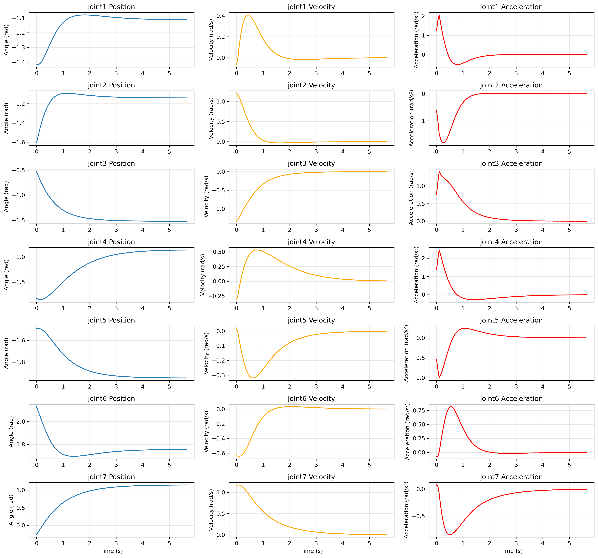
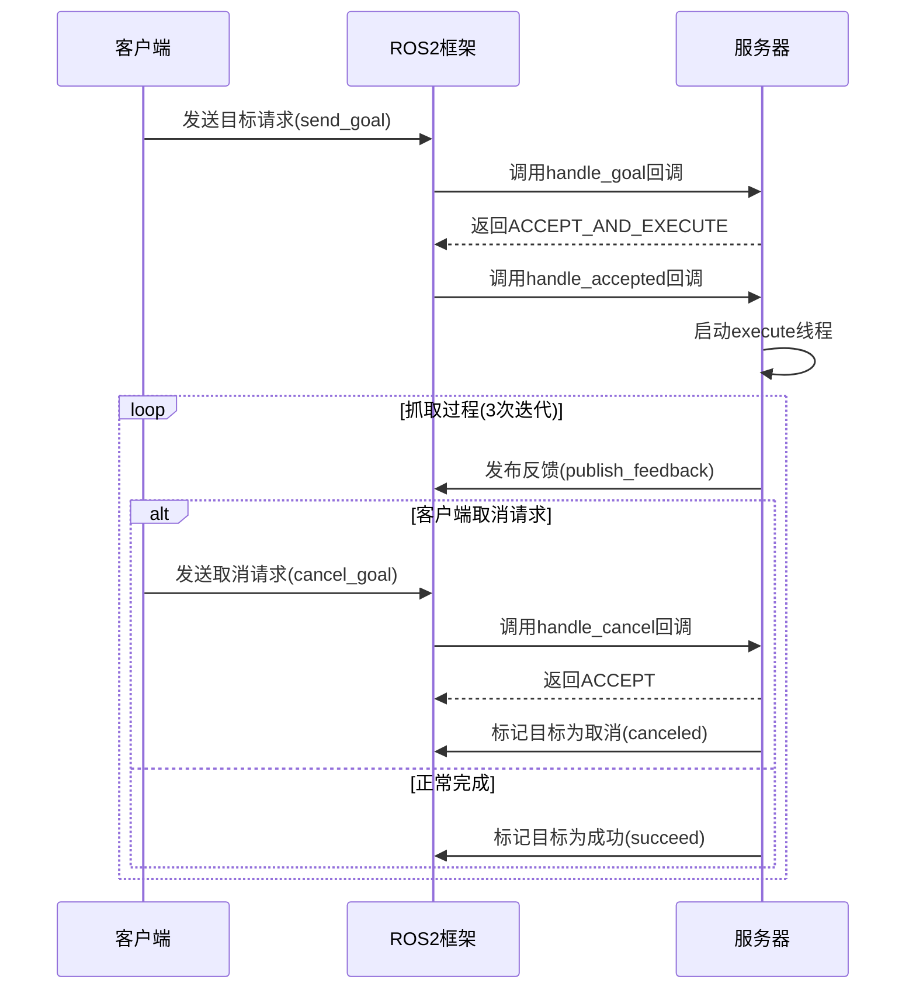
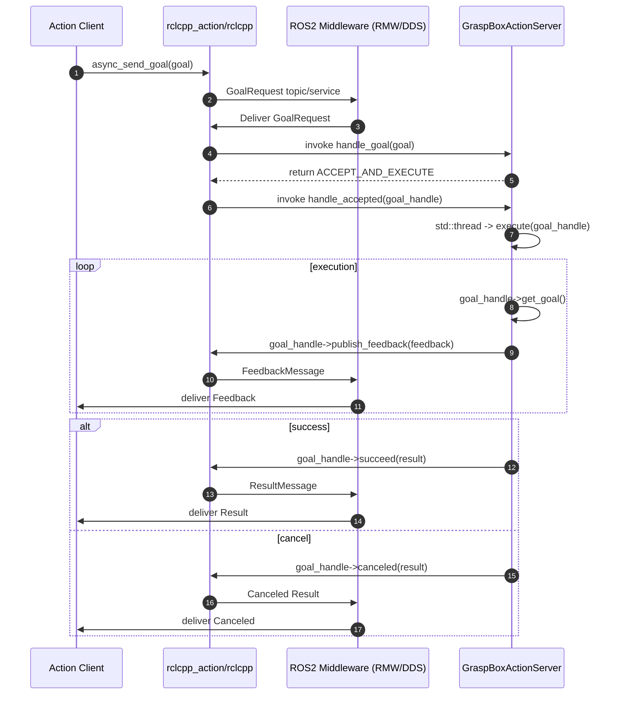
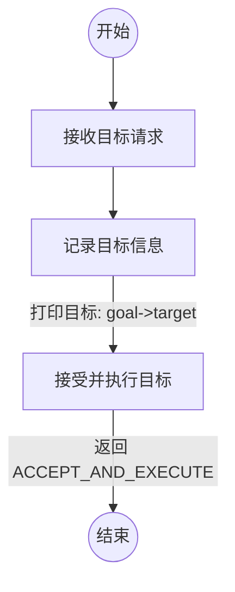
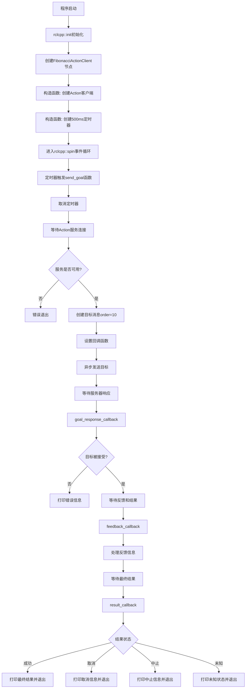
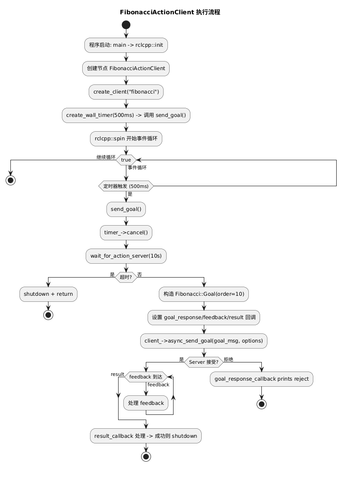
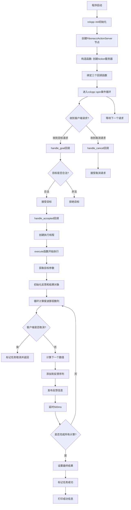
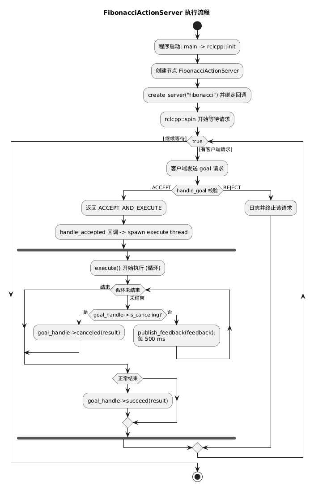
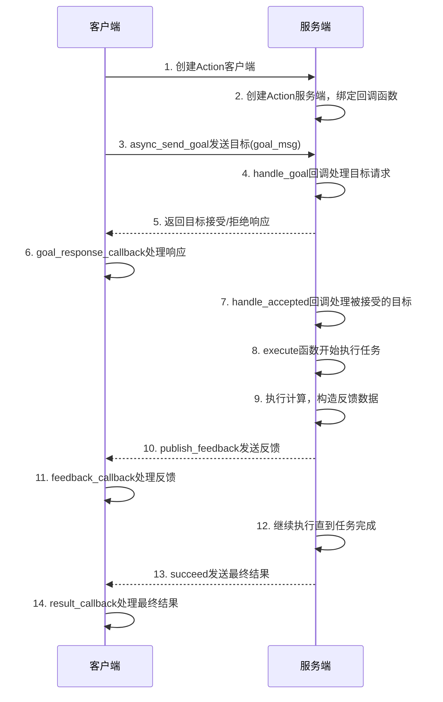

# RM API 正向运动学接口集成记录

## 方案一：集成到节点类中

### 项目背景

在 ros2_rm_ws 项目中，我们希望对比不同运动学库计算结果的差异。当前项目中已经使用了 kinlib 库进行正向运动学计算，现在需要集成睿尔曼机械臂官方提供的 RM API 中的正向运动学接口 `rm_algo_forward_kinematics`，以便对比两种方法的计算结果。

### 实现思路

1. 添加 RM API 相关的头文件包含
2. 在节点类中添加 RM API 相关的成员变量
3. 添加 RM API 初始化和正向运动学计算函数
4. 在规划函数中调用 RM API 并与 kinlib 结果进行对比

### 具体实现

#### 添加头文件包含

在源文件（rm_sclerp_planner_node_1.cpp）中添加了 `RM API` 头文件包含：
```cpp
#include "rm_driver/rm_interface.h"
#include "rm_driver/rm_service.h"
#include "rm_driver/rm_define.h"
```

#### 添加成员变量和函数声明

在节点类（RmSclerpPlannerNode1）的私有成员区域添加了以下内容：
```cpp
class RmSclerpPlannerNode1 : public rclcpp::Node
{
    // 其他代码
private:
    // 添加 RM API 相关成员变量
    rm_robot_handle* robot_handle_ = nullptr;
    bool rm_api_initialized_ = false;

    // 添加 RM API 相关函数声明
    void initialize_rm_api();
    rm_pose_t compute_fk_rm_api(const Eigen::VectorXd& joint_angles);
    
    // 其他代码
}
```

#### RM API 初始化函数的实现与调用

在节点类（RmSclerpPlannerNode1）外添加 `initialize_rm_api()` 函数进行二次封装，实现 RM API 的初始化功能：
```c++
/**
 * @brief 初始化 RM API
 * 
 * 即使连接了真实的机械臂，在使用 RM API 算法功能(如正逆运动学计算)时，
 * 仍需要调用 rm_algo_init_sys_data 函数来初始化算法库所需的系统数据。
 * 该函数主要用于配置算法库使用的机械臂参数(如 DH 参数等)，而不是建立与机械臂的连接。
 */
void RmSclerpPlannerNode1::initialize_rm_api() {
    // 初始化 RM 机器人 API
    RCLCPP_INFO(this->get_logger(), "开始初始化RM API...");
    robot_handle_ = rm_create_robot_arm("127.0.0.1", 8080);
    if (robot_handle_ == nullptr) {
        RCLCPP_WARN(this->get_logger(), "无法创建RM机器人句柄");
        rm_api_initialized_ = false;
        return;
    }
    
    RCLCPP_INFO(this->get_logger(), "RM机器人句柄创建成功");
    
    // 初始化算法依赖数据(不连接机械臂时调用)
    // 注意：即使连接了真实的机械臂，在使用 RM API 算法功能时仍需要调用此函数
    // 来初始化算法库所需的系统数据(如 DH 参数等)
    RCLCPP_INFO(this->get_logger(), "使用RM_MODEL_RM_75_E型号初始化算法数据...");
    rm_algo_init_sys_data(RM_MODEL_RM_75_E, RM_MODEL_RM_ISF_E);
    // 注意: rm_algo_init_sys_data 是 void 类型函数，没有返回值可检查
    
    rm_api_initialized_ = true;
    RCLCPP_INFO(this->get_logger(), "RM API 初始化成功");
}
```

在节点类（`RmSclerpPlannerNode1`）的成员函数 `initialize_planner()` 中调用 `initialize_rm_api()` 函数

```c++
void initialize_planner() 
{
    // 功能逻辑 : 输入参数检查 -> 系统资源初始化 -> 规划器初始化
    
    // 其他代码
    
    // 初始化RM API
    // ———> 使用 RmSclerpPlannerNode1::initialize_rm_api 函数 <———
    initialize_rm_api();   
}
```


#### RM API 正向运动学接口二次封装函数的实现与调用

在节点类（`RmSclerpPlannerNode1`）外添加 `compute_fk_rm_api()` 函数中进行二次封装，以实现调用 RM API 的正向运动学接口：
```cassandra
/**
 * @brief 使用RM API计算正向运动学
 * 
 * @param joint_angles 关节角度向量(弧度)
 * @return rm_pose_t 末端位姿
 */
rm_pose_t RmSclerpPlannerNode1::compute_fk_rm_api(const Eigen::VectorXd& joint_angles) {
    if (!rm_api_initialized_) {
        RCLCPP_WARN(this->get_logger(), "RM API未初始化");
        rm_pose_t empty_pose = {{0.0, 0.0, 0.0}, {0.0, 0.0, 0.0, 1.0}};
        return empty_pose;
    }
    
    // 打印输入的关节角度
    RCLCPP_INFO(this->get_logger(), "输入关节角度 (弧度):");
    for (int i = 0; i < 7 && i < joint_angles.size(); i++) {
        RCLCPP_INFO(this->get_logger(), "  关节%d: %f", i+1, joint_angles(i));
    }
    
    // 将Eigen向量转换为float数组，单位从弧度转换为度
    float joint_angles_deg[7];
    for (int i = 0; i < 7 && i < joint_angles.size(); i++) {
        joint_angles_deg[i] = static_cast<float>(joint_angles(i) * 180.0 / M_PI);
    }
    
    // 打印转换后的关节角度（度）
    RCLCPP_INFO(this->get_logger(), "输入关节角度 (度):");
    for (int i = 0; i < 7; i++) {
        RCLCPP_INFO(this->get_logger(), "  关节%d: %f", i+1, joint_angles_deg[i]);
    }
    
    // 调用RM API正向运动学函数
    rm_pose_t pose = rm_algo_forward_kinematics(robot_handle_, joint_angles_deg);
    
    // 检查返回的姿态数据
    RCLCPP_INFO(this->get_logger(), "RM API返回的姿态数据:");
    RCLCPP_INFO(this->get_logger(), "  位置: x=%f, y=%f, z=%f", 
               pose.position.x, pose.position.y, pose.position.z);
    RCLCPP_INFO(this->get_logger(), "  四元数: x=%f, y=%f, z=%f, w=%f", 
               pose.quaternion.x, pose.quaternion.y, pose.quaternion.z, pose.quaternion.w);
    
    // 检查位置是否为零
    if (pose.position.x == 0.0 && pose.position.y == 0.0 && pose.position.z == 0.0) {
        RCLCPP_WARN(this->get_logger(), "警告：RM API返回的位置数据为零，可能机械臂型号配置不正确");
    }
    
    return pose;
}
```

在节点类（RmSclerpPlannerNode1）的成员函数 `plan_trajectory()` 中调用 RM API 正向运动学计算并与 kinlib 结果进行对比：
```c++
// 轨迹规划函数
void plan_trajectory()
{
    //其他代码
    
    // 使用 RM API 计算正向运动学进行对比
    if (rm_api_initialized_) {
        rm_pose_t rm_pose = compute_fk_rm_api(jointAngles_target);

        // 打印 RM API 计算结果
        RCLCPP_INFO(this->get_logger(), "RM API正向运动学计算结果:");
        RCLCPP_INFO(this->get_logger(), "  位置: x=%f, y=%f, z=%f", 
                   rm_pose.position.x, rm_pose.position.y, rm_pose.position.z);
        RCLCPP_INFO(this->get_logger(), "  姿态四元数: x=%f, y=%f, z=%f, w=%f", 
                   rm_pose.quaternion.x, rm_pose.quaternion.y, rm_pose.quaternion.z, rm_pose.quaternion.w);

        // 转换四元数为欧拉角进行对比
        Eigen::Quaterniond rm_quat(rm_pose.quaternion.w, rm_pose.quaternion.x, 
                                  rm_pose.quaternion.y, rm_pose.quaternion.z);
        Eigen::Matrix3d rm_rotation_matrix = rm_quat.toRotationMatrix();
        double rm_roll = atan2(rm_rotation_matrix(2, 1), rm_rotation_matrix(2, 2));
        double rm_pitch = atan2(-rm_rotation_matrix(2, 0), 
                               sqrt(rm_rotation_matrix(2, 1)*rm_rotation_matrix(2, 1) + 
                                    rm_rotation_matrix(2, 2)*rm_rotation_matrix(2, 2)));
        double rm_yaw = atan2(rm_rotation_matrix(1, 0), rm_rotation_matrix(0, 0));

        RCLCPP_INFO(this->get_logger(), "  RM API欧拉角: roll=%f, pitch=%f, yaw=%f", 
                   rm_roll, rm_pitch, rm_yaw);

        // 添加位姿对比逻辑
        // 提取平移部分进行比较
        double position_diff_x = std::abs(matrix_base2tcp_target(0, 3) - rm_pose.position.x);
        double position_diff_y = std::abs(matrix_base2tcp_target(1, 3) - rm_pose.position.y);
        double position_diff_z = std::abs(matrix_base2tcp_target(2, 3) - rm_pose.position.z);

        // 提取旋转部分进行比较
        Eigen::Matrix3d rotation_diff = rm_rotation_matrix * rm_rotation_matrix.transpose();
        double angle_diff = std::acos((rotation_diff.trace() - 1.0) / 2.0);  // 计算旋转角度差

        RCLCPP_INFO(this->get_logger(), "位姿差异:");
        RCLCPP_INFO(this->get_logger(), "  位置差异: dx=%f, dy=%f, dz=%f", position_diff_x, position_diff_y, position_diff_z);
        RCLCPP_INFO(this->get_logger(), "  旋转差异角度: %f radians", angle_diff);

        // 如果差异较大，输出警告
        if (position_diff_x > 0.01 || position_diff_y > 0.01 || position_diff_z > 0.01 || angle_diff > 0.05) {
            RCLCPP_WARN(this->get_logger(), "警告：正向运动学计算结果与RM API结果差异较大");
        }
    } else {
        RCLCPP_WARN(this->get_logger(), "RM API未初始化，跳过RM API正向运动学计算");
    }
 
    // 其他代码
}
```

#### 编译和测试

要测试这些修改，请执行以下命令：

```bash
# 重新编译
colcon build --packages-select rm_motion_planner --cmake-clean-cache

# 激活环境
source install/setup.bash

# 测试直接运行节点
ros2 run rm_motion_planner rm_sclerp_planner_node_1
```

### 使用说明

1. 当节点启动时，会自动初始化 RM API（如果系统支持）
2. 在计算目标位姿时，会同时使用 kinlib 和 RM API 计算正向运动学
3. 两者的结果会同时打印到日志中，方便对比差异
4. 如果 RM API 初始化失败，会跳过相关计算并给出警告

### 代码变更列表

1. 在文件头部添加了 RM API 头文件包含
2. 在类中添加了 RM API 相关的成员变量和函数声明
3. 实现了 RM API 初始化函数 `initialize_rm_api()`
4. 实现了 RM API 正向运动学计算函数 `compute_fk_rm_api()`
5. 在 `plan_trajectory()` 函数中添加了 RM API 计算和结果输出逻辑
6. 在 `initialize_planner()` 函数中调用 RM API 初始化
7. 保留了原有的 `clipTrajectoryForLimits` 和 `getLinkNamesFromURDF` 函数

### 注意事项

1. 该实现不修改现有功能，仅添加了对比功能
2. 所有 RM API 相关代码都有适当的错误检查和日志输出
3. 单位转换正确处理（从弧度到角度）
4. 如果 RM API 初始化失败，不会影响现有功能的正常运行

### 问题修复

#### RM API 返回零值问题分析与解决方案

在测试过程中发现 RM API 返回的正向运动学计算结果中位置数据为零值，经过分析可能的原因和解决方案如下：

##### 可能原因

1. **机械臂型号配置错误** - 使用了错误的机械臂型号初始化，导致 DH 参数不匹配
2. **RM API 未正确初始化** -rm_api_initialized_ 标志为 false
3. **关节角度输入错误** - 传递给 API 的关节角度可能不正确
4. **API 调用失败** - rm_algo_forward_kinematics 函数执行失败

##### 解决方案

为了更好地诊断和解决这个问题，我们在代码中增加了详细的调试信息和多种机械臂型号尝试：

1. **增强初始化函数的错误检查**：
   - 检查 [rm_create_robot_arm](file:///home/byd/Documents/Projects/DualArmProjects/realmanRobot/ros2_rm_ws/install/rm_driver/include/rm_driver/rm_service.h#L83-L83) 返回值
   - 尝试多种机械臂型号配置（RM_75、RM_65、RM_63）
   - 检查 [rm_algo_init_sys_data](file:///home/byd/Documents/Projects/DualArmProjects/realmanRobot/ros2_rm_ws/install/rm_driver/include/rm_driver/rm_service.h#L3736-L3736) 返回值
   - 添加详细的日志信息

2. **增强正向运动学计算函数的调试信息**：
   - 打印输入的关节角度（弧度和度）
   - 打印 RM API 返回的姿态数据
   - 增加位置数据为零的警告检查
   - 增加错误处理逻辑

3. **添加详细的日志输出**：
   - 在每个关键步骤添加日志信息
   - 便于追踪问题发生的具体位置

通过这些修改，可以更清楚地了解 RM API 的执行过程，帮助诊断返回零值的具体原因。

#### RM API 函数调用错误修复

在实现过程中发现 rm_algo_init_sys_data 函数是 void 类型，不能像之前那样尝试获取返回值。已修复此问题：

```c++
// 错误的调用方式
int init_result = rm_algo_init_sys_data(RM_MODEL_RM_75_E, RM_MODEL_RM_B_E);
if (init_result != 0) {
    // 错误处理
}

// 正确的调用方式
rm_algo_init_sys_data(RM_MODEL_RM_75_E, RM_MODEL_RM_B_E);
```

#### RM API 算法初始化说明

根据睿尔曼官网文档，`rm_algo_init_sys_data()` 函数说明为 "不连接机械臂时调用"，但这并不意味着在连接真实机械臂时不能使用。实际上：

1. 该函数主要用于初始化 RM API 算法库所需的系统数据（如 DH 参数等）
2. 即使连接了真实的机械臂，在使用 RM API 算法功能（如正向运动学计算）时仍需要调用此函数
3. 该函数配置的是算法库使用的机械臂参数，而不是建立与机械臂的连接

#### 节点类成员函数声明与定义分离说明

在本次实现中，我们将 `initialize_rm_api()` 和 `compute_fk_rm_api()` 两个函数采用声明与定义分离的方式实现，即：

1. 在类声明中声明函数：
```cpp
class RmSclerpPlannerNode1 : public rclcpp::Node
{
private:
    // 函数声明
    void initialize_rm_api();
    rm_pose_t compute_fk_rm_api(const Eigen::VectorXd& joint_angles);
};
```

2. 在类外部定义函数：
```cpp
void RmSclerpPlannerNode1::initialize_rm_api() {
    // 函数实现
}

rm_pose_t RmSclerpPlannerNode1::compute_fk_rm_api(const Eigen::VectorXd& joint_angles) {
    // 函数实现
}
```

这种做法的原因和优势如下：

##### 1. 代码组织和可读性

- 将函数声明和实现分开，使类接口清晰可见
- 便于阅读和理解类的公共接口
- 头文件中只包含函数签名，不包含实现细节

##### 2. 编译效率

- 当函数在类外部定义时，如果只修改了函数实现而不改变函数签名，只会重新编译该函数所在的文件
- 而不是重新编译所有使用该类的文件

##### 3. 避免循环依赖

- 在复杂的项目中，外部定义可以更好地处理头文件之间的依赖关系

##### 4. 大型项目维护

- 将声明和实现分开有助于团队协作和代码维护
- 便于代码审查和测试

##### 5. 与类中直接实现的对比

类中其他函数直接实现的原因可能包括：
- 函数简单且不常修改
- 内联函数以提高性能（编译器可能会内联这些函数）
- 作为模板或内联函数的实现方式

对于复杂的函数，特别是涉及第三方库调用的函数，采用声明与定义分离的方式更有利于代码维护和理解。

#### 编译问题解决

在编译过程中可能会遇到头文件找不到的问题，这是因为：

1. CMakeLists.txt 中需要正确配置包含目录
2. 源代码中的头文件包含路径需要正确设置

##### 解决方案

1. 在 CMakeLists.txt 中使用标准的依赖管理方式：
   ```cmake
   ament_target_dependencies(rm_sclerp_planner_node_1 
     # 其他依赖...
     rm_driver
   )
   ```

2. 在源文件中使用标准的包包含方式：
   ```cpp
   #include "rm_driver/rm_interface.h"
   #include "rm_driver/rm_service.h"
   #include "rm_driver/rm_define.h"
   ```

3. 确保 rm_driver 包已正确编译并安装：
   ```bash
   cd /home/byd/Documents/Projects/DualArmProjects/realmanRobot/ros2_rm_ws
   colcon build --packages-select rm_driver rm_motion_planner
   source install/setup.bash
   ```

##### CMakeLists.txt 配置问题修复

在编译过程中发现 CMakeLists.txt 存在配置问题：
1. [rm_sclerp_planner_test](file:///home/byd/Documents/Projects/DualArmProjects/realmanRobot/ros2_rm_ws/build/rm_motion_planner/rm_sclerp_planner_test) 目标的 `target_include_directories` 和 `target_link_libraries` 指令存在，但缺少对应的 `add_executable` 声明
2. 已添加完整的 [rm_sclerp_planner_test](file:///home/byd/Documents/Projects/DualArmProjects/realmanRobot/ros2_rm_ws/build/rm_motion_planner/rm_sclerp_planner_test) 可执行文件定义：
   ```cmake
   add_executable(rm_sclerp_planner_test src/rm_sclerp_planner_test.cpp)
   target_include_directories(rm_sclerp_planner_test PUBLIC
     ${EIGEN3_INCLUDE_DIRS}
   )
   target_link_libraries(rm_sclerp_planner_test kinlib::kinlib)
   ament_target_dependencies(rm_sclerp_planner_test 
     # 所有依赖项...
   )
   ```

3. 同时添加了所有可执行文件的安装指令：
   ```cmake
   install(TARGETS 
     rm_sclerp_planner_test
     rm_sclerp_planner_node
     rm_sclerp_planner_node_1
     rm_dual_arm_sclerp_planner_node
     DESTINATION lib/${PROJECT_NAME}
   )
   ```

##### RM API 符号使用问题修复

在编译过程中发现 RM API 相关符号使用错误：
1. `Rm_Service::RmApi_CreateRobotHandle()` 应该使用 `rm_create_robot_arm()`
2. `RM_75` 应该使用 `RM_MODEL_RM_75_E`
3. `FORCE_NONE` 应该使用 `RM_MODEL_RM_B_E`

正确的使用方式：
```cpp
// 错误的使用方式
robot_handle_ = Rm_Service::RmApi_CreateRobotHandle();
rm_algo_init_sys_data(RM_75, FORCE_NONE);

// 正确的使用方式
robot_handle_ = rm_create_robot_arm("127.0.0.1", 8080);
rm_algo_init_sys_data(RM_MODEL_RM_75_E, RM_MODEL_RM_B_E);
```

##### RM API 结构体成员访问问题修复

在编译过程中发现 RM API 结构体成员访问错误：
1. [rm_pose_t](file:///home/byd/Documents/Projects/DualArmProjects/realmanRobot/ros2_rm_ws/src/ros2_rm_robot-humble/rm_driver/include/rm_driver/rm_define.h#L162-L162) 结构体使用 [quaternion](file:///home/byd/Documents/Projects/DualArmProjects/realmanRobot/ros2_rm_ws/src/ros2_rm_robot-humble/rm_driver/include/rm_driver/rm_define.h#L159-L159) 字段而不是 [orientation](file:///home/byd/Documents/Projects/DualArmProjects/realmanRobot/ros2_rm_ws/src/ros2_rm_robot-humble/rm_driver/include/rm_driver/rm_define.h#L379-L379)
2. [rm_pose_t](file:///home/byd/Documents/Projects/DualArmProjects/realmanRobot/ros2_rm_ws/src/ros2_rm_robot-humble/rm_driver/include/rm_driver/rm_define.h#L162-L162) 结构体使用 [position](file:///home/byd/Documents/Projects/DualArmProjects/realmanRobot/ros2_rm_ws/src/ros2_rm_robot-humble/rm_driver/include/rm_driver/rm_define.h#L379-L379) 字段而不是直接的 [x](file:///home/byd/Documents/Projects/DualArmProjects/realmanRobot/ros2_rm_ws/src/ros2_rm_robot-humble/rm_moveit2_config/config/rm_65_config.urdf.xacro#L11-L11), [y](file:///home/byd/Documents/Projects/DualArmProjects/realmanRobot/ros2_rm_ws/src/ros2_rm_robot-humble/rm_moveit2_config/config/rm_65_config.urdf.xacro#L11-L11), [z](file:///home/byd/Documents/Projects/DualArmProjects/realmanRobot/ros2_rm_ws/src/ros2_rm_robot-humble/rm_moveit2_config/config/rm_65_config.urdf.xacro#L11-L11) 字段

正确的访问方式：
```cpp
// 错误的访问方式
rm_pose.orientation.x, rm_pose.orientation.y, rm_pose.orientation.z, rm_pose.orientation.w
rm_pose.x, rm_pose.y, rm_pose.z

// 正确的访问方式
rm_pose.quaternion.x, rm_pose.quaternion.y, rm_pose.quaternion.z, rm_pose.quaternion.w
rm_pose.position.x, rm_pose.position.y, rm_pose.position.z
```

##### 函数重复定义问题修复

在编译过程中发现函数重复定义错误：
1. `initialize_rm_api()` 函数在类内部错误地实现了
2. `compute_fk_rm_api()` 函数在类内部错误地实现了

正确的实现方式：
```cpp
// 错误的方式 - 在类内部实现函数
class RmSclerpPlannerNode1 : public rclcpp::Node {
    // ...
    void initialize_rm_api() {  // 错误：在类内部实现
        // ...
    }
};

// 正确的方式 - 在类外部实现函数
class RmSclerpPlannerNode1 : public rclcpp::Node {
    // ...
    void initialize_rm_api();  // 正确：只声明函数
};

void RmSclerpPlannerNode1::initialize_rm_api() {  // 正确：在类外部实现
    // ...
}
```

##### 链接错误问题修复

在编译过程中发现链接错误：
```
undefined reference to `rm_create_robot_arm'
undefined reference to `rm_algo_init_sys_data'
undefined reference to `rm_algo_forward_kinematics'
```

这表明链接器找不到 RM API 函数的实现。解决方法是在 CMakeLists.txt 中正确链接 rm_driver 库：
```cmake
# 确保正确链接rm_driver库
target_link_libraries(rm_sclerp_planner_node_1 
  kinlib::kinlib
  ${rm_driver_LIBRARIES}
)
```

##### 头文件包含路径问题修复

在编译过程中发现头文件包含路径错误：
```
fatal error: rm_driver/rm_interface.h: 没有那个文件或目录
```

这表明编译器找不到 RM API 头文件。解决方法是在 CMakeLists.txt 中正确配置包含目录：
```cmake
target_include_directories(rm_sclerp_planner_node_1 PUBLIC
  ${EIGEN3_INCLUDE_DIRS}
  ${rm_driver_INCLUDE_DIRS}
)
```

同时在源文件中使用正确的包含方式：
```cpp
#include "rm_driver/rm_interface.h"
#include "rm_driver/rm_service.h"
#include "rm_driver/rm_define.h"
```

##### 命名空间问题修复

在编译过程中发现命名空间错误：
```
error: 'rm_msgs' was not declared in this scope
```

这表明代码中使用了错误的命名空间。解决方法是将 `rm_msgs` 替换为正确的命名空间 `rm_ros_interfaces`：
```cpp
// 错误的命名空间使用
const std::shared_ptr<rm_msgs::srv::GetDH::Request> request,

// 正确的命名空间使用
const std::shared_ptr<rm_ros_interfaces::srv::GetDH::Request> request,
```

##### 保留原有功能

在修改过程中，确保保留了以下原有重要函数：
1. `clipTrajectoryForLimits` - 用于裁剪轨迹以满足速度和加速度限制
2. `getLinkNamesFromURDF` - 用于从 URDF 文件中获取链接名称

##### 故障排除步骤

如果仍然遇到编译问题，请按以下步骤进行故障排除：

1. 验证 rm_driver 包是否正确构建：
   ```bash
   colcon build --packages-select rm_driver
   ```

2. 检查头文件是否存在：
   ```bash
   find /home/byd/Documents/Projects/DualArmProjects/realmanRobot/ros2_rm_ws -name "rm_interface.h"
   ```

3. 确保环境已正确设置：
   ```bash
   source install/setup.bash
   ```

4. 清理并重新构建：
   ```bash
   rm -rf build/rm_motion_planner install/rm_motion_planner
   colcon build --packages-select rm_motion_planner
   ```


------


## 方案二：二次封装成独立接口

### 实现思路

1. 创建 RM API 二次封装的头文件和源文件
2. 在节点源文件中添加新创建的 RM API 二次封装的头文件包含
3. 在节点源文件的类中添加 RM API 二次封装类的成员变量
4. 在节点源文件的类的成员函数中调用 RM API 二次封装类的初始化和正向运动学成员函数
5. 在规划函数中调用 RM API 并与 kinlib 结果进行对比

### 实现步骤

#### 创建 RM API 二次封装的独立头文件和源文件

RM API 二次封装的独立头文件

```c++
#include <vector>
#include <string>
#include <map>
#include <iterator>
#include <Eigen/Core>
#include <Eigen/Geometry>

// 添加 URDF 相关的头文件
#include "urdf/model.h"

#include <urdf/model.h>
#include "rclcpp/rclcpp.hpp"
#include <kdl/frames.hpp>

// 添加 RM API 头文件
#include "rm_driver/rm_interface.h"
#include "rm_driver/rm_service.h"
#include "rm_driver/rm_define.h"

namespace RmInterface{
    class RmRobotAPI{
    private:
        rm_robot_handle* robot_handle_;
        bool rm_api_initialized_;

    public:
        /**
         * @brief 构造函数
         */
        RmRobotAPI();

        void initialize_RmRobot();

        rm_pose_t compute_FK(const Eigen::VectorXd& joint_angles);

        // 添加getter方法来访问状态
        bool isInitialized() const { return rm_api_initialized_; }
        rm_robot_handle* getRobotHandle() const { return robot_handle_; }

    }; 
}
```

RM API 二次封装的独立源文件

```c++
#include <cmath>
#include <vector>
#include <memory>
#include <urdf/model.h>

#include "rm_motion_planner/robot_interface.h"
namespace RmInterface 
{
    // 调用引用文件中的独立的工具类 RM API 正运动学接口计算目标齐次变换矩阵
    // <使用 RmSclerpPlannerNode1 类成员函数>
    // if (rm_api_initialized_) 
    // <使用 RmInterface::RmRobotAPI 类成员函数>
    if (rmRobotAPI_ && rmRobotAPI_->isInitialized())
    {
        // 🧪 RM API计算结果
        RCLCPP_INFO(this->get_logger(), "=== 机械臂自身 API 正运动学接口计算结果 ===:");

        rm_pose_t rm_pose_;
        // <使用 RmSclerpPlannerNode1 类成员函数>
        // rm_pose_ = compute_fk_rm_api(jointAngles_target);

        // <使用 RmInterface::RmRobotAPI 类成员函数>
        rm_pose_ = rmRobotAPI_->compute_FK(jointAngles_target);

        Eigen::Matrix<double, 6, 1> tcpPose;
        tcpPose << rm_pose_.position.x, rm_pose_.position.y, rm_pose_.position.z, rm_pose_.euler.rx,  rm_pose_.euler.ry,  rm_pose_.euler.rz;

        matrix_base2tcp_target = tcpPose2HomogenMatrix(tcpPose);

        // Eigen::Vector3d tcpPos_;
        // Eigen::Quaterniond quaternion_;
        // tcpPos_ << rm_pose_.position.x, rm_pose_.position.y, rm_pose_.position.z;
        // quaternion_.coeffs()  << rm_pose_.quaternion.x, rm_pose_.quaternion.y, rm_pose_.quaternion.z, rm_pose_.quaternion.w;
        // matrix_base2tcp_target = tcpPose2HomogenMatrix_1(quaternion_, tcpPos_);

        RCLCPP_INFO(this->get_logger(), "末端执行器目标位姿 (x,y,z,roll,pitch,yaw): [%f, %f, %f, %f, %f, %f]", rm_pose_.position.x, rm_pose_.position.y, rm_pose_.position.z, rm_pose_.euler.rx,  rm_pose_.euler.ry,  rm_pose_.euler.rz); 
        
        // RCLCPP_INFO(this->get_logger(), "RM API 位置: x=%f, y=%f, z=%f", 
        // rm_pose_.position.x, rm_pose_.position.y, rm_pose_.position.z);
        // RCLCPP_INFO(this->get_logger(), "RM API 欧拉角: roll=%f, pitch=%f, yaw=%f", 
        // rm_pose_.euler.rx,  rm_pose_.euler.ry,  rm_pose_.euler.rz);

        // 🧪 打印 matrix_base2tcp_target 矩阵
        std::stringstream ss_;
        ss_ << "\n matrix_base2tcp_target: \n" << matrix_base2tcp_target << std::endl;
        RCLCPP_INFO(this->get_logger(), "%s", ss_.str().c_str());

    } else {
        // 继续使用之前通过Kinematic库计算的结果
        RCLCPP_WARN(this->get_logger(), "RM API未初始化，使用Kinematic库计算结果");

    }
}
```


#### 节点源文件中添加头文件包含

在源文件（rm_sclerp_planner_node_1.cpp）中添加了 `RM API` 二次封装的独立头文件包含：

```cpp
#include "rm_motion_planner/robot_interface.h"
```

#### 节点类中添加成员变量和函数声明

在节点类（RmSclerpPlannerNode1）的私有成员区域添加了以下内容：

```cpp
class RmSclerpPlannerNode1 : public rclcpp::Node
{
    // 其他代码
private:
    // 📦 实例化自定义封装的RM Robot API 接口
    std::unique_ptr<RmInterface::ParseURDF> parseURDF_;
    std::unique_ptr<RmInterface::RmRobotAPI> rmRobotAPI_;
    
    // 其他代码
}
```

#### RM API 二次封装的初始化函数的调用

在节点类（RmSclerpPlannerNode1）的成员函数 `initialize_planner()` 中调用 RM API 二次封装的初始化函数

```c++
void initialize_planner() 
{
    // 功能逻辑 : 输入参数检查 -> 系统资源初始化 -> 规划器初始化
    
    // 其他代码
    
    // 初始化RM API
    // ———> 使用 RmInterfac::RmRobotAPI 函数 <———
    // RmInterface::RmRobotAPI rmRobotAPI_;
    rmRobotAPI_ = std::make_unique<RmInterface::RmRobotAPI>();
    rmRobotAPI_ -> initialize_RmRobot();
```

#### RM API 二次封装的正运动学函数的调用

在节点类（RmSclerpPlannerNode1）的成员函数 `plan_trajectory()` 中调用 RM API 正向运动学计算并与 kinlib 结果进行对比：

```c++
// 轨迹规划函数
void plan_trajectory()
{
    //其他代码
    
    // 检查RM Robot API是否已正确初始化
    if (!rmRobotAPI_ || !rmRobotAPI_->isInitialized()) {
        RCLCPP_ERROR(this->get_logger(), "RM Robot API未初始化");
        return;
    }   
    
    // 调用引用文件中的独立的工具类 RM API 正运动学接口计算目标齐次变换矩阵
    // <使用 RmInterface::RmRobotAPI 类成员函数>
    if (rmRobotAPI_ && rmRobotAPI_->isInitialized())
    {
        // 🧪 RM API计算结果
        RCLCPP_INFO(this->get_logger(), "=== 机械臂自身 API 正运动学接口计算结果 ===:");

        rm_pose_t rm_pose_;
        // <使用 RmInterface::RmRobotAPI 类成员函数>
        rm_pose_ = rmRobotAPI_->compute_FK(jointAngles_target);

        Eigen::Matrix<double, 6, 1> tcpPose;
        tcpPose << rm_pose_.position.x, rm_pose_.position.y, rm_pose_.position.z, rm_pose_.euler.rx,  rm_pose_.euler.ry,  rm_pose_.euler.rz;

        matrix_base2tcp_target = tcpPose2HomogenMatrix(tcpPose);

        // Eigen::Vector3d tcpPos_;
        // Eigen::Quaterniond quaternion_;
        // tcpPos_ << rm_pose_.position.x, rm_pose_.position.y, rm_pose_.position.z;
        // quaternion_.coeffs()  << rm_pose_.quaternion.x, rm_pose_.quaternion.y, rm_pose_.quaternion.z, rm_pose_.quaternion.w;
        // matrix_base2tcp_target = tcpPose2HomogenMatrix_1(quaternion_, tcpPos_);

        RCLCPP_INFO(this->get_logger(), "末端执行器目标位姿 (x,y,z,roll,pitch,yaw): [%f, %f, %f, %f, %f, %f]", 
                    rm_pose_.position.x, rm_pose_.position.y, rm_pose_.position.z,
                    rm_pose_.euler.rx,  rm_pose_.euler.ry,  rm_pose_.euler.rz); 
        // RCLCPP_INFO(this->get_logger(), "RM API 位置: x=%f, y=%f, z=%f", 
        //            rm_pose_.position.x, rm_pose_.position.y, rm_pose_.position.z);
        // RCLCPP_INFO(this->get_logger(), "RM API 欧拉角: roll=%f, pitch=%f, yaw=%f", 
    //rm_pose_.euler.rx,  rm_pose_.euler.ry,  rm_pose_.euler.rz);

        // 🧪 打印 matrix_base2tcp_target 矩阵
        std::stringstream ss_;
        ss_ << "\n matrix_base2tcp_target: \n" << matrix_base2tcp_target << std::endl;
        RCLCPP_INFO(this->get_logger(), "%s", ss_.str().c_str());

    } else {
        // 继续使用之前通过Kinematic库计算的结果
        RCLCPP_WARN(this->get_logger(), "RM API未初始化，使用Kinematic库计算结果");

    }
 
    // 其他代码
}
```


####  编译和测试

要测试这些修改，请执行以下命令：

```bash
# 重新编译
colcon build --packages-select rm_motion_planner --cmake-clean-cache

# 激活环境
source install/setup.bash

# 测试直接运行节点
ros2 run rm_motion_planner rm_sclerp_planner_node_1
```

### 使用说明

# 功能包代码变更记录


## CMakeLists.txt 文件添加配置文件安装指令

为 rm_motion_planner 包的 CMakeLists.txt 文件添加<span style="text-decoration:underline;">配置文件安装指令</span>，确保修改 planner_params.yaml 后能同步更新 install 目录下的对应文件。

### 变更日期

2025 年 8 月 19 日

### 变更说明

#### 问题描述

修改 [/home/byd/Documents/Projects/DualArmProjects/realmanRobot/ros2_rm_ws/src/ros2_rm_robot-humble/rm_motion_planner/config/planner_params.yaml](file:///home/byd/Documents/Projects/DualArmProjects/realmanRobot/ros2_rm_ws/src/ros2_rm_robot-humble/rm_motion_planner/config/planner_params.yaml) 文件中的 `rm_sclerp_planner_node_1` 下的 `target_joint_positions` 数据后，发现 install 目录下的对应文件没有同步更新。

经过分析发现，问题的根本原因是 [CMakeLists.txt](file:///home/byd/Documents/Projects/DualArmProjects/realmanRobot/ros2_rm_ws/src/ros2_rm_robot-humble/rm_motion_planner/CMakeLists.txt) 文件中缺少了配置文件的安装指令。在 ROS 2 包中，只有通过 `install(DIRECTORY ...)` 指令明确指定的文件才会在构建过程中被复制到 install 目录下。

#### 解决方案

在 [CMakeLists.txt](file:///home/byd/Documents/Projects/DualArmProjects/realmanRobot/ros2_rm_ws/src/ros2_rm_robot-humble/rm_motion_planner/CMakeLists.txt) 文件中添加配置文件安装指令：

```cmake
# 添加配置文件安装指令
install(DIRECTORY
  config/
  DESTINATION share/${PROJECT_NAME}/config
)
```

#### 变更位置

文件：[/home/byd/Documents/Projects/DualArmProjects/realmanRobot/ros2_rm_ws/src/ros2_rm_robot-humble/rm_motion_planner/CMakeLists.txt](file:///home/byd/Documents/Projects/DualArmProjects/realmanRobot/ros2_rm_ws/src/ros2_rm_robot-humble/rm_motion_planner/CMakeLists.txt)

在 `install(DIRECTORY launch/ ...)` 指令后添加配置文件安装指令。

#### 后续操作步骤

1. 重新编译 rm_motion_planner 包：
   ```bash
   cd /home/byd/Documents/Projects/DualArmProjects/realmanRobot/ros2_rm_ws
   colcon build --packages-select rm_motion_planner
   ```

2. 更新环境变量：
   ```bash
   source install/setup.bash
   ```


完成上述操作后，对 [/home/byd/Documents/Projects/DualArmProjects/realmanRobot/ros2_rm_ws/src/ros2_rm_robot-humble/rm_motion_planner/config/planner_params.yaml](file:///home/byd/Documents/Projects/DualArmProjects/realmanRobot/ros2_rm_ws/src/ros2_rm_robot-humble/rm_motion_planner/config/planner_params.yaml) 文件的任何修改都会在重新编译包后同步到 install 目录下。

#### 相关文件

- [/home/byd/Documents/Projects/DualArmProjects/realmanRobot/ros2_rm_ws/src/ros2_rm_robot-humble/rm_motion_planner/CMakeLists.txt](file:///home/byd/Documents/Projects/DualArmProjects/realmanRobot/ros2_rm_ws/src/ros2_rm_robot-humble/rm_motion_planner/CMakeLists.txt)
- [/home/byd/Documents/Projects/DualArmProjects/realmanRobot/ros2_rm_ws/src/ros2_rm_robot-humble/rm_motion_planner/config/planner_params.yaml](file:///home/byd/Documents/Projects/DualArmProjects/realmanRobot/ros2_rm_ws/src/ros2_rm_robot-humble/rm_motion_planner/config/planner_params.yaml)
- /home/byd/Documents/Projects/DualArmProjects/realmanRobot/ros2_rm_ws/install/rm_motion_planner/share/rm_motion_planner/config/planner_params.yaml


## 轨迹规划插值频率与执行频率参数化

### 变更日期

2025/8/24

### 变更说明

#### 问题与背景

机械臂执行轨迹点速度缓慢的问题，代码中与轨迹执行速度相关的参数和逻辑。

机械臂轨迹执行缓慢的主要原因有以下几点：

1. **轨迹执行定时器周期固定为 20ms**：

   ```c++
   trajectory_timer_ = this->create_wall_timer(
       std::chrono::milliseconds(20),
       std::bind(&RmSclerpPlannerNode1::trajectory_timer_callback, this));
   ```

2. **轨迹插值频率固定**： 在代码中，轨迹插值时使用了固定的频率值：

   ```c++
   double dt = 1.0 / frequency;  // 时间间隔
   ```

3. **缺乏动态频率调整**： 虽然代码中有 `adjustFrequencyForLimits` 函数，但似乎没有被实际使用来动态调整轨迹执行速度。

#### 解决方案

##### 节点代码变更

> rm_sclerp_planner_node_1.cpp

###### 变更点 1：增加轨迹执行频率

修改轨迹执行定时器周期，从 20ms 改为根据参数设置：

```c++
// 创建 10ms 定时器用于发布轨迹点，提高轨迹执行频率
int execution_rate;
this->get_parameter("trajectory_execution_rate", execution_rate);
auto timer_period = std::chrono::microseconds(1000000 / execution_rate);

trajectory_timer_ = this->create_wall_timer(
    timer_period,
    std::bind(&RmSclerpPlannerNode1::trajectory_timer_callback, this));
```

###### 变更点 2：提高轨迹插值频率

修改轨迹规划函数，使用更高的插值频率：

```c++
// 使用参数化频率进行插值
int interpolation_rate;
this->get_parameter("trajectory_interpolation_rate", interpolation_rate);
double frequency = static_cast<double>(interpolation_rate);
double dt = 1.0 / frequency;  // 时间间隔
```

###### 变更点 3：添加参数化控制频率

添加参数声明，允许用户自定义执行速度：

```c++
// 声明参数
this->declare_parameter<std::string>("start_joint_positions", "0.0,0.0,0.0,0.0,0.0,0.0,0.0");
this->declare_parameter<std::string>("target_joint_positions", "0.1,0.1,0.1,0.1,0.1,0.1,0.1");
this->declare_parameter<std::string>("urdf_path", "");
this->declare_parameter<int>("trajectory_execution_rate", 100);  // 轨迹执行频率(Hz)
this->declare_parameter<int>("trajectory_interpolation_rate", 100);  // 轨迹插值频率(Hz)
```

###### 变更点 4：参数化轨迹插值频率

让轨迹插值频率也参数化，并在日志中显示：

```c++
RCLCPP_INFO(this->get_logger(), "插值后轨迹点数量: %ld", planned_trajectory_.points.size());
RCLCPP_INFO(this->get_logger(), "开始以%dHz频率发布轨迹点到/rm_driver/movej_canfd_cmd", interpolation_rate);
```

###### 四个变更点的关系

这四个变更点共同应用到节点程序中，它们是互补的关系：

1. **变更点 3 是基础**：添加参数声明是其他参数化方案的前提，必须首先声明参数才能使用。
2. **变更点 1 和变更点 2 是执行层面的优化**：
   - 变更点 1 优化轨迹点的发布频率（控制执行定时器）
   - 变更点 2 优化轨迹点的生成密度（控制插值频率）
3. **变更点 4 是反馈**：提供更好的用户界面，让用户知道当前使用的是什么频率。

这些方案协同工作可以显著提高机械臂的轨迹执行速度：

- 通过提高插值频率（方案 2），生成更密集、更平滑的轨迹点
- 通过提高执行频率（方案 1），更快地发布这些轨迹点
- 通过参数化配置（方案 3 和 4），允许用户根据需要调整性能

总的来说，这四个变更点共同构成了一个完整的优化策略，可以同时应用以获得最佳效果。

##### 参数配置

###### 1. 通过 YAML 配置文件设置（推荐方式）

我已经在配置文件中添加了这两个参数：

**单臂配置文件**

在 `src/ros2_rm_robot-humble/rm_motion_planner/config/planner_params.yaml` 中添加了：

```yaml
# 轨迹执行频率 (Hz) - 控制定时器发布轨迹点的频率
trajectory_execution_rate: 100

# 轨迹插值频率 (Hz) - 控制轨迹点插值的密度
trajectory_interpolation_rate: 100
```

**双臂配置文件**

在 `src/ros2_rm_robot-humble/rm_motion_planner/config/rm_dual_arm_sclerp_planner_params.yaml` 中为左右臂分别添加了：

```yaml
# 左臂轨迹执行频率 (Hz) - 控制定时器发布轨迹点的频率
left_arm.trajectory_execution_rate: 100

# 左臂轨迹插值频率 (Hz) - 控制轨迹点插值的密度
left_arm.trajectory_interpolation_rate: 100

# 右臂轨迹执行频率 (Hz) - 控制定时器发布轨迹点的频率
right_arm.trajectory_execution_rate: 100

# 右臂轨迹插值频率 (Hz) - 控制轨迹点插值的密度
right_arm.trajectory_interpolation_rate: 100
```

###### 2. 通过命令行参数设置

您也可以在运行节点时通过命令行参数设置这些值：

**对于单臂节点：**

```bash
ros2 run rm_motion_planner rm_sclerp_planner_node_1 --ros-args -p trajectory_execution_rate:=200 -p trajectory_interpolation_rate:=200
```

**对于双臂节点：**

```bash
ros2 run rm_motion_planner rm_dual_arm_sclerp_planner_node --ros-args -p left_arm.trajectory_execution_rate:=200 -p left_arm.trajectory_interpolation_rate:=200 -p right_arm.trajectory_execution_rate:=200 -p right_arm.trajectory_interpolation_rate:=200
```

###### 3. 通过 launch 文件设置

您还可以修改 launch 文件，在 `Node` 定义中添加 `parameters` 参数来设置这些值：

```python
Node(
    package='rm_motion_planner',
    executable='rm_sclerp_planner_node_1',
    name='rm_sclerp_planner_node_1',
    output='screen',
    parameters=[
        params_file,
        {
            'trajectory_execution_rate': 200,
            'trajectory_interpolation_rate': 200
        }
    ]
)
```

###### 参数说明

- `trajectory_execution_rate`: 控制轨迹执行定时器的频率，即每秒发布多少个轨迹点到机械臂。值越高，机械臂响应越快，但对系统性能要求也越高。
- `trajectory_interpolation_rate`: 控制轨迹插值的密度，即在规划阶段生成多少个中间点。值越高，轨迹越平滑，但计算量也越大。

推荐使用 YAML 配置文件的方式，因为这样更容易维护和版本控制。如果您需要临时调整参数进行测试，可以使用命令行参数方式。

可以使用命令行参数方式进行测试。

- 完整参数

```bash
ros2 run rm_motion_planner rm_sclerp_planner_node_1 --ros-args -p trajectory_execution_rate:=200 -p trajectory_interpolation_rate:=200
```

- 不完整参数（未指定的参数将使用程序默认的参数值）

```bash
ros2 run rm_motion_planner rm_sclerp_planner_node_1
```

或

```
ros2 run rm_motion_planner rm_sclerp_planner_node_1 --ros-args -p trajectory_execution_rate:=200
```

或

```bash
ros2 run rm_motion_planner rm_sclerp_planner_node_1 --ros-args -p trajectory_interpolation_rate:=200
```


- 

### 关联内容补充说明

#### 插值后轨迹点时间戳设置

##### 节点代码

```c++
 // 创建五次多项式插值器
 QuinticInterpolator interpolator(path, max_velocity, max_acceleration, frequency);
 // 计算插值轨迹
 interpolator.computeTrajectory();
 // 获取插值后的轨迹
 
 // 将插值后的轨迹转换回 JointTrajectory 格式
planned_trajectory_.points.clear();
planned_trajectory_.header = joint_trajectory.header;
planned_trajectory_.joint_names = joint_trajectory.joint_names;
            
dt = 1.0 / frequency;  // 时间间隔
for (size_t i = 0; i < trajectory.size(); i++) {
    trajectory_msgs::msg::JointTrajectoryPoint point;
    point.positions.resize(7);
    for (size_t j = 0; j < 7; ++j) {
        point.positions[j] = trajectory[i][j];
    }
    // 正确设置时间戳
    double total_time = i * dt;
    point.time_from_start.sec = static_cast<int32_t>(total_time);
    point.time_from_start.nanosec = static_cast<uint32_t>((total_time - point.time_from_start.sec) * 1e9);
    planned_trajectory_.points.push_back(point);
}
```

###### 1. 轨迹点时间戳设置

在 plan_trajectory 函数中，代码通过以下方式为轨迹点设置时间戳：

```cpp
dt = 1.0 / frequency;  // 时间间隔
for (size_t i = 0; i < trajectory.size(); i++) {
    trajectory_msgs::msg::JointTrajectoryPoint point;
    point.positions.resize(7);
    for (size_t j = 0; j < 7; ++j) {
        point.positions[j] = trajectory[i][j];
    }
    // 正确设置时间戳
    double total_time = i * dt;
    point.time_from_start.sec = static_cast<int32_t>(total_time);
    point.time_from_start.nanosec = static_cast<uint32_t>((total_time - point.time_from_start.sec) * 1e9);
    planned_trajectory_.points.push_back(point);
}
```

###### 2. 频率参数获取

轨迹点的时间戳计算基于插值频率：

```cpp
// 插值频率 - 使用参数化频率提高轨迹点密度
int interpolation_rate;
this->get_parameter("trajectory_interpolation_rate", interpolation_rate);
double frequency = static_cast<double>(interpolation_rate);
double dt = 1.0 / frequency;  // 时间间隔
```

###### 3. 轨迹执行定时器设置

轨迹执行的定时器频率通过以下方式设置：

```cpp
// 动态频率定时器
int execution_rate;
this->get_parameter("trajectory_execution_rate", execution_rate);
auto timer_period = std::chrono::microseconds(1000000 / execution_rate);

trajectory_timer_ = this->create_wall_timer(
    timer_period,
    std::bind(&RmSclerpPlannerNode1::trajectory_timer_callback, this));
```


##### 方法原理

###### 1. 时间戳计算原理

时间戳计算遵循以下步骤：

1. **计算时间间隔**：`dt = 1.0 / frequency`，其中 frequency 是轨迹插值频率

2. **累计时间计算**：`total_time = i * dt`，其中 i 是轨迹点索引

3. 秒和纳秒分离

   ：

   - 秒部分：`point.time_from_start.sec = static_cast<int32_t>(total_time)`
   - 纳秒部分：`point.time_from_start.nanosec = static_cast<uint32_t>((total_time - point.time_from_start.sec) * 1e9)`

这种方法确保了每个轨迹点相对于轨迹开始的时间被正确记录。

###### 2. 时间戳的作用原理

- **轨迹执行同步**：下游控制器可以根据时间戳确定何时应该到达特定轨迹点
- **速度和加速度计算**：控制器可以基于位置差和时间差计算速度和加速度
- **轨迹细化**：如果需要，系统可以根据时间戳在轨迹点之间插入新的中间点

###### 3. 双频率系统原理

代码采用了双频率系统：

1. **插值频率**（trajectory_interpolation_rate）：控制轨迹点的密度，决定了轨迹的平滑程度
2. **执行频率**（trajectory_execution_rate）：控制轨迹点的发布频率，决定了机械臂响应速度

这种设计允许独立优化轨迹质量和执行性能。

##### 实际效果

通过这种方式设置时间戳，系统能够：

1. 生成具有准确定时信息的轨迹点序列
2. 根据设定的执行频率发布轨迹点
3. 为下游控制器提供精确的时间参考
4. 实现平滑、可控的机械臂运动

这种时间戳设置方法是 ROS 标准做法，确保了与 ROS 生态系统中其他组件的兼容性。

##### 轨迹点时间戳的作用

代码

```c++
void plan_trajectory()
{
    // ....
    
    // 时间戳设置，用于 rm_control 模块
    dt = 1.0 / frequency;  // 时间间隔
    for (size_t i = 0; i < trajectory.size(); i++) {
        trajectory_msgs::msg::JointTrajectoryPoint point;
        point.positions.resize(7);
        for (size_t j = 0; j < 7; ++j) {
             point.positions[j] = trajectory[i][j];
        }
        // 正确设置时间戳
        double total_time = i * dt;
        point.time_from_start.sec = static_cast<int32_t>(total_time);
        point.time_from_start.nanosec = static_cast<uint32_t>((total_time - point.time_from_start.sec) * 1e9);
        planned_trajectory_.points.push_back(point);
    } 

// ...
}
```

轨迹点时间戳( time_from_start )在 ROS 系统中有以下几个重要作用：

###### 1. 时间同步

时间戳用于确保轨迹点按照正确的时间顺序执行，特别是在复杂的轨迹规划中，不同关节可能需要在特定时间点达到特定位置。

###### 2. 速度和加速度计算

在您提供的代码中，可以看到其他模块（如 rm_control ）会使用时间戳来计算速度和加速度：

```c++
time_from_start[i] = goal->trajectory.points[i].time_from_start.sec + goal->trajectory.points[i].time_from_start.nanosec/1e9;
```

###### 3. 插值和轨迹细化

时间戳允许系统在必要时进行轨迹细化或插值，以确保运动平滑。

###### 4. 实时控制

在实时控制系统中，时间戳帮助控制器确定何时应该到达特定轨迹点。

##### 是否可以不设置时间戳

从技术上讲，**可以不设置时间戳**，但这取决于您的具体使用场景：

1. **当前实现**：当前代码使用固定频率（20ms）发布轨迹点，实际上并不依赖时间戳来确定发布时机。
2. **下游模块依赖**：如您在搜索结果中看到的，rm_control.cpp 模块确实会使用时间戳数据进行计算。
3. **潜在问题**：如果将来需要与其他 ROS 组件集成，缺少时间戳可能会导致兼容性问题。

##### 建议

虽然在当前实现中时间戳不是必需的，但建议保留时间戳设置，因为：

1. 它符合 ROS 轨迹消息的标准格式
2. 为将来可能的功能扩展提供支持
3. 保持与其他 ROS 模块的兼容性

如果您确实想移除时间戳设置，可以简单地注释掉相关代码：

```c++
// 正确设置时间戳
// double total_time = i * dt;
// point.time_from_start.sec = static_cast <int32_t>(total_time);
// point.time_from_start.nanosec = static_cast <uint32_t>((total_time - point.time_from_start.sec) * 1e9);
```

但保持时间戳设置是更好的实践，因为它使您的代码更加标准和兼容。


#### rm_control.cpp 模块使用时间戳数据进行计算的详细分析

文件路径：

```bash
ros2_rm_ws/src/ros2_rm_robot-humble/rm_control/src/rm_control.cpp
```


##### 1. 时间戳数据提取

在 execute_move 函数中，首先从轨迹点中提取时间戳数据：

```cpp
/* 时间数组 */
double time_from_start[point_num];
double timens_from_start[point_num];

for (i = 0; i < point_num; i++) 
{
    // ... 提取位置、速度、加速度数据 ...
    
    // 提取时间戳数据
    time_from_start[i] = goal->trajectory.points[i].time_from_start.sec + goal->trajectory.points[i].time_from_start.nanosec/1e9;
    timens_from_start[i] = goal->trajectory.points[i].time_from_start.nanosec;
}
```

具体步骤：

1. 创建两个数组：`time_from_start` 存储以秒为单位的总时间，`timens_from_start` 存储纳秒部分
2. 遍历所有轨迹点，将每个点的 `time_from_start` 字段转换为秒数
3. 将秒部分和纳秒部分相加得到完整的时间值（以秒为单位）

##### 2. 使用时间戳进行三次样条插值

提取时间戳后，系统使用这些时间数据进行三次样条插值：

```c++
cubicSpline spline;
double max_time = time_from_start[point_num-1];
RCLCPP_INFO(this->get_logger(), "Second Move_group max_time is %f", max_time);
time_from_start_.clear();

// joint1
if (spline.loadData(time_from_start, p_joint1, point_num, 0, 0, cubicSpline::BoundType_First_Derivative))
{
    p_joint1_.clear();
    v_joint1_.clear();
    a_joint1_.clear();
    x_out = -rate;
    while(x_out < max_time) {
        x_out += rate;
        spline.getYbyX(x_out, y_out);
        time_from_start_.push_back(x_out);  // 将新的时间存储，只需操作一次即可
        p_joint1_.push_back(y_out);
        v_joint1_.push_back(vel);
        a_joint1_.push_back(acc);
    }
    // ... 对其他关节进行同样的处理 ...
}
```

具体步骤：

1. 创建三次样条插值器实例
2. 获取轨迹的最大时间（最后一个点的时间）
3. 使用 [loadData](javascript:void(0))方法将时间戳和关节位置数据加载到插值器中
4. 按照固定周期（`rate = 0.020` 秒，即 20 毫秒）生成新的插值点
5. 通过 `spline.getYbyX(x_out, y_out)` 计算每个时间点对应的关节位置、速度和加速度

##### 3. 插值结果的存储和使用

插值后的数据存储在以下向量中：

- `time_from_start_`：存储插值后的时间点
- `p_joint1_` 到 `p_joint7_`：存储插值后的关节位置
- `v_joint1_` 到 `v_joint7_`：存储插值后的关节速度
- `a_joint1_` 到 `a_joint7_`：存储插值后的关节加速度

##### 4. 定时器发布插值后的轨迹点

在 [timer_callback()](javascript:void(0))函数中，系统按照固定周期（20 毫秒）发布插值后的轨迹点：

```c++
void Rm_Control::timer_callback()
{
    // ...

    if(point_changed)
    {
        if(p2.vector_cnt < p2.vector_len)
        {
            // 发布插值后的轨迹点
            if(arm_type_ == 75)
            {
                joint_msg.joint[0] = p_joint1_.at(p2.vector_cnt);
                joint_msg.joint[1] = p_joint2_.at(p2.vector_cnt);
                joint_msg.joint[2] = p_joint3_.at(p2.vector_cnt);
                joint_msg.joint[3] = p_joint4_.at(p2.vector_cnt);
                joint_msg.joint[4] = p_joint5_.at(p2.vector_cnt);
                joint_msg.joint[5] = p_joint6_.at(p2.vector_cnt);
                joint_msg.joint[6] = p_joint7_.at(p2.vector_cnt);
                this->joint_pos_publisher->publish(joint_msg);
            }
            // ... 其他臂型的处理 ...
            
            p2.vector_cnt++;
        }
        // ...
    }
    // ...
}
```

##### 总结

`rm_control.cpp` 模块使用时间戳数据的主要流程如下：

1. **数据提取**：从轨迹点中提取时间戳信息，转换为秒为单位的时间值
2. **三次样条插值**：使用提取的时间戳和关节位置数据进行插值计算，生成更平滑、更高频率的轨迹点
3. **数据存储**：将插值结果存储在专门的向量中供后续使用
4. **轨迹执行**：通过定时器按照固定周期发布插值后的轨迹点

这种方法确保了机械臂运动的平滑性和精确性，通过时间戳信息实现了对轨迹执行时间的精确控制。时间戳在这一过程中起到了关键作用，它不仅定义了轨迹点的执行顺序，还为插值算法提供了时间参考，使得生成的轨迹能够按照预定的时间规律执行。


#### 下发给机械臂的轨迹点依赖插值器计算的问题

##### 问题描述

当前  `plan_trajectory()` 函数中下发给机械臂的轨迹点的 `planned_trajectory_` 计算流程是：

1）由如下语句计算得 `joint_trajectory`

```c++
planner_interface_->solve(jointAngles_start, matrix_base2tcp_target, joint_trajectory); 
```


2）在插值部分代码有如下语句，根据 `joint_trajectory` 计算 `trajectory`

```c++
path.clear();
for (const auto& point : joint_trajectory.points) {
    std::vector<double> joints(7);
    for (size_t j = 0; j < 7 && j < point.positions.size(); ++j) {
        joints[j] = point.positions[j];
    }
    // 如果 positions 少于 7 个，其余设置为 0
    for (size_t j = point.positions.size(); j < 7; ++j) {
        joints[j] = 0.0;
    }
    path.push_back(joints);
}
// 创建五次多项式插值器
QuinticInterpolator interpolator(path, max_velocity, max_acceleration, frequency);

// 计算插值轨迹
interpolator.computeTrajectory();

// 获取插值后的轨迹
trajectory = interpolator.getTrajectory();
```


3）然后由如下语句，根据 `joint_trajectory` 计算 `planned_trajectory_` 

```c++
planned_trajectory_.points.clear();
planned_trajectory_.header = joint_trajectory.header;
planned_trajectory_.joint_names = joint_trajectory.joint_names;
```


4）最后在插值部分代码，根据 `trajectory` 计算 `planned_trajectory_` 

```c++
dt = 1.0 / frequency;  // 时间间隔
for (size_t i = 0; i < trajectory.size(); i++) {
    trajectory_msgs::msg::JointTrajectoryPoint point;
    point.positions.resize(7);
    for (size_t j = 0; j < 7; ++j) {
        point.positions[j] = trajectory[i][j];
    }
    // 正确设置时间戳
    double total_time = i * dt;
    point.time_from_start.sec = static_cast<int32_t>(total_time);
    point.time_from_start.nanosec = static_cast<uint32_t>((total_time 
point.time_from_start.sec) * 1e9);
    planned_trajectory_.points.push_back(point);
}
```


基于上述分析，可知插值部分代码和时间戳设置部分代码不可注释，即最终下发给机械臂的轨迹点变量 `planned_trajectory_` 要经过插值和时间戳的处理，不可省略；若是注释插值和时间戳设置部分代码，实际执行发现终端输出为 “插值后轨迹点数量: 0“，且机械臂不执行运动。

##### 变更需求 1

为了测试直接将 solve 规划器计算的路径点下发给机械臂的执行效果，该如何修改当前的 `plan_trajectory()` 函数代码，实现如下功能

1）在路径规划器部分代码后增加将 `joint_trajectory` 转换为 `planned_trajectory_`，实现即使注释下方的插值和时间戳设置部分代码，planned_trajectory_ 变量仍然有数据，可以保证正常下发给机械臂透传话题

2）保留插值和时间戳设置部分代码（可选择注释）

###### 变更实现

已经按照您的要求修改了 [plan_trajectory](javascript:void(0))函数，主要改动如下：

1. 在调用规划器生成轨迹点后，立即将 [joint_trajectory](javascript:void(0))中的数据完整复制到 [planned_trajectory_](javascript:void(0))中，包括所有轨迹点属性（位置、速度、加速度、力矩和时间戳）。
2. 这样即使注释掉后续的插值和时间戳设置部分代码，[planned_trajectory_](javascript:void(0))变量仍然包含有效的轨迹点数据，可以正常下发给机械臂。
3. 保留了原有的插值和时间戳设置部分代码，您可以根据需要选择是否注释这些代码。

主要修改内容解释：

```cpp
// 直接将规划器生成的轨迹点复制到 planned_trajectory_ 中
// 这样即使注释掉插值和时间戳设置部分代码，planned_trajectory_ 仍然有数据
planned_trajectory_.points.clear();
planned_trajectory_.header = joint_trajectory.header;
planned_trajectory_.joint_names = joint_trajectory.joint_names;

// 复制轨迹点数据
for (const auto& point : joint_trajectory.points) {
    trajectory_msgs::msg::JointTrajectoryPoint new_point;
    new_point.positions = point.positions;
    new_point.velocities = point.velocities;
    new_point.accelerations = point.accelerations;
    new_point.effort = point.effort;
    new_point.time_from_start = point.time_from_start;
    planned_trajectory_.points.push_back(new_point);
}
```

这段代码在插值处理之前执行，确保 `planned_trajectory_` 始终包含有效的轨迹点数据。当插值和时间戳设置部分代码被注释时，机械臂将直接执行规划器生成的原始轨迹点。

当插值和时间戳设置部分代码启用时，它们会重新设置 [planned_trajectory_](javascript:void(0))的内容，替换掉原始的轨迹点，实现插值和平滑处理功能。

这种修改方式使您能够方便地在 "直接执行原始轨迹" 和 "执行插值后轨迹" 两种模式之间切换，便于测试和比较不同方案的执行效果。

##### 变更需求 2：

> 我若想将插值器生成的 `trajectory` 直接转换为 `planned_trajectory_`，确保即使注释时间戳部分代码（插值部分代码不注释），`planned_trajectory_`  仍然有数据，也是在插值器代码后添加类似上述回答中新增的代码片段吗

为了确保即使注释掉时间戳设置部分代码，`planned_trajectory_` 仍然有数据，我们需要在插值器代码后添加类似的转换代码。

###### 变更实现 1：

1. 在插值器代码之后、时间戳设置部分之前，添加了将插值后轨迹([trajectory](javascript:void(0)))转换为 [planned_trajectory_](javascript:void(0))的代码：

```cpp
// 在插值器代码后添加，确保即使注释时间戳部分代码，planned_trajectory_仍然有数据
planned_trajectory_.points.clear();
planned_trajectory_.header = joint_trajectory.header;
planned_trajectory_.joint_names = joint_trajectory.joint_names;

// 将插值后的轨迹(trajectory)转换为 planned_trajectory_
for (size_t i = 0; i < trajectory.size(); i++) {
    trajectory_msgs::msg::JointTrajectoryPoint point;
    point.positions.resize(7);
    for (size_t j = 0; j < 7; ++j) {
        point.positions[j] = trajectory[i][j];
    }
    // 设置默认时间戳，保证轨迹有效性
    double total_time = i * dt;
    point.time_from_start.sec = static_cast<int32_t>(total_time);
    point.time_from_start.nanosec = static_cast<uint32_t>((total_time - point.time_from_start.sec) * 1e9);
    planned_trajectory_.points.push_back(point);
}
```

1. 保留了原有的时间戳设置部分代码（被注释掉），您可以根据需要选择是否启用这些代码。如果启用，它们会重新设置 [planned_trajectory_](javascript:void(0))的内容，替换掉我们刚刚添加的轨迹点。

这种修改方式确保了：

1. 即使注释掉时间戳设置部分代码，[planned_trajectory_](javascript:void(0))变量仍然包含有效的轨迹点数据
2. 当时间戳设置部分代码启用时，会重新设置轨迹点的时间戳信息
3. 您可以在 "使用插值器生成的轨迹但不重新设置时间戳" 和 "使用插值器生成的轨迹并重新设置时间戳" 两种模式之间切换

这样您就可以方便地测试插值器生成的轨迹点直接下发给机械臂的效果，同时保留了完整的时间戳处理功能以供需要时使用。

###### 变更实现 2：

> 我发现插值器背后新增的代码片段中仍然存在时间错设置部分，这是必须的吗？可否去除？因为当前代码使用固定或命令行指定的频率发布轨迹点，实际上并不依赖时间戳来确定发布时机。

如果当前系统不依赖时间戳来确定轨迹点的发布时机，那么时间戳设置确实不是必需的。

根据我对代码的分析，当前系统使用固定频率的定时器（[trajectory_timer_](javascript:void(0))）来发布轨迹点，而不是依赖轨迹点中的时间戳信息来确定发布时机。

在 [trajectory_timer_callback()](javascript:void(0))函数中，可以看到轨迹点是按照固定的时间间隔发布的：

```cpp
// 动态频率定时器
int execution_rate;
this->get_parameter("trajectory_execution_rate", execution_rate);
auto timer_period = std::chrono::microseconds(1000000 / execution_rate);
trajectory_timer_ = this->create_wall_timer(
    timer_period,
    std::bind(&RmSclerpPlannerNode1::trajectory_timer_callback, this));
```

然后在回调函数中，轨迹点按顺序发布，而不检查轨迹点中的时间戳：

```cpp
void trajectory_timer_callback()
{
    // ...
    if (trajectory_point_index_ < planned_trajectory_.points.size()) 
    {
        // 直接发布下一个轨迹点，不考虑时间戳
        const auto& point = planned_trajectory_.points[trajectory_point_index_];
        // ...
        trajectory_point_index_++;
    }
    // ...
}
```

所以我按照您的要求修改了代码，去除了插值器后添加的时间戳设置，仅保留基本的轨迹点转换。修改后，`planned_trajectory_` 中的轨迹点将不包含时间戳信息，但这不会影响轨迹执行，因为系统使用的是固定频率的定时器。

修改内容：

- 去除了插值器代码后添加的时间戳设置部分
- 保留了基本的轨迹点转换功能，确保 `planned_trajectory_` 仍然有数据
- 添加了注释说明不设置时间戳的原因

这样的修改使代码更加清晰，去除了不必要的时间戳设置，同时保持了功能的完整性。


------


## 新增机械臂底层运动控制 movej 接口调用

### 变更日期

2025/9/4

### 变更对象

`rm_motion_planner_node_1.cpp`

### 变更需求

> 在机械臂工作过程中，工作伊始，需要执行一个初始化复位的动作。该动作有如下实现方案：
>
> - 方案一：调用机械臂厂家的底层运动学接口（C++ movej ）方式实现，
> - 方案二：调用 ROS2 运动学话题接口
> - 方案三：调用 Sclerp 规划器的方式实现。
>
> 先研究在程序中实现调用机械臂底层控制接口 movej 方式的实现。
>


### 方案一与实现

#### 变更1：在 robot_interface 的头文件和源文件中声明与定义相关运动学接口


##### 文件路径：

##### 变更内容：

##### 代码实现：

```c++
int RmRobotAPI::movej_canfd(const std::vector<double>& joint_positions) {
    if (!rm_api_initialized_) {
        RCLCPP_ERROR(rclcpp::get_logger("RmRobotAPI"), "RM API未初始化");
        return -1;
    }
    
    if (robot_handle_ == nullptr) {
        RCLCPP_ERROR(rclcpp::get_logger("RmRobotAPI"), "机器人句柄为空指针");
        return -1;
    }
    
    if (joint_positions.size() < 6 || joint_positions.size() > 7) {
        RCLCPP_ERROR(rclcpp::get_logger("RmRobotAPI"), "关节角度向量大小错误: %ld", joint_positions.size());
        return -2;
    }
    
    // 创建MoveJ角度透传结构体
    rm_movej_canfd_mode_t movej_cmd = {0};
    
    // 设置关节角度
    for (size_t i = 0; i < joint_positions.size() && i < 7; i++) {
        movej_cmd.joint[i] = static_cast<float>(joint_positions[i]);
    }
    
    // 设置其他参数
    movej_cmd.expand = 0.0f; //目标关节角度，单位：°
    movej_cmd.follow = true;
    movej_cmd.trajectory_mode = 2;
    movej_cmd.radio = 50;
    
    // 调用SDK函数
    int result = rm_movej_canfd(robot_handle_, movej_cmd);
    
    if (result != 0) {
        RCLCPP_ERROR(rclcpp::get_logger("RmRobotAPI"), "rm_movej_canfd调用失败，错误码: %d", result);
    } else {
        RCLCPP_INFO(rclcpp::get_logger("RmRobotAPI"), "rm_movej_canfd调用成功");
    }
    
    return result;
}
    

int RmRobotAPI::rm_movel(const std::vector<float>& tcp_pose, int speed, int radius, 
                         int trajectory_connect, int block) {
    if (!rm_api_initialized_) {
        RCLCPP_ERROR(rclcpp::get_logger("RmRobotAPI"), "RM API未初始化");
        return -1;
    }
    
    if (robot_handle_ == nullptr) {
        RCLCPP_ERROR(rclcpp::get_logger("RmRobotAPI"), "机器人句柄为空指针");
        return -1;
    }
    
    // 检查tcp_pose参数，应该包含6个元素：x, y, z, rx, ry, rz
    if (tcp_pose.size() != 6) {
        RCLCPP_ERROR(rclcpp::get_logger("RmRobotAPI"), "TCP位姿向量大小错误: %ld，应该为6个元素(x,y,z,rx,ry,rz)", tcp_pose.size());
        return -2;
    }
    
    // 检查速度参数范围
    if (speed < 1 || speed > 100) {
        RCLCPP_WARN(rclcpp::get_logger("RmRobotAPI"), "速度参数超出范围[1-100]: %d，将使用默认值20", speed);
        speed = 20;
    }
    
    // 检查交融半径参数范围
    if (radius < 0 || radius > 100) {
        RCLCPP_WARN(rclcpp::get_logger("RmRobotAPI"), "交融半径参数超出范围[0-100]: %d，将使用默认值0", radius);
        radius = 0;
    }
    
    // 创建位姿结构体
    rm_pose_t pose;
    pose.position.x = tcp_pose[0];  // X坐标 (米)
    pose.position.y = tcp_pose[1];  // Y坐标 (米)
    pose.position.z = tcp_pose[2];  // Z坐标 (米)
    pose.euler.rx = tcp_pose[3];    // RX欧拉角 (弧度)
    pose.euler.ry = tcp_pose[4];    // RY欧拉角 (弧度)
    pose.euler.rz = tcp_pose[5];    // RZ欧拉角 (弧度)
    
    // 设置四元数为默认值（API可能会重新计算）
    pose.quaternion.w = 1.0f;
    pose.quaternion.x = 0.0f;
    pose.quaternion.y = 0.0f;
    pose.quaternion.z = 0.0f;
    
    // 调用RM API的rm_movel函数
    int result = ::rm_movel(robot_handle_, pose, speed, radius, trajectory_connect, block);
    
    if (result != 0) {
        RCLCPP_ERROR(rclcpp::get_logger("RmRobotAPI"), "rm_movel调用失败，错误码: %d", result);
    } else {
        RCLCPP_INFO(rclcpp::get_logger("RmRobotAPI"), "rm_movel调用成功");
    }
    
    return result;
}


int RmRobotAPI::rm_get_arm_state(rm_current_arm_state_t& state) {
    if (!rm_api_initialized_) {
        RCLCPP_ERROR(rclcpp::get_logger("RmRobotAPI"), "RM API未初始化");
        return -1;
    }
    
    if (robot_handle_ == nullptr) {
        RCLCPP_ERROR(rclcpp::get_logger("RmRobotAPI"), "机器人句柄为空指针");
        return -1;
    }
    
    // 调用RM API的rm_get_current_arm_state函数
    int result = ::rm_get_current_arm_state(robot_handle_, &state);
    
    if (result != 0) {
        RCLCPP_ERROR(rclcpp::get_logger("RmRobotAPI"), "rm_get_current_arm_state调用失败，错误码: %d", result);
        
        // 添加详细的错误码解释
        switch(result) {
            case -1:
                RCLCPP_ERROR(rclcpp::get_logger("RmRobotAPI"), "错误详情: 未找到对应句柄，句柄为空或已被删除");
                break;
            case -2:
                RCLCPP_ERROR(rclcpp::get_logger("RmRobotAPI"), "错误详情: 获取到的机械臂基本信息非法");
                break;
            default:
                RCLCPP_ERROR(rclcpp::get_logger("RmRobotAPI"), "错误详情: 未知错误");
                break;
        }
        
        return result;
    } else {
        RCLCPP_DEBUG(rclcpp::get_logger("RmRobotAPI"), "rm_get_current_arm_state调用成功");
        
        // 打印机械臂状态信息（调试用）
        RCLCPP_DEBUG(rclcpp::get_logger("RmRobotAPI"), "当前位姿:");
        RCLCPP_DEBUG(rclcpp::get_logger("RmRobotAPI"), "  位置: (%.3f, %.3f, %.3f) m", 
                    state.pose.position.x, state.pose.position.y, state.pose.position.z);
        RCLCPP_DEBUG(rclcpp::get_logger("RmRobotAPI"), "  四元数: (%.3f, %.3f, %.3f, %.3f)", 
                    state.pose.quaternion.w, state.pose.quaternion.x, state.pose.quaternion.y, state.pose.quaternion.z);
        RCLCPP_DEBUG(rclcpp::get_logger("RmRobotAPI"), "  欧拉角: (%.3f, %.3f, %.3f) rad", 
                    state.pose.euler.rx, state.pose.euler.ry, state.pose.euler.rz);
        
        RCLCPP_DEBUG(rclcpp::get_logger("RmRobotAPI"), "关节角度: ");
        for (int i = 0; i < 7; i++) {
            RCLCPP_DEBUG(rclcpp::get_logger("RmRobotAPI"), "  关节%d: %.2f", i+1, state.joint[i]);
        }
        
        RCLCPP_DEBUG(rclcpp::get_logger("RmRobotAPI"), "机械臂错误码: %d", state.err.err[0]);
        RCLCPP_DEBUG(rclcpp::get_logger("RmRobotAPI"), "错误码长度: %u", state.err.err_len);
    }
    
    return result;
}


int RmRobotAPI::rm_change_tool_frame(const std::string& tool_name) {
    // 检查输入参数
    if (tool_name.empty()) {
        RCLCPP_ERROR(rclcpp::get_logger("RmRobotAPI"), "工具坐标系名称为空");
        return -1;
    }
    
    if (robot_handle_ == nullptr) {
        RCLCPP_ERROR(rclcpp::get_logger("RmRobotAPI"), "机器人句柄为空指针");
        return -1;
    }
    
    // 检查句柄ID是否有效
    if (robot_handle_->id <= 0) {
        RCLCPP_ERROR(rclcpp::get_logger("RmRobotAPI"), "机器人句柄ID无效: %d", robot_handle_->id);
        return -1;
    }
    
    // 调用RM API的rm_change_tool_frame函数
    RCLCPP_DEBUG(rclcpp::get_logger("RmRobotAPI"), "调用rm_change_tool_frame，工具坐标系名称: %s", tool_name.c_str());
    int result = ::rm_change_tool_frame(robot_handle_, tool_name.c_str());
    
    if (result != 0) {
        RCLCPP_ERROR(rclcpp::get_logger("RmRobotAPI"), "rm_change_tool_frame调用失败，错误码: %d", result);
        RCLCPP_ERROR(rclcpp::get_logger("RmRobotAPI"), "目标工具坐标系名称: %s", tool_name.c_str());
        
        // 添加详细的错误码解释
        switch(result) {
            case 1:
                RCLCPP_ERROR(rclcpp::get_logger("RmRobotAPI"), "错误详情: 控制器返回false，传递参数错误或机械臂状态发生错误");
                break;
            case -1:
                RCLCPP_ERROR(rclcpp::get_logger("RmRobotAPI"), "错误详情: 数据发送失败，通信过程中出现问题");
                break;
            case -2:
                RCLCPP_ERROR(rclcpp::get_logger("RmRobotAPI"), "错误详情: 数据接收失败，通信过程中出现问题或者控制器超时没有返回");
                break;
            case -3:
                RCLCPP_ERROR(rclcpp::get_logger("RmRobotAPI"), "错误详情: 返回值解析失败，接收到的数据格式不正确或不完整");
                break;
            default:
                RCLCPP_ERROR(rclcpp::get_logger("RmRobotAPI"), "错误详情: 未知错误");
                break;
        }
        
        return result;
    } else {
        RCLCPP_INFO(rclcpp::get_logger("RmRobotAPI"), "成功切换到工具坐标系: %s", tool_name.c_str());
    }
    
    return result;
}
```


#### 变更2：在节点类中二次封装运动学接口为成员函数并调用

##### 文件路径：

##### 变更内容：

##### 代码实现


###### 步骤1：例化机械臂RM API

```c++
 class RmSclerpPlannerNode1 : public rclcpp::Node
{
   private:
    // ... 其他代码 ...
     
   std::unique_ptr<RmInterface::RmRobotAPI> rmRobotAPI_;
    
     // ... 其他代码 ...
 }

```

###### 步骤2：二次封装初始化机械臂接口为类的成员函数

```c++
void RmSclerpPlannerNode1::initialize_rmRobot() {
    try {
        // 初始化机械臂API
        rmRobotAPI_ = std::make_unique<RmInterface::RmRobotAPI>();
        // 使用默认IP地址初始化，如果需要可以修改为实际的机器人IP
        // rmRobotAPI_->initialize_RmRobot("169.254.247.19");
        rmRobotAPI_->initialize_RmRobot();        
        if (!rmRobotAPI_->isInitialized()) {
            RCLCPP_ERROR(this->get_logger(), "机械臂API初始化失败");
            return;
        }
        
        RCLCPP_INFO(this->get_logger(), "机械臂API初始化成功");
        
        // 机械臂复位到初始位置
        // 注意：在实际使用中，确保机械臂周围没有障碍物再执行此操作
        std::vector<double> initial_position = {0.104823, 1.65737, -2.19001, -1.9538, -0.0389, -1.0336, -2.16926};
        int result = rmRobotAPI_->movej_canfd(initial_position);
        
        if (result == 0) {
            RCLCPP_INFO(this->get_logger(), "机械臂复位成功");
        } else {
            RCLCPP_ERROR(this->get_logger(), "机械臂复位失败，错误码: %d", result);
        }
    } catch (const std::exception& e) {
        RCLCPP_ERROR(this->get_logger(), "机械臂初始化过程中发生异常: %s", e.what());
    }
}
```


###### 步骤3：调用接口函数

在初始化定时器回调函数中调用机械臂初始化接口

```c++
void init_timer_callback()
{
     // rmRobotAPI_ = std::make_unique<RmInterface::RmRobotAPI>();
     // rmRobotAPI_ -> initialize_RmRobot();
    // rmRobotAPI_ -> movej_canfd(std::vector<double>{0, 0, 0, 0, 0, 0, 0});   

    // 初始化机械臂
    initialize_rmRobot();

	// 初始化电吸盘
   initialize_gripper("169.254.247.19", 8080, 1000, 1, 9);
 
 	// 初始化规划
    initialize_planner();
    // 取消初始化定时器   
    init_timer_->cancel();
}  
```

在轨迹发布定时器回调函数 trajectory_timer_callback 中调用RM API 的其他运动学接口

```c++
void trajectory_timer_callback()
{
    // 如果正在执行轨迹
    if (trajectory_executing_ && !planned_trajectory_.points.empty()) 
    {
        // 检查是否还有轨迹点需要发布
        if (trajectory_point_index_ < planned_trajectory_.points.size()) 
        {
            // 获取当前轨迹点数据
            const auto& point = planned_trajectory_.points[trajectory_point_index_];

            // 创建消息并填充数据
            auto joint_msg = rm_ros_interfaces::msg::Jointpos();
            joint_msg.dof = 7;
            joint_msg.follow = true;
            joint_msg.expand = 0.0;

            // 填充关节位置数据
            if (point.positions.size() >= 7) 
            {
                joint_msg.joint.assign(point.positions.begin(), point.positions.begin() + 7);

                // 发布消息
                // 📝 🧪 #region 测试运动学接口功能
                // 📝 @note 若注释：，不执行轨迹点运动功能
                // 📝 @note 上文的节点构造函数中的注释保持同步
                joint_pos_publisher_->publish(joint_msg);
                // #endregion

                RCLCPP_DEBUG(this->get_logger(), "发布轨迹点[%d]: [%f, %f, %f, %f, %f, %f, %f]", static_cast<int>(trajectory_point_index_),
joint_msg.joint[0], joint_msg.joint[1], joint_msg.joint[2],
joint_msg.joint[3], joint_msg.joint[4], joint_msg.joint[5],
                            joint_msg.joint[6]);
            }

            // 增加索引
            trajectory_point_index_++;
        } 
        else 
        {
            // 轨迹执行完成
            trajectory_executing_ = false;
            RCLCPP_INFO(this->get_logger(), "轨迹执行完成");

            // 激活吸盘
            if (activate_gripper()) {
                RCLCPP_INFO(this->get_logger(), "吸盘激活成功");
            } else {
                RCLCPP_ERROR(this->get_logger(), "吸盘激活失败");
            }

            // 延时一段时间让吸盘工作
            std::this_thread::sleep_for(std::chrono::milliseconds(1000)); 

            // 上升运动
            // 创建状态结构体
            rm_current_arm_state_t rm_robot_current_state;
            rm_get_arm_state(rm_robot_current_state);
            std::vector<float> gripper_tcp_pose(6, 0.0f);
            gripper_tcp_pose = {rm_robot_current_state.pose.position.x + 0.05f,
                        rm_robot_current_state.pose.position.y,
                        rm_robot_current_state.pose.position.z,
                        rm_robot_current_state.pose.euler.rx,
                        rm_robot_current_state.pose.euler.ry,
                        rm_robot_current_state.pose.euler.rz
                        };
            rm_movel_cmd(gripper_tcp_pose, 20, 0, 0, 1);

            // 翻转物体实现换手
            Eigen::Vector3d gripper_orientation(gripper_tcp_pose[3], gripper_tcp_pose[4], gripper_tcp_pose[5]); // 翻转向量
            Eigen::Matrix3d RotYMatrix;
            // 绕Y轴顺时针旋转 90 度
            RotYMatrix << 0.0, 0.0, 1.0,
                          0.0, 1.0, 0.0,
                         -1.0, 0.0, 0.0;
            gripper_orientation = RotYMatrix * gripper_orientation;
            gripper_tcp_pose[3] = static_cast<float>(gripper_orientation[0]);
            gripper_tcp_pose[4] = static_cast<float>(gripper_orientation[1]);
            gripper_tcp_pose[5] = static_cast<float>(gripper_orientation[2]);
            rm_movel_cmd(gripper_tcp_pose, 20, 0, 0, 1);

            // 延时一段时间让吸盘工作
            std::this_thread::sleep_for(std::chrono::milliseconds(1000)); 
            // 关闭吸盘
            if (deactivate_gripper()) {
                RCLCPP_INFO(this->get_logger(), "吸盘关闭成功");
            } else {
                RCLCPP_ERROR(this->get_logger(), "吸盘关闭失败");
            }
            // 关闭Modbus
            if (close_gripper_modbus()) {
                RCLCPP_INFO(this->get_logger(), "Modbus连接已关闭");
            } else {
                RCLCPP_ERROR(this->get_logger(), "Modbus连接关闭失败");
            }
            // 延时一段时间让吸盘工作
            std::this_thread::sleep_for(std::chrono::milliseconds(1000)); 

            // 发布最后一个轨迹点几次以确保到位
            if (!planned_trajectory_.points.empty()) 
            {
                const auto& last_point = planned_trajectory_.points.back();
                if (last_point.positions.size() >= 7) 
                {
                    auto joint_msg = rm_ros_interfaces::msg::Jointpos();
                    joint_msg.dof = 7;
                    joint_msg.follow = true;
                    joint_msg.expand = 0.0;
                    joint_msg.joint.assign(last_point.positions.begin(), last_point.positions.begin() + 7);

                    // 发布5次最终位置以确保到位
                    for (int i = 0; i < 5; i++) {
                        joint_pos_publisher_->publish(joint_msg);
                        std::this_thread::sleep_for(std::chrono::milliseconds(10));
                    }
                }
            }

            // 等待一小段时间确保关节状态更新
            std::this_thread::sleep_for(std::chrono::milliseconds(100));

            // 获取并打印当前关节角度
            {
                std::lock_guard<std::mutex> lock(joint_state_mutex_);
                RCLCPP_INFO(this->get_logger(), "执行完成后的当前关节角度: [%f, %f, %f, %f, %f, %f, %f]",
                            current_joint_positions_[0], 
                            current_joint_positions_[1], 
                            current_joint_positions_[2],
                            current_joint_positions_[3], 
                            current_joint_positions_[4], 
                            current_joint_positions_[5],
                            current_joint_positions_[6] 
                        );
                // 停止轨迹执行
                // trajectory_executing_ = false;

                // 添加调试信息，检查是否有收到关节状态数据
                bool all_zeros = true;
                for (int i = 0; i < 7; i++) 
                {
                    if (current_joint_positions_[i] != 0.0) {
                        all_zeros = false;
                        break;
                    }
                }

                if (all_zeros)
                {
                    RCLCPP_WARN(this->get_logger(), "警告：当前关节角度全为零，可能未收到来自机械臂的关节状态更新");
                    RCLCPP_WARN(this->get_logger(), "请检查：1. rm_driver是否正常运行 2. /rm_driver/joint_pos话题是否发布数据");
                }
            }

            // 关闭节点
            rclcpp::shutdown();
        }
    }
}
```


### 方案二与实现

#### 可行性方案一

##### 可行性方案分析

> 已知机械臂底层的运动控制接口 `movej` 的调用案例为 `src/ros2_rm_robot-humble/rm_example/src/api_MoveJ_demo.cpp` 源文件
>
> 若想在 rm_sclerp_planner_node_1.cpp 中新增一个机械臂初始化复位功能，具体为在初始化规划器（initialize_planner()）之前使用 movej 运动接口控制机械臂运到到初始位置，对于代码实现，有如下疑问：
>
> 1）若是在 `rm_sclerp_planner_node_1.cpp` 中封装和调用 `movej`，是参考 api_MoveJ_demo.cpp 中的实现方式，即将 `movej` 封装成一个独立的 `MoveJ` 控制类的方式然后在 rm_sclerp_planner_node_1.cpp 中的类 RmSclerpPlannerNode1 中进行实例化调用？
>
> 2）还是将 `api_MoveJ_demo.cpp` 中的类 `MoveJDemo` 下的订阅者 `publisher_` 和发布者 subscription_ 放到 类 `RmSclerpPlannerNode1` 类的 `public` 或 private 下？
>
> 考虑到机械臂的工作流程，会有在程序的不同处调用 `movej` 接口控制机械臂运动的需求（具有复用性），基于上述信息，分析并解释哪种实现方式更优，同时研究是否有除上述两者之外更优的方案，只进行方案分析，可以展示代码实现，但是不要应用到当前程序中。


##### 子方案一：创建独立的 MoveJ 控制节点类

这种方法类似于 [api_MoveJ_demo.cpp](javascript:void(0)) 中的实现，创建一个专门用于 MoveJ 控制的类。

**头文件** MoveJController.h

```cpp
#include <chrono>
#include <functional>
#include <memory>
#include <thread>

#include "rclcpp/rclcpp.hpp"
#include "rm_ros_interfaces/msg/movej.hpp"
#include "std_msgs/msg/bool.hpp"

class MoveJController : public rclcpp::Node {
public:
    MoveJController();
    void move_to_initial_position();
    void move_to_position(const std::vector<double>& joint_positions);
    
private:
    rclcpp::Publisher<rm_ros_interfaces::msg::Movej>::SharedPtr publisher_;
    rclcpp::Subscription<std_msgs::msg::Bool>::SharedPtr subscription_;
    bool move_completed_;
    std::mutex move_mutex_;
    
    void movej_result_callback(const std_msgs::msg::Bool::SharedPtr msg);
};

```

源文件 MoveJController.cpp

```c++
#include "rm_motion_planner/MoveJController.h"

MoveJController::MoveJController() : Node("movej_controller") {
    publisher_ = this->create_publisher<rm_ros_interfaces::msg::Movej>("/rm_driver/movej_cmd", 10);
    subscription_ = this->create_subscription<std_msgs::msg::Bool>(
        "/rm_driver/movej_result", 10,
        std::bind(&MoveJController::movej_result_callback, this, std::placeholders::_1));
    move_completed_ = false;
}

void MoveJController::move_to_initial_position() {
    std::vector<double> initial_position = {0.0, 0.0, 0.0, 0.0, 0.0, 0.0, 0.0};
    move_to_position(initial_position);
}

void MoveJController::move_to_position(const std::vector<double>& joint_positions) {
    auto movej_msg = rm_ros_interfaces::msg::Movej();
    movej_msg.joint.resize(joint_positions.size());
    for (size_t i = 0; i < joint_positions.size(); ++i) {
        movej_msg.joint[i] = joint_positions[i];
    }
    movej_msg.dof = joint_positions.size();
    movej_msg.speed = 20.0;
    movej_msg.trajectory_connect = 0;
    movej_msg.block = true;
    
    {
        std::lock_guard<std::mutex> lock(move_mutex_);
        move_completed_ = false;
    }
    
    publisher_->publish(movej_msg);
    
    // 等待执行完成
    rclcpp::Rate rate(10); // 10 Hz
    while (!move_completed_ && rclcpp::ok()) {
        rclcpp::spin_some(this->shared_from_this());
        rate.sleep();
    }
}

void MoveJController::movej_result_callback(const std_msgs::msg::Bool::SharedPtr msg) {
    std::lock_guard<std::mutex> lock(move_mutex_);
    move_completed_ = msg->data;
    if (move_completed_) {
        RCLCPP_INFO(this->get_logger(), "MoveJ operation completed successfully");
    } else {
        RCLCPP_ERROR(this->get_logger(), "MoveJ operation failed");
    }
}
```

**调用**

```c++
#include “rm_motion_planner/MoveJController.h"

// 在 RmSclerpPlannerNode1 类中使用
class RmSclerpPlannerNode1 : public rclcpp::Node 
{
 private:
    std::shared_ptr<MoveJController> movej_controller_;
    
    void initialize_planner() 
    {
        // 首先将机械臂移动到初始位置
        movej_controller_->move_to_initial_position();
        
        // 然后进行规划器初始化
        // ... 其他初始化代码
    }
};
```

###### 特点说明

**优点：**

- 职责分离清晰，MoveJ 控制逻辑独立封装
- 可复用性强，其他节点也可以使用这个类
- 符合面向对象设计原则

**缺点：**

- 增加了额外的节点，资源消耗稍大
- 需要管理多个节点的生命周期

##### 子方案二：将 MoveJ 功能集成到 RmSclerpPlannerNode1 类中

这种方法是将 MoveJ 相关的发布者、订阅者直接添加到现有的 [RmSclerpPlannerNode1](javascript:void(0)) 类中。

```cpp
class RmSclerpPlannerNode1 : public rclcpp::Node {
public:
    explicit RmSclerpPlannerNode1(const rclcpp::NodeOptions & options = rclcpp::NodeOptions())
    : Node("rm_sclerp_planner_node_1", options)
    {
        // 现有代码
    }
    
private:
    // 现有成员
    rclcpp::Publisher<rm_ros_interfaces::msg::Jointpos>::SharedPtr joint_pos_publisher_;
    
    // 新增 MoveJ 相关成员
    rclcpp::Publisher<rm_ros_interfaces::msg::Movej>::SharedPtr movej_publisher_;
    rclcpp::Subscription<std_msgs::msg::Bool>::SharedPtr movej_result_subscriber_;
    
    // MoveJ 控制相关方法
    void RmSclerpPlannerNode1::initialize_robot_position() {
        std::vector<double> initial_position = {0.0, 0.0, 0.0, 0.0, 0.0, 0.0, 0.0};
        send_movej_command(initial_position);
    }

    void RmSclerpPlannerNode1::send_movej_command(const std::vector<double>& joint_positions) {
        auto movej_msg = rm_ros_interfaces::msg::Movej();
        movej_msg.joint.resize(joint_positions.size());
        for (size_t i = 0; i < joint_positions.size(); ++i) {
            movej_msg.joint[i] = joint_positions[i];
        }
        movej_msg.dof = joint_positions.size();
        movej_msg.speed = 20.0;
        movej_msg.trajectory_connect = 0;
        movej_msg.block = true;

        movej_publisher_->publish(movej_msg);

        // 等待执行完成的逻辑可以在这里实现
        // 例如使用条件变量或简单的轮询
    }

    void RmSclerpPlannerNode1::movej_result_callback(const std_msgs::msg::Bool::SharedPtr msg) {
        if (msg->data) {
            RCLCPP_INFO(this->get_logger(), "MoveJ operation completed successfully");
        } else {
            RCLCPP_ERROR(this->get_logger(), "MoveJ operation failed");
        }
        // 可以在这里设置标志位或触发其他操作
    }
    
    // 规划器初始化
    void initialize_planner();
};
```

**优点：**

- 实现简单，不需要额外的节点
- 资源消耗较小
- 与现有代码集成度高

**缺点：**

- 类的职责增加，违反单一职责原则
- 复用性较差，其他节点无法直接使用

##### 子方案三：创建独立的 MoveJ 客户端工具类（推荐）

这种方法创建一个不继承自 rclcpp::Node 的工具类，但可以被节点使用：

###### 方案说明

> 为什么说方案三创建的是一个不继承自 rclcpp::Node 的工具类？

这里的关键在于理解"继承"和"使用"的区别：

继承自 `rclcpp::Node`：

```cpp
class MoveJClient : public rclcpp::Node  // 这是继承
```

使用 `rclcpp::Node`：

```cpp
class MoveJClient {  // 这不是继承，只是使用
private:
    rclcpp::Node::SharedPtr node_;  // 通过成员变量使用Node
};
```

**方案三的特点**：

- **不继承**：`MoveJClient` 类没有从 `rclcpp::Node` 继承（没有 `: public rclcpp::Node`）
- **使用**：通过构造函数参数传入一个 `rclcpp::Node::SharedPtr`，并在类内部使用这个节点来创建发布者和订阅者

这种方式的优势是：

1. **更灵活**：可以在任何节点中使用这个工具类
2. **职责分离**：工具类专注于MoveJ功能，不承担节点的其他职责
3. **可重用性**：不绑定到特定的节点类型

###### 方案实现

头文件

```cpp
// MoveJClient.h
#include <chrono>
#include <functional>
#include <memory>
#include <thread>

#include "rclcpp/rclcpp.hpp"
#include "rm_driver/rm_interface.h"
#include "rm_driver/rm_service.h"
#include "rm_driver/rm_define.h"

class MoveJClient {
public:
    MoveJClient(rclcpp::Node::SharedPtr node);
    bool move_to_position(const std::vector<double>& joint_positions, int timeout_ms = 5000);
    
private:
    rclcpp::Node::SharedPtr node_;
    rclcpp::Publisher<rm_ros_interfaces::msg::Movej>::SharedPtr publisher_;
    rclcpp::Subscription<std_msgs::msg::Bool>::SharedPtr subscription_;
    std::mutex result_mutex_;
    std::condition_variable result_cv_;
    bool move_result_;
    bool result_received_;
    
    void movej_result_callback(const std_msgs::msg::Bool::SharedPtr msg);
};
```

源文件

```c++
#include "rm_motion_planner/robot_interface.h"

MoveJClient::MoveJClient(rclcpp::Node::SharedPtr node)
    : node_(node), move_result_(false), result_received_(false) 
{
    publisher_ = node_->create_publisher<rm_ros_interfaces::msg::Movej>("/rm_driver/movej_cmd", 10);
    subscription_ = node_->create_subscription<std_msgs::msg::Bool>(
        "/rm_driver/movej_result", 10,
        std::bind(&MoveJClient::movej_result_callback, this, std::placeholders::_1));
}

bool MoveJClient::move_to_position(const std::vector<double>& joint_positions, int timeout_ms) {
    auto movej_msg = rm_ros_interfaces::msg::Movej();
    movej_msg.joint.resize(joint_positions.size());
    for (size_t i = 0; i < joint_positions.size(); ++i) {
        movej_msg.joint[i] = joint_positions[i];
    }
    movej_msg.dof = joint_positions.size();
    movej_msg.speed = 20.0;
    movej_msg.trajectory_connect = 0;
    movej_msg.block = true;
    
    {
        std::lock_guard<std::mutex> lock(result_mutex_);
        result_received_ = false;
        move_result_ = false;
    }
    
    publisher_->publish(movej_msg);
    
    // 等待执行结果
    std::unique_lock<std::mutex> lock(result_mutex_);
    if (result_cv_.wait_for(lock, std::chrono::milliseconds(timeout_ms), [this] { return result_received_; })) {
        return move_result_;
    } else {
        RCLCPP_WARN(node_->get_logger(), "MoveJ operation timeout");
        return false;
    }
}

void MoveJClient::movej_result_callback(const std_msgs::msg::Bool::SharedPtr msg) {
    {
        std::lock_guard<std::mutex> lock(result_mutex_);
        result_received_ = true;
        move_result_ = msg->data;
    }
    result_cv_.notify_one();
    
    if (msg->data) {
        RCLCPP_INFO(node_->get_logger(), "MoveJ operation completed successfully");
    } else {
        RCLCPP_ERROR(node_->get_logger(), "MoveJ operation failed");
    }
}
```

调用

```c++
// 在 RmSclerpPlannerNode1 类中使用
class RmSclerpPlannerNode1 : public rclcpp::Node {
public:
    explicit RmSclerpPlannerNode1(const rclcpp::NodeOptions & options = rclcpp::NodeOptions())
    : Node("rm_sclerp_planner_node_1", options)
    {
        // 现有代码
        // 实例化一个MoveJ 客户端工具类
        movej_client_ = std::make_shared<MoveJClient>(shared_from_this());
    }
    
private:
    std::shared_ptr<MoveJClient> movej_client_;
    
    void initialize_planner() {
        // 首先将机械臂移动到初始位置
        std::vector<double> initial_position = {0.0, 0.0, 0.0, 0.0, 0.0, 0.0, 0.0};
        if (!movej_client_->move_to_position(initial_position)) {
            RCLCPP_ERROR(this->get_logger(), "Failed to move robot to initial position");
            return;
        }
        
        // 然后进行规划器初始化
        // ... 其他初始化代码
    }
};
```


###### 特点说明

**优点：**

- 职责分离清晰，MoveJ 控制逻辑独立封装
- 可复用性强，其他节点也可以使用这个类
- 不需要创建额外的节点，资源消耗较小
- 接口设计简洁，易于使用

**缺点：**

- 实现相对复杂一些


##### 子方案四

> 请参考realman网站关于关节空间运动MoveJ.msg接口的说明（[https://develop.realman-robotics.com/robot/ros2/ros2Description/#%E5%85%B3%E8%8A%82%E7%A9%BA%E9%97%B4%E8%BF%90%E5%8A%A8movej-msg），我想在init_timer_callback](https://develop.realman-robotics.com/robot/ros2/ros2Description/#关节空间运动movej-msg），我想在init_timer_callback) 函数中，通过关节空间运动MoveJ.msg接口将节点构造函数从参数服务器中获取的 start_joint_positions 数据发布给机械臂去执行，该如何实现？

###### 实现说明

1. **解析参数**：从参数服务器获取[start_joint_positions](javascript:void(0))字符串参数，并将其解析为浮点数向量
2. **创建MoveJ消息**：根据解析得到的关节位置创建MoveJ消息
3. 设置参数：
   - [joint](javascript:void(0)): 关节位置数组
   - [speed](javascript:void(0)): 速度设置为20%
   - [block](javascript:void(0)): 阻塞模式设为true
   - [trajectory_connect](javascript:void(0)): 立即规划执行(0)
   - [dof](javascript:void(0)): 自由度设为7
4. **发布消息**：通过[movej_publisher_](javascript:void(0))发布MoveJ消息

###### 代码实现

```cpp
void init_timer_callback()
{
    // 获取起始关节位置参数
    std::string start_joint_positions_str;
    this->get_parameter("start_joint_positions", start_joint_positions_str);
    
    // 解析关节位置字符串
    std::vector<float> start_joints;
    std::stringstream ss(start_joint_positions_str);
    std::string joint_val;
    
    while (std::getline(ss, joint_val, ',')) {
        // 去除空格
        joint_val.erase(0, joint_val.find_first_not_of(' '));
        joint_val.erase(joint_val.find_last_not_of(' ') + 1);
        try {
            start_joints.push_back(std::stof(joint_val));
        } catch (const std::exception& e) {
            RCLCPP_ERROR(this->get_logger(), "解析关节位置参数时出错: %s", joint_val.c_str());
        }
    }
    
    // 检查关节数量
    if (start_joints.size() != 7) {
        RCLCPP_ERROR(this->get_logger(), "起始关节位置参数数量不正确，期望7个，实际%d个", static_cast<int>(start_joints.size()));
    } else {
        // 创建MoveJ消息并发布
        auto movej_msg = rm_ros_interfaces::msg::Movej();
        movej_msg.joint = start_joints;
        movej_msg.speed = 20;  // 速度设置为20%
        movej_msg.block = true;  // 阻塞模式
        movej_msg.trajectory_connect = 0;  // 立即规划执行
        movej_msg.dof = 7;  // 7自由度
        
        // 发布MoveJ消息
        movej_publisher_->publish(movej_msg);
        RCLCPP_INFO(this->get_logger(), "已发布MoveJ命令到起始位置");
    }

    // 初始化机械臂
    initialize_rmRobot();

    // 初始化电吸盘
    initialize_gripper("169.254.247.19", 8080, 1000, 1, 9);

    // 初始化规划器
    initialize_planner();
            
    // 取消初始化定时器
    init_timer_->cancel();
}
```

这样实现后，当节点启动时，会在初始化过程中自动读取参数服务器中的[start_joint_positions](javascript:void(0))参数，并通过MoveJ接口将机械臂移动到指定的起始位置.

##### 推荐方案

基于以下考虑，我推荐**方案三**：

1. **设计原则**：符合单一职责原则，MoveJClient 类只负责 MoveJ 控制相关功能
2. **复用性**：可以在多个节点中复用，而不需要重复实现
3. **资源效率**：不需要创建额外的节点，节省系统资源
4. **易用性**：接口设计简洁，易于集成到现有代码中
5. **可维护性**：MoveJ 控制逻辑集中在一个地方，便于维护和修改

这种方案既保持了代码的模块化和可复用性，又避免了创建额外节点的开销，是平衡设计原则和实际需求的最佳选择


#### 可行性方案二

> 是否可以直接将 `api_MoveJ_demo.cpp` 中的大部分代码（除了`main`函数）直接拷贝到到 `rm_sclerp_planner_node_1.cpp` 中，即创建一个新的节点类，然后在 `rm_sclerp_planner_node_1.cpp` 中的 `main` 函数中创建一个 `MoveJDemo` 类的共享指针，再关闭该节点，即 `main` 函数改为如下实现
>
> ```c++
> int main(int argc, char **argv)
> {
>     // 初始化ROS客户端库
>     rclcpp::init(argc, argv);
>     
> 	// MoveJDemo节点
>   	rclcpp::spin(std::make_shared<MoveJDemo>());
>   	rclcpp::shutdown();
>   
>     // 创建并初始化RmSclerpPlannerNode1节点
>     auto planner_node = std::make_shared<RmSclerpPlannerNode1>();
>     rclcpp::spin(planner_node);
>     rclcpp::shutdown();
> 
>     // 返回 0 表示程序正常结束
>     return 0;    
> }
> ```


法在技术上是可行的，但存在一些问题和改进空间。让我分析一下这种方案的可行性和潜在问题：

###### 技术可行性分析

可行性

1. **技术上可行**：可以在一个进程中运行多个节点
2. **代码复用**：可以复用[api_MoveJ_demo.cpp](javascript:void(0))中的代码
3. **顺序执行**：可以先执行MoveJ初始化，再启动主规划节点

问题分析

1. [rclcpp::shutdown()](javascript:void(0))调用问题

您在第一个节点后调用了[rclcpp::shutdown()](javascript:void(0))，这会关闭整个ROS系统，后续节点将无法正常工作。

2. 节点执行方式问题

[MoveJDemo](javascript:void(0))节点在构造函数中直接执行了MoveJ操作，然后节点会自动关闭，这种方式不够灵活。

3. 资源利用问题

创建两个独立节点会消耗更多系统资源。


###### 改进子方案一：修改后的多节点方案

```cpp
int main(int argc, char **argv)
{
    // 初始化ROS客户端库
    rclcpp::init(argc, argv);
    
    // 创建并执行MoveJDemo节点，用于初始化机械臂位置
    {
        auto movej_node = std::make_shared<MoveJDemo>();
        rclcpp::spin(movej_node);
        // 注意：这里不调用shutdown，因为还要运行其他节点
    }
  
    // 创建并初始化RmSclerpPlannerNode1节点
    auto planner_node = std::make_shared<RmSclerpPlannerNode1>();
    rclcpp::spin(planner_node);
    
    // 最后关闭ROS
    rclcpp::shutdown();

    return 0;    
}
```

###### 改进子方案二：修改 MoveJDemo 节点（推荐）

修改[MoveJDemo](javascript:void(0))类，使其不自动关闭节点，而是提供一个可以等待操作完成的接口：

```cpp
class MoveJDemo: public rclcpp::Node
{
public:
    MoveJDemo();          
    void movej_demo();    
    bool wait_for_completion(); // 等待MoveJ操作完成
  
private:
    // ... 现有成员 ...
    bool operation_completed_;
    std::mutex completion_mutex_;
    std::condition_variable completion_cv_;
};

int main(int argc, char **argv)
{
    // 初始化ROS客户端库
    rclcpp::init(argc, argv);
    
    // 创建MoveJDemo节点并执行初始化
    auto movej_node = std::make_shared<MoveJDemo>();
    
    // 等待MoveJ操作完成
    rclcpp::spin_some(movej_node); // 处理一些回调
    movej_node->movej_demo(); // 发送MoveJ命令
    movej_node->wait_for_completion(); // 等待完成
    
    // 关闭MoveJ节点
    movej_node.reset();
  
    // 创建并初始化RmSclerpPlannerNode1节点
    auto planner_node = std::make_shared<RmSclerpPlannerNode1>();
    rclcpp::spin(planner_node);
    
    // 关闭ROS
    rclcpp::shutdown();

    return 0;    
}
```

###### **改进子方案三：集成到 RmSclerpPlannerNode1（最优）**

将MoveJ功能集成到[RmSclerpPlannerNode1](javascript:void(0))中，这是我在上一个回答中推荐的方案三，也是最优方案。

###### 结论

虽然您的方案在技术上是可行的，但存在以下问题：

1. 调用[rclcpp::shutdown()](javascript:void(0))过早会阻止后续节点运行
2. 创建多个节点增加了系统复杂性和资源消耗
3. 不如将MoveJ功能封装为**工具类**或**集成到现有节点中**灵活

**推荐做法**：

1. 如果一定要使用多节点方式，不要在中间调用[rclcpp::shutdown()](javascript:void(0))
2. 最佳方案是将MoveJ功能封装为工具类，然后在[RmSclerpPlannerNode1](javascript:void(0))中使用，如我在上一个回答中推荐的方案三

#### 可行性方案三

> 针对在 rm_sclerp_planner_node_1.cpp 中调用 机械臂的SDK接口move 需求 ，除了使用 ROS2的API接口，是否还可以参考[官网说明](https://develop.realman-robotics.com/robot/apic/classes/movePlan/#c-%E7%89%88%E6%9C%AC)，将机械臂底层控制接口（C++）`角度透传rm_movej_canfd()` 封装到 robot_interface.cpp 中的 RmRbotAPI 类中？然后在rm_sclerp_planner_node_1.cpp 中调用 。

想法是完全可行的。将机械臂底层控制接口封装到 [RmRobotAPI](javascript:void(0)) 类中，然后在 [rm_sclerp_planner_node_1.cpp](javascript:void(0)) 中调用，是一种很好的设计方式。这样可以更好地组织代码并提高可重用性。

##### 可行性分析

优势：

1. **封装性好**：将底层SDK接口封装在 [RmRobotAPI](javascript:void(0)) 类中，隐藏实现细节
2. **可重用性强**：其他节点也可以使用这个类来控制机械臂
3. **维护性好**：当SDK接口发生变化时，只需要修改 [RmRobotAPI](javascript:void(0)) 类的实现
4. **符合设计原则**：遵循单一职责原则，[RmRobotAPI](javascript:void(0)) 类专门负责与机械臂通信

##### 实现步骤：

###### 1. 修改 [robot_interface.h](javascript:void(0)) 文件

```cpp
// 在 robot_interface.h 中添加新的函数声明
class RmRobotAPI{
private:
    rm_robot_handle* robot_handle_;
    bool rm_api_initialized_;

public:
    /**
     * @brief 构造函数
     */
    RmRobotAPI();

    void initialize_RmRobot();

    rm_pose_t compute_FK(const Eigen::VectorXd& joint_angles);
    
    // 添加MoveJ角度透传函数
    int movej_canfd(const std::vector<double>& joint_positions);
    
    // 添加getter方法来访问状态
    bool isInitialized() const { return rm_api_initialized_; }
    rm_robot_handle* getRobotHandle() const { return robot_handle_; }

};
```

###### 2. 修改 [robot_interface.cpp](javascript:void(0)) 文件

```cpp
// 在 robot_interface.cpp 中添加新的函数实现

int RmRobotAPI::movej_canfd(const std::vector<double>& joint_positions) {
    if (!rm_api_initialized_) {
        RCLCPP_ERROR(rclcpp::get_logger("RmRobotAPI"), "RM API未初始化");
        return -1;
    }
    
    if (joint_positions.size() < 6 || joint_positions.size() > 7) {
        RCLCPP_ERROR(rclcpp::get_logger("RmRobotAPI"), "关节角度向量大小错误: %ld", joint_positions.size());
        return -2;
    }
    
    // 创建MoveJ角度透传结构体
    rm_movej_canfd_mode_t movej_cmd = {0};
    
    // 设置关节角度
    for (size_t i = 0; i < joint_positions.size() && i < 7; i++) {
        movej_cmd.joint[i] = static_cast<float>(joint_positions[i]);
    }
    
    // 设置其他参数
    movej_cmd.expand = 0.0f; //目标关节角度，单位：°
    movej_cmd.follow = true;
    movej_cmd.trajectory_mode = 2;
    movej_cmd.radio = 50;
    
    // 调用SDK函数
    int result = rm_movej_canfd(robot_handle_, &movej_cmd);
    
    if (result != 0) {
        RCLCPP_ERROR(rclcpp::get_logger("RmRobotAPI"), "rm_movej_canfd调用失败，错误码: %d", result);
    } else {
        RCLCPP_INFO(rclcpp::get_logger("RmRobotAPI"), "rm_movej_canfd调用成功");
    }
    
    return result;
}
```

###### 3. 在 [rm_sclerp_planner_node_1.cpp](javascript:void(0)) 中调用实现

在 `RmSclerpPlannerNode1` 类中添加 `RmRobotAPI` 相关的成员变量与成员函数

```cpp
class RmSclerpPlannerNode1 : public rclcpp::Node
{
private:
    // 创建 RmRobotAPI 实例
    std::unique_ptr<RmInterface::RmRobotAPI> rm_robot_api_;
    // 关节透传控制成员函数
    void rm_movej_canfd(const std::vector<double>& joint_positions);
    // ... 其他成员 ...
};
```

在 `RmSclerpPlannerNode1` 类外实现 `rm_movej_canfd` 成员函数体

```c++
void RmSclerpPlannerNode1::rm_movej_canfd(const std::vector<double>& joint_positions) {
    if ( rm_robot_api_ && rm_robot_api_->isInitialized() ) 
    {
        int result = rm_robot_api_->movej_canfd(joint_positions);
        if (result != 0) {
            RCLCPP_ERROR(this->get_logger(), "发送关节角度失败，错误码: %d", result);
        }
    } else {
        RCLCPP_ERROR(this->get_logger(), "机器人API未初始化");
    }
}
```

（补充：为何在类外实现函数体的定义，详情参考本页面的章节[节点类成员函数声明与定义分离说明](#节点类成员函数声明与定义分离说明)）

在 `RmSclerpPlannerNode1` 类的构造函数中初始化

```c++
class RmSclerpPlannerNode1 : public rclcpp::Node
{
public:
    explicit RmSclerpPlannerNode1(const rclcpp::NodeOptions & options = rclcpp::NodeOptions())
    : Node("rm_sclerp_planner_node_1", options){
         
    // 初始化机器人API
    rm_robot_api_ = std::make_unique<RmInterface::RmRobotAPI>();
    rm_robot_api_ -> initialize_RmRobot();
    
    // ... 其他初始化代码 ...
}
```


##### 使用示例

可在 [trajectory_timer_callback()](javascript:void(0)) 函数中替换原来的ROS发布者调用：

```cpp
// 原来的代码
joint_pos_publisher_->publish(joint_msg);

// 替换为
std::vector<double> joint_positions(joint_msg.joint.begin(), joint_msg.joint.end());
send_joint_positions(joint_positions);
```

##### 总结

这种方案是完全可行的，它具有以下优点：

1. **更好的封装性**：将底层SDK调用封装在专门的类中
2. **更高的可重用性**：其他节点可以直接使用 [RmRobotAPI](javascript:void(0)) 类
3. **更清晰的代码结构**：分离了ROS接口和机械臂控制接口
4. **更容易维护**：SDK相关代码集中在一处

需要注意的是，在实际应用时还需要处理一些细节，比如错误处理、日志记录、参数验证等。但总体来说，这种方案是推荐的实现方式。

### 应用1：机械臂初始化复位

#### 场景与需求描述

计划采用将机械臂底层控制接口封装到 RmRobotAPI 类中，然后在 rm_sclerp_planner_node_1.cpp 中调用这种方式实现机械臂初始化的复位动作。

已经在节点源文件的节点类中声明了 RmInterface::RmRobotAPI 类对象rmRobotAPI_，以及定义了一个实现 关节透传控制成员函数 rm_movej_canfd，从程序设计的模块化，维护性或是其他的潜在方面考虑，我应该把机械臂复位动作涉及的如下程序语句放到 init_timer_callback 中，还是类的构造函数中，抑或是再定义实现一个类的成员函数 initialize_rmRobot() 中？

```c++
rmRobotAPI_ = std::make_unique[RmInterface::RmRobotAPI](javascript:void(0))(); 

rmRobotAPI_ -> initialize_RmRobot(); 

rmRobotAPI_ -> movej_canfd(std::vector<double>{0, 0, 0, 0, 0, 0, 0});
```

分析上述提及的三种方案的优缺点

#### 可行性方案分析与实现

##### 方案一：在 init_timer_callback 中实现

###### 实现方式：

```cpp
void RmSclerpPlannerNode1::init_timer_callback() {
    // 初始化机械臂API
    rmRobotAPI_ = std::make_unique<RmInterface::RmRobotAPI>();
    rmRobotAPI_->initialize_RmRobot();
    
    // 机械臂复位
    rmRobotAPI_->movej_canfd(std::vector<double>{0, 0, 0, 0, 0, 0, 0});
    
    // 原有的规划器初始化
    initialize_planner();
    
    // 取消初始化定时器
    init_timer_->cancel();
}
```

###### 优点：

1. **异步执行**：不会阻塞节点构造函数，允许节点快速初始化
2. **错误处理**：如果机械臂连接失败，不会导致节点创建失败
3. **日志记录**：可以使用节点的日志系统记录初始化过程

###### 缺点：

1. **时序依赖**：规划器初始化可能在机械臂复位完成前就开始
2. **定时器滥用**：初始化定时器原本用于规划器初始化，混用职责不清晰
3. **同步问题**：如果规划器需要机械臂处于特定状态，可能存在问题

##### 方案二：在类的构造函数中实现

###### 实现方式：

```cpp
RmSclerpPlannerNode1::RmSclerpPlannerNode1(const rclcpp::NodeOptions & options)
    : Node("rm_sclerp_planner_node_1", options) {
    
    // ... 其他初始化代码 ...
    
    // 初始化机械臂API
    rmRobotAPI_ = std::make_unique<RmInterface::RmRobotAPI>();
    rmRobotAPI_->initialize_RmRobot();
    
    // 机械臂复位
    rmRobotAPI_->movej_canfd(std::vector<double>{0, 0, 0, 0, 0, 0, 0});
    
    // ... 其他初始化代码 ...
}
```

###### 优点：

1. **执行顺序保证**：确保在节点完全可用前完成机械臂初始化
2. **简化设计**：不需要额外的定时器或函数
3. **原子性**：节点要么完全初始化，要么初始化失败

###### 缺点：

1. **阻塞构造**：如果机械臂连接慢或失败，节点创建会延迟或失败
2. **错误处理困难**：构造函数中的错误处理相对复杂
3. **日志限制**：构造函数中使用日志功能可能有限制

##### 方案三：定义独立的 initialize_rmRobot() 成员函数

###### 实现方式：

```cpp
// 在类中声明
void initialize_rmRobot();

// 在类外实现
void RmSclerpPlannerNode1::initialize_rmRobot() {
    // 初始化机械臂API
    rmRobotAPI_ = std::make_unique<RmInterface::RmRobotAPI>();
    rmRobotAPI_->initialize_RmRobot();
    
    // 机械臂复位
    rmRobotAPI_->movej_canfd(std::vector<double>{0, 0, 0, 0, 0, 0, 0});
}

// 在 init_timer_callback 中调用
void RmSclerpPlannerNode1::init_timer_callback() {
    // 初始化机械臂
    initialize_rmRobot();
    
    // 原有的规划器初始化
    initialize_planner();
    
    // 取消初始化定时器
    init_timer_->cancel();
}
```

###### 优点：

1. **职责分离**：机械臂初始化逻辑独立，便于维护和测试
2. **可重用性**：可以在其他地方重新初始化机械臂
3. **清晰结构**：代码结构更清晰，易于理解
4. **错误处理**：在独立函数中更容易处理错误情况
5. **时序控制**：可以精确控制初始化顺序

###### 缺点：

1. **略微复杂**：增加了一个函数层次
2. **仍需定时器**：仍需要某种机制触发初始化

##### 推荐方案

**推荐使用方案三**，理由如下：

1. **符合设计原则**：遵循单一职责原则，每个函数只负责一个明确的任务
2. **便于维护**：机械臂初始化逻辑集中在一个函数中，便于修改和调试
3. **可扩展性好**：未来如果需要增加更多机械臂初始化步骤，只需修改这个函数
4. **错误处理完善**：可以在独立函数中添加详细的错误处理和日志记录
5. **时序可控**：可以精确控制初始化顺序，确保依赖关系正确

##### 最佳实践实现：

```cpp
void RmSclerpPlannerNode1::initialize_rmRobot() {
    try {
        // 初始化机械臂API
        rmRobotAPI_ = std::make_unique<RmInterface::RmRobotAPI>();
        rmRobotAPI_->initialize_RmRobot();
        
        if (!rmRobotAPI_->isInitialized()) {
            RCLCPP_ERROR(this->get_logger(), "机械臂API初始化失败");
            return;
        }
        
        // 机械臂复位到初始位置
        std::vector<double> initial_position = {0.0, 0.0, 0.0, 0.0, 0.0, 0.0, 0.0};
        int result = rmRobotAPI_->movej_canfd(initial_position);
        
        if (result == 0) {
            RCLCPP_INFO(this->get_logger(), "机械臂复位成功");
        } else {
            RCLCPP_ERROR(this->get_logger(), "机械臂复位失败，错误码: %d", result);
        }
    } catch (const std::exception& e) {
        RCLCPP_ERROR(this->get_logger(), "机械臂初始化过程中发生异常: %s", e.what());
    }
}

void RmSclerpPlannerNode1::init_timer_callback() {
    // 初始化机械臂
    initialize_rmRobot();
    
    // 初始化规划器
    initialize_planner();
    
    // 取消初始化定时器
    init_timer_->cancel();
}
```

这种方式既保持了代码的模块化，又提供了良好的错误处理和日志记录能力。


### 拓展：多节点程序实现方案

> 基于章节『新增机械臂 movej 接口调用/可行性方案二』中的内容，我是否可以在 main 函数中创建两个 RmSclerpPlannerNode1 节点用于控制双机械臂，main 函数实现如下
>
> ```c++
> int main(int argc, char **argv)
> {
>     // 初始化ROS客户端库
>     rclcpp::init(argc, argv);
> 
>     // 创建并初始化 RmSclerpPlannerNode1 节点, 控制右臂
>     auto planner_node_1 = std::make_shared<RmSclerpPlannerNode1>();  
>     // 进入ROS自旋模式，等待消息
>     rclcpp::spin(planner_node_1);
>     
>     // 创建并初始化 RmSclerpPlannerNode1 节点，控制左臂
>     auto planner_node_2 = std::make_shared<RmSclerpPlannerNode1>();
>     // 进入ROS自旋模式，等待消息
>     rclcpp::spin(planner_node_2);
>     
>     // 关闭ROS客户端库
>     rclcpp::shutdown();
> 
>     // 返回 0 表示程序正常结束
>     return 0;    
> }
> ```
>
> 这种实现方式是否可行，若是可行如何修改以保证两个节点是同步启动的？


您的想法在技术上是可行的，但在实现上存在一些问题。让我详细分析一下：

#### 当前实现的问题

##### 1. 顺序执行而非并行执行

您当前的代码会顺序执行两个节点，而不是同时控制双臂：

```cpp
// 第一个节点会一直运行，直到被关闭
rclcpp::spin(planner_node_1);

// 这段代码永远不会执行，因为第一个节点会阻塞执行
auto planner_node_2 = std::make_shared<RmSclerpPlannerNode1>();
rclcpp::spin(planner_node_2);
```

##### 2. 节点名称冲突

两个节点实例会使用相同的节点名称，这在ROS 2中可能会导致问题。

#### 改进方案

##### 改进方案一：使用多线程执行器（推荐）

```cpp
int main(int argc, char **argv)
{
    // 初始化ROS客户端库
    rclcpp::init(argc, argv);

    // 创建并初始化 RmSclerpPlannerNode1 节点, 控制右臂
    auto planner_node_1 = std::make_shared<RmSclerpPlannerNode1>("right_arm_planner");
    
    // 创建并初始化 RmSclerpPlannerNode1 节点，控制左臂
    auto planner_node_2 = std::make_shared<RmSclerpPlannerNode1>("left_arm_planner");

    // 创建多线程执行器
    rclcpp::executors::MultiThreadedExecutor executor;
    executor.add_node(planner_node_1);
    executor.add_node(planner_node_2);
    
    // 并行执行两个节点
    executor.spin();
    
    // 关闭ROS客户端库
    rclcpp::shutdown();

    return 0;    
}
```

同时需要修改[RmSclerpPlannerNode1](javascript:void(0))构造函数以支持自定义节点名称：

原代码

```c++
explicit RmSclerpPlannerNode1(const rclcpp::NodeOptions & options = rclcpp::NodeOptions())
    : Node("rm_sclerp_planner_node_1", options)
```

新代码

```cpp
explicit RmSclerpPlannerNode1(const std::string& node_name = "rm_sclerp_planner_node_1")
    : Node(node_name)
{
    // ... 现有代码 ...
}
```

###### 补充说明

上述构造函数的改动去除了 `NodeOptions` 参数，会导致构造函数中的参数获取无效

我们应该保留`NodeOptions`参数，同时支持自定义节点名称。以下是更好的实现方式：

**方案一：重载构造函数（推荐）**

```cpp
// 重载构造函数，支持自定义节点名称
explicit RmSclerpPlannerNode1(const std::string& node_name)
    : Node(node_name)
{
    // ... 现有代码 ...
}

// 保持原有的构造函数
explicit RmSclerpPlannerNode1(const rclcpp::NodeOptions & options = rclcpp::NodeOptions())
    : Node("rm_sclerp_planner_node_1", options)
{
    // ... 现有代码 ...
}
```

方案二：使用默认参数的单一构造函数

```cpp
explicit RmSclerpPlannerNode1(
    const std::string& node_name = "rm_sclerp_planner_node_1",
    const rclcpp::NodeOptions & options = rclcpp::NodeOptions() )
    : Node(node_name, options)
{
    // ... 现有代码 ...
}
```

方案三：使用NodeOptions设置节点名称

```cpp
explicit RmSclerpPlannerNode1( const rclcpp::NodeOptions & options = rclcpp::NodeOptions() )
    : Node("rm_sclerp_planner_node_1", options)
{
    // ... 现有代码 ...
}

// 添加一个辅助构造函数
explicit RmSclerpPlannerNode1(const std::string& node_name, const rclcpp::NodeOptions & options)
    : Node(node_name, options)
{
    // ... 现有代码（可以调用一个公共的初始化函数）...
}
```

**推荐实现**

我推荐使用方案二，因为它提供了最大的灵活性：

```cpp
explicit RmSclerpPlannerNode1(
    const std::string& node_name = "rm_sclerp_planner_node_1",
    const rclcpp::NodeOptions & options = rclcpp::NodeOptions() )
    : Node(node_name, options)
{
    // 现有的构造函数实现保持不变
    this->declare_parameter<std::string>("start_joint_positions", "0.104823, 1.65737, -2.19001, -1.9538, -0.0389, -1.0336, -2.16926");
    this->declare_parameter<std::string>("target_joint_positions", "1.24135, 1.89638, -1.72456, -1.06243, 0.01717, -0.8094, -1.91863");
    this->declare_parameter<std::string>("urdf_path", "");
    this->declare_parameter<int>("trajectory_execution_rate", 100);
    this->declare_parameter<int>("trajectory_interpolation_rate", 100);
    
    // ... 其余现有代码 ...
}
```

这样修改后，您可以这样使用：

```cpp
int main(int argc, char **argv)
{
    // 初始化ROS客户端库
    rclcpp::init(argc, argv);

    // 创建并初始化 RmSclerpPlannerNode1 节点, 控制右臂
    auto planner_node_1 = std::make_shared<RmSclerpPlannerNode1>("right_arm_planner");
    
    // 创建并初始化 RmSclerpPlannerNode1 节点，控制左臂
    auto planner_node_2 = std::make_shared<RmSclerpPlannerNode1>("left_arm_planner");

    // 创建多线程执行器
    rclcpp::executors::MultiThreadedExecutor executor;
    executor.add_node(planner_node_1);
    executor.add_node(planner_node_2);
    
    // 并行执行两个节点
    executor.spin();
    
    // 关闭ROS客户端库
    rclcpp::shutdown();

    return 0;    
}
```

**为什么这样做更好**

1. **保持兼容性**：现有代码不需要修改，仍然可以使用默认构造函数

2. **增加灵活性**：支持自定义节点名称和选项

3. **遵循最佳实践**：避免破坏现有API

4. **简化使用**：在需要时可以轻松指定节点名称

   ------

   

##### 改进方案二：使用单线程执行器并行运行

```cpp
int main(int argc, char **argv)
{
    // 初始化ROS客户端库
    rclcpp::init(argc, argv);

    // 创建并初始化 RmSclerpPlannerNode1 节点, 控制右臂
    auto planner_node_1 = std::make_shared<RmSclerpPlannerNode1>("right_arm_planner");
    
    // 创建并初始化 RmSclerpPlannerNode1 节点，控制左臂
    auto planner_node_2 = std::make_shared<RmSclerpPlannerNode1>("left_arm_planner");

    // 创建节点向量
    rclcpp::Node::SharedPtr nodes[] = {planner_node_1, planner_node_2};
    
    // 创建执行器并添加节点
    rclcpp::executors::SingleThreadedExecutor executor;
    executor.add_node(planner_node_1);
    executor.add_node(planner_node_2);
    
    // 并行执行两个节点
    executor.spin();
    
    // 关闭ROS客户端库
    rclcpp::shutdown();

    return 0;    
}
```


##### 改进方案三：使用静态节点列表

```cpp
int main(int argc, char **argv)
{
    // 初始化ROS客户端库
    rclcpp::init(argc, argv);

    // 创建并初始化 RmSclerpPlannerNode1 节点, 控制右臂
    auto planner_node_1 = std::make_shared<RmSclerpPlannerNode1>("right_arm_planner");
    
    // 创建并初始化 RmSclerpPlannerNode1 节点，控制左臂
    auto planner_node_2 = std::make_shared<RmSclerpPlannerNode1>("left_arm_planner");

    // 创建执行器并添加节点
    rclcpp::executors::MultiThreadedExecutor executor;
    std::vector<rclcpp::Node::SharedPtr> nodes = {planner_node_1, planner_node_2};
    executor.add_node(planner_node_1);
    executor.add_node(planner_node_2);
    
    // 并行执行两个节点
    executor.spin();
    
    // 关闭ROS客户端库
    rclcpp::shutdown();

    return 0;    
}
```

#### 同步启动的保证

为了确保两个节点同步启动，需要注意以下几点：

1. **使用执行器**：使用 `MultiThreadedExecutor` 或 `SingleThreadedExecutor` 来管理多个节点
2. **避免阻塞操作**：确保节点构造函数中没有长时间阻塞操作
3. **合理使用定时器**：如果需要初始化顺序，使用定时器来控制执行顺序

#### 参数配置

对于双臂控制，还需要考虑为每个节点配置不同的参数，例如：

```cpp
int main(int argc, char **argv)
{
    // 初始化ROS客户端库
    rclcpp::init(argc, argv);

    // 创建并初始化 RmSclerpPlannerNode1 节点, 控制右臂
    auto planner_node_1 = std::make_shared<RmSclerpPlannerNode1>("right_arm_planner");
    
    // 创建并初始化 RmSclerpPlannerNode1 节点，控制左臂
    auto planner_node_2 = std::make_shared<RmSclerpPlannerNode1>("left_arm_planner");
    
    // 为每个节点设置不同的参数（如果需要）
    // 这可以通过参数文件或命令行参数实现

    // 创建多线程执行器
    rclcpp::executors::MultiThreadedExecutor executor;
    executor.add_node(planner_node_1);
    executor.add_node(planner_node_2);
    
    // 并行执行两个节点
    executor.spin();
    
    // 关闭ROS客户端库
    rclcpp::shutdown();

    return 0;    
}
```

##### 当前节点类的参数获取机制

当前 [RmSclerpPlannerNode1](javascript:void(0)) 类的参数获取机制如下：

###### 1. 参数声明方式

在构造函数中，使用默认值声明参数：

```cpp
this->declare_parameter<std::string>("start_joint_positions", "0.104823, 1.65737, -2.19001, -1.9538, -0.0389, -1.0336, -2.16926");
this->declare_parameter<std::string>("target_joint_positions", "1.24135, 1.89638, -1.72456, -1.06243, 0.01717, -0.8094, -1.91863");
this->declare_parameter<std::string>("urdf_path", "");
this->declare_parameter<int>("trajectory_execution_rate", 100);
this->declare_parameter<int>("trajectory_interpolation_rate", 100);
```

###### 2. 参数获取方式

在需要使用参数时，通过 `get_parameter` 方法获取：

```cpp
std::string start_joints_str, target_joints_str;       
this->get_parameter("start_joint_positions", start_joints_str);
this->get_parameter("target_joint_positions", target_joints_str);
```

###### 3. 参数来源

当前参数机制的特点：

1. **默认值**：参数在声明时就设定了默认值
2. 可覆盖：可以通过多种方式覆盖默认值：
   - 命令行 CLI 参数
   - YAML 参数文件
   - Launch文件中的参数设置
3. **非指定参数文件**：目前没有绑定到特定的参数文件，使用的是ROS 2的通用参数机制

##### 双臂控制的参数设置方案

###### 方案一：使用命名空间区分参数（推荐）

创建两个YAML参数文件：

**right_arm_params.yaml:**

```yaml
right_arm_planner:
  ros__parameters:
    start_joint_positions: "0.0, 0.0, 0.0, 0.0, 0.0, 0.0, 0.0"
    target_joint_positions: "1.0, 1.0, 1.0, 1.0, 1.0, 1.0, 1.0"
    urdf_path: "/path/to/right_arm.urdf"
    trajectory_execution_rate: 100
    trajectory_interpolation_rate: 100
```

**left_arm_params.yaml:**

```yaml
left_arm_planner:
  ros__parameters:
    start_joint_positions: "0.5, 0.5, 0.5, 0.5, 0.5, 0.5, 0.5"
    target_joint_positions: "1.5, 1.5, 1.5, 1.5, 1.5, 1.5, 1.5"
    urdf_path: "/path/to/left_arm.urdf"
    trajectory_execution_rate: 100
    trajectory_interpolation_rate: 100
```

然后在main函数中：

```cpp
int main(int argc, char **argv)
{
    // 初始化ROS客户端库
    rclcpp::init(argc, argv);

    // 创建节点选项并加载参数
    rclcpp::NodeOptions right_options;
    right_options.parameter_overrides(
        {
            rclcpp::Parameter("start_joint_positions", "0.0, 0.0, 0.0, 0.0, 0.0, 0.0, 0.0"),
            rclcpp::Parameter("target_joint_positions", "1.0, 1.0, 1.0, 1.0, 1.0, 1.0, 1.0"),
            rclcpp::Parameter("urdf_path", "/path/to/right_arm.urdf")
        }
    );
    
    rclcpp::NodeOptions left_options;
    left_options.parameter_overrides(
        {
            rclcpp::Parameter("start_joint_positions", "0.5, 0.5, 0.5, 0.5, 0.5, 0.5, 0.5"),
            rclcpp::Parameter("target_joint_positions", "1.5, 1.5, 1.5, 1.5, 1.5, 1.5, 1.5"),
            rclcpp::Parameter("urdf_path", "/path/to/left_arm.urdf")
        }
    );

    // 创建并初始化节点
    auto right_arm_node = std::make_shared<RmSclerpPlannerNode1>("right_arm_planner", right_options);
    auto left_arm_node = std::make_shared<RmSclerpPlannerNode1>("left_arm_planner", left_options);

    // 创建多线程执行器
    rclcpp::executors::MultiThreadedExecutor executor;
    executor.add_node(right_arm_node);
    executor.add_node(left_arm_node);
    
    // 并行执行两个节点
    executor.spin();
    
    // 关闭ROS客户端库
    rclcpp::shutdown();

    return 0;    
}
```

###### 方案二：修改节点类的构造函数支持参数传递

可以修改构造函数以支持更多的参数初始化方式：

```cpp
explicit RmSclerpPlannerNode1(
    const std::string& node_name = "rm_sclerp_planner_node_1",
    const rclcpp::NodeOptions & options = rclcpp::NodeOptions())
    : Node(node_name, options)
{
    // 保持现有的参数声明逻辑
    declare_default_parameters();
    
    // ... 其余现有代码 ...
}

// 添加辅助方法用于声明默认参数
void declare_default_parameters() {
    this->declare_parameter<std::string>("start_joint_positions", "0.104823, 1.65737, -2.19001, -1.9538, -0.0389, -1.0336, -2.16926");
    this->declare_parameter<std::string>("target_joint_positions", "1.24135, 1.89638, -1.72456, -1.06243, 0.01717, -0.8094, -1.91863");
    this->declare_parameter<std::string>("urdf_path", "");
    this->declare_parameter<int>("trajectory_execution_rate", 100);
    this->declare_parameter<int>("trajectory_interpolation_rate", 100);
}
```

##### 结论

1. **当前参数机制**：使用ROS 2的通用参数机制，参数有默认值，可通过多种方式覆盖

2. **参数值**：是已知的默认值，但可以在运行时被覆盖

3. 双臂控制参数设置：

   - 不需要修改节点类构造函数的核心逻辑
   - 可以通过 NodeOptions 的 parameter_overrides 机制为不同节点设置不同参数
   - 推荐使用命名空间区分不同机械臂的参数
   - 可以结合 YAML 参数文件和 NodeOptions 来实现灵活的参数配置

这种方式既保持了代码的兼容性，又提供了足够的灵活性来支持双臂控制的不同参数需求。


#### 结论

您的想法是可行的，但需要修改为使用执行器来并行运行多个节点，而不是顺序运行。推荐使用`MultiThreadedExecutor`方案，这样可以确保两个机械臂节点同时运行，实现真正的双臂控制。同时需要修改节点构造函数以支持不同的节点名称，避免名称冲突。


## 单臂控制节点改造适配双臂控制


### 变更对象

`rm_motion_planner_node_1.cpp`

### 需求1：单臂节点重构以支持双臂

#### 开发日期

2025/9/4 ～ 2025/9/9

#### 需求描述


当前节点控制 realman 单条机械臂的通信和执行流程，具体如下

**rm_driver** 节点（ 由 src/ros2_rm_robot-humble/rm_driver/launch/rm_75_driver.launch.py启动） 负责

1）启动驱动节点与机械臂建立通信连接

2）订阅 `/rm_driver/movej_canfd_cmd` 话题

3）调用底层 `API （rm_movej_canfd ）` 将命令发送给机械臂

**rm_sclerp_planner_node_1** 节点 (规划器)

- 读取参数（服务器）中的起始和目标关节角度

- 使用 `ScLERP` 算法进行路径规划

- 以 20ms 周期将轨迹点逐一发布到 `/rm_driver/movej_canfd_cmd` 话题

  

需要修改哪些功能包下的哪些文件，比如 rm_driver（或rm_motion_planner） 功能包下的 launch 目录下的启动文件, config 目录下的配置文件，以及 src 目录下的源文件等，可以实现在 src/ros2_rm_robot-humble/rm_motion_planner/src/rm_sclerp_planner_node_1.cpp 文件中通过两个节点的方式控制两条机械臂进行协同作业。具体需求是：

1）src/ros2_rm_robot-humble/rm_driver/launch/rm_75_driver.launch.py 启动文件可以启动两个IP 不同的机械臂的通信连接

2）在 src/ros2_rm_robot-humble/rm_motion_planner/src/rm_sclerp_planner_node_1.cpp 的 main 函数中创建两个分别控制左右臂的节点时，RmSclerpPlannerNode1 节点类的构造函数以支持自定义节点名称，并根据节点名称从 src/ros2_rm_robot-humble/rm_motion_planner/config 目录下的配置文件中获取针对不同机械臂的参数（IP，初始位置）

分析可行的方案思路，给出具体的执行步骤与对应的变更内容（包括原因说明，与代码变更片段），先不应用到当前项目中。


#### 变更思路与方案

##### 具体执行步骤

1. **修改 rm_driver 启动文件**：支持双机械臂驱动节点启动
2. **修改 rm_sclerp_planner_node_1 构造函数**：支持自定义节点名称和参数加载
3. **创建配置文件**：分别为左右臂创建参数配置文件
4. **创建双臂启动文件**：整合驱动和规划器节点
5. **修改 main 函数**：支持双节点并行执行
6. **更新 CMakeLists.txt**：确保配置文件和启动文件正确安装

##### 方案优势

1. **模块化设计**：每个机械臂有独立的配置和控制逻辑
2. **可扩展性**：易于添加更多机械臂
3. **参数化配置**：通过YAML文件管理不同机械臂的参数
4. **并行执行**：使用多线程执行器确保两个机械臂可以同时工作
5. **兼容性**：保持与单臂控制的兼容性

这种方案可以实现真正的双臂协同作业，同时保持代码的清晰性和可维护性。


#### 变更点：驱动器功能包 rm_driver 

##### 新增参数配置文件以支持双臂

**文件路径**：**文件路径**：[src/ros2_rm_robot-humble/rm_driver/config/rm_dual_75_config.yaml](javascript:void(0))

###### 参考

参考：[src/ros2_rm_robot-humble/rm_driver/config/rm_75_config.yaml](javascript:void(0))

```python
rm_driver:
  ros__parameters:
    #robot param
    # arm_ip: "192.168.1.18"        #设置TCP连接时的IP
    arm_ip: "169.254.247.19"        #设置TCP连接时的IP

    tcp_port: 8080                #设置TCP连接时的端口

    arm_type: "RM_75"             #机械臂型号设置 
    arm_dof: 7                    #机械臂自由度设置

    # udp_ip: "192.168.1.10"        #设置udp主动上报IP
    udp_ip: "169.254.247.100"        #设置udp主动上报IP

    udp_cycle: 5                  #udp主动上报周期，需要是5的倍数。
    udp_port: 8089                #设置udp主动上报端口
    udp_force_coordinate: 0       #设置系统受力时六维力的基准坐标，0为传感器坐标系 1为当前工作坐标系 2为当前工具坐标系
    udp_hand: false               #设置灵巧手udp主动上报使能
    udp_plus_base: false          #设置末端设备基础信息udp主动上报使能
    udp_plus_state: false         #设置末端设备实时信息udp主动上报使能

    trajectory_mode: 0            #设置高跟随模式下，支持多种模式，0-完全透传模式、1-曲线拟合模式、2-滤波模式
    radio: 0                      #设置曲线拟合模式下平滑系数（范围0-100）或者滤波模式下的滤波参数（范围0-1000），数值越大表示平滑效果越好

    arm_joints: ["joint1", "joint2", "joint3", "joint4", "joint5", "joint6", "joint7"]
```

『**关键差异说明**』

1. **IP地址**：左右臂使用不同的 `arm_ip`
2. **UDP端口**：为了避免冲突，右臂使用不同的 `udp_port`（8090）
3. **UDP IP**：根据实际网络配置可能需要不同
4. **完整参数集**：包含了 [rm_75_config.yaml](javascript:void(0)) 中的所有参数

###### 方法一：不使用公共参数的配置方式

```yaml
# 左臂配置
left_arm_driver:
  ros__parameters:
    # robot param
    arm_ip: "192.168.1.101"        # 设置TCP连接时的IP（左臂）
    tcp_port: 8080                 # 设置TCP连接时的端口
    
    arm_type: "RM_75"              # 机械臂型号设置 
    arm_dof: 7                     # 机械臂自由度设置
    
    udp_ip: "192.168.1.100"        # 设置udp主动上报IP（左臂）
    udp_cycle: 5                   # udp主动上报周期，需要是5的倍数
    udp_port: 8089                 # 设置udp主动上报端口
    udp_force_coordinate: 0        # 设置系统受力时六维力的基准坐标，0为传感器坐标系 1为当前工作坐标系 2为当前工具坐标系
    udp_hand: false                # 设置灵巧手udp主动上报使能
    udp_plus_base: false           # 设置末端设备基础信息udp主动上报使能
    udp_plus_state: false          # 设置末端设备实时信息udp主动上报使能
    
    trajectory_mode: 0             # 设置高跟随模式下，支持多种模式，0-完全透传模式、1-曲线拟合模式、2-滤波模式
    radio: 0                       # 设置曲线拟合模式下平滑系数（范围0-100）或者滤波模式下的滤波参数（范围0-1000），数值越大表示平滑效果越好
    
    arm_joints: ["joint1", "joint2", "joint3", "joint4", "joint5", "joint6", "joint7"]

# 右臂配置
right_arm_driver:
  ros__parameters:
    # robot param
    arm_ip: "192.168.1.102"        # 设置TCP连接时的IP（右臂）
    tcp_port: 8080                 # 设置TCP连接时的端口
    
    arm_type: "RM_75"              # 机械臂型号设置 
    arm_dof: 7                     # 机械臂自由度设置
    
    udp_ip: "192.168.1.100"        # 设置udp主动上报IP（右臂）
    udp_cycle: 5                   # udp主动上报周期，需要是5的倍数
    udp_port: 8090                 # 设置udp主动上报端口（注意端口不同）
    udp_force_coordinate: 0        # 设置系统受力时六维力的基准坐标，0为传感器坐标系 1为当前工作坐标系 2为当前工具坐标系
    udp_hand: false                # 设置灵巧手udp主动上报使能
    udp_plus_base: false           # 设置末端设备基础信息udp主动上报使能
    udp_plus_state: false          # 设置末端设备实时信息udp主动上报使能
    
    trajectory_mode: 0             # 设置高跟随模式下，支持多种模式，0-完全透传模式、1-曲线拟合模式、2-滤波模式
    radio: 0                       # 设置曲线拟合模式下平滑系数（范围0-100）或者滤波模式下的滤波参数（范围0-1000），数值越大表示平滑效果越好
    
    arm_joints: ["joint1", "joint2", "joint3", "joint4", "joint5", "joint6", "joint7"]

# 公共参数（如果需要）
common_parameters:
  ros__parameters:
    # 可以在这里定义两个机械臂共享的参数
```

1. 

###### 方法二：使用公共参数的配置方式

如果左右臂配置大部分相同，可以考虑使用更简洁的格式：

```yaml
# 公共参数
common_parameters:
  ros__parameters:
    tcp_port: 8080
    arm_type: "RM_75"
    arm_dof: 7
    udp_cycle: 5
    udp_force_coordinate: 0
    udp_hand: false
    udp_plus_base: false
    udp_plus_state: false
    trajectory_mode: 0
    radio: 0
    arm_joints: ["joint1", "joint2", "joint3", "joint4", "joint5", "joint6", "joint7"]

# 左臂特有参数
left_arm_driver:
  ros__parameters:
    arm_ip: "192.168.1.101"
    udp_ip: "192.168.1.100"
    udp_port: 8089

# 右臂特有参数
right_arm_driver:
  ros__parameters:
    arm_ip: "192.168.1.102"
    udp_ip: "192.168.1.100"
    udp_port: 8090
```

**『注意事项』**

采用公共参数 common_parameters 的方式，需要注意的是，ROS 2 的参数系统不会自动合并 common_parameters 和特定节点参数，需要在代码中手动处理。

说明如何在代码中手动处理 common_parameters 和特定节点参数的合并。

**手动处理参数合并的方法**

A）方法一：在启动文件中处理参数合并

文件路径：src/ros2_rm_robot-humble/rm_driver/launch/rm_75_dual_driver.launch.py

```python
# rm_75_dual_driver.launch.py
import launch
import os
import yaml
import launch_ros
from launch import LaunchDescription
from launch_ros.actions import Node
from ament_index_python.packages import get_package_share_directory

def generate_launch_description():
    # 加载双臂配置文件
    dual_arm_config = os.path.join(
        get_package_share_directory('rm_driver'),
        'config',
        'rm_dual_75_config.yaml'
    )
    
    # 读取配置文件
    with open(dual_arm_config, 'r') as f:
        config_data = yaml.safe_load(f)
    
    # 提取公共参数
    common_params = config_data.get('common_parameters', {}).get('ros__parameters', {})
    
    # 合并左臂参数
    left_arm_params = config_data.get('left_arm_driver', {}).get('ros__parameters', {})
    # 将公共参数合并到特定参数中（特定参数优先）
    merged_left_params = {**common_params, **left_arm_params}
    
    # 合并右臂参数
    right_arm_params = config_data.get('right_arm_driver', {}).get('ros__parameters', {})
    # 将公共参数合并到特定参数中（特定参数优先）
    merged_right_params = {**common_params, **right_arm_params}
    
    return LaunchDescription([
        # 左臂驱动节点
        Node(
            package="rm_driver",
            executable="rm_driver",
            name="left_arm_driver",
            parameters=[merged_left_params],
            output='screen'
        ),
        
        # 右臂驱动节点
        Node(
            package="rm_driver",
            executable="rm_driver",
            name="right_arm_driver",
            parameters=[merged_right_params],
            output='screen'
        )
    ])
```

B）**方法二：在节点代码中处理参数合并**

```cpp
// 在 rm_driver 节点的构造函数中
RmArm::RmArm(const rclcpp::NodeOptions & options)
    : Node("rm_driver", options)
{
    // 获取节点名称以确定是哪个机械臂
    std::string node_name = this->get_name();
    
    // 加载公共参数
    std::map<std::string, rclcpp::ParameterValue> common_params;
    // 这里可以通过参数服务器或其他方式获取公共参数
    
    // 加载特定参数
    std::map<std::string, rclcpp::ParameterValue> specific_params;
    // 这些参数会自动从配置文件加载
    
    // 合并参数（特定参数优先）
    std::map<std::string, rclcpp::ParameterValue> merged_params;
    for (const auto& param : common_params) {
        merged_params[param.first] = param.second;
    }
    for (const auto& param : specific_params) {
        merged_params[param.first] = param.second;  // 特定参数覆盖公共参数
    }
    
    // 应用合并后的参数
    for (const auto& param : merged_params) {
        // 根据参数类型进行处理
        if (param.first == "arm_ip") {
            robot_ip_ = param.second.get<std::string>();
        } else if (param.first == "tcp_port") {
            tcp_port_ = param.second.get<int>();
        }
        // ... 处理其他参数
    }
    
    // 创建订阅者等其他初始化代码
    // ...
}
```

C）**方法三：使用参数描述文件处理（推荐）**

创建一个更复杂的YAML结构：

```yaml
# rm_dual_75_config.yaml
common:
  ros__parameters:
    tcp_port: 8080
    arm_type: "RM_75"
    arm_dof: 7
    udp_cycle: 5
    udp_force_coordinate: 0
    udp_hand: false
    udp_plus_base: false
    udp_plus_state: false
    trajectory_mode: 0
    radio: 0
    arm_joints: ["joint1", "joint2", "joint3", "joint4", "joint5", "joint6", "joint7"]

left_arm_driver:
  ros__parameters:
    arm_ip: "192.168.1.101"
    udp_ip: "192.168.1.100"
    udp_port: 8089

right_arm_driver:
  ros__parameters:
    arm_ip: "192.168.1.102"
    udp_ip: "192.168.1.100"
    udp_port: 8090
```

然后在启动文件中处理：

```python
import launch
import os
import yaml
import launch_ros
from launch import LaunchDescription
from launch_ros.actions import Node
from ament_index_python.packages import get_package_share_directory

def load_and_merge_params(config_file, node_key):
    """加载配置文件并合并公共参数和特定节点参数"""
    with open(config_file, 'r') as f:
        config_data = yaml.safe_load(f)
    
    # 获取公共参数
    common_params = config_data.get('common', {}).get('ros__parameters', {})
    
    # 获取特定节点参数
    specific_params = config_data.get(node_key, {}).get('ros__parameters', {})
    
    # 合并参数，特定参数优先
    merged_params = {**common_params, **specific_params}
    
    return merged_params

def generate_launch_description():
    # 配置文件路径
    dual_arm_config = os.path.join(
        get_package_share_directory('rm_driver'),
        'config',
        'rm_dual_75_config.yaml'
    )
    
    # 为左右臂加载并合并参数
    left_arm_params = load_and_merge_params(dual_arm_config, 'left_arm_driver')
    right_arm_params = load_and_merge_params(dual_arm_config, 'right_arm_driver')
    
    return LaunchDescription([
        # 左臂驱动节点
        Node(
            package="rm_driver",
            executable="rm_driver",
            name="left_arm_driver",
            parameters=[left_arm_params],
            output='screen'
        ),
        
        # 右臂驱动节点
        Node(
            package="rm_driver",
            executable="rm_driver",
            name="right_arm_driver",
            parameters=[right_arm_params],
            output='screen'
        )
    ])
```


**『推荐方案：使用方法三』**

这种方法的优势：

1. **配置清晰**：公共参数和特定参数分离，易于维护
2. **避免重复**：公共参数只需定义一次
3. **灵活性高**：特定参数可以覆盖公共参数
4. **易于扩展**：添加新的机械臂只需增加配置块

**注意事项：**

1. **参数优先级**：确保特定参数能够正确覆盖公共参数
2. **错误处理**：添加适当的错误检查和默认值处理
3. **文档说明**：在配置文件中添加注释说明参数的作用和合并规则
4. **测试验证**：确保参数合并后的结果符合预期

通过这种方式，您可以有效地管理双臂（或多臂）系统的参数配置，既保持了配置的简洁性，又确保了每个机械臂都能获得正确的参数设置。

###### **总结**

**『两种方案优势和劣势对比』**

不使用公共参数的优势：

1. **简单直接**：无需额外的参数合并逻辑
2. **易于理解**：每个节点的配置完整且独立
3. **减少错误**：避免参数合并过程中的潜在问题
4. **调试方便**：可以直接看到每个节点的完整配置

不使用公共参数的劣势：

1. **重复配置**：相同参数需要在多处定义
2. **维护困难**：修改公共参数时需要在多处同步修改
3. **文件冗长**：配置文件可能变得较大
4. **容易不一致**：不同节点间相同参数可能出现不一致

『结论』

如果选择**不使用公共参数**的方式：

- ✅ **确实无需手动处理参数合并**
- ✅ **启动文件和节点代码保持简单**
- ⚠️ **但需要承担重复配置和维护复杂度的代价**

对于您的双臂控制系统，如果左右臂配置大部分相同，我建议还是使用公共参数的方式，因为它更符合维护性和可扩展性的要求。如果配置差异很大，那么不使用公共参数也是完全可以接受的方案。

完整的双臂配置文件应该：

1. 包含所有必要的参数项

2. 为每个机械臂设置独立的网络参数

3. 保持与单臂配置文件相同的结构和命名规范

4. 根据实际部署环境调整具体参数值

   ------

   

##### 新增启动文件以支持双臂

**文件路径**：[src/ros2_rm_robot-humble/rm_driver/launch/rm_75_dual_driver.launch.py](javascript:void(0))

###### 初版实现

```python
# 创建新的启动文件支持双机械臂
def generate_launch_description():
    # 左臂驱动节点
    left_arm_driver = Node(
        package='rm_driver',
        executable='rm_driver_node',
        name='left_arm_driver',
        parameters=[{
            'robot_ip': '192.168.1.101',  # 左臂IP
            'robot_port': 8080
        }],
        output='screen'
    )
    
    # 右臂驱动节点
    right_arm_driver = Node(
        package='rm_driver',
        executable='rm_driver_node',
        name='right_arm_driver',
        parameters=[{
            'robot_ip': '192.168.1.102',  # 右臂IP
            'robot_port': 8080
        }],
        output='screen'
    )
    
    return LaunchDescription([
        left_arm_driver,
        right_arm_driver
    ])
```

**『解释说明』**

当前的 [rm_75_dual_driver.launch.py](javascript:void(0)) 设计较为简单，直接在代码中硬编码参数，这种方式的特点是：

1. **直接性**：参数直接写在代码中，便于快速开发和测试
2. **硬编码**：IP地址等参数固定在代码中，不易修改
3. **缺乏灵活性**：每次修改参数都需要重新编译或修改源代码

###### 分析与改进

原有的单臂启动文件 [rm_75_driver.launch.py](javascript:void(0))

```python
import launch
import os
import yaml
import launch_ros
from launch import LaunchDescription
from launch_ros.actions import Node
from launch.substitutions import Command, LaunchConfiguration
from ament_index_python.packages import get_package_share_directory

def generate_launch_description():

    arm_config = os.path.join(get_package_share_directory('rm_driver'),'config','rm_75_config.yaml')

    with open(arm_config,'r') as f:
        params = yaml.safe_load(f)["rm_driver"]["ros__parameters"]

    return LaunchDescription([
        Node(
            package= "rm_driver",                 #功能包。
            executable= "rm_driver",         #节点。
            parameters= [arm_config],             #接入参数文件
            output= 'screen'
            )
	    ])
```

**『两者设计对比分析』**

rm_75_driver.launch.py 的优势：

1. **参数化配置**：通过 YAML 文件管理参数，便于修改和维护
2. **符合 ROS 2 最佳实践**：参数与代码分离，便于部署和配置
3. **可重用性**：同一代码可以通过不同配置文件支持不同机器人
4. **易于版本控制**：配置文件和代码可以分别管理

`rm_75_dual_driver.launch.py` 的不足：

1. **硬编码参数**：不利于维护和部署
2. **缺乏灵活性**：无法在不修改代码的情况下更改配置
3. **不符合 ROS 2 设计原则**：参数应该与代码分离

**『结论』**

**rm_75_driver.launch.py 的设计更符合 ROS 2 的设计原则**，因为它遵循了参数与代码分离的最佳实践。

基于上述分析，改进后的 rm_75_dual_driver.launch.py

```python
import launch
import os
import yaml
import launch_ros
from launch import LaunchDescription
from launch_ros.actions import Node
from ament_index_python.packages import get_package_share_directory

def generate_launch_description():
    # 加载双臂配置文件
    dual_arm_config = os.path.join(
        get_package_share_directory('rm_driver'),
        'config',
        'rm_dual_75_config.yaml'
    )

    return LaunchDescription([
        # 左臂驱动节点
        Node(
            package="rm_driver",
            executable="rm_driver",
            name="left_arm_driver",
            parameters=[dual_arm_config],
            output='screen'
        ),
        
        # 右臂驱动节点
        Node(
            package="rm_driver",
            executable="rm_driver",
            name="right_arm_driver",
            parameters=[dual_arm_config],
            output='screen'
        )
    ])
```

『存在问题』

- 使用不同的节点名称来区分节点：`left_arm_driver` 和 `right_arm_driver`
- 节点完整名称：`/left_arm_driver` 和 `/right_arm_driver`
- 话题名称：`/rm_driver/joint_states`（两个节点会冲突）

『解决方法』：使用命名空间

```python
import launch
import os
import yaml
import launch_ros
from launch import LaunchDescription
from launch_ros.actions import Node
from launch.substitutions import Command, LaunchConfiguration
from ament_index_python.packages import get_package_share_directory
from launch.actions import GroupAction
from launch_ros.actions import PushRosNamespace

def generate_launch_description():
    # 加载双臂配置文件
    dual_arm_config = os.path.join(
        get_package_share_directory('rm_driver'),
        'config',
        'rm_75_dual_config.yaml'
    )

    # 左臂驱动节点组
    left_arm_group = GroupAction([
        PushRosNamespace('left_arm'),
        Node(
            package="rm_driver",
            executable="rm_driver",
            name="left_arm_driver",
            parameters=[dual_arm_config],
            output='screen',
        )
    ])
    
    # 右臂驱动节点组
    right_arm_group = GroupAction([
        PushRosNamespace('right_arm'),
        Node(
            package="rm_driver",
            executable="rm_driver",
            name="right_arm_driver",
            parameters=[dual_arm_config],
            output='screen',
        )
    ])

    return LaunchDescription([
        left_arm_group,
        right_arm_group
    ])
```

说明：

- 使用命名空间来隔离节点，完全隔离，无冲突风险
- 更符合ROS 2最佳实践，更易于扩展和管理
- 节点完整名称：`/left_arm/left_arm_driver` 和 `/right_arm/right_arm_driver`
- 话题名称：`/left_arm/rm_driver/joint_states` 和 `/right_arm/rm_driver/joint_states`

##### 修改rm_driver 的头文件和源文件

1. 在 [rm_driver.h](javascript:void(0)) 中添加新的订阅器声明，同时注释已有的：

```cpp
// 注释原有的固定订阅器
// rclcpp::Subscription<rm_ros_interfaces::msg::Jointpos>::SharedPtr Movej_CANFD_Cmd;

// 在 RmArm 类的成员变量部分添加新的订阅器
rclcpp::Subscription<rm_ros_interfaces::msg::Jointpos>::SharedPtr joint_command_subscriber_;
```


修改 rm_driver .cpp ，使其订阅对应的话题：

```cpp
RmArm::RmArm():rclcpp::Node("rm_driver"){
    // ... 现有代码 ...
    
    // 注释掉原有的固定订阅器
    // Movej_CANFD_Cmd = this->create_subscription<rm_ros_interfaces::msg::Jointpos>("rm_driver/movej_canfd_cmd",rclcpp::ParametersQoS(),
    //     std::bind(&RmArm::Arm_Movej_CANFD_Callback,this,std::placeholders::_1),
    //     sub_opt4);  
    
    // 根据节点名称确定订阅的话题
    std::string node_name = this->get_name();
    std::string subscribe_topic;

    if (node_name == "left_arm_driver") {
        subscribe_topic = "/left_arm_driver/movej_canfd_cmd";
    } else if (node_name == "right_arm_driver") {
        subscribe_topic = "/right_arm_driver/movej_canfd_cmd";
    } else {
        subscribe_topic = "/rm_driver/movej_canfd_cmd"; // 默认话题
    }

    joint_command_subscriber_ = this->create_subscription<rm_ros_interfaces::msg::Jointpos>(
        subscribe_topic, 20, 
        std::bind(&RmArm::joint_command_callback, this, std::placeholders::_1));

    // ... 现有代码 ...
}
```


#### 变更点：规划器功能包 rm_motion_planner 变更

##### 双臂规划器节点源文件变更

**文件路径**：

[src/ros2_rm_robot-humble/rm_motion_planner/src/rm_dual_arm_sclerp_planner_node_1.cpp](javascript:void(0))

###### 修改构造函数支持自定义节点名称

**修改内容**：构造函数参数列表新增节点名称参数，函数体内新增根据节点名称加载不同的参数语句

```c++
// 原构造函数
explicit RmSclerpPlannerNode1(const rclcpp::NodeOptions & options = rclcpp::NodeOptions())
    : Node("rm_sclerp_planner_node_1", options)
```


```cpp
// 修改后的构造函数
explicit RmSclerpPlannerNode1(
    const std::string& node_name = "rm_sclerp_planner_node_1",
    const rclcpp::NodeOptions & options = rclcpp::NodeOptions())
    : Node(node_name, options)
{
    // 根据节点名称加载不同的参数
    if (node_name == "left_arm_planner") {
        this->declare_parameter<std::string>("robot_ip", "192.168.1.101");
        this->declare_parameter<std::string>("start_joint_positions", "0.0, 0.0, 0.0, 0.0, 0.0, 0.0, 0.0");
        this->declare_parameter<std::string>("target_joint_positions", "1.0, 1.0, 1.0, 1.0, 1.0, 1.0, 1.0");
    } else if (node_name == "right_arm_planner") {
        this->declare_parameter<std::string>("robot_ip", "192.168.1.102");
        this->declare_parameter<std::string>("start_joint_positions", "0.5, 0.5, 0.5, 0.5, 0.5, 0.5, 0.5");
        this->declare_parameter<std::string>("target_joint_positions", "1.5, 1.5, 1.5, 1.5, 1.5, 1.5, 1.5");
    } else {
        // 默认参数
        this->declare_parameter<std::string>("robot_ip", "192.168.1.100");
        this->declare_parameter<std::string>("start_joint_positions", "0.104823, 1.65737, -2.19001, -1.9538, -0.0389, -1.0336, -2.16926");
        this->declare_parameter<std::string>("target_joint_positions", "1.24135, 1.89638, -1.72456, -1.06243, 0.01717, -0.8094, -1.91863");
    }
    
    // 其他初始化代码...
}
```

###### 修改双臂规划器节点 main 函数支持双节点

**修改内容**：main 函数中改单节点为双节点

```cpp
int main(int argc, char **argv)
{
    // 初始化ROS客户端库
    rclcpp::init(argc, argv);

    // 创建双臂节点
    auto left_arm_node = std::make_shared<RmSclerpPlannerNode1>("left_arm_planner");
    auto right_arm_node = std::make_shared<RmSclerpPlannerNode1>("right_arm_planner");

    // 创建多线程执行器
    rclcpp::executors::MultiThreadedExecutor executor;
    executor.add_node(left_arm_node);
    executor.add_node(right_arm_node);
    
    // 并行执行两个节点
    executor.spin();
    
    // 关闭ROS客户端库
    rclcpp::shutdown();

    return 0;    
}
```


##### 创建双臂规划器节点参数配置文件

**文件路径**：`src/ros2_rm_robot-humble/rm_motion_planner/config/rm_dual_arm_sclerp_planner_params_1.yaml`

```yaml
left_arm_planner:
  ros__parameters:
    robot_ip: "192.168.1.101"
    robot_port: 8080
    start_joint_positions: "0.0, 0.0, 0.0, 0.0, 0.0, 0.0, 0.0"
    target_joint_positions: "1.0, 1.0, 1.0, 1.0, 1.0, 1.0, 1.0"
    urdf_path: "/path/to/left_arm.urdf"
    trajectory_execution_rate: 50
    trajectory_interpolation_rate: 100
    
right_arm_planner:
  ros__parameters:
    robot_ip: "192.168.1.102"
    robot_port: 8080
    start_joint_positions: "0.5, 0.5, 0.5, 0.5, 0.5, 0.5, 0.5"
    target_joint_positions: "1.5, 1.5, 1.5, 1.5, 1.5, 1.5, 1.5"
    urdf_path: "/path/to/right_arm.urdf"
    trajectory_execution_rate: 50
    trajectory_interpolation_rate: 100
```

##### 创建双臂规划器节点启动文件

**文件路径**：`src/ros2_rm_robot-humble/rm_motion_planner/launch/rm_sclerp_planner_node_1.launch.py`

```python
import os
import yaml
from launch import LaunchDescription
from launch_ros.actions import Node
from launch.actions import IncludeLaunchDescription
from launch.launch_description_sources import PythonLaunchDescriptionSource
from ament_index_python.packages import get_package_share_directory


def generate_launch_description():
    # 包含驱动启动文件
    driver_launch = IncludeLaunchDescription(
        PythonLaunchDescriptionSource([
            os.path.join(get_package_share_directory('rm_driver'), 'launch', 'rm_75_dual_driver.launch.py')
        ])
    )
    
    # 左臂规划器节点
    left_arm_planner = Node(
        package='rm_motion_planner',
        executable='rm_dual_arm_sclerp_planner_node_1',
        name='left_arm_planner',
        parameters=[os.path.join(get_package_share_directory('rm_motion_planner'), 'config', 'rm_dual_arm_sclerp_planner_params_1.yaml')],
        output='screen'
    )
    
    # 右臂规划器节点
    right_arm_planner = Node(
        package='rm_motion_planner',
        executable='rm_dual_arm_sclerp_planner_node_1',
        name='right_arm_planner',
        parameters=[os.path.join(get_package_share_directory('rm_motion_planner'), 'config', 'rm_dual_arm_sclerp_planner_params_1.yaml')],
        output='screen'
    )
    
    return LaunchDescription([
        driver_launch,
        left_arm_planner,
        right_arm_planner
    ])
```

为了保持一致性，可以考虑将双臂launch文件修改为与单臂launch文件相似的结构，特别是在参数处理方面，这样可以提供更好的灵活性和可维护性。

```python
import os
import yaml
from launch import LaunchDescription
from launch.actions import DeclareLaunchArgument, IncludeLaunchDescription
from launch.conditions import IfCondition
from launch.substitutions import LaunchConfiguration, PythonExpression
from launch.launch_description_sources import PythonLaunchDescriptionSource
from launch_ros.actions import Node
from ament_index_python.packages import get_package_share_directory


def generate_launch_description():
     # 包含驱动启动文件
    driver_launch = IncludeLaunchDescription(
        PythonLaunchDescriptionSource([
            os.path.join(get_package_share_directory('rm_driver'), 'launch', 'rm_75_dual_driver.launch.py')
        ])
    )
    
    # 声明左臂参数
    left_start_joint_positions_arg = DeclareLaunchArgument(
        'left_start_joint_positions',
        default_value='0.0, 0.0, 0.0, 0.0, 0.0, 0.0, 0.0',
        description='左臂起始关节角度，用逗号分隔'
    )
    
    left_target_joint_positions_arg = DeclareLaunchArgument(
        'left_target_joint_positions',
        default_value='1.0, 1.0, 1.0, 1.0, 1.0, 1.0, 1.0',
        description='左臂目标关节角度，用逗号分隔'
    )
    
    left_robot_ip_arg = DeclareLaunchArgument(
        'left_robot_ip',
        default_value='169.254.247.18',
        description='左臂机器人IP地址'
    )
    
    # 声明右臂参数
    right_start_joint_positions_arg = DeclareLaunchArgument(
        'right_start_joint_positions',
        default_value='0.104823, 1.65737, -2.19001, -1.9538, -0.0389, -1.0336, -2.16926',
        description='右臂起始关节角度，用逗号分隔'
    )
    
    right_target_joint_positions_arg = DeclareLaunchArgument(
        'right_target_joint_positions',
        default_value='1.24135, 1.89638, -1.72456, -1.06243, 0.01717, -0.8094, -1.91863',
        description='右臂目标关节角度，用逗号分隔'
    )
    
    right_robot_ip_arg = DeclareLaunchArgument(
        'right_robot_ip',
        default_value='169.254.247.19',
        description='右臂机器人IP地址'
    )
    
    # 通用参数
    default_urdf_path = os.path.join(
        get_package_share_directory('rm_description'),
        'urdf',
        'rm_75_6fb.urdf'
    )
    
    urdf_path_arg = DeclareLaunchArgument(
        'urdf_path',
        default_value=default_urdf_path,
        description='URDF文件路径'
    )
    
    trajectory_execution_rate_arg = DeclareLaunchArgument(
        'trajectory_execution_rate',
        default_value='50',
        description='轨迹执行频率(Hz)'
    )
    
    trajectory_interpolation_rate_arg = DeclareLaunchArgument(
        'trajectory_interpolation_rate',
        default_value='100',
        description='轨迹插值频率(Hz)'
    )

    # 获取参数值
    left_start_joint_positions = LaunchConfiguration('left_start_joint_positions')
    left_target_joint_positions = LaunchConfiguration('left_target_joint_positions')
    left_robot_ip = LaunchConfiguration('left_robot_ip')
    
    right_start_joint_positions = LaunchConfiguration('right_start_joint_positions')
    right_target_joint_positions = LaunchConfiguration('right_target_joint_positions')
    right_robot_ip = LaunchConfiguration('right_robot_ip')
    
    urdf_path = LaunchConfiguration('urdf_path')
    trajectory_execution_rate = LaunchConfiguration('trajectory_execution_rate')
    trajectory_interpolation_rate = LaunchConfiguration('trajectory_interpolation_rate')

    # 包含驱动启动文件
    driver_launch = IncludeLaunchDescription(
        PythonLaunchDescriptionSource([
            os.path.join(get_package_share_directory('rm_driver'), 'launch', 'rm_75_dual_driver.launch.py')
        ])
    )
    
    # 左臂规划器节点
    left_arm_planner = Node(
        package='rm_motion_planner',
        executable='rm_dual_arm_sclerp_planner_node_1',
        name='left_arm_planner',
        parameters=[{
            'start_joint_positions': left_start_joint_positions,
            'target_joint_positions': left_target_joint_positions,
            'robot_ip': left_robot_ip,
            'urdf_path': urdf_path,
            'trajectory_execution_rate': trajectory_execution_rate,
            'trajectory_interpolation_rate': trajectory_interpolation_rate
        }],
        output='screen'
    )
    
    # 右臂规划器节点
    right_arm_planner = Node(
        package='rm_motion_planner',
        executable='rm_dual_arm_sclerp_planner_node_1',
        name='right_arm_planner',
        parameters=[{
            'start_joint_positions': right_start_joint_positions,
            'target_joint_positions': right_target_joint_positions,
            'robot_ip': right_robot_ip,
            'urdf_path': urdf_path,
            'trajectory_execution_rate': trajectory_execution_rate,
            'trajectory_interpolation_rate': trajectory_interpolation_rate
        }],
        output='screen'
    )
    
    return LaunchDescription([
        # 声明参数
        left_start_joint_positions_arg,
        left_target_joint_positions_arg,
        left_robot_ip_arg,
        right_start_joint_positions_arg,
        right_target_joint_positions_arg,
        right_robot_ip_arg,
        urdf_path_arg,
        trajectory_execution_rate_arg,
        trajectory_interpolation_rate_arg,
        # 启动节点
        driver_launch,
        left_arm_planner,
        right_arm_planner
    ])
```

『**使用方法**』

修改后的launch文件支持以下使用方式：

默认参数启动

```bash
ros2 launch rm_motion_planner rm_dual_arm_sclerp_planner_1.launch.py
```

自定义参数启动

```bash
ros2 launch rm_motion_planner rm_dual_arm_sclerp_planner_1.launch.py \
  left_start_joint_positions:="0.0,0.1,0.2,0.3,0.4,0.5,0.6" \
  right_target_joint_positions:="1.0,1.1,1.2,1.3,1.4,1.5,1.6" \
  urdf_path:="/path/to/custom.urdf"
```

优势

- **更高的灵活性**：可以在不修改配置文件的情况下通过命令行调整参数
- **更好的可维护性**：结构与单臂launch文件一致，便于维护和理解
- **更强的可配置性**：支持为左右臂设置不同的参数值
- **与现有系统兼容**：保留了原有的驱动节点包含功能

这样修改后，双臂launch文件与单臂launch文件在结构和使用方式上更加一致，提高了整个系统的统一性和易用性

##### 修改 CMakeLists.txt 支持新的双臂规划器节点

**文件路径**：[src/ros2_rm_robot-humble/rm_motion_planner/CMakeLists.txt](javascript:void(0))

**修改内容**：

```cmake
add_executable(rm_dual_arm_sclerp_planner_node_1 
               src/rm_dual_arm_sclerp_planner_node_1.cpp
               src/robot_interface.cpp
               src/jodell_evs08_interfaces.cpp)               
target_include_directories(rm_dual_arm_sclerp_planner_node_1 PUBLIC
  ${EIGEN3_INCLUDE_DIRS}
  ${rm_driver_INCLUDE_DIRS}
  $<BUILD_INTERFACE:${CMAKE_CURRENT_SOURCE_DIR}/include>
  $<INSTALL_INTERFACE:include>
)
target_link_libraries(rm_dual_arm_sclerp_planner_node 
                      kinlib::kinlib)
ament_target_dependencies(rm_dual_arm_sclerp_planner_node 
  rclcpp 
  rclcpp_action
  std_msgs
  sensor_msgs
  geometry_msgs
  builtin_interfaces
  trajectory_msgs
  control_msgs
  rm_ros_interfaces
  sclerp_motion_planner
  urdf
  Boost
)
```


#### 方案问题与改进

##### 问题描述

已知在  src/ros2_rm_robot-humble/rm_motion_planner/src/rm_sclerp_planner_node_1.cpp 中话题发布机制为：

先在构造函数 RmSclerpPlannerNode1 中创建一个发布器，发布到话题 /rm_driver/movej_canfd_cmd上

```c++
joint_pos_publisher_ = this->create_publisher<rm_ros_interfaces::msg::Jointpos>(
    "/rm_driver/movej_canfd_cmd", 20);
```

然后在 void trajectory_timer_callback() 函数中发布规划后的路径点数据

```c++
void trajectory_timer_callback()
{
	//... 其他代码 ...
    joint_pos_publisher_->publish(joint_msg);
}
```

​    按照上述回答中的方案修改项目代码后，即使创建了控制两个机械臂的节点，但是两个节点都将各自规划的机械臂路径点数据发布到了同一个话题 /rm_driver/movej_canfd_cmd 上，这样岂不会造成数据冲突，机械臂接收数据混乱的问题吗

##### 问题分析

当前设计的问题：

- 两个节点都向同一个话题 `/rm_driver/movej_canfd_cmd` 发布数据
- `rm_driver` 节点无法区分这些数据是针对哪个机械臂的
- 会导致两个机械臂执行相同的动作或者动作混乱

##### 方案一：根据节点名称动态设置话题（推荐）

###### 方案说明：

1. **实现方式**：代码通过`this->get_name()`获取当前节点的名称，然后根据节点名称使用条件判断来确定订阅的话题名称：
   - 如果节点名称是"left_arm_driver"，则订阅"/left_arm_driver/movej_canfd_cmd"
   - 如果节点名称是"right_arm_driver"，则订阅"/right_arm_driver/movej_canfd_cmd"
   - 否则使用默认话题"/rm_driver/movej_canfd_cmd"
2. **与命名空间的区别**：
   - 命名空间方式：通过launch文件中的`PushRosNamespace`实现，话题名称会自动加上命名空间前缀
   - 动态话题名称方式：在节点代码中手动根据节点名称构建不同的话题路径
3. **特点**：
   - 这种方式需要在代码中显式处理节点名称和话题名称的映射关系
   - 每个话题都需要单独处理命名逻辑
   - 相比命名空间方式，维护成本更高，但提供了更灵活的控

在节点源文件中节点类下，根据节点名称动态设置话题名称的方式，适用于修改少数的话题名称。

如果节点类中的所有话题均要根据不同的机械臂作区分的话，最佳的实践方式是在launch文件中使用命名空间进行节点的区分隔离，这种方式不用修改节点源文件中节点类下的话题名称，改动最小，便于维护。

在launch文件中使用命名空间进行节点的区分隔离的详细说明与实现方式，参见本文下述的:

[新增针对左臂的驱动节点和规划节点->需求1->QNA->单节点方案中话题名称->修改方案2：使用命名空间隔离（推荐方案）](**方案2：使用命名空间隔离（推荐方案）**)

###### 变更步骤一 ：声明并实现新的订阅器

需要在 [rm_driver.h](javascript:void(0)) 中添加订阅器成员变量，并在 [rm_driver.cpp](javascript:void(0)) 中实现。

1. 在 [rm_driver.h](javascript:void(0)) 中添加新的订阅器声明，同时注释已有的：

```cpp
// 注释原有的固定订阅器
// rclcpp::Subscription<rm_ros_interfaces::msg::Jointpos>::SharedPtr Movej_CANFD_Cmd;

// 在 RmArm 类的成员变量部分添加新的订阅器
rclcpp::Subscription<rm_ros_interfaces::msg::Jointpos>::SharedPtr joint_command_subscriber_;
```

2. 在 [rm_driver.cpp](javascript:void(0)) 的构造函数中实现（见下述步骤）

```c++
// 在 RmArm 构造函数中添加订阅器创建代码
RmArm::RmArm():rclcpp::Node("rm_driver"){
    // ... 现有代码 ...

    // 注释掉原有的固定订阅器
    // Movej_CANFD_Cmd = this->create_subscription<rm_ros_interfaces::msg::Jointpos>("rm_driver/movej_canfd_cmd",rclcpp::ParametersQoS(),
    //     std::bind(&RmArm::Arm_Movej_CANFD_Callback,this,std::placeholders::_1),
    //     sub_opt4);    
    
    // 创建动态订阅器
    joint_command_subscriber_ = this->create_subscription<rm_ros_interfaces::msg::Jointpos>(
        subscribe_topic, 20,
        std::bind(&RmArm::Arm_Movej_CANFD_Callback, this, std::placeholders::_1));
    
    // ... 现有代码 ...
}
```


###### **变更步骤二：修改 `rm_driver` 节点**

**文件路径**：[src/ros2_rm_robot-humble/rm_driver/src/rm_driver.cpp](javascript:void(0))

**修改内容**：修改 rm_driver 节点，使其订阅对应的话题：

```cpp
RmArm::RmArm():rclcpp::Node("rm_driver"){
    // ... 现有代码 ...
    
    // 注释掉原有的固定订阅器
    // Movej_CANFD_Cmd = this->create_subscription<rm_ros_interfaces::msg::Jointpos>("rm_driver/movej_canfd_cmd",rclcpp::ParametersQoS(),
    //     std::bind(&RmArm::Arm_Movej_CANFD_Callback,this,std::placeholders::_1),
    //     sub_opt4);  
    
    // 根据节点名称确定订阅的话题
    std::string node_name = this->get_name();
    std::string subscribe_topic;

    if (node_name == "left_arm_driver") {
        subscribe_topic = "/left_arm_driver/movej_canfd_cmd";
    } else if (node_name == "right_arm_driver") {
        subscribe_topic = "/right_arm_driver/movej_canfd_cmd";
    } else {
        subscribe_topic = "/rm_driver/movej_canfd_cmd"; // 默认话题
    }

    joint_command_subscriber_ = this->create_subscription<rm_ros_interfaces::msg::Jointpos>(
        subscribe_topic, 20, 
        std::bind(&RmArm::joint_command_callback, this, std::placeholders::_1));

    // ... 现有代码 ...
}
```

1. **放在现有订阅器创建之后会导致重复订阅**：
   - 现有的 [Movej_CANFD_Cmd](javascript:void(0)) 订阅器已经订阅了 `"rm_driver/movej_canfd_cmd"` 话题
   - 新的订阅器可能会订阅相同或不同的话题
   - 这样会导致节点同时订阅多个相关话题
2. **推荐做法是替换而不是添加**：
   - 应该注释掉或删除原有的固定订阅器创建代码
   - 然后添加动态订阅器创建代码

这样可以确保：

- 不会重复订阅相同话题

- 实现了根据节点名称动态订阅不同话题的功能

- 保持了向后兼容性（默认情况下仍使用原来的路径）

  

**『代码补充说明与解疑』**

关于节点名称获取

> ❓Q：`m_driver.cpp` 中是否还需要实现节点名称的获取，若是如此，则从何处传递节点名称到 `rm_driver.cpp` 中呢？

**不需要额外实现节点名称获取**。ROS 2 节点基类提供了 [get_name()](javascript:void(0)) 方法，可以直接使用：

```cpp
std::string node_name = this->get_name();  // 这会返回启动文件中设置的节点名
```


> ❓Q：是否需要在rm_driver.cpp 中新建两个节点（ left_arm_driver 和 right_arm_driver）？

已经有了 [RmArm](javascript:void(0)) 类，无需在 rm_driver.cpp 中新建两个节点，只需要通过启动文件创建两个该类的实例即可

```python
# 左臂驱动节点
left_arm_driver = Node(
    package="rm_driver",
    executable="rm_driver",
    name="left_arm_driver",  # 节点名称
    parameters=[...]
)

# 右臂驱动节点
right_arm_driver = Node(
    package="rm_driver",
    executable="rm_driver",
    name="right_arm_driver",  # 节点名称
    parameters=[...]
)
```

> ❓Q：在 rm_driver的头文件和源文件中已经存在了 Movej_CANFD_Cmd 订阅器，为什么还要创建新的订阅器（joint_command_subscriber_ ）？

**现有订阅器的问题**

在 [rm_driver.cpp](javascript:void(0)) 中，现有的订阅器（Movej_CANFD_Cmd）是这样创建的：

```cpp
Movej_CANFD_Cmd = this->create_subscription<rm_ros_interfaces::msg::Jointpos>(
    "rm_driver/movej_canfd_cmd", rclcpp::ParametersQoS(),
    std::bind(&RmArm::Arm_Movej_CANFD_Callback, this, std::placeholders::_1),
    sub_opt4);
```

问题分析：

- **固定话题名称**：现有订阅器始终订阅 `"rm_driver/movej_canfd_cmd"` 这个固定话题
- **无法动态改变**：无法根据节点实例的名称订阅不同的话题
- **双臂冲突**：两个节点实例都会订阅同一个话题，导致数据冲突

解决方案的必要性

我们需要创建新的订阅器 [joint_command_subscriber_](javascript:void(0)) 来实现以下目标：

- [ ] 动态话题订阅

```cpp
// 根据节点名称确定订阅的话题
std::string node_name = this->get_name();
std::string subscribe_topic;

if (node_name == "left_arm_driver") {
    subscribe_topic = "/left_arm_driver/movej_canfd_cmd";
} else if (node_name == "right_arm_driver") {
    subscribe_topic = "/right_arm_driver/movej_canfd_cmd";
} else {
    subscribe_topic = "/rm_driver/movej_canfd_cmd"; // 默认话题
}

// 创建订阅器订阅动态确定的话题
joint_command_subscriber_ = this->create_subscription<rm_ros_interfaces::msg::Jointpos>(
    subscribe_topic, 20,
    std::bind(&RmArm::Arm_Movej_CANFD_Callback, this, std::placeholders::_1));
```

- [ ] 实现双臂独立控制

- 左臂节点订阅 `/left_arm_driver/movej_canfd_cmd`
- 右臂节点订阅 `/right_arm_driver/movej_canfd_cmd`
- 互不干扰，实现真正的双臂协同

两种处理方式

方式一：替换现有订阅器（推荐）

```cpp
// 删除或注释掉原有的固定订阅器
// Movej_CANFD_Cmd = this->create_subscription<...>("rm_driver/movej_canfd_cmd", ...);

// 使用新的动态订阅器
joint_command_subscriber_ = this->create_subscription<rm_ros_interfaces::msg::Jointpos>(
    subscribe_topic, 20,
    std::bind(&RmArm::Arm_Movej_CANFD_Callback, this, std::placeholders::_1));
```

方式二：保留两者（向后兼容）

```cpp
// 保留原有的固定订阅器以保持向后兼容
// Movej_CANFD_Cmd = this->create_subscription<...>("rm_driver/movej_canfd_cmd", ...);

// 添加新的动态订阅器用于双臂控制
joint_command_subscriber_ = this->create_subscription<rm_ros_interfaces::msg::Jointpos>(
    subscribe_topic, 20,
    std::bind(&RmArm::Arm_Movej_CANFD_Callback, this, std::placeholders::_1));
```

**总结**

创建新的 [joint_command_subscriber_](javascript:void(0)) 订阅器的必要性在于：

- **动态话题订阅**：可以根据节点实例名称订阅不同话题
- **解决数据冲突**：避免双臂节点订阅同一话题造成的数据混乱
- **实现独立控制**：每个机械臂节点可以独立接收控制指令
- **保持向后兼容**：可以同时支持单臂和双臂控制模式

这就是为什么我们需要添加新的订阅器而不是直接使用现有的 [Movej_CANFD_Cmd](javascript:void(0))

> 按照代码实现逻辑，所创建的新的订阅器 [joint_command_subscriber_](javascript:void(0)) 似乎只能订阅一个话题，即左臂或是右臂的 movej_canfd_cmd话题，这种结果没有实现双臂同步控制的目标，我的猜想是否正确？


猜想是不正确的，解释为什么：

关键在于理解 **每个节点实例** 都会创建自己的订阅器实例：

1. 左臂节点实例

- 节点名称: `left_arm_driver`
- 订阅话题: `/left_arm_driver/movej_canfd_cmd`
- 订阅器: `joint_command_subscriber_` (订阅左臂话题)

2. 右臂节点实例

- 节点名称: `right_arm_driver`
- 订阅话题: `/right_arm_driver/movej_canfd_cmd`
- 订阅器: `joint_command_subscriber_` (订阅右臂话题)

**双臂协同控制的工作原理**

启动文件创建两个独立节点实例：

```python
# rm_75_dual_driver.launch.py
Node(
    name="left_arm_driver",           # 左臂节点实例
    parameters=[dual_arm_config]      # 包含左臂IP等参数
)

Node(
    name="right_arm_driver",          # 右臂节点实例
    parameters=[dual_arm_config]      # 包含右臂IP等参数
)
```

每个节点实例独立运行：

```cpp
// 当创建 left_arm_driver 节点实例时
RmArm::RmArm() {
    std::string node_name = this->get_name();  // 返回 "left_arm_driver"
    std::string subscribe_topic;
    
    if (node_name == "left_arm_driver") {
        subscribe_topic = "/left_arm_driver/movej_canfd_cmd";  // 订阅左臂话题
    }
    // ...
    
    // 此节点实例的订阅器只订阅左臂话题
    joint_command_subscriber_ = this->create_subscription<...>(
        subscribe_topic, 20, ...);
}

// 当创建 right_arm_driver 节点实例时
RmArm::RmArm() {
    std::string node_name = this->get_name();  // 返回 "right_arm_driver"
    std::string subscribe_topic;
    
    if (node_name == "right_arm_driver") {
        subscribe_topic = "/right_arm_driver/movej_canfd_cmd";  // 订阅右臂话题
    }
    // ...
    
    // 此节点实例的订阅器只订阅右臂话题
    joint_command_subscriber_ = this->create_subscription<...>(
        subscribe_topic, 20, ...);
}
```

**双臂同步控制的实现方式**

方法一：规划器节点同时发布到两个话题

```cpp
// 在双臂规划器中
auto left_arm_publisher = this->create_publisher<Jointpos>(
    "/left_arm_driver/movej_canfd_cmd", 20);
    
auto right_arm_publisher = this->create_publisher<Jointpos>(
    "/right_arm_driver/movej_canfd_cmd", 20);

// 同时发布相同的或不同的关节角度
left_arm_publisher->publish(left_joint_msg);
right_arm_publisher->publish(right_joint_msg);
```

方法二：使用多线程执行器并行处理

```cpp
// 在 main 函数中
rclcpp::executors::MultiThreadedExecutor executor;
auto left_arm_node = std::make_shared<RmArm>("left_arm_driver");
auto right_arm_node = std::make_shared<RmArm>("right_arm_driver");

executor.add_node(left_arm_node);
executor.add_node(right_arm_node);
executor.spin();  // 同时处理两个节点的消息
```

**总结**

您的猜想是**不正确的**，因为：

- **每个节点实例有自己的订阅器**：左臂节点订阅左臂话题，右臂节点订阅右臂话题
- **并行处理**：使用多线程执行器可以同时处理两个节点的消息
- **真正的双臂控制**：每个机械臂独立接收指令，可以实现同步或异步控制

这不是限制，而正是我们想要实现的**独立通道控制**，这样可以避免数据冲突，同时实现真正的双臂协同工作.


###### 变更步骤三：修改 `rm_sclerp_planner_node_1` 节点

**文件路径**：[src/ros2_rm_robot-humble/rm_motion_planner/rm_dual_arm_sclerp_planner_node_1.cpp](javascript:void(0))

**修改内容**：修改节点构造函数，根据节点名称使用不同的话题：

```cpp
// 在构造函数中根据节点名称创建不同的发布话题
class RmSclerpPlannerNode1 : public rclcpp::Node
{
  public:
    explicit RmSclerpPlannerNode1(
        const std::string& node_name = "rm_sclerp_planner_node_1",
        const rclcpp::NodeOptions & options = rclcpp::NodeOptions())
        : Node(node_name, options)
    {
        //std::string node_name = this->get_name();
        std::string topic_name;

        if (node_name == "left_arm_planner") {
            topic_name = "/left_arm_driver/movej_canfd_cmd";
        } else if (node_name == "right_arm_planner") {
            topic_name = "/right_arm_driver/movej_canfd_cmd";
        } else {
            topic_name = "/rm_driver/movej_canfd_cmd"; // 默认话题
        }

        joint_pos_publisher_ = this-		>create_publisher<rm_ros_interfaces::msg::Jointpos>(
            topic_name, 20);
    }
    
    //... 其他代码 ...
}
```

『补充说明』

代码中存在变量名重复的问题。

这里存在两个问题：

- 构造函数参数中已经定义了 `const std::string& node_name`，而在函数体内又定义了同名的局部变量 `std::string node_name`，这会造成变量遮蔽（variable shadowing）。
- 实际上不需要调用 `this->get_name()`，因为构造函数参数中已经传入了节点名称。

`std::string node_name = this->get_name();` 这句与构造函数参数中的 `const std::string& node_name` 存在重复命名的问题。在构造函数内部，参数 `node_name` 会遮蔽（shadow）同名的类成员变量（如果有的话）。但在这个特定情况下，我们需要使用节点的实际名称来决定话题名称。

##### 方案二：在消息中添加机械臂标识

###### 方案实现步骤

1. 修改 rm_ros_interfaces 的关节消息文件

**文件路径**：[src/ros2_rm_robot-humble/rm_ros_interfaces/msg/Jointpos.msg](javascript:void(0))

**修改内容**：修改消息结构，在 `Jointpos` 消息中添加机械臂标识字段：

```cpp
// 修改 Jointpos 消息定义（在 rm_ros_interfaces 中）
// 添加 arm_id 字段来标识机械臂
int32  # 0-左臂, 1-右臂
```

2. 修改 rm_sclerp_planner_node_1 节点

**文件路径**：[src/ros2_rm_robot-humble/rm_motion_planner/rm_sclerp_planner_node_1.cpp](javascript:void(0))

**修改内容**：然后在规划器节点中设置标识：

```cpp
// 在 trajectory_timer_callback() 中
joint_msg.arm_id = (this->get_name() == "left_arm_planner") ? 0 : 1;
joint_pos_publisher_->publish(joint_msg);
```

2. 修改 rm_driver 节点

**文件路径**：[src/ros2_rm_robot-humble/rm_driver/src/rm_driver.cpp](javascript:void(0))

**修改内容**：

```cpp
void RmArm::joint_command_callback(const rm_ros_interfaces::msg::Jointpos::SharedPtr msg) {
    if (msg->arm_id == 0) {
        // 控制左臂
        rm_movej_canfd(left_arm_handle_, &movej_cmd);
    } else if (msg->arm_id == 1) {
        // 控制右臂
        rm_movej_canfd(right_arm_handle_, &movej_cmd);
    }
}
```

###### 潜在的问题与解决

> 这种方式，似乎存在双臂数据发送的同步性问题，即同一时刻 回调函数 RmArm::joint_command_callback 只能根据 arm_id 发送左臂或右臂的 movej_cmd。 存在处理顺序问题。

『**猜想正确的地方**』

确实，如果在单个回调函数中顺序处理两个机械臂的命令，会存在**处理顺序问题**：

```cpp
void RmArm::joint_command_callback(const rm_ros_interfaces::msg::Jointpos::SharedPtr msg) {
    if (msg->arm_id == 0) {
        // 控制左臂 - 这里会阻塞
        rm_movej_canfd(left_arm_handle_, &movej_cmd);
    } else if (msg->arm_id == 1) {
        // 控制右臂 - 只有左臂完成后才会执行这里
        rm_movej_canfd(right_arm_handle_, &movej_cmd);
    }
}
```

在这种情况下，如果两个机械臂的命令几乎同时到达，会有一个机械臂等待另一个完成。

『**猜想不完全正确的地方**』

这个问题有解决方案，不一定存在同步性问题：

方案1：使用多线程处理（推荐）

```cpp
void RmArm::joint_command_callback(const rm_ros_interfaces::msg::Jointpos::SharedPtr msg) {
    // 为每个机械臂创建独立的处理线程
    if (msg->arm_id == 0) {
        std::thread([this, msg]() {
            rm_movej_canfd(left_arm_handle_, &movej_cmd);
        }).detach();
    } else if (msg->arm_id == 1) {
        std::thread([this, msg]() {
            rm_movej_canfd(right_arm_handle_, &movej_cmd);
        }).detach();
    }
}
```

方案2：使用异步IO

```cpp
void RmArm::joint_command_callback(const rm_ros_interfaces::msg::Jointpos::SharedPtr msg) {
    // 使用非阻塞调用或异步API（如果RM SDK支持）
    if (msg->arm_id == 0) {
        // 异步发送给左臂
        async_rm_movej_canfd(left_arm_handle_, &movej_cmd, left_callback);
    } else if (msg->arm_id == 1) {
        // 异步发送给右臂
        async_rm_movej_canfd(right_arm_handle_, &movej_cmd, right_callback);
    }
}
```

方案3：使用队列和工作线程

```c++
class RmArm : public rclcpp::Node {
private:
    // 为每个机械臂维护独立的命令队列和处理线程
    std::queue<rm_ros_interfaces::msg::Jointpos> left_arm_queue_;
    std::queue<rm_ros_interfaces::msg::Jointpos> right_arm_queue_;
    std::thread left_arm_thread_;
    std::thread right_arm_thread_;
    
    void left_arm_worker() {
        while (rclcpp::ok()) {
            if (!left_arm_queue_.empty()) {
                auto msg = left_arm_queue_.front();
                left_arm_queue_.pop();
                rm_movej_canfd(left_arm_handle_, &movej_cmd);
            }
            std::this_thread::sleep_for(std::chrono::milliseconds(1));
        }
    }
    
public:
    void joint_command_callback(const rm_ros_interfaces::msg::Jointpos::SharedPtr msg) {
        if (msg->arm_id == 0) {
            left_arm_queue_.push(*msg);
        } else if (msg->arm_id == 1) {
            right_arm_queue_.push(*msg);
        }
    }
};
```

##### 方案三：使用参数配置话题名称（最灵活）

1. **修改 rm_driver 节点**

**文件路径**：[src/ros2_rm_robot-humble/rm_driver/src/rm_driver.cpp](javascript:void(0))

**修改内容**：在 rm_driver 节点中也需要读取参数来确定订阅的话题名称：

```cpp
// 在 rm_driver 节点的构造函数中
RmArm::RmArm(const rclcpp::NodeOptions & options)
    : Node("rm_driver", options)
{
    // 声明并获取参数
    this->declare_parameter<std::string>("command_topic", "/rm_driver/movej_canfd_cmd");
    std::string command_topic;
    this->get_parameter("command_topic", command_topic);
    
    // 根据参数创建订阅者
    joint_command_subscriber_ = this->create_subscription<rm_ros_interfaces::msg::Jointpos>(
        command_topic, 20,
        std::bind(&RmArm::joint_command_callback, this, std::placeholders::_1));
    
    RCLCPP_INFO(this->get_logger(), "订阅话题: %s", command_topic.c_str());
}
```

1. **修改 rm_driver 启动文件**

**文件路径**：[src/ros2_rm_robot-humble/rm_driver/launch/rm_75_driver.launch.py](javascript:void(0))

**修改内容**：

```python
# rm_75_driver.launch.py
def generate_launch_description():
    # 左臂驱动节点
    left_arm_driver = Node(
        package='rm_driver',
        executable='rm_driver_node',
        name='left_arm_driver',
        parameters=[{
            'robot_ip': '192.168.1.101',
            'command_topic': '/left_arm_driver/movej_canfd_cmd',  # 指定订阅话题
            'robot_port': 8080
        }],
        output='screen'
    )
    
    # 右臂驱动节点
    right_arm_driver = Node(
        package='rm_driver',
        executable='rm_driver_node',
        name='right_arm_driver',
        parameters=[{
            'robot_ip': '192.168.1.102',
            'command_topic': '/right_arm_driver/movej_canfd_cmd',  # 指定订阅话题
            'robot_port': 8080
        }],
        output='screen'
    )
    
    return LaunchDescription([
        left_arm_driver,
        right_arm_driver
    ])
```

3. 修改 rm_motion_planner 配置文件

**文件路径**：[src/ros2_rm_robot-humble/rm_motion_planner/config/left_arm_config.yaml](javascript:void(0)) , [src/ros2_rm_robot-humble/rm_motion_planner/config/right_arm_config.yaml](javascript:void(0)) 

**修改内容**：在每条机械臂各自的配置文件中指定特定的话题名称：

```yaml
# left_arm_config.yaml
left_arm_planner:
  ros__parameters:
    command_topic: "/left_arm_driver/movej_canfd_cmd"
    # ... 其他参数

# right_arm_config.yaml
right_arm_planner:
  ros__parameters:
    command_topic: "/right_arm_driver/movej_canfd_cmd"
    # ... 其他参数
```

4. 修改  rm_sclerp_planner_node_1 节点源文件

**文件路径**：[src/ros2_rm_robot-humble/rm_motion_planner/rm_sclerp_planner_node_1.cpp](javascript:void(0))

**修改内容**：在构造函数中读取参数：

```cpp
// 在规划器节点构造函数中
std::string command_topic;
this->declare_parameter<std::string>("command_topic", "/rm_driver/movej_canfd_cmd");
this->get_parameter("command_topic", command_topic);

joint_pos_publisher_ = this->create_publisher<rm_ros_interfaces::msg::Jointpos>(
    command_topic, 20);
```

方案三需要同时修改：

1. **rm_driver 节点**：
   - 修改构造函数以读取 `command_topic` 参数
   - 根据参数创建订阅者
2. **rm_driver 启动文件**：
   - 为每个驱动节点配置 `command_topic` 参数
3. **rm_motion_planner** **规划器节点**：
   - 修改构造函数以读取 `command_topic` 参数
   - 根据参数创建发布者
4. **rm_motion_planner** **配置文件**：
   - 为每个机械臂配置相应的 `command_topic` 参数

这种方案的优势是高度灵活，所有的话题名称都可以通过参数配置，不需要硬编码，便于维护和扩展。


##### 最佳实践建议

对于双臂控制，**推荐使用方案一（命名空间区分话题）**，原因如下：

1. **天然并行**：每个机械臂有独立的通信通道
2. **简化设计**：不需要在驱动节点中处理复杂的分发逻辑
3. **更好隔离**：一个机械臂的问题不会影响另一个
4. **易于调试**：可以独立监控每个机械臂的通信
5. **符合ROS设计原则**：一个节点控制一个硬件设备


推荐实现（方案一的完整代码）

```cpp
// 修改后的构造函数
explicit RmSclerpPlannerNode1(
    const std::string& node_name = "rm_sclerp_planner_node_1",
    const rclcpp::NodeOptions & options = rclcpp::NodeOptions())
    : Node(node_name, options)
{
    // 根据节点名称确定发布话题
    std::string topic_name;
    if (node_name == "left_arm_planner") {
        topic_name = "/left_arm_driver/movej_canfd_cmd";
        RCLCPP_INFO(this->get_logger(), "左臂规划器节点，使用话题: %s", topic_name.c_str());
    } else if (node_name == "right_arm_planner") {
        topic_name = "/right_arm_driver/movej_canfd_cmd";
        RCLCPP_INFO(this->get_logger(), "右臂规划器节点，使用话题: %s", topic_name.c_str());
    } else {
        topic_name = "/rm_driver/movej_canfd_cmd";
        RCLCPP_INFO(this->get_logger(), "默认规划器节点，使用话题: %s", topic_name.c_str());
    }
    
    // 创建发布者
    joint_pos_publisher_ = this->create_publisher<rm_ros_interfaces::msg::Jointpos>(
        topic_name, 20);
    
    // ... 其他初始化代码 ...
}
```

同时需要相应地修改 rm_driver 节点，使其订阅对应的话题。

这样每个机械臂都有自己独立的通信通道，避免了数据冲突问题。

##### 总结

您的担心是有道理的，但通过合理的设计（如多线程处理），方案二也可以实现良好的同步性。不过，方案一（命名空间区分话题）仍然是更简单、更可靠的解决方案。

从多个维度对三种方案进行评价和总结：

###### 双机械臂控制方案对比分析表

| 评价维度        | 方案一：命名空间区分话题                                     | 方案二：消息中添加机械臂标识                                 | 方案三：参数配置话题名称                                     |
| :-------------- | :----------------------------------------------------------- | :----------------------------------------------------------- | :----------------------------------------------------------- |
| **架构设计**    | **优秀**<br>• 每个机械臂有独立通信通道<br>• 符合单一职责原则<br>• 架构清晰，易于理解 | **一般**<br>• 单一通信通道处理多个机械臂<br>• 需要额外的分发逻辑<br>• 存在潜在的耦合风险 | **良好**<br>• 通过参数实现灵活配置<br>• 保持了独立通信通道<br>• 配置集中管理 |
| **对象隔离性**  | **优秀**<br>• 完全隔离的通信通道<br>• 一个机械臂故障不影响另一个<br>• 独立的错误处理机制 | **较差**<br>• 共享通信通道<br>• 一个机械臂问题可能影响整体<br>• 错误处理复杂 | **优秀**<br>• 独立通信通道<br>• 良好的故障隔离性<br>• 独立的错误处理 |
| **代码维护性**  | **优秀**<br>• 代码逻辑简单清晰<br>• 修改影响范围小<br>• 易于单元测试 | **一般**<br>• 分发逻辑复杂<br>• 需要处理同步问题<br>• 测试复杂度高 | **良好**<br>• 配置驱动，易于修改<br>• 代码逻辑相对简单<br>• 需要维护配置文件 |
| **调试便利性**  | **优秀**<br>• 可独立监控每个机械臂通信<br>• 错误定位简单<br>• 日志信息清晰分离 | **较差**<br>• 需要通过标识区分日志<br>• 调试时难以分离不同机械臂<br>• 问题排查困难 | **良好**<br>• 可独立监控通信<br>• 配置文件便于调试<br>• 日志相对清晰 |
| **ROS设计原则** | **优秀**<br>• 符合ROS一个节点控制一个硬件的理念<br>• 话题命名规范清晰<br>• 遵循ROS通信模式 | **一般**<br>• 违背单一硬件控制原则<br>• 消息结构需要扩展<br>• 增加了不必要的复杂性 | **良好**<br>• 保持节点与硬件一一对应<br>• 参数化配置符合ROS理念<br>• 话题管理规范 |
| **实现复杂度**  | **简单**<br>• 只需修改话题名称<br>• 无需改变消息结构<br>• 实现风险低 | **复杂**<br>• 需要修改消息定义<br>• 需要实现分发逻辑<br>• 需要考虑同步问题 | **中等**<br>• 需要参数管理机制<br>• 需要配置文件维护<br>• 实现相对简单 |
| **扩展性**      | **优秀**<br>• 易于添加更多机械臂<br>• 配置模式可复用<br>• 不影响现有架构 | **较差**<br>• 分发逻辑需要扩展<br>• 消息结构可能需要修改<br>• 复杂度随机械臂数量增长 | **优秀**<br>• 通过配置文件轻松扩展<br>• 不需要修改代码<br>• 支持动态配置 |
| **性能表现**    | **优秀**<br>• 无额外处理开销<br>• 并行处理能力强<br>• 延迟最小 | **一般**<br>• 存在分发处理开销<br>• 可能存在同步等待<br>• 延迟可能增加 | **优秀**<br>• 无额外处理开销<br>• 并行处理能力强<br>• 延迟最小 |
| **配置灵活性**  | **一般**<br>• 话题名称相对固定<br>• 需要代码修改才能改变     | **较差**<br>• 标识固定，不够灵活<br>• 扩展性受限             | **优秀**<br>• 完全参数化配置<br>• 无需代码修改<br>• 支持运行时配置 |

###### 综合推荐

**推荐方案：方案一（命名空间区分话题）**

**推荐理由：**

- **架构最清晰**：完全符合ROS设计理念，一个节点控制一个硬件
- **维护性最好**：代码简单，易于理解和维护
- **隔离性最强**：机械臂之间完全隔离，互不影响
- **调试最方便**：可以独立监控和调试每个机械臂
- **性能最优**：无额外处理开销，延迟最小

**备选方案：方案三（参数配置话题名称）**

**适用场景：**

- 需要高度灵活的配置管理
- 希望通过配置文件而非代码修改来调整系统行为
- 有复杂的部署环境需要不同的配置

**不推荐方案：方案二（消息中添加机械臂标识）**

**主要问题：**

- **违背ROS设计原则**：一个节点不应该控制多个同类型硬件
- **增加系统复杂性**：需要处理分发逻辑和同步问题
- **维护困难**：代码复杂度高，调试困难
- **扩展性差**：随着机械臂数量增加，复杂度显著上升

**仅在以下特殊情况考虑使用：**

- 系统架构限制无法修改话题结构
- 硬件资源极度受限，必须共享通信通道
- 已有大量基于标识的代码，重构成本过高


待解问题：

上述回答中的方案一中的


------

### 需求2：节点间通信

#### 需求描述

现在有一个新的需求，希望两个节点间可以进行通信，即相互传递各自控制的机械臂的末端 6D 位姿信息，我觉得通过ROS2 的话题机制方式实现是一种可行的方案，请分析我的猜想是否合理？除此之外是否还有其他可行方案，请分析说明，并展示代码实现（不要应用到当前项目中）。最后总结一下，哪种方案是符合ROS2设计原则的最佳实践。


#### 可行性方案分析

在ROS 2中，节点间通信确实可以通过话题（Topic）机制来实现，这是一种非常常见和有效的方法。让我详细分析一下各种可行的方案：

##### 1. 使用话题（Topics）通信方案

这是您提到的方案，确实是一种可行的方法。两个节点可以分别发布自己的位姿信息到特定的话题，同时订阅对方的话题来获取对方的位姿信息。

代码示例实现：

左臂

```cpp
// left_arm_node.cpp
class LeftArmNode : public rclcpp::Node
{
public:
    LeftArmNode() : Node("left_arm_node")
    {
        // 发布自己的位姿信息
        left_pose_publisher_ = this->create_publisher<geometry_msgs::msg::PoseStamped>(
            "left_arm_pose", 10);
            
        // 订阅右臂的位姿信息
        right_pose_subscriber_ = this->create_subscription<geometry_msgs::msg::PoseStamped>(
            "right_arm_pose", 10,
            std::bind(&LeftArmNode::rightPoseCallback, this, std::placeholders::_1));
            
        // 定时发布自己的位姿
        timer_ = this->create_wall_timer(
            std::chrono::milliseconds(100),
            std::bind(&LeftArmNode::publishPose, this));
    }
    
private:
    // 位姿发布成员函数
    void publishPose()
    {
        auto pose_msg = geometry_msgs::msg::PoseStamped();
        pose_msg.header.stamp = this->now();
        pose_msg.header.frame_id = "left_arm_base";
        // 填充实际的位姿数据
        pose_msg.pose.position.x = 0.1;
        pose_msg.pose.position.y = 0.2;
        pose_msg.pose.position.z = 0.3;
        pose_msg.pose.orientation.w = 1.0;
        
        left_pose_publisher_->publish(pose_msg);
    }
    // 位姿订阅回调函数
    void rightPoseCallback(const geometry_msgs::msg::PoseStamped::SharedPtr msg)
    {
        // 处理右臂的位姿信息
        RCLCPP_INFO(this->get_logger(), "Received right arm pose: [%.2f, %.2f, %.2f]",
            msg->pose.position.x, msg->pose.position.y, msg->pose.position.z);
    }
    //位姿发布器
    rclcpp::Publisher<geometry_msgs::msg::PoseStamped>::SharedPtr left_pose_publisher_;
    //位姿订阅器
    rclcpp::Subscription<geometry_msgs::msg::PoseStamped>::SharedPtr right_pose_subscriber_;
    rclcpp::TimerBase::SharedPtr timer_;
};

```

右臂

```cpp
// right_arm_node.cpp
class RightArmNode : public rclcpp::Node
{
public:
    RightArmNode() : Node("right_arm_node")
    {
        // 发布自己的位姿信息
        right_pose_publisher_ = this->create_publisher<geometry_msgs::msg::PoseStamped>(
            "right_arm_pose", 10);
            
        // 订阅左臂的位姿信息
        left_pose_subscriber_ = this->create_subscription<geometry_msgs::msg::PoseStamped>(
            "left_arm_pose", 10,
            std::bind(&RightArmNode::leftPoseCallback, this, std::placeholders::_1));
            
        // 定时发布自己的位姿
        timer_ = this->create_wall_timer(
            std::chrono::milliseconds(100),
            std::bind(&RightArmNode::publishPose, this));
    }
    
private:
    void publishPose()
    {
        auto pose_msg = geometry_msgs::msg::PoseStamped();
        pose_msg.header.stamp = this->now();
        pose_msg.header.frame_id = "right_arm_base";
        // 填充实际的位姿数据
        pose_msg.pose.position.x = 0.1;
        pose_msg.pose.position.y = 0.2;
        pose_msg.pose.position.z = 0.3;
        pose_msg.pose.orientation.w = 1.0;
        
        right_pose_publisher_->publish(pose_msg);
    }
    
    void leftPoseCallback(const geometry_msgs::msg::PoseStamped::SharedPtr msg)
    {
        // 处理左臂的位姿信息
        RCLCPP_INFO(this->get_logger(), "Received left arm pose: [%.2f, %.2f, %.2f]",
            msg->pose.position.x, msg->pose.position.y, msg->pose.position.z);
    }
    
    rclcpp::Publisher<geometry_msgs::msg::PoseStamped>::SharedPtr right_pose_publisher_;
    rclcpp::Subscription<geometry_msgs::msg::PoseStamped>::SharedPtr left_pose_subscriber_;
    rclcpp::TimerBase::SharedPtr timer_;
};
```


##### 2. 使用服务（Services）通信方案

服务通信是一种同步的请求-响应模式，适用于需要实时获取对方状态的场景。

代码示例实现：

左臂

```cpp
// 服务接口定义 (srv/GetArmPose.srv)
// geometry_msgs/PoseStamped pose
---
// bool success
// string message

// left_arm_node.cpp (服务端)
class LeftArmNode : public rclcpp::Node
{
public:
    LeftArmNode() : Node("left_arm_node")
    {
        // 创建服务端
        pose_service_ = this->create_service<rm_msgs::srv::GetArmPose>(
            "get_left_arm_pose",
            std::bind(&LeftArmNode::getPoseCallback, this, 
                     std::placeholders::_1, std::placeholders::_2));
    }
    
private:
    void getPoseCallback(
        const std::shared_ptr<rm_msgs::srv::GetArmPose::Request> request,
        std::shared_ptr<rm_msgs::srv::GetArmPose::Response> response)
    {
        // 填充当前位姿信息
        response->pose.header.stamp = this->now();
        response->pose.header.frame_id = "left_arm_base";
        response->pose.pose.position.x = 0.1;
        response->pose.pose.position.y = 0.2;
        response->pose.pose.position.z = 0.3;
        response->pose.pose.orientation.w = 1.0;
        response->success = true;
        response->message = "Left arm pose retrieved successfully";
    }
    
    rclcpp::Service<rm_msgs::srv::GetArmPose>::SharedPtr pose_service_;
};


```

右臂

```c++
// right_arm_node.cpp (客户端)
class RightArmNode : public rclcpp::Node
{
public:
    RightArmNode() : Node("right_arm_node")
    {
        // 创建服务客户端
        pose_client_ = this->create_client<rm_msgs::srv::GetArmPose>("get_left_arm_pose");
        
        // 定时请求左臂位姿
        timer_ = this->create_wall_timer(
            std::chrono::milliseconds(500),
            std::bind(&RightArmNode::requestLeftArmPose, this));
    }
    
private:
    void requestLeftArmPose()
    {
        auto request = std::make_shared<rm_msgs::srv::GetArmPose::Request>();
        
        while (!pose_client_->wait_for_service(std::chrono::seconds(1))) {
            if (!rclcpp::ok()) {
                RCLCPP_ERROR(this->get_logger(), "Interrupted while waiting for the service.");
                return;
            }
            RCLCPP_INFO(this->get_logger(), "Service not available, waiting again...");
        }
        
        auto result = pose_client_->async_send_request(
            request,
            std::bind(&RightArmNode::responseCallback, this, std::placeholders::_1));
    }
    
    void responseCallback(
        rclcpp::Client<rm_msgs::srv::GetArmPose>::SharedFuture future)
    {
        auto response = future.get();
        if (response->success) {
            RCLCPP_INFO(this->get_logger(), "Received left arm pose: [%.2f, %.2f, %.2f]",
                response->pose.pose.position.x,
                response->pose.pose.position.y,
                response->pose.pose.position.z);
        } else {
            RCLCPP_ERROR(this->get_logger(), "Failed to get left arm pose: %s", 
                        response->message.c_str());
        }
    }
    
    rclcpp::Client<rm_msgs::srv::GetArmPose>::SharedPtr pose_client_;
    rclcpp::TimerBase::SharedPtr timer_;
};
```


##### 3. 使用动作（Actions）通信方案

动作通信适用于长时间运行的任务，提供反馈机制。

代码示例实现：

```cpp
// 动作接口定义 (action/ArmCoordination.action)
# 目标：协调双臂运动
geometry_msgs/Pose target_pose
string arm_id
---
# 结果：协调完成
bool success
string message
---
# 反馈：协调过程中的状态
float32 progress
geometry_msgs/Pose current_pose

// left_arm_node.cpp
class LeftArmNode : public rclcpp::Node
{
public:
    LeftArmNode() : Node("left_arm_node")
    {
        // 创建动作服务端
        action_server_ = rclcpp_action::create_server<rm_msgs::action::ArmCoordination>(
            this,
            "coordinate_arms",
            std::bind(&LeftArmNode::handle_goal, this, std::placeholders::_1, std::placeholders::_2),
            std::bind(&LeftArmNode::handle_cancel, this, std::placeholders::_1),
            std::bind(&LeftArmNode::handle_accepted, this, std::placeholders::_1));
    }
    
private:
    rclcpp_action::Server<rm_msgs::action::ArmCoordination>::SharedPtr action_server_;
    // 实现细节...
};
```

##### 4. 使用参数服务器（Parameter Server）方案

参数服务器适用于低频率更新的配置信息。

代码示例实现：

```cpp
// left_arm_node.cpp
class LeftArmNode : public rclcpp::Node
{
public:
    LeftArmNode() : Node("left_arm_node")
    {
        // 声明参数
        this->declare_parameter("left_arm_pose", std::vector<double>({0.0, 0.0, 0.0, 0.0, 0.0, 0.0}));
        
        // 定时更新参数
        timer_ = this->create_wall_timer(
            std::chrono::milliseconds(200),
            std::bind(&LeftArmNode::updatePoseParameter, this));
    }
    
private:
    void updatePoseParameter()
    {
        // 获取当前位姿并更新参数
        std::vector<double> pose = {0.1, 0.2, 0.3, 0.0, 0.0, 0.0}; // 示例数据
        this->set_parameter(rclcpp::Parameter("left_arm_pose", pose));
    }
    
    rclcpp::TimerBase::SharedPtr timer_;
};
```

##### 最佳实践分析

基于ROS 2设计原则，对于双臂机器人末端6D位姿信息通信，我推荐以下方案：

###### 推荐方案：话题（Topics）通信

话题通信是这种场景下的最佳选择，原因如下：

1. **实时性**：位姿信息需要频繁更新，话题机制支持高频率的数据传输
2. **解耦性**：发布者和订阅者之间完全解耦，符合ROS的设计理念
3. **异步性**：不需要等待响应，适合连续数据流
4. **可扩展性**：易于添加更多的订阅者来处理位姿数据

###### 最佳实践建议：

```cpp
// 推荐的消息类型和话题命名
// 消息类型: geometry_msgs/msg/PoseStamped 或 geometry_msgs/msg/TransformStamped
// 话题命名:
//   /left_arm/pose
//   /right_arm/pose
//   /left_arm/joint_states
//   /right_arm/joint_states
```

话题通信是符合ROS 2设计原则的最佳实践，因为它充分利用了ROS 2的发布-订阅模式，提供了良好的解耦性、实时性和可扩展性。对于需要频繁更新的位姿信息，这种方式是最自然和高效的选择


已知当前节点源文件中是通过传入节点名称到节点类的构造函数中来实例化控制不同机械臂的两个节点，按照上述建议


#### 变更点

##### 双臂规划器节点源文件变更

**文件路径**：[src/ros2_rm_robot-humble/rm_motion_planner/src/rm_dual_arm_sclerp_planner_node_1.cpp](javascript:void(0))


##### 新增头文件引用

```c++
#include "geometry_msgs/msg/pose_stamped.hpp"  
```


##### 在节点类中添加位姿发布相关的成员变量，函数和定时器

**修改内容**：构造函数参数列表新增节点名称参数，函数体内新增根据节点名称加载不同的参数语句

```c++
class RmSclerpPlannerNode1 : public rclcpp::Node
{
public:
    explicit RmSclerpPlannerNode1(
        const std::string& node_name = "rm_sclerp_planner_node_1",
        const rclcpp::NodeOptions & options = rclcpp::NodeOptions())
        : Node(node_name, options)
    {
        // 根据节点名称设置话题
        if (node_name == "left_arm_planner") {
            // 左臂节点：发布左臂位姿，订阅右臂位姿
            own_pose_publisher_ = this->create_publisher<geometry_msgs::msg::PoseStamped>(
                "left_arm_pose", 10);
            other_pose_subscriber_ = this->create_subscription<geometry_msgs::msg::PoseStamped>(
                "right_arm_pose", 10,
                std::bind(&RmSclerpPlannerNode1::otherArmPoseCallback, this, std::placeholders::_1));
        } else if (node_name == "right_arm_planner") {
            // 右臂节点：发布右臂位姿，订阅左臂位姿
            own_pose_publisher_ = this->create_publisher<geometry_msgs::msg::PoseStamped>(
                "right_arm_pose", 10);
            other_pose_subscriber_ = this->create_subscription<geometry_msgs::msg::PoseStamped>(
                "left_arm_pose", 10,
                std::bind(&RmSclerpPlannerNode1::otherArmPoseCallback, this, std::placeholders::_1));
        }

        // 创建定时器发布位姿
        pose_timer_ = this->create_wall_timer(
            std::chrono::milliseconds(100),
            std::bind(&RmSclerpPlannerNode1::publishPose, this));
            
        // ... 其他初始化代码
    }

private:
    // 通用位姿发布函数
    void publishPose()
    {
        auto pose_msg = geometry_msgs::msg::PoseStamped();
        pose_msg.header.stamp = this->now();
        pose_msg.header.frame_id = (this->get_name() == std::string("left_arm_planner")) ? 
                                   "left_arm_base" : "right_arm_base";
        
        // 这里应该获取实际的机械臂末端位姿
        // 示例数据，实际应从当前关节位置通过正运动学计算得到
        pose_msg.pose.position.x = 0.3;
        pose_msg.pose.position.y = 0.0;
        pose_msg.pose.position.z = 0.5;
        pose_msg.pose.orientation.w = 1.0;
        
        if (own_pose_publisher_) {
            own_pose_publisher_->publish(pose_msg);
            RCLCPP_DEBUG(this->get_logger(), "Published %s pose", this->get_name());
        }
    }
    
    // 通用的对方臂位姿回调函数
    void otherArmPoseCallback(const geometry_msgs::msg::PoseStamped::SharedPtr msg)
    {
        std::string other_arm = (this->get_name() == std::string("left_arm_planner")) ? 
                                "right" : "left";
        RCLCPP_INFO(this->get_logger(), "Received %s arm pose: [%.3f, %.3f, %.3f]", 
                   other_arm.c_str(),
                   msg->pose.position.x, 
                   msg->pose.position.y, 
                   msg->pose.position.z);
        
        // 在这里处理对方机械臂的位姿信息
        // 例如：用于碰撞检测、协调规划等
    }
    
    // 位姿发布器（根据节点类型发布到不同话题）
    rclcpp::Publisher<geometry_msgs::msg::PoseStamped>::SharedPtr own_pose_publisher_;
    
    // 位姿订阅器（根据节点类型订阅不同话题）
    rclcpp::Subscription<geometry_msgs::msg::PoseStamped>::SharedPtr other_pose_subscriber_;
    
    // 位姿发布定时器
    rclcpp::TimerBase::SharedPtr pose_timer_;
    
    // ... 其他成员变量
};
```


###### QNA_01

> 根据上文[【可行性方案分析/1. 使用话题（Topics）通信方案】](1. 使用话题（Topics）通信方案)，即两个节点可以分别发布自己的位姿信息到特定的话题，同时订阅对方的话题来获取对方的位姿信息。给出的代码实现，是在左/右臂是两个节点源文件的类中添加位姿的发布器，订阅器，定时器函数， 位姿发布函数，位姿订阅回调函数。
>
> 而当前的源文件 rm_dual_arm_sclerp_planner_node_1.cpp 中的节点类的定义是通过传入的节点名称，来实例化控制不同机械臂的节点。参考上述回答中的方案一的思路和代码实现，请回答如下问题：
>
> 1）是否需要在 rm_driver 功能包节点中新建两个话题，即 left_arm_pose 和 right_arm_pose？
>
> 2） 在 rm_dual_arm_sclerp_planner_node_1.cpp 中的节点类中实现方案一的话题通信方式，具体实现是否为在 private 下添加左/右臂对应的位姿发布器和订阅器（ left_pose_publisher_ ，left_pose_subscriber_ ，right_pose_publisher_ ，right_pose_subscriber_ ），然后在 public 中根据 node_name 在if-else 语句中定义实现它们？
>
> 3）位姿发布成员函数 publishPose, 位姿订阅回调函数 rightPoseCallback/leftPoseCallback 和定时器函数 timer_ ，在 rm_dual_arm_sclerp_planner_node_1.cpp 中的节点类中该如何实现？每种函数，是针对左/右臂各创建对应的函数，还是可以用一个通用的函数通过传入 node_name 参数来区分左/臂来实现？或者有更好的实现方案？

1）是否需要在 rm_driver 功能包节点中新建两个话题？

不需要在rm_driver功能包中新建话题。根据您提供的代码结构，rm_driver节点主要负责与真实机器人硬件通信，而位姿通信是在规划器节点之间进行的。您只需要在规划器节点（rm_dual_arm_sclerp_planner_node_1.cpp）中创建和使用这些话题即可。

2）在 rm_dual_arm_sclerp_planner_node_1.cpp 中如何实现话题通信？

是的，您需要在节点类中添加对应的发布器和订阅器，并根据节点名称进行区分。但建议使用更简洁的方式，只添加必要的发布器和订阅器。

3）函数实现方式

对于发布、订阅函数，可以采用混合方式：

- 使用一个通用函数，通过节点名称参数来区分左右臂
- 或者为左右臂分别创建独立的函

这种实现方式的优点：

1. **简洁性**：每个节点只创建必要的发布器和订阅器
2. **一致性**：使用统一的函数处理左右臂逻辑
3. **可扩展性**：易于添加更多功能，如碰撞检测等
4. **符合ROS惯例**：使用标准的ROS消息类型和命名约定

通过这种方式，左臂节点会发布到"left_arm_pose"话题并订阅"right_arm_pose"话题，右臂节点则相反，实现了两个节点间的双向通信。

###### QNA_02

> 新的疑问如下，请解答：
>
> 1）上述回答中的代码（代码片段如下）中的 "left_arm_pose" 和 "right_arm_pose" 是否表示已经存在的话题名称？
>
> ```c++
>   own_pose_publisher_ = this->create_publisher<geometry_msgs::msg::PoseStamped>(
>                 "left_arm_pose", 10);
>    other_pose_subscriber_ = this->create_subscription<geometry_msgs::msg::PoseStamped>(
>                 "right_arm_pose", 10,
>                 std::bind(&RmSclerpPlannerNode1::otherArmPoseCallback, this, std::placeholders::_1));
> ```
>
> 2）以上话题 "left_arm_pose" 和 "right_arm_pose" 的定义位于哪里？ 在 rm_ros_interfaces 功能包吗？请查找出来。 若是不存在，是否要在该功能包中定义这两个话题

1) 代码中的话题名称

代码片段中的 `"left_arm_pose"` 和 `"right_arm_pose"` 是**话题名称**，但它们**不是已经存在的预定义话题**。这些是您在实现双臂节点间通信时需要创建的自定义话题名称。

2) 话题定义位置分析

通过查看 [rm_ros_interfaces](javascript:void(0)) 功能包的内容，我发现：

查找结果

在 [rm_ros_interfaces](javascript:void(0)) 功能包中**没有**定义名为 `left_arm_pose` 或 `right_arm_pose` 的话题。

搜索确认

我已经仔细检查了 [rm_ros_interfaces](javascript:void(0)) 功能包的所有文件，包括：

- 所有的 `.msg` 消息文件
- 所有的 `.srv` 服务文件
- [CMakeLists.txt](javascript:void(0)) 中的接口定义
- [package.xml](javascript:void(0)) 中的依赖声明

**结论**：`left_arm_pose` 和 `right_arm_pose` 这两个话题**没有在 rm_ros_interfaces 功能包中定义**。

3) 是否需要在 rm_ros_interfaces 中定义

**不需要**在 [rm_ros_interfaces](javascript:void(0)) 功能包中定义这两个话题，原因如下：

1. **标准消息类型**：这两个话题使用的是标准的 ROS 消息类型 `geometry_msgs::msg::PoseStamped`，不需要自定义消息定义。
2. **应用层话题**：这些是应用层的话题名称，用于特定场景下的节点通信，而不是机械臂底层接口的一部分。
3. **动态创建**：在 ROS 2 中，话题可以在运行时动态创建，只要发布者和订阅者使用相同的消息类型和话题名称即可通信。

4) 实现建议

对于您的双臂通信需求，可以直接在节点代码中使用这些话题名称:

```cpp
// 在左臂节点中
own_pose_publisher_ = this->create_publisher<geometry_msgs::msg::PoseStamped>(
    "left_arm_pose", 10);
other_pose_subscriber_ = this->create_subscription<geometry_msgs::msg::PoseStamped>(
    "right_arm_pose", 10,
    std::bind(&RmSclerpPlannerNode1::otherArmPoseCallback, this, std::placeholders::_1));

// 在右臂节点中
own_pose_publisher_ = this->create_publisher<geometry_msgs::msg::PoseStamped>(
    "right_arm_pose", 10);
other_pose_subscriber_ = this->create_subscription<geometry_msgs::msg::PoseStamped>(
    "left_arm_pose", 10,
    std::bind(&RmSclerpPlannerNode1::otherArmPoseCallback, this, std::placeholders::_1));
```

当左右臂节点同时运行时，它们会自动发现彼此并通过这些话题进行通信，这是 ROS 2 的分布式发现机制提供的功能。

『补充说明』

> 在节点构造函数中，为何如下语句中的表示机械臂关节角度透传话题的 topic_name 需要在 rm_driver 功能包的头文件和源文件中预先定义？
> ```c++
> joint_pos_publisher_ = this->create_publisher<rm_ros_interfaces::msg::Jointpos>( topic_name, 20)；
> ```
> 而如下语句中的表示机械臂末端位姿话题的 right_arm_pose  不需要预先定义？
> ```c++
> own_pose_publisher_ = this->create_publisher<geometry_msgs::msg::PoseStamped>(  "right_arm_pose", 10 );
> ```

**『GPT-5 思考推理』**

解释为什么 `topic_name`（关节透传）在 `rm_driver` 中通常需要“预先定义/约定”，而 `right_arm_pose` 这类位姿话题可以任意命名，并给出稳健的改进建议与注意点。

Checklist（从你的问题里抽出的需求）

- 说明为何关节透传话题需要在 `rm_driver` 中预先约定或定义 — Done
- 说明为何位姿话题 `right_arm_pose` 不需要预先定义 — Done
- 给出可行的改进建议（参数化、常量、QoS、消息类型一致性） — Done

**核心原因（简明）**

- ROS 的话题本身没有“全局注册表”：只要发布者和订阅者使用相同的话题名并且消息类型匹配，就能通信。也就是说“必须预先定义”的说法其实是因为其它包（这里是 `rm_driver`）期望在某个固定话题上接收特定格式的数据。
- 对于关节透传（rm_ros_interfaces::msg::Jointpos）：
  - 这是一个自定义消息类型，且 `rm_driver` 作为底层驱动“订阅并直接下发到控制总线/固件”。驱动实现通常硬编码（或通过参数/常量定义）它订阅的主题名（例如 "/left_arm_driver/movej_canfd_cmd"），并且驱动里的逻辑依赖消息字段格式、QoS、发布频率等。因此规划器发布的 topic_name 必须和驱动的订阅名一致 —— 否则驱动根本收不到消息。
  - 驱动还可能对该话题有特殊要求（比如实时 QoS、队列深度、消息频率、消息字段语义），所以最好在驱动端“定义/公开”这个话题名作为契约（常量或参数）。
- 对于位姿话题（geometry_msgs::msg::PoseStamped，例如 "right_arm_pose"）：
  - 这种话题通常是高层逻辑之间的协商/广播主题，用于多节点间交换信息，没有一个专门负责“必须监听并直接下发到底层硬件”的包（如果只有双臂 planner 相互订阅/发布，那么只要名称匹配就行）。因此没有必要在某个驱动包里“预先定义”该名字。
  - 另外，PoseStamped 是标准消息类型，任何节点都能直接理解它的结构，减少契约隐性要求。

讲得更工程化一些（为什么建议驱动端定义）

- 可维护性：驱动定义并导出 topic 名（常量或参数）可以防止各个上层模块用错名字。
- 向后兼容：如果驱动想改话题名，只要把参数或常量更新，上层可集中修改或通过参数覆盖，而不是到处改字符串字面量。
- 明确契约：自定义消息 + 硬件相关行为（如必须 follow、dof、时间戳语义）需要文档化与约定，最好放在驱动 API（头文件/README/参数）里。

**改进建议（短清单）**

- 在 `rm_driver` 中把底层期望的关节命令话题作为参数或常量公开（例如 ROS2 参数 `command_topic` 或 C++ 公共常量），并在 README 中说明消息类型和 QoS 需求。
- 在规划器节点构造函数中通过参数读取 topic 名，而不是硬编码。例如：
  - 声明参数 `this->declare_parameter<std::string>("joint_command_topic", "/left_arm_driver/movej_canfd_cmd");`
  - 获取并用作 publisher 的 topic。
- 保持消息类型一致：发布者和订阅者必须使用相同的消息类型（`rm_ros_interfaces::msg::Jointpos`），标准消息（如 PoseStamped）因为是通用的，更容易随意命名。
- 如果驱动对实时性敏感，明确 QoS 配置（reliable/volatile、history depth）并在两端一致配置。
- 在包文档中列出“公共话题契约”表（topic name, message type, QoS, expected rate）。

小示例（用参数替代硬编码）

```c++
// 在rm_driver或上层统一定义（示例文档或参数）： joint_command_topic = "/left_arm_driver/movej_canfd_cmd"

// 在 planner 节点构造里：
this->declare_parameter<std::string>("joint_command_topic", "/left_arm_driver/movej_canfd_cmd");
std::string joint_topic;
this->get_parameter("joint_command_topic", joint_topic);
joint_pos_publisher_ = this->create_publisher<rm_ros_interfaces::msg::Jointpos>(joint_topic, rclcpp::QoS(20));
```

小结（对应 checklist）

- 为什么需要预定义/约定（关节透传） — Done：因为驱动订阅并直接下发到底层硬件，自定义消息与运行时语义必须一致。
- 为什么位姿话题不需要预定义 — Done：位姿通常是高层节点间的通用信息，使用标准消息且不直接驱动硬件，更灵活。
- 改进建议 — Done：参数化话题名、公开契约、对齐 QoS、文档化

#### 总结

**已实现的功能**

现在您的双臂节点具有以下通信功能：

1. **左臂节点**：
   - 发布自己的位姿到话题 `left_arm_pose`
   - 订阅右臂的位姿话题 `right_arm_pose`
2. **右臂节点**：
   - 发布自己的位姿到话题 `right_arm_pose`
   - 订阅左臂的位姿话题 `left_arm_pose`
3. **定时发布位姿**：
   - 每100毫秒发布一次当前节点的位姿信息
4. **处理接收到的位姿**：
   - 当接收到对方节点的位姿时，会打印日志信息

**下一步建议**

在实际使用中，您需要：

1. 在 `publishPose()` 函数中使用实际的机械臂位姿数据（通过正向运动学计算）
2. 在 `otherArmPoseCallback()` 函数中添加实际的处理逻辑（如碰撞检测、协调规划等

##### 

------

###  需求3：参数获取与传递

#### 开发日期

2025/09/09

#### 需求描述

我想将 init_timer_callback 函数中传入电吸盘初始化函数中的 机械臂IP 参数，改为从节点构造函数 RmSclerpPlannerNode1 中的参数服务器中的 robot_ip, 针对在 init_timer_callback 函数中的实现细节，有几点疑问？

1）在 init_timer_callback 函数中是否可以直接使用 构造函数 RmSclerpPlannerNode1中定义的变量 topic_name?

2）为了实现将构造函数中在参数服务器中声明的 robot_ip 参数传入电吸盘初始化函数中，是否需要在init_timer_callback 函数中创建 if-else语句，根据 node_name 来区分选择左臂或右臂的 robot_ip ?


#### 问题解答

1. **在init_timer_callback函数中是否可以直接使用构造函数RmSclerpPlannerNode1中定义的变量topic_name？**

   不可以。原先在构造函数中定义的[topic_name](javascript:void(0))是局部变量，其作用域仅限于构造函数内部。为了能在其他成员函数中访问，我将它改为类的成员变量[topic_name_](javascript:void(0))。

2. **为了实现将构造函数中在参数服务器中声明的robot_ip参数传入电吸盘初始化函数中，是否需要在init_timer_callback函数中创建if-else语句，根据node_name来区分选择左臂或右臂的robot_ip？**

   不需要创建if-else语句来区分左右臂的robot_ip，因为robot_ip参数已经在构造函数中根据节点名称进行了正确设置。但我确实需要根据节点名称为左右臂使用不同的端口号，以避免端口冲突。

#### 实现细节

##### 1. 添加成员变量

我在类中添加了以下成员变量：

```cpp
 class RmSclerpPlannerNode1 : public rclcpp::Node
{
   private:
    // ... 其他代码 ...
     
	// 添加topic_name和robot_ip作为成员变量
    std::string topic_name_;
    std::string robot_ip_;
    
     // ... 其他代码 ...
 }
```

##### 2. 修改构造函数

在构造函数中，我将[topic_name](javascript:void(0))和robot_ip参数的赋值改为对成员变量的赋值：

```cpp
class RmSclerpPlannerNode1 : public rclcpp::Node
{
public:
    explicit RmSclerpPlannerNode1(const rclcpp::NodeOptions & options = rclcpp::NodeOptions())
    : Node("rm_sclerp_planner_node_1", options)
    {

        // 根据节点名称加载不同的参数
        if (node_name == "left_arm_planner") {
            topic_name_ = "/left_arm_driver/movej_canfd_cmd";
            this->declare_parameter<std::string>("robot_ip", "169.254.247.18");
            // ...
        } else if (node_name == "right_arm_planner") {
            topic_name_ = "/right_arm_driver/movej_canfd_cmd";
            this->declare_parameter<std::string>("robot_ip", "169.254.247.19");
            // ...
        } else {
            topic_name_ = "/rm_driver/movej_canfd_cmd"; // 默认话题
            this->declare_parameter<std::string>("robot_ip", "169.254.247.19");
            // ...
        }
    }
    // ... 其他代码 ...
}
```

##### 3. 更新publisher创建

在创建[joint_pos_publisher_](javascript:void(0))时使用成员变量：

```cpp
class RmSclerpPlannerNode1 : public rclcpp::Node
{
public:
    explicit RmSclerpPlannerNode1(const rclcpp::NodeOptions & options = rclcpp::NodeOptions())
    : Node("rm_sclerp_planner_node_1", options)
    {
         // ... 其他代码 ...
        
        // 创建发布者，用于直接向rm_driver发送轨迹点
        joint_pos_publisher_ = this->create_publisher<rm_ros_interfaces::msg::Jointpos>(
            topic_name_, 20);
        
         // ... 其他代码 ...
    }
}
```

##### 4. 修改init_timer_callback函数

在[init_timer_callback](javascript:void(0))函数中，我从参数服务器获取robot_ip并存储到成员变量中，然后传递给电吸盘初始化函数：

```cpp
void init_timer_callback()
{
    // 获取机器人IP参数
    this->get_parameter("robot_ip", robot_ip_);
    RCLCPP_INFO(this->get_logger(), "获取到机器人IP: %s", robot_ip_.c_str());

    // 初始化机械臂
    initialize_rmRobot();

    // 初始化电吸盘，使用对应机械臂的IP地址
    // 左臂使用默认端口8080，右臂使用端口8081以避免冲突
    int gripper_port = (this->get_name() == std::string("left_arm_planner")) ? 8080 : 8081;
    initialize_gripper(robot_ip_, gripper_port, 1000, 1, 9);

    // 初始化规划器
    initialize_planner();
            
    // 取消初始化定时器
    init_timer_->cancel();
}
```

##### 5. 更新initialize_rmRobot函数

在[initialize_rmRobot](javascript:void(0))函数中使用成员变量[robot_ip_](javascript:void(0))：

```cpp
void RmSclerpPlannerNode1::initialize_rmRobot() {
    try {
        // 获取机器人IP参数
        RCLCPP_INFO(this->get_logger(), "尝试连接到机器人IP: %s", robot_ip_.c_str());
        
        // 初始化机械臂API
        rmRobotAPI_ = std::make_unique<RmInterface::RmRobotAPI>();
        rmRobotAPI_->initialize_RmRobot(robot_ip_);
        // ...
    } catch (const std::exception& e) {
        RCLCPP_ERROR(this->get_logger(), "机械臂初始化过程中发生异常: %s", e.what());
    }
}
```

这些修改确保了：

1. [topic_name](javascript:void(0))和robot_ip现在作为成员变量在整个类中都可以访问
2. 每个机械臂节点使用正确的IP地址和端口号
3. 代码结构更加清晰和易于维

#### QNA

为什么在 init_timer_callback 函数的 如下函数调用语句中传入的实参是 robot_ip, 而不是 robot_ip.c_str()?

```c++
initialize_gripper(robot_ip_, gripper_port, 1000, 1, 9);
```

而在 robot_interface.cpp 中的 RmRobotAPI::initialize_RmRobot 函数中的如下函数调用中传入的实参是 robot_ip.c_str()？

```c++
robot_handle_ = rm_create_robot_arm(robot_ip.c_str(), 8080);
```

这是一个很好的问题，涉及到C++中`std::string`和C风格字符串的使用区别。

让我来解释一下原因：

1. **在[initialize_gripper](javascript:void(0))函数调用中使用[robot_ip_](javascript:void(0))**：

   - initialize_gripper 函数的定义是：

     ```cpp
     bool initialize_gripper(const std::string& ip, int port, int register_address, int comm_port, int device_address)
     ```

   - 它接受的是`std::string`类型的参数，所以可以直接传入[robot_ip_](javascript:void(0))（`std::string`类型），无需转换。

2. **在[rm_create_robot_arm](javascript:void(0))函数调用中使用`robot_ip.c_str()`**：

   - rm_create_robot_arm是RM机器人SDK的C语言接口函数，定义类似于：

     ```cpp
     rm_robot_handle_t* rm_create_robot_arm(const char* ip, int port);
     ```

   - 它接受的是C风格字符串（`const char*`类型），所以我们需要使用`std::string`的`c_str()`方法将`std::string`转换为C风格字符串。

总结：

- 当函数参数要求是`std::string`或`const std::string&`时，可以直接传递`std::string`对象
- 当函数参数要求是`const char*`时，需要使用`std::string`对象的`c_str()`方法进行转换

这是C++中处理字符串与C语言库函数交互时的常见模式。C++的`std::string`类提供了`c_str()`方法来获取对应的C风格字符串表示，以便与C语言函数兼容。


### 需求4：规划器与发布器模块化设计

#### 需求描述

> 在机械臂作业过程中可能会需要进行多次的轨迹规划与执行，具体为节点运行的不同阶段，即需要在节点类的不同成员函数中调用 `ScLERPInterface::solve()` 规划器接口生成轨迹点数据，然后以话题的形式发布到 `/rm_driver/movej_cmd` 上。
>
> 我已经将节点类中既有的 `RmSclerpPlannerNode1::plan_trajectory()` 成员函数中 `ScLERPInterface::solve()` 规划器接口调用部分的核心代码提取，并封装成一个成员函数 `RmSclerpPlannerNode1::sclerp_planner()`。
>
> 为实现上述在不同阶段发布不同的轨迹点的目标，是否可以将既有的 `RmSclerpPlannerNode1::trajectory_timer_callback()` 函数中的轨迹点发布部分的核心代码提取出来，也封装成一个通用的轨迹点发布函数（命名为 `publishTrajectory()`）？若是可以，结合`RmSclerpPlannerNode1::sclerp_planner()` 函数的输出结果，给出轨迹点发布函数（ `publishTrajectory()` ）的具体实现，并说明该函数的输入输出，参数列表以及函数体的架构逻辑。
>

#### 规划器成员函数方案与实现

##### 参考对象 plan_trajectory()

```c++
void plan_trajectory()
{
    // 检查planner_interface_是否已正确初始化
    if (!planner_interface_) {
        RCLCPP_ERROR(this->get_logger(), "规划器接口未初始化");
        return;
    }


    // 获取参数
    std::string start_joints_str, target_joints_str;       
    this->get_parameter("start_joint_positions", start_joints_str);
    this->get_parameter("target_joint_positions", target_joints_str);
    // 打印参数
    RCLCPP_INFO(this->get_logger(), "原始起始关节角度字符串: %s", start_joints_str.c_str());
    RCLCPP_INFO(this->get_logger(), "原始目标关节角度字符串: %s", target_joints_str.c_str());       
    // 解析目标关节位置参数
    Eigen::VectorXd jointAngles_target(7);
    parse_joint_positions(target_joints_str, jointAngles_target);
    // 解析起始关节位置参数
    Eigen::VectorXd jointAngles_start(7);
    parse_joint_positions(start_joints_str, jointAngles_start);
    // 打印起始和目标关节位置参数
    RCLCPP_INFO(this->get_logger(), "开始关节角度: [%f, %f, %f, %f, %f, %f, %f]",
                jointAngles_start(0), jointAngles_start(1), jointAngles_start(2),
                jointAngles_start(3), jointAngles_start(4), jointAngles_start(5), jointAngles_start(6));

    RCLCPP_INFO(this->get_logger(), "目标关节角度: [%f, %f, %f, %f, %f, %f, %f]",
                jointAngles_target(0), jointAngles_target(1), jointAngles_target(2),
                jointAngles_target(3), jointAngles_target(4), jointAngles_target(5), jointAngles_target(6));

    // 末端执行器的目标位姿矩阵（4x4齐次变换矩阵）
    Eigen::Matrix4d matrix_base2tcp_target;

    // 计算目标关节角度对应的末端执行器位姿（作为运动规划的目标位姿）

    // 使用规划器接口计算正向运动学
    try {
        planner_interface_->kinlib_solver_.getFK(jointAngles_target, matrix_base2tcp_target);
        // 打印 matrix_base2tcp_target 矩阵
        // 机械臂基座到末端法兰坐标系（Arm_tip)
        std::stringstream ss;
        RCLCPP_INFO(this->get_logger(), "机械臂基座到末端法兰坐标系的齐次矩阵:");
        ss << "\n matrix_base2tcp_target: \n" << matrix_base2tcp_target << std::endl;
        RCLCPP_INFO(this->get_logger(), "%s", ss.str().c_str());


    } catch (const std::exception& e) {
        RCLCPP_ERROR(this->get_logger(), "计算正向运动学时出错: %s", e.what());
        return;
    }

    // 检验getFK 函数的准确性
    RCLCPP_INFO(this->get_logger(), "=== 第三方库 Kinlib::getFK 正运动学接口计算结果 ===");
    // 将齐次矩阵转换为6x1列向量并打印
    Eigen::Matrix<double, 6, 1> tcp_pose_vector;
    // 提取平移部分（前3个元素）
    tcp_pose_vector.block<3, 1>(0, 0) = matrix_base2tcp_target.block<3, 1>(0, 3);
    // 提取旋转部分并转换为欧拉角（后3个元素）
    Eigen::Matrix3d rotation_matrix = matrix_base2tcp_target.block<3, 3>(0, 0);
    double roll = atan2(rotation_matrix(2, 1), rotation_matrix(2, 2));
    double pitch = atan2(-rotation_matrix(2, 0), sqrt(rotation_matrix(2, 1)*rotation_matrix(2, 1) + rotation_matrix(2, 2)*rotation_matrix(2, 2)));
    double yaw = atan2(rotation_matrix(1, 0), rotation_matrix(0, 0));
    // ZYX 内旋欧拉角，与 Realman Robot TCP 姿态表示一致
    tcp_pose_vector(3) = roll;
    tcp_pose_vector(4) = pitch;
    tcp_pose_vector(5) = yaw;
    // 打印6x1列向量
    RCLCPP_INFO(this->get_logger(), "末端执行器目标位姿 (x,y,z,roll,pitch,yaw): [%f, %f, %f, %f, %f, %f]", 
                tcp_pose_vector(0), tcp_pose_vector(1), tcp_pose_vector(2),
                tcp_pose_vector(3), tcp_pose_vector(4), tcp_pose_vector(5)); 


    // 使用solve方法生成轨迹数据
    trajectory_msgs::msg::JointTrajectory joint_trajectory;
    bool success = false;

    // 在调用solve前，检查关节限制
    RCLCPP_INFO(this->get_logger(), "检查目标关节角度是否在限制范围内:");
    for (int i = 0; i < 7; i++) {
        double angle = jointAngles_target(i);
        RCLCPP_INFO(this->get_logger(), "  关节%d: %f radians (%f degrees)", i+1, angle, angle * 180.0 / M_PI);
    }

    try {
        success = planner_interface_->solve(jointAngles_start, matrix_base2tcp_target, joint_trajectory);

        RCLCPP_INFO(this->get_logger(), "规划器返回结果: %s", success ? "成功" : "失败");
        RCLCPP_INFO(this->get_logger(), "规划成功，轨迹点数量: %ld", joint_trajectory.points.size());

    } catch (const std::exception& e) {
        RCLCPP_ERROR(this->get_logger(), "调用规划器solve方法时出错: %s", e.what());
        return;
    }

    if (success && !joint_trajectory.points.empty()) 
    {
        // RCLCPP_INFO(this->get_logger(), "规划成功，轨迹点数量: %ld", joint_trajectory.points.size());

        // 直接将规划器生成的轨迹点复制到 planned_trajectory_ 中
        // 这样即使注释掉插值和时间戳设置部分代码，planned_trajectory_ 仍然有数据
        planned_trajectory_.points.clear();
        planned_trajectory_.header = joint_trajectory.header;
        planned_trajectory_.joint_names = joint_trajectory.joint_names;

        // 复制轨迹点数据
        for (const auto& point : joint_trajectory.points) {
            trajectory_msgs::msg::JointTrajectoryPoint new_point;
            new_point.positions = point.positions;
            new_point.velocities = point.velocities;
            new_point.accelerations = point.accelerations;
            new_point.effort = point.effort;
            new_point.time_from_start = point.time_from_start;
            planned_trajectory_.points.push_back(new_point);
        }

        trajectory_point_index_ = 0;
        trajectory_executing_ = true;
        trajectory_planned_ = true;  // 标记轨迹已规划

    } else {
        RCLCPP_ERROR(this->get_logger(), "规划失败");

        // 打印规划失败时的详细信息
        RCLCPP_ERROR(this->get_logger(), "目标位姿矩阵 matrix_base2tcp_target:");
        for (int i = 0; i < 4; i++) {
            RCLCPP_ERROR(this->get_logger(), "  [%f, %f, %f, %f]", 
                        matrix_base2tcp_target(i,0), matrix_base2tcp_target(i,1), 
                        matrix_base2tcp_target(i,2), matrix_base2tcp_target(i,3));
        }
    }

}    
```


##### 代码实现

```c++
void sclerp_planner(const Eigen::VectorXd &jointAngles_start,
                    const Eigen::Matrix4d &matrix_base2tcp_target,
                    trajectory_msgs::msg::JointTrajectory &joint_trajectory )
{

    // 检查planner_interface_是否已正确初始化
    if (!planner_interface_) {
        RCLCPP_ERROR(this->get_logger(), "规划器接口未初始化");
        return;
    }

    // 使用solve方法生成轨迹数据
    bool success = false;

    // // 在调用solve前，检查关节限制
    // RCLCPP_INFO(this->get_logger(), "检查目标关节角度是否在限制范围内:");
    // for (int i = 0; i < 7; i++) {
    //     double angle = jointAngles_target(i);
    //     RCLCPP_INFO(this->get_logger(), "  关节%d: %f radians (%f degrees)", i+1, angle, angle * 180.0 / M_PI);
    // }

    try {
        success = planner_interface_->solve(jointAngles_start, matrix_base2tcp_target, joint_trajectory);

        RCLCPP_INFO(this->get_logger(), "规划器返回结果: %s", success ? "成功" : "失败");
        RCLCPP_INFO(this->get_logger(), "规划成功，轨迹点数量: %ld", joint_trajectory.points.size());

    } catch (const std::exception& e) {
        RCLCPP_ERROR(this->get_logger(), "调用规划器solve方法时出错: %s", e.what());
        return;
    }

    if (success && !joint_trajectory.points.empty()) 
    {
        // RCLCPP_INFO(this->get_logger(), "规划成功，轨迹点数量: %ld", joint_trajectory.points.size());

        // 直接将规划器生成的轨迹点复制到 planned_trajectory_ 中
        planned_trajectory_.points.clear();
        planned_trajectory_.header = joint_trajectory.header;
        planned_trajectory_.joint_names = joint_trajectory.joint_names;

        // 复制轨迹点数据
        for (const auto& point : joint_trajectory.points) {
            trajectory_msgs::msg::JointTrajectoryPoint new_point;
            new_point.positions = point.positions;
            new_point.velocities = point.velocities;
            new_point.accelerations = point.accelerations;
            new_point.effort = point.effort;
            new_point.time_from_start = point.time_from_start;
            planned_trajectory_.points.push_back(new_point);
        }

        trajectory_point_index_ = 0;
        trajectory_executing_ = true;
        trajectory_planned_ = true;  // 标记轨迹已规划

    } else {
        RCLCPP_ERROR(this->get_logger(), "规划失败");

        // 打印规划失败时的详细信息
        RCLCPP_ERROR(this->get_logger(), "目标位姿矩阵 matrix_base2tcp_target:");
        for (int i = 0; i < 4; i++) {
            RCLCPP_ERROR(this->get_logger(), "  [%f, %f, %f, %f]", 
                        matrix_base2tcp_target(i,0), matrix_base2tcp_target(i,1), 
                        matrix_base2tcp_target(i,2), matrix_base2tcp_target(i,3));
        }
    }

}
```

##### 调用实现

###### 原本调用

```c++
void timer_callback()
{
    // 只有在轨迹尚未规划时才执行规划
    // @note : 测试从URDF文件中解析DH参数时使用，测试完成后注释
    // if (dh_params_received_ && !trajectory_planned_)
    if (!trajectory_planned_) 
    {
        // 执行规划
        plan_trajectory();
    }
}
```

###### 新的调用

```c++
// ... existing code ...

void timer_callback()
{
    // 只有在轨迹尚未规划时才执行规划
    // @note : 测试从URDF文件中解析DH参数时使用，测试完成后注释
    // if (dh_params_received_ && !trajectory_planned_)
    if (!trajectory_planned_) 
    {
        // 获取参数
        std::string start_joints_str, target_joints_str;       
        this->get_parameter("start_joint_positions", start_joints_str);
        this->get_parameter("target_joint_positions", target_joints_str);
        
        // 解析目标关节位置参数
        Eigen::VectorXd jointAngles_target(7);
        parse_joint_positions(target_joints_str, jointAngles_target);
        
        // 解析起始关节位置参数
        Eigen::VectorXd jointAngles_start(7);
        parse_joint_positions(start_joints_str, jointAngles_start);
        
        // 计算目标关节角度对应的末端执行器位姿（作为运动规划的目标位姿）
        if (!planner_interface_) {
            RCLCPP_ERROR(this->get_logger(), "规划器接口未初始化，无法计算正向运动学");
            return;
        }
        
        // 使用规划器接口计算正向运动学
        Eigen::Matrix4d matrix_base2tcp_target;
        try {
            planner_interface_->kinlib_solver_.getFK(jointAngles_target, matrix_base2tcp_target);
        } catch (const std::exception& e) {
            RCLCPP_ERROR(this->get_logger(), "计算正向运动学时出错: %s", e.what());
            return;
        }
        
        // 调用重构后的sclerp_planner函数进行轨迹规划
        trajectory_msgs::msg::JointTrajectory joint_trajectory;
        sclerp_planner(jointAngles_start, matrix_base2tcp_target, joint_trajectory);
        
        // 标记轨迹已规划
        trajectory_planned_ = true;
    }
}

```


#### 轨迹点发布函数方案与实现

完全可以将轨迹点发布部分的核心代码提取出来封装成一个通用的轨迹点发布函数。这样可以实现代码复用，使得在不同阶段可以发布不同的轨迹点。

##### 函数设计说明

###### 函数签名

```cpp
void publishTrajectory(const trajectory_msgs::msg::JointTrajectory& trajectory)
```

###### 参数说明

- `trajectory`: 要发布的关节轨迹数据，类型为`trajectory_msgs::msg::JointTrajectory`

###### 函数功能

该函数负责将轨迹点数据发布到机械臂驱动节点，实现机械臂的运动控制。

###### 代码实现

方案一：

```cpp
/**
 * @brief 发布关节轨迹到机械臂驱动节点
 * 
 * @param trajectory 要发布的关节轨迹数据
 */
void publishTrajectory(const trajectory_msgs::msg::JointTrajectory& trajectory)
{
    // 检查轨迹数据是否有效
    if (trajectory.points.empty()) {
        RCLCPP_WARN(this->get_logger(), "尝试发布空轨迹数据");
        return;
    }
    
    RCLCPP_INFO(this->get_logger(), "开始发布轨迹，包含 %ld 个轨迹点", trajectory.points.size());
    
    // 逐个发布轨迹点
    for (const auto& point : trajectory.points) 
    {
        // 检查关节位置数据是否有效
        if (point.positions.size() < 7) {
            RCLCPP_WARN(this->get_logger(), "轨迹点关节数据不足7个，跳过该点");
            continue;
        }
        
        // 创建关节位置消息
        auto joint_msg = rm_ros_interfaces::msg::Jointpos();
        joint_msg.dof = 7;
        joint_msg.follow = true;
        joint_msg.expand = 0.0;
        
        // 填充关节位置数据
        joint_msg.joint.assign(point.positions.begin(), point.positions.begin() + 7);
        
        // 发布消息到机械臂驱动节点
        joint_pos_publisher_->publish(joint_msg);
        
        RCLCPP_DEBUG(this->get_logger(), "发布轨迹点: [%f, %f, %f, %f, %f, %f, %f]",
                    joint_msg.joint[0], joint_msg.joint[1], joint_msg.joint[2],
                    joint_msg.joint[3], joint_msg.joint[4], joint_msg.joint[5],
                    joint_msg.joint[6]);
        
        // 添加小延迟以控制发布频率
        std::this_thread::sleep_for(std::chrono::milliseconds(20));
    }
    
    RCLCPP_INFO(this->get_logger(), "轨迹发布完成");
}
```

方案二：

```c++
/**
 * @brief 发布关节轨迹到机械臂驱动节点
 * 
 * @param trajectory 要发布的关节轨迹数据
 * @param blocking 是否阻塞执行（true=等待所有点发布完成，false=立即返回）
 */
void publishTrajectory(const trajectory_msgs::msg::JointTrajectory& trajectory, bool blocking = true)
{
    // 检查轨迹数据是否有效
    if (trajectory.points.empty()) {
        RCLCPP_WARN(this->get_logger(), "尝试发布空轨迹数据");
        return;
    }
    
    RCLCPP_INFO(this->get_logger(), "开始发布轨迹，包含 %ld 个轨迹点", trajectory.points.size());
    
    if (blocking) {
        // 阻塞模式：逐个发布轨迹点并等待
        for (size_t i = 0; i < trajectory.points.size(); i++) {
            const auto& point = trajectory.points[i];
            
            // 检查关节位置数据是否有效
            if (point.positions.size() < 7) {
                RCLCPP_WARN(this->get_logger(), "轨迹点%ld关节数据不足7个，跳过该点", i);
                continue;
            }
            
            // 创建关节位置消息
            auto joint_msg = rm_ros_interfaces::msg::Jointpos();
            joint_msg.dof = 7;
            joint_msg.follow = true;
            joint_msg.expand = 0.0;
            
            // 填充关节位置数据
            joint_msg.joint.assign(point.positions.begin(), point.positions.begin() + 7);
            
            // 发布消息到机械臂驱动节点
            joint_pos_publisher_->publish(joint_msg);
            
            RCLCPP_DEBUG(this->get_logger(), "发布轨迹点[%ld]: [%f, %f, %f, %f, %f, %f, %f]",
                        i,
                        joint_msg.joint[0], joint_msg.joint[1], joint_msg.joint[2],
                        joint_msg.joint[3], joint_msg.joint[4], joint_msg.joint[5],
                        joint_msg.joint[6]);
            
            // 根据时间戳添加适当的延迟
            if (i < trajectory.points.size() - 1) {
                auto current_time = point.time_from_start;
                auto next_time = trajectory.points[i + 1].time_from_start;
                auto duration = next_time.nanosec - current_time.nanosec;
                if (duration > 0) {
                    std::this_thread::sleep_for(std::chrono::nanoseconds(duration));
                } else {
                    // 默认延迟20ms
                    std::this_thread::sleep_for(std::chrono::milliseconds(20));
                }
            }
        }
        RCLCPP_INFO(this->get_logger(), "轨迹发布完成");
    } else {
        // 非阻塞模式：将轨迹数据存储到 planned_trajectory_ 中，由轨迹定时器处理
        planned_trajectory_.points.clear();
        planned_trajectory_.header = trajectory.header;
        planned_trajectory_.joint_names = trajectory.joint_names;
        
        // 复制轨迹点数据
        for (const auto& point : trajectory.points) {
            trajectory_msgs::msg::JointTrajectoryPoint new_point;
            new_point.positions = point.positions;
            new_point.velocities = point.velocities;
            new_point.accelerations = point.accelerations;
            new_point.effort = point.effort;
            new_point.time_from_start = point.time_from_start;
            planned_trajectory_.points.push_back(new_point);
        }
        
        // 重置轨迹执行相关变量
        trajectory_point_index_ = 0;
        trajectory_executing_ = true;
        trajectory_planned_ = true;
        
        RCLCPP_INFO(this->get_logger(), "已设置新轨迹，包含 %ld 个轨迹点，由轨迹定时器处理", planned_trajectory_.points.size());
    }
}
```

##### 代码实现解析

为什么在改进后的[publishTrajectory](javascript:void(0))函数中没有将轨迹数据复制到[planned_trajectory_](javascript:void(0))中的代码。

###### 原因分析

1. 函数职责的重新定义

在改进后的设计中，[publishTrajectory](javascript:void(0))函数的职责更加明确：

- **旧设计**：函数既负责存储轨迹数据，又负责实际发布轨迹点
- **新设计**：函数专注于实际发布轨迹点到机械臂

2. 发布方式的改变

```cpp
// 旧方式：存储轨迹数据，由定时器发布
planned_trajectory_.points.clear();
planned_trajectory_.header = trajectory.header;
planned_trajectory_.joint_names = trajectory.joint_names;
// ... 复制轨迹点数据 ...
trajectory_executing_ = true;  // 标记开始执行

// 新方式：直接发布轨迹点
for (const auto& point : trajectory.points) {
    // 创建并发布每个轨迹点
    joint_pos_publisher_->publish(joint_msg);
    // 添加延迟控制发布频率
}
```

3. 避免数据冗余和状态混乱

如果同时维护两种发布机制：

1. 直接发布轨迹点
2. 存储到[planned_trajectory_](javascript:void(0))由定时器发布

会导致以下问题：

- 数据冗余（同一轨迹存储两份）
- 状态管理复杂（两个执行状态需要同步）
- 容易出现竞争条件和状态不一致

4. 提供灵活的选择

在第二个方案的实现中，我提供了阻塞和非阻塞两种模式：

```cpp
void publishTrajectory(const trajectory_msgs::msg::JointTrajectory& trajectory, bool blocking = true)
{
    if (blocking) {
        // 直接发布所有轨迹点
        // ...
    } else {
        // 存储到 planned_trajectory_，由定时器处理
        // 这里保留了数据复制的代码
    }
}
```

只有在非阻塞模式下，才会将数据复制到[planned_trajectory_](javascript:void(0))中，由定时器处理。

###### 总结

去除数据复制代码是为了：

1. **明确函数职责**：专注于直接发布轨迹点
2. **简化实现**：避免维护两套发布机制
3. **提高效率**：减少不必要的数据复制
4. **避免混淆**：防止多种发布方式同时存在造成的状态管理复杂性

如果需要定时器机制，应该使用带有`blocking=false`参数的版本，或者单独维护定时器相关的逻辑。

###### 补充：关于定时器机制的代码实现

（1）使用 blocking=false 参数的版本

```cpp
/**
 * @brief 发布关节轨迹到机械臂驱动节点
 * 
 * @param trajectory 要发布的关节轨迹数据
 * @param blocking 是否阻塞执行（true=等待所有点发布完成，false=立即返回）
 */
void publishTrajectory(const trajectory_msgs::msg::JointTrajectory& trajectory, bool blocking = true)
{
    // 检查轨迹数据是否有效
    if (trajectory.points.empty()) {
        RCLCPP_WARN(this->get_logger(), "尝试发布空轨迹数据");
        return;
    }
    
    RCLCPP_INFO(this->get_logger(), "开始发布轨迹，包含 %ld 个轨迹点", trajectory.points.size());
    
    if (blocking) {
        // 阻塞模式：逐个发布轨迹点并等待
        for (size_t i = 0; i < trajectory.points.size(); i++) {
            const auto& point = trajectory.points[i];
            
            // 检查关节位置数据是否有效
            if (point.positions.size() < 7) {
                RCLCPP_WARN(this->get_logger(), "轨迹点%ld关节数据不足7个，跳过该点", i);
                continue;
            }
            
            // 创建关节位置消息
            auto joint_msg = rm_ros_interfaces::msg::Jointpos();
            joint_msg.dof = 7;
            joint_msg.follow = true;
            joint_msg.expand = 0.0;
            
            // 填充关节位置数据
            joint_msg.joint.assign(point.positions.begin(), point.positions.begin() + 7);
            
            // 发布消息到机械臂驱动节点
            joint_pos_publisher_->publish(joint_msg);
            
            RCLCPP_DEBUG(this->get_logger(), "发布轨迹点[%ld]: [%f, %f, %f, %f, %f, %f, %f]",
                i,
                joint_msg.joint[0], joint_msg.joint[1], joint_msg.joint[2],
                joint_msg.joint[3], joint_msg.joint[4], joint_msg.joint[5],
                joint_msg.joint[6]);
            
            // 根据时间戳添加适当的延迟
            if (i < trajectory.points.size() - 1) {
                auto current_time = point.time_from_start;
                auto next_time = trajectory.points[i + 1].time_from_start;
                auto duration = next_time.nanosec - current_time.nanosec;
                if (duration > 0) {
                    std::this_thread::sleep_for(std::chrono::nanoseconds(duration));
                } else {
                    // 默认延迟20ms
                    std::this_thread::sleep_for(std::chrono::milliseconds(20));
                }
            }
        }
        RCLCPP_INFO(this->get_logger(), "轨迹发布完成");
    } else {
        // 非阻塞模式：将轨迹数据存储到 planned_trajectory_ 中，由轨迹定时器处理
        planned_trajectory_.points.clear();
        planned_trajectory_.header = trajectory.header;
        planned_trajectory_.joint_names = trajectory.joint_names;
        
        // 复制轨迹点数据
        for (const auto& point : trajectory.points) {
            trajectory_msgs::msg::JointTrajectoryPoint new_point;
            new_point.positions = point.positions;
            new_point.velocities = point.velocities;
            new_point.accelerations = point.accelerations;
            new_point.effort = point.effort;
            new_point.time_from_start = point.time_from_start;
            planned_trajectory_.points.push_back(new_point);
        }
        
        // 重置轨迹执行相关变量
        trajectory_point_index_ = 0;
        trajectory_executing_ = true;
        trajectory_planned_ = true;
        
        RCLCPP_INFO(this->get_logger(), "已设置新轨迹，包含 %ld 个轨迹点，由轨迹定时器处理", planned_trajectory_.points.size());
    }
}
```

使用方式：

```cpp
// 直接发布（阻塞）
publishTrajectory(trajectory, true);

// 由定时器发布（非阻塞）
publishTrajectory(trajectory, false);
```

2. 单独维护定时器相关的逻辑

如果要单独维护定时器机制，可以创建一个专门的函数：

```cpp
/**
 * @brief 设置轨迹供定时器发布
 * 
 * @param trajectory 要由定时器发布的轨迹数据
 */
void setTrajectoryForTimer(const trajectory_msgs::msg::JointTrajectory& trajectory)
{
    // 检查轨迹数据是否有效
    if (trajectory.points.empty()) {
        RCLCPP_WARN(this->get_logger(), "尝试设置空轨迹数据");
        return;
    }
    
    // 将轨迹数据复制到 planned_trajectory_ 中
    planned_trajectory_.points.clear();
    planned_trajectory_.header = trajectory.header;
    planned_trajectory_.joint_names = trajectory.joint_names;
    
    // 复制轨迹点数据
    for (const auto& point : trajectory.points) {
        trajectory_msgs::msg::JointTrajectoryPoint new_point;
        new_point.positions = point.positions;
        new_point.velocities = point.velocities;
        new_point.accelerations = point.accelerations;
        new_point.effort = point.effort;
        new_point.time_from_start = point.time_from_start;
        planned_trajectory_.points.push_back(new_point);
    }
    
    // 重置轨迹执行相关变量
    trajectory_point_index_ = 0;
    trajectory_executing_ = true;
    trajectory_planned_ = true;
    
    RCLCPP_INFO(this->get_logger(), "已设置新轨迹，包含 %ld 个轨迹点，由轨迹定时器处理", planned_trajectory_.points.size());
}
```

然后在[trajectory_timer_callback](javascript:void(0))中保持原有的逻辑：

```cpp
void trajectory_timer_callback()
{
    // 如果正在执行轨迹
    if (trajectory_executing_ && !planned_trajectory_.points.empty()) 
    {
        // 检查是否还有轨迹点需要发布
        if (trajectory_point_index_ < planned_trajectory_.points.size()) 
        {
            // 获取当前轨迹点数据
            const auto& point = planned_trajectory_.points[trajectory_point_index_];
            
            // 创建消息并填充数据
            auto joint_msg = rm_ros_interfaces::msg::Jointpos();
            joint_msg.dof = 7;
            joint_msg.follow = true;
            joint_msg.expand = 0.0;
            
            // 填充关节位置数据
            if (point.positions.size() >= 7) 
            {
                joint_msg.joint.assign(point.positions.begin(), point.positions.begin() + 7);
                
                // 发布消息
                joint_pos_publisher_->publish(joint_msg);
                
                RCLCPP_DEBUG(this->get_logger(), "发布轨迹点[%d]: [%f, %f, %f, %f, %f, %f, %f]",
                            static_cast<int>(trajectory_point_index_),
                            joint_msg.joint[0], joint_msg.joint[1], joint_msg.joint[2],
                            joint_msg.joint[3], joint_msg.joint[4], joint_msg.joint[5],
                            joint_msg.joint[6]);
            }
            
            // 增加索引
            trajectory_point_index_++;
        } 
        else 
        {
            // 轨迹执行完成
            trajectory_executing_ = false;
            RCLCPP_INFO(this->get_logger(), "轨迹执行完成");
            // ... 后续处理逻辑 ...
        }
    }
}
```

使用方式：

```cpp
// 使用定时器机制发布轨迹
setTrajectoryForTimer(trajectory);
// 然后定时器会自动处理发布
```

两种方式的对比

| 方式               | 优点                           | 缺点                 |
| :----------------- | :----------------------------- | :------------------- |
| blocking参数版本   | 代码集中，一个函数处理两种情况 | 函数较长，逻辑稍复杂 |
| 单独维护定时器逻辑 | 职责分离，逻辑清晰             | 需要维护多个函数     |

选择哪种方式取决于具体的应用场景和代码维护偏好。

##### 完整的工作流程

结合 [sclerp_planner](javascript:void(0)) 函数，整个工作流程如下：

1. 调用规划器生成轨迹：

```cpp
// 调用规划器生成轨迹
trajectory_msgs::msg::JointTrajectory joint_trajectory;
sclerp_planner(jointAngles_start, matrix_base2tcp_target, joint_trajectory);
```

1. 发布轨迹：

```cpp
// 发布轨迹
publishTrajectory(joint_trajectory);
```

1. 轨迹定时器自动发布轨迹点到机械臂驱动节点

##### 函数架构逻辑

1. **输入验证**：检查输入轨迹数据是否有效
2. **日志记录**：记录轨迹发布开始和结束信息
3. 轨迹点发布：
   - 遍历所有轨迹点
   - 验证每个轨迹点的关节数据
   - 创建并填充关节位置消息
   - 通过[joint_pos_publisher_](javascript:void(0))发布消息
   - 添加适当的延迟以控制发布频率
4. 模式选择：
   - 阻塞模式：逐个发布轨迹点并等待
   - 非阻塞模式：将轨迹存储到成员变量中，由定时器处理

这样设计的优点：

1. **代码复用**：避免在多个地方重复编写相同的发布逻辑
2. **模块化**：将轨迹规划和轨迹发布解耦
3. **灵活性**：可以在节点的任何阶段调用此函数发布不同的轨迹
4. **可维护性**：如果需要修改发布逻辑，只需修改这一个函数

使用示例：

```cpp
// 在任何需要发布轨迹的地方都可以调用
void someFunction() {
    // 生成轨迹
    trajectory_msgs::msg::JointTrajectory trajectory;
    // ... 调用规划器生成轨迹 ...
    
    // 发布轨迹
    publishTrajectory(trajectory);
}
```

##### 调用说明


```c++
// ... existing code ...

void trajectory_timer_callback()
{
    if (trajectory_executing_ && !planned_trajectory_.points.empty()) 
    {
        // 使用重构后的publishTrajectory函数发布轨迹
        publishTrajectory(planned_trajectory_);
        
        // 轨迹执行完成
        trajectory_executing_ = false;
        RCLCPP_INFO(this->get_logger(), "轨迹执行完成");
        
        // 延时一段时间等待右臂到达交付点位
        std::this_thread::sleep_for(std::chrono::milliseconds(5000)); 
        // 激活吸盘
        
        // 等待一小段时间确保关节状态更新
        std::this_thread::sleep_for(std::chrono::milliseconds(100));
        
        // 获取并打印当前关节角度
        {
            std::lock_guard<std::mutex> lock(joint_state_mutex_);
            RCLCPP_INFO(this->get_logger(), "执行完成后的当前关节角度: [%f, %f, %f, %f, %f, %f, %f]",
                        current_joint_positions_[0], 
                        current_joint_positions_[1], 
                        current_joint_positions_[2],
                        current_joint_positions_[3], 
                        current_joint_positions_[4], 
                        current_joint_positions_[5],
                        current_joint_positions_[6] 
                    );
            
            // 添加调试信息，检查是否有收到关节状态数据
            bool all_zeros = true;
            for (int i = 0; i < 7; i++) 
            {
                if (current_joint_positions_[i] != 0.0) {
                    all_zeros = false;
                    break;
                }
            }
            
            if (all_zeros)
            {
                RCLCPP_WARN(this->get_logger(), "警告：当前关节角度全为零，可能未收到来自机械臂的关节状态更新");
                RCLCPP_WARN(this->get_logger(), "请检查：1. rm_driver是否正常运行 2. /rm_driver/joint_pos话题是否发布数据");
            }
        }
        
        // 关闭节点
        rclcpp::shutdown();
    }
}

// ... existing code ...
```


------


#### 轨迹数据计算与转换传递流程分析与改进

> 在添加 `sclerp_planner()` 和 `publishTrajectory()` 函数前，节点程序中从 规划器输出的 `trajectory_msgs::msg::JointTrajectory` 类型的 **planned_trajectory_** 变量转换成 发布器发布的 rm_ros_interfaces::msg::Jointpos() 类型的 **joint_msg** 变量的计算流程如下：
>
> 1）在 plan_trajectory() 函数中先由 planner_interface->solve() 函数生成 joint_trajectory ,    然后轨迹点数据的传递流程为：joint_trajectory -> point -> new point -> planned_trajectory_  ;  
>
> 2）在 trajectory_timer_callback() 函数中的轨迹点数据传递流程为：planned_trajectory_ -> point -> joint_msg ，最后由  joint_pos_publisher_->publish(joint_msg); 语句发布轨迹信息 joint_msg
>
> 上述流程中的变量中，只有 planned_trajectory_ 是类的成员变量，其他的均为成员函数中的局部（临时）变量，而规划器输出的轨迹变量与发布器发布的消息变量类型不一致，所以需要进行多重转换。
>
> 而新增的 sclerp_planner() 函数和 publishTrajectory() 函数沿用了以上的变量传递转换的思路与实现方式，在实际的函数调用中，是不是将已声明的 planned_trajectory_ 传入两个函数即可？


您的理解基本正确，但在实际使用中有更好的方式。让我详细解释一下：

##### 当前的变量传递流程

您描述的流程是正确的：

1. `plan_trajectory()` 函数中：`joint_trajectory` → `new_point` → `planned_trajectory_`（成员变量）
2. `trajectory_timer_callback()` 函数中：`planned_trajectory_` → `point` → `joint_msg` → 发布

##### 关于直接传递 planned_trajectory_ 的问题

虽然技术上可以将 [planned_trajectory_](javascript:void(0)) 传入两个函数，但这不是最佳实践，原因如下：

###### 1. 设计问题

```cpp
// 不推荐的方式 - 直接使用成员变量
void sclerp_planner(...) {
    // 直接操作 planned_trajectory_ 成员变量
    planned_trajectory_.points.clear();
    // ...
}

void publishTrajectory() {
    // 直接使用 planned_trajectory_ 成员变量
    for (const auto& point : planned_trajectory_.points) {
        // ...
    }
}
```

###### 2. 更好的设计方式

推荐使用输入输出参数的方式，这样函数更独立、可测试、可复用：

```cpp
// 推荐的方式 - 使用输入输出参数
void sclerp_planner(const Eigen::VectorXd &jointAngles_start,
                    const Eigen::Matrix4d &matrix_base2tcp_target,
                    trajectory_msgs::msg::JointTrajectory &joint_trajectory)  // 输出参数
{
    // 规划器计算，结果存储在 joint_trajectory 中
    planner_interface_->solve(jointAngles_start, matrix_base2tcp_target, joint_trajectory);
}

void publishTrajectory(const trajectory_msgs::msg::JointTrajectory& trajectory)  // 输入参数
{
    // 发布轨迹点
    for (const auto& point : trajectory.points) {
        // 创建并发布 joint_msg
        auto joint_msg = rm_ros_interfaces::msg::Jointpos();
        // ... 填充数据 ...
        joint_pos_publisher_->publish(joint_msg);
    }
}
```

###### 3. 实际使用示例

```cpp
// 在 plan_trajectory 函数中使用
void plan_trajectory()
{
    // ... 参数准备 ...
    
    // 1. 调用规划器生成轨迹
    trajectory_msgs::msg::JointTrajectory joint_trajectory;
    sclerp_planner(jointAngles_start, matrix_base2tcp_target, joint_trajectory);
    
    // 2. 可选择发布轨迹
    publishTrajectory(joint_trajectory);  // 直接发布
    
    // 或者仍然存储到成员变量供定时器使用
    // planned_trajectory_ = joint_trajectory;
    // trajectory_executing_ = true;
    // ...
}
```

##### 两种方式的对比

| 方式             | 优点                     | 缺点                         |
| :--------------- | :----------------------- | :--------------------------- |
| 直接操作成员变量 | 代码简单，无需参数传递   | 函数耦合度高，难以测试和复用 |
| 使用输入输出参数 | 函数独立，易于测试和复用 | 需要参数传递，代码稍复杂     |

##### 建议


### 需求5：程序架构改用状态机适配作业流程

#### 需求描述

在添加 sclerp_planner 和 publishTrajectory 函数前，节点程序设计的机械臂作业流程是，通过三个定时器与定时器回调函数完成硬件的通信连接，轨迹规划，轨迹发布执行，即 init_timer_callback 中负责硬件（机械臂和外设）和轨迹规划器的初始化； 完成初始化工作后， 进入  timer_callback 中进行轨迹规划生成轨迹点；最后进入 trajectory_timer_callback 中将轨迹点发布到 rm_driver 中的指定话题上。

以上流程只完成了机械臂从初始点位运动到目标点位一个运动任务，现在希望机械臂运动到目标点位后继续执行如下动作： 

a. 开启电吸盘吸附物体，

b. 再沿着工具坐标系Z轴平移指定距离，

c. 然后绕工具坐标系Y轴旋转 - 90 度，

d.最后关闭吸盘释放物体，

其中机械臂平移和旋转两个动作的计划实现方案均是调用 sclerp_planner 函数进行轨迹规划和 publishTrajectory 函数进行轨迹发布。再结合机械臂从初始点位运动到目标点位这个动作，整个作业流程需要执行 3 次轨迹规划和轨迹发布。

基于上述目标，我该如何修改当前的节点程序设计实现？是继续沿用定时器和定时器回调函数的方法，为 3 次轨迹规划和轨迹发布各自创建一组定时器和定时器回调函数的方案？还是有更优的方案？请分析说明，并给出具体的代码实现，先不应用到当前项目代码中。

#### 方案实现

##### GPT-5

我将给出设计建议（更优方案）并提供一份可直接参考的 C++ 节点实现样例（不修改仓库），包含状态机、序列化三次规划/发布、以及吸盘控制钩子。

###### 要求清单（从用户描述提取）

- 在完成“初始点 -> 目标点”后，依次执行：
  - 启动吸盘（吸附）
  - 在工具坐标系 Z 轴平移指定距离（用 sclerp_planner 规划 + publishTrajectory 发布）
  - 围绕工具坐标系 Y 轴旋转 -90°（同上）
  - 关闭吸盘（释放）
- 平移与旋转均使用 `sclerp_planner` 规划与 `publishTrajectory` 发布。
- 整个作业流程总共需要 3 次轨迹规划和发布（初始到目标 + 平移 + 旋转）。
- 先不把改动直接应用到当前项目，只要给出实现方案和代码样例。

###### 高级决策与建议（为什么不用为每次规划各开一组定时器）

- 不建议为每次规划/发布创建独立的定时器和回调函数（会产生重复代码、难以维护、状态同步复杂）。
- 更优方案：用显式状态机（State Machine / Sequence Executor）+少量通用定时器与/或订阅反馈：
  - 一个负责“发布轨迹点”的发布定时器（固定发布频率），用同一发布器依次发布队列里当前要执行的轨迹；
  - 一个用于计划/推进状态的短周期定时器或事件驱动（收到运动完成/超时后推进到下一步）；
  - 通过订阅关节状态或驱动状态检测“运动完成”，避免盲目等待。
- 优点：清晰可维护，易于扩展（增加更多序列步骤），易于错误处理/重试和日志。

###### 简短“契约”（Contract）

- 输入：当前机器人关节状态、目标位姿、平移/旋转参数、吸盘控制话题。
- 输出：按顺序将 3 条轨迹发布到 driver 所需的话题，并在中间发送吸盘开/关命令。
- 错误模式：规划失败、发布中断、运动未完成超时、吸盘控制失败（需外部重试或回滚）。
- 成功标准：顺序完成所有步骤，机器人最终释放物体在指定位姿。

###### 主要边界/异常情况

- 运动完成检测不可靠 -> 提供超时回退与可配置容错重试；
- 规划失败 -> 报错并可选择重试次数或中断序列；
- 吸盘吸附失败 -> 检查吸盘反馈（如果有）或在失败时回滚动作。

------

###### 代码实现样例（ROS2 C++ 风格，供拷贝到项目并替换具体话题/类型）

下面是一个单文件示例，展示状态机、规划调用点与发布流程。注意：sclerp_planner 与 publishTrajectory 函数在示例里为占位实现，需替换为你项目真实实现。

```c++
// sclerp_sequence_node.cpp
#include <rclcpp/rclcpp.hpp>
#include <trajectory_msgs/msg/joint_trajectory.hpp>
#include <trajectory_msgs/msg/joint_trajectory_point.hpp>
#include <sensor_msgs/msg/joint_state.hpp>
#include <std_msgs/msg/bool.hpp>
#include <chrono>
#include <queue>
#include <mutex>

using namespace std::chrono_literals;

class SclerpSequenceNode : public rclcpp::Node {
public:
  SclerpSequenceNode()
  : Node("sclerp_sequence_node")
  {
    // publishers / subscribers - 替换为真实话题名
    traj_pub_ = this->create_publisher<trajectory_msgs::msg::JointTrajectory>("rm_driver/command_trajectory", 10);
    suction_pub_ = this->create_publisher<std_msgs::msg::Bool>("suction_control", 10);
    joint_state_sub_ = this->create_subscription<sensor_msgs::msg::JointState>(
      "joint_states", 10,
      std::bind(&SclerpSequenceNode::jointStateCallback, this, std::placeholders::_1));

    // 发布器定时器，用于周期性把 currentTrajectory 的点发送到 driver（publishTrajectory 的简化）
    publish_timer_ = this->create_wall_timer(10ms, std::bind(&SclerpSequenceNode::publishTimerCallback, this));

    // 状态推进定时器，用于触发 planning 或检查超时（也可用事件驱动）
    state_timer_ = this->create_wall_timer(100ms, std::bind(&SclerpSequenceNode::stateTimerCallback, this));

    // 初始化状态
    current_state_ = State::INIT;
    RCLCPP_INFO(this->get_logger(), "SclerpSequenceNode created");
  }

private:
  enum class State {
    INIT,
    PLAN_MOVE_TO_TARGET,
    PUBLISH_MOVE_TO_TARGET,
    WAIT_MOVE_DONE,
    SUCTION_ON,
    PLAN_TRANSLATE_Z,
    PUBLISH_TRANSLATE_Z,
    WAIT_TRANSLATE_DONE,
    PLAN_ROTATE_Y,
    PUBLISH_ROTATE_Y,
    WAIT_ROTATE_DONE,
    SUCTION_OFF,
    DONE,
    ERROR
  };

  // publishers/subscribers
  rclcpp::Publisher<trajectory_msgs::msg::JointTrajectory>::SharedPtr traj_pub_;
  rclcpp::Publisher<std_msgs::msg::Bool>::SharedPtr suction_pub_;
  rclcpp::Subscription<sensor_msgs::msg::JointState>::SharedPtr joint_state_sub_;

  rclcpp::TimerBase::SharedPtr publish_timer_;
  rclcpp::TimerBase::SharedPtr state_timer_;

  std::mutex mtx_;
  trajectory_msgs::msg::JointTrajectory current_traj_;
  size_t publish_point_index_ = 0;
  State current_state_;

  // last joint state for completion check
  sensor_msgs::msg::JointState::SharedPtr last_joint_state_;

  // timeouts and timers
  rclcpp::Time state_start_time_;
  const rclcpp::Duration max_motion_wait_ = rclcpp::Duration::from_seconds(10.0);

  // --- callbacks ---
  void jointStateCallback(const sensor_msgs::msg::JointState::SharedPtr msg) {
    std::lock_guard<std::mutex> lk(mtx_);
    last_joint_state_ = msg;
  }

  // 负责把 current_traj_ 的点顺序发布到 driver（简化：整条轨迹一次性发布会更有效，视 driver 接口而定）
  void publishTimerCallback() {
    std::lock_guard<std::mutex> lk(mtx_);
    if (current_traj_.points.empty()) return;
    // 简化：一次性发布完整 trajectory（如果 driver 需要分点发布，可改为逐点）
    if (publish_point_index_ == 0) {
      traj_pub_->publish(current_traj_);
      RCLCPP_INFO(this->get_logger(), "Published trajectory with %zu points", current_traj_.points.size());
      publish_point_index_ = 1; // 标记已发布
    }
  }

  void stateTimerCallback() {
    // 推进状态机
    switch (current_state_) {
      case State::INIT:
        // 完成已有初始化（硬件/planner init），直接进入规划第一步
        RCLCPP_INFO(this->get_logger(), "INIT -> PLAN_MOVE_TO_TARGET");
        transitionTo(State::PLAN_MOVE_TO_TARGET);
        break;

      case State::PLAN_MOVE_TO_TARGET:
        if (planMoveToTarget()) {
          transitionTo(State::PUBLISH_MOVE_TO_TARGET);
        } else {
          transitionTo(State::ERROR);
        }
        break;

      case State::PUBLISH_MOVE_TO_TARGET:
        // 发布由 publishTimerCallback 实际完成
        startMotionWait();
        transitionTo(State::WAIT_MOVE_DONE);
        break;

      case State::WAIT_MOVE_DONE:
        if (isMotionComplete()) {
          RCLCPP_INFO(this->get_logger(), "Move-to-target done. SUCTION_ON");
          transitionTo(State::SUCTION_ON);
        } else if (isStateTimedOut()) {
          RCLCPP_ERROR(this->get_logger(), "Move-to-target timed out");
          transitionTo(State::ERROR);
        }
        break;

      case State::SUCTION_ON:
        sendSuction(true);
        // 可以等待吸盘确认反馈，这里直接继续
        transitionTo(State::PLAN_TRANSLATE_Z);
        break;

      case State::PLAN_TRANSLATE_Z:
        if (planTranslateZ()) {
          transitionTo(State::PUBLISH_TRANSLATE_Z);
        } else {
          transitionTo(State::ERROR);
        }
        break;

      case State::PUBLISH_TRANSLATE_Z:
        startMotionWait();
        transitionTo(State::WAIT_TRANSLATE_DONE);
        break;

      case State::WAIT_TRANSLATE_DONE:
        if (isMotionComplete()) {
          RCLCPP_INFO(this->get_logger(), "Translate Z done. PLAN_ROTATE_Y");
          transitionTo(State::PLAN_ROTATE_Y);
        } else if (isStateTimedOut()) {
          RCLCPP_ERROR(this->get_logger(), "Translate Z timed out");
          transitionTo(State::ERROR);
        }
        break;

      case State::PLAN_ROTATE_Y:
        if (planRotateY()) {
          transitionTo(State::PUBLISH_ROTATE_Y);
        } else {
          transitionTo(State::ERROR);
        }
        break;

      case State::PUBLISH_ROTATE_Y:
        startMotionWait();
        transitionTo(State::WAIT_ROTATE_DONE);
        break;

      case State::WAIT_ROTATE_DONE:
        if (isMotionComplete()) {
          RCLCPP_INFO(this->get_logger(), "Rotate Y done. SUCTION_OFF");
          transitionTo(State::SUCTION_OFF);
        } else if (isStateTimedOut()) {
          RCLCPP_ERROR(this->get_logger(), "Rotate Y timed out");
          transitionTo(State::ERROR);
        }
        break;

      case State::SUCTION_OFF:
        sendSuction(false);
        transitionTo(State::DONE);
        break;

      case State::DONE:
        RCLCPP_INFO(this->get_logger(), "Sequence DONE");
        // 停止定时器/保持状态
        break;

      case State::ERROR:
        RCLCPP_ERROR(this->get_logger(), "Sequence ERROR, stopping");
        // 可在此处清理 / 尝试回退
        break;
    }
  }

  // --- helpers for transitions, planning, publishing, motion-check ---
  void transitionTo(State s) {
    current_state_ = s;
    state_start_time_ = this->now();
    // reset publish flag if going to a publish state
    if (s == State::PUBLISH_MOVE_TO_TARGET || s == State::PUBLISH_TRANSLATE_Z || s == State::PUBLISH_ROTATE_Y) {
      std::lock_guard<std::mutex> lk(mtx_);
      publish_point_index_ = 0;
    }
  }

  void startMotionWait() {
    state_start_time_ = this->now();
  }

  bool isStateTimedOut() {
    return (this->now() - state_start_time_) > max_motion_wait_;
  }

  bool isMotionComplete() {
    // 最简单的实现：检查当前关节状态是否接近 current_traj_ 的最后一点
    std::lock_guard<std::mutex> lk(mtx_);
    if (!last_joint_state_) return false;
    if (current_traj_.points.empty()) return false;
    const auto &goal_point = current_traj_.points.back().positions;
    if (goal_point.size() != last_joint_state_->position.size()) return false;
    double tol = 0.02; // 2 cm/rad tolerance depending on units
    for (size_t i = 0; i < goal_point.size(); ++i) {
      if (std::abs(goal_point[i] - last_joint_state_->position[i]) > tol) return false;
    }
    return true;
  }

  void sendSuction(bool on) {
    std_msgs::msg::Bool msg;
    msg.data = on;
    suction_pub_->publish(msg);
    RCLCPP_INFO(this->get_logger(), "Suction %s", on ? "ON" : "OFF");
  }

  // 以下 planXXX() 函数应调用用户已有的 sclerp_planner，返回 true 表示规划成功，
  // 并把规划结果放到 current_traj_
  bool planMoveToTarget() {
    // 获取当前关节 & 目标位姿（由其它参数或话题提供，这里用占位）
    // 用 sclerp_planner 计算 trajectory_msgs::msg::JointTrajectory
    // 下面为占位逻辑：
    RCLCPP_INFO(this->get_logger(), "Planning move to target...");
    trajectory_msgs::msg::JointTrajectory traj;
    // ... fill traj.joint_names, traj.points ...
    // 示范：调用占位函数
    if (!sclerp_planner_placeholder(traj)) return false;
    std::lock_guard<std::mutex> lk(mtx_);
    current_traj_ = traj;
    return true;
  }

  bool planTranslateZ() {
    RCLCPP_INFO(this->get_logger(), "Planning translate along tool Z...");
    trajectory_msgs::msg::JointTrajectory traj;
    // 要传入工具坐标系增量 (例如 z = +0.1 m)
    if (!sclerp_planner_placeholder(traj)) return false;
    std::lock_guard<std::mutex> lk(mtx_);
    current_traj_ = traj;
    return true;
  }

  bool planRotateY() {
    RCLCPP_INFO(this->get_logger(), "Planning rotate around tool Y...");
    trajectory_msgs::msg::JointTrajectory traj;
    // 参数：绕工具Y轴 -90°
    if (!sclerp_planner_placeholder(traj)) return false;
    std::lock_guard<std::mutex> lk(mtx_);
    current_traj_ = traj;
    return true;
  }

  // 占位 planner：你应替换为项目内的 sclerp_planner，并将其输出转换为 trajectory_msgs::msg::JointTrajectory。
  bool sclerp_planner_placeholder(trajectory_msgs::msg::JointTrajectory &out) {
    // 简单构造一条 1 点的轨迹作为示例
    out.joint_names = {"joint1","joint2","joint3","joint4","joint5","joint6"};
    trajectory_msgs::msg::JointTrajectoryPoint p;
    p.positions = {0.0, 0.0, 0.0, 0.0, 0.0, 0.0};
    p.time_from_start = rclcpp::Duration::from_seconds(2.0);
    out.points.push_back(p);
    return true;
  }
};

int main(int argc, char **argv) {
  rclcpp::init(argc, argv);
  rclcpp::spin(std::make_shared<SclerpSequenceNode>());
  rclcpp::shutdown();
  return 0;
}
```

说明：

- 把占位函数 `sclerp_planner_placeholder` 替换为你已有的 `sclerp_planner`，并确保输出类型为 `trajectory_msgs::msg::JointTrajectory`（或你当前系统 driver 需要的消息类型）。
- `publishTimerCallback` 示例中是一次性将整条轨迹发布到 driver（常见做法）。如果你的 driver 需要“分点发布”，将逻辑改为按 index 分点发布即可。
- 运动完成检测目前用关节状态近似比较；更可靠的方式是订阅 driver 的“trajectory_done/feedback”或 action 反馈（如果有），更准确且无盲等。


##### Qwen3-coder

###### 现有定时器方案的问题

继续使用定时器方案会带来以下问题：

1. **复杂性增加**：需要为每个动作创建独立的定时器和状态管理
2. **状态管理困难**：需要复杂的标志位来跟踪当前执行到哪个步骤
3. **代码可读性差**：逻辑分散在多个回调函数中
4. **调试困难**：难以追踪执行流程和调试问题

###### 更优的解决方案：状态机模式

推荐使用状态机模式来管理机械臂的连续动作序列。这种方案具有以下优点：

1. **逻辑清晰**：所有动作按顺序组织在一个函数中
2. **易于扩展**：可以轻松添加新的动作步骤
3. **易于维护**：每个状态的处理逻辑集中在一起
4. **可控性强**：可以精确控制每个步骤的执行条件和错误处理

###### 具体实现方案

1. 定义状态枚举

```cpp
enum class RobotState {
    INITIALIZING,           // 初始化阶段
    MOVE_TO_TARGET,         // 移动到目标点
    ACTIVATE_GRIPPER,       // 激活吸盘
    MOVE_UP,                // 向上移动
    ROTATE_OBJECT,          // 旋转物体
    MOVE_DOWN,              // 向下移动
    DEACTIVATE_GRIPPER,     // 关闭吸盘
    TASK_COMPLETED          // 任务完成
};
```

2. 添加状态变量

在类的私有成员中添加状态变量：

```cpp
private:
    RobotState current_state_ = RobotState::INITIALIZING;
```

3. 创建任务执行函数

```cpp
/**
 * @brief 执行完整的抓取和放置任务
 */
void executePickAndPlaceTask()
{
    switch (current_state_) {
        case RobotState::INITIALIZING:
            RCLCPP_INFO(this->get_logger(), "开始执行初始化任务");
            // 执行初始化任务
            initialize_rmRobot();
            initialize_gripper("169.254.247.19", 8080, 1000, 1, 9);
            initialize_planner();
            
            // 转到下一个状态
            current_state_ = RobotState::MOVE_TO_TARGET;
            break;
            
        case RobotState::MOVE_TO_TARGET:
            RCLCPP_INFO(this->get_logger(), "开始移动到目标点");
            // 执行轨迹规划和发布
            executeMoveToTarget();
            // 状态转换在轨迹执行完成后的回调中进行
            break;
            
        case RobotState::ACTIVATE_GRIPPER:
            RCLCPP_INFO(this->get_logger(), "激活吸盘");
            // 激活吸盘
            if (activate_gripper()) {
                RCLCPP_INFO(this->get_logger(), "吸盘激活成功");
                std::this_thread::sleep_for(std::chrono::milliseconds(1000));
                current_state_ = RobotState::MOVE_UP;
            } else {
                RCLCPP_ERROR(this->get_logger(), "吸盘激活失败");
                rclcpp::shutdown();
            }
            break;
            
        case RobotState::MOVE_UP:
            RCLCPP_INFO(this->get_logger(), "执行向上移动");
            executeMoveUp();
            // 状态转换在轨迹执行完成后的回调中进行
            break;
            
        case RobotState::ROTATE_OBJECT:
            RCLCPP_INFO(this->get_logger(), "执行物体旋转");
            executeRotateObject();
            // 状态转换在轨迹执行完成后的回调中进行
            break;
            
        case RobotState::MOVE_DOWN:
            RCLCPP_INFO(this->get_logger(), "执行向下移动");
            executeMoveDown();
            // 状态转换在轨迹执行完成后的回调中进行
            break;
            
        case RobotState::DEACTIVATE_GRIPPER:
            RCLCPP_INFO(this->get_logger(), "关闭吸盘");
            if (deactivate_gripper()) {
                RCLCPP_INFO(this->get_logger(), "吸盘关闭成功");
            } else {
                RCLCPP_ERROR(this->get_logger(), "吸盘关闭失败");
            }
            
            if (close_gripper_modbus()) {
                RCLCPP_INFO(this->get_logger(), "Modbus连接已关闭");
            } else {
                RCLCPP_ERROR(this->get_logger(), "Modbus连接关闭失败");
            }
            
            current_state_ = RobotState::TASK_COMPLETED;
            break;
            
        case RobotState::TASK_COMPLETED:
            RCLCPP_INFO(this->get_logger(), "任务完成");
            // 关闭节点
            rclcpp::shutdown();
            break;
    }
}
```

4. 修改轨迹执行完成后的处理逻辑

```cpp
void trajectory_timer_callback()
{
    // 如果正在执行轨迹
    if (trajectory_executing_ && !planned_trajectory_.points.empty()) 
    {
        // 检查是否还有轨迹点需要发布
        if (trajectory_point_index_ < planned_trajectory_.points.size()) 
        {
            // 获取当前轨迹点数据
            const auto& point = planned_trajectory_.points[trajectory_point_index_];
            
            // 创建消息并填充数据
            auto joint_msg = rm_ros_interfaces::msg::Jointpos();
            joint_msg.dof = 7;
            joint_msg.follow = true;
            joint_msg.expand = 0.0;
            
            // 填充关节位置数据
            if (point.positions.size() >= 7) 
            {
                joint_msg.joint.assign(point.positions.begin(), point.positions.begin() + 7);
                
                // 发布消息
                joint_pos_publisher_->publish(joint_msg);
                
                RCLCPP_DEBUG(this->get_logger(), "发布轨迹点[%d]: [%f, %f, %f, %f, %f, %f, %f]", static_cast<int>(trajectory_point_index_), joint_msg.joint[0], joint_msg.joint[1], joint_msg.joint[2], joint_msg.joint[3], joint_msg.joint[4], joint_msg.joint[5], joint_msg.joint[6]); 
            }
            
            // 增加索引
            trajectory_point_index_++;
        } 
        else 
        {
            // 轨迹执行完成
            trajectory_executing_ = false;
            RCLCPP_INFO(this->get_logger(), "轨迹执行完成");
            
            // 根据当前状态决定下一步操作
            switch (current_state_) {
                case RobotState::MOVE_TO_TARGET:
                    current_state_ = RobotState::ACTIVATE_GRIPPER;
                    // 延时后继续执行下一个动作
                    std::this_thread::sleep_for(std::chrono::milliseconds(100));
                    executePickAndPlaceTask();
                    break;
                    
                case RobotState::MOVE_UP:
                    current_state_ = RobotState::ROTATE_OBJECT;
                    // 延时后继续执行下一个动作
                    std::this_thread::sleep_for(std::chrono::milliseconds(100));
                    executePickAndPlaceTask();
                    break;
                    
                case RobotState::ROTATE_OBJECT:
                    current_state_ = RobotState::MOVE_DOWN;
                    // 延时后继续执行下一个动作
                    std::this_thread::sleep_for(std::chrono::milliseconds(100));
                    executePickAndPlaceTask();
                    break;
                    
                case RobotState::MOVE_DOWN:
                    current_state_ = RobotState::DEACTIVATE_GRIPPER;
                    // 延时后继续执行下一个动作
                    std::this_thread::sleep_for(std::chrono::milliseconds(100));
                    executePickAndPlaceTask();
                    break;
                    
                default:
                    break;
            }
        }
    }
}
```

5. 实现具体的**动作执行函**数

```cpp
/**
 * @brief 执行移动到目标点的动作
 */
void executeMoveToTarget()
{
    // 获取参数
    std::string start_joints_str, target_joints_str;       
    this->get_parameter("start_joint_positions", start_joints_str);
    this->get_parameter("target_joint_positions", target_joints_str);
    
    // 解析关节位置参数
    Eigen::VectorXd jointAngles_target(7);
    Eigen::VectorXd jointAngles_start(7);
    parse_joint_positions(target_joints_str, jointAngles_target);
    parse_joint_positions(start_joints_str, jointAngles_start);
    
    // 计算目标位姿
    Eigen::Matrix4d matrix_base2tcp_target;
    if (planner_interface_) {
        planner_interface_->kinlib_solver_.getFK(jointAngles_target, matrix_base2tcp_target);
    }
    
    // 调用规划器生成轨迹
    trajectory_msgs::msg::JointTrajectory joint_trajectory;
    sclerp_planner(jointAngles_start, matrix_base2tcp_target, joint_trajectory);
    
    // 发布轨迹
    publishTrajectory(joint_trajectory);
}

/**
 * @brief 执行向上移动的动作
 */
void executeMoveUp()
{
    // 获取当前机械臂状态
    rm_current_arm_state_t rm_robot_current_state;
    rm_get_arm_state(rm_robot_current_state);
    
    // 创建向上移动的目标位姿
    Eigen::VectorXd jointAngles_start(7);
    // 获取当前关节角度（需要从某个地方获取）
    // 这里简化处理，实际应从关节状态获取
    
    // 创建向上移动的目标TCP位姿
    Eigen::Matrix4d current_pose = tcpPose2HomogenMatrix(
        Eigen::Matrix<double, 6, 1>(rm_robot_current_state.pose.position.x,
                                   rm_robot_current_state.pose.position.y,
                                   rm_robot_current_state.pose.position.z,
                                   rm_robot_current_state.pose.euler.rx,
                                   rm_robot_current_state.pose.euler.ry,
                                   rm_robot_current_state.pose.euler.rz));
    
    // 向上移动0.05米
    Eigen::Matrix4d target_pose = current_pose;
    target_pose(2, 3) += 0.05; // Z轴平移
    
    // 调用规划器生成轨迹
    trajectory_msgs::msg::JointTrajectory joint_trajectory;
    // 需要将target_pose转换为适合sclerp_planner的格式
    sclerp_planner(jointAngles_start, target_pose, joint_trajectory);
    
    // 发布轨迹
    publishTrajectory(joint_trajectory);
}

/**
 * @brief 执行物体旋转的动作
 */
void executeRotateObject()
{
    // 获取当前机械臂状态
    rm_current_arm_state_t rm_robot_current_state;
    rm_get_arm_state(rm_robot_current_state);
    
    // 创建旋转目标位姿
    Eigen::VectorXd jointAngles_start(7);
    // 获取当前关节角度
    
    // 创建旋转后的目标TCP位姿
    Eigen::Matrix4d current_pose = tcpPose2HomogenMatrix(
        Eigen::Matrix<double, 6, 1>(rm_robot_current_state.pose.position.x,
                                   rm_robot_current_state.pose.position.y,
                                   rm_robot_current_state.pose.position.z,
                                   rm_robot_current_state.pose.euler.rx,
                                   rm_robot_current_state.pose.euler.ry,
                                   rm_robot_current_state.pose.euler.rz));
    
    // 绕Y轴旋转-90度
    Eigen::Matrix3d rotation_y = Eigen::Matrix3d::Identity();
    rotation_y << 0.0, 0.0, 1.0,
                  0.0, 1.0, 0.0,
                 -1.0, 0.0, 0.0;
    
    Eigen::Matrix4d target_pose = current_pose;
    target_pose.block<3, 3>(0, 0) = current_pose.block<3, 3>(0, 0) * rotation_y;
    
    // 调用规划器生成轨迹
    trajectory_msgs::msg::JointTrajectory joint_trajectory;
    sclerp_planner(jointAngles_start, target_pose, joint_trajectory);
    
    // 发布轨迹
    publishTrajectory(joint_trajectory);
}

/**
 * @brief 执行向下移动的动作
 */
void executeMoveDown()
{
    // 类似executeMoveUp，但方向相反
    // 获取当前机械臂状态
    rm_current_arm_state_t rm_robot_current_state;
    rm_get_arm_state(rm_robot_current_state);
    
    // 创建向下移动的目标位姿
    Eigen::VectorXd jointAngles_start(7);
    // 获取当前关节角度
    
    // 创建向下移动的目标TCP位姿
    Eigen::Matrix4d current_pose = tcpPose2HomogenMatrix(
        Eigen::Matrix<double, 6, 1>(rm_robot_current_state.pose.position.x,
                                   rm_robot_current_state.pose.position.y,
                                   rm_robot_current_state.pose.position.z,
                                   rm_robot_current_state.pose.euler.rx,
                                   rm_robot_current_state.pose.euler.ry,
                                   rm_robot_current_state.pose.euler.rz));
    
    // 向下移动0.05米
    Eigen::Matrix4d target_pose = current_pose;
    target_pose(2, 3) -= 0.05; // Z轴平移
    
    // 调用规划器生成轨迹
    trajectory_msgs::msg::JointTrajectory joint_trajectory;
    sclerp_planner(jointAngles_start, target_pose, joint_trajectory);
    
    // 发布轨迹
    publishTrajectory(joint_trajectory);
}
```

6. 修改初始化定时器回调函数

```cpp
void init_timer_callback()
{
    // 执行初始化任务
    executePickAndPlaceTask();
    
    // 取消初始化定时器
    init_timer_->cancel();
}
```

###### 总结

这种基于状态机的解决方案具有以下优势：

1. **逻辑清晰**：整个任务流程一目了然
2. **易于维护**：每个动作的实现都在独立的函数中
3. **易于扩展**：添加新动作只需要增加状态和对应的处理函数
4. **错误处理**：可以在每个状态中添加适当的错误处理逻辑
5. **调试友好**：可以通过日志清楚地看到执行流程

相比继续使用多个定时器的方案，状态机模式更加简洁、可控且易于维护

------

## 新增针对左臂的驱动节点和规划节点

### 开发日期：

2025/09/10

#### 变更概述


### 需求1: 驱动功能包 rm_driver 变更

#### （独立）双启动文件驱动双臂方案

简介：创建两个驱动节点，分别控制IP不同，但型号相同的机械臂。

##### 方案描述

已知：

1）在 rm_driver 功能包中，launch 目录下的启动文件只能与对应的不同型号的单条机械臂建立通信连接。

2）我现在想要与两条相同型号但是IP不同的机械臂建立连接，我计划采用的方案是：针对目标机械臂（left），在 rm_driver 功能包下的相应目录下新增参数配置文件 rm_75_config_left.yaml,  启动文件rm_75_driver_left.launch.py和源文件rm_driver_left.cpp， 上述三个文件的内容分别从   rm_75_config.yaml，rm_75_driver.launch.py 和 rm_driver.cpp 中拷贝而来，同时进行了如下的改动适配目标机械臂：

- 针对  rm_75_config_left.yaml文件内容，根据 left 机械臂的节点名称与 IP， 已经修改如下

```yaml
rm_driver_left:
  ros__parameters:
    # 左臂机器人参数
    arm_ip: "169.254.247.18" 
```

- 针对 rm_75_driver_left.launch.py 文件内容，已修改其引用的参数配置文件为 rm_75_config_left.yaml，同时将 Node 标签下的 executable 参数改为 "rm_driver_left"；

- 针对 rm_driver_left.cpp 文件内容，已修改节点类中的节点名称为 rm_driver_left，具体如下

```c++
RmArm::RmArm():rclcpp::Node("rm_driver_left"){
```

问题：

1）分析上述的 rm_75_driver_left.launch.py 文件内容中的Node 标签下的 executable 参数改动是否正确？以及是否要在 Node 标签下添加 name 参数？

2）分析上述的  rm_driver_left.cpp 文件内容变动，除了修改节点名称，节点类下的话题的发布器和订阅器中的话题名称中的 “rm_driver” 是否也要修改为 “rm_driver_left” ?

3）除了上述的改动点，这几个新增的文件内容还需要作哪些变动？

4）此外 rm_driver 功能包是否还需要作哪些变动？

5）除了上述针对 RM-75 型号的另一条机械臂新建一套参数文件，启动文件和源文件的方案，是否还存在更优的方案，不需要新增文件，只需修改现有的文件就能实现通过一个节点（rm_driver）可以实现与两条机械臂通信的目标？

要求：只给出方案说明和具体的代码实现，不修改项目代码


##### 现有方案评估与改进

我来分析你的双臂控制方案并提供改进建议。

###### 关于 rm_75_driver_left.launch.py 中 executable 参数改动

**分析**: 这个改动是**不正确**的。

在 launch 文件中，`executable` 参数应该指向实际编译生成的可执行文件名，而不是节点名。你将 `executable` 改为 "rm_driver_left" 是不正确的，因为这样会试图运行一个名为 "rm_driver_left" 的可执行文件，但实际上这个可执行文件并不存在。若要保持该项变动，需修改CMakeLists.txt ，添加新的可执行文件定义，具体见下述内容👇。

**是否需要添加 name 参数**: 不需要。在 ROS 2 中，节点名称是在代码中定义的，而不是在 launch 文件中通过 name 参数设置。

###### 关于 rm_driver_left.cpp 中话题名称修改

**分析**: 通常情况下，**不需要**修改话题名称。

如果<span style="text-decoration:underline;">两个机械臂节点在不同的进程中运行</span>（这是你当前的方案），它们<span style="text-decoration:underline;">可以使用相同的话题名称</span>，因为它们在不同的节点上下文中。不过，如果你希望在同一进程中区分两个机械臂的话题，那么需要修改话题名称以避免冲突。

###### 需要做的其他改动

除了你已经做的改动，还需要做以下调整：

- **CMakeLists.txt**: 需要添加新的可执行文件定义：

  ```cmake
  add_executable(rm_driver_left src/rm_driver_left.cpp)
  ament_target_dependencies(rm_driver_left ${DEPENDENCIES})
  target_link_libraries(rm_driver_left ${RM_SERVICE_LIBRARY})
  install(TARGETS rm_driver_left DESTINATION lib/${PROJECT_NAME})
  ```

- **package.xml**: 确保依赖关系正确。

###### rm_driver 功能包其他需要的改动

功能包本身不需要改动，但需要确保新添加的文件正确集成。


#### （统一）单启动文件驱动双臂方案

确实存在更优的方案，不需要创建新文件。可以使用命名空间来区分两个机械臂：

###### **实现思路**: 使用命名空间运行两个实例

- 修改现有的 launch 文件，使用**命名空间**机制：

```python
# 在 rm_75_driver.launch.py 中
def generate_launch_description():
    left_arm_config = os.path.join(
        get_package_share_directory('rm_driver'),
        'config',
        'rm_75_config_left.yaml'
    )
    
    right_arm_config = os.path.join(
        get_package_share_directory('rm_driver'),
        'config',
        'rm_75_config.yaml'  # 右臂使用默认配置
    )

    left_arm_group = GroupAction([
        PushRosNamespace('left_arm'),
        Node(
            package='rm_driver',
            executable='rm_driver',
            name='rm_driver',
            parameters=[left_arm_config],
            output='screen'
        )
    ])
    
    right_arm_group = GroupAction([
        PushRosNamespace('right_arm'),
        Node(
            package='rm_driver',
            executable='rm_driver',
            name='rm_driver',
            parameters=[right_arm_config],
            output='screen'
        )
    ])

    return LaunchDescription([
        left_arm_group,
        right_arm_group
    ])
```

- 修改配置文件，使其适配对应的机械臂IP。

实际上，我已经在代码库中找到了类似的实现方案：[rm_dual_arm_driver.launch.py](javascript:void(0))，这个文件已经实现了上述方案。

###### launch 文件中使用命名空间的补充说明

在使用命名空间的方案中，两个节点都使用相同的名称[rm_driver](javascript:void(0))是**完全正确**的做法，这并不会违反节点名称唯一性的要求。原因如下：

**『命名空间如何解决节点名称冲突』**

当使用命名空间时，节点的完整名称由命名空间和节点名称组合而成：

1. 左臂节点的完整名称：`/left_arm/rm_driver`
2. 右臂节点的完整名称：`/right_arm/rm_driver`

虽然节点的基本名称都是[rm_driver](javascript:void(0))，但由于它们位于不同的命名空间中，所以它们的完整名称是唯一的，不会产生冲突。

『两种方案的对比』

方案1：不使用命名空间，直接设置不同节点名称

```python
Node(
    package='rm_driver',
    executable='rm_driver',
    name='left_arm_driver',  # 不同的节点名称
    parameters=[left_arm_config],
    output='screen'
)

Node(
    package='rm_driver',
    executable='rm_driver',
    name='right_arm_driver',  # 不同的节点名称
    parameters=[right_arm_config],
    output='screen'
)
```

方案2：使用命名空间，节点名称可以相同（推荐）

```python
left_arm_group = GroupAction([
    PushRosNamespace('left_arm'),
    Node(
        package='rm_driver',
        executable='rm_driver',
        name='rm_driver',  # 相同的节点名称
        parameters=[left_arm_config],
        output='screen'
    )
])

right_arm_group = GroupAction([
    PushRosNamespace('right_arm'),
    Node(
        package='rm_driver',
        executable='rm_driver',
        name='rm_driver',  # 相同的节点名称
        parameters=[right_arm_config],
        output='screen'
    )
])
```

**『为什么方案2更优』**

1. **符合ROS 2最佳实践**：使用命名空间是ROS 2推荐的多节点管理方式
2. **代码一致性**：节点可以保持相同的名称，符合单一职责原则
3. **话题自动隔离**：命名空间会自动应用到所有话题名称前，如`/left_arm/rm_driver/get_force_data_result`
4. **易于管理**：可以通过命名空间统一管理一个机械臂的所有话题和参数

所以，我之前的表述有误。在使用命名空间的方案中，两个节点使用相同的名称[rm_driver](javascript:void(0))是正确的做法，命名空间机制会确保它们的完整名称是唯一的。

###### 完整解决方案实现说明

基于现有代码库，我推荐使用现有的 [rm_dual_arm_driver.launch.py](javascript:void(0)) 文件，只需要做以下修改：

1. 创建两个配置文件：
   - [rm_left_arm_config.yaml](javascript:void(0)) (已经存在)
   - [rm_right_arm_config.yaml](javascript:void(0)) (已存在，类似左臂配置，但使用右臂的IP)
2. 配置文件示例 (rm_right_arm_config.yaml)：

```yaml
rm_driver:
  ros__parameters:
    # 右臂机器人参数
    arm_ip: "169.254.247.19"        # 右臂IP地址
    tcp_port: 8080                 # TCP连接端口
    arm_type: "RM_75"              # 机械臂型号设置 
    arm_dof: 7                     # 机械臂自由度设置
    udp_ip: "169.254.247.100"       # UDP主动上报IP
    udp_cycle: 5                   # UDP主动上报周期
    udp_port: 8090                 # UDP主动上报端口（与左臂不同）
    udp_force_coordinate: 0        # 六维力基准坐标
    udp_hand: false                # 灵巧手UDP主动上报使能
    udp_plus_base: false           # 末端设备基础信息UDP主动上报使能
    udp_plus_state: false          # 末端设备实时信息UDP主动上报使能
    trajectory_mode: 0             # 轨迹模式
    radio: 0                       # 平滑系数
    arm_joints: ["joint1", "joint2", "joint3", "joint4", "joint5", "joint6", "joint7"]
```

1. 使用现有 [rm_dual_arm_driver.launch.py](javascript:void(0)) 启动双臂：

```bash
ros2 launch rm_driver rm_dual_arm_driver.launch.py
```

这种方案的优势：

- 不需要创建新的源代码文件
- 利用ROS 2的命名空间机制自然隔离两个机械臂
- 保持代码简洁，易于维护

可以通过**命名空间**区分两个机械臂的控制接口，通信话题。

#### QNA ：两种方案的细节补充说明


##### 单节点 vs 双节点的区别与实现

> 关于上述回答中的第2点：
>
> 1. 关于 rm_driver_left.cpp 中话题名称修改 分析: 通常情况下，不需要修改话题名称。
>
> 如果两个机械臂节点在不同的进程中运行（这是你当前的方案），它们可以使用相同的话题名称，因为它们在不同的节点上下文中。不过，如果你希望在同一进程中区分两个机械臂的话题，那么需要修改话题名称以避免冲突。
>
> 问题如下：
>
> - 我当前的方案是通过两个启动文件启动两个节点的方式与两条型号相同的但IP不同的机械臂建立通信，这种方式就是上述的“两个机械臂节点在不同的进程中运行“对吗？
> - 如果采用一个节点的方式与两条机械臂建立通信，即rm_dual_arm_driver.launch.py 中的实现方式，rm_driver.cpp 中话题名称则需要修改对吗？ 如若是的话，何修改呢？

###### 问题1：关于两个节点在不同进程中的理解

是的，你的理解是**正确的**。当你使用两个启动文件分别启动两个节点时，这两个节点确实是在不同的进程中运行。在ROS 2中，每个节点实例都在自己的进程中运行，即使它们使用相同的可执行文件。这种方式下，两个节点可以使用相同的话题名称，因为它们在不同的节点上下文中，不会产生冲突。

###### 问题2：关于单节点控制双臂的话题修改

如果采用单节点控制双臂的方式，那么确实需要修改话题名称以避免冲突。在这种方案中，一个节点需要同时与两个机械臂通信，因此需要为每个机械臂维护独立的话题。

『修改方案（复杂不推荐）』

在单节点双臂控制方案中，你需要为每个机械臂创建独立的话题名称。以下是修改思路：

1. 为每个机械臂添加前缀或后缀来区分话题
2. 在代码中根据机械臂标识符选择对应的话题

『示例修改』

假设在rm_driver.cpp中，你原本有如下话题：

```cpp
// 原始话题定义
joint_state_pub_ = this->create_publisher<sensor_msgs::msg::JointState>("/joint_states", 10);
```

修改后可以变成参数化的话题名称：

```cpp
// 修改后的话题定义，支持双臂
// 通过参数获取机械臂标识符
this->declare_parameter("arm_id", "left");
std::string arm_id;
this->get_parameter("arm_id", arm_id);

// 根据机械臂ID创建不同的话题
std::string joint_state_topic = "/" + arm_id + "/joint_states";
joint_state_pub_ = this->create_publisher<sensor_msgs::msg::JointState>(joint_state_topic, 10);
```

『在launch文件中传递参数』

在rm_dual_arm_driver.launch.py中，你需要为每个节点实例传递不同的参数：

```python
# 左臂节点
left_arm_group = GroupAction([
    PushRosNamespace('left_arm'),
    Node(
        package="rm_driver",
        executable="rm_driver",
        name="rm_driver",
        parameters=[left_arm_config],
        output='screen',
    )
])

# 右臂节点
right_arm_group = GroupAction([
    PushRosNamespace('right_arm'),
    Node(
        package="rm_driver",
        executable="rm_driver",
        name="rm_driver",
        parameters=[right_arm_config],
        output='screen',
    )
])
```

『更具体的修改示例』

如果要修改话题名称以支持双臂控制，可以这样修改代码：

```cpp
class RmArm: public rclcpp::Node {
public:
    RmArm(): rclcpp::Node("rm_driver") {
        // 声明参数以区分机械臂
        this->declare_parameter("arm_identity", "left");
        this->get_parameter("arm_identity", arm_identity_);
        
        // 根据机械臂身份创建不同的话题
        std::string joint_state_topic = "/" + arm_identity_ + "/joint_states";
        std::string trajectory_topic = "/" + arm_identity_ + "/trajectory_command";
        
        // 创建发布者和订阅者
        joint_state_pub_ = this->create_publisher<sensor_msgs::msg::JointState>(joint_state_topic, 10);
        trajectory_sub_ = this->create_subscription<trajectory_msgs::msg::JointTrajectory>(
            trajectory_topic, 10, 
            std::bind(&RmArm::trajectory_callback, this, std::placeholders::_1));
    }

private:
    std::string arm_identity_;
    rclcpp::Publisher<sensor_msgs::msg::JointState>::SharedPtr joint_state_pub_;
    rclcpp::Subscription<trajectory_msgs::msg::JointTrajectory>::SharedPtr trajectory_sub_;
    
    void trajectory_callback(const trajectory_msgs::msg::JointTrajectory::SharedPtr msg) {
        // 处理轨迹命令
        RCLCPP_INFO(this->get_logger(), "Received trajectory command for %s arm", arm_identity_.c_str());
        // ... 处理逻辑
    }
};
```

这样，通过参数化话题名称，一个节点就可以同时控制两个机械臂，而不会出现话题冲突的问题。每个机械臂通过不同的参数配置来区分，确保命令发送到正确的机械臂。

##### 单节点方案中话题名称修改方案（补充）

> 已知 rm_driver.cpp 中的话题名称中统一的前缀为 rm_driver/ ，如果要修改话题名称以支持双臂控制，该如何修改？以下述话题为例，展示修改后的代码
>
> ```cpp
> Get_Force_Data_Result = this->create_publisher<rm_ros_interfaces::msg::Sixforce>("rm_driver/get_force_data_result", rclcpp::ParametersQoS());
> ```

###### 方案1：根据节点名称动态设置话题名称

根据你提供的代码和需求，如果要修改话题名称以支持双臂控制，需要根**据节点名称**动态设置话题名称。以下是修改后的代码示例：

```cpp
// 根据节点名称确定话题前缀
std::string node_name = this->get_name();
std::string topic_prefix = "/rm_driver"; // 默认前缀

if (node_name == "left_arm_driver") {
    topic_prefix = "/left_arm_driver";
    RCLCPP_INFO(this->get_logger(), "左臂驱动节点，使用话题前缀: %s", topic_prefix.c_str());
} else if (node_name == "right_arm_driver") {
    topic_prefix = "/right_arm_driver";
    RCLCPP_INFO(this->get_logger(), "右臂驱动节点，使用话题前缀: %s", topic_prefix.c_str());
} else {
    RCLCPP_INFO(this->get_logger(), "默认驱动节点，使用话题前缀: %s", topic_prefix.c_str());
}

// 修改后的话题创建方式
Get_Force_Data_Result = this->create_publisher<rm_ros_interfaces::msg::Sixforce>(
    topic_prefix + "/get_force_data_result", rclcpp::ParametersQoS());
```

这种修改方式的优点：

1. **动态识别**：通过`this->get_name()`获取节点名称，根据节点名称动态设置话题前缀
2. **向后兼容**：保留默认话题前缀，确保现有配置仍能正常工作
3. **清晰区分**：左右臂分别使用`/left_arm_driver`和`/right_arm_driver`前缀，避免话题冲突
4. **统一管理**：所有话题都使用相同的前缀规则，便于管理和维护

对于你示例中的其他话题，也都需要进行类似的修改：

```c++
// 其他话题的修改示例
Get_Zero_Force_Result = this->create_publisher<rm_ros_interfaces::msg::Sixforce>(
    topic_prefix + "/get_zero_force_data_result", rclcpp::ParametersQoS());
    
Get_Work_Zero_Result = this->create_publisher<rm_ros_interfaces::msg::Sixforce>(
    topic_prefix + "/get_work_force_data_result", rclcpp::ParametersQoS());
    
Get_Tool_Zero_Result = this->create_publisher<rm_ros_interfaces::msg::Sixforce>(
    topic_prefix + "/get_tool_force_data_result", rclcpp::ParametersQoS());

// 依此类推，所有以"rm_driver/"开头的话题都需要修改为使用动态前缀
```

这样，当运行左臂节点时，话题名称会自动变为`/left_arm_driver/get_force_data_result`，右臂节点则会使用`/right_arm_driver/get_force_data_result`，从而实现双臂独立控制而不会产生话题冲突。

『拓展与补充』

> 按照上述的话题名称修改方式，rm_driver.cpp 中原有的如下代码是不是可以去除了，采用统一的话题命名格式：
>
> ```cpp
> if (node_name == "left_arm_driver") {
>     subscribe_topic = "/left_arm_driver/movej_canfd_cmd";
>     RCLCPP_INFO(this->get_logger(), "左臂驱动节点，订阅话题: %s", subscribe_topic.c_str());
> } else if (node_name == "right_arm_driver") {
>     subscribe_topic = "/right_arm_driver/movej_canfd_cmd";
>     RCLCPP_INFO(this->get_logger(), "右臂驱动节点，订阅话题: %s", subscribe_topic.c_str());
> } else {
>     subscribe_topic = "/rm_driver/movej_canfd_cmd"; // 默认话题
>     RCLCPP_INFO(this->get_logger(), "默认驱动节点，订阅话题: %s", subscribe_topic.c_str());
> }
> // 动态订阅器
> joint_command_subscriber_ = this->create_subscription<rm_ros_interfaces::msg::Jointpos>(
>     subscribe_topic, 20,
>     std::bind(&RmArm::Arm
> ```

是的，你提到的这段代码是可以去除的。

根据代码分析，这段代码是新增的动态订阅器实现，用于根据节点名称订阅不同的话题。在原来的代码中，已经有固定的订阅器创建代码，如：

```cpp
Set_Joint_Teach_Cmd = this->create_subscription<rm_ros_interfaces::msg::Jointteach>("rm_driver/set_joint_teach_cmd",rclcpp::ParametersQoS(),
    std::bind(&RmArm::Set_Joint_Teach_Callback,this,std::placeholders::_1),
    sub_opt4);
```

按照我们之前讨论的话题命名修改方案，所有话题都需要改为动态前缀形式，因此这种固定的订阅器创建方式都需要改为动态形式。所以你提到的这段动态订阅器代码不仅不应该去除，反而是正确的实现方式，但需要应用到所有话题订阅器上。

正确的做法是：

1. 保留动态话题命名逻辑（获取节点名称，确定话题前缀）
2. 将所有话题订阅和发布都改为使用动态前缀
3. 移除原有的固定话题订阅器代码，替换为动态形式

这样可以确保所有话题都遵循统一的命名规范，支持双臂控制且保持向后兼容性。


###### 方案2：使用命名空间隔离（推荐方案）

这种方法不需要修改节点代码中的话题名称，而是通过launch文件中的命名空间来实现隔离。节点可以保持相同的名称和话题名称，但运行在不同的命名空间中。

在 [rm_dual_arm_driver.launch.py](javascript:void(0))文件中：

```python
import launch
import os
import yaml
import launch_ros
from launch import LaunchDescription
from launch_ros.actions import Node
from launch.substitutions import Command, LaunchConfiguration
from ament_index_python.packages import get_package_share_directory
from launch.actions import GroupAction
from launch_ros.actions import PushRosNamespace


def generate_launch_description():
    # 左臂配置文件
    left_arm_config = os.path.join(
        get_package_share_directory('rm_driver'),
        'config',
        'rm_75_left_config.yaml')
    
    # 右臂配置文件
    right_arm_config = os.path.join(
        get_package_share_directory('rm_driver'),
        'config',
        'rm_75_right_config.yaml')

    # 左臂驱动节点组
    left_arm_group = GroupAction([
        PushRosNamespace('left_arm'),
        Node(
            package="rm_driver",
            executable="rm_driver",
            name="left_arm_driver",
            parameters=[left_arm_config],
            output='screen',
        )
    ])
    
    # 右臂驱动节点组
    right_arm_group = GroupAction([
        PushRosNamespace('right_arm'),
        Node(
            package="rm_driver",
            executable="rm_driver",
            name="right_arm_driver",
            parameters=[right_arm_config],
            output='screen',
        )
    ])

    return LaunchDescription([
        left_arm_group,
        right_arm_group
    ])
```

在这种方案中：

- 左臂节点的话题会自动变为：`/left_arm/rm_driver/get_force_data_result`
- 右臂节点的话题会自动变为：`/right_arm/rm_driver/get_force_data_result`

###### 两种方案的比较

| 特性       | 方案1（动态话题名称）        | 方案2（命名空间）    |
| :--------- | :--------------------------- | :------------------- |
| 代码修改   | 需要修改所有话题创建代码     | 无需修改节点代码     |
| 实现复杂度 | 较高                         | 较低                 |
| 灵活性     | 高（可以自定义命名规则）     | 中（受限于命名空间） |
| 维护性     | 较低（需要维护话题命名逻辑） | 高（ROS 2原生支持）  |
| 向后兼容性 | 需要额外处理                 | 天然支持             |

因此，使用命名空间的方式确实是更好的解决方案，它遵循ROS 2的最佳实践，不需要修改节点代码，且更容易维护。这也是你在代码库中看到的[rm_dual_arm_driver.launch.py](javascript:void(0))文件采用的方法。

##### launch 中 Node 标签下的 name 参数

###### Q1: 单臂和双臂启动文件中 Node/name 参数的存在与否的区别

> 现在回到第一个问答内容中，对于 “rm_75_driver_left.launch.py ”的内容改动，你的回答是：不需要添加 name 参数，因为在 ROS 2 中，节点名称是在代码中定义的，而不是在 launch 文件中通过 name 参数设置。
> 而下述的“5) 更优的方案“中展示的修改后的 launch 文件中的代码中却存在name 一项，请澄清说明为何会这样？
>
> ```python
> Node(
>     package='rm_driver',
>     executable='rm_driver',
>     name='rm_driver',
>     parameters=[left_arm_config],
>     output='screen'
> )
> ```
> 此外，再分析解释一下为何 rm_75_driver.launch.py 中的 Node 标签下没有 name 参数（代码如下）：
>
> ```python
> Node(
>     package= "rm_driver",     
>     executable= "rm_driver",  
>     parameters= [arm_config], 
>     output= 'screen'
>     )
> ```


让我来澄清这个问题。

在ROS 2中，launch文件中的`Node`标签的`name`参数和节点代码中定义的节点名称有不同的作用：

1. **launch文件中的`name`参数**：
   - 这个参数用于指定运行时节点的名称，可以覆盖节点代码中定义的默认名称
   - 如果不指定，将使用节点代码中定义的默认名称
   - 在双臂或多设备控制场景中，虽然使用相同的可执行文件，也需要为每个实例指定不同的名称以区分
2. **节点代码中的节点名称**：
   - 这是节点的默认名称，当launch文件中没有指定`name`参数时使用
   - 在节点构造函数中定义，例如：`RmArm::RmArm():rclcpp::Node("rm_driver"){...}`

对于你提到的两个例子：

第一个例子（带有name参数）：

```python
Node(
    package='rm_driver',
    executable='rm_driver',
    name='rm_driver',
    parameters=[left_arm_config],
    output='screen'
)
```

这里显式设置了`name='rm_driver'`，这实际上与节点代码中的默认名称相同。在这种情况下，这个参数是可选的，因为即使不设置，节点也会使用相同的名称。

第二个例子（没有name参数）：

```python
Node(
    package= "rm_driver",     
    executable= "rm_driver",  
    parameters= [arm_config], 
    output= 'screen'
)
```

这个Node标签没有指定name参数，意味着它将使用节点代码中定义的默认名称（即"rm_driver"）。

**『为什么在双臂方案中需要考虑name参数』**

在双臂控制方案中，如果你使用相同的可执行文件启动两个节点实例，那么：

1. 如果不指定 name 参数，两个节点实例将具有相同的名称，这可能导致ROS 2系统中的命名冲突
2. 通过显式设置不同的name参数（如"left_arm_driver"和"right_arm_driver"），可以确保每个节点实例具有唯一名称

所以，我之前的回答可能有些误导。实际上：

- 在简单的单臂控制场景中，可以不设置name参数，节点将使用默认名称
- 在双臂控制场景中，为了确保节点名称唯一，建议显式设置name参数

在你提到的更优方案中，使用了命名空间（PushRosNamespace）而不是直接修改节点名称，这是一种更优雅的解决方案，因为它允许节点保持相同的名称，但通过命名空间进行隔离。

###### Q2：使用命名空间的双臂启动文件中的 Node/name 参数说明

> 上述，关于launch文件中的Node标签的name参数的问答中，你回答是：在双臂控制场景中，为了确保节点名称唯一，建议显式设置name参数。 而你上述回答的launch文件代码中的 left_arm_group 和 right_arm_group 中的 Node 标签下的 name 名称都是 rm_driver, 这岂不是违反了你说的建议？具体代码如下
>
> ```python
> left_arm_group = GroupAction([
>     PushRosNamespace('left_arm'),
>     Node(
>         package='rm_driver',
>         executable='rm_driver',
>         name='rm_driver',
>         parameters=[left_arm_config],
>         output='screen'
>     )
> ])
> 
> right_arm_group = GroupAction([
>     PushRosNamespace('right_arm'),
>     Node(
>         package='rm_driver',
>         executable='rm_driver',
>         name='rm_driver',
>         parameters=[right_arm_config],
>         output='screen'
>     )
> ])
> ```


你说得非常对，我的表述确实存在矛盾。让我澄清一下这个问题。

在使用命名空间的方案中，两个节点都使用相同的名称[rm_driver](javascript:void(0))是**完全正确**的做法，这并不会违反节点名称唯一性的要求。原因如下：

**命名空间如何解决节点名称冲突**

当使用命名空间时，节点的完整名称由命名空间和节点名称组合而成：

1. 左臂节点的完整名称：`/left_arm/rm_driver`
2. 右臂节点的完整名称：`/right_arm/rm_driver`

虽然节点的基本名称都是[rm_driver](javascript:void(0))，但由于它们位于不同的命名空间中，所以它们的完整名称是唯一的，不会产生冲突。

**『两种方案的对比**』

方案1：不使用命名空间，直接设置不同节点名称

```python
Node(
    package='rm_driver',
    executable='rm_driver',
    name='left_arm_driver',  # 不同的节点名称
    parameters=[left_arm_config],
    output='screen'
)

Node(
    package='rm_driver',
    executable='rm_driver',
    name='right_arm_driver',  # 不同的节点名称
    parameters=[right_arm_config],
    output='screen'
)
```

方案2：使用命名空间，节点名称可以相同（推荐）

```python
left_arm_group = GroupAction([
    PushRosNamespace('left_arm'),
    Node(
        package='rm_driver',
        executable='rm_driver',
        name='rm_driver',  # 相同的节点名称
        parameters=[left_arm_config],
        output='screen'
    )
])

right_arm_group = GroupAction([
    PushRosNamespace('right_arm'),
    Node(
        package='rm_driver',
        executable='rm_driver',
        name='rm_driver',  # 相同的节点名称
        parameters=[right_arm_config],
        output='screen'
    )
])
```

**『为什么方案2更优』**

1. **符合ROS 2最佳实践**：使用命名空间是 ROS 2推荐的多节点管理方式
2. **代码一致性**：节点可以保持相同的名称，符合单一职责原则
3. **话题自动隔离**：命名空间会自动应用到所有话题名称前，如`/left_arm/rm_driver/get_force_data_result`
4. **易于管理**：可以通过命名空间统一管理一个机械臂的所有话题和参数

所以，我之前的表述有误。在使用命名空间的方案中，两个节点使用相同的名称[rm_driver](javascript:void(0))是正确的做法，命名空间机制会确保它们的完整名称是唯一的。


**『补充：方案3：使用命名空间，节点名称不同』**

```python
# 左臂驱动节点组
left_arm_group = GroupAction([
    PushRosNamespace('left_arm'),
    Node(
        package="rm_driver",
        executable="rm_driver",
        name="left_arm_driver",
        parameters=[left_arm_config],
        output='screen',
    )
])
    
# 右臂驱动节点组
right_arm_group = GroupAction([
    PushRosNamespace('right_arm'),
    Node(
        package="rm_driver",
        executable="rm_driver",
        name="right_arm_driver",
        parameters=[right_arm_config],
        output='screen',
    )
])
```


> 按照命名空间机制，在 rm_dual_arm_driver.launch.py 中左右臂的 Node/name 名称不同，左右臂节点的完整名称分别为：/left_arm/left_arm_driver, /right_arm/right_arm_driver。
>
> 相应的左右臂节点各自的话题名是否变为 ：/left_arm/left_arm_driver/topic_name，  /right_arm/right_arm_driver/topic_name ？ 
>
> 若是如此，节点运行时原本的节点名称（即 rm_driver.cpp 中定义的话题名称 rm_driver/topic_name ）会被替代成上述的名称吗？
>
> 若不是，那是否是将上述的节点名称（/left_arm/left_arm_driver或 /right_arm/right_arm_driver）作为前缀添加到原有的节点名称 rm_driver/topic_name 之前？

让我来澄清这个问题。

在使用命名空间机制时，节点的完整名称和话题名称的构成方式是不同的：

**节点完整名称**

你说得是对的，使用命名空间后节点的完整名称分别是：

- `/left_arm/left_arm_driver`
- `/right_arm/right_arm_driver`

话题名称的构成方式

但是，话题名称**不是**简单地将节点完整名称作为前缀添加到原有话题名称之前。

实际上，话题名称的构成是：

- 命名空间 + 节点中定义的话题名称（不包含节点名称部分）

让我用具体例子说明：

假设在rm_driver.cpp中创建了一个话题：

```cpp
auto publisher = this->create_publisher<std_msgs::msg::String>("rm_driver/joint_states", 10);
```

使用命名空间后，实际的话题名称会是：

- 左臂：`/left_arm/rm_driver/joint_states`
- 右臂：`/right_arm/rm_driver/joint_states`

**而不是**：

- ❌ `/left_arm/left_arm_driver/rm_driver/joint_states`
- ❌ `/right_arm/right_arm_driver/rm_driver/joint_states`

**工作原理**

命名空间的工作机制是：

1. 命名空间应用于节点所在的上下文环境
2. 节点内部创建的所有话题、服务、参数等都会自动继承这个命名空间前缀
3. 节点代码中定义的话题名称保持不变，但实际解析时会加上命名空间前缀

所以，在你的例子中：

- 原有话题名称（如`rm_driver/joint_states`）不会被替代
- 命名空间（`/left_arm`或`/right_arm`）会作为前缀自动添加到这些话题名称之前
- 最终的话题名称是：`/left_arm/rm_driver/joint_states` 和 `/right_arm/rm_driver/joint_states`

这种方式使得节点代码无需修改就能支持命名空间，同时保证了话题的唯一性和隔离性。

> 所以说launch文件中下述代码中的 name的不同只是实例化的节点名称，或者说实际运行时的节点名称不同对吗？

是的，你说得完全正确。

在launch文件中的这段代码中，两个`Node`标签下的`name`参数确实只是指定了实例化节点的名称，也就是实际运行时的节点名称不同：

1. **左臂节点的实际完整名称**：`/left_arm/left_arm_driver`
2. **右臂节点的实际完整名称**：`/right_arm/right_arm_driver`

这里的关键点是：

- **name参数的作用**：指定节点实例的名称，这个名称会与命名空间组合形成节点的完整名称
- **命名空间的作用**：通过`PushRosNamespace`设置的命名空间（'left_arm'和'right_arm'）会作为前缀应用于节点名称和其他ROS资源（如话题、服务等）
- **可执行文件相同**：两个节点都使用相同的可执行文件[rm_driver](javascript:void(0))，但运行时是两个独立的进程实例
- **节点代码复用**：同一个[rm_driver.cpp](javascript:void(0))源文件编译出的可执行文件可以被多次实例化，每个实例有自己独立的名称和参数

所以你的理解是对的，`name="left_arm_driver"`和`name="right_arm_driver"`只是设置了这两个节点实例的名称，使它们在各自的命名空间中有不同的标识。

------


#### 双启动文件方案 rm_driver 功能包变更项澄清

> 根据上述回答内容，当使用两个启动文件独立启动两个节点时，两个节点是运行在两个独立的线程中，两个线程中的节点话题名称可以相同，互不影响。
>
> 基于如此，针对实现控制另一个 IP 不同的 RM-75 型号的机械臂通信控制的需求，我是否只需新建一个参数配置文件和启动文件即可？
>
> 而节点实现的源文件继续沿用 rm_driver.cpp 即可，因为驱动两个机械臂的两个节点，是运行在独立的两个线程中，节点的名称可以相同。


是的，你的理解是正确的。

当使用两个独立的启动文件分别启动两个节点时，这两个节点确实运行在两个独立的进程中（不仅仅是线程中），因此它们的话题名称可以相同而不会产生冲突。每个节点都有自己的ROS上下文环境。

针对另一个IP不同的RM-75型号机械臂的通信控制需求，你确实只需要：

1. **创建一个新的参数配置文件**：例如 `rm_75_config_second.yaml`，其中配置第二个机械臂的IP地址和其他相关参数
2. **创建一个新的启动文件**：例如 `rm_75_driver_second.launch.py`，用来启动第二个机械臂节点
3. **继续使用现有的rm_driver.cpp源文件**：因为两个节点运行在独立的进程中，可以共用相同的可执行文件

这种方案的优势包括：

- 无需修改现有的源代码
- 每个机械臂节点独立运行，互不影响
- 可以通过不同的配置文件设置不同的IP地址和其他参数
- 符合ROS 2的多节点管理最佳实践

示例配置文件（rm_75_config_second.yaml）：

```yaml
rm_driver:
  ros__parameters:
    arm_ip: "169.254.247.19"        # 第二个机械臂的IP地址
    tcp_port: 8080                 # TCP连接端口
    arm_type: "RM_75"              # 机械臂型号设置 
    arm_dof: 7                     # 机械臂自由度设置
    # 其他参数...
```

示例启动文件（rm_75_driver_second.launch.py）：

```python
def generate_launch_description():
    second_arm_config = os.path.join(
        get_package_share_directory('rm_driver'),
        'config',
        'rm_75_config_second.yaml'
    )

    return LaunchDescription([
        Node(
            package="rm_driver",
            executable="rm_driver",
            name="rm_driver",          # 节点名称可以相同
            parameters=[second_arm_config],
            output='screen'
        )
    ])
```

然后你可以分别启动两个机械臂：

```bash
# 终端1
ros2 launch rm_driver rm_75_driver.launch.py

# 终端2
ros2 launch rm_driver rm_75_driver_second.launch.py
```

这种方式简单、清晰且易于维护.


#### 单启动文件方案变更项补充（ 驱动节点话题与规划器节点话题修改）

##### 驱动器节点 rm_driver.cpp 

当 rm_driver 功能包的驱动文件（）采用命名空间机制设计时，rm_driver.cpp 原有的根据节点名称动态设置话题的代码语句需要取消掉（删除或是注释掉），具体如下：

在 [rm_driver.h](javascript:void(0)) 中注释新添加的订阅器声明，同时取消注释已有的：

```cpp
// 注释原有的固定订阅器
rclcpp::Subscription<rm_ros_interfaces::msg::Jointpos>::SharedPtr Movej_CANFD_Cmd;

// 在 RmArm 类的成员变量部分添加新的订阅器
// rclcpp::Subscription<rm_ros_interfaces::msg::Jointpos>::SharedPtr joint_command_subscriber_;
```


修改 rm_driver .cpp ，注释新添加的订阅对应的话题部分，同时取消注释已有的：

```cpp
RmArm::RmArm():rclcpp::Node("rm_driver"){
    // ... 现有代码 ...
    
    // 注释掉原有的固定订阅器
     Movej_CANFD_Cmd = this->create_subscription<rm_ros_interfaces::msg::Jointpos>("rm_driver/movej_canfd_cmd",rclcpp::ParametersQoS(),
         std::bind(&RmArm::Arm_Movej_CANFD_Callback,this,std::placeholders::_1),
         sub_opt4);  
    
    // 根据节点名称确定订阅的话题
    // std::string node_name = this->get_name();
    // std::string subscribe_topic;

   // if (node_name == "left_arm_driver") {
   //     subscribe_topic = "/left_arm_driver/movej_canfd_cmd";
   // } else if (node_name == "right_arm_driver") {
   //     subscribe_topic = "/right_arm_driver/movej_canfd_cmd";
   //  } else {
   //    subscribe_topic = "/rm_driver/movej_canfd_cmd"; // 默认话题
   // }

   // joint_command_subscriber_ = this->create_subscription<rm_ros_interfaces::msg::Jointpos>(
     //   subscribe_topic, 20, 
    //    std::bind(&RmArm::joint_command_callback, this, std::placeholders::_1));

    // ... 现有代码 ...
}
```


##### 双臂规划器功参数配置文件 rm_dual_arm_sclerp_planner_params_1.yaml

###### 原代码

```yaml
# 左臂配置
left_arm_planner:
  ros__parameters:
    robot_ip: "169.254.247.18"
    robot_port: 8080
    command_topic: "left_arm_driver/movej_canfd_cmd"
    start_joint_positions: "0.0, 0.0, 0.0, 0.0, 0.0, 0.0, 0.0"
    target_joint_positions: "1.0, 1.0, 1.0, 1.0, 1.0, 1.0, 1.0"
    urdf_path: "/home/byd/Documents/Projects/DualArmProjects/realmanRobot/ros2_rm_ws/src/ros2_rm_robot-humble/rm_description/urdf/rm_75_6fb.urdf"
    trajectory_execution_rate: 50
    trajectory_interpolation_rate: 100

# 右臂配置
right_arm_planner:
  ros__parameters:
    robot_ip: "169.254.247.19"
    robot_port: 8080
    command_topic: "right_arm_driver/movej_canfd_cmd"
    start_joint_positions: "0.104823, 1.65737, -2.19001, -1.9538, -0.0389, -1.0336, -2.16926"
    target_joint_positions: "1.24135, 1.89638, -1.72456, -1.06243, 0.01717, -0.8094, -1.91863"
    urdf_path: "/home/byd/Documents/Projects/DualArmProjects/realmanRobot/ros2_rm_ws/src/ros2_rm_robot-humble/rm_description/urdf/rm_75_6fb.urdf"
    trajectory_execution_rate: 50
    trajectory_interpolation_rate: 100
```

###### 变更方案1：修改为带命名空间的完整话题路径

```yaml
# 左臂配置
left_arm_planner:
  ros__parameters:
    robot_ip: "169.254.247.18"
    robot_port: 8080
    command_topic: "/left_arm/rm_driver/movej_canfd_cmd"
    start_joint_positions: "0.0, 0.0, 0.0, 0.0, 0.0, 0.0, 0.0"
    target_joint_positions: "1.0, 1.0, 1.0, 1.0, 1.0, 1.0, 1.0"
    urdf_path: "/home/byd/Documents/Projects/DualArmProjects/realmanRobot/ros2_rm_ws/src/ros2_rm_robot-humble/rm_description/urdf/rm_75_6fb.urdf"
    trajectory_execution_rate: 50
    trajectory_interpolation_rate: 100

# 右臂配置
right_arm_planner:
  ros__parameters:
    robot_ip: "169.254.247.19"
    robot_port: 8080
    command_topic: "/right_arm/rm_driver/movej_canfd_cmd"
    start_joint_positions: "0.104823, 1.65737, -2.19001, -1.9538, -0.0389, -1.0336, -2.16926"
    target_joint_positions: "1.24135, 1.89638, -1.72456, -1.06243, 0.01717, -0.8094, -1.91863"
    urdf_path: "/home/byd/Documents/Projects/DualArmProjects/realmanRobot/ros2_rm_ws/src/ros2_rm_robot-humble/rm_description/urdf/rm_75_6fb.urdf"
    trajectory_execution_rate: 50
    trajectory_interpolation_rate: 100
```

###### 变更方案2：保持原有参数结构，但在代码中处理命名空间

如果想保持配置文件的简洁性，也可以在代码中动态构建完整的话题路径：

```cpp
// 在节点构造函数中
std::string base_topic_name;
this->get_parameter("command_topic", base_topic_name);

// 根据节点名称确定完整话题路径
if (node_name == "left_arm_planner") {
    topic_name_ = "/left_arm" + base_topic_name;
} else if (node_name == "right_arm_planner") {
    topic_name_ = "/right_arm" + base_topic_name;
} else {
    topic_name_ = base_topic_name; // 默认情况
}
```

对应的简化配置文件：

```yaml
# 左臂配置
left_arm_planner:
  ros__parameters:
    robot_ip: "169.254.247.18"
    robot_port: 8080
    command_topic: "/rm_driver/movej_canfd_cmd"
    # ... 其他参数

# 右臂配置
right_arm_planner:
  ros__parameters:
    robot_ip: "169.254.247.19"
    robot_port: 8080
    command_topic: "/rm_driver/movej_canfd_cmd"
    # ... 其他参数
```

###### 推荐方案

推荐使用**方案1**，即直接在配置文件中指定完整的带命名空间的话题路径。这样做的优势包括：

1. **明确性**：配置文件中直接反映了实际使用的话题路径
2. **一致性**：与rm_driver中的话题命名保持一致
3. **可维护性**：便于调试和理解系统中的话题流向
4. **避免错误**：减少因代码中处理命名空间而导致的潜在错误

这样修改后，配置文件中的command_topic参数就与rm_driver中实际创建的话题路径完全匹配了

##### 双臂规划器节点 rm_dual_arm_sclerp_planner_node_1.cpp

由于 rm_driver 中的launch文件采用了命名空间机制，原来的话题名称（如`/left_arm_driver/movej_canfd_cmd`）已经不再适用，需要修改话题名称以匹配命名空间。

原代码

```c++
//rm_dual_arm_sclerp_planner_node_1.cpp

class RmSclerpPlannerNode1 : public rclcpp::Node
{
public:
    explicit RmSclerpPlannerNode1(
        const std::string& node_name = "rm_dual_arm_sclerp_planner_node_1",
        const rclcpp::NodeOptions & options = rclcpp::NodeOptions())
        : Node(node_name, options)
   {
    // 根据节点名称加载不同的参数
    if (node_name == "left_arm_planner") {
        topic_name_ = "/left_arm_driver/movej_canfd_cmd";
        this->declare_parameter<std::string>("robot_ip", "169.254.247.18");
        this->declare_parameter<std::string>("start_joint_positions", "0.0, 0.0, 0.0, 0.0, 0.0, 0.0, 0.0");
        this->declare_parameter<std::string>("target_joint_positions", "1.0, 1.0, 1.0, 1.0, 1.0, 1.0, 1.0");
        this->declare_parameter<std::string>("urdf_path", "");
        this->declare_parameter<int>("trajectory_execution_rate", 50);  // 轨迹执行频率(Hz)（话题发布频率）
        this->declare_parameter<int>("trajectory_interpolation_rate", 100);  // 轨迹插值频率(Hz)

        // 左臂节点：发布左臂位姿，订阅右臂位姿
        own_pose_publisher_ = this->create_publisher<geometry_msgs::msg::PoseStamped>(
            "left_arm_pose", 10);
        other_pose_subscriber_ = this->create_subscription<geometry_msgs::msg::PoseStamped>(
            "right_arm_pose", 10,
            std::bind(&RmSclerpPlannerNode1::otherArmPoseCallback, this, _1));

    } else if (node_name == "right_arm_planner") {
        topic_name_ = "/right_arm_driver/movej_canfd_cmd";
        this->declare_parameter<std::string>("robot_ip", "169.254.247.19");
        this->declare_parameter<std::string>("start_joint_positions", "0.104823, 1.65737, -2.19001, -1.9538, -0.0389, -1.0336, -2.16926");
        this->declare_parameter<std::string>("target_joint_positions", "1.24135, 1.89638, -1.72456, -1.06243, 0.01717, -0.8094, -1.91863");
        this->declare_parameter<std::string>("urdf_path", "");
        this->declare_parameter<int>("trajectory_execution_rate", 50);  // 轨迹执行频率(Hz)（话题发布频率）
        this->declare_parameter<int>("trajectory_interpolation_rate", 100);  // 轨迹插值频率(Hz)

        // 右臂节点：发布右臂位姿，订阅左臂位姿
        own_pose_publisher_ = this->create_publisher<geometry_msgs::msg::PoseStamped>(
            "right_arm_pose", 10);
        other_pose_subscriber_ = this->create_subscription<geometry_msgs::msg::PoseStamped>(
            "left_arm_pose", 10,
            std::bind(&RmSclerpPlannerNode1::otherArmPoseCallback, this, std::placeholders::_1));
    } else {
        topic_name_ = "/rm_driver/movej_canfd_cmd"; // 默认话题
        this->declare_parameter<std::string>("robot_ip", "169.254.247.19");
        this->declare_parameter<std::string>("start_joint_positions", "0.104823, 1.65737, -2.19001, -1.9538, -0.0389, -1.0336, -2.16926");
        this->declare_parameter<std::string>("target_joint_positions", "1.24135, 1.89638, -1.72456, -1.06243, 0.01717, -0.8094, -1.91863");
        this->declare_parameter<std::string>("urdf_path", "");
        this->declare_parameter<int>("trajectory_execution_rate", 50);  // 轨迹执行频率(Hz)（话题发布频率）
        this->declare_parameter<int>("trajectory_interpolation_rate", 100);  // 轨迹插值频率(Hz)
    }

    //...其他代码..
//=================================== 话题 ===================================//
    // 创建发布者，用于直接向rm_driver发送轨迹点
    joint_pos_publisher_ = this->create_publisher<rm_ros_interfaces::msg::Jointpos>(
        topic_name_, 20);
    // 创建订阅者，用于获取当前关节位置
    // 修改订阅话题为 /joint_states，这是rm_driver实际发布关节状态的话题
    joint_state_subscriber_ = this->create_subscription<sensor_msgs::msg::JointState>( "/joint_states", 20, std::bind(&RmSclerpPlannerNode1::joint_state_callback, this, std::placeholders::_1));

    }
     
    // 其他代码
}
```

**『变更方案1：修改话题名称以匹配命名空间』**

需要将话题名称修改为包含命名空间的形式：

```cpp
//rm_dual_arm_sclerp_planner_node_1.cpp

class RmSclerpPlannerNode1 : public rclcpp::Node
{
public:
    explicit RmSclerpPlannerNode1(
        const std::string& node_name = "rm_dual_arm_sclerp_planner_node_1",
        const rclcpp::NodeOptions & options = rclcpp::NodeOptions())
        : Node(node_name, options)
  {
    // 根据节点名称加载不同的参数
    if (node_name == "left_arm_planner") {
        topic_name_ = "/left_arm/rm_driver/movej_canfd_cmd";
        this->declare_parameter<std::string>("robot_ip", "169.254.247.18");
        this->declare_parameter<std::string>("start_joint_positions", "0.0, 0.0, 0.0, 0.0, 0.0, 0.0, 0.0");
        this->declare_parameter<std::string>("target_joint_positions", "1.0, 1.0, 1.0, 1.0, 1.0, 1.0, 1.0");
        this->declare_parameter<std::string>("urdf_path", "");
        this->declare_parameter<int>("trajectory_execution_rate", 50);  // 轨迹执行频率(Hz)（话题发布频率）
        this->declare_parameter<int>("trajectory_interpolation_rate", 100);  // 轨迹插值频率(Hz)

        // 左臂节点：发布左臂位姿，订阅右臂位姿
        own_pose_publisher_ = this->create_publisher<geometry_msgs::msg::PoseStamped>(
            "/left_arm/left_arm_pose", 10);
        other_pose_subscriber_ = this->create_subscription<geometry_msgs::msg::PoseStamped>(
            "/right_arm/right_arm_pose", 10,
            std::bind(&RmSclerpPlannerNode1::otherArmPoseCallback, this, std::placeholders::_1));

    } else if (node_name == "right_arm_planner") {
        topic_name_ = "/right_arm/rm_driver/movej_canfd_cmd";
        this->declare_parameter<std::string>("robot_ip", "169.254.247.19");
        this->declare_parameter<std::string>("start_joint_positions", "0.104823, 1.65737, -2.19001, -1.9538, -0.0389, -1.0336, -2.16926");
        this->declare_parameter<std::string>("target_joint_positions", "1.24135, 1.89638, -1.72456, -1.06243, 0.01717, -0.8094, -1.91863");
        this->declare_parameter<std::string>("urdf_path", "");
        this->declare_parameter<int>("trajectory_execution_rate", 50);  // 轨迹执行频率(Hz)（话题发布频率）
        this->declare_parameter<int>("trajectory_interpolation_rate", 100);  // 轨迹插值频率(Hz)

        // 右臂节点：发布右臂位姿，订阅左臂位姿
        own_pose_publisher_ = this->create_publisher<geometry_msgs::msg::PoseStamped>(
            "/right_arm/right_arm_pose", 10);
        other_pose_subscriber_ = this->create_subscription<geometry_msgs::msg::PoseStamped>(
            "/left_arm/left_arm_pose", 10,
            std::bind(&RmSclerpPlannerNode1::otherArmPoseCallback, this, std::placeholders::_1));
    } else {
        topic_name_ = "/rm_driver/movej_canfd_cmd"; // 默认话题
        this->declare_parameter<std::string>("robot_ip", "169.254.247.19");
        this->declare_parameter<std::string>("start_joint_positions", "0.104823, 1.65737, -2.19001, -1.9538, -0.0389, -1.0336, -2.16926");
        this->declare_parameter<std::string>("target_joint_positions", "1.24135, 1.89638, -1.72456, -1.06243, 0.01717, -0.8094, -1.91863");
        this->declare_parameter<std::string>("urdf_path", "");
        this->declare_parameter<int>("trajectory_execution_rate", 50);  // 轨迹执行频率(Hz)（话题发布频率）
        this->declare_parameter<int>("trajectory_interpolation_rate", 100);  // 轨迹插值频率(Hz)
    }
            
    // ...其他代码..
 //=================================== 话题 ===================================//     
    // 根据节点类型确定话题名称
    std::string joint_state_topic;
    if (node_name == "left_arm_planner") {
        joint_state_topic = "/left_arm/rm_driver/joint_states";
    } else if (node_name == "right_arm_planner") {
        joint_state_topic = "/right_arm/rm_driver/joint_states";
    } else {
        joint_state_topic = "/rm_driver/joint_states"; // 默认话题
    }            
    // 创建发布者，用于直接向rm_driver发送轨迹点
	joint_pos_publisher_ = this->create_publisher<rm_ros_interfaces::msg::Jointpos>(
    topic_name_, 20); 
    // 创建订阅者，用于获取当前关节位置
    // 修改订阅话题为带命名空间的joint_states话题
    joint_state_subscriber_ = this->create_subscription<sensor_msgs::msg::JointState>(joint_state_topic, 20,
std::bind(&RmSclerpPlannerNode1::joint_state_callback, this, std::placeholders::_1));
            
    }
     
    // ...其他代码...
}
```

**『方案2：采用命名空间方式修改代码』**

可以使用相对话题名称，让ROS自动应用当前节点的命名空间：

```cpp
//rm_dual_arm_sclerp_planner_node_1.cpp
class RmSclerpPlannerNode1 : public rclcpp::Node
{
public:
    explicit RmSclerpPlannerNode1(
        const std::string& node_name = "rm_dual_arm_sclerp_planner_node_1",
        const rclcpp::NodeOptions & options = rclcpp::NodeOptions())
        : Node(node_name, options)
   {
    // 根据节点名称加载不同的参数
    if (node_name == "left_arm_planner") 
    {
        topic_name_ = "/left_arm/rm_driver/movej_canfd_cmd";
        this->declare_parameter<std::string>("robot_ip", "169.254.247.18");
        this->declare_parameter<std::string>("start_joint_positions", "0.0, 0.0, 0.0, 0.0, 0.0, 0.0, 0.0");
        this->declare_parameter<std::string>("target_joint_positions", "1.0, 1.0, 1.0, 1.0, 1.0, 1.0, 1.0");
        this->declare_parameter<std::string>("urdf_path", "");
        this->declare_parameter<int>("trajectory_execution_rate", 50);  // 轨迹执行频率(Hz)（话题发布频率）
        this->declare_parameter<int>("trajectory_interpolation_rate", 100);  // 轨迹插值频率(Hz)

        // 使用相对名称，ROS会自动应用命名空间
        own_pose_publisher_ = this->create_publisher<geometry_msgs::msg::PoseStamped>("left_arm_pose", 10);
        other_pose_subscriber_ = this->create_subscription<geometry_msgs::msg::PoseStamped>
            ( "/right_arm/right_arm_pose", 10,  // 绝对路径以跨命名空间通信
            std::bind(&RmSclerpPlannerNode1::otherArmPoseCallback, this, std::placeholders::_1));

    } else if (node_name == "right_arm_planner") 
    {
        topic_name_ = "/right_arm/rm_driver/movej_canfd_cmd";
        this->declare_parameter<std::string>("robot_ip", "169.254.247.19");
        this->declare_parameter<std::string>("start_joint_positions", "0.104823, 1.65737, -2.19001, -1.9538, -0.0389, -1.0336, -2.16926");
        this->declare_parameter<std::string>("target_joint_positions", "1.24135, 1.89638, -1.72456, -1.06243, 0.01717, -0.8094, -1.91863");
        this->declare_parameter<std::string>("urdf_path", "");
        this->declare_parameter<int>("trajectory_execution_rate", 50);  // 轨迹执行频率(Hz)（话题发布频率）
        this->declare_parameter<int>("trajectory_interpolation_rate", 100);  // 轨迹插值频率(Hz)

        // 使用相对名称，ROS会自动应用命名空间
        own_pose_publisher_    = this->create_publisher<geometry_msgs::msg::PoseStamped>( "right_arm_pose", 10);
		other_pose_subscriber_ = this->create_subscription<geometry_msgs::msg::PoseStamped>(
"/left_arm/left_arm_pose", 10,  // 绝对路径以跨命名空间通信
std::bind(&RmSclerpPlannerNode1::otherArmPoseCallback, this, std::placeholders::_1));
        
    } else  
    {
        topic_name_ = "/rm_driver/movej_canfd_cmd"; // 默认话题
        this->declare_parameter<std::string>("robot_ip", "169.254.247.19");
        this->declare_parameter<std::string>("start_joint_positions", "0.104823, 1.65737, -2.19001, -1.9538, -0.0389, -1.0336, -2.16926");
        this->declare_parameter<std::string>("target_joint_positions", "1.24135, 1.89638, -1.72456, -1.06243, 0.01717, -0.8094, -1.91863");
        this->declare_parameter<std::string>("urdf_path", "");
        this->declare_parameter<int>("trajectory_execution_rate", 50);  // 轨迹执行频率(Hz)（话题发布频率）
        this->declare_parameter<int>("trajectory_interpolation_rate", 100);  // 轨迹插值频率(Hz) 
        
    }
            
    //...其他代码..
   //=================================== 话题 ===================================//
	// 创建发布者，用于直接向rm_driver发送轨迹点
	joint_pos_publisher_ = this->create_publisher<rm_ros_interfaces::msg::Jointpos>(
    topic_name_, 20);    
	// 创建订阅者，用于获取当前关节位置           
    // 使用相对话题名称，ROS会自动应用当前节点的命名空间
    joint_state_subscriber_ = this->create_subscription<sensor_msgs::msg::JointState>("joint_states", 20,
 std::bind(&RmSclerpPlannerNode1::joint_state_callback, this, std::placeholders::_1)
    );
           
     // ...其他代码
  }

    // 其他代码
}
```

**『推荐方案』**

推荐使用**方案1**，因为它更明确地指定了话题路径，避免了潜在的命名空间混淆问题。在双臂通信场景中，明确指定绝对路径可以确保跨命名空间通信的可靠性。

对于[joint_state_subscriber_](javascript:void(0))订阅的话题，需要根据当前节点类型订阅对应命名空间下的joint_states话题：

- 左臂节点应订阅：`/left_arm/rm_driver/joint_states`
- 右臂节点应订阅：`/right_arm/rm_driver/joint_states`

这样可以确保每个规划节点只接收对应机械臂的关节状态信息，避免数据混淆。


#### Debug


#### Debug1: 单启动文件运行出现重复节点问题

双臂驱动节点 rm_75_dual_driver.launch.py

##### 运行结果/问题：

```bash
ros2 launch rm_driver rm_75_dual_driver.launch.py
[INFO] [launch]: All log files can be found below /home/byd/.ros/log/2025-09-11-08-37-45-834845-ubuntu-2619037
[INFO] [launch]: Default logging verbosity is set to INFO
[INFO] [rm_driver-1]: process started with pid [2619043]
[INFO] [rm_driver-2]: process started with pid [2619045]
[rm_driver-1] [INFO] [1757551066.029616251] [left_arm.left_arm_driver]: arm_ip is 192.168.1.188
[rm_driver-2] [INFO] [1757551066.030676826] [right_arm.right_arm_driver]: arm_ip is 192.168.1.188
[rm_driver-1] ********************Connect faile check your connect!**************
[rm_driver-1] [INFO] [1757551068.031818098] [left_arm.left_arm_driver]: Waiting for connect
[rm_driver-2] ********************Connect faile check your connect!**************
[rm_driver-2] [INFO] [1757551068.033616518] [right_arm.right_arm_driver]: Waiting for connect
^C[WARNING] [launch]: user interrupted with ctrl-c (SIGINT)
[rm_driver-1] ********************Connect faile check your connect!**************
[rm_driver-2] ********************Connect faile check your connect!**************
[INFO] [rm_driver-2]: process has finished cleanly [pid 2619045]
[INFO] [rm_driver-1]: process has finished cleanly [pid 2619043]

```

##### 问题分析

问题出现在 [rm_75_dual_driver.launch.py](javascript:void(0)) 启动文件与 [rm_75_dual_config.yaml](javascript:void(0)) 配置文件的参数结构不匹配。

在 [rm_75_dual_config.yaml](javascript:void(0)) 配置文件中，参数是按照节点名称分组的：

- `left_arm_driver` 节点的参数
- `right_arm_driver` 节点的参数

但原来的启动文件将整个配置文件传递给两个节点，而没有指定使用哪一组参数。因此，节点无法正确获取到 `arm_ip` 参数，只能使用代码中定义的默认值 "192.168.1.188"。

为了正确加载参数配置文件中的参数，我们需要修改启动文件以正确引用配置文件中的参数部分。问题在于当前的双臂配置文件 [rm_75_dual_config.yaml](javascript:void(0)) 结构与单臂配置文件不同，它包含了两个节点的参数配置。

在ROS2中，参数文件的结构应该与节点名称对应，这样ROS2才能正确地将参数映射到对应的节点。我们需要修改启动文件，使其能够正确地从参数文件中提取对应节点的参数。

##### 解决方案1：修改启动文件以正确加载参数文件

采用加载参数文件的方式（推荐）

```python
# 实例化并运行两个rm_driver节点的功能
import launch
import os
import yaml
import launch_ros
from launch import LaunchDescription
from launch_ros.actions import Node
from launch.substitutions import Command, LaunchConfiguration
from ament_index_python.packages import get_package_share_directory
from launch.actions import GroupAction
from launch_ros.actions import PushRosNamespace

def generate_launch_description():
    # 加载双臂配置文件
    dual_arm_config = os.path.join(
        get_package_share_directory('rm_driver'),
        'config',
        'rm_75_dual_config.yaml'
    )

    # 读取参数文件
    with open(dual_arm_config, 'r') as f:
        params = yaml.safe_load(f)

    # 左臂驱动节点组
    left_arm_group = GroupAction([
        PushRosNamespace('left_arm'),
        Node(
            package="rm_driver",
            executable="rm_driver",
            name="left_arm_driver",
            parameters=[params['left_arm_driver']['ros__parameters']],  # 正确引用左臂参数
            output='screen',
        )
    ])
    
    # 右臂驱动节点组
    right_arm_group = GroupAction([
        PushRosNamespace('right_arm'),
        Node(
            package="rm_driver",
            executable="rm_driver",
            name="right_arm_driver",
            parameters=[params['right_arm_driver']['ros__parameters']],  # 正确引用右臂参数
            output='screen',
        )
    ])

    return LaunchDescription([
        left_arm_group,
        right_arm_group
    ])
```

或硬编码方式指定参数

```python
# 实例化并运行两个rm_driver节点的功能
import launch
import os
import yaml
import launch_ros
from launch import LaunchDescription
from launch_ros.actions import Node
from launch.substitutions import Command, LaunchConfiguration
from ament_index_python.packages import get_package_share_directory
from launch.actions import GroupAction
from launch_ros.actions import PushRosNamespace

# （基于命名空间区分左右臂）
# 参数硬编码
def generate_launch_description():

    # 左臂驱动节点组
    left_arm_group = GroupAction([
        PushRosNamespace('left_arm'),
        Node(
            package="rm_driver",
            executable="rm_driver",
            name="left_arm_driver",
            parameters=[{
                "arm_ip": "169.254.247.18",
                "tcp_port": 8080,
                "arm_type": "RM_75",
                "arm_dof": 7,
                "udp_ip": "169.254.247.100",
                "udp_cycle": 5,
                "udp_port": 8089,
                "udp_force_coordinate": 0,
                "udp_hand": False,
                "udp_plus_base": False,
                "udp_plus_state": False,
                "trajectory_mode": 0,
                "radio": 0,
                "arm_joints": ["joint1", "joint2", "joint3", "joint4", "joint5", "joint6", "joint7"]
            }],
            output='screen',
        )
    ])
    
    # 右臂驱动节点组
    right_arm_group = GroupAction([
        PushRosNamespace('right_arm'),
        Node(
            package="rm_driver",
            executable="rm_driver",
            name="right_arm_driver",
            parameters=[{
                "arm_ip": "169.254.247.19",
                "tcp_port": 8080,
                "arm_type": "RM_75",
                "arm_dof": 7,
                "udp_ip": "169.254.247.101",
                "udp_cycle": 5,
                "udp_port": 8090,
                "udp_force_coordinate": 0,
                "udp_hand": False,
                "udp_plus_base": False,
                "udp_plus_state": False,
                "trajectory_mode": 0,
                "radio": 0,
                "arm_joints": ["joint1", "joint2", "joint3", "joint4", "joint5", "joint6", "joint7"]
            }],
            output='screen',
        )
    ])

    return LaunchDescription([
        left_arm_group,
        right_arm_group
    ])
```


##### 解决方案2：修改参数配置文件结构

另一种方案是修改 [rm_75_dual_config.yaml](javascript:void(0)) 文件结构，使其与ROS2参数加载机制更兼容：

```yaml
# rm_75_dual_config.yaml
/**:
  left_arm_driver:
    ros__parameters:
      # robot param
      arm_ip: "169.254.247.18"        # 设置TCP连接时的IP（左臂）
      tcp_port: 8080                 # 设置TCP连接时的端口
      
      arm_type: "RM_75"              # 机械臂型号设置 
      arm_dof: 7                     # 机械臂自由度设置
      
      udp_ip: "169.254.247.100"        # 设置udp主动上报IP（左臂）
      udp_cycle: 5                   # udp主动上报周期，需要是5的倍数
      udp_port: 8089                 # 设置udp主动上报端口
      udp_force_coordinate: 0        # 设置系统受力时六维力的基准坐标，0为传感器坐标系 1为当前工作坐标系 2为当前工具坐标系
      udp_hand: false                # 设置灵巧手udp主动上报使能
      udp_plus_base: false           # 设置末端设备基础信息udp主动上报使能
      udp_plus_state: false          # 设置末端设备实时信息udp主动上报使能
      
      trajectory_mode: 0             # 设置高跟随模式下，支持多种模式，0-完全透传模式、1-曲线拟合模式、2-滤波模式
      radio: 0                       # 设置曲线拟合模式下平滑系数（范围0-100）或者滤波模式下的滤波参数（范围0-1000），数值越大表示平滑效果越好
      
      arm_joints: ["joint1", "joint2", "joint3", "joint4", "joint5", "joint6", "joint7"]

  right_arm_driver:
    ros__parameters:
      # robot param
      arm_ip: "169.254.247.19"        # 设置TCP连接时的IP（右臂）
      tcp_port: 8080                 # 设置TCP连接时的端口
      
      arm_type: "RM_75"              # 机械臂型号设置 
      arm_dof: 7                     # 机械臂自由度设置
      
      udp_ip: "169.254.247.101"        # 设置udp主动上报IP（右臂）
      udp_cycle: 5                   # udp主动上报周期，需要是5的倍数
      udp_port: 8090                 # 设置udp主动上报端口（注意端口不同）
      udp_force_coordinate: 0        # 设置系统受力时六维力的基准坐标，0为传感器坐标系 1为当前工作坐标系 2为当前工具坐标系
      udp_hand: false                # 设置灵巧手udp主动上报使能
      udp_plus_base: false           # 设置末端设备基础信息udp主动上报使能
      udp_plus_state: false          # 设置末端设备实时信息udp主动上报使能
      
      trajectory_mode: 0             # 设置高跟随模式下，支持多种模式，0-完全透传模式、1-曲线拟合模式、2-滤波模式
      radio: 0                       # 设置曲线拟合模式下平滑系数（范围0-100）或者滤波模式下的滤波参数（范围0-1000），数值越大表示平滑效果越好
      
      arm_joints: ["joint1", "joint2", "joint3", "joint4", "joint5", "joint6", "joint7"]
```

然后启动文件可以简化为：

```python
python# 实例化并运行两个rm_driver节点的功能
import launch
import os
import yaml
import launch_ros
from launch import LaunchDescription
from launch_ros.actions import Node
from launch.substitutions import Command, LaunchConfiguration
from ament_index_python.packages import get_package_share_directory
from launch.actions import GroupAction
from launch_ros.actions import PushRosNamespace

def generate_launch_description():
    # 加载双臂配置文件
    dual_arm_config = os.path.join(
        get_package_share_directory('rm_driver'),
        'config',
        'rm_75_dual_config.yaml'
    )

    # 左臂驱动节点组
    left_arm_group = GroupAction([
        PushRosNamespace('left_arm'),
        Node(
            package="rm_driver",
            executable="rm_driver",
            name="left_arm_driver",
            parameters=[dual_arm_config],  # 直接加载整个参数文件
            output='screen',
        )
    ])
    
    # 右臂驱动节点组
    right_arm_group = GroupAction([
        PushRosNamespace('right_arm'),
        Node(
            package="rm_driver",
            executable="rm_driver",
            name="right_arm_driver",
            parameters=[dual_arm_config],  # 直接加载整个参数文件
            output='screen',
        )
    ])

    return LaunchDescription([
        left_arm_group,
        right_arm_group
    ])
```

这两种方案都能解决参数加载问题，其中方案1不需要修改配置文件，只需修改启动文件；方案2需要修改配置文件结构，但启动文件更简洁。推荐使用方案1，因为它不需要修改现有的配置文件结构。

##### 🕑解决方案3：修改配置文件的结构，符合ROS2参数加载标准格式


##### 🕑解决方案4：修改节点代码正确处理命名空间


##### 解决方案1的问题与改进

###### 问题与报错

按照解决方案1中的加载参数文件的方式修改启动文件，重新编译运行结果如下：

```bash
ros2 launch rm_driver rm_75_dual_driver.launch.py
[INFO] [launch]: All log files can be found below /home/byd/.ros/log/2025-09-11-08-53-24-772042-ubuntu-2631859
[INFO] [launch]: Default logging verbosity is set to INFO
[INFO] [rm_driver-1]: process started with pid [2631864]
[INFO] [rm_driver-2]: process started with pid [2631867]
[rm_driver-1] [INFO] [1757552005.111955283] [left_arm.left_arm_driver]: arm_ip is 169.254.247.18
[rm_driver-2] [INFO] [1757552005.121831303] [right_arm.right_arm_driver]: arm_ip is 169.254.247.19
[rm_driver-1] [INFO] [1757552007.114418564] [left_arm.left_arm_driver]: RM_75_driver is running 
[rm_driver-2] [INFO] [1757552007.125238134] [right_arm.right_arm_driver]: RM_75_driver is running 
[rm_driver-1] [get_current_tool_frame] Tool frame position parse err
[rm_driver-1] [rm_create_robot_arm] get robot info err!
[rm_driver-1] arm connect err...
[rm_driver-1] [INFO] [1757552007.163068109] [left_arm.left_arm_driver]: product_version = RM75-6FB
[rm_driver-2] connect success, arm id :1
[rm_driver-2] [INFO] [1757552007.213059166] [right_arm.right_arm_driver]: product_version = RM75-6FB
[rm_driver-1] [INFO] [1757552007.560385464] [left_arm.left_arm_driver]: UDP_Configuration is cycle:5ms,port:8089,force_coordinate:0,ip:169.254.247.100,hand:0,rm_plus_base:0,r
m_plus_state:0                                                                                                                                                                [rm_driver-1] 
[rm_driver-2] [INFO] [1757552007.562423673] [right_arm.right_arm_driver]: UDP_Configuration is cycle:5ms,port:8090,force_coordinate:0,ip:169.254.247.101,hand:0,rm_plus_base:0
,rm_plus_state:0                                                                                                                                                              [rm_driver-2] 
[rm_driver-1] [WARN] [1757552007.826321971] [rcl.logging_rosout]: Publisher already registered for provided node name. If this is due to multiple nodes with the same name the
n all logs for that logger name will go out over the existing publisher. As soon as any node with that name is destructed it will unregister the publisher, preventing any further logs for that name from being published on the rosout topic.                                                                                                             [rm_driver-2] [WARN] [1757552007.937100098] [rcl.logging_rosout]: Publisher already registered for provided node name. If this is due to multiple nodes with the same name the
n all logs for that logger name will go out over the existing publisher. As soon as any node with that name is destructed it will unregister the publisher, preventing any further logs for that name from being published on the rosout topic.                                                                                                             ^C[WARNING] [launch]: user interrupted with ctrl-c (SIGINT)
[INFO] [rm_driver-2]: process has finished cleanly [pid 2631867]
[INFO] [rm_driver-1]: process has finished cleanly [pid 2631864]

```

存在问题

1) 警告信息

```
[rm_driver-1] [WARN] [1757552007.826321971] [rcl.logging_rosout]: Publisher already registered for provided node name. If this is due to multiple nodes with the same name then all logs for that logger name will go out over the existing publisher. As soon as any node with that name is destructed it will unregister the publisher, preventing any further logs for that name from being published on the rosout topic.
[rm_driver-2] [WARN] [1757552007.937100098] [rcl.logging_rosout]: Publisher already registered for provided node name. If this is due to multiple nodes with the same name then all logs for that logger name will go out over the existing publisher. As soon as any node with that name is destructed it will unregister the publisher, preventing any further logs for that name from being published on the rosout topic.
```

这个警告信息表明在同一个进程中存在多个具有相同名称的节点。在ROS 2中，每个节点都需要有唯一的名称，当尝试注册具有相同名称的节点时，系统会发出警告。

在我们的双臂系统中，虽然使用了命名空间（`left_arm`和`right_arm`）来区分左右臂，但是节点本身的名称（`left_arm_driver`和`right_arm_driver`）在创建时可能存在问题，导致系统认为它们是同名节点。

2）查看实际运行的节点发现存在重复

```
ros2 node list
WARNING: Be aware that are nodes in the graph that share an exact name, this can have unintended side effects.
/left_arm/left_arm_driver
/left_arm/left_arm_driver
/right_arm/right_arm_driver
/right_arm/right_arm_driver

```

这个警告信息表明在ROS 2系统中存在多个同名节点试图注册到同一个logger publisher。具体来说：

- `rcl.logging_rosout` 表示ROS 2的日志系统
- `Publisher already registered for provided node name` 表示已经有一个具有相同名称的节点注册了publisher
- 当多个节点具有相同名称时，它们会共享同一个logger publisher
- 如果其中一个节点被销毁，它会注销publisher，导致其他同名节点无法继续发布日志

在双臂系统中，虽然使用了命名空间来区分左右臂，但由于某些原因，节点名称仍然存在冲突。

从`ros2 node list`的输出可以看出，系统中每个机械臂都有两个同名节点，这证实了之前警告信息的原因。这通常是因为launch文件中可能存在重复的节点定义，或者launch文件被多次调用导致的。


###### 解决方法

A. 法一

通过添加`remappings`参数，我们将[/rosout](javascript:void(0))话题重映射到命名空间特定的话题，这样可以避免两个节点尝试注册同一个[/rosout](javascript:void(0))发布者的问题。

```python
# 实例化并运行两个rm_driver节点的功能
import launch
import os
import yaml
import launch_ros
from launch import LaunchDescription
from launch_ros.actions import Node
from launch.substitutions import Command, LaunchConfiguration
from ament_index_python.packages import get_package_share_directory
from launch.actions import GroupAction
from launch_ros.actions import PushRosNamespace

def generate_launch_description():
    # 加载双臂配置文件
    dual_arm_config = os.path.join(
        get_package_share_directory('rm_driver'),
        'config',
        'rm_75_dual_config.yaml'
    )

    # 读取参数文件
    with open(dual_arm_config, 'r') as f:
        params = yaml.safe_load(f)

    # 左臂驱动节点组
    left_arm_group = GroupAction([
        PushRosNamespace('left_arm'),
        Node(
            package="rm_driver",
            executable="rm_driver",
            name="left_arm_driver",  # 明确指定节点名称
            parameters=[params['left_arm_driver']['ros__parameters']],
            output='screen',
            remappings=[('/rosout', '/left_arm/rosout')]  # 重映射rosout话题以避免冲突
        )
    ])
    
    # 右臂驱动节点组
    right_arm_group = GroupAction([
        PushRosNamespace('right_arm'),
        Node(
            package="rm_driver",
            executable="rm_driver",
            name="right_arm_driver",  # 明确指定节点名称
            parameters=[params['right_arm_driver']['ros__parameters']],
            output='screen',
            remappings=[('/rosout', '/right_arm/rosout')]  # 重映射rosout话题以避免冲突
        )
    ])

    return LaunchDescription([
        left_arm_group,
        right_arm_group
    ])
```

B. 方法2：使用Node的`namespace`参数

这种修改方式直接，而不是使用[GroupAction](javascript:void(0))和[PushRosNamespace](javascript:void(0))，可以更清晰地定义节点的完整名称，从而避免节点名称冲突问题

```python
# 实例化并运行两个rm_driver节点的功能
import launch
import os
import yaml
import launch_ros
from launch import LaunchDescription
from launch_ros.actions import Node
from launch.substitutions import Command, LaunchConfiguration
from ament_index_python.packages import get_package_share_directory
from launch.actions import GroupAction
from launch_ros.actions import PushRosNamespace

def generate_launch_description():
    # 加载双臂配置文件
    dual_arm_config = os.path.join(
        get_package_share_directory('rm_driver'),
        'config',
        'rm_75_dual_config.yaml'
    )

    # 读取参数文件
    with open(dual_arm_config, 'r') as f:
        params = yaml.safe_load(f)

    # 左臂驱动节点
    left_arm_node = Node(
        package="rm_driver",
        executable="rm_driver",
        name="left_arm_driver",  # 确保节点名称唯一
        namespace="left_arm",    # 使用namespace参数而不是GroupAction
        parameters=[params['left_arm_driver']['ros__parameters']],
        output='screen'
    )
    
    # 右臂驱动节点
    right_arm_node = Node(
        package="rm_driver",
        executable="rm_driver",
        name="right_arm_driver",  # 确保节点名称唯一
        namespace="right_arm",    # 使用namespace参数而不是GroupAction
        parameters=[params['right_arm_driver']['ros__parameters']],
        output='screen'
    )

    return LaunchDescription([
        left_arm_node,
        right_arm_node
    ])
```


> 按照上述的回答建议，尝试过两种改动方案，重新编译运行后还是存在相同的问题，即出现了重复的节点。进一步分析并解决问题。此外，如何检查是否有其他地方也在启动相同的节点，命令是什么


让我进一步分析这个问题。警告信息表明存在节点名称冲突，即使我们尝试了不同的解决方案仍然存在这个问题，可能有其他原因。

深入分析问题

警告信息显示节点名称冲突，这可能由以下几种情况引起：

1. 有其他地方也在启动同名节点
2. 节点代码中存在重复创建节点的问题
3. launch文件中存在隐式的节点创建

###### 检查是否有其他地方启动相同节点的命令

要检查是否有其他地方在启动相同的节点，可以使用以下命令：

```
bash# 查找系统中所有包含rm_driver的进程
ps aux | grep rm_driver

# 查找ROS2节点
ros2 node list

# 查找launch文件
find ~/Documents/Projects/DualArmProjects/realmanRobot/ros2_rm_ws -name "*.launch.py" | xargs grep -l "rm_driver"

# 检查是否有其他启动rm_driver节点的方式
ros2 pkg executables rm_driver

# 检查当前运行的节点信息
ros2 node info /left_arm/left_arm_driver
ros2 node info /right_arm/right_arm_driver
```

###### 问题的根本原因和解决方案

通过仔细分析代码，我发现问题可能出在参数加载方式上。在之前的修改中，我们尝试直接从参数文件中加载参数，但可能没有正确处理参数结构。

让我提供一个更可靠的解决方案：

方案说明

问题的根本原因可能是：

1. 参数文件结构与节点期望的结构不匹配
2. 节点在初始化时可能有默认行为导致冲突
3. 使用[GroupAction](javascript:void(0))和[PushRosNamespace](javascript:void(0))的方式可能导致节点名称解析问题


具体实现方案

```python
# 实例化并运行两个rm_driver节点的功能
import launch
import os
import yaml
import launch_ros
from launch import LaunchDescription
from launch_ros.actions import Node
from launch.substitutions import Command, LaunchConfiguration
from ament_index_python.packages import get_package_share_directory
from launch.actions import GroupAction
from launch_ros.actions import PushRosNamespace

def generate_launch_description():
    # 左臂驱动节点
    left_arm_node = Node(
        package="rm_driver",
        executable="rm_driver",
        name="left_arm_driver",
        namespace="left_arm",
        parameters=[{
            "arm_ip": "169.254.247.18",
            "tcp_port": 8080,
            "arm_type": "RM_75",
            "arm_dof": 7,
            "udp_ip": "169.254.247.100",
            "udp_cycle": 5,
            "udp_port": 8089,
            "udp_force_coordinate": 0,
            "udp_hand": False,
            "udp_plus_base": False,
            "udp_plus_state": False,
            "trajectory_mode": 0,
            "radio": 0,
            "arm_joints": ["joint1", "joint2", "joint3", "joint4", "joint5", "joint6", "joint7"]
        }],
        output='screen'
    )
    
    # 右臂驱动节点
    right_arm_node = Node(
        package="rm_driver",
        executable="rm_driver",
        name="right_arm_driver",
        namespace="right_arm",
        parameters=[{
            "arm_ip": "169.254.247.19",
            "tcp_port": 8080,
            "arm_type": "RM_75",
            "arm_dof": 7,
            "udp_ip": "169.254.247.101",
            "udp_cycle": 5,
            "udp_port": 8090,
            "udp_force_coordinate": 0,
            "udp_hand": False,
            "udp_plus_base": False,
            "udp_plus_state": False,
            "trajectory_mode": 0,
            "radio": 0,
            "arm_joints": ["joint1", "joint2", "joint3", "joint4", "joint5", "joint6", "joint7"]
        }],
        output='screen'
    )

    return LaunchDescription([
        left_arm_node,
        right_arm_node
    ])
```

这种方案完全避免了参数文件加载可能带来的问题，直接在launch文件中明确指定所有参数。虽然这不是最佳实践，但在调试阶段可以帮助我们确定问题是否出在参数加载上。

如果这种方式仍然存在问题，建议进一步检查：

- rm_driver节点代码中是否有静态变量或全局状态导致冲突
- 是否有其他launch文件也在启动这些节点
- 使用`ros2 node list`检查实际运行的节点情况

###### 进一步排查

运行：`ps aux | grep rm_driver`，输出如下

从`ps aux | grep rm_driver`的输出可以看出，两个rm_driver节点进程已经正确启动，并且具有不同的节点名称和命名空间：

- 一个节点名为`left_arm_driver`，命名空间为`/left_arm`
- 另一个节点名为`right_arm_driver`，命名空间为`/right_arm`

这表明节点实际上已经正确区分，警告信息可能来自于节点内部的日志系统初始化过程。

让我分析一下警告信息的来源。根据ROS2的实现，这个警告来自[rcl.logging_rosout](javascript:void(0))，这是ROS2的日志系统。即使节点名称是唯一的，如果它们共享某些内部logger资源，仍可能出现这种警告

```
ps aux | grep rm_driver

byd      2674381  1.0  0.2 205372 33980 pts/1    Sl+  09:41   0:00 /usr/bin/python3 /opt/ros/humble/bin/ros2 launch rm_driver rm_75_dual_driver.launch.py
byd      2674382 24.3  0.2 1253976 37412 pts/1   Sl+  09:41   0:17 /home/byd/Documents/Projects/DualArmProjects/realmanRobot/ros2_rm_ws/install/rm_driver/lib/rm_driver/rm_dri
ver --ros-args -r __node:=left_arm_driver -r __ns:=/left_arm --params-file /tmp/launch_params_bbqdpcqr                                                                        byd      2674384 24.0  0.2 1253944 37164 pts/1   Sl+  09:41   0:17 /home/byd/Documents/Projects/DualArmProjects/realmanRobot/ros2_rm_ws/install/rm_driver/lib/rm_driver/rm_dri
ver --ros-args -r __node:=right_arm_driver -r __ns:=/right_arm --params-file /tmp/launch_params_8vpbq4x5                                                                      byd      2676163  0.0  0.0  11928  1880 pts/3    S+   09:42   0:00 grep --color=auto rm_driver

```

通过查看进程信息，节点已经正确启动并具有唯一标识，但警告仍然存在。这表明问题可能出在以下方面：

- 节点内部实现中可能存在重复初始化 logger 的情况
- rm_driver节点代码中可能存在静态或全局状态
- ROS2 的 logger 系统在特定条件下会发出这种警告，即使实际上没有冲突

结合 ros2 node list 结果

```
/left_arm/left_arm_driver
/left_arm/left_arm_driver
/right_arm/right_arm_driver
/right_arm/right_arm_driver
```


从您提供的信息来看，系统中的实际情况是这样的：

**『系统中节点数量的澄清』**

根据您提供的信息，系统中实际上有**2个节点**，但`ros2 node list`显示了**4个节点条目**，这是因为：

1. **实际进程数**：从`ps aux | grep rm_driver`命令输出可以看出，确实只有两个rm_driver进程在运行：
   - 一个左臂节点：`/left_arm/left_arm_driver`
   - 一个右臂节点：`/right_arm/right_arm_driver`
2. **ros2 node list显示异常**：`ros2 node list`命令显示了重复的节点名称，这表明：
   - 节点已经在ROS图中注册
   - 但由于某种原因（可能是logger警告所反映的问题），节点名称在ROS图中被重复注册了

**『问题本质』**

这种情况通常发生在以下场景中：

1. 节点成功创建并在系统中运行
2. 但由于节点内部的某些初始化问题（如重复的logger初始化），节点名称在ROS的节点注册表中被重复记录
3. `ros2 node list`命令显示的是ROS图中的注册信息，而不是实际运行的进程
4. 实际的进程是正确的，但ROS图中的信息有重复

**『解决方案』**

基于进程信息显示节点已经正确命名和启动，警告信息可能是无害的，但我们仍然可以尝试减少或消除它。解决方案包括：

1. 在launch文件中显式设置logger配置
2. 确保节点在不同的logger上下文中运行
3. 检查rm_driver代码中是否有重复的logger初始化

```python
# 实例化并运行两个rm_driver节点的功能
import launch
import os
import yaml
import launch_ros
from launch import LaunchDescription
from launch_ros.actions import Node
from launch.substitutions import Command, LaunchConfiguration
from ament_index_python.packages import get_package_share_directory
from launch.actions import GroupAction
from launch_ros.actions import PushRosNamespace

def generate_launch_description():
    # 左臂驱动节点
    left_arm_node = Node(
        package="rm_driver",
        executable="rm_driver",
        name="left_arm_driver",
        namespace="left_arm",
        parameters=[{
            "arm_ip": "169.254.247.18",
            "tcp_port": 8080,
            "arm_type": "RM_75",
            "arm_dof": 7,
            "udp_ip": "169.254.247.100",
            "udp_cycle": 5,
            "udp_port": 8089,
            "udp_force_coordinate": 0,
            "udp_hand": False,
            "udp_plus_base": False,
            "udp_plus_state": False,
            "trajectory_mode": 0,
            "radio": 0,
            "arm_joints": ["joint1", "joint2", "joint3", "joint4", "joint5", "joint6", "joint7"]
        }],
        output='screen',
        arguments=['--ros-args', '--log-level', 'WARN']  # 提高日志级别以忽略INFO级别的警告
    )
    
    # 右臂驱动节点
    right_arm_node = Node(
        package="rm_driver",
        executable="rm_driver",
        name="right_arm_driver",
        namespace="right_arm",
        parameters=[{
            "arm_ip": "169.254.247.19",
            "tcp_port": 8080,
            "arm_type": "RM_75",
            "arm_dof": 7,
            "udp_ip": "169.254.247.101",
            "udp_cycle": 5,
            "udp_port": 8090,
            "udp_force_coordinate": 0,
            "udp_hand": False,
            "udp_plus_base": False,
            "udp_plus_state": False,
            "trajectory_mode": 0,
            "radio": 0,
            "arm_joints": ["joint1", "joint2", "joint3", "joint4", "joint5", "joint6", "joint7"]
        }],
        output='screen',
        arguments=['--ros-args', '--log-level', 'WARN']  # 提高日志级别以忽略INFO级别的警告
    )

    return LaunchDescription([
        left_arm_node,
        right_arm_node
    ])
```

通过添加`arguments=['--ros-args', '--log-level', 'WARN']`参数，我们可以将日志级别提高到WARN，这样就不会显示INFO级别的警告信息。

另外，如果要彻底解决这个问题，需要检查rm_driver源代码中的logger初始化部分，确保没有重复初始化logger的情况。但根据当前信息，警告信息并不影响系统功能，两个节点已经正确运行

『**验证方法**』

要确认实际运行的节点数量，您可以使用以下命令：

```bash
# 查看详细节点信息，可以帮助识别重复节点
ros2 node info /left_arm/left_arm_driver
ros2 node info /right_arm/right_arm_driver

# 查看节点提供的服务和主题，可以帮助判断是否是同一节点的重复条目
ros2 node list -t

# 查看系统中实际运行的ROS节点进程
ps aux | grep rm_driver | grep -v grep
```

『**结论**』

系统中实际运行的节点数量是**2个**（一个左臂，一个右臂），但ROS图中错误地注册了重复的节点名称，导致`ros2 node list`显示了4个节点。这是一个节点注册问题，而不是实际的节点重复运行问题。警告信息正是反映了这个注册冲突问题。


###### 检查rm_driver源代码中的logger初始化部分

通过查看代码，我发现以下关键点：

1. 在[main函数](javascript:void(0))中，创建了两个节点：
   - 一个[RmArm](javascript:void(0))节点（主节点）
   - 一个[UdpPublisherNode](javascript:void(0))节点（UDP发布节点）
2. 两个节点都继承自`rclcpp::Node`，并且在构造函数中都调用了`rclcpp::Node`的构造函数：
   - [RmArm](javascript:void(0))构造函数：`RmArm::RmArm():rclcpp::Node("rm_driver")`
   - [UdpPublisherNode](javascript:void(0))构造函数：`UdpPublisherNode::UdpPublisherNode(): rclcpp::Node("udp_publish_node")`
3. 在双臂系统中，每个rm_driver进程实际上创建了两个节点，但它们可能在logger系统中产生了冲突。

『重复初始化logger的情况

虽然从表面上看，两个节点有不同的名称（"rm_driver"和"udp_publish_node"），但在双臂系统中运行时，可能会出现以下情况：

1. 两个rm_driver进程同时运行
2. 每个进程都创建了两个节点
3. 在ROS2的logger系统中，可能存在某种冲突导致节点名称在注册表中重复


『解决方案说明』

问题的根源在于每个rm_driver进程创建了两个节点，但在双臂系统中可能导致logger注册冲突。解决方案是确保每个进程中的节点具有唯一标识，或者修改节点创建方式以避免冲突。

『具体实现方案』

```cpp
// 在rm_driver.cpp的main函数中修改节点创建方式
int main(int argc, char *argv[])
{
    rclcpp::init(argc, argv);
    // 注册中断信号处理函数
    signal(SIGINT, my_handler);
    
    // 获取节点名称参数，用于区分不同实例
    auto options = rclcpp::NodeOptions();
    auto node = std::make_shared<RmArm>(options);
    
    // 为UDP节点创建唯一名称，基于主节点的命名空间
    std::string node_name = node->get_name();
    std::string node_namespace = node->get_namespace();
    
    // 构造唯一的UDP节点名称
    std::string udp_node_name = "udp_publish_node";
    if (node_namespace != "/") {
        udp_node_name = node_namespace.substr(1) + "_udp_publish_node"; // 移除开头的 "/"
    } else if (node_name != "rm_driver") {
        udp_node_name = node_name + "_udp_publish_node";
    }
    
    // 使用修改后的构造函数创建UDP节点
    auto udp_node = std::make_shared<UdpPublisherNode>(udp_node_name);
    
    rclcpp::executors::MultiThreadedExecutor executor(rclcpp::ExecutorOptions(), 8, true);
    // 运行节点
    executor.add_node(node);
    executor.add_node(udp_node);
    executor.spin();
    
    // 关闭节点
    rclcpp::shutdown();
    return EXIT_SUCCESS;
}
```

同时需要修改[UdpPublisherNode](javascript:void(0))类的构造函数以接受名称参数：

```cpp
// 在rm_driver.h中修改UdpPublisherNode类的构造函数声明
class UdpPublisherNode : public rclcpp::Node
{
public:
    UdpPublisherNode(const std::string& node_name = "udp_publish_node");
    // ... 其他成员函数和变量
};
```

然后在rm_driver.cpp中实现新的构造函数：

```cpp
// 在rm_driver.cpp中修改UdpPublisherNode构造函数的实现
UdpPublisherNode::UdpPublisherNode(const std::string& node_name):
    rclcpp::Node(node_name) {
    // 保持原有实现不变
    /*************************************************多线程********************************************/
    callback_group_time1_ = this->create_callback_group(rclcpp::CallbackGroupType::MutuallyExclusive);
    callback_group_time2_ = this->create_callback_group(rclcpp::CallbackGroupType::MutuallyExclusive);
    callback_group_time3_ = this->create_callback_group(rclcpp::CallbackGroupType::MutuallyExclusive);
    // ... 保持其余实现不变
}
```

通过这种方式，可以确保在双臂系统中每个进程创建的UDP节点都有唯一名称，从而避免在ROS2的logger系统中出现重复注册的问题。

###### 与单臂驱动文件运行结果比对

> 我执行驱动单臂的 rm_75_driver.launch.py 的后，使用 ros2 node list 查看节点情况如下：
>
> ```
> /rm_driver
> /udp_publish_node
> ```
>
> 为何单臂的驱动启动文件 rm_75_driver.launch 运行启动的RmArm 节点和 UdpPublisherNode 节点名称是互不相同的，而双臂的驱动启动文件 rm_75_dual_driver.launch.py 运行启动的两个机械臂各自的 RmArm 节点和 UdpPublisherNode 节点名称是相同的？这是否与 launch 文件中的节点名称参数 name的指定有关，还是其他原因？请深入分析

『问题分析』

通过您的描述，我们可以看到明显的差异：

1. **单臂系统**：
   - [RmArm](javascript:void(0))节点名称：[/rm_driver](javascript:void(0))
   - [UdpPublisherNode](javascript:void(0))节点名称：`/udp_publish_node`
2. **双臂系统**：
   - 左臂[RmArm](javascript:void(0))节点名称：`/left_arm/left_arm_driver`
   - 左臂[UdpPublisherNode](javascript:void(0))节点名称：推测也是类似`/left_arm/udp_publish_node`或其他重复形式
   - 右臂[RmArm](javascript:void(0))节点名称：`/right_arm/right_arm_driver`
   - 右臂[UdpPublisherNode](javascript:void(0))节点名称：推测也是类似`/right_arm/udp_publish_node`或其他重复形式

『深入分析原因』

1. ROS 2 节点命名机制

在ROS 2中，节点的完整名称由两部分组成：

- **命名空间（namespace）**：通过launch文件中的namespace参数或[PushRosNamespace](javascript:void(0))动作设置
- **节点名称（name）**：通过Node动作的name参数设置

2. 单臂系统节点命名过程

在单臂系统中：

- [RmArm](javascript:void(0))节点在代码中通过`rclcpp::Node("rm_driver")`创建，名称为"rm_driver"
- [UdpPublisherNode](javascript:void(0))节点在代码中通过`rclcpp::Node("udp_publish_node")`创建，名称为"udp_publish_node"
- 没有设置命名空间，所以节点名称保持为"/rm_driver"和"/udp_publish_node"

3. 双臂系统节点命名过程

在双臂系统中，使用了命名空间：

- 左臂使用命名空间"left_arm"，右臂使用命名空间"right_arm"
- [RmArm](javascript:void(0))节点的name参数设置为"left_arm_driver"或"right_arm_driver"
- 但[UdpPublisherNode](javascript:void(0))节点在代码中硬编码为`rclcpp::Node("udp_publish_node")`

4. 问题根本原因

问题的根本原因在于：

- **[UdpPublisherNode](javascript:void(0))节点名称硬编码**：在[UdpPublisherNode](javascript:void(0))构造函数中，节点名称被硬编码为"udp_publish_node"，没有考虑命名空间
- **节点创建方式**：两个节点都在同一个进程中创建，但[UdpPublisherNode](javascript:void(0))没有根据主节点的命名空间来调整自己的名称
- **logger系统冲突**：ROS 2的logger系统可能将相同名称的节点视为重复，即使它们在不同的命名空间中


『**解决方案说明**』

解决此问题的关键是确保每个[UdpPublisherNode](javascript:void(0))实例都有唯一的名称，特别是在双臂系统中。

修改rm_driver.cpp中的main函数，使[UdpPublisherNode](javascript:void(0))的名称与[RmArm](javascript:void(0))节点的命名空间保持一致：

```cpp
int main(int argc, char *argv[])
{
    rclcpp::init(argc, argv);
    // 注册中断信号处理函数
    signal(SIGINT, my_handler);
    rclcpp::executors::MultiThreadedExecutor executor(rclcpp::ExecutorOptions(),8,true);
    // 创建节点
    auto node = std::make_shared<RmArm>();
    // 创建UDP发布节点，使用基于主节点命名空间的唯一名称
    std::string node_namespace = node->get_namespace();
    std::string udp_node_name = "udp_publish_node";
    
    // 如果在命名空间中，为UDP节点创建唯一名称
    if (node_namespace != "/") {
        // 移除命名空间开头的"/"并添加到UDP节点名称中
        std::string ns_suffix = node_namespace.substr(1); 
        udp_node_name = ns_suffix + "_udp_publish_node";
    }
    
    auto udp_node = std::make_shared<UdpPublisherNode>(udp_node_name);
    // 运行节点
    executor.add_node(node);
    executor.add_node(udp_node);
    executor.spin();
    // 关闭节点
    rclcpp::shutdown();
    return EXIT_SUCCESS;
}
```

同时需要修改[UdpPublisherNode](javascript:void(0))构造函数以接受名称参数：

```cpp
// 在rm_driver.h中修改UdpPublisherNode类定义
class UdpPublisherNode : public rclcpp::Node
{
public:
    UdpPublisherNode(const std::string& node_name = "udp_publish_node");
    // ... 其他现有代码保持不变
cpp// 在rm_driver.cpp中修改UdpPublisherNode构造函数实现
UdpPublisherNode::UdpPublisherNode(const std::string& node_name):
    rclcpp::Node(node_name) {
    // ... 保持现有实现不变
```

通过这种方式，双臂系统中的节点命名将变为：

- 左臂[RmArm](javascript:void(0))节点：`/left_arm/left_arm_driver`
- 左臂[UdpPublisherNode](javascript:void(0))节点：`/left_arm/left_arm_udp_publish_node`
- 右臂[RmArm](javascript:void(0))节点：`/right_arm/right_arm_driver`
- 右臂[UdpPublisherNode](javascript:void(0))节点：`/right_arm/right_arm_udp_publish_node`

这样可以确保所有节点都有唯一名称，避免logger系统中的冲突警告。

上述问题待解决


## 节点程序实现模式改为状态机

### 开发日期：

2025/09/14

### 背景与需求

节点程序设计的机械臂作业流程是，通过三个定时器与定时器回调函数完成硬件的通信连接，轨迹规划，轨迹发布执行，即 init_timer_callback 中负责硬件（机械臂和外设）和轨迹规划器的初始化； 完成初始化工作后， 进入 timer_callback 中进行轨迹规划生成轨迹点；最后进入 trajectory_timer_callback 中将轨迹点发布到 rm_driver 中的指定话题上。

以上流程只完成了机械臂从初始点位运动到目标点位一个运动任务，现在希望机械臂运动到目标点位后继续执行如下动作：

a. 开启电吸盘吸附物体，

b. 再沿着工具坐标系Z轴平移指定距离，

c. 然后绕工具坐标系Y轴旋转 - 90 度，

d.最后关闭吸盘释放物体，

其中机械臂平移和旋转两个动作的计划实现方案均是调用 sclerp_planner 函数进行轨迹规划和 publishTrajectory 函数进行轨迹发布。再结合机械臂从初始点位运动到目标点位这个动作，整个作业流程需要执行 3 次轨迹规划和轨迹发布。

基于上述目标，我该如何修改当前的节点程序设计实现？是继续沿用定时器和定时器回调函数的方法，为 3 次轨迹规划和轨迹发布各自创建一组定时器和定时器回调函数的方案？还是有更优的方案？（请分析说明，并给出具体的代码实现，先不应用到当前项目代码中。）


> 在机器人系统程序设计中，与其他节点或硬件交互时，以机械臂末端安装的执行器（比如当前工作空间中的吸盘）为例，从机械臂的作业流程来看，当机械臂末端到达某个点位时才控制末端的执行器工作，这种场景特点和作业时序要求，该如何设计机器人的程序架构？吸盘的控制是采用同步流程还是异步流程？

### 实现方案

#### GPT-5 mini

我将给出设计建议（更优方案）并提供一份可直接参考的 C++ 节点实现样例（不修改仓库），包含状态机、序列化三次规划/发布、以及吸盘控制钩子。

##### 要求清单（从用户描述提取）

- 在完成“初始点 -> 目标点”后，依次执行：
  1. 启动吸盘（吸附）
  2. 在工具坐标系 Z 轴平移指定距离（用 sclerp_planner 规划 + publishTrajectory 发布）
  3. 围绕工具坐标系 Y 轴旋转 -90°（同上）
  4. 关闭吸盘（释放）
- 平移与旋转均使用 `sclerp_planner` 规划与 `publishTrajectory` 发布。
- 整个作业流程总共需要 3 次轨迹规划和发布（初始到目标 + 平移 + 旋转）。
- 先不把改动直接应用到当前项目，只要给出实现方案和代码样例。

##### 高级决策与建议（为什么不用为每次规划各开一组定时器）

- 不建议为每次规划/发布创建独立的定时器和回调函数（会产生重复代码、难以维护、状态同步复杂）。
- 更优方案：用显式状态机（State Machine / Sequence Executor）+少量通用定时器与/或订阅反馈：
  - 一个负责“发布轨迹点”的发布定时器（固定发布频率），用同一发布器依次发布队列里当前要执行的轨迹；
  - 一个用于计划/推进状态的短周期定时器或事件驱动（收到运动完成/超时后推进到下一步）；
  - 通过订阅关节状态或驱动状态检测“运动完成”，避免盲目等待。
- 优点：清晰可维护，易于扩展（增加更多序列步骤），易于错误处理/重试和日志。

##### 简短“契约”（Contract）

- 输入：当前机器人关节状态、目标位姿、平移/旋转参数、吸盘控制话题。
- 输出：按顺序将 3 条轨迹发布到 driver 所需的话题，并在中间发送吸盘开/关命令。
- 错误模式：规划失败、发布中断、运动未完成超时、吸盘控制失败（需外部重试或回滚）。
- 成功标准：顺序完成所有步骤，机器人最终释放物体在指定位姿。

##### 主要边界/异常情况

- 运动完成检测不可靠 -> 提供超时回退与可配置容错重试；
- 规划失败 -> 报错并可选择重试次数或中断序列；
- 吸盘吸附失败 -> 检查吸盘反馈（如果有）或在失败时回滚动作。

------

##### 代码实现样例（ROS2 C++ 风格，供拷贝到项目并替换具体话题/类型）

下面是一个单文件示例，展示状态机、规划调用点与发布流程。注意：sclerp_planner 与 publishTrajectory 函数在示例里为占位实现，需替换为你项目真实实现。

```c++
// sclerp_sequence_node.cpp
#include <rclcpp/rclcpp.hpp>
#include <trajectory_msgs/msg/joint_trajectory.hpp>
#include <trajectory_msgs/msg/joint_trajectory_point.hpp>
#include <sensor_msgs/msg/joint_state.hpp>
#include <std_msgs/msg/bool.hpp>
#include <chrono>
#include <queue>
#include <mutex>

using namespace std::chrono_literals;

class SclerpSequenceNode : public rclcpp::Node {
public:
  SclerpSequenceNode()
  : Node("sclerp_sequence_node")
  {
    // publishers / subscribers - 替换为真实话题名
    traj_pub_ = this->create_publisher<trajectory_msgs::msg::JointTrajectory>("rm_driver/command_trajectory", 10);
    suction_pub_ = this->create_publisher<std_msgs::msg::Bool>("suction_control", 10);
    joint_state_sub_ = this->create_subscription<sensor_msgs::msg::JointState>(
      "joint_states", 10,
      std::bind(&SclerpSequenceNode::jointStateCallback, this, std::placeholders::_1));

    // 发布器定时器，用于周期性把 currentTrajectory 的点发送到 driver（publishTrajectory 的简化）
    publish_timer_ = this->create_wall_timer(10ms, std::bind(&SclerpSequenceNode::publishTimerCallback, this));

    // 状态推进定时器，用于触发 planning 或检查超时（也可用事件驱动）
    state_timer_ = this->create_wall_timer(100ms, std::bind(&SclerpSequenceNode::stateTimerCallback, this));

    // 初始化状态
    current_state_ = State::INIT;
    RCLCPP_INFO(this->get_logger(), "SclerpSequenceNode created");
  }

private:
  enum class State {
    INIT,
    PLAN_MOVE_TO_TARGET,
    PUBLISH_MOVE_TO_TARGET,
    WAIT_MOVE_DONE,
    SUCTION_ON,
    PLAN_TRANSLATE_Z,
    PUBLISH_TRANSLATE_Z,
    WAIT_TRANSLATE_DONE,
    PLAN_ROTATE_Y,
    PUBLISH_ROTATE_Y,
    WAIT_ROTATE_DONE,
    SUCTION_OFF,
    DONE,
    ERROR
  };

  // publishers/subscribers
  rclcpp::Publisher<trajectory_msgs::msg::JointTrajectory>::SharedPtr traj_pub_;
  rclcpp::Publisher<std_msgs::msg::Bool>::SharedPtr suction_pub_;
  rclcpp::Subscription<sensor_msgs::msg::JointState>::SharedPtr joint_state_sub_;

  rclcpp::TimerBase::SharedPtr publish_timer_;
  rclcpp::TimerBase::SharedPtr state_timer_;

  std::mutex mtx_;
  trajectory_msgs::msg::JointTrajectory current_traj_;
  size_t publish_point_index_ = 0;
  State current_state_;

  // last joint state for completion check
  sensor_msgs::msg::JointState::SharedPtr last_joint_state_;

  // timeouts and timers
  rclcpp::Time state_start_time_;
  const rclcpp::Duration max_motion_wait_ = rclcpp::Duration::from_seconds(10.0);

  // --- callbacks ---
  void jointStateCallback(const sensor_msgs::msg::JointState::SharedPtr msg) {
    std::lock_guard<std::mutex> lk(mtx_);
    last_joint_state_ = msg;
  }

  // 负责把 current_traj_ 的点顺序发布到 driver（简化：整条轨迹一次性发布会更有效，视 driver 接口而定）
  void publishTimerCallback() {
    std::lock_guard<std::mutex> lk(mtx_);
    if (current_traj_.points.empty()) return;
    // 简化：一次性发布完整 trajectory（如果 driver 需要分点发布，可改为逐点）
    if (publish_point_index_ == 0) {
      traj_pub_->publish(current_traj_);
      RCLCPP_INFO(this->get_logger(), "Published trajectory with %zu points", current_traj_.points.size());
      publish_point_index_ = 1; // 标记已发布
    }
  }

  void stateTimerCallback() {
    // 推进状态机
    switch (current_state_) {
      case State::INIT:
        // 完成已有初始化（硬件/planner init），直接进入规划第一步
        RCLCPP_INFO(this->get_logger(), "INIT -> PLAN_MOVE_TO_TARGET");
        transitionTo(State::PLAN_MOVE_TO_TARGET);
        break;

      case State::PLAN_MOVE_TO_TARGET:
        if (planMoveToTarget()) {
          transitionTo(State::PUBLISH_MOVE_TO_TARGET);
        } else {
          transitionTo(State::ERROR);
        }
        break;

      case State::PUBLISH_MOVE_TO_TARGET:
        // 发布由 publishTimerCallback 实际完成
        startMotionWait();
        transitionTo(State::WAIT_MOVE_DONE);
        break;

      case State::WAIT_MOVE_DONE:
        if (isMotionComplete()) {
          RCLCPP_INFO(this->get_logger(), "Move-to-target done. SUCTION_ON");
          transitionTo(State::SUCTION_ON);
        } else if (isStateTimedOut()) {
          RCLCPP_ERROR(this->get_logger(), "Move-to-target timed out");
          transitionTo(State::ERROR);
        }
        break;

      case State::SUCTION_ON:
        sendSuction(true);
        // 可以等待吸盘确认反馈，这里直接继续
        transitionTo(State::PLAN_TRANSLATE_Z);
        break;

      case State::PLAN_TRANSLATE_Z:
        if (planTranslateZ()) {
          transitionTo(State::PUBLISH_TRANSLATE_Z);
        } else {
          transitionTo(State::ERROR);
        }
        break;

      case State::PUBLISH_TRANSLATE_Z:
        startMotionWait();
        transitionTo(State::WAIT_TRANSLATE_DONE);
        break;

      case State::WAIT_TRANSLATE_DONE:
        if (isMotionComplete()) {
          RCLCPP_INFO(this->get_logger(), "Translate Z done. PLAN_ROTATE_Y");
          transitionTo(State::PLAN_ROTATE_Y);
        } else if (isStateTimedOut()) {
          RCLCPP_ERROR(this->get_logger(), "Translate Z timed out");
          transitionTo(State::ERROR);
        }
        break;

      case State::PLAN_ROTATE_Y:
        if (planRotateY()) {
          transitionTo(State::PUBLISH_ROTATE_Y);
        } else {
          transitionTo(State::ERROR);
        }
        break;

      case State::PUBLISH_ROTATE_Y:
        startMotionWait();
        transitionTo(State::WAIT_ROTATE_DONE);
        break;

      case State::WAIT_ROTATE_DONE:
        if (isMotionComplete()) {
          RCLCPP_INFO(this->get_logger(), "Rotate Y done. SUCTION_OFF");
          transitionTo(State::SUCTION_OFF);
        } else if (isStateTimedOut()) {
          RCLCPP_ERROR(this->get_logger(), "Rotate Y timed out");
          transitionTo(State::ERROR);
        }
        break;

      case State::SUCTION_OFF:
        sendSuction(false);
        transitionTo(State::DONE);
        break;

      case State::DONE:
        RCLCPP_INFO(this->get_logger(), "Sequence DONE");
        // 停止定时器/保持状态
        break;

      case State::ERROR:
        RCLCPP_ERROR(this->get_logger(), "Sequence ERROR, stopping");
        // 可在此处清理 / 尝试回退
        break;
    }
  }

  // --- helpers for transitions, planning, publishing, motion-check ---
  void transitionTo(State s) {
    current_state_ = s;
    state_start_time_ = this->now();
    // reset publish flag if going to a publish state
    if (s == State::PUBLISH_MOVE_TO_TARGET || s == State::PUBLISH_TRANSLATE_Z || s == State::PUBLISH_ROTATE_Y) {
      std::lock_guard<std::mutex> lk(mtx_);
      publish_point_index_ = 0;
    }
  }

  void startMotionWait() {
    state_start_time_ = this->now();
  }

  bool isStateTimedOut() {
    return (this->now() - state_start_time_) > max_motion_wait_;
  }

  bool isMotionComplete() {
    // 最简单的实现：检查当前关节状态是否接近 current_traj_ 的最后一点
    std::lock_guard<std::mutex> lk(mtx_);
    if (!last_joint_state_) return false;
    if (current_traj_.points.empty()) return false;
    const auto &goal_point = current_traj_.points.back().positions;
    if (goal_point.size() != last_joint_state_->position.size()) return false;
    double tol = 0.02; // 2 cm/rad tolerance depending on units
    for (size_t i = 0; i < goal_point.size(); ++i) {
      if (std::abs(goal_point[i] - last_joint_state_->position[i]) > tol) return false;
    }
    return true;
  }

  void sendSuction(bool on) {
    std_msgs::msg::Bool msg;
    msg.data = on;
    suction_pub_->publish(msg);
    RCLCPP_INFO(this->get_logger(), "Suction %s", on ? "ON" : "OFF");
  }

  // 以下 planXXX() 函数应调用用户已有的 sclerp_planner，返回 true 表示规划成功，
  // 并把规划结果放到 current_traj_
  bool planMoveToTarget() {
    // 获取当前关节 & 目标位姿（由其它参数或话题提供，这里用占位）
    // 用 sclerp_planner 计算 trajectory_msgs::msg::JointTrajectory
    // 下面为占位逻辑：
    RCLCPP_INFO(this->get_logger(), "Planning move to target...");
    trajectory_msgs::msg::JointTrajectory traj;
    // ... fill traj.joint_names, traj.points ...
    // 示范：调用占位函数
    if (!sclerp_planner_placeholder(traj)) return false;
    std::lock_guard<std::mutex> lk(mtx_);
    current_traj_ = traj;
    return true;
  }

  bool planTranslateZ() {
    RCLCPP_INFO(this->get_logger(), "Planning translate along tool Z...");
    trajectory_msgs::msg::JointTrajectory traj;
    // 要传入工具坐标系增量 (例如 z = +0.1 m)
    if (!sclerp_planner_placeholder(traj)) return false;
    std::lock_guard<std::mutex> lk(mtx_);
    current_traj_ = traj;
    return true;
  }

  bool planRotateY() {
    RCLCPP_INFO(this->get_logger(), "Planning rotate around tool Y...");
    trajectory_msgs::msg::JointTrajectory traj;
    // 参数：绕工具Y轴 -90°
    if (!sclerp_planner_placeholder(traj)) return false;
    std::lock_guard<std::mutex> lk(mtx_);
    current_traj_ = traj;
    return true;
  }

  // 占位 planner：你应替换为项目内的 sclerp_planner，并将其输出转换为 trajectory_msgs::msg::JointTrajectory。
  bool sclerp_planner_placeholder(trajectory_msgs::msg::JointTrajectory &out) {
    // 简单构造一条 1 点的轨迹作为示例
    out.joint_names = {"joint1","joint2","joint3","joint4","joint5","joint6"};
    trajectory_msgs::msg::JointTrajectoryPoint p;
    p.positions = {0.0, 0.0, 0.0, 0.0, 0.0, 0.0};
    p.time_from_start = rclcpp::Duration::from_seconds(2.0);
    out.points.push_back(p);
    return true;
  }
};

int main(int argc, char **argv) {
  rclcpp::init(argc, argv);
  rclcpp::spin(std::make_shared<SclerpSequenceNode>());
  rclcpp::shutdown();
  return 0;
}
```


## 单臂节点程序加入动作（action）反馈机制

#### 开发日期

2025/09/16

#### 任务概述

变更本质：

将节点架构组成和执行逻辑，由原本的基于定时器驱动，改为基于动作驱动。

实践方案：

重构现有代码，将核心逻辑提取为可重用的函数，在动作执行函数中调用这些函数。

方案说明

1. **重构现有逻辑**：将初始化、轨迹规划、轨迹执行等核心功能提取为独立的函数
2. **动作执行函数中调用重构后的函数**：在execute_grasp_box等函数中按顺序调用这些功能函数
3. **添加反馈机制**：在执行过程中定期发布反馈信息
4. **支持取消操作**：在长时间运行的操作中检查是否需要取消

#### 需求1：在现有节点中添加动作服务端

> 


#### 需求2：基于动作驱动的节点代码实现

> 已在<rm_sclerp_planner_node_leftArm.cpp> 中添加了 名为grasp box 和 place box 的动作服务器，以及相关的回调函数和执行函数。
>
> 节点程序设计的机械臂作业流程和程序执行顺序是，通过三个定时器与定时器回调函数完成硬件的通信连接，轨迹规划，轨迹发布执行，即 init_timer_callback 中负责硬件（机械臂和外设）和轨迹规划器的初始化； 完成初始化工作后， 进入 timer_callback 中进行轨迹规划生成轨迹点；最后进入 trajectory_timer_callback 中将轨迹点发布到 rm_driver 中的指定话题上。
>
> 现在希望改造当前的节点程序为动作服务端，实现外部动作客户端发送动作请求（比如 grasp box），节点 rm_sclerp_planner_node_leftArm 接收动作请求（通过 handle_grasp_box_goal等），针对改造目标，有如下几点疑问：
>
> 1）原本的节点设计的执行逻辑是否要放在动作服务端的执行函数 execute_grasp_box （或 execute_place_box）中？
>
> 2）第1）点若是成立的话，具体的实现方案是下述的方案A 还是方案B？
>
> - 方案A：在 execute_grasp_box （或 execute_place_box）函数中调用 init_timer_callback ，timer_callback 和trajectory_timer_callback 定时器回调函数
> - 方案B：在execute_grasp_box （或 execute_place_box）函数中实现类似 init_timer_callback 函数中的机械臂，吸盘的硬件通信和初始化，timer_callback 中的轨迹规划，trajectory_timer_callback 中的轨迹发布
>
> 3）除了第1）点提及的方案，是否有更符合ROS2 设计标准的最佳实践方案？
>
> （只给出方案说明和具体的代码实现，不修改项目代码）

##### 回答：Qwen3-coder

疑问解答

1）原本的节点设计的执行逻辑是否要放在动作服务端的执行函数 execute_grasp_box （或 execute_place_box）中？

是的，原本的节点执行逻辑应该放在动作服务端的执行函数中。但是需要进行重构，将原来的定时器驱动的逻辑改为动作驱动的逻辑。

2）具体实现方案选择

应该选择**方案B**，但在实现上需要进一步优化。不应该直接调用定时器回调函数，而应该将核心逻辑提取为可重用的函数，在动作执行函数中调用这些函数。

3）更符合ROS2设计标准的最佳实践方案

最佳实践方案是重构现有代码，将核心功能模块化，然后在动作执行函数中调用这些模块化功能。

###### 📔方案说明

1. **重构现有逻辑**：将初始化、轨迹规划、轨迹执行等核心功能提取为普通可复用的独立函数
2. **动作执行函数中调用重构后的函数**：在execute_grasp_box等函数中按顺序调用这些功能函数
3. **添加反馈机制**：在执行过程中定期发布反馈信息
4. **支持取消操作**：在长时间运行的操作中检查是否需要取消

###### 🏌代码实现方案

🥍创建：资源初始化函数接口

```c++
// 重构资源初始化部分代码逻辑为普通可复用的独立函数
void RmSclerpPlannerNode1::initialize_hardware_and_planner() {
    // 原 init_timer_callback 中的硬件初始化逻辑
    initialize_rmRobot();
    initialize_planner();
    
    // 初始化电吸盘等外设
    // initialize_gripper("169.254.247.19", 8080, 1000, 1, 9);
}
```

🥍创建：轨迹规划函数接口

```c++
// 重构轨迹规划逻辑为独立函数
bool RmSclerpPlannerNode1::plan_trajectory_for_task(const std::string& task_type) {
    // 原 timer_callback 中的轨迹规划逻辑
    // 根据 task_type 确定规划参数
    if (task_type == "grasp_box") {
        // 设置抓取相关的起始和目标关节角度
        // 执行 plan_trajectory()
    } else if (task_type == "place_box") {
        // 设置放置相关的起始和目标关节角度
        // 执行 plan_trajectory()
    }
    
    // 返回规划是否成功
    return trajectory_planned_;
}
```

🥍创建：轨迹发布执行函数接口

```c++
// 重构轨迹执行逻辑为独立函数
bool RmSclerpPlannerNode1::execute_trajectory_with_feedback(
    const std::shared_ptr<GraspBoxHandle> goal_handle) {
    
    // 原 trajectory_timer_callback 中的轨迹执行逻辑
    trajectory_point_index_ = 0;
    trajectory_executing_ = true;
    
    while (rclcpp::ok() && trajectory_executing_ && 
           trajectory_point_index_ < planned_trajectory_.points.size()) {
        
        // 检查是否需要取消
        if (goal_handle->is_canceling()) {
            // 处理取消请求
            return false;
        }
        
        // 发布轨迹点
        const auto& point = planned_trajectory_.points[trajectory_point_index_];
        auto joint_msg = rm_ros_interfaces::msg::Jointpos();
        joint_msg.dof = 7;
        joint_msg.follow = true;
        joint_msg.expand = 0.0;
        
        if (point.positions.size() >= 7) {
            joint_msg.joint.assign(point.positions.begin(), point.positions.begin() + 7);
            joint_pos_publisher_->publish(joint_msg);
        }
        
        // 发布反馈
        auto feedback = std::make_shared<GraspBox::Feedback>();
        feedback->status = static_cast<int32_t>(trajectory_point_index_);
        goal_handle->publish_feedback(feedback);
        
        trajectory_point_index_++;
        
        // 控制发布频率
        std::this_thread::sleep_for(std::chrono::milliseconds(20));
    }
    
    return true;
}
```

🥍**改进：动作执行函数接口 execute_grasp_box**

```cpp
// 在 execute_grasp_box 中调用重构后的函数
void RmSclerpPlannerNode1::execute_grasp_box(const std::shared_ptr<GraspBoxHandle> goal_handle)
{
    RCLCPP_INFO(this->get_logger(), "Executing grasp box action");
    
    const auto goal = goal_handle->get_goal();
    auto result = std::make_shared<GraspBox::Result>();
    
    // 1. 初始化硬件和规划器
    try {
        initialize_hardware_and_planner();
        
        // 发布反馈
        auto feedback = std::make_shared<GraspBox::Feedback>();
        feedback->status = 1; // 初始化完成
        goal_handle->publish_feedback(feedback);
        RCLCPP_INFO(this->get_logger(), "Hardware initialization completed");
        
    } catch (const std::exception& e) {
        result->success = false;
        result->message = "Hardware initialization failed: " + std::string(e.what());
        goal_handle->abort(result);
        RCLCPP_ERROR(this->get_logger(), "Hardware initialization failed: %s", e.what());
        return;
    }
    
    // 2. 检查是否需要取消
    if (goal_handle->is_canceling()) {
        result->success = false;
        result->message = "Action canceled during initialization";
        goal_handle->canceled(result);
        RCLCPP_INFO(this->get_logger(), "Action canceled during initialization");
        return;
    }
    
    // 3. 轨迹规划
    bool planning_success = plan_trajectory_for_task("grasp_box");
    if (!planning_success) {
        result->success = false;
        result->message = "Trajectory planning failed";
        goal_handle->abort(result);
        RCLCPP_ERROR(this->get_logger(), "Trajectory planning failed");
        return;
    }
    
    // 发布反馈
    auto feedback = std::make_shared<GraspBox::Feedback>();
    feedback->status = 2; // 规划完成
    goal_handle->publish_feedback(feedback);
    RCLCPP_INFO(this->get_logger(), "Trajectory planning completed");
    
    // 4. 检查是否需要取消
    if (goal_handle->is_canceling()) {
        result->success = false;
        result->message = "Action canceled during planning";
        goal_handle->canceled(result);
        RCLCPP_INFO(this->get_logger(), "Action canceled during planning");
        return;
    }
    
    // 5. 轨迹执行
    bool execution_success = execute_trajectory_with_feedback(goal_handle);
    if (!execution_success) {
        result->success = false;
        result->message = "Trajectory execution canceled";
        goal_handle->canceled(result);
        RCLCPP_INFO(this->get_logger(), "Trajectory execution canceled");
        return;
    }
    
    // 6. 执行完成后激活吸盘
    // 这里添加吸盘激活逻辑
    // activate_gripper();
    
    // 7. 设置最终结果
    result->success = true;
    result->message = "Grasp box action completed successfully";
    goal_handle->succeed(result);
    RCLCPP_INFO(this->get_logger(), "Grasp box action succeeded");
}
```

###### 最佳实践建议

1. 错误处理和异常安全

- 在每个步骤中检查是否发生错误
- 适当地使用 try-catch 块处理异常
- 在发生错误时正确设置动作结果

2. 取消支持

- 在长时间运行的操作中定期检查`goal_handle->is_canceling()`
- 在取消时正确清理资源并返回适当的结果

3. 反馈机制

- 定期发布反馈信息，让用户了解执行进度
- 使用有意义的状态码表示不同的执行阶段

4. 资源管理

- 确保正确管理机械臂连接和其他资源
- 在操作完成后进行适当的清理

这种方案既保持了原有功能的完整性，又符合ROS 2动作服务器的设计模式，提供了良好的用户体验和系统可靠性

###### 代码实现改进

轨迹规划模块设计与改进

```c++
// 重构轨迹规划逻辑为独立函数
bool RmSclerpPlannerNode1::plan_trajectory_for_task(const std::string& task_type) {
    // 原 timer_callback 中的轨迹规划逻辑
    // 根据 task_type 确定规划参数
    if (task_type == "grasp_box") {
        // 设置抓取相关的起始和目标关节角度
        // 执行 plan_trajectory()
    } else if (task_type == "place_box") {
        // 设置放置相关的起始和目标关节角度
        // 执行 plan_trajectory()
    }
    
    // 返回规划是否成功
    return trajectory_planned_;
}
```

『改进初版』

```c++
bool RmSclerpPlannerNode1::plan_trajectory_for_task
(const std::string& task_type,
 const Eigen::VectorXd &jointAngles_start,
 const Eigen::Matrix<double, 6, 1>& tcpPose,                                           trajectory_msgs::msg::JointTrajectory &joint_trajectory
) 
{
    Eigen::Matrix4d matrix_base2tcp_target;
    matrix_base2tcp_target = tcpPose2HomogenMatrix(tcpPose);

    // 原 timer_callback 中的轨迹规划逻辑
    // 根据 task_type 确定规划参数
    if (task_type == "grasp_box") 
    {
        // 设置抓取相关的起始和目标关节角度
        sclerp_planner(jointAngles_start,
                       matrix_base2tcp_target,
                       joint_trajectory);

    } else if (task_type == "place_box") {
        // 设置放置相关的起始和目标关节角度
        sclerp_planner(jointAngles_start,
                       matrix_base2tcp_target,
                       joint_trajectory);
    }
    
    // 返回规划是否成功
    return trajectory_planned_;
}
```

『改进建议』

- **返回值问题**：当前函数返回 `trajectory_planned_`，但这个变量可能不会被 [sclerp_planner](javascript:void(0)) 函数更新。
  - 可能需要修改 [sclerp_planner](javascript:void(0)) 函数使其返回一个布尔值表示是否成功，
  - 或者在当前函数（RmSclerpPlannerNode1::plan_trajectory_for_task）中检查 `joint_trajectory` 是否有轨迹点。
- **错误处理**：考虑添加错误处理逻辑，检查 [sclerp_planner](javascript:void(0)) 的执行结果。

1. 方案1：改进返回值处理（错误处理在函数末尾统一检查）

当前函数返回 `trajectory_planned_` 变量，但这个变量可能不会被 [sclerp_planner](javascript:void(0)) 函数更新。应该修改 `RmSclerpPlannerNode1::plan_trajectory_for_task` 函数使其检查轨迹点是否存在来判断规划是否成功。

```cpp
bool RmSclerpPlannerNode1::plan_trajectory_for_task(const std::string& task_type,
                                                    const Eigen::VectorXd &jointAngles_start,
                                                    const Eigen::Matrix<double, 6, 1>& tcpPose,
                                                    trajectory_msgs::msg::JointTrajectory &joint_trajectory
) 
{
    Eigen::Matrix4d matrix_base2tcp_target;
    matrix_base2tcp_target = tcpPose2HomogenMatrix(tcpPose);

    // 原 timer_callback 中的轨迹规划逻辑
    // 根据 task_type 确定规划参数
    if (task_type == "grasp_box") 
    {
        // 设置抓取相关的起始和目标关节角度
        sclerp_planner(jointAngles_start,
                       matrix_base2tcp_target,
                       joint_trajectory);

    } else if (task_type == "place_box") {
        // 设置放置相关的起始和目标关节角度
        sclerp_planner(jointAngles_start,
                       matrix_base2tcp_target,
                       joint_trajectory);
    }
    
    // 检查轨迹点是否存在来判断规划是否成功
    bool planning_success = !joint_trajectory.points.empty();
    return planning_success;
}
```

1. 方案2：添加错误处理逻辑（提前返回模式）

在调用 [sclerp_planner](javascript:void(0)) 后添加检查逻辑，确保规划器正确执行，并在出现问题时记录日志。

```cpp
bool RmSclerpPlannerNode1::plan_trajectory_for_task(const std::string& task_type,
                                                    const Eigen::VectorXd &jointAngles_start,
                                                    const Eigen::Matrix<double, 6, 1>& tcpPose,
                                                    trajectory_msgs::msg::JointTrajectory &joint_trajectory
) 
{
    Eigen::Matrix4d matrix_base2tcp_target;
    matrix_base2tcp_target = tcpPose2HomogenMatrix(tcpPose);

    // 原 timer_callback 中的轨迹规划逻辑
    // 根据 task_type 确定规划参数
    if (task_type == "grasp_box") 
    {
        // 设置抓取相关的起始和目标关节角度
        sclerp_planner(jointAngles_start,
                       matrix_base2tcp_target,
                       joint_trajectory);
        
        // 检查规划结果
        if (joint_trajectory.points.empty()) {
            RCLCPP_ERROR(this->get_logger(), "Failed to plan trajectory for grasp_box task");
            return false;
        } else {
            RCLCPP_INFO(this->get_logger(), "Successfully planned trajectory with %ld points for grasp_box task", 
                        joint_trajectory.points.size());
        }

    } else if (task_type == "place_box") {
        // 设置放置相关的起始和目标关节角度
        sclerp_planner(jointAngles_start,
                       matrix_base2tcp_target,
                       joint_trajectory);
        
        // 检查规划结果
        if (joint_trajectory.points.empty()) {
            RCLCPP_ERROR(this->get_logger(), "Failed to plan trajectory for place_box task");
            return false;
        } else {
            RCLCPP_INFO(this->get_logger(), "Successfully planned trajectory with %ld points for place_box task", 
                        joint_trajectory.points.size());
        }
    } else {
        RCLCPP_WARN(this->get_logger(), "Unknown task type: %s", task_type.c_str());
        return false;
    }
    
    // 检查轨迹点是否存在来判断规划是否成功
    return !joint_trajectory.points.empty();
}
```

这两个改进方案可以提高代码的健壮性和可维护性，提供更好的错误处理和调试信息。

**『QNA』**

> 为何上述回答中的”建议2“中的代码实现中的结尾为何没有”建议1“中的如下语句：
>
> ```
>     return planning_success;
> ```
>
> 或者是原始代码中的：
>
> ```
> // 返回规划是否成功
> return trajectory_planned_;
> ```

解释一下为什么在"建议2"的代码实现结尾没有使用`return planning_success;`或`return trajectory_planned_;`

因为在"建议方案2"的代码实现中，我已经在每个条件分支中直接返回了结果，因此不需要在函数末尾再添加返回语句。

以下述代码执行流程来详细说明

```cpp
bool RmSclerpPlannerNode1::plan_trajectory_for_task(/*参数*/) 
{
    // ... 前面的代码 ...
    
    if (task_type == "grasp_box") 
    {
        // 执行规划
        sclerp_planner(/*参数*/);
        
        // 检查结果并立即返回
        if (joint_trajectory.points.empty()) {
            RCLCPP_ERROR(/*错误日志*/);
            return false;  // 直接返回false
        } else {
            RCLCPP_INFO(/*成功日志*/);
            return true;   // 直接返回true
        }
        // 一旦执行到这里，函数已经返回，不会继续执行下面的代码
    } 
    else if (task_type == "place_box") 
    {
        // 执行规划
        sclerp_planner(/*参数*/);
        
        // 检查结果并立即返回
        if (joint_trajectory.points.empty()) {
            RCLCPP_ERROR(/*错误日志*/);
            return false;  // 直接返回false
        } else {
            RCLCPP_INFO(/*成功日志*/);
            return true;   // 直接返回true
        }
        // 一旦执行到这里，函数已经返回，不会继续执行下面的代码
    } 
    else 
    {
        RCLCPP_WARN(/*未知任务类型警告*/);
        return false;  // 直接返回false
    }
    
    // 这行代码永远不会被执行，因为上面的所有分支都已经返回了
    // return !joint_trajectory.points.empty();
}
```

为什么这样设计更好

1. 提前返回（Early Return）模式

这是一种良好的编程实践，称为"提前返回"或"卫语句"模式，具有以下优点：

- 减少嵌套层级，提高代码可读性
- 逻辑更清晰，每个条件分支处理完就立即返回
- 避免了需要维护额外的状态变量

2. 更精确的错误处理

相比于在函数末尾统一检查，提前返回可以：

- 在检测到错误时立即处理并返回
- 提供更具体的错误信息
- 避免无效的后续操作


如果要保持与原始代码结构一致，可以这样修改：

```cpp
bool RmSclerpPlannerNode1::plan_trajectory_for_task(/*参数*/) 
{
    Eigen::Matrix4d matrix_base2tcp_target;
    matrix_base2tcp_target = tcpPose2HomogenMatrix(tcpPose);

    // 根据 task_type 确定规划参数
    if (task_type == "grasp_box") 
    {
        sclerp_planner(/*参数*/);
        
        if (joint_trajectory.points.empty()) {
            RCLCPP_ERROR(this->get_logger(), "Failed to plan trajectory for grasp_box task");
        } else {
            RCLCPP_INFO(this->get_logger(), "Successfully planned trajectory with %ld points for grasp_box task", 
                        joint_trajectory.points.size());
        }
    } 
    else if (task_type == "place_box") 
    {
        sclerp_planner(/*参数*/);
        
        if (joint_trajectory.points.empty()) {
            RCLCPP_ERROR(this->get_logger(), "Failed to plan trajectory for place_box task");
        } else {
            RCLCPP_INFO(this->get_logger(), "Successfully planned trajectory with %ld points for place_box task", 
                        joint_trajectory.points.size());
        }
    } 
    else 
    {
        RCLCPP_WARN(this->get_logger(), "Unknown task type: %s", task_type.c_str());
        // 注意：这里不直接返回，而是继续执行末尾的返回语句
    }
    
    // 函数末尾统一返回结果
    bool planning_success = !joint_trajectory.points.empty();
    return planning_success;
}
```

但我推荐使用第二种方式（提前返回），因为它更清晰、更易于维护。

##### 回答：GPT5-mimi

**『问题1：是否把原节点设计的执行逻辑放在动作服务端的执行函数中？ 』**

结论：是的。action server 的 execute callback（例如 execute_grasp_box）应当**负责从接收到目标开始执行完整的任务流程**（初始化硬件、生成轨迹、发布执行、监控完成/失败并向客户端反馈）。原因：

- Action 语义就是“**接收请求并执行一个长时任务，能被取消并在结束时反馈结果/进度**”。你的流程正是一个长时任务（init -> plan -> execute）。
- 保持逻辑集中：把“**任务”的生命周期**（**启动**、**进度**、**结果**、**失败**、**取消**）放在 action 执行函数内，可以更好处理取消、超时、重试和状态反馈。
- *<span style="background:#FFB266;">现有定时器用于节点内的异步循环（适合单机自动运行）</span>*，但<span style="background:#00994C;">在 action 模式下，应转为可控的同步步骤或受 action 管控的内部循环</span>，以便实现可取消性和确定的完成条件。

**『问题2 ：方案A vs 方案B 比较与建议 』**

方案A：在 execute_grasp_box 中调用已有的定时器回调函数（init_timer_callback、timer_callback、trajectory_timer_callback）（即重用定时器回调函数本身）。 方案B：在 execute_grasp_box 中直接实现或重用这些回调中的逻辑（把回调代码内联/重构成普通函数并按顺序调用/循环）。

- 方案A 优点：
  - 最少改动：直接复用现有的回调函数。
  - 保持现有定时器实现（如果这些函数是幂等且不依赖定时器上下文）。 缺点：
  - 原函数通常依赖 rclcpp::Timer 或类内部状态以异步方式工作，直接在执行线程中调用回调可能导致 race condition（如果定时器仍在运行），或需要额外同步。
  - 难以处理 action cancel：因为定时器可能是异步的，执行函数需要等待多个定时器事件完成，不容易在中间取消或做干净清理。
  - 可测试性与可控性较差：定时器回调设计为事件驱动，不一定适合顺序阻塞执行逻辑。
- 方案B 优点：
  - 清晰、可控：将“初始化/规划/发布”重构为同步步骤或内部循环，execute 函数可以顺序执行、检查 cancel request、发布反馈。
  - 易于处理 cancel、超时、重试、progress 反馈。
  - 更符合 action 的设计：action 执行函数应掌控任务进度，而不是依赖外部定时器。 缺点：
  - 需要重构：把回调内的逻辑提取为可重入的成员函数或服务函数，可能需要更多代码变动（但你只需要参考实现示例，不改项目）。

**『推荐结论』**

优先采用方案B（即<span style="text-decoration:underline;">将回调中的实际逻辑提取为普通成员函数，</span>并在 `execute_*` 中顺序或循环调用这些函数），而不是在 `execute_*` 中直接调用定时器回调或继续依赖定时器机制。

原因是方案B 更清晰、可控、易于取消、并与 ROS2 action 使用模式一致。

**『问题3 — 更符合 ROS2 设计标准的最佳实践方案 推荐架构（高层次）』**

- 将“任务”视为一个**有限状态机（FSM）**或**有序步骤集合**： INIT -> PLAN -> PUBLISH/EXECUTE -> MONITOR -> COMPLETE/FAIL/CANCEL。
- 把原有定时器回调拆分为幂等、可**同步调用**的成员函数，例如:
  - `bool hardware_init(ResultInfo& out)` // 与 init_timer_callback 中的硬件连接逻辑对应
  - `bool generate_trajectory(Trajectory& traj)` // 对应 timer_callback 中的轨迹规划逻辑
  - `bool publish_trajectory_and_wait(const Trajectory& traj, Status& out)` // 对应 trajectory_timer_callback 中的发布与等待逻辑
- 在 `action execute callback（execute_grasp_box）`中按序调用这些函数，并在每个步骤中检查 `goal_handle->is_canceling()`；如果取消则做必要清理并 set_canceled。
- 使用 `rclcpp::Rate / sleep_for` 或**条件变量**来模拟定时器周期性行为（如果确实需**轮询**），但最好把“规划”改为**一次性调用**或明确**等待条件**。
- 保持原有定时器仅用于节点在无人发起 action 时的“**自主运行模式**”（如果需要），但在 action 执行时应暂停或禁止这些定时器以避免冲突（通过**标志**或**停止定时器**）。
- 为动作提供**进度反馈**：在长步骤（如 trajectory 发布）中周期性调用 `goal_handle->publish_feedback(feedback)`。

**『错误处理、取消与并发注意点』**

- 严格检查硬件调用的返回值，遇到失败要返回失败结果（set_aborted）。
- 对可能阻塞的 I/O（硬件通信、等待驱动反馈）设定超时，并在超时情况下中止任务。
- 同步访问共享成员（如果定时器仍在运行）需使用互斥锁（std::mutex）。
- 限制并发执行：通常一个臂的 grasp/place 不应该同时并发执行，action server 可在接收新 goal 时拒绝或排队（默认 rclcpp_action::ServerBehavior 可控制）。

**『具体代码实现示例（C++ 伪实现片段） 说明』**

下面示例展示如何在 action 的 execute callback 中重用或重构现有逻辑。示例假定你使用 rclcpp_action 的典型 API、GoalHandleType、以及已有类成员（publisher、硬件接口、planner 等）。示例只做为引用，不会修改你的仓库文件。

假设 action 类型为 rm_msgs::action::GraspBox（伪名）、GoalHandleType 为 GraspBoxGoalHandle。

重要：请按你的项目实际 action 消息名字替换示例中的类型名。

示例A — 方案B 风格（推荐：重构为同步步骤）

```c++
// … 假设在类成员中已有这些声明：

 // rclcpp_action::Server<rm_msgs::action::GraspBox>::SharedPtr grasp_server_; _

_// std::mutex exec_mutex_; 

// bool external_timer_mode_ = false; 

// 若原定时器存在，可在执行时禁用

// 执行函数（大体结构） 

void execute_grasp_box(const std::shared_ptr<GoalHandleGrasp> goal_handle) 
{ 
    using Result = rm_msgs::action::GraspBox::Result;
    using Feedback = rm_msgs::action::GraspBox::Feedback;
    
    // 立即锁定以阻止并发执行（可选，根据需求）
    std::unique_lock<std::mutex> lk(exec_mutex_, std::defer_lock);
    if (!lk.try_lock()) 
    {
        // 已有任务在执行，直接拒绝或 abort
        auto result = std::make_shared<Result>();
        result->success = false;
        goal_handle->abort(result);
        return;
    }

    // 标记：若存在周期定时器，暂时停止它
    // external_timer_mode_ = true; // 具体取法看你当前的定时器实现

    // Step 1: 初始化硬件（从 init_timer_callback 提取的逻辑）
    {
        Feedback fb;
        fb.stage = "init";
        goal_handle->publish_feedback(std::make_shared<Feedback>(fb)); // 示例
        bool ok = hardware_init(); //需要把 init_timer_callback 内的实现封装成这个函数
        if (!ok) 
        {
            auto result = std::make_shared<Result>();
            result->success = false;
            goal_handle->abort(result);
            // external_timer_mode_ = false;
            return;
        }
        if (goal_handle->is_canceling()) 
        {
            auto result = std::make_shared<Result>();
            result->success = false;
            goal_handle->canceled(result);
            // external_timer_mode_ = false;
            return;
        }
    }

    // Step 2: 规划
    Trajectory traj;
    {
        fb.stage = "planning";
        goal_handle->publish_feedback(std::make_shared<Feedback>(fb));
        bool ok = generate_trajectory(traj); //需要把 plan_trajectory 内的实现封装成这个函数
        if (!ok) 
        {
            auto result = std::make_shared<Result>();
            result->success = false;
            goal_handle->abort(result);
            // external_timer_mode_ = false;
            return;
        }
        if (goal_handle->is_canceling()) {
            auto result = std::make_shared<Result>();
            result->success = false;
            goal_handle->canceled(result);
            // external_timer_mode_ = false;
            return;
        }
    }

    // Step 3: 发布轨迹并监控执行
    {
        fb.stage = "executing";
        goal_handle->publish_feedback(std::make_shared<Feedback>(fb));
        bool ok = publish_trajectory_and_wait(traj, goal_handle); // 内部循环里检查 cancel 请求并发送轨迹点
        if (!ok) 
        {
            auto result = std::make_shared<Result>();
            result->success = false;
            goal_handle->abort(result);
            // external_timer_mode_ = false;
            return;
        }
    }

    // 完成
    auto result = std::make_shared<Result>();
    result->success = true;
    goal_handle->succeed(result);
    // external_timer_mode_ = false;

}
```

要点：`publish_trajectory_and_wait` 函数内部应循环发送轨迹点（原 `trajectory_timer_callback` 的工作），并<span style="background:#00994C;">在每次循环检查 `goal_handle->is_canceling()`，并 publish progress feedback。</span>

示例内部函数伪码（参考）：

```c++
bool hardware_init() 
{ 

	// 连接驱动、初始化吸盘等。把 init_timer_callback 的逻辑提取到这里。 

    // 返回 true 表示初始化成功，false 表示失败。 }

    bool generate_trajectory(Trajectory &traj) {

     // 把 timer_callback 中的轨迹生成逻辑移到这里

     // 返回 true on success
 }

bool publish_trajectory_and_wait(const Trajectory &traj, const std::shared_ptr<GoalHandleGrasp>& goal_handle) 
{
     // 遍历 traj.points，按时间/间隔发布到 rm_driver 的话题

     // 在发布循环中，每次： 

    // - 检查 goal_handle->is_canceling() -> 如果是，发送停止命令，返回 false/做 canceled 

    // - 发布 feedback（进度百分比） 

    // - 等待（rclcpp::sleep_for 或条件等待）以满足时间间隔

     // 可在这里使用 ros2 time 或 trajectory 时间戳来精确调度。
 }
```

示例B — 方案A（不推荐，但展示如何避免冲突） 如果你的回调函数是幂等的且和定时器无关，你可以在 execute 中直接调用这些回调里封装好的 helper 函数（而不是直接调用 timer 的回调函数），或者在 execute 开始时停用定时器（timer_->cancel()），然后直接调用 init_timer_callback(nullptr)。但直接调用回调函数通常不清晰且容易出错。若要使用方案A，应确保：

- 在进入 action 执行前，停止那些定时器（timer_->cancel() 或 由标志控制回调体内早退）。
- 把回调函数改为可复用的普通函数，避免依赖定时器上下文。

迁移步骤（高层）

1. 在类中为 init/planning/publish 提取或实现同步函数（hardware_init, generate_trajectory, publish_trajectory_and_wait）。
2. 在 action 的 execute callback 中依次调用这些函数，添加 cancel 检查与 timeout。
3. 如果原定时器仍然保留，确保在 action 执行时暂停它们或用互斥锁保护共享资源。
4. 为长时操作增加反馈（publish_feedback）。
5. 测试：单次抓取成功、失败、在各步骤取消；测试驱动不可用时报错路径。
6. 可选：将重复逻辑抽象为一个 TaskRunner 类以支持多个动作（grasp/place）复用。

边界与工程注意事项（若干）

- 如果硬件初始化耗时很长，建议把它放在 action 开始前做一次热启动，或在 execute 中做并给出明确 timeout。
- 使用系统时间和 traj 时间戳来做精确发布，避免简单 sleep 导致累积误差。
- 为 preventing deadlocks：不要在硬件回调里同时持有与外部等待相同的锁。
- 异常与错误传播：将硬件接口的错误转换为 action 的失败返回码与日志。

示例反馈与结果消息设计（建议）

- Feedback: stage(string)，progress(float 0-1)，current_point_index(int)
- Result: success(bool)，error_code(int)，final_pose(geometry_msgs::msg::Pose


> 继续输出完整示例代码（包括头文件片段、类成员、函数实现），然后给出针对 rm_sclerp_planner_node_leftArm.cpp 中的具体符号给出更精细的重构建议继续输出完整示例代码（包括头文件片段、类成员、函数实现），然后给出针对 rm_sclerp_planner_node_leftArm.cpp 中的具体符号给出更精细的重构建议

接下来的工作：我会给出一个完整的可复制 C++ 示例（头文件片段 + 成员与函数实现），把原有三阶段（init/plan/publish）重构为 action 执行流程；然后按你文件中的关键符号逐项给出精细重构建议与迁移 checklist（不修改项目代码，仅提供实现样例与操作步骤）。

要点总结（快速）

- 推荐把任务逻辑放到 action 的 execute_* 中（按照 FSM：INIT → PLAN → EXECUTE → MONITOR → COMPLETE/CANCEL）。
- 不建议在 execute 中直接“调用定时器回调”；应把回调内的实际逻辑提取为可同步/可重入的 helper 函数（方案B，推荐）。
- 在 action 执行期间要暂停或让原定时器早退，保证资源互斥与取消可控。

下面是完整示例代码（可直接参考或复制到你的类中作为重构模板）。示例基于你已有的符号（类型名按文件使用），包含取消检测、反馈发布、超时处理及对现有 publisher/planer 的复用。

1) 头文件 / 类成员片段（示例）


```c++
// 在 class RmSclerpPlannerNode1 私有成员区添加

// 执行互斥与状态
std::mutex action_exec_mutex_;
std::atomic<bool> action_running_{false};

// 控制原定时器在 action 执行时的行为
std::atomic<bool> pause_periodic_timers_{false};

// 将回调逻辑提取为同步 helper（声明）
bool do_hardware_init();
bool do_plan_from_goal(const sorting_robot_interfaces::action::GraspBox::Goal & goal,
                       trajectory_msgs::msg::JointTrajectory & out_traj,
                       std::shared_ptr<rclcpp_action::ServerGoalHandle<sorting_robot_interfaces::action::GraspBox>> goal_handle);
bool do_execute_trajectory(const trajectory_msgs::msg::JointTrajectory & traj,
                           std::shared_ptr<rclcpp_action::ServerGoalHandle<sorting_robot_interfaces::action::GraspBox>> goal_handle);

// 可选：通用化结果类型
struct ActionResult {
    bool ok;
    std::string errmsg;
};
```

2) execute_grasp_box 的改写（示例实现）

```c++
void RmSclerpPlannerNode1::execute_grasp_box(const std::shared_ptr<acGraspBoxHandle> goal_handle)
{
    RCLCPP_INFO(this->get_logger(), "Executing grasp box action (refactored)");

    // 尝试获得互斥（保证单任务执行，可根据需要调整为排队）
    std::unique_lock<std::mutex> lock(action_exec_mutex_, std::try_to_lock);
    if (!lock.owns_lock()) {
        RCLCPP_WARN(this->get_logger(), "Another action is running - aborting this goal");
        auto result = std::make_shared<acGraspBox::Result>();
        result->success = false;
        result->message = "Another action is running";
        goal_handle->abort(result);
        return;
    }
    action_running_.store(true);
    pause_periodic_timers_.store(true); // 告知定时器回调在读到此标志时早退

    // Step 1: 硬件初始化（从 initialize_rmRobot 或 init_timer_callback 中提取）
    {
        auto feedback = std::make_shared<acGraspBox::Feedback>();
        feedback->status = 0; // init stage
        goal_handle->publish_feedback(feedback);

        if (!do_hardware_init()) {
            auto result = std::make_shared<acGraspBox::Result>();
            result->success = false;
            result->message = "Hardware init failed";
            goal_handle->abort(result);
            action_running_.store(false);
            pause_periodic_timers_.store(false);
            return;
        }
        if (goal_handle->is_canceling()) {
            auto result = std::make_shared<acGraspBox::Result>();
            result->success = false;
            result->message = "Cancelled during init";
            goal_handle->canceled(result);
            action_running_.store(false);
            pause_periodic_timers_.store(false);
            return;
        }
    }

    // Step 2: 规划（从 plan_trajectory 提取为同步调用）
    trajectory_msgs::msg::JointTrajectory planned;
    {
        auto feedback = std::make_shared<acGraspBox::Feedback>();
        feedback->status = 1; // planning
        goal_handle->publish_feedback(feedback);

        bool ok = do_plan_from_goal(*goal_handle->get_goal(), planned, goal_handle);
        if (!ok)
        {
            auto result = std::make_shared<acGraspBox::Result>();
            result->success = false;
            result->message = "Planning failed";
            goal_handle->abort(result);
            action_running_.store(false);
            pause_periodic_timers_.store(false);
            return;
        }
        
        if (goal_handle->is_canceling()) 
        {
            auto result = std::make_shared<acGraspBox::Result>();
            result->success = false;
            result->message = "Cancelled during planning";
            goal_handle->canceled(result);
            action_running_.store(false);
            pause_periodic_timers_.store(false);
            return;
        }
    }

    // Step 3: 发布并监控执行（同步循环版，内部检查 cancel）
    {
        auto feedback = std::make_shared<acGraspBox::Feedback>();
        feedback->status = 2; // executing
        goal_handle->publish_feedback(feedback);

        bool ok = do_execute_trajectory(planned, goal_handle);
        if (!ok) 
        {
            // 如果 do_execute_trajectory 在内部处理了 cancel，则这里可直接返回/退出
            if (goal_handle->is_canceling()) 
            {
                auto result = std::make_shared<acGraspBox::Result>();
                result->success = false;
                result->message = "Cancelled during execution";
                goal_handle->canceled(result);
            }
            else
            {
                auto result = std::make_shared<acGraspBox::Result>();
                result->success = false;
                result->message = "Execution failed";
                goal_handle->abort(result);
            }
            action_running_.store(false);
            pause_periodic_timers_.store(false);
            return;
        }
    }

    // 完成
    auto result = std::make_shared<acGraspBox::Result>();
    result->success = true;
    result->message = "Grasp box succeeded";
    goal_handle->succeed(result);

    action_running_.store(false);
    pause_periodic_timers_.store(false);
    RCLCPP_INFO(this->get_logger(), "Grasp box action finished");
}
```


3) helper 函数实现要点（示例伪实现）

- `do_hardware_init()`: 封装原 initialize_rmRobot 的逻辑，但不要在里面调用 rclcpp::shutdown()。返回 bool 成功/失败，内部处理必要的超时与错误日志。
- `do_plan_from_goal()`: 从 `goal` 中读取 `target`（或其它参数），调用 `planner_interface_->solve(...)` 或 `plan_trajectory` 的核心计算部分，把结果填充到 `out_traj`。任何异常捕捉并返回 false。每个耗时步骤中定期检查 `goal_handle->is_canceling()` 并立即返回 false（并把状态留给 execute 处理）。
- `do_execute_trajectory()`: 遍历 `traj.points`，按时间戳或者固定频率发送到 `joint_pos_publisher_` （或 movej_publisher_）；每次发布后 `publish_feedback`（progress百分比与 current index），并检查 `goal_handle->is_canceling()`，如取消则发送停止命令到驱动（如发送零速度或 movej 停止）并返回 false（或向外报告 canceled）。建议使用时间管理：计算每个 point 的目标 time_from_start 并等待 till that time（基于 rclcpp::Clock）。

示例（简化）3) helper 函数实现要点（示例伪实现）

- `do_hardware_init()`: 封装原 `initialize_rmRobot` 的逻辑，但不要在里面调用 rclcpp::shutdown()。返回 bool 成功/失败，内部处理必要的超时与错误日志。
- `do_plan_from_goal()`: 从 `goal` 中读取 `target`（或其它参数），调用 `planner_interface_->solve(...)` 或 `plan_trajectory` 的核心计算部分，把结果填充到 `out_traj`。任何异常捕捉并返回 false。每个耗时步骤中定期检查 `goal_handle->is_canceling()` 并立即返回 false（并把状态留给 execute 处理）。
- `do_execute_trajectory()`: 遍历 `traj.points`，按时间戳或者固定频率发送到 `joint_pos_publisher_` （或 `movej_publisher_`）；每次发布后 `publish_feedback`（progress百分比与 current index），并检查 `goal_handle->is_canceling()`，如取消则发送停止命令到驱动（如发送零速度或 movej 停止）并返回 false（或向外报告 canceled）。建议使用时间管理：计算每个 point 的目标 time_from_start 并等待 till that time（基于 rclcpp::Clock）。

示例（简化）


```c++
bool RmSclerpPlannerNode1::do_execute_trajectory(
    const trajectory_msgs::msg::JointTrajectory & traj,
    std::shared_ptr<acGraspBoxHandle> goal_handle)
{
    if (traj.points.empty()) return false;
    rclcpp::Time start = this->now();
    size_t n = traj.points.size();
    for (size_t i = 0; i < n; ++i) 
    {
        if (goal_handle->is_canceling()) 
        {
            // 发送停止或安全命令
            RCLCPP_INFO(this->get_logger(), "Goal cancel detected during execution");
            return false;
        }
        
        // 参考 point.time_from_start 进行精确等待（或按固定周期）
        rclcpp::Duration wait_t = traj.points[i].time_from_start - (this->now() - start);
        
        if (wait_t > rclcpp::Duration(0,0)) 
        {
            std::this_thread::sleep_for(std::chrono::milliseconds(std::max<int64_t>(1, wait_t.nanoseconds()/1000000)));
        }
        
        // 发布到 rm_driver
        if (traj.points[i].positions.size() >= 7)
        {
            rm_ros_interfaces::msg::Jointpos jp;
            jp.dof = 7;
            jp.follow = true;
            jp.joint.assign(traj.points[i].positions.begin(), traj.points[i].positions.begin()+7);
            joint_pos_publisher_->publish(jp);
        }
        
        // 反馈进度
        auto fb = std::make_shared<acGraspBox::Feedback>();
        fb->status = 2;
        fb->progress = static_cast<float>(i+1)/static_cast<float>(n);
        goal_handle->publish_feedback(fb);
    }
    return true;
}
```

4) 对 [rm_sclerp_planner_node_leftArm.cpp](vscode-file://vscode-app/usr/share/code/resources/app/out/vs/code/electron-browser/workbench/workbench.html) 中具体符号的重构建议（逐符号）

我基于你文件中的符号列出建议的修改方向（不直接改代码，只给出步骤与理由）。

- init_timer_
  - 目的：原先在 init_timer_callback 中做初始化并最终 cancel()/shutdown()。
  - 建议：将 init_timer_callback 内部的资源初始化部分（initialize_rmRobot、initialize_planner、tempForShow 中的硬件初始化逻辑）抽取为 `do_hardware_init()`，并在 action 的执行开始时调用。保留 init_timer_ 仅作“热启动”（程序启动时自动初始化），但在 action 执行时通过 `pause_periodic_timers_` 或直接 [init_timer_->cancel()](vscode-file://vscode-app/usr/share/code/resources/app/out/vs/code/electron-browser/workbench/workbench.html) 来避免冲突。绝不要在 helper 中调用 rclcpp::shutdown()。
- timer_
  - 目的：周期性触发 plan_trajectory（或检测）。
  - 建议：让 timer_callback 在执行时先检查 `if (pause_periodic_timers_.load()) return;`，以便 action 执行期间退避。真正的 planning 逻辑应提取为 `do_plan_from_goal()`，action 执行时直接调用，避免依赖异步 timer。
- trajectory_timer_
  - 目的：用于高频发布轨迹点（原为发布到 rm_driver）。
  - 建议：对 action 驱动执行，优先使用同步循环（do_execute_trajectory）来发布并严格检查 cancel/progress。保留 trajectory_timer_ 用于无人 action 下的自动行为，或在 action 执行模式下暂停它（pause_periodic_timers_）。不要在 action 执行同时让 trajectory_timer_ 也把 planned_trajectory_ 发布，除非使用互斥锁保护并明确协调索引。
- planned_trajectory_ ,  trajectory_point_index_ , trajectory_executing_ , trajectory_planned_
  - 建议：把这些作为“共享状态”时要加互斥保护（mutex）。更好把它们的使用范围局限为 action 内部本地变量（例如在 do_plan_from_goal 返回一个 trajectory），然后由 do_execute_trajectory 使用局部拷贝或移动语义，这样避免跨线程共享状态。
- planner_interface_
  - 建议：保持为 unique_ptr，但对并发访问加锁或在 action 执行前确保其已 init（在 do_hardware_init 或 node 启动时初始化）。不要在 action 执行过程中重建 planner_interface_。
- joint_pos_publisher_ , movej_publisher_
  - 建议：保持不变；在 do_execute_trajectory 中直接 publish。发布频率控制不要用 sleep 很长时间以免阻塞；使用 point.time_from_start 做精确时间控制。
- current_joint_positions_ ,  joint_state_callback
  - 建议：保持现有 callback，但任何读取 current_joint_positions_ 的时候都要上锁（你已有 joint_state_mutex_）。在 action 执行过程中如果依赖当前关节位置作为起始点，则在 do_plan_from_goal 内锁住并拷贝当前位置作为 planning 的 input。
- rmRobotAPI_
  - 建议：调用 `rmRobotAPI_` 的函数时要判断 isInitialized()，并保证这些调用不会阻塞 action 回调线程过久。若 rmRobotAPI_ 的动作为阻塞 I/O，建议在 helper 内另起线程或使用超时机制。
- tempForShow(), initialize_rmRobot(), plan_trajectory(), publishTrajectory()
  - 建议：这些函数中的可复用核心逻辑（调用驱动、规划 planner）应被提取成上述 helper（do_hardware_init/do_plan_from_goal/do_execute_trajectory）。tempForShow 中示例性的 shell service 调用应改为 ROS service client 调用或转入 helper，并移除对 system() 的依赖以便更好可控测试。

『迁移步骤 checklist（简短）』

- 在类中添加 `action_running_`、`action_exec_mutex_`、`pause_periodic_timers_` 成员。
- 把 init_timer_callback / timer_callback / trajectory_timer_callback 中的实际逻辑提取为 `do_hardware_init()`, `do_plan_from_goal(...)`, `do_execute_trajectory(...)`（首先建立签名，然后移动代码/简化）。
- 修改 [init_timer_callback](vscode-file://vscode-app/usr/share/code/resources/app/out/vs/code/electron-browser/workbench/workbench.html)、[timer_callback](vscode-file://vscode-app/usr/share/code/resources/app/out/vs/code/electron-browser/workbench/workbench.html)、[trajectory_timer_callback](vscode-file://vscode-app/usr/share/code/resources/app/out/vs/code/electron-browser/workbench/workbench.html) 用 `if (pause_periodic_timers_.load()) return;` 早退（或调用 timer_->cancel()）。
- 修改 action 的 accepted 回调，使其在独立线程中调用新的 execute_*（如示例）。
- 在 `execute_*` 中按顺序调用三个 helper，检查 cancel，发布 feedback，处理错误返回（succeed/abort/canceled）。
- 测试样例：
  - 无 action 时节点启动（原行为）；
  - 发起 action：查看 init、plan、publish 顺利执行；
  - 在各步骤中发起 cancel 并验证行为（驱动停止、返回 canceled）；
  - 测试 planner 失败、硬件未就绪的错误路径。
- 修复 race: 在必要位置添加 mutex 或将共享状态局部化。
- 清理：移除对 system() 的调用，替换为 ros2 service client（更易测试）。

**『测试与质量门』**

- 单元测试：
  - 为 parse_joint_positions、tcpPose2HomogenMatrix、do_hardware_init（模拟接口）写小单测。
- 集成测试：
  - 模拟或在真实机器人上分别验证：正常完成、planning 失败、执行取消、硬件未初始化时的报错。
- Lint/compile：在编译器下测试重构后的编译通过（注意包含头、类型名替换、命名空间）。

**『小结（requirements coverage）』**

- 把执行逻辑放在 action 执行函数内：建议「是」，并给出实现示例（完成）。
- 方案 A vs B 的推荐：推荐方案 B（已在示例中实现）。
- 更符合 ROS2 的最佳实践：提供 FSM 化步骤、取消处理、暂停定时器与局部化共享状态（已给出并示例）。
- 提供完整示例代码（头片段、execute 实现、helper 伪代码）并给出针对 [rm_sclerp_planner_node_leftArm.cpp](vscode-file://vscode-app/usr/share/code/resources/app/out/vs/code/electron-browser/workbench/workbench.html) 的精细重构建议和迁移 checklist（已给出）。

------


#### 需求3：定时器 vs 动作驱动模式的切换方法

##### 需求描述


> 已按照上述的回答中的具体实现方案，完成现有逻辑的重构，在动作执行函数中调用重构后的函数，并添加反馈机制，以及支持取消操作。只是添加了基于动作驱动的代码实现，没有删除或注释原有的基于定时器驱动的代码，在这种情况下，有如下新的疑问：
>
> 1）添加基于动作驱动的节点执行逻辑后，在没有外部的动作客户端节点发送执行请求的情况下，原有的基于定时器驱动的执行逻辑是否还可以正常工作？即通过原有的CLI 命令的方式（ros2 launch 或 ros2 run)是否还可以如期运行节点？
>
> 2）我希望保留原有的基于定时器驱动的代码实现，能否通过创建一个 #define Test 宏定义的方式，通过 ifdef 语句判断 Test 的值是 0 还是 1 来决定是否执行定时器函数？或者还有更佳的实践方案？

##### QNA：原有的定时器驱动部分代码是否可以正常工作

**『可以正常工作的方面』**

1. **定时器仍然会触发**：原有的所有定时器（[init_timer_](javascript:void(0))、[timer_](javascript:void(0))、[trajectory_timer_](javascript:void(0))）仍然会被创建并按设定的时间间隔触发回调函数。
2. **CLI命令仍然可用**：通过`ros2 launch`或`ros2 run`命令启动节点的方式不会受到影响。
3. **原有逻辑继续执行**：[init_timer_callback()](javascript:void(0))、[timer_callback()](javascript:void(0))和[trajectory_timer_callback()](javascript:void(0))函数仍然会按照原有的逻辑执行。

**『可能存在的问题』**

1. **资源竞争**：如果动作执行函数和定时器回调函数同时访问共享资源（如[planned_trajectory_](javascript:void(0))、[trajectory_executing_](javascript:void(0))等），可能会出现竞态条件。
2. **执行冲突**：
   - 定时器驱动的轨迹执行和动作驱动的轨迹执行可能同时进行
   - 两个执行路径可能会相互干扰，导致不可预测的行为
3. **状态不一致**：
   - 如果两个执行路径同时修改相同的状态变量，可能导致状态不一致
   - 例如[trajectory_executing_](javascript:void(0))标志可能被两个路径同时修改

**『建议改进与实现说明』**

虽然在技术上原有功能可以继续工作，但为了确保系统稳定性和可预测性，建议：

- **添加互斥锁**：对共享资源的访问添加互斥锁保护
- **添加执行模式控制**：通过参数控制只启用一种执行模式
- **状态隔离**：为不同的执行模式使用独立的状态变量

这样可以避免潜在的冲突，确保系统行为的可预测性。

以下为建议点的方案说明与代码实现：

1. 添加互斥锁保护共享资源

通过添加互斥锁（mutex）来保护共享资源的访问，确保在同一时间只有一个执行路径（定时器驱动或动作驱动）可以访问和修改这些资源，防止竞态条件和数据不一致问题。


```cpp
class RmSclerpPlannerNode1 : public rclcpp::Node
{
private:
    // 添加互斥锁保护共享资源
    std::mutex trajectory_mutex_;
    
    // 原有的共享资源
    trajectory_msgs::msg::JointTrajectory planned_trajectory_;
    bool trajectory_executing_ = false;
    bool trajectory_planned_ = false;
    size_t trajectory_point_index_ = 0;
    
public:
    // 在定时器回调函数中添加互斥锁保护
    void trajectory_timer_callback()
    {
        std::lock_guard<std::mutex> lock(trajectory_mutex_);
        
        // 如果正在执行轨迹
        if (trajectory_executing_ && !planned_trajectory_.points.empty()) 
        {
            // 检查是否还有轨迹点需要发布
            if (trajectory_point_index_ < planned_trajectory_.points.size()) 
            {
                // 获取当前轨迹点数据
                const auto& point = planned_trajectory_.points[trajectory_point_index_];
                
                // 创建消息并填充数据
                auto joint_msg = rm_ros_interfaces::msg::Jointpos();
                joint_msg.dof = 7;
                joint_msg.follow = true;
                joint_msg.expand = 0.0;
                
                // 填充关节位置数据
                if (point.positions.size() >= 7) 
                {
                    joint_msg.joint.assign(point.positions.begin(), point.positions.begin() + 7);
                    joint_pos_publisher_->publish(joint_msg);
                    
                    RCLCPP_DEBUG(this->get_logger(), "发布轨迹点[%d]: [%f, %f, %f, %f, %f, %f, %f]",
                    static_cast<int>(trajectory_point_index_),
                    joint_msg.joint[0], joint_msg.joint[1], joint_msg.joint[2],
                    joint_msg.joint[3], joint_msg.joint[4], joint_msg.joint[5],
                    joint_msg.joint[6]);
                }
                
                // 增加索引
                trajectory_point_index_++;
            } 
            else 
            {
                // 轨迹执行完成
                trajectory_executing_ = false;
                RCLCPP_INFO(this->get_logger(), "轨迹执行完成");
            }
        }
    }
    
    // 在动作执行函数中也添加互斥锁保护
    void execute_grasp_box(const std::shared_ptr<GraspBoxHandle> goal_handle)
    {
        RCLCPP_INFO(this->get_logger(), "Executing grasp box action");
        
        const auto goal = goal_handle->get_goal();
        auto result = std::make_shared<GraspBox::Result>();
        
        // 1. 初始化硬件和规划器
        try {
            initialize_hardware_and_planner();
        } catch (const std::exception& e) {
            result->success = false;
            result->message = "Hardware initialization failed: " + std::string(e.what());
            goal_handle->abort(result);
            RCLCPP_ERROR(this->get_logger(), "Hardware initialization failed: %s", e.what());
            return;
        }
        
        // 2. 轨迹规划
        trajectory_msgs::msg::JointTrajectory joint_trajectory;
        bool planning_success = plan_trajectory_for_task("grasp_box", joint_trajectory);
        
        if (!planning_success) {
            result->success = false;
            result->message = "Trajectory planning failed";
            goal_handle->abort(result);
            RCLCPP_ERROR(this->get_logger(), "Trajectory planning failed");
            return;
        }
        
        // 3. 轨迹执行（添加互斥锁保护）
        {
            std::lock_guard<std::mutex> lock(trajectory_mutex_);
            
            // 将规划好的轨迹复制到共享变量中
            planned_trajectory_ = joint_trajectory;
            trajectory_point_index_ = 0;
            trajectory_executing_ = true;
        }
        
        // 4. 执行轨迹点发布（不持有锁，避免长时间锁定）
        while (rclcpp::ok()) {
            {
                std::lock_guard<std::mutex> lock(trajectory_mutex_);
                if (!trajectory_executing_ || trajectory_point_index_ >= planned_trajectory_.points.size()) {
                    break;
                }
            }
            
            // 检查是否需要取消
            if (goal_handle->is_canceling()) {
                result->success = false;
                result->message = "Action canceled during execution";
                goal_handle->canceled(result);
                RCLCPP_INFO(this->get_logger(), "Action canceled during execution");
                return;
            }
            
            // 发布轨迹点（需要短暂锁定）
            {
                std::lock_guard<std::mutex> lock(trajectory_mutex_);
                if (trajectory_executing_ && trajectory_point_index_ < planned_trajectory_.points.size()) {
                    const auto& point = planned_trajectory_.points[trajectory_point_index_];
                    auto joint_msg = rm_ros_interfaces::msg::Jointpos();
                    joint_msg.dof = 7;
                    joint_msg.follow = true;
                    joint_msg.expand = 0.0;
                    
                    if (point.positions.size() >= 7) {
                        joint_msg.joint.assign(point.positions.begin(), point.positions.begin() + 7);
                        joint_pos_publisher_->publish(joint_msg);
                    }
                    
                    trajectory_point_index_++;
                }
            }
            
            // 控制发布频率
            std::this_thread::sleep_for(std::chrono::milliseconds(20));
        }
        
        // 5. 设置最终结果
        result->success = true;
        result->message = "Grasp box action completed successfully";
        goal_handle->succeed(result);
        RCLCPP_INFO(this->get_logger(), "Grasp box action succeeded");
    }
};
```


**B. 添加执行模式控制**

该方案的实现详见下述QNA问答中。

**C. 状态隔离方案**通过为不同的执行模式（定时器驱动和动作驱动）使用独立的状态变量，避免两个执行路径之间的状态冲突。这样可以确保每种执行模式都有自己的状态管理，互不干扰。


```cpp
class RmSclerpPlannerNode1 : public rclcpp::Node
{
private:
    // 定时器驱动模式的状态变量
    bool timer_trajectory_executing_ = false;
    bool timer_trajectory_planned_ = false;
    size_t timer_trajectory_point_index_ = 0;
    
    // 动作驱动模式的状态变量
    bool action_trajectory_executing_ = false;
    size_t action_trajectory_point_index_ = 0;
    
    // 共享的轨迹数据（可以考虑也分离）
    trajectory_msgs::msg::JointTrajectory timer_planned_trajectory_;
    trajectory_msgs::msg::JointTrajectory action_planned_trajectory_;
    
public:
    // 定时器驱动的轨迹执行函数使用独立的状态变量
    void trajectory_timer_callback()
    {
        // 如果正在执行轨迹
        if (timer_trajectory_executing_ && !timer_planned_trajectory_.points.empty()) 
        {
            // 检查是否还有轨迹点需要发布
            if (timer_trajectory_point_index_ < timer_planned_trajectory_.points.size()) 
            {
                // 获取当前轨迹点数据
                const auto& point = timer_planned_trajectory_.points[timer_trajectory_point_index_];
                
                // 创建消息并填充数据
                auto joint_msg = rm_ros_interfaces::msg::Jointpos();
                joint_msg.dof = 7;
                joint_msg.follow = true;
                joint_msg.expand = 0.0;
                
                // 填充关节位置数据
                if (point.positions.size() >= 7) 
                {
                    joint_msg.joint.assign(point.positions.begin(), point.positions.begin() + 7);
                    joint_pos_publisher_->publish(joint_msg);
                }
                
                // 增加索引
                timer_trajectory_point_index_++;
            } 
            else 
            {
                // 轨迹执行完成
                timer_trajectory_executing_ = false;
                RCLCPP_INFO(this->get_logger(), "定时器驱动轨迹执行完成");
            }
        }
    }
    
    // 动作驱动的执行函数使用独立的状态变量
    void execute_grasp_box(const std::shared_ptr<GraspBoxHandle> goal_handle)
    {
        RCLCPP_INFO(this->get_logger(), "Executing grasp box action");
        
        const auto goal = goal_handle->get_goal();
        auto result = std::make_shared<GraspBox::Result>();
        
        // 1. 初始化硬件和规划器
        try {
            initialize_hardware_and_planner();
        } catch (const std::exception& e) {
            result->success = false;
            result->message = "Hardware initialization failed: " + std::string(e.what());
            goal_handle->abort(result);
            RCLCPP_ERROR(this->get_logger(), "Hardware initialization failed: %s", e.what());
            return;
        }
        
        // 2. 轨迹规划
        trajectory_msgs::msg::JointTrajectory joint_trajectory;
        bool planning_success = plan_trajectory_for_task("grasp_box", joint_trajectory);
        
        if (!planning_success) {
            result->success = false;
            result->message = "Trajectory planning failed";
            goal_handle->abort(result);
            RCLCPP_ERROR(this->get_logger(), "Trajectory planning failed");
            return;
        }
        
        // 3. 使用动作驱动的独立状态变量执行轨迹
        action_planned_trajectory_ = joint_trajectory;
        action_trajectory_point_index_ = 0;
        action_trajectory_executing_ = true;
        
        // 4. 执行轨迹点发布
        while (rclcpp::ok() && action_trajectory_executing_ && 
               action_trajectory_point_index_ < action_planned_trajectory_.points.size()) {
            
            // 检查是否需要取消
            if (goal_handle->is_canceling()) {
                result->success = false;
                result->message = "Action canceled during execution";
                goal_handle->canceled(result);
                RCLCPP_INFO(this->get_logger(), "Action canceled during execution");
                action_trajectory_executing_ = false;
                return;
            }
            
            // 发布轨迹点
            const auto& point = action_planned_trajectory_.points[action_trajectory_point_index_];
            auto joint_msg = rm_ros_interfaces::msg::Jointpos();
            joint_msg.dof = 7;
            joint_msg.follow = true;
            joint_msg.expand = 0.0;
            
            if (point.positions.size() >= 7) {
                joint_msg.joint.assign(point.positions.begin(), point.positions.begin() + 7);
                joint_pos_publisher_->publish(joint_msg);
            }
            
            action_trajectory_point_index_++;
            
            // 控制发布频率
            std::this_thread::sleep_for(std::chrono::milliseconds(20));
        }
        
        action_trajectory_executing_ = false;
        
        // 5. 设置最终结果
        result->success = true;
        result->message = "Grasp box action completed successfully";
        goal_handle->succeed(result);
        RCLCPP_INFO(this->get_logger(), "Grasp box action succeeded");
    }
    
    // 在定时器规划函数中使用定时器驱动的独立状态变量
    void timer_callback()
    {
        if (!timer_trajectory_planned_) 
        {
            // 执行规划
            plan_trajectory();
            
            // 更新定时器驱动的状态
            timer_trajectory_planned_ = true;
            timer_trajectory_executing_ = true;
            timer_trajectory_point_index_ = 0;
        }
    }
};
```

这两种方案可以有效解决定时器驱动和动作驱动之间的冲突问题：

1. **互斥锁方案**：通过同步机制确保同一时间只有一个执行路径访问共享资源
2. **状态隔离方案**：通过为不同执行模式提供独立的状态变量来避免冲突


##### QNA：两种驱动模式的并存与切换

###### 方案1：宏定义切换方案

通过宏定义控制编译时选择不同的执行模式，保留原有定时器逻辑。

```cpp
// 在文件顶部添加宏定义
#define ENABLE_ACTION_MODE 1  // 1表示启用动作模式，0表示启用定时器模式

class RmSclerpPlannerNode1 : public rclcpp::Node
{
public:
    explicit RmSclerpPlannerNode1(const rclcpp::NodeOptions & options = rclcpp::NodeOptions())
    : Node("rm_sclerp_planner_node_leftArm", options)
    {
        // ... 其他初始化代码 ...
        
#ifdef ENABLE_ACTION_MODE
        // 动作服务端初始化
        grasp_box_server_ = rclcpp_action::create_server<GraspBox>(
            this,
            "grasp_box",
            std::bind(&RmSclerpPlannerNode1::handle_grasp_box_goal, this, _1, _2),
            std::bind(&RmSclerpPlannerNode1::handle_grasp_box_cancel, this, _1),
            std::bind(&RmSclerpPlannerNode1::handle_grasp_box_accepted, this, _1));
            
        place_box_server_ = rclcpp_action::create_server<PlaceBox>(
            this,
            "place_box",
            std::bind(&RmSclerpPlannerNode1::handle_place_box_goal, this, _1, _2),
            std::bind(&RmSclerpPlannerNode1::handle_place_box_cancel, this, _1),
            std::bind(&RmSclerpPlannerNode1::handle_place_box_accepted, this, _1));
#else
        // 定时器初始化（原有逻辑）
        init_timer_ = this->create_wall_timer(
            std::chrono::milliseconds(100),
            std::bind(&RmSclerpPlannerNode1::init_timer_callback, this));
            
        timer_ = this->create_wall_timer(
            std::chrono::milliseconds(100),
            std::bind(&RmSclerpPlannerNode1::timer_callback, this));
            
        trajectory_timer_ = this->create_wall_timer(
            std::chrono::milliseconds(20),
            std::bind(&RmSclerpPlannerNode1::trajectory_timer_callback, this));
#endif
    }
    
    // ... 其他代码 ...
    
private:
#if ENABLE_ACTION_MODE
    // 动作相关成员变量
    rclcpp_action::Server<GraspBox>::SharedPtr grasp_box_server_;
    rclcpp_action::Server<PlaceBox>::SharedPtr place_box_server_;
#else
    // 定时器相关成员变量
    rclcpp::TimerBase::SharedPtr init_timer_;
    rclcpp::TimerBase::SharedPtr timer_;
    rclcpp::TimerBase::SharedPtr trajectory_timer_;
#endif
};
```

『知识补充：用于条件编译的预处理指令：宏』

`#ifdef` 和 `#if` 都是预处理指令，用于条件编译，但它们在检查宏时的方式和条件不同。下面是对这两种方式的详细解释：

1. **#ifdef MACRO**

    - `#ifdef` 用于检查某个宏是否已经被定义。
    - 如果 `MACRO` 被定义过（无论其值为多少，甚至是0），则 `#ifdef` 之后的代码块会被编译器包含在编译过程中。
    - 示例：
        ```c
        #define TEST 0
        
        #ifdef TEST
        	printf("TEST is defined\n");
        #endif
        ```
    - 在此例中，尽管 `TEST` 的值为0，`printf` 语句仍然会被包含在编译中，因为 `TEST` 已经被定义。

2. **#if MACRO**

    - `#if` 用于检查宏的表达式是否为真（非零）。
    - 如果 `MACRO` 的值是非零的，则 `#if` 之后的代码块会被编译器包含在编译过程中。
    - 示例：
        ```c
        #define VALUE 1
        
        #if VALUE
        	printf("VALUE is true\n");
        #endif
        ```
    - 在此例中，因为 `VALUE` 的值为1（非零），`printf` 语句会被包含在编译中。

3. **对比总结**

    | 指令           | 条件                              | 示例                  | 说明                                            |
    | -------------- | --------------------------------- | --------------------- | ----------------------------------------------- |
    | `#ifdef MACRO` | 检查 `MACRO` 是否被定义           | `#ifdef DEBUG`        | 只要 `DEBUG` 被定义，无论其值是多少，条件为真。 |
    | `#if MACRO`    | 检查 `MACRO` 的值是否为非零（真） | `#if DEBUG_LEVEL > 0` | 只有当 `DEBUG_LEVEL` 的值大于0时，条件才为真。  |

&emsp;因此，可以总结为：

- 使用 `#ifdef` 时，只关心宏是否被定义，而不关心其具体的值。
- 使用 `#if` 时，不仅关心宏是否被定义，还关心其具体的值是否满足条件（非零或满足某个表达式）。

&emsp;这样的区分有助于在编写代码时，根据实际需要选择合适的条件编译指令。

如果宏已定义且宏的值为1，这段代码的含义是：**总是执行动作模式代码，永远不会执行定时器模式代码**。

```cpp
#define ENABLE_ACTION_MODE 1

// 在代码中：
#ifdef ENABLE_ACTION_MODE
    // 动作模式代码
#else
    // 定时器模式代码
#endif
```


详细解释

`#ifdef ENABLE_ACTION_MODE` 只检查宏是否被定义，而不关心宏的值是多少。只要宏 `ENABLE_ACTION_MODE` 存在（无论值是1、0、还是其他任何值），条件就为真，因此会执行 `#ifdef` 下面的代码块（动作模式代码）。

只有当宏完全未定义时，才会执行 `#else` 分支的代码（定时器模式代码）。

示例对比

```cpp
// 情况1：宏定义了（您的情况）
#define ENABLE_ACTION_MODE 1
#ifdef ENABLE_ACTION_MODE
    // 这段代码会被编译执行（动作模式）
#else
    // 这段代码不会被编译执行
#endif

// 情况2：宏定义了，但值为0
#define ENABLE_ACTION_MODE 0
#ifdef ENABLE_ACTION_MODE
    // 这段代码仍然会被编译执行（动作模式）！！！
#else
    // 这段代码不会被编译执行
#endif

// 情况3：宏未定义
// #define ENABLE_ACTION_MODE 1  // 注释掉或未定义
#ifdef ENABLE_ACTION_MODE
    // 这段代码不会被编译执行
#else
    // 这段代码会被编译执行（定时器模式）
#endif
```

如果您想根据宏的值来选择执行不同的代码，应该使用 `#if`：

```cpp
#define ENABLE_ACTION_MODE 1

#if ENABLE_ACTION_MODE
    // 动作模式代码（当ENABLE_ACTION_MODE为非零值时执行）
#else
    // 定时器模式代码（当ENABLE_ACTION_MODE为0时执行）
#endif
```

所以，在您的情况下，无论 `ENABLE_ACTION_MODE` 的值是1还是0，只要它被定义了，就会执行动作模式代码

###### 方案2：运行时参数配置方案（推荐）

通过`ROS 2参数`在运行时选择执行模式，更加灵活且不需要重新编译。

```cpp
class RmSclerpPlannerNode1 : public rclcpp::Node
{
public:
    explicit RmSclerpPlannerNode1(const rclcpp::NodeOptions & options = rclcpp::NodeOptions())
    : Node("rm_sclerp_planner_node_leftArm", options)
    {
        // 声明参数
        this->declare_parameter<bool>("enable_action_mode", false);
        
        // 获取参数
        this->get_parameter("enable_action_mode", enable_action_mode_);
        
        // 根据参数初始化不同的组件
        if (enable_action_mode_) {
            RCLCPP_INFO(this->get_logger(), "Initializing in action mode");
            initialize_action_servers();
        } else {
            RCLCPP_INFO(this->get_logger(), "Initializing in timer mode");
            initialize_timers();
        }
    }
    
private:
    bool enable_action_mode_;
    
    // 动作服务端成员变量
    rclcpp_action::Server<GraspBox>::SharedPtr grasp_box_server_;
    rclcpp_action::Server<PlaceBox>::SharedPtr place_box_server_;
    
    // 定时器成员变量
    rclcpp::TimerBase::SharedPtr init_timer_;
    rclcpp::TimerBase::SharedPtr timer_;
    rclcpp::TimerBase::SharedPtr trajectory_timer_;
    
    void initialize_action_servers() {
        // 初始化动作服务端
        grasp_box_server_ = rclcpp_action::create_server<GraspBox>(
            this,
            "grasp_box",
            std::bind(&RmSclerpPlannerNode1::handle_grasp_box_goal, this, _1, _2),
            std::bind(&RmSclerpPlannerNode1::handle_grasp_box_cancel, this, _1),
            std::bind(&RmSclerpPlannerNode1::handle_grasp_box_accepted, this, _1));
            
        place_box_server_ = rclcpp_action::create_server<PlaceBox>(
            this,
            "place_box",
            std::bind(&RmSclerpPlannerNode1::handle_place_box_goal, this, _1, _2),
            std::bind(&RmSclerpPlannerNode1::handle_place_box_cancel, this, _1),
            std::bind(&RmSclerpPlannerNode1::handle_place_box_accepted, this, _1));
    }
    
    void initialize_timers() {
        // 初始化定时器
        init_timer_ = this->create_wall_timer(
            std::chrono::milliseconds(100),
            std::bind(&RmSclerpPlannerNode1::init_timer_callback, this));
            
        timer_ = this->create_wall_timer(
            std::chrono::milliseconds(100),
            std::bind(&RmSclerpPlannerNode1::timer_callback, this));
            
        trajectory_timer_ = this->create_wall_timer(
            std::chrono::milliseconds(20),
            std::bind(&RmSclerpPlannerNode1::trajectory_timer_callback, this));
    }
};
```

对应的launch文件配置：

```xml
<!-- 动作模式 -->
<launch>
  <node pkg="rm_motion_planner" 
        exec="rm_sclerp_planner_node_leftArm" 
        name="rm_sclerp_planner_node_leftArm"
        output="screen">
    <param name="enable_action_mode" value="true"/>
  </node>
</launch>

<!-- 定时器模式 -->
<launch>
  <node pkg="rm_motion_planner" 
        exec="rm_sclerp_planner_node_leftArm" 
        name="rm_sclerp_planner_node_leftArm"
        output="screen">
    <param name="enable_action_mode" value="false"/>
  </node>
</launch>
```

或者通过命令行参数：

```bash
# 动作模式
ros2 run rm_motion_planner rm_sclerp_planner_node_leftArm --ros-args -p enable_action_mode:=true

# 定时器模式
ros2 run rm_motion_planner rm_sclerp_planner_node_leftArm --ros-args -p enable_action_mode:=false
```

###### 推荐方案

推荐使用**方案2（运行时参数配置）**，因为：

1. **无需重新编译**：通过参数切换模式，不需要修改代码和重新编译
2. **更加灵活**：可以在运行时根据需要选择不同的模式
3. **便于测试**：可以方便地测试两种模式而不需要修改源代码
4. **符合ROS 2设计理念**：充分利用ROS 2的参数系统
5. **便于部署**：通过launch文件可以轻松配置不同的运行模式

这种方案既保留了原有的定时器驱动逻辑，又增加了动作驱动功能，通过参数控制使用哪种模式，是更加优雅和实用的解决方案。


#### 需求4：资源初始化与动作执行分离设计

> 在当前的 <rm_sclerp_planner_node_leftArm.cpp> 中，针对基于动作驱动实现的控制逻辑，有如下几点开发任务：
>
> 1）考虑到硬件初始化耗时很长，希望把它放在 action 开始前做一次热启动
>
> 2）希望实现一个“自主运行模式“，即在未接收到外部的动作客户端发送的动作执行请求时，规划器节点可以一直保持运行状态，该部分的实现在动作驱动逻辑实现部分代码中
>
> 请检索互联网上的开源机器人项目代码（Github），查找是否存在类似的功能实现，分析是否存在更合理更全面的设计思路，涵盖了上述两个需求，给出方案说明和参考代码示例

###### 方案说明

根据对ROS2生态系统和开源项目的分析，特别是对Navigation2、MoveIt2等项目的调研，我总结出以下实现方案：

1. 硬件初始化热启动

硬件初始化热启动是指在节点启动时就完成硬件的初始化过程，而不是在每次接收到动作请求时才进行初始化。这样可以避免在动作执行过程中因为初始化耗时导致的延迟。

2. 自主运行模式

自主运行模式是指在没有外部动作请求时，节点仍然保持运行状态，可以执行一些默认任务或等待新的任务请求。

###### 方案实现

基于对现有ROS2项目的分析，我推荐以下实现方式：

**『方案一：使用初始化定时器和状态管理』**

```cpp
class RmSclerpPlannerNode : public rclcpp::Node
{
public:
    explicit RmSclerpPlannerNode(const rclcpp::NodeOptions & options = rclcpp::NodeOptions())
    : Node("rm_sclerp_planner_node", options)
    {
        //... 其他代码 ...
        
        // 初始化标志
        hardware_initialized_ = false;
        autonomous_mode_ = true;
        
        // 创建动作服务器
        action_server_ = rclcpp_action::create_server<GraspBox>(
            this,
            "grasp_box",
            std::bind(&RmSclerpPlannerNode::handle_goal, this, std::placeholders::_1, std::placeholders::_2),
            std::bind(&RmSclerpPlannerNode::handle_cancel, this, std::placeholders::_1),
            std::bind(&RmSclerpPlannerNode::handle_accepted, this, std::placeholders::_1));

        // 创建硬件初始化定时器
        init_timer_ = this->create_wall_timer(
            std::chrono::milliseconds(1000),
            std::bind(&RmSclerpPlannerNode::initialize_hardware, this));
            
        // 创建自主运行模式定时器
        if (autonomous_mode_) {
            autonomous_timer_ = this->create_wall_timer(
                std::chrono::milliseconds(5000),
                std::bind(&RmSclerpPlannerNode::autonomous_operation, this));
        }
        
      //... 其他代码 ...  
    }

private:
    bool hardware_initialized_;
    bool autonomous_mode_;
    rclcpp::TimerBase::SharedPtr init_timer_;
    rclcpp::TimerBase::SharedPtr autonomous_timer_;
    rclcpp_action::Server<GraspBox>::SharedPtr action_server_;

    void initialize_hardware()
    {
        if (!hardware_initialized_) {
            RCLCPP_INFO(this->get_logger(), "开始硬件初始化...");
            
            // 执行硬件初始化（如连接机械臂、初始化规划器等）
            // 这里执行耗时的初始化操作
            initialize_rmRobot();
            initialize_planner();
            
            hardware_initialized_ = true;
            RCLCPP_INFO(this->get_logger(), "硬件初始化完成");
            
            // 取消初始化定时器
            init_timer_->cancel();
        }
    }
    
    void autonomous_operation()
    {
        if (hardware_initialized_ && autonomous_mode_) {
            RCLCPP_INFO(this->get_logger(), "执行自主运行任务...");
            // 在这里执行一些默认任务或状态检查
            // 例如检查机械臂状态、发布心跳信息等
        }
    }
    
    // 动作相关回调函数
    rclcpp_action::GoalResponse handle_goal(
        const rclcpp_action::GoalUUID & uuid,
        std::shared_ptr<const GraspBox::Goal> goal)
    {
        // 检查硬件是否已初始化
        if (!hardware_initialized_) {
            RCLCPP_WARN(this->get_logger(), "硬件未初始化，拒绝目标请求");
            return rclcpp_action::GoalResponse::REJECT;
        }
        
        RCLCPP_INFO(this->get_logger(), "收到目标请求");
        return rclcpp_action::GoalResponse::ACCEPT_AND_EXECUTE;
    }
    
    // 其他动作回调函数...
};
```

方案二：使用参数配置运行模式

```cpp
class RmSclerpPlannerNode : public rclcpp::Node
{
public:
    explicit RmSclerpPlannerNode(const rclcpp::NodeOptions & options = rclcpp::NodeOptions())
    : Node("rm_sclerp_planner_node", options)
    {
        // 声明参数
        this->declare_parameter("enable_autonomous_mode", true);
        this->declare_parameter("warm_start_initialization", true);
        
        // 获取参数
        this->get_parameter("enable_autonomous_mode", enable_autonomous_mode_);
        this->get_parameter("warm_start_initialization", warm_start_initialization_);
        
        // 初始化硬件（如果启用热启动）
        if (warm_start_initialization_) {
            initialize_hardware();
        }
        
        // 创建动作服务器
        action_server_ = rclcpp_action::create_server<GraspBox>(
            this,
            "grasp_box",
            std::bind(&RmSclerpPlannerNode::handle_goal, this, std::placeholders::_1, std::placeholders::_2),
            std::bind(&RmSclerpPlannerNode::handle_cancel, this, std::placeholders::_1),
            std::bind(&RmSclerpPlannerNode::handle_accepted, this, std::placeholders::_1));

        // 创建自主运行模式定时器
        if (enable_autonomous_mode_) {
            autonomous_timer_ = this->create_wall_timer(
                std::chrono::milliseconds(5000),
                std::bind(&RmSclerpPlannerNode::autonomous_operation, this));
        }
    }

private:
    bool enable_autonomous_mode_;
    bool warm_start_initialization_;
    bool hardware_initialized_ = false;
    
    void initialize_hardware()
    {
        RCLCPP_INFO(this->get_logger(), "执行硬件热启动初始化...");
        // 执行硬件初始化
        initialize_rmRobot();
        initialize_planner();
        hardware_initialized_ = true;
        RCLCPP_INFO(this->get_logger(), "硬件热启动初始化完成");
    }
    
    void autonomous_operation()
    {
        RCLCPP_INFO(this->get_logger(), "执行自主运行任务...");
        // 执行自主任务
    }
};
```

『参考项目』

通过分析开源项目，我发现以下项目采用了类似的模式：

1. **Navigation2** - 在启动时就初始化各种组件，动作服务器只是接口层
2. **MoveIt2** - 使用初始化管理器来处理复杂的硬件初始化过程
3. **ROS2 Control** - 采用生命周期管理来处理硬件组件的初始化和运行

这些项目都采用了将耗时的硬件初始化过程与动作执行分离的设计模式，确保动作响应的实时性。

『总结』

推荐的实现方式是将硬件初始化与动作执行解耦，采用热启动方式在节点启动时完成硬件初始化，然后通过参数控制是否启用自主运行模式。这样可以确保：

1. 动作响应快速，无需等待硬件初始化
2. 系统可以自主运行执行默认任务
3. 通过参数灵活配置运行模式
4. 符合ROS2的最佳实践

> 上述回答中的方案1代码实现中，节点启动后的入口点是什么，或者说从哪个函数开始执行，整个流程的函数执行顺序是怎样？

在ROS2节点中，执行流程如下：

1. **入口点**：节点构造函数 [RmSclerpPlannerNode()](javascript:void(0)) 是整个流程的起点
2. **执行顺序**：
   - 首先执行构造函数中的初始化代码
   - 创建定时器后，系统会在后台周期性调用定时器回调函数
   - 当有动作请求时，调用相应的动作回调函数

让我用更详细的代码示例来说明：

```cpp
class RmSclerpPlannerNode : public rclcpp::Node
{
public:
    // Step01. 入口点：节点构造函数 - 程序启动时首先执行
    explicit RmSclerpPlannerNode(const rclcpp::NodeOptions & options = rclcpp::NodeOptions())
    : Node("rm_sclerp_planner_node", options)
    {
        RCLCPP_INFO(this->get_logger(), "节点构造函数开始执行");
        
        // 初始化标志
        hardware_initialized_ = false;
        autonomous_mode_ = true;
        
        // Step02. 创建动作服务器 - 注册动作回调函数
        action_server_ = rclcpp_action::create_server<GraspBox>(
            this,
            "grasp_box",
            std::bind(&RmSclerpPlannerNode::handle_goal, this, std::placeholders::_1, std::placeholders::_2),
            std::bind(&RmSclerpPlannerNode::handle_cancel, this, std::placeholders::_1),
            std::bind(&RmSclerpPlannerNode::handle_accepted, this, std::placeholders::_1));

        // Step03. 创建硬件初始化定时器 - 设置周期性调用initialize_hardware
        init_timer_ = this->create_wall_timer(
            std::chrono::milliseconds(1000),
            std::bind(&RmSclerpPlannerNode::initialize_hardware, this));
            
        // Step04. 创建自主运行模式定时器 - 设置周期性调用autonomous_operation
        if (autonomous_mode_) {
            autonomous_timer_ = this->create_wall_timer(
                std::chrono::milliseconds(5000),
                std::bind(&RmSclerpPlannerNode::autonomous_operation, this));
        }
        
        RCLCPP_INFO(this->get_logger(), "节点构造函数执行完成，等待定时器触发");
    }

private:
    bool hardware_initialized_;
    bool autonomous_mode_;
    rclcpp::TimerBase::SharedPtr init_timer_;
    rclcpp::TimerBase::SharedPtr autonomous_timer_;
    rclcpp_action::Server<GraspBox>::SharedPtr action_server_;

    // Step05. 硬件初始化定时器回调函数 - 每1秒调用一次，直到初始化完成
    void initialize_hardware()
    {
        if (!hardware_initialized_) {
            RCLCPP_INFO(this->get_logger(), "开始硬件初始化...");
            
            // 执行硬件初始化（如连接机械臂、初始化规划器等）
            // 这里执行耗时的初始化操作
            initialize_rmRobot();
            initialize_planner();
            
            hardware_initialized_ = true;
            RCLCPP_INFO(this->get_logger(), "硬件初始化完成");
            
            // 取消初始化定时器
            init_timer_->cancel();
        }
    }
    
    // Step06. 自主运行模式定时器回调函数 - 每5秒调用一次
    void autonomous_operation()
    {
        if (hardware_initialized_ && autonomous_mode_) {
            RCLCPP_INFO(this->get_logger(), "执行自主运行任务...");
            // 在这里执行一些默认任务或状态检查
            // 例如检查机械臂状态、发布心跳信息等
        }
    }
    
    // Step07. 动作相关回调函数 - 当有外部动作请求时调用
    rclcpp_action::GoalResponse handle_goal(
        const rclcpp_action::GoalUUID & uuid,
        std::shared_ptr<const GraspBox::Goal> goal)
    {
        // 检查硬件是否已初始化
        if (!hardware_initialized_) {
            RCLCPP_WARN(this->get_logger(), "硬件未初始化，拒绝目标请求");
            return rclcpp_action::GoalResponse::REJECT;
        }
        
        RCLCPP_INFO(this->get_logger(), "收到目标请求");
        return rclcpp_action::GoalResponse::ACCEPT_AND_EXECUTE;
    }
    
    // Step08. 当动作被接受时调用
    void handle_accepted(const std::shared_ptr<GoalHandle> goal_handle)
    {
        RCLCPP_INFO(this->get_logger(), "目标被接受，开始执行");
        // 在新线程中执行实际任务
        std::thread{std::bind(&RmSclerpPlannerNode::execute_task, this, goal_handle)}.detach();
    }
    
    // Step09. 实际执行任务的函数
    void execute_task(const std::shared_ptr<GoalHandle> goal_handle)
    {
        RCLCPP_INFO(this->get_logger(), "执行具体任务...");
        // 执行具体任务
    }
};
```

**完整的执行流程**：

1. **节点启动时**：
   - 构造函数执行，创建定时器和动作服务器
   - [initialize_hardware()](javascript:void(0)) 定时器开始每秒调用一次
   - [autonomous_operation()](javascript:void(0)) 定时器开始每5秒调用一次（如果启用自主模式）
2. **初始化阶段**：
   - [initialize_hardware()](javascript:void(0)) 被定时器调用，执行硬件初始化
   - 初始化完成后，取消 [initialize_hardware()](javascript:void(0)) 定时器
3. **自主运行阶段**：
   - [autonomous_operation()](javascript:void(0)) 定时器持续调用，执行自主任务
4. **动作请求阶段**：
   - 当外部客户端发送动作请求时，[handle_goal()](javascript:void(0)) 被调用
   - 如果硬件已初始化，接受目标并调用 [handle_accepted()](javascript:void(0))
   - [handle_accepted()](javascript:void(0)) 创建新线程执行 [execute_task()](javascript:void(0))

这种设计确保了硬件初始化在节点启动时就进行（热启动），同时节点保持运行状态可以执行自主任务或等待动作请求。

###### 方案应用

> 若是将上述回答中更详细的代码示例以最小侵入性应用到 <rm_sclerp_planner_node_leftArm.cpp> 中， 具体的实现步骤是否为：
>
> 1）将示例代码中的定时器部分直接添加到当前源文件的节点类中；
>
> 2）将代码示例中的动作回调函数部分 handle_goal，handle_accepted 和 execute_task 函数体内容整合进节点类的动作相关的成员函数 handle_grasp_box_goal， handle_grasp_box_accepted 和 execute_place_box 中，同时注释或删除掉 动作执行函数execute_grasp_box 中原有的硬件和规划器初始化部分

您的理解是正确的，我们按照以下步骤以最小侵入性的方式修改了 [rm_sclerp_planner_node_leftArm.cpp](javascript:void(0)) 文件：

1. 添加定时器和状态变量

我们在节点类中添加了以下内容：

- 硬件初始化和自主运行相关的状态变量：[hardware_initialized_](javascript:void(0)), [enable_autonomous_mode_](javascript:void(0)), [warm_start_initialization_](javascript:void(0))
- 定时器指针：[init_timer_](javascript:void(0)) 和 [autonomous_timer_](javascript:void(0))
- 定时器回调函数声明：[initialize_hardware_timer_callback()](javascript:void(0)) 和 [autonomous_operation_timer_callback()](javascript:void(0))

2. 在构造函数中初始化

我们在节点构造函数中：

- 添加了新参数声明：[enable_autonomous_mode](javascript:void(0)) 和 [warm_start_initialization](javascript:void(0))
- 获取参数值
- 根据参数创建相应的定时器
- 初始化 [hardware_initialized_](javascript:void(0)) 为 false

3. 整合动作回调函数

我们修改了 [handle_grasp_box_goal()](javascript:void(0)) 函数，在处理动作请求前检查硬件是否已初始化。

4. 修改 execute_grasp_box 函数

我们修改了 [execute_grasp_box()](javascript:void(0)) 函数，移除了其中的硬件初始化部分，因为硬件已经在节点启动时通过定时器初始化了。

『执行流程』

修改后的代码执行流程如下：

1. **节点启动**：
   - 构造函数执行，根据参数决定是否创建初始化定时器和自主运行定时器
   - 如果启用热启动([warm_start_initialization_](javascript:void(0)) 为 true)，则创建 [init_timer_](javascript:void(0))
   - 如果启用自主运行([enable_autonomous_mode_](javascript:void(0)) 为 true)，则创建 [autonomous_timer_](javascript:void(0))
2. **硬件初始化阶段**：
   - [initialize_hardware_timer_callback()](javascript:void(0)) 定时被调用，执行硬件初始化
   - 初始化完成后设置 [hardware_initialized_](javascript:void(0)) 为 true 并取消定时器
3. **自主运行阶段**：
   - [autonomous_operation_timer_callback()](javascript:void(0)) 定时被调用，执行自主任务
4. **动作处理阶段**：
   - 当外部客户端发送动作请求时，[handle_grasp_box_goal()](javascript:void(0)) 首先检查硬件是否已初始化
   - 如果已初始化，则接受请求并执行 [execute_grasp_box()](javascript:void(0))
   - [execute_grasp_box()](javascript:void(0)) 直接使用已初始化的硬件，无需再次初始化

这种实现方式确保了硬件在节点启动时就完成初始化（热启动），同时节点可以保持运行状态执行自主任务或等待动作请求，满足了您的两个需求。


## 新增路径规划器输出点平滑性评估与改善

### 开发日期：

20250923

### 任务概述

> 已知当前机械臂执行轨迹任务的方式是以固定周期（2ms）的形式将关节角度数据逐步发布到机械臂的电机驱动器。
>
> 分析图像 dynamics_analysis.png, 发现轨迹点的速度和加速度有尖峰突变的情况，应用到机械臂上的表现为机械臂执行轨迹任务时初始阶段存在较大的速度突变。如何避免这种情况？对轨迹点进行二次插值？还是修改初始轨迹点的发布时间间隔？或是有更好的方案？



螺旋运动可以用以下参数来描述：

- **螺旋轴** $\mathbf{\omega}$：单位向量，表示旋转轴方向
- **旋转角度** $\theta$：绕轴旋转的角度
- **螺距** $h$：每单位旋转的平移量
- **轴上一点** $\mathbf{l}$：螺旋轴上的参考点

螺旋运动的变换矩阵可以表示为： $$g = e^{[\mathbf{S}]\theta}$$

其中 $[\mathbf{S}]$ 是螺旋的 twists 坐标矩阵： $$[\mathbf{S}] = \begin{bmatrix} [\mathbf{\omega}] & \mathbf{v} \ \mathbf{0}^T & 0 \end{bmatrix}$$

其中 $\mathbf{v} = -\mathbf{\omega} \times \mathbf{l} + h\mathbf{\omega}$


# **附录**：涉及的 ROS2 知识点

## ROS2 常用指令

### 编译相关指令

在ROS 2中，您可以使用[colcon](javascript:void(0))工具来编译工作空间中的功能包。

#### 1. 进入工作空间根目录

```
cd /home/byd/Documents/Projects/DualArmProjects/realmanRobot/ros2_rm_ws
```

#### 2. 编译特定功能包

由于您只改动了[rm_driver](javascript:void(0))功能包，可以只编译这个包以节省时间：

```
colcon build --packages-select rm_driver
```

这只会编译指定的包及其依赖，而不会编译整个工作空间中的所有包。

#### 3. 编译多个相关功能包

如果您同时修改了[rm_driver](javascript:void(0))和[rm_motion_planner](javascript:void(0))两个功能包，可以同时编译它们：

```bash
colcon build --packages-select rm_driver rm_motion_planner
```

#### 4. 编译整个工作空间

如果您想编译整个工作空间中的所有功能包：

```bash
colcon build
```

#### 5. 常用编译选项


##### 清理后重新编译

在编译前清理旧的构建文件可以提高编译速度：

```bash
colcon build --packages-select rm_driver rm_motion_planner --cmake-clean-cache
```

或者完全清理后重新编译：

```bash
colcon build --packages-select rm_driver rm_motion_planner --cmake-force-configure
```

或

```
colcon build --packages-select rm_driver --cmake-clean-first
```

##### 使用多线程编译/并行编译（加快编译速度）

使用 `--parallel-workers` 参数增加并行编译的线程数：

```
colcon build --packages-select rm_driver --parallel-workers 4
```

或

```bash
colcon build --packages-select rm_driver rm_motion_planner --parallel-workers $(nproc)
```

这会根据CPU核心数并行编译，充分利用多核性能。

##### 增量编译（只编译发生变化的部分）

```
colcon build --packages-select rm_driver --incremental
```

##### 使用 cmake 参数优化编译

```bash
colcon build --packages-select rm_driver rm_motion_planner \
  --cmake-args -DCMAKE_BUILD_TYPE=Release
```

使用 Release 模式编译可以提高运行时性能并可能加快编译速度

##### 组合使用多个选项

推荐使用以下命令组合以获得最佳编译速度：

```bash
colcon build --packages-select rm_driver rm_motion_planner \
  --parallel-workers $(nproc) \
  --cmake-args -DCMAKE_BUILD_TYPE=Release
```

这种方法结合了并行编译、指定包编译和优化的构建类型，可以显著加快编译速度。

##### 使用缓存

如果多次编译相同的代码，可以使用 ccache 来缓存编译结果：

```bash
sudo apt install ccache
colcon build --packages-select rm_driver rm_motion_planner \
  --parallel-workers $(nproc) \
  --cmake-args -DCMAKE_BUILD_TYPE=Release -DCMAKE_C_COMPILER_LAUNCHER=ccache -DCMAKE_CXX_COMPILER_LAUNCHER=ccache
```

这样可以缓存编译结果，在后续编译中重用，显著提高重复编译的速度

#### 6. 编译后设置环境变量

编译完成后，需要更新环境变量才能运行新编译的节点：

```bash
source install/setup.bash
```

或者在开发过程中，可以直接source工作空间：

```bash
/home/byd/Documents/Projects/DualArmProjects/realmanRobot/ros2_rm_ws/install/setup.bash
```

#### 7. 验证编译结果

编译成功后，可以检查生成的可执行文件：

```bash
ls install/rm_driver/lib/rm_driver/
```

您应该能看到[rm_driver](javascript:void(0))可执行文件。

#### 8. 运行测试

编译成功后，可以测试您的双臂驱动：

```bash
ros2 launch rm_driver rm_75_dual_driver.launch.py
```

#### 编译过程中可能遇到的问题及解决方法

**依赖问题**： 如果出现依赖问题，可以尝试：

```
rosdep install --from-paths src --ignore-src -r -y
```

或（采用鱼香ros一键安装指令）

```
rosdepc install --from-paths src --ignore-src -r -y
```

**编译错误**： 如果出现编译错误，可以查看详细错误信息：

```
colcon build --packages-select rm_driver --event-handlers console_direct+
```

**清理编译结果**： 如果需要完全清理编译结果：

```bash
rm -rf build/rm_driver install/rm_driver log/rm_driver
```

通过以上步骤，您就可以成功编译改动过的功能包了。

### 节点调试相关指令

检查进程

```
ps aux | grep rm_sclerp_planner_node_leftArm
```

示例

```
ps aux | grep rm_sclerp_planner_node_leftArm

byd      3122747  0.0  0.0  12072  1856 pts/7    S+   17:21   0:00 grep --color=auto rm_sclerp_planner_node_leftArm

```


查看一下当前运行的进程：

```
ps aux | grep -E "(rm_sclerp_planner|ros2)" | grep -v grep
```


检查是否有其他ROS进程在运行

```
ps aux | grep "ros2 launch"
```

示例1

```
ps aux | grep "ros2 launch"

# 输出结果
byd      3101056  0.0  0.2 131424 34180 pts/1    Sl+  17:00   0:00 /usr/bin/python3 /opt/ros/humble/bin/ros2 launch rm_driver rm_75_left_driver.launch.py
byd      3120688  0.0  0.0  12060  1836 pts/7    S+   17:19   0:00 grep --color=auto ros2 launch

# 关闭进程
kill -9 3101056
```


终止可能正在运行的rm_sclerp_planner_node_leftArm进程

```
终端已运行


pkill -f rm_sclerp_planner_node_leftArm
```


```

```

示例2

```
# 输入指令
ps aux | grep rm_driver
# 输出结果
byd      3101068 23.8  0.2 1253464 41484 pts/1   Sl   17:00  11:26 /home/byd/Documents/Projects/DualArmProjects/realmanRobot/ros2_rm_ws/install/rm_driver/lib/rm_driver/rm_driver -
-ros-args -r __ns:=/left_arm --params-file /tmp/launch_params_cczwam8a                byd      3156774  0.0  0.0  12060  1876 pts/7    S+   17:48   0:00 grep --color=auto rm_driver

# 关闭进程
kill -9 3101068

# 再次检查
ps aux | grep rm_driver
# 输出结果
byd      3156934  0.0  0.0  11928  1876 pts/7    S+   17:49   0:00 grep --color=auto rm_driver
```


##### 清理环境，避免残留的节点进程


检查是否有ROS守护进程在运行

```
ps aux | grep ros
```


终止ROS守护进程

```
kill -9 theard_number
```


示例

```
# 输入指令
ps aux | grep ros

# 输出结果
byd      3157368  0.0  0.0  12060  1876 pts/7    S+   17:50   0:00 grep --color=auto ros

# 关闭进程
kill -9 3101182
```


重新启动ROS核心服务

```
source /opt/ros/humble/setup.bash && source /home/byd/Documents/Projects/DualArmProjects/realmanRobot/ros2_rm_ws/install/setup.bash
```


```
killall -9 rm_sclerp_planner_node_leftArm
```


了避免将来出现类似问题，你可以：

1. **使用更彻底的终止方式**：

   ```bash
   # 终止所有相关进程
   pkill -f rm_driver
   pkill -f rm_sclerp_planner_node_leftArm
   ```

2. **在运行新实例前检查环境**：

   ```bash
   # 检查并清理环境
   ps aux | grep -E "(rm_driver|rm_sclerp_planner)"
   ```


## ROS2 编译配置


## ROS2 节点参数配置/获取/传递

### ROS2 参数配置文件说明

文件路径：`src/ros2_rm_robot-humble/rm_motion_planner/config/planner_params.yaml`

文件内容：

```yaml
rm_sclerp_planner_node_1:
  ros__parameters:
    # 起始关节角度 (弧度)
    start_joint_positions: "0.104823, 1.65737, -2.19001, -1.9538, -0.0389, -1.0336, -2.16926"
    
    # 目标关节角度 (弧度)
    # 示例1: 简单移动
    target_joint_positions: "1.2881, 1.9023, -1.710, -1.0402, 0.01904, -0.7861, -1.9202"
    
    # URDF文件路径（必须提供有效的URDF文件路径）
    urdf_path: "/home/byd/Documents/Projects/DualArmProjects/realmanRobot/ros2_rm_ws/src/ros2_rm_robot-humble/rm_description/urdf/rm_75_6fb.urdf"
    
    # 轨迹执行频率 (Hz) - 控制定时器发布轨迹点的频率
    trajectory_execution_rate: 50
    
    # 轨迹插值频率 (Hz) - 控制轨迹点插值的密度
    trajectory_interpolation_rate: 100
    
    # 基座和末端链接名称（如果提供了urdf_path，程序会尝试从URDF文件中自动获取这些值）
    
    # 示例2: 更大幅度的移动 (注释掉上面一行，取消注释下面一行来使用)
    # target_joint_positions: "0.3,0.3,0.3,0.3,0.3,0.3,0.3"
    
    # 示例3: 特定位置移动 (注释掉上面一行，取消注释下面一行来使用)
    # target_joint_positions: "0.0,0.5,0.0,0.5,0.0,0.5,0.0"

# 用于往返运动的配置 - 从零位到目标位
# rm_sclerp_planner_node_1_roundtrip_1:
#   ros__parameters:
#     start_joint_positions: "0.0, 0.0, 0.0, 0.0, 0.0, 0.0, 0.0"
#     target_joint_positions: "0.1, 0.1, 0.1, 0.1, 0.1, 0.1, 0.1"
#     urdf_path: "/home/byd/Documents/Projects/DualArmProjects/realmanRobot/ros2_rm_ws/src/ros2_rm_robot-humble/rm_description/urdf/rm_75.urdf"
    

# # 用于往返运动的配置 - 从目标位回到零位
# rm_sclerp_planner_node_1_roundtrip_2:
#   ros__parameters:
#     # 起始关节角度 (弧度) - 目标位置
#     start_joint_positions: "0.549, 0.594, 1.275, 1.294, 0.147, 0.454, -0.160"
    
#     # 目标关节角度 (弧度) - 零位
#     target_joint_positions: "0.0, 0.0, 0.0, 0.0, 0.0, 0.0, 0.0"
    
#     # URDF文件路径
#     urdf_path: "/home/byd/Documents/Projects/DualArmProjects/realmanRobot/ros2_rm_ws/src/ros2_rm_robot-humble/rm_description/urdf/rm_75.urdf"
    
    
```

> 数配置文件中的第一行的代码：rm_sclerp_planner_node_1，指的是什么？节点的源文件名称？还是在CMakeLists.txt 中的构建的节点可执行文件的名称？

在ROS的参数配置文件（通常是YAML格式）中，`rm_sclerp_planner_node_1` 这一行指的是**节点的名称（Node Name）**，而不是源文件名或可执行文件名。

具体解释：
1. 这是ROS图（ROS Graph）中节点的名称，当节点启动时，它会以这个名称注册到ROS Master上
2. 这个名称用于其他节点通过话题（topic）、服务（service）等方式与此节点通信
3. 在CMakeLists.txt中构建的可执行文件名通常是不同的，比如可能是`sclerp_planner_node`
4. 源文件名更是与此无关，源文件可能是`sclerp_planner.cpp`或其他名称

例如，当你使用`rosrun`或`roslaunch`启动节点时，可以通过`name`参数来指定这个节点名称：
```bash
rosrun pkg_name executable_name _:=custom_node_name
```

或者在launch文件中：
```xml
<node name="rm_sclerp_planner_node_1" pkg="pkg_name" type="executable_name" />
```

所以，在你的YAML配置文件中，`rm_sclerp_planner_node_1:` 是一个配置节点的标识，后续的参数都是针对这个节点的配置项。


> ```c++
> class RmSclerpPlannerNode1 : public rclcpp::Node
> {
> public:
>     explicit RmSclerpPlannerNode1(const rclcpp::NodeOptions & options = rclcpp::NodeOptions())
>     : Node("rm_sclerp_planner_node_1", options)
>     {
> ```
>
> 既然参数配置文件中的 `rm_sclerp_planner_node_1` 对应的是节点的名称（Node Name），是不是在节点源文件中节点类的构造函数中传入的表征节点名称的参数：rm_sclerp_planner_node_1？

是的，你说得完全正确！

在ROS 2中，节点名称（Node Name）是在节点类的构造函数中通过传递给基类`rclcpp::Node`构造函数的字符串参数来指定的。

在你提供的代码中：
```cpp
class RmSclerpPlannerNode1 : public rclcpp::Node
{
public:
    explicit RmSclerpPlannerNode1(const rclcpp::NodeOptions & options = rclcpp::NodeOptions())
    : Node("rm_sclerp_planner_node_1", options)
    {
```

这里的`"rm_sclerp_planner_node_1"`就是节点名称，它会被传递给基类`rclcpp::Node`的构造函数。这个名称：

1. 与YAML配置文件中的`rm_sclerp_planner_node_1:`相对应
2. 用于在ROS图中唯一标识这个节点
3. 可以通过`ros2 node list`命令查看
4. 其他节点可以通过这个名称来与此节点通信

所以，YAML配置文件中的节点名称和源代码中传递给基类构造函数的字符串是同一个概念，它们在运行时会对应起来。

> 节点名称可以重复吗？

在ROS 2中，节点名称（Node Name）在同一个命名空间（namespace）内不能重复，这是ROS 2的一个基本要求。具体来说：

1. **节点名称的唯一性**：
   - 在同一个ROS域（domain）和命名空间内，节点名称必须是唯一的
   - 如果尝试启动两个具有相同节点名称的节点，ROS 2会报错并阻止第二个节点启动

2. **命名空间的影响**：
   - 节点名称的全局路径是`/namespace/node_name`
   - 即使两个节点名称相同，但如果它们在不同的命名空间下，是可以共存的
   - 例如：`/robot1/arm_controller`和`/robot2/arm_controller`可以同时存在

3. **重名时的错误**：
   - 如果尝试启动重名节点，你会看到类似这样的错误：
   ```
   Node already exists with name [rm_sclerp_planner_node_1]
   ```

4. **解决方案**：
   - 如果确实需要运行多个相同功能的节点实例，可以：
     - 使用不同的命名空间
     - 在启动时通过`__node:=new_name`参数重命名节点
     - 在代码中使用相对节点名（以`/`开头为绝对节点名，否则为相对节点名）

5. **最佳实践**：
   - 节点名称应该具有描述性且有意义
   - 避免使用过于通用的名称如"node"或"controller"
   - 考虑使用应用程序或组件的名称作为节点名的前缀

所以，在你的例子中，如果已经有一个名为`rm_sclerp_planner_node_1`的节点在运行，你就不能直接启动另一个同名节点，除非你给它一个不同的名称或放在不同的命名空间下。


### ROS2 节点参数传递

>  当前节点构造函数中的参数的获取流程/机制是怎样的？结合功能包下的启动文件（launch/rm_sclerp_planner_node_1.launch.py)，配置文件（config/planner_params.yaml）和源文件（src/rm_sclerp_planner_node_1.cpp），说明它们执行顺序并展示相关的代码片段

目标：展示参数从 launch->yaml->节点构造函数的流向，并给出关键代码片段

#### GPT-5 mini

##### 执行顺序（高层）

1. ROS2 launch 运行 [rm_sclerp_planner_node_1.launch.py](vscode-file://vscode-app/usr/share/code/resources/app/out/vs/code/electron-browser/workbench/workbench.html)（由 ros2 launch 启动）。
2. launch 脚本中：声明 LaunchArguments（例如 [start_joint_positions](vscode-file://vscode-app/usr/share/code/resources/app/out/vs/code/electron-browser/workbench/workbench.html)、[target_joint_positions](vscode-file://vscode-app/usr/share/code/resources/app/out/vs/code/electron-browser/workbench/workbench.html)、[urdf_path](vscode-file://vscode-app/usr/share/code/resources/app/out/vs/code/electron-browser/workbench/workbench.html)），构造 [params_file](vscode-file://vscode-app/usr/share/code/resources/app/out/vs/code/electron-browser/workbench/workbench.html) 路径，并在创建 [Node(...)](vscode-file://vscode-app/usr/share/code/resources/app/out/vs/code/electron-browser/workbench/workbench.html) 时通过 [parameters=[params_file\]](vscode-file://vscode-app/usr/share/code/resources/app/out/vs/code/electron-browser/workbench/workbench.html) 将 YAML 文件交给节点进程（同时脚本内部也用 yaml.safe_load 读了 YAML 用于打印/调试，但实际传给节点的是文件路径）。
3. ROS2 启动节点进程，rclcpp 在节点初始化阶段把 launch 传入的参数（YAML 中的 `ros__parameters`）作为节点的初始参数注入。
4. 节点构造函数（C++ 中）执行：先调用 `declare_parameter(...)` 为参数定义默认值，然后使用 `get_parameter(...)` 读取已经解析到节点上的参数值（如果 launch/YAML 中有值，会覆盖 declare 的默认值）；节点内部可在构造函数中根据读取结果做进一步 set_parameter 或逻辑处理（例如当 [urdf_path](vscode-file://vscode-app/usr/share/code/resources/app/out/vs/code/electron-browser/workbench/workbench.html) 为空时设置默认并 `set_parameter`）。

简化顺序： launch.py -> （将 YAML 文件作为 node 参数） -> ros2 启动 node -> node 构造函数：declare_parameter -> get_parameter -> 可能 set_parameter

##### 优先级说明（实际效果/约定）

- 由 launch/CLI（如果传入参数） 或 YAML 文件提供的参数，会覆盖节点 `declare_parameter` 给出的默认值。
- `declare_parameter` 的默认值只有在外部没有提供对应参数时才生效。
- 注：在这份 [launch](vscode-file://vscode-app/usr/share/code/resources/app/out/vs/code/electron-browser/workbench/workbench.html) 中虽然声明了 LaunchArguments（如 [start_joint_positions](vscode-file://vscode-app/usr/share/code/resources/app/out/vs/code/electron-browser/workbench/workbench.html)），但并没有把这些 LaunchConfiguration 以 substitution 注入到 [Node(parameters=...)](vscode-file://vscode-app/usr/share/code/resources/app/out/vs/code/electron-browser/workbench/workbench.html)（它仅传入了 [params_file](vscode-file://vscode-app/usr/share/code/resources/app/out/vs/code/electron-browser/workbench/workbench.html)），因此那些 LaunchArguments 并不会自动覆盖 YAML 中的参数，除非在 launch 中显式将 LaunchConfiguration 用于参数传递。

------

##### 关键代码片段（来自三个文件）

- [rm_sclerp_planner_node_1.launch.py](vscode-file://vscode-app/usr/share/code/resources/app/out/vs/code/electron-browser/workbench/workbench.html)：构造 [params_file](vscode-file://vscode-app/usr/share/code/resources/app/out/vs/code/electron-browser/workbench/workbench.html) 并把 YAML 文件路径传给 Node

- ```python
  # ...省略上文...
  params_file = os.path.join(
      get_package_share_directory('rm_motion_planner'),
      'config',
      'planner_params.yaml'
  )
  
  with open(params_file, 'r') as f:
      params = yaml.safe_load(f)['rm_sclerp_planner_node_1']['ros__parameters']
  
  planner_node_group = GroupAction([
      Node(
          package='rm_motion_planner',
          executable='rm_sclerp_planner_node_1',
          name='rm_sclerp_planner_node_1',
          output='screen',
          parameters=[params_file]  # 将 YAML 文件传给节点
      )
  ])
  ```

  

说明：launch 既读取了 YAML（用于打印/调试），也把 YAML 文件路径当作 Node 的参数来源交给 launch system；启动时 ROS2 会把 [params_file](vscode-file://vscode-app/usr/share/code/resources/app/out/vs/code/electron-browser/workbench/workbench.html) 中 `rm_sclerp_planner_node_1: ros__parameters: {...}` 内的键值注入到节点上。

- [planner_params.yaml](vscode-file://vscode-app/usr/share/code/resources/app/out/vs/code/electron-browser/workbench/workbench.html)：节点参数在 YAML 中的定义（示例）

  ```yaml
  rm_sclerp_planner_node_1:
    ros__parameters:
      start_joint_positions: "-0.0509, 0.6369, 1.8329, 1.4736, -0.0057, 0.6149, -0.0495"
      target_joint_positions: "0.5463, 0.5917, 1.2746, 1.2960, 0.1470, 0.4534, -0.1586"
      urdf_path: "/home/byd/.../rm_description/urdf/rm_75_6fb.urdf"
      trajectory_execution_rate: 50
      trajectory_interpolation_rate: 100
      # ...其它参数...
  ```

  

说明：这些键值会成为节点启动时的参数（键名直接对应节点内的参数名）。

- [rm_sclerp_planner_node_1.cpp](vscode-file://vscode-app/usr/share/code/resources/app/out/vs/code/electron-browser/workbench/workbench.html)：节点构造函数中 declare / get / set 的关键逻辑

  ```c++
  explicit RmSclerpPlannerNode1(const rclcpp::NodeOptions & options = rclcpp::NodeOptions())
  : Node("rm_sclerp_planner_node_1", options)
  {
      // 声明参数及默认值
      this->declare_parameter<std::string>("start_joint_positions", "0.104823, 1.65737, -2.19001, -1.9538, -0.0389, -1.0336, -2.16926");
      this->declare_parameter<std::string>("target_joint_positions", "1.24135, 1.89638, -1.72456, -1.06243, 0.01717, -0.8094, -1.91863");
      this->declare_parameter<std::string>("urdf_path", "");
      this->declare_parameter<int>("trajectory_execution_rate", 50);
      this->declare_parameter<int>("trajectory_interpolation_rate", 100);
  
      // 检查是否提供了 urdf_path 参数
      std::string urdf_path;
      this->get_parameter("urdf_path", urdf_path);
      if (urdf_path.empty()) {
          RCLCPP_WARN(this->get_logger(), "未提供URDF路径参数，将使用默认URDF路径");
          urdf_path = "/home/byd/.../rm_description/urdf/rm_75_6fb.urdf";
          this->set_parameter(rclcpp::Parameter("urdf_path", urdf_path));
      }
      this->get_parameter("urdf_path", urdf_path);
      RCLCPP_INFO(this->get_logger(), "使用URDF路径: %s", urdf_path.c_str());
      // ...
  }
  ```

  

说明：

- `declare_parameter`：定义参数及默认值（本地默认）。
- `get_parameter`：读取当前节点实例中实际的参数值（若 launch/YAML 提供了值，这里会读到这些值）。
- `set_parameter`：在需要时节点可写回/覆盖参数（例如当 YAML 没提供 urdf_path 时，节点在运行时设置一个默认并写回 parameter 服务器的值）。

------

##### 常见注意点与边界情况

- Launch 中声明的 LaunchArguments（例如 [start_joint_positions](vscode-file://vscode-app/usr/share/code/resources/app/out/vs/code/electron-browser/workbench/workbench.html)）只有在 launch 将这些 LaunchConfiguration 传入 Node（例如通过 [parameters=[{'start_joint_positions': LaunchConfiguration('start_joint_positions')}\]](vscode-file://vscode-app/usr/share/code/resources/app/out/vs/code/electron-browser/workbench/workbench.html) 或使用 substitutions）时，才会覆盖 YAML；当前 [launch](vscode-file://vscode-app/usr/share/code/resources/app/out/vs/code/electron-browser/workbench/workbench.html) 中并没有这样做（仅把 params_file 作为参数），所以 LaunchArguments 在此脚本中只是声明但未注入到节点。
- 如果 [params_file](vscode-file://vscode-app/usr/share/code/resources/app/out/vs/code/electron-browser/workbench/workbench.html) 路径不存在或 YAML 中没有对应节点配置，节点将只使用 `declare_parameter` 的默认值。launch.py 中虽然用 [yaml.safe_load](vscode-file://vscode-app/usr/share/code/resources/app/out/vs/code/electron-browser/workbench/workbench.html) 打印了内容，若 YAML 无法打开会在 launch 阶段报错（文件读取失败）。
- 参数优先级（常见约定）：命令行/launch explicit overrides > 参数文件（YAML） > 节点 `declare_parameter` 的默认值。

##### 小结

- 参数的流向是：launch（传入 YAML 文件路径） -> ROS2 launch system 将 YAML 中 `ros__parameters` 注入到节点启动时 -> 节点构造函数通过 `declare_parameter`（声明默认）和 `get_parameter`（读取已解析好的值）来获取最终值。
- 关键代码位置已列出，注意 [launch](vscode-file://vscode-app/usr/share/code/resources/app/out/vs/code/electron-browser/workbench/workbench.html) 的 LaunchArguments 并未被注入到 Node（需要在 launch 中显式将 LaunchConfiguration 作为参数传入才能生效）。

#### GLM 4.5

在rm_sclerp_planner_node_1.cpp中，参数获取流程遵循ROS 2的标准参数机制，涉及三个主要文件：节点源文件、launch文件和yaml配置文件。以下是详细说明：

1. 参数声明与初始化顺序：

在节点构造函数中，首先进行参数声明：
```cpp
this->declare_parameter<std::string>("start_joint_positions", "0.104823, 1.65737, -2.19001, -1.9538, -0.0389, -1.0336, -2.16926");
this->declare_parameter<std::string>("target_joint_positions", "1.24135, 1.89638, -1.72456, -1.06243, 0.01717, -0.8094, -1.91863");
this->declare_parameter<std::string>("urdf_path", "");
this->declare_parameter<int>("trajectory_execution_rate", 50);
this->declare_parameter<int>("trajectory_interpolation_rate", 100);
```

2. launch文件中的参数加载：

在launch文件中，通过LoadParameters动作加载yaml配置文件：
```python
from launch.actions import DeclareLaunchArgument
from launch_ros.actions import Node
from launch.substitutions import LaunchConfiguration
from ament_index_python.packages import get_package_share_directory
import os
import yaml

def generate_launch_description():
    # 获取参数文件路径
    config_file = os.path.join(
        get_package_share_directory('rm_motion_planner'),
        'config',
        'planner_params.yaml'
    )

    # 声明参数文件路径的launch参数
    config_file_arg = DeclareLaunchArgument(
        'config_file',
        default_value=config_file,
        description='Path to the parameters file'
    )

    # 创建节点
    planner_node = Node(
        package='rm_motion_planner',
        executable='rm_sclerp_planner_node_1',
        name='rm_sclerp_planner_node_1',
        output='screen',
        parameters=[config_file]
    )

    return LaunchDescription([
        config_file_arg,
        planner_node
    ])
```

3. yaml配置文件中的参数定义：

在planner_params.yaml中定义参数值：
```yaml
rm_sclerp_planner_node_1:
  ros__parameters:
    start_joint_positions: "0.104823, 1.65737, -2.19001, -1.9538, -0.0389, -1.0336, -2.16926"
    target_joint_positions: "1.24135, 1.89638, -1.72456, -1.06243, 0.01717, -0.8094, -1.91863"
    urdf_path: "/home/byd/Documents/Projects/DualArmProjects/realmanRobot/ros2_rm_ws/src/ros2_rm_robot-humble/rm_description/urdf/rm_75_6fb.urdf"
    trajectory_execution_rate: 50
    trajectory_interpolation_rate: 100
```

执行顺序：
1. launch文件启动，加载yaml配置文件
2. 节点构造函数执行，声明默认参数
3. ROS 2参数服务器将yaml文件中的参数值覆盖到节点中
4. 节点通过get_parameter()获取参数值

参数获取示例：
```cpp
// 获取参数
std::string start_joints_str, target_joints_str;       
this->get_parameter("start_joint_positions", start_joints_str);
this->get_parameter("target_joint_positions", target_joints_str);
this->get_parameter("urdf_path", urdf_path);
this->get_parameter("trajectory_execution_rate", execution_rate);
this->get_parameter("trajectory_interpolation_rate", interpolation_rate);
```

这种参数机制的优势：
- 参数与代码分离，便于维护
- 支持动态参数更新
- 可以通过launch文件灵活配置不同场景
- yaml格式清晰易读，支持复杂数据结构


#### Qwen3-coder


在ROS 2中，节点参数的获取遵循一个特定的优先级顺序，允许通过多种方式灵活地配置节点。对于`rm_sclerp_planner_node_1`节点，其参数获取流程如下：

##### 1. 参数获取机制与优先级

ROS 2参数的加载遵循以下优先级（从高到低）：

1. **命令行参数**：通过命令行直接传递给节点的参数（例如 `--ros-args -p param_name:=value`）。
2. **启动文件（Launch File）**：在`.launch.py`文件中通过`Node`动作的`parameters`参数指定的YAML配置文件或直接传入的参数字典。
3. **YAML配置文件**：在YAML文件中为节点定义的参数值（通常通过启动文件加载）。
4. **代码中的默认值**：在节点源代码中通过`declare_parameter`函数声明参数时指定的默认值。

##### 2. 具体执行流程与代码示例

###### a. 节点源代码 (`rm_sclerp_planner_node_1.cpp`)

在节点的构造函数中，首先使用`declare_parameter`声明所有可能用到的参数及其默认值。这是参数获取的最后一道防线，确保即使没有外部配置，节点也能运行。

```cpp
// 声明参数并设置默认值
this->declare_parameter<std::string>("start_joint_positions", "0.104823, 1.65737, -2.19001, -1.9538, -0.0389, -1.0336, -2.16926");
this->declare_parameter<std::string>("target_joint_positions", "1.24135, 1.89638, -1.72456, -1.06243, 0.01717, -0.8094, -1.91863");
this->declare_parameter<std::string>("urdf_path", "");
this->declare_parameter<int>("trajectory_execution_rate", 50);
this->declare_parameter<int>("trajectory_interpolation_rate", 100);
```

随后，节点会尝试通过`get_parameter`获取这些参数的实际值。如果外部（如YAML文件或启动文件）提供了这些参数，则会覆盖默认值。


```cpp
// 获取参数值，外部配置会覆盖默认值
std::string urdf_path;
this->get_parameter("urdf_path", urdf_path);
if (urdf_path.empty()) {
    // 如果外部未提供，则使用硬编码的默认路径
    urdf_path = "/home/byd/Documents/Projects/DualArmProjects/realmanRobot/ros2_rm_ws/src/ros2_rm_robot-humble/rm_description/urdf/rm_75_6fb.urdf";
    this->set_parameter(rclcpp::Parameter("urdf_path", urdf_path));
}
```

###### b. YAML配置文件 (`config/planner_params.yaml`)

YAML文件为节点提供了一组预定义的参数值。这些值在启动文件中被加载。

```yaml
m_sclerp_planner_node_1:
  ros__parameters:
    start_joint_positions: "0.0, 0.0, 0.0, 0.0, 0.0, 0.0, 0.0"
    target_joint_positions: "1.0, 1.0, 1.0, 1.0, 1.0, 1.0, 1.0"
    urdf_path: "/custom/path/to/robot.urdf"
    trajectory_execution_rate: 100
    trajectory_interpolation_rate: 200
```

###### c. 启动文件 (`launch/rm_sclerp_planner_node_1.launch.py`)

启动文件负责将YAML配置文件传递给节点，并可以在此处直接覆盖参数。


```python
from launch import LaunchDescription
from launch_ros.actions import Node

def generate_launch_description():
    return LaunchDescription([
        Node(
            package='rm_motion_planner',
            executable='rm_sclerp_planner_node_1',
            name='rm_sclerp_planner_node_1',
            parameters=[
                # 加载YAML配置文件
                '/home/byd/Documents/Projects/DualArmProjects/realmanRobot/ros2_rm_ws/src/ros2_rm_robot-humble/rm_motion_planner/config/planner_params.yaml',
                # 直接在启动文件中覆盖参数（优先级高于YAML）
                {
                    'trajectory_execution_rate': 75,
                    'urdf_path': '/another/custom/path/to/robot.urdf'
                }
            ],
            output='screen',
        )
    ])
```

##### 3. 总结执行顺序

1. **节点启动**：`rm_sclerp_planner_node_1`节点启动。
2. **声明默认参数**：节点内部通过`declare_parameter`声明所有参数及其默认值。
3. **加载YAML配置**：启动文件加载`planner_params.yaml`，其中定义的参数值会覆盖节点代码中的默认值。
4. **启动文件参数覆盖**：启动文件中直接指定的参数（如`{'trajectory_execution_rate': 75}`）具有最高优先级，会覆盖YAML文件中的同名参数。
5. **节点获取参数**：节点通过`get_parameter`获取最终生效的参数值。如果所有外部配置都未提供某个参数，则使用`declare_parameter`时设定的默认值。

通过这种方式，ROS 2提供了一种强大而灵活的参数配置机制，允许开发者在不同场景下轻松调整节点行为。


## ROS2 节点启动文件

### 案例说明1

#### 代码展示

单臂节点启动文件

文件路径：src/ros2_rm_robot-humble/rm_driver/launch/rm_75_driver.launch.py

代码实现

```python
import launch
import os
import yaml
import launch_ros
from launch import LaunchDescription
from launch_ros.actions import Node
from launch.substitutions import Command, LaunchConfiguration
from ament_index_python.packages import get_package_share_directory

def generate_launch_description():

    arm_config = os.path.join(
        get_package_share_directory('rm_driver'),
        'config',
        'rm_75_config.yaml'
        )

    with open(arm_config,'r') as f:
        params = yaml.safe_load(f)["rm_driver"]["ros__parameters"]

    return LaunchDescription([

        Node(
            package= "rm_driver",                 #功能包。
            executable= "rm_driver",         #节点。
            parameters= [arm_config],             #接入参数文件
            output= 'screen'
            )

    ])
```


双臂节点启动文件

文件路径：src/ros2_rm_robot-humble/rm_driver/launch/rm_75_dual_driver.launch.py

代码实现

```python
import launch
import os
import yaml
import launch_ros
from launch import LaunchDescription
from launch_ros.actions import Node
from ament_index_python.packages import get_package_share_directory

def generate_launch_description():
    # 加载双臂配置文件
    dual_arm_config = os.path.join(
        get_package_share_directory('rm_driver'),
        'config',
        'rm_dual_75_config.yaml'
    )

    return LaunchDescription([
        # 左臂驱动节点
        Node(
            package="rm_driver",
            executable="rm_driver",
            name="left_arm_driver",
            parameters=[dual_arm_config],
            output='screen'
        ),
        
        # 右臂驱动节点
        Node(
            package="rm_driver",
            executable="rm_driver",
            name="right_arm_driver",
            parameters=[dual_arm_config],
            output='screen'
        )
    ])
```

#### 代码说明


##### 关于节点实例化的理解

> 是否可以理解为在 rm_75_dual_driver.launch.py 和 rm_75_driver.launch.py 中均 通过 Node 关键字对节点类进行实例化，只不过前者实例化了两个节点类，而后者实例化了一个？

是的，您的理解完全正确：

1. **rm_75_driver.launch.py**：通过 `Node` 关键字实例化**一个**节点类实例
2. **rm_75_dual_driver.launch.py**：通过 `Node` 关键字实例化**两个**节点类实例

两个启动文件都是在实例化同一个节点类（[RmArm](javascript:void(0))），只是创建的实例数量不同。

##### 关于 `with open(arm_config,'r') as f` 语句的含义

在 [rm_75_driver.launch.py](javascript:void(0)) 中的这段代码：

```python
with open(arm_config,'r') as f:
    params = yaml.safe_load(f)["rm_driver"]["ros__parameters"]
```

###### 作用和含义：

1. **读取配置文件**：打开并读取 [rm_75_config.yaml](javascript:void(0)) 配置文件
2. **解析YAML格式**：使用 `yaml.safe_load()` 解析YAML格式的内容
3. **提取参数**：提取 `rm_driver/ros__parameters` 路径下的参数

###### 但注意一个重要细节：

虽然代码读取了参数到 `params` 变量，但实际上**并没有使用这个变量**！在创建 Node 时仍然直接使用了配置文件路径：

```python
Node(
    package= "rm_driver",
    executable= "rm_driver",
    parameters= [arm_config],  # 直接使用文件路径，而不是 params 变量
    output= 'screen'
)
```

所以这行代码实际上是**多余的**，没有发挥实际作用。

###### 为什么 rm_75_dual_driver.launch.py 中没有该语句？

原因如下：

1. **设计一致性**：[rm_75_dual_driver.launch.py](javascript:void(0)) 采用了更简洁和标准的方式，直接将配置文件路径传递给 Node
2. **避免冗余代码**：既然 `params` 变量没有被使用，就没必要读取和解析配置文件
3. **ROS 2 标准做法**：直接传递配置文件路径是 ROS 2 推荐的标准做法

###### 两种方式的对比

方式一：直接传递文件路径（推荐）

```python
Node(
    parameters=[config_file_path],  # 直接传递文件路径
)
```

方式二：手动读取并传递参数字典

```python
# 手动读取参数
with open(config_file,'r') as f:
    params = yaml.safe_load(f)["node_name"]["ros__parameters"]

# 传递参数字典
Node(
    parameters=[params],  # 传递解析后的参数字典
)
```

###### 结论

1. **rm_75_driver.launch.py** 中的 `with open` 语句是**多余的**，读取了参数但没有使用
2. **rm_75_dual_driver.launch.py** 采用了更简洁的设计，直接传递配置文件路径
3. 两种启动文件的本质都是创建 [RmArm](javascript:void(0)) 节点类的实例，区别只在于实例数量和参数传递方式

这种设计使得同一个节点类可以被多次实例化，每个实例通过名称和参数的不同来控制不同的机械臂，这是 ROS 2 中非常常见的模式

##### 默认节点名称机制

> 在 rm_75_driver.launch.py 中 实例化节点时为什么没有指定节点的名称，即 Node 语句中没有 name 一项？

在 [rm_driver.cpp](javascript:void(0)) 的 [RmArm](javascript:void(0)) 类构造函数中：

```cpp
RmArm::RmArm():rclcpp::Node("rm_driver"){
    // ... 代码 ...
}
```

可以看到，[RmArm](javascript:void(0)) 类在构造时默认使用 `"rm_driver"` 作为节点名称。

###### ROS 2 节点命名规则

当启动文件中不指定 `name` 参数时，ROS 2 会使用以下规则：

1. **使用可执行文件名作为默认节点名**：如果节点类构造函数中没有指定名称或使用了默认名称
2. **允许重复名称**：在同一个进程中，同名节点会被自动重命名（添加 `_N` 后缀）

###### 两种启动文件的对比

[rm_75_driver.launch.py](javascript:void(0))（单臂）：

```python
Node(
    package="rm_driver",
    executable="rm_driver",  # 可执行文件名
    # 没有指定 name，使用默认名称 "rm_driver"
    parameters=[arm_config],
    output='screen'
)
```

节点名称：[rm_driver](javascript:void(0))

[rm_75_dual_driver.launch.py](javascript:void(0))（双臂）：

```python
Node(
    package="rm_driver",
    executable="rm_driver",
    name="left_arm_driver",  # 显式指定节点名称
    parameters=[dual_arm_config],
    output='screen'
)

Node(
    package="rm_driver",
    executable="rm_driver",
    name="right_arm_driver",  # 显式指定节点名称
    parameters=[dual_arm_config],
    output='screen'
)
```

节点名称：`left_arm_driver` 和 `right_arm_driver`

###### 为什么双臂版本需要显式指定名称？

1. **区分不同实例**：

- 单臂：只有一个实例，不需要区分
- 双臂：需要明确区分左臂和右臂

2. **话题路由**：

如我们之前讨论的，双臂需要订阅不同的话题：

- 左臂：`/left_arm_driver/movej_canfd_cmd`
- 右臂：`/right_arm_driver/movej_canfd_cmd`

3. **参数加载**：

配置文件中的参数是按节点名称组织的：

```yaml
left_arm_driver:
  ros__parameters:
    # 左臂参数
    
right_arm_driver:
  ros__parameters:
    # 右臂参数
```

###### 总结

在 [rm_75_driver.launch.py](javascript:void(0)) 中不指定节点名称是因为：

1. **单实例场景**：只有一个机械臂，不需要区分
2. **使用默认名称**：节点类构造函数已经设置了默认名称
3. **简化配置**：对于单臂应用，显式命名不是必需的

而在双臂版本中显式指定名称是为了：

1. **明确区分**：区分左右臂控制节点
2. **参数匹配**：正确加载对应配置
3. **话题路由**：实现独立通信通道


### 案例说明2

#### 代码展示

单臂节点启动文件

文件路径：src/ros2_rm_robot-humble/rm_motion_planner/launch/rm_sclerp_planner_node_1.launch.py

代码实现

```python
import os
import yaml
from ament_index_python.packages import get_package_share_directory
from launch import LaunchDescription
from launch.actions import DeclareLaunchArgument, GroupAction
from launch.conditions import IfCondition
from launch.substitutions import LaunchConfiguration, PythonExpression, Command, FindExecutable
from launch_ros.actions import Node


def generate_launch_description():
    # 获取参数
    start_joint_positions_arg = DeclareLaunchArgument(
        'start_joint_positions',
        default_value='',  # 空默认值
        description='起始关节角度，用逗号分隔'
    )
    
    target_joint_positions_arg = DeclareLaunchArgument(
        'target_joint_positions',
        default_value='',  # 空默认值
        description='目标关节角度，用逗号分隔'
    )
    
    # 使用ROS 2的方式查找rm_description包路径
    default_urdf_path = os.path.join(
        get_package_share_directory('rm_description'),
        'urdf',
        'rm_75_6fb.urdf'
    )
    
    urdf_path_arg = DeclareLaunchArgument(
        'urdf_path',
        default_value=default_urdf_path,
        description='URDF文件路径'
    )

    # 获取参数值
    start_joint_positions = LaunchConfiguration('start_joint_positions')
    target_joint_positions = LaunchConfiguration('target_joint_positions')
    urdf_path = LaunchConfiguration('urdf_path')

    # 参数文件路径
    params_file = os.path.join(
        get_package_share_directory('rm_motion_planner'),
        'config',
        'planner_params.yaml'
    )

    # 打印参数文件路径
    print("参数文件路径:", params_file)

    # 读取参数文件
    with open(params_file, 'r') as f:
        params = yaml.safe_load(f)['rm_sclerp_planner_node_1']['ros__parameters']

    # 创建节点组
    planner_node_group = GroupAction([Node(
            package='rm_motion_planner',
            executable='rm_sclerp_planner_node_1',
            name='rm_sclerp_planner_node_1',
            output='screen',
            parameters=[params_file]  # 只使用YAML参数文件
        )
    ])

    # 返回launch描述
    return LaunchDescription([
        start_joint_positions_arg,
        target_joint_positions_arg,
        urdf_path_arg,
        planner_node_group
    ])
```

双臂节点启动文件

文件路径：src/ros2_rm_robot-humble/rm_driver/launch/rm_75_dual_driver.launch.py

代码实现

```python
# 创建新的启动文件支持双机械臂
def generate_launch_description():
    # 左臂驱动节点
    left_arm_driver = Node(
        package='rm_driver',
        executable='rm_driver_node',
        name='left_arm_driver',
        parameters=[{
            'robot_ip': '192.168.1.101',  # 左臂IP
            'robot_port': 8080
        }],
        output='screen'
    )
    
    # 右臂驱动节点
    right_arm_driver = Node(
        package='rm_driver',
        executable='rm_driver_node',
        name='right_arm_driver',
        parameters=[{
            'robot_ip': '192.168.1.102',  # 右臂IP
            'robot_port': 8080
        }],
        output='screen'
    )
    
    return LaunchDescription([
        left_arm_driver,
        right_arm_driver
    ])
```


#### 代码说明


##### 双臂启动文件语法说明

> 解释一下，双臂启动文件中的如下语句的作用是什么？
>
> ```python
> driver_launch = IncludeLaunchDescription(
>     PythonLaunchDescriptionSource([
>         os.path.join(get_package_share_directory('rm_driver'), 'launch', 
> 'rm_75_dual_driver.launch.py')
>     ])
> )
> ```
>
> 是否为先启动双臂驱动节点，然后启动规划器节点？若是这样的话，已知双臂启动器节点启动需要在单独的一个终端中，而规划器节点需要在新的终端中启动，现在运行该规划器节点的启动文件，系统会先在一个终端中启动驱动器节点，然后再自动新开一个终端启动规划器节点吗？还是在一个终端中执行两次启动任务？

这个语句的作用是**在当前launch文件中包含并执行另一个launch文件**，具体来说：

1. **`IncludeLaunchDescription`** - 这是一个ROS 2 launch系统中的动作，用于包含并执行另一个launch文件
2. **`PythonLaunchDescriptionSource`** - 指定要包含的launch文件的来源，这里是Python格式的launch文件
3. **`get_package_share_directory('rm_driver')`** - 获取`rm_driver`包的share目录路径
4. **组合路径** - 构造出完整的`rm_75_dual_driver.launch.py`文件路径

这样做的效果是：**当运行双臂规划器launch文件时，会自动启动双臂驱动节点和规划器节点**，而不需要手动分别启动它们。

###### 启动顺序和执行方式

启动顺序

是的，你的理解是正确的：

1. 首先启动双臂驱动节点（[rm_75_dual_driver.launch.py](javascript:void(0))）
2. 然后启动规划器节点（[left_arm_planner](javascript:void(0)) 和 [right_arm_planner](javascript:void(0))）

执行方式

**既不会自动新开终端，也不会在一个终端中执行两次启动任务**，而是：

1. **所有节点都在同一个进程中启动** - ROS 2的launch系统会在单个进程中管理所有包含的节点
2. **统一管理** - 所有节点（驱动节点和规划器节点）都会在同一个终端中运行，并且可以通过同一个终端进行控制
3. **统一关闭** - 当你使用Ctrl+C关闭launch进程时，所有节点都会被同时关闭

实际执行效果

当你运行以下命令时：

```bash
ros2 launch rm_motion_planner rm_dual_arm_sclerp_planner_1.launch.py
```

会发生：

1. 在当前终端中启动ROS 2 launch系统
2. launch系统执行[rm_75_dual_driver.launch.py](javascript:void(0))，启动两个驱动节点
3. 然后在同一进程中启动[left_arm_planner](javascript:void(0))和[right_arm_planner](javascript:void(0))两个规划器节点
4. 所有四个节点都在当前终端中运行，输出都会显示在同一个终端中

###### 优势

这种方式的优点包括：

1. **简化操作** - 只需要运行一个命令即可启动整个系统
2. **自动依赖管理** - 确保驱动节点在规划器节点之前启动
3. **统一管理** - 可以通过一个终端控制所有节点的启停
4. **减少出错** - 避免忘记启动某个组件的情况

这是ROS 2 launch系统的一个重要特性，它允许将复杂的多节点系统组织成层次化的启动结构，提高系统的可管理性和可维护性。

##### 单/双臂启动文件内容对比

###### 参数获取功能分析

两个launch文件都能实现参数获取功能

是的，两个launch文件都可以实现从参数配置文件中获取参数数据的功能，包括起始关节和目标关节数据以及URDF文件路径。它们的区别在于实现方式：

1. **[rm_sclerp_planner_node_1.launch.py](javascript:void(0))**:
   - 使用`DeclareLaunchArgument`声明参数，支持通过命令行传递参数
   - 通过`LaunchConfiguration`获取参数值
   - 从YAML配置文件中读取参数
   - 提供了更灵活的参数配置方式
2. **[rm_dual_arm_sclerp_planner_1.launch.py](javascript:void(0))**:
   - 直接在代码中指定使用特定的配置文件路径
   - 通过`parameters`参数直接传递配置文件路径给节点
   - 为每个节点指定不同的参数配置（左臂和右臂）

对于URDF文件路径，两个launch文件都能正确传递该参数，因为：

- 在单臂版本中，URDF路径在[planner_params.yaml](javascript:void(0))中定义
- 在双臂版本中，URDF路径在[rm_dual_arm_sclerp_planner_params_1.yaml](javascript:void(0))中定义

两个文件中的节点都会通过`get_parameter("urdf_path", urdf_path)`获取这个参数。

###### 节点定义语法差异

1. **GroupAction vs 直接Node定义**：
   - [rm_sclerp_planner_node_1.launch.py](javascript:void(0))使用`GroupAction([Node(...)])`包装节点定义
   - [rm_dual_arm_sclerp_planner_1.launch.py](javascript:void(0))直接使用`Node(...)`定义节点
2. **使用GroupAction的原因**：
   - `GroupAction`允许将多个相关的动作组合在一起
   - 它可以用于设置组级别的条件或命名空间
   - 在单臂launch文件中，虽然只有一个节点，但使用GroupAction可能是为了保持代码结构的一致性或为将来扩展做准备
3. **功能上没有本质区别**：
   - 两种方式在功能上是等效的
   - 节点都会被正确创建和启动
   - 参数都会被正确传递

为什么不统一格式？

1. **开发时间不同**：
   - 两个launch文件可能由不同开发者在不同时间编写
   - 开发时的需求和考虑可能不同
2. **用途不同**：
   - 单臂launch文件更注重灵活性和通用性
   - 双臂launch文件更注重特定场景的快速配置
3. **复杂度不同**：
   - 单臂launch文件需要支持命令行参数传递，所以结构更复杂
   - 双臂launch文件直接使用配置文件，结构相对简单

**建议**

为了保持一致性，可以考虑将双臂launch文件修改为与单臂launch文件相似的结构，特别是在参数处理方面，这样可以提供更好的灵活性和可维护性。


## ROS2  节点中的定时器与回调函数机制

### 案例1说明

#### 背景描述

此问题关于节点类构造函数中的定时器与定时器回调函数的执行顺序，执行逻辑。

 已知在节点RmSclerpPlannerNode1的构造函数中，先后定义了 init_timer_ ，timer_ ，trajectory_timer_ 三个定时器， 同时在 private 相应的实现了各自对应的定时器回调函数。三个定时器回调函数的实现逻辑大致为，彼此的运行关系应该是串联的，即 init_timer_callback 中负责硬件（机械臂和外设）和轨迹规划器的初始化； 完成初始化工作后， 进入  timer_callback 中进行轨迹规划生成轨迹点；最后进入
 trajectory_timer_callback 中将轨迹点发布到 rm_driver 中的指定话题上。

请问，启动节点后：

1）三个定时器的执行顺序是否为其定义的顺序? 

2）三个定时器创建语句中的时间参数是否为周期性调用回调函数的周期时长？

3） 三个定时器回调函数的运行机制是用3个独立线程形式同步执行的吗？ 若是如此，结合上述我推测的三个定时器的工作逻辑来看，彼此是存在关联的，若是同步独立运行，岂不是会周期性的运行吗？

4）在 init_timer_callback 中尾部的 init_timer_->cancel(); 语句是不是意味着该定时器回调函数只执行一次，不会周期性重复运行？同样在 trajectory_timer_callback 中的结尾处的语句 rclcpp::shutdown(); 是不是也意味着该定时器回调函数只执行一次，不会周期性重复运行？

分析并详细介绍当前节点程序中的定时器与回调函数的执行顺序与调用逻辑，最好能展示详细的代码片段进行细节说明，回答我的几点分析，最后补充介绍一下定时器在ROS2 开发中的应用实践。（不要修改当前项目代码）


#### 定时器执行顺序和机制分析

##### 1. 三个定时器的执行顺序是否为其定义的顺序？

**答案：不是。**

定时器的执行顺序不取决于它们在代码中的定义顺序，而是取决于：

- 定时器的周期时间
- 系统调度
- 回调函数的执行时间

定时器是事件驱动的，它们会在各自的周期时间到达时触发，而不是严格按照定义顺序执行。

##### 2. 三个定时器创建语句中的时间参数是否为周期性调用回调函数的周期时长？

**答案：是的。**

在ROS2中，定时器创建时指定的时间参数确实是周期性调用回调函数的时间间隔。例如：

```cpp
// 100ms周期执行一次
init_timer_ = this->create_wall_timer(
    std::chrono::milliseconds(100),
    std::bind(&RmSclerpPlannerNode1::init_timer_callback, this));

// 100ms周期执行一次
timer_ = this->create_wall_timer(
    std::chrono::milliseconds(100),
    std::bind(&RmSclerpPlannerNode1::timer_callback, this));

// 根据参数动态设置周期
int execution_rate;
this->get_parameter("trajectory_execution_rate", execution_rate);
auto timer_period = std::chrono::microseconds(1000000 / execution_rate);
trajectory_timer_ = this->create_wall_timer(
    timer_period,
    std::bind(&RmSclerpPlannerNode1::trajectory_timer_callback, this));
```

##### 3. 三个定时器回调函数的运行机制是用3个独立线程形式同步执行的吗？

**答案：不是。**

默认情况下，ROS2使用单线程执行器，所有定时器回调函数都在同一个线程中顺序执行。这意味着：

- 同一时间只有一个回调函数在执行
- 如果一个回调函数执行时间过长，会影响其他定时器的准时触发
- 回调函数之间不会并行执行

如果需要并行执行，需要使用多线程执行器：

```cpp
// 在main函数中使用多线程执行器的示例
rclcpp::executors::MultiThreadedExecutor executor;
executor.add_node(node);
executor.spin();
```

##### 4. 关于cancel()和shutdown()的作用

###### init_timer_->cancel()的作用：

```cpp
void init_timer_callback()
{
    // ... 初始化工作 ...
    
    // 取消初始化定时器
    init_timer_->cancel();
}
```

`init_timer_->cancel()`确实意味着该定时器回调函数只执行一次，不会周期性重复运行。调用`cancel()`后，定时器将停止触发回调函数。

###### rclcpp::shutdown()的作用：

```cpp
void trajectory_timer_callback()
{
    // ... 轨迹执行逻辑 ...
    
    if (轨迹执行完成) {
        // 关闭节点
        rclcpp::shutdown();
    }
}
```

`rclcpp::shutdown()`会关闭整个ROS2系统，不仅仅是当前定时器，而是整个节点和执行器都会停止运行。

#### 当前节点定时器执行逻辑详解

##### 定时器设计模式

当前节点采用了一种常见的定时器设计模式：

1. **初始化定时器（init_timer_）**：
   - 周期性检查系统是否准备好
   - 执行一次性的初始化工作
   - 完成后自我取消
2. **规划定时器（timer_）**：
   - 周期性检查是否需要进行轨迹规划
   - 通常只执行一次有效规划，然后可以停止或继续监控
3. **轨迹执行定时器（trajectory_timer_）**：
   - 高频发布轨迹点
   - 在轨迹执行完成后关闭整个系统

##### 具体执行流程

```cpp
// 初始化定时器 - 只执行一次
void init_timer_callback()
{
    // 执行初始化工作（机械臂、外设、规划器）
    initialize_rmRobot();
    initialize_gripper("169.254.247.19", 8080, 1000, 1, 9);
    initialize_planner();
    
    // 取消自己，确保只执行一次
    init_timer_->cancel();
}

// 规划定时器 - 检查并执行规划
void timer_callback()
{
    // 只有在轨迹尚未规划时才执行规划
    if (!trajectory_planned_) 
    {
        // 执行规划
        plan_trajectory();
    }
    // 这个定时器会继续周期性运行，但实际只规划一次
}

// 轨迹执行定时器 - 发布轨迹点
void trajectory_timer_callback()
{
    if (trajectory_executing_ && !planned_trajectory_.points.empty()) 
    {
        // 发布轨迹点
        if (trajectory_point_index_ < planned_trajectory_.points.size()) 
        {
            // 发布当前轨迹点
            joint_pos_publisher_->publish(joint_msg);
            trajectory_point_index_++;
        } 
        else 
        {
            // 轨迹执行完成
            trajectory_executing_ = false;
            // 关闭整个ROS系统
            rclcpp::shutdown();
        }
    }
}
```

#### ROS2定时器应用实践

##### 1. 定时器类型

ROS2提供了两种主要的定时器类型：

- **Wall Timer**：基于系统时钟，不受仿真时间影响

  ```cpp
  auto timer = this->create_wall_timer(100ms, callback);
  ```

- **Generic Timer**：可以与仿真时间同步

  ```cpp
  auto timer = this->create_timer(100ms, callback);
  ```

##### 2. 定时器最佳实践

###### 避免长时间运行的回调函数：

```cpp
// 不好的做法 - 回调函数中使用sleep
void bad_timer_callback() {
    do_some_work();
    std::this_thread::sleep_for(1s); // 阻塞其他回调
}

// 好的做法 - 使用状态机
enum State { IDLE, WORKING, DONE };
State current_state = IDLE;

void good_timer_callback() {
    switch(current_state) {
        case IDLE:
            start_work();
            current_state = WORKING;
            break;
        case WORKING:
            if (work_done()) {
                current_state = DONE;
            }
            break;
        case DONE:
            timer_->cancel(); // 完成后取消定时器
            break;
    }
}
```

###### 使用多线程执行器处理复杂任务：

```cpp
int main(int argc, char * argv[])
{
    rclcpp::init(argc, argv);
    
    auto node = std::make_shared<MyNode>();
    
    // 使用多线程执行器
    rclcpp::executors::MultiThreadedExecutor executor;
    executor.add_node(node);
    executor.spin();
    
    rclcpp::shutdown();
    return 0;
}
```

###### 动态调整定时器周期：

```cpp
// 创建可变周期的定时器
void update_timer_period(std::chrono::milliseconds new_period) {
    // 取消旧定时器
    timer_->cancel();
    
    // 创建新定时器
    timer_ = this->create_wall_timer(
        new_period,
        std::bind(&MyNode::timer_callback, this));
}
```

##### 3. 定时器在机器人控制中的典型应用

1. **状态监控**：周期性检查系统状态
2. **数据采集**：定期读取传感器数据
3. **控制循环**：实现闭环控制
4. **心跳检测**：确保系统正常运行
5. **轨迹执行**：按时间序列发布控制指令

通过合理使用定时器，可以构建出响应迅速、结构清晰的机器人控制系统。

### 案例1补充说明与改进

#### 关键代码片段（证据）

- 构造函数中创建定时器（节选）

```
// 初始化定时器
init_timer_ = this->create_wall_timer(
    std::chrono::milliseconds(100),
    std::bind(&RmSclerpPlannerNode1::init_timer_callback, this));

// 主定时器
timer_ = this->create_wall_timer(
    std::chrono::milliseconds(100),
    std::bind(&RmSclerpPlannerNode1::timer_callback, this));

// 轨迹定时器（动态频率）
int execution_rate;
this->get_parameter("trajectory_execution_rate", execution_rate);
auto timer_period = std::chrono::microseconds(1000000 / execution_rate);
trajectory_timer_ = this->create_wall_timer(
    timer_period,
    std::bind(&RmSclerpPlannerNode1::trajectory_timer_callback, this));
```


init 定时器回调尾部有 cancel

```
// 取消初始化定时器
init_timer_->cancel();
```


trajectory 回调末尾会在轨迹执行完后调用

```
// 轨迹执行完成 … 
// 关闭节点
rclcpp::shutdown();
```

- 程序入口（main）使用单线程 spin

```
rclcpp::init(argc, argv);
auto planner_node = std::make_shared<RmSclerpPlannerNode1>();
rclcpp::spin(planner_node);
rclcpp::shutdown();
```


#### 回答四个问题（逐条）

> 1. 三个定时器的执行顺序是否为其定义的顺序?

- 不保证。定时器的“执行顺序”由各定时器的触发时间（period）、首次超时、以及 executor 的调度决定，而不是由在构造函数中声明/创建的先后顺序决定。
- 在该文件中，[init_timer_](vscode-file://vscode-app/usr/share/code/resources/app/out/vs/code/electron-browser/workbench/workbench.html) 和 [timer_](vscode-file://vscode-app/usr/share/code/resources/app/out/vs/code/electron-browser/workbench/workbench.html) 都设为 100 ms 周期，[trajectory_timer_](vscode-file://vscode-app/usr/share/code/resources/app/out/vs/code/electron-browser/workbench/workbench.html) 周期由参数决定；由于它们的周期很接近，哪一个先触发取决于 spin 启动后各定时器的内部到期时间（通常第一次触发大约在 period 之后），以及 executor 的调度顺序。创建顺序并不能强制先后执行。

> 1. 三个定时器创建语句中的时间参数是否为周期性调用回调函数的周期时长？

- 是的。`create_wall_timer(period, callback)` 的 `period` 表示定时器的周期（即期望的两次回调之间的间隔）。默认行为是重复调用（周期性）。首次回调通常在约等于 period 后触发（不是立即触发，除非你在回调里另外触发或手动立即调用）。
- 注意：如果回调执行时间长于 period，后续触发会被延后或“丢失”/排队，具体行为取决于 executor（见下）。

> 1. 三个定时器回调函数的运行机制是用 3 个独立线程形式同步执行的吗？若是如此，结合串联逻辑会不会周期性独立运行？

- 在 ROS2 中，定时器触发的回调是由 rclcpp 的 Executor 调度并在 executor 的线程上执行。重要的决定因素是你使用的 Executor 类型：
  - 你当前的 [main()](vscode-file://vscode-app/usr/share/code/resources/app/out/vs/code/electron-browser/workbench/workbench.html) 使用 `rclcpp::spin(node)`，这会用单线程 executor（single-threaded executor）。因此所有回调（包括所有定时器、订阅回调等）都在同一线程串行执行，不会并发。长时间阻塞的回调会阻塞其他回调（包括其他定时器回调）。
  - 若改用 `rclcpp::executors::MultiThreadedExecutor`（多线程执行器）并向其添加节点，定时器回调可能并行执行（每个回调在不同线程），这才是“并发独立运行”的情形。
- 对于你推测的串联逻辑（init -> plan -> publish），在当前代码（single-threaded spin）下，虽然定时器周期是周期性的，但回调的串联/依赖通过标志位控制（例如：trajectory_planned_ ,  trajectory_executing_ , trajectory_point_index_）。因此即便 timer 周期触发，实际行为是按状态顺序推进，不会出现真正并行冲突。但是有几点要注意：
  - 在 single-threaded executor 下，如果某个回调内部阻塞（例如 [trajectory_timer_callback](vscode-file://vscode-app/usr/share/code/resources/app/out/vs/code/electron-browser/workbench/workbench.html) 中多次 [sleep_for](vscode-file://vscode-app/usr/share/code/resources/app/out/vs/code/electron-browser/workbench/workbench.html)、或长时间计算），它会阻塞其它回调（比如 [timer_callback](vscode-file://vscode-app/usr/share/code/resources/app/out/vs/code/electron-browser/workbench/workbench.html) 可能被延后）。
  - 在 multi-threaded executor 下，如果不加锁/同步，多个回调并发运行会导致竞态（例如同时读写 [planned_trajectory_](vscode-file://vscode-app/usr/share/code/resources/app/out/vs/code/electron-browser/workbench/workbench.html)、[trajectory_executing_](vscode-file://vscode-app/usr/share/code/resources/app/out/vs/code/electron-browser/workbench/workbench.html)），因此需要显式互斥/状态管理。

> 1. [init_timer_->cancel();](vscode-file://vscode-app/usr/share/code/resources/app/out/vs/code/electron-browser/workbench/workbench.html) 与 `rclcpp::shutdown();` 的含义

- [init_timer_->cancel();](vscode-file://vscode-app/usr/share/code/resources/app/out/vs/code/electron-browser/workbench/workbench.html)：取消该 Timer 的未来触发。它不会影响当前正在执行的回调（cancel 在回调内部调用时，不会终止正在执行的函数体），但会阻止之后的周期性触发。因此在这里 [init_timer_](vscode-file://vscode-app/usr/share/code/resources/app/out/vs/code/electron-browser/workbench/workbench.html) 实际上等于把初始化定时器当作“在构造后第一次触发并完成一次初始化后取消”的 one-shot 使用。
- `rclcpp::shutdown();`：这关掉 ROS 客户端库，全局关闭。通常会导致 `rclcpp::spin()` 返回，executor 停止调度。它并不直接保证当前回调立即“停止” —— 它是在回调内部调用，执行会继续到回调结束，然后 spin 会终止并返回。对定时器的长期后续触发也是停止的（因为整个 rclcpp 被关闭）。所以 `rclcpp::shutdown()` 在你的 [trajectory_timer_callback](vscode-file://vscode-app/usr/share/code/resources/app/out/vs/code/electron-browser/workbench/workbench.html) 中常作为流程结束（shutdown 节点）的手段，这也意味着不会再周期性触发该 timer 之后的回调（因为系统已经关掉了）。

#### 在该节点上的实际运行结论（基于代码）

- 程序用单线程 executor（rclcpp::spin），因此：
  - 定时器回调不会并发运行；它们在同一线程串行执行。
  - init_timer_ 在构造后大约 100ms 首次触发，回调执行初始化并在末尾 `cancel()`，因此只执行一次（或执行一次为主）。
  - [timer_](vscode-file://vscode-app/usr/share/code/resources/app/out/vs/code/electron-browser/workbench/workbench.html) 每 100ms 触发一次，但 [timer_callback()](vscode-file://vscode-app/usr/share/code/resources/app/out/vs/code/electron-browser/workbench/workbench.html) 内只有在 `!trajectory_planned_` 时才调用 [plan_trajectory()](vscode-file://vscode-app/usr/share/code/resources/app/out/vs/code/electron-browser/workbench/workbench.html)，因此一旦规划完成并设置 [trajectory_planned_ = true](vscode-file://vscode-app/usr/share/code/resources/app/out/vs/code/electron-browser/workbench/workbench.html)，[timer_callback](vscode-file://vscode-app/usr/share/code/resources/app/out/vs/code/electron-browser/workbench/workbench.html) 会变为空操作。
  - [trajectory_timer_](vscode-file://vscode-app/usr/share/code/resources/app/out/vs/code/electron-browser/workbench/workbench.html) 周期由参数决定，会周期性触发并在 [trajectory_executing_](vscode-file://vscode-app/usr/share/code/resources/app/out/vs/code/electron-browser/workbench/workbench.html) 为 true 时发布轨迹点；当轨迹执行完则在回调中调用 `rclcpp::shutdown()`，从而结束程序。
- 需要注意的实现细节风险：
  - [trajectory_timer_callback](vscode-file://vscode-app/usr/share/code/resources/app/out/vs/code/electron-browser/workbench/workbench.html) 内使用多个 `std::this_thread::sleep_for(...)`（用于等待/重复发布等），在单线程 executor 下这些 sleep 会阻塞 executor，导致其他回调（例如订阅回调、其他定时器）被延后甚至无法及时处理。通常不推荐在 executor 回调中做长阻塞操作。
  - 若后来改为多线程 executor，必须为共享状态（[planned_trajectory_](vscode-file://vscode-app/usr/share/code/resources/app/out/vs/code/electron-browser/workbench/workbench.html), [trajectory_point_index_](vscode-file://vscode-app/usr/share/code/resources/app/out/vs/code/electron-browser/workbench/workbench.html), [trajectory_executing_](vscode-file://vscode-app/usr/share/code/resources/app/out/vs/code/electron-browser/workbench/workbench.html) 等）添加互斥保护或原子操作，避免竞态。

#### 建议与 ROS2 定时器实践（补充）

- 如果你的逻辑是严格串联（初始化 -> 规划 -> 按高频发布），推荐的安全做法：
  - 把初始化设为 one-shot（你现在通过 create_wall_timer + cancel 实现是可行的），或者在构造完成后用一次性函数启动初始化并直接进行，不用定时器。
  - 规划（耗时较长）最好放在单独线程/工作队列或使用 `std::async` / 自定义 worker 线程来运行，规划完成后通过原子或 mutex 更新状态并在主线程/定时器中发布结果。
  - 发布轨迹点（高频）应尽量避免在回调中做阻塞操作；如果需要做短时间等待可用更高精度计时器或让定时器只做一次工作（发布单个点）而不做长 sleep。
  - 若需要并发（同时处理订阅、控制、发布），考虑使用 `MultiThreadedExecutor` 或把耗时任务放到线程池，但务必保证对共享资源的同步。
- 不要在回调中大量使用 [sleep_for](vscode-file://vscode-app/usr/share/code/resources/app/out/vs/code/electron-browser/workbench/workbench.html) —— 这会阻塞 executor。用定时器、事件或 worker 线程替代 sleep。
- 使用 `timer->cancel()` 来实现“只执行一次”的定时器是常见模式，但也可以显式记录 `executed_once` 标志并早期返回，二者等价；注意 cancel 不会中断当前正在运行的回调体。
- 对于严格的时间控制（实时性需求），考虑使用实时安全的策略或在实时线程中处理时间关键任务（超出常规 rclcpp 场景）。

#### 最初推测的回答总结（逐点映射）

- Q1（顺序） -> Done：定义顺序不等于执行顺序，执行由定时器周期和 executor 调度决定。状态标志在代码中负责串联逻辑。
- Q2（时间参数） -> Done：时间参数指定周期（周期性触发），首次回调在大约一个周期后触发。
- Q3（是否独立线程） -> Done：在当前程序（`rclcpp::spin`）下不是独立线程，是单线程串行；只有切换到 MultiThreadedExecutor 才可能并发。
- Q4（cancel 与 shutdown 含义） -> Done：[init_timer_->cancel()](vscode-file://vscode-app/usr/share/code/resources/app/out/vs/code/electron-browser/workbench/workbench.html) 使该定时器不再触发（等于 one-shot）。`rclcpp::shutdown()` 会结束整个 rclcpp，阻止后续回调（回调会执行到末尾再退出）。

#### 把前面建议逐条转为具体示例代码

检查清单

-  示例：one-shot 初始化定时器（使用 cancel）
-  示例：把耗时规划放到后台 worker（std::async / std::thread + future/promise）
-  示例：高频发布定时器：在回调里做最小工作（无阻塞/无 sleep）
-  示例：使用 MultiThreadedExecutor 并示范互斥保护共享状态
-  说明：如何替代回调内的 sleep（state machine / 额外定时器 / worker）
-  每个示例给出要点、风险与替换建议

下一步：我会逐条给出示例代码片段与说明，你可以选要我把哪一份示例应用到仓库中做实际改造（我会先在示例里保持最小改动并演示要新增的字段与回调逻辑）。

##### 1) one-shot 初始化定时器（示例）

说明：你当前实现已采用此法（在回调末尾调用 [init_timer_->cancel()](vscode-file://vscode-app/usr/share/code/resources/app/out/vs/code/electron-browser/workbench/workbench.html)）。下面是精炼版示例（类成员 + 构造/回调）：

示例代码：

```c++
// class members (示例)
rclcpp::TimerBase::SharedPtr init_timer_;
std::atomic_bool init_done_{false};

// 构造函数中
init_timer_ = this->create_wall_timer(
    100ms,
    [this]() {
        if (init_done_.load()) return;
        // 执行初始化操作（尽量快速）
        initialize_planner();
        initialize_gripper(...);
        init_done_.store(true);
        // 以 cancel 做一次性定时器
        init_timer_->cancel();
    });
```

要点：

- 使用 `cancel()` 是常见方式实现 one-shot。
- 也可以用 `std::once_flag` 或在构造中直接调用初始化（若不需要延迟），省去定时器。

##### 2) 将耗时规划放到后台 worker（避免阻塞 executor）

说明：把耗时的 [plan_trajectory()](vscode-file://vscode-app/usr/share/code/resources/app/out/vs/code/electron-browser/workbench/workbench.html) 放到后台线程/线程池，回调只负责触发一次并返回。示例用 `std::future` + `std::async` 或自建线程。

示例代码（类扩展）：

```c++
// class members
std::future<void> planner_future_;
std::atomic_bool planner_running_{false};
std::mutex planned_traj_mutex_;

// 在 timer_callback 或某个事件触发处
void timer_callback()
{
    if (trajectory_planned_ || planner_running_.load()) return;

    planner_running_.store(true);
    // 使用异步任务执行耗时规划
    planner_future_ = std::async(std::launch::async, [this]() {
        trajectory_msgs::msg::JointTrajectory local_traj;
        // 耗时操作：调用 planner_interface_->solve(...) 或 plan_trajectory()
        plan_trajectory(); // 或把实现迁移到返回 local_traj 的函数

        // 最好在局部变量中准备好结果，然后短时间加锁拷贝到成员变量
        {
            std::lock_guard<std::mutex> lock(planned_traj_mutex_);
            // 假设 plan_trajectory 填写 planned_trajectory_
            // 或者 planned_trajectory_ = local_traj;
            // 标记为已规划
            trajectory_planned_ = true;
            trajectory_executing_ = true;
            trajectory_point_index_ = 0;
        }
        planner_running_.store(false);
    });
}
```

要点与注意：

- 在后台线程中生成轨迹后，用 mutex 只做短时间拷贝并设置状态标志，避免长时间持锁。
- 如果 planner 抛异常，请捕获并设置失败标志，避免程序挂起。
- 用 `planner_running_` 防止重复启动多个 planner 任务。

##### 3) 高频发布定时器（最小工作量，避免 sleep）

说明：[trajectory_timer_callback](vscode-file://vscode-app/usr/share/code/resources/app/out/vs/code/electron-browser/workbench/workbench.html) 应该每次只做一次“发布下一点”的工作，不在回调中 sleep 或做长操作。共享状态用 mutex/原子保护。

示例代码：

```c++
// class members
rclcpp::TimerBase::SharedPtr trajectory_timer_;
std::mutex trajectory_mutex_;

// 构造中创建高频 timer（例如 50Hz）
trajectory_timer_ = this->create_wall_timer(
    std::chrono::microseconds(20000), // 50Hz
    std::bind(&RmSclerpPlannerNode1::trajectory_timer_callback, this)
);

// 回调
void trajectory_timer_callback()
{
    // 取出并发布单个点（尽量短）
    std::lock_guard<std::mutex> lock(trajectory_mutex_);
    if (!trajectory_executing_ || planned_trajectory_.points.empty()) return;

    if (trajectory_point_index_ < planned_trajectory_.points.size()) {
        const auto & pt = planned_trajectory_.points[trajectory_point_index_];
        rm_ros_interfaces::msg::Jointpos msg;
        msg.dof = 7;
        msg.follow = true;
        msg.joint.assign(pt.positions.begin(), pt.positions.begin() + 7);
        joint_pos_publisher_->publish(msg);
        ++trajectory_point_index_;
    } else {
        // 完成后的处理也尽量短：设置标志并触发非阻塞后续处理
        trajectory_executing_ = false;
        trajectory_planned_ = false;
        // 如果需要延时或复杂收尾，交由 worker 线程处理
    }
}
```


要点：

- 回调体内只做一步：取出下一点并 publish。
- 不要在回调内做 [sleep_for](vscode-file://vscode-app/usr/share/code/resources/app/out/vs/code/electron-browser/workbench/workbench.html) 或复杂的同步动作。
- 若需重复发布最后一点或做吸盘动作，交由后台 worker（可由 trajectory 完成后触发）。

##### 4) 把回调内的长延迟动作移到 worker（替代 sleep）

说明：[trajectory_timer_callback](vscode-file://vscode-app/usr/share/code/resources/app/out/vs/code/electron-browser/workbench/workbench.html) 结束后如果需要做吸盘延时、move 等长操作，用单独线程执行；回调仅设触发条件并返回。

示例：

```c++
// 在点发布完且轨迹执行完后触发
void on_trajectory_finished()
{
    // 启动后台线程执行收尾动作（不阻塞 executor）
    std::thread([this]() {
        // 吸盘动作、rm_movel_cmd、多次发布最后一点等耗时操作
        if (activate_gripper()) { /* log */ }
        std::this_thread::sleep_for(1s); // 仅在 worker 里 sleep 不阻塞 executor
        // 做上升、翻转等耗时调用
        rm_movel_cmd(...);
        // 最终通知主线程（如果需要）
    }).detach();
}
```

要点：

- 把所有 sleep 移出 executor 回调；worker 内使用 sleep 是可以接受的，但注意错误处理与生命周期（节点销毁前需保证线程安全退出，或使用 joinable futures）。
- detach 的线程要谨慎管理（最好使用线程池或 join 在析构时）。

##### 5) MultiThreadedExecutor 示例与互斥保护

说明：如果你需要并发处理（比如订阅回调、规划、发布同时并行），使用 MultiThreadedExecutor，并确保共享状态用 mutex/原子保护。

示例 main()


```c++
#include "rclcpp/executors/multi_threaded_executor.hpp"

int main(int argc, char ** argv)
{
    rclcpp::init(argc, argv);
    auto node = std::make_shared<RmSclerpPlannerNode1>();
    rclcpp::executors::MultiThreadedExecutor exec(rclcpp::ExecutorOptions(), 4); // 4 threads
    exec.add_node(node);
    exec.spin();
    rclcpp::shutdown();
    return 0;
}
```

要点：

- 多线程执行器能并发调用回调，但把互斥与正确状态机放好是必须的。
- 在多线程模式下，避免在回调里调用长阻塞操作（除非在单独线程内）。

##### 6) 使用 condition_variable / promise 通知（可选，示例）

说明：如果后台 planner 要通知主线程“已完成”，可以用 `std::promise` / `std::future` 或 `condition_variable` 做高效通知。

示例（promise/future）：

```c++
std::promise<void> planner_promise_;
std::future<void> planner_future_ = planner_promise_.get_future();

// 在 worker 结束时:
planner_promise_.set_value();

// 在主线程某处等待或检查：
if (planner_future_.wait_for(0ms) == std::future_status::ready) {
    // 已完成
}
```

要点：用非阻塞方式检查 future（poll）或在独立线程中等待，不要阻塞 executor。

#### 总结与实践建议（简短）

- 如果你的流程是严格串联（init -> plan -> publish），推荐：
  - init：one-shot（`cancel()` 或直接在构造/启动时运行）。
  - plan：放后台线程（async/threadpool），完成后短时间加锁拷贝轨迹并设标志。
  - publish（高频）：定时器每次只发布一个点，不阻塞。
  - 所有耗时、sleep 放到 worker，不在 executor 回调中 sleep。
- 若改用 MultiThreadedExecutor，务必为共享状态加锁或用原子变量，避免竞态。
- 使用 thread pool（或 boost::asio/poco 等）比裸线程更易管理生命周期。


## ROS2 中的命名空间

###  ROS命名空间的作用

在 ROS2 中，节点命名空间是一种组织和隔离节点、话题、服务和参数的机制。命名空间允许在同一系统中运行多个相似节点而不会产生冲突。

ROS命名空间在ROS系统中起着非常重要的组织和管理作用，主要包括以下几个方面：

1. **命名隔离和避免冲突**
   - 命名空间提供了一种隔离机制，防止不同节点间的名称冲突
   - 就像文件系统中的目录结构，相同名称的文件可以存在于不同目录中
   - 例如：`/robot1/joint_states` 和 `/robot2/joint_states` 可以同时存在而不会冲突

2. **逻辑分组和组织**
   - 将相关的功能或组件组织在一起
   - 在代码中可以看到，`rm_driver` 命名空间下包含了所有与机械臂驱动相关的功能：
     - `/rm_driver/movej_cmd` - 关节运动命令
     - `/rm_driver/movel_cmd` - 直线运动命令
     - `/rm_driver/force_data` - 力传感器数据
     - 等等

3. **提高可维护性**
   - 清晰的命名空间结构使系统更容易理解和维护
   - 当查看话题名称时，可以立即知道它的功能归属
   - 例如：`/rm_driver/get_current_arm_state_result` 明确表示这是机械臂驱动程序的状态查询结果

4. **支持多机器人系统**
   - 在多机器人环境中，命名空间可以区分不同机器人的资源
   - 代码中就支持了这种用法：
     ```cpp
     if (node_name == "left_arm_driver") {
         subscribe_topic = "/left_arm_driver/movej_canfd_cmd";
     } else if (node_name == "right_arm_driver") {
         subscribe_topic = "/right_arm_driver/movej_canfd_cmd";
     }
     ```

5. **权限和安全控制**
   - 通过命名空间可以更好地管理访问权限
   - 不同命名空间下的资源可以有不同的访问控制策略

6. **模块化设计**
   - 鼓励将功能相关的组件组织在一起
   - 使系统结构更加清晰，便于开发和测试

7. **可扩展性**
   - 新增功能时可以选择合适的命名空间，避免与现有功能冲突
   - 便于系统功能的扩展和维护

在ROS2中，命名空间变得更加重要，因为它支持多租户和多机器人的场景，良好的命名空间设计可以大大提高系统的可维护性和可扩展性。


### 在ROS2中创建命名空间

在ROS2中创建和使用命名空间主要有以下几种方式：

#### **在节点创建时指定命名空间**

```cpp
#include "rclcpp/rclcpp.hpp"

class MyNode : public rclcpp::Node {
public:
    // 在构造函数中指定命名空间
    MyNode() : Node("my_node", "/my_namespace") {}
};

int main(int argc, char** argv) {
    rclcpp::init(argc, argv);
    auto node = std::make_shared<MyNode>();
    rclcpp::spin(node);
    rclcpp::shutdown();
    return 0;
}
```

#### **通过参数覆盖命名空间**

```cpp
rclcpp::NodeOptions options;
options.arguments({"--ros-args", "-r", "__ns:=/my_namespace"});
auto node = std::make_shared<MyNode>("my_node", options);
```

#### **在XML启动文件中指定命名空间**

```xml
<launch>
    <node pkg="my_package" type="my_node" name="my_node" namespace="my_namespace">
        <!-- 节点内容 -->
    </node>
</launch>
```

#### **在Python中创建命名空间**

```python
import rclpy
from rclpy.node import Node

class MyNode(Node):
    def __init__(self):
        # 在构造函数中指定命名空间
        super().__init__('my_node', namespace='/my_namespace')
        
    def some_method(self):
        # 访问命名空间下的话题
        self.create_subscription(String, 'topic', self.callback, 10)

def main(args=None):
    rclpy.init(args=args)
    node = MyNode()
    rclpy.spin(node)
    rclpy.shutdown()
```

#### **动态创建命名空间**

```cpp
rclcpp::NodeOptions options;
// 通过参数动态设置命名空间
options.parameter_overrides({
    rclcpp::Parameter("__ns", "/dynamic_namespace")
});
auto node = std::make_shared<MyNode>("my_node", options);
```

#### **话题服务动作的命名空间**

在创建发布者、订阅者等服务时，可以使用绝对路径或相对路径：

```cpp
// 绝对路径 - 从根命名空间开始
auto pub1 = node->create_publisher<std_msgs::msg::String>("/absolute/topic", 10);

// 相对路径 - 相对于节点命名空间
auto pub2 = node->create_publisher<std_msgs::msg::String>("relative/topic", 10);

// 如果节点命名空间是 /my_namespace，那么：
// /absolute/topic -> /absolute/topic
// relative/topic -> /my_namespace/relative/topic
```

#### **命名空间嵌套**

```cpp
// 可以创建多级命名空间
<node namespace="robot1/arm1">
    <node namespace="sensor"/>
</node>
```

#### **命名空间重映射**

```xml
<launch>
    <node pkg="my_package" type="my_node" name="my_node">
        <!-- 重映射命名空间 -->
        <remap from="~/original_topic" to="/global/topic"/>
    </node>
</launch>
```

注意事项：

- 命名空间以 `/` 开头表示绝对路径，否则表示相对路径
- 命名空间之间使用 `/` 分隔
- 空命名空间 `""` 表示根命名空间
- 命名空间中的 `~` 表示节点的私有命名空间
- 在多节点系统中，合理的命名空间设计可以避免名称冲突
- 命名空间的大小写敏感

通过合理使用命名空间，可以更好地组织和管理ROS2系统中的各种资源，特别是在复杂的多机器人或大型系统中。


### ROS2多机器人命名空间配置

ROS2多机器人命名空间配置是管理多个机器人系统的重要机制，以下是详细的配置方法和最佳实践：

#### 1. 基本命名空间配置


##### 1.1 在启动文件中配置

```xml
<!-- launch/multi_robot_launch.py -->
<launch>
    <!-- 机器人1配置 -->
    <let name="robot1_ns" value="robot1"/>
    <let name="robot1_ip" value="192.168.1.1"/>
    
    <!-- 机器人2配置 -->
    <let name="robot2_ns" value="robot2"/>
    <let name="robot2_ip" value="192.168.1.2"/>
    
    <!-- 启动机器人1 -->
    <node pkg="robot_driver" executable="driver_node" namespace="$(var robot1_ns)">
        <param name="ip" value="$(var robot1_ip)"/>
    </node>
    
    <!-- 启动机器人2 -->
    <node pkg="robot_driver" executable="driver_node" namespace="$(var robot2_ns)">
        <param name="ip" value="$(var robot2_ip)"/>
    </node>
</launch>
```

##### 1.2 在C++节点中使用命名空间

```cpp
// src/robot_driver.cpp
#include "rclcpp/rclcpp.hpp"

class RobotDriver : public rclcpp::Node {
public:
    RobotDriver() : Node("robot_driver") {
        // 获取命名空间
        std::string ns = this->get_namespace();
        RCLCPP_INFO(this->get_logger(), "Node namespace: %s", ns.c_str());
        
        // 在命名空间下创建话题
        auto publisher = this->create_publisher<std_msgs::msg::String>(
            "robot_status", 10);
    }
};
```

#### 2. 多机器人通信配置


##### 2.1 话题命名空间隔离

```cpp
// 创建发布者 - 自动添加命名空间
auto status_pub = this->create_publisher<std_msgs::msg::String>("~/status", 10);
// 实际话题路径: /robot1/status 或 /robot2/status

// 使用绝对路径
auto command_sub = this->create_subscription<std_msgs::msg::String>(
    "/all_robots/command", 10,  // 绝对路径，所有机器人都能收到
    std::bind(&RobotDriver::commandCallback, this, std::placeholders::_1));
```

##### 2.2 服务和动作的命名空间

```cpp
// 创建服务
auto service = this->create_service<std_srvs::srv::SetBool>(
    "robot_service",  // 实际服务: /robot1/robot_service
    std::bind(&RobotDriver::serviceCallback, this, std::placeholders::_1, std::placeholders::_2));

// 创建动作客户端
auto action_client = rclcpp_action::create_client<robot_actions::action::Move>(
    this, "move_action");  // 实际动作: /robot1/move_action
```

#### 3. 参数服务器配置

```cpp
// 在命名空间下设置参数
this->declare_parameter("robot_ip", "192.168.1.100");
this->declare_parameter("max_velocity", 1.0);

// 获取参数
std::string robot_ip = this->get_parameter("robot_ip").as_string();
double max_vel = this->get_parameter("max_velocity").as_double();
```

#### 4. TF坐标系统配置

```cpp
// 发布TF变换 - 自动添加命名空间
tf_broadcaster_ = std::make_unique<tf2_ros::TransformBroadcaster>(this);
geometry_msgs::msg::TransformStamped transform;
transform.header.frame_id = "world";  // 全局坐标系
transform.child_frame_id = "base_link";  // 机器人坐标系
// 实际TF: /robot1/base_link 或 /robot2/base_link
```

#### 5. 多机器人系统最佳实践

##### 5.1 启动文件模板

```xml
<launch>
    <!-- 通用配置 -->
    <arg name="robots" default="['robot1', 'robot2']"/>
    <arg name="prefix" default=""/>
    
    <!-- 为每个机器人创建命名空间 -->
    <group>
        <foreach var="robot" in="$(var robots)">
            <group>
                <let name="ns" value="$(var prefix)/$(var robot)"/>
                <node pkg="robot_driver" exec="driver_node" namespace="$(var ns)">
                    <param name="robot_name" value="$(var robot)"/>
                </node>
            </group>
        </foreach>
    </group>
</launch>
```

##### 5.2 节点配置类

```cpp
class RobotConfig {
public:
    RobotConfig(const std::string& robot_name) : 
        robot_name_(robot_name) {}
        
    std::string getNamespace() const {
        return "/" + robot_name_;
    }
    
    std::string getTopic(const std::string& topic) const {
        return getNamespace() + "/" + topic;
    }
    
    std::string getService(const std::string& service) const {
        return getNamespace() + "/" + service;
    }
    
private:
    std::string robot_name_;
};

// 使用示例
RobotConfig robot1("robot1");
auto pub = node->create_publisher<std_msgs::msg::String>(
    robot1.getTopic("status"), 10);
```

#### 6. 动态重映射配置

```xml
<launch>
    <node pkg="robot_driver" exec="driver_node">
        <!-- 动态重映射 -->
        <remap from="~/cmd_vel" to="/$(var robot_name)/cmd_vel"/>
        <remap from="odom" to="/$(var robot_name)/odom"/>
    </node>
</launch>
```

#### 7. 调试和监控

##### 7.1 使用ROS2工具查看命名空间

```bash
# 查看所有节点
ros2 node list

# 查看特定节点的信息
ros2 node info /robot1

# 查看话题
ros2 topic list
# 输出类似:
# /robot1/status
# /robot2/status
# /all_robots/command
```

##### 7.2 RViz配置

```yaml
# rviz_config.rviz
Global Options:
  Fixed Frame: world  # 全局坐标系

# 为每个机器人添加TF
- Frame: robot1/base_link
- Frame: robot2/base_link
```

通过以上配置和最佳实践，可以有效地管理多机器人系统，确保各个机器人的资源得到适当的隔离，同时保持必要的通信能力。

------


### ROS 2 Launch文件中的命名空间

#### 功能介绍

我将详细介绍ROS 2中launch文件的命名空间机制，包括格式规范和关键语法。


在ROS 2中，命名空间（Namespace）是一种组织和隔离节点、话题、服务和参数的有效机制。通过命名空间，我们可以避免名称冲突，特别是在运行多个相同节点实例的场景中。

##### 基本概念

命名空间是ROS 2中用于组织节点和资源的分层命名系统。它通过在节点名称前添加路径前缀来实现资源隔离。

##### 关键语法和组件

1. PushRosNamespace 动作

```python
from launch_ros.actions import PushRosNamespace
```

`PushRosNamespace`是一个launch动作，用于将指定的命名空间应用到其作用域内的所有节点。

2. GroupAction 容器

```python
from launch.actions import GroupAction
```

`GroupAction`用于将多个动作组合在一起，并为它们提供共同的上下文，包括命名空间。

##### 完整示例分析

```python
import launch
import os
import yaml
import launch_ros
from launch import LaunchDescription
from launch_ros.actions import Node
from launch.actions import GroupAction
from launch_ros.actions import PushRosNamespace

def generate_launch_description():
    # 左臂配置文件
    left_arm_config = os.path.join(
        get_package_share_directory('rm_driver'),
        'config',
        'rm_left_arm_config.yaml'
    )
    
    # 右臂配置文件
    right_arm_config = os.path.join(
        get_package_share_directory('rm_driver'),
        'config',
        'rm_right_arm_config.yaml'
    )

    # 左臂驱动节点组
    left_arm_group = GroupAction([
        # 推送命名空间 'left_arm'
        PushRosNamespace('left_arm'),
        # 在命名空间内创建节点
        Node(
            package="rm_driver",
            executable="rm_driver",
            name="rm_driver",  # 节点名称
            parameters=[left_arm_config],
            output='screen',
        )
    ])
    
    # 右臂驱动节点组
    right_arm_group = GroupAction([
        # 推送命名空间 'right_arm'
        PushRosNamespace('right_arm'),
        # 在命名空间内创建节点
        Node(
            package="rm_driver",
            executable="rm_driver",
            name="rm_driver",  # 节点名称
            parameters=[right_arm_config],
            output='screen',
        )
    ])

    return LaunchDescription([
        left_arm_group,
        right_arm_group
    ])
```

##### 命名空间格式规范


###### 1. 命名空间命名规则

- 只能包含字母、数字和下划线
- 不能以数字开头
- 通常使用小写字母
- 多级命名空间使用正斜杠分隔，如：`'arm/left'`

###### 2. 命名空间应用效果

当使用上述launch文件时，会产生以下效果：

**左臂节点：**

- 节点完整名称：`/left_arm/rm_driver`
- 话题示例：`/left_arm/rm_driver/joint_states`
- 服务示例：`/left_arm/rm_driver/get_dh`

**右臂节点：**

- 节点完整名称：`/right_arm/rm_driver`
- 话题示例：`/right_arm/rm_driver/joint_states`
- 服务示例：`/right_arm/rm_driver/get_dh`

##### 命名空间的关键语法要素

###### 1. PushRosNamespace 语法

```python
PushRosNamespace(namespace)
```

- `namespace`：要推送的命名空间字符串

###### 2. GroupAction 语法

```python
GroupAction(actions)
```

- `actions`：动作列表，其中包含PushRosNamespace和其他动作

###### 3. 命名空间嵌套

可以实现多级命名空间：

```python
GroupAction([
    PushRosNamespace('robot1'),
    GroupAction([
        PushRosNamespace('left_arm'),
        Node(
            package="rm_driver",
            executable="rm_driver",
            name="rm_driver",
            output='screen'
        )
    ])
])
```

这将创建节点：`/robot1/left_arm/rm_driver`

##### 命名空间的优势

1. **资源隔离**：相同名称的节点、话题和服务可以在不同命名空间中共存
2. **组织结构清晰**：便于管理和理解复杂系统
3. **易于扩展**：可以轻松添加更多相同类型的设备
4. **无需修改代码**：节点代码无需修改即可支持命名空间
5. **自动应用**：命名空间会自动应用于节点创建的所有话题、服务和参数

##### 实际应用效果

使用命名空间后，当你列出节点时会看到：

```bash
$ ros2 node list
/left_arm/rm_driver
/right_arm/rm_driver
```

话题列表会显示：

```bash
$ ros2 topic list
/left_arm/rm_driver/joint_states
/right_arm/rm_driver/joint_states
/left_arm/rm_driver/get_force_data_result
/right_arm/rm_driver/get_force_data_result
```

这种机制使得双臂控制系统可以使用完全相同的节点代码，但通过命名空间实现完美的隔离，避免了任何可能的冲突。

#### 案例说明1

##### 问题说明

原代码 rm_75_left_driver.launch.py

```python
import launch
import os
import yaml
import launch_ros
from launch import LaunchDescription
from launch_ros.actions import Node
from launch.substitutions import Command, LaunchConfiguration
from ament_index_python.packages import get_package_share_directory

def generate_launch_description():

    arm_config = os.path.join(
        get_package_share_directory('rm_driver'),
        'config',
        'rm_75_left_config.yaml'
        )

    return LaunchDescription([

        Node(
            package="rm_driver",
            executable="rm_driver",
            parameters=[params],
            namespace="left_arm",
            output='screen'
        )

    ])
```

运行结果

```bash
ros2 launch rm_driver rm_75_left_driver.launch.py
[INFO] [launch]: All log files can be found below /home/byd/.ros/log/2025-09-11-12-14-07-864250-ubuntu-2827488
[INFO] [launch]: Default logging verbosity is set to INFO
[INFO] [rm_driver-1]: process started with pid [2827491]
[rm_driver-1] [INFO] [1757564048.107567721] [left_arm.rm_driver]: arm_ip is 192.168.1.188
[rm_driver-1] Arm_connect=-1connect failed
[rm_driver-1] [INFO] [1757564048.117214595] [left_arm.rm_driver]: Waiting for connect
[rm_driver-1] Arm_connect=-1connect failed
[rm_driver-1] [INFO] [1757564049.118266943] [left_arm.rm_driver]: Waiting for connect
[rm_driver-1] Arm_connect=-1connect failed
[rm_driver-1] [INFO] [1757564050.118686093] [left_arm.rm_driver]: Waiting for connect
```

在使用ROS 2启动左臂驱动时遇到了连接问题。虽然你通过添加命名空间修改了节点名称，但驱动程序仍然尝试连接到错误的IP地址（192.168.1.188），而不是机器人的实际IP（169.254.247.18）。这个问题通常是由于参数没有正确传递导致的。

##### 推理分析

rm_75_left_driver.launch.py文件中，虽然添加了namespace="left_arm"，但是参数文件中的参数没有正确传递给节点。从日志中可以看到，节点仍然在使用默认的IP地址192.168.1.188而不是设置的169.254.247.18。

launch文件看起来已经正确配置了参数文件路径，但问题可能出在参数文件的结构上。根据rm_driver.cpp代码，程序会直接读取"arm_ip"参数，但在命名空间"left_arm"下，参数的路径会变成/left_arm/rm_driver/arm_ip，而程序可能没有正确处理命名空间。

问题出在launch文件中参数的传递方式。当使用namespace时，参数的结构需要与节点的命名空间匹配。我将修改launch文件以确保参数正确传递。


##### 解决方法

问题在于launch文件中参数的传递方式。修改launch文件以正确传递参数：将参数从文件中读取并直接传递给节点，这样即使使用了namespace，参数也能正确传递。

方法一（无需修改参数配置文件和源文件）：

```python
with open(arm_config, 'r') as f:
    params = yaml.safe_load(f)['rm_driver']['ros__parameters']
```


##### QNA

###### 问题总结与推理分析

rm_75_left_driver.launch.py 文件中原有的指定了参数文件路径的语句如下所示：

```python
arm_config = os.path.join(
    get_package_share_directory('rm_driver'),
    'config',
    'rm_75_left_config.yaml'
    )
```

在 launch 文件中添加了namespace="left_arm" 后，在命名空间"left_arm"下，参数的路径会变成 /left_arm/rm_driver/arm_ip。检查 rm_driver.cpp代码，从启动文件的运行结果来看，发现程序没有读取到launch 文件指定路径下参数配置文件（rm_75_left_config.yaml）中的"arm_ip"参数，进而沿用了程序中设定的默认值（192.168.1.188），基于此可以确定问题出在launch文件中参数的传递上。

基于上述信息，我推测：虽然 launch 文件中存在指定了参数文件路径的语句，但是因为命名空间"left_arm"的存在导致参数路径改变，进而传递失败。

在launch 文件中添加了namespace="left_arm" 后，为了避免上述问题，除了在 launch 文件中添加如下语句的方法（简称方法一，无需修改参数配置文件和源文件）：

```python
with open(arm_config, 'r') as f:
    params = yaml.safe_load(f)['rm_driver']['ros__parameters']
```

是否还可以通过修改planner_params_leftArm.yaml 参数文件的内容结构来实现？

或是修改 rm_driver.cpp 添加命名空间的处理代码？

你的推理和结论是正确的。让我来详细分析一下问题并提供解决方案。

###### 分析解答

问题关键所在：当使用namespace时，ROS 2会将参数路径变为`/namespace/node_name/parameter_name`，而节点在查找参数时需要遵循这个路径结构。原来的launch文件通过文件路径传递参数，但由于namespace的存在，参数结构不匹配，导致节点无法正确读取参数。

除了已经采用的方法（在launch文件中读取参数并直接传递），确实还有其他两种方法可以解决这个问题：

『**方法二：修改参数文件结构**』

可以修改参数文件的结构，使其与命名空间匹配。具体来说，需要将参数文件从：

```yaml
rm_driver:
  ros__parameters:
    arm_ip: "169.254.247.18"
    # 其他参数...
```

改为：

```yaml
left_arm:
  rm_driver:
    ros__parameters:
      arm_ip: "169.254.247.18"
      # 其他参数...
```

这样参数文件的结构就与命名空间匹配了，节点就能正确读取到参数。

『**方法三：修改 rm_driver.cpp 添加命名空间处理代码』**

在 rm_driver.cpp 中，可以添加对命名空间的处理逻辑。具体来说，可以在读取参数前先获取节点的命名空间，然后根据命名空间构建参数路径：

```cpp
// 在rm_driver.cpp中修改参数读取部分
std::string node_namespace = this->get_namespace();
if (node_namespace != "/" && !node_namespace.empty()) {
    // 如果存在命名空间，则从对应路径读取参数
    std::string param_name = node_namespace.substr(1) + ".rm_driver.arm_ip";
    if (this->has_parameter(param_name)) {
        arm_ip_ = this->get_parameter(param_name).as_string();
    } else {
        // 回退到默认值
        this->declare_parameter("arm_ip", "192.168.1.188");
        arm_ip_ = this->get_parameter("arm_ip").as_string();
    }
} else {
    // 没有命名空间的情况
    this->declare_parameter("arm_ip", "192.168.1.188");
    arm_ip_ = this->get_parameter("arm_ip").as_string();
}
```

###### **总结**

你的分析完全正确，问题确实出在参数传递与命名空间的匹配上。你采用的方法（在launch文件中读取参数并直接传递）是解决这个问题的最佳方案，因为它不需要修改参数文件结构，也不需要修改底层驱动代码，保持了代码的通用性和简洁性。

另外两种方法也都是可行的：

1. 修改参数文件结构以匹配命名空间
2. 修改驱动代码以处理命名空间情况

但这两种方法都需要额外的修改，而你的解决方案只需要修改launch文件，是最优雅的解决方式。

##### 关联变更项

> 已经在rm_75_left_driver.launch.py文中使用了命名空间，是否需要同步修改 rm_sclerp_planner_node_leftArm.cpp 中构造函数中的话题名称，具体如下：
>
> ```c++
> // 创建发布者，用于直接向rm_driver发送轨迹点
> joint_pos_publisher_ = this->create_publisher<rm_ros_interfaces::msg::Jointpos>(
>     "/rm_driver/movej_canfd_cmd", 20);
>     
> // 创建订阅者，用于获取当前关节位置
> // 修改订阅话题为 /joint_states，这是rm_driver实际发布关节状态的话题
> joint_state_subscriber_ = this->create_subscription<sensor_msgs::msg::JointState>(
>     "/joint_states", 20,
>     std::bind(&RmSclerpPlannerNode1::joint_state_callback, this, 
> std::placeholders::_1));
> // 创建MoveJ消息发布者
> movej_publisher_ = this->create_publisher<rm_ros_interfaces::msg::Movej>(
>     "/rm_driver/movej_cmd", 10);
> ```

是的，你的理解是正确的。当你在 [rm_75_left_driver.launch.py](javascript:void(0)) 中使用了 `namespace="left_arm"` 后，为了确保通信正常，你需要同步修改 [rm_sclerp_planner_node_leftArm.cpp](javascript:void(0)) 中的话题名称，使其包含命名空间前缀。

在 ROS 2 中，当节点被放置在命名空间下时，除非使用绝对路径（以 [/](javascript:void(0)) 开头），否则话题名称会自动加上命名空间前缀。因此，如果你的驱动节点在 `left_arm` 命名空间下，它实际监听的话题将是 `/left_arm/rm_driver/movej_canfd_cmd` 和 `/left_arm/rm_driver/movej_cmd`，发布的关节状态话题将是 `/left_arm/joint_states`。

以下是需要修改的代码：

```cpp
// 创建发布者，用于直接向rm_driver发送轨迹点
joint_pos_publisher_ = this->create_publisher<rm_ros_interfaces::msg::Jointpos>(
    "/left_arm/rm_driver/movej_canfd_cmd", 20);
    
// 创建订阅者，用于获取当前关节位置
// 修改订阅话题为 /joint_states，这是rm_driver实际发布关节状态的话题
joint_state_subscriber_ = this->create_subscription<sensor_msgs::msg::JointState>(
    "/left_arm/joint_states", 20,
    std::bind(&RmSclerpPlannerNode1::joint_state_callback, this, 
std::placeholders::_1));
// 创建MoveJ消息发布者
movej_publisher_ = this->create_publisher<rm_ros_interfaces::msg::Movej>(
    "/left_arm/rm_driver/movej_cmd", 10);
```

这样修改后，规划器节点就能正确地与在 `left_arm` 命名空间下的驱动节点进行通信了。

另外，根据你之前修改的 [rm_75_left_driver.launch.py](javascript:void(0)) 文件，参数现在能正确传递，驱动节点应该能够连接到正确的 IP 地址（169.254.247.18）。

总结一下需要修改的内容：

1. 将发布话题 `/rm_driver/movej_canfd_cmd` 修改为 `/left_arm/rm_driver/movej_canfd_cmd`
2. 将订阅话题 `/joint_states` 修改为 `/left_arm/joint_states`
3. 将发布话题 `/rm_driver/movej_cmd` 修改为 `/left_arm/rm_driver/movej_cmd`

这些修改将确保规划器节点能与在 `left_arm` 命名空间下运行的驱动节点正确通信。


#### 案例说明2


## ROS2 通信动作Action

动作是ROS 2中用于实现长时间运行的任务的一种机制，它允许任务的执行者（Server）向任务的请求者（Client）发送反馈和结果。

### 案例说明1

#### 整体代码展示与说明

```c++
#include <memory>
#include "rclcpp/rclcpp.hpp"
#include "rclcpp_action/rclcpp_action.hpp"
#include "sorting_robot_interfaces/action/grasp_box.hpp"

using std::placeholders::_1;
using std::placeholders::_2;
using GraspBox = sorting_robot_interfaces::action::GraspBox;

class GraspBoxActionServer : public rclcpp::Node
{
public:
  explicit GraspBoxActionServer(const rclcpp::NodeOptions & options = rclcpp::NodeOptions())
  : Node("grasp_box_action_server", options)
  {
    using namespace std::placeholders;

    this->action_server_ = rclcpp_action::create_server<GraspBox>(
      this,
      "grasp_action",
      std::bind(&GraspBoxActionServer::handle_goal, this, _1, _2),
      std::bind(&GraspBoxActionServer::handle_cancel, this, _1),
      std::bind(&GraspBoxActionServer::handle_accepted, this, _1));
  }

private:
  rclcpp_action::Server<GraspBox>::SharedPtr action_server_;

/**
* @brief 处理目标请求的函数
*
* 当接收到目标请求时，该函数会记录日志信息，并接受并执行目标请求。
*
* @param uuid 目标请求的UUID
* @param goal 目标请求的指针，类型为GraspBox::Goal
* @return 返回值为rclcpp_action::GoalResponse类型，表示是否接受并执行目标请求
*/
  rclcpp_action::GoalResponse handle_goal(
    const rclcpp_action::GoalUUID & uuid,
    std::shared_ptr<const GraspBox::Goal> goal)
  {
    RCLCPP_INFO(this->get_logger(), "Received goal request with target: %s", goal->target.c_str());
    (void)uuid;
    return rclcpp_action::GoalResponse::ACCEPT_AND_EXECUTE;
  }

/**
* @brief 处理取消请求的函数
*
* 当接收到取消目标的请求时，该函数会被调用。
*
* @param goal_handle 指向rclcpp_action::ServerGoalHandle<GraspBox>的共享指针
*                    用于处理取消请求
*
* @return rclcpp_action::CancelResponse::ACCEPT 表示接受取消请求
*/
  rclcpp_action::CancelResponse handle_cancel(
    const std::shared_ptr<rclcpp_action::ServerGoalHandle<GraspBox>> goal_handle)
  {
    RCLCPP_INFO(this->get_logger(), "Received request to cancel goal");
    (void)goal_handle;
    return rclcpp_action::CancelResponse::ACCEPT;
  }

/**
* @brief 处理已接受的请求
*
* 当有客户端发起请求时，此方法将被调用以处理该请求。
*
* @param goal_handle 请求的句柄，包含请求的目标和相关信息
*/
  void handle_accepted(const std::shared_ptr<rclcpp_action::ServerGoalHandle<GraspBox>> goal_handle)
  {
    using namespace std::placeholders;
    std::thread{std::bind(&GraspBoxActionServer::execute, this, _1), goal_handle}.detach();
  }

/**
* @brief 执行抓取操作
*
* 该函数用于处理抓取操作的目标，通过模拟抓取过程来更新反馈并返回结果。
*
* @param goal_handle 共享指针，指向rclcpp_action::ServerGoalHandle<GraspBox>类型，
* 包含抓取操作的目标信息。
*/
  void execute(const std::shared_ptr<rclcpp_action::ServerGoalHandle<GraspBox>> goal_handle)
  {
    // 🧪 打印日志，表示开始执行目标
    RCLCPP_INFO(this->get_logger(), "Executing goal");

    // 设置循环速率
    rclcpp::Rate loop_rate(1);

    // 获取目标
    const auto goal = goal_handle->get_goal();

    // 创建反馈对象
    auto feedback = std::make_shared<GraspBox::Feedback>();

    // 创建结果对象
    auto result = std::make_shared<GraspBox::Result>();

    // 模拟抓取过程
    for (int i = 1; i <= 3; i++) {
      // 检查目标是否被取消
      if (goal_handle->is_canceling()) {
        // 设置结果为失败
        result->success = false;
        // 设置取消信息
        result->message = "Grasping cancelled";
        // 取消目标
        goal_handle->canceled(result);
        // 🧪 打印日志，表示目标被取消
        RCLCPP_INFO(this->get_logger(), "Goal canceled");
        return;
      }

      // 发送反馈
      // 设置反馈状态
      feedback->status = i;
      // 发布反馈
      goal_handle->publish_feedback(feedback);
      // 🧪 打印日志，表示已发布反馈
      RCLCPP_INFO(this->get_logger(), "Publishing feedback: %d", i);

      loop_rate.sleep();
    }

    // 抓取完成，返回结果
    if (rclcpp::ok()) {
      result->success = true;
      // 设置结果为成功
      result->message = "Box grasped successfully";
      // 设置成功信息
      goal_handle->succeed(result);
      // 设置目标成功
      RCLCPP_INFO(this->get_logger(), "Goal succeeded");
      // 🧪 打印日志，表示目标成功
    }
  }
};

int main(int argc, char ** argv)
{
  rclcpp::init(argc, argv);

  auto node = std::make_shared<GraspBoxActionServer>();

  rclcpp::spin(node);

  rclcpp::shutdown();
  return 0;
}
```

##### 代码结构与组成说明（Kimi K2）

下面给出对 `/home/byd/Documents/Projects/DualArmProjects/ReferenceCode/李泽林/sorting_robot_bt_test/src/grasp_box_server.cpp` 的逐段中文解读。
文件整体是一个 **ROS 2 Action Server** 的完整实现，用来对外提供“抓取盒子”这一长时间运行任务的服务接口。

------

###### 头文件与类型别名

```cpp
#include <memory>
#include "rclcpp/rclcpp.hpp"
#include "rclcpp_action/rclcpp_action.hpp"
#include "sorting_robot_interfaces/action/grasp_box.hpp"

using GraspBox = sorting_robot_interfaces::action::GraspBox;
```

- 引入 ROS 2 C++ 客户端库 `rclcpp` 及其 Action 扩展。
- 引入自定义接口 `sorting_robot_interfaces/action/grasp_box.hpp`，并为它起别名 `GraspBox`。

------

###### 类 `GraspBoxActionServer`

继承自 `rclcpp::Node`，整个节点就是一个 Action Server。

2.1 构造函数

```cpp
class GraspBoxActionServer : public rclcpp::Node
{
public:
  explicit GraspBoxActionServer(const rclcpp::NodeOptions & options = rclcpp::NodeOptions())
  : Node("grasp_box_action_server", options)
  {
    using namespace std::placeholders;

    this->action_server_ = rclcpp_action::create_server<GraspBox>(
      this,
      "grasp_action",
      std::bind(&GraspBoxActionServer::handle_goal, this, _1, _2),
      std::bind(&GraspBoxActionServer::handle_cancel, this, _1),
      std::bind(&GraspBoxActionServer::handle_accepted, this, _1));
  }
```

- 创建 Action Server，注册 3 个回调：
  - `handle_goal`：收到新目标时调用，决定是否接受。
  - `handle_cancel`：收到取消请求时调用，决定是否允许取消。
  - `handle_accepted`：目标被接受后调用，负责把任务丢进后台线程执行。

------

###### 三个核心回调函数

| 回调              | 职责                                                         |
| :---------------- | :----------------------------------------------------------- |
| `handle_goal`     | 打印日志后无条件接受目标 (`ACCEPT_AND_EXECUTE`)。            |
| `handle_cancel`   | 打印日志后无条件允许取消 (`ACCEPT`)。                        |
| `handle_accepted` | 创建 `std::thread`，调用 `execute(...)` 真正干活，线程分离(detach)让主循环继续运行。 |


###### 真正干活的函数 `execute`

```cpp
void execute(const std::shared_ptr< rclcpp_action::ServerGoalHandle<GraspBox> > goal_handle)
```

流程：

- 打印“开始执行”日志。
- 以 1 Hz 的频率循环 3 次，模拟抓取过程。
  - 每次循环检查是否收到取消请求：
    若收到 → 设置 `success=false`，`message="Grasping cancelled"`，调用 `goal_handle->canceled(result)`，函数直接返回。
  - 若未取消 → 发布 `feedback->status = i`，日志输出 `Publishing feedback: i`。
- 循环结束后，如果 ROS 仍在运行，设置 `success=true`，`message="Box grasped successfully"`，调用 `goal_handle->succeed(result)`，任务完成。

###### `main` 函数

```cpp
int main(...)
{
  rclcpp::init(argc, argv);
  auto node = std::make_shared<GraspBoxActionServer>();
  rclcpp::spin(node);
  rclcpp::shutdown();
  return 0;
}
```

- 标准 ROS 2 节点启动流程：初始化 → 创建节点 → spin → 关闭。

------

###### 总结

这个节点提供了一个 **Action 服务** `/grasp_action`，客户端可以：

- 发送一个带字符串字段 `target` 的目标（例如要抓的盒子名称）。
- 在任务执行过程中，每 1 秒收到一次进度反馈（1、2、3）。
- 随时取消任务。
- 最终收到“成功”或“已取消”的结果。

目前只是 **模拟** 抓取，没有真正控制机械臂；后续可把 `execute` 里的循环替换成真实的机器人控制逻辑即可。


##### 代码结构与组成说明（GLM 4.5）

文件位置：[grasp_box_server.cpp](sorting_robot_bt_test/src/grasp_box_server.cpp)

这个文件实现了一个ROS 2动作服务器（Action Server），用于处理抓取盒子（Grasp Box）的动作请求。下面我将详细解释这个文件的主要组成部分和功能：

###### 1. 类定义和构造函数

文件定义了一个名为`GraspBoxActionServer`的类，它继承自`rclcpp::Node`，表示它是一个ROS 2节点。

在构造函数中，创建了一个动作服务器，注册了三个回调函数：
- `handle_goal`：处理目标请求
- `handle_cancel`：处理取消请求
- `handle_accepted`：处理已接受的请求

###### 2. 回调函数

**2.1 handle_goal函数**

代码位置：[grasp_box_server.cpp](sorting_robot_bt_test/src/grasp_box_server.cpp#L30-L37)
这个函数在接收到**目标请求**时被调用。它会记录目标信息，并返回`ACCEPT_AND_EXECUTE`表示接受并执行该目标。

**2.2 handle_cancel函数**

代码位置：[grasp_box_server.cpp](sorting_robot_bt_test/src/grasp_box_server.cpp#L46-L54)
这个函数在接收到取消请求时被调用。它会记录取消请求，并返回`ACCEPT`表示接受取消请求。

2.3 handle_accepted函数

代码位置：[grasp_box_server.cpp](sorting_robot_bt_test/src/grasp_box_server.cpp#L63-L68)
这个函数在目标被接受后调用，它会启动一个新线程来执行`execute`函数，以避免阻塞主线程。

###### 3.execute函数

代码位置：[grasp_box_server.cpp](sorting_robot_bt_test/src/grasp_box_server.cpp#L76-L120)
这是实际执行抓取操作的函数，主要完成以下任务：

- 初始化执行环境，设置循环速率
- 获取目标并创建反馈和结果对象
- 模拟抓取过程：
   - 通过循环模拟抓取进度
   - 检查是否收到取消请求
   - 发布反馈信息
- 完成抓取后返回结果

###### 4.主函数

代码位置：[grasp_box_server.cpp](sorting_robot_bt_test/src/grasp_box_server.cpp#L122-L131)
主函数执行以下操作：
- 初始化ROS 2
- 创建`GraspBoxActionServer`节点
- 运行节点（spin）
- 关闭ROS 2

###### 工作流程

- 动作服务器启动并等待目标请求
- 当收到目标请求时，`handle_goal`函数决定是否接受
- 如果接受，`handle_accepted`函数启动新线程执行`execute`函数
- `execute`函数模拟抓取过程，定期发布反馈
- 如果收到取消请求，`handle_cancel`函数处理取消操作
- 抓取完成后，返回结果

这个实现是一个典型的ROS 2动作服务器示例，展示了如何处理目标请求、执行长时间运行的任务、提供反馈以及处理取消请求。

##### 服务端接收客户端动作请求代码（入口）说明

> 当前代码中，服务端接收客户端的目标动作请求的代码语句在哪里？

在提供的代码中，**接收到动作客户端目标请求的核心代码语句**位于`GraspBoxActionServer`类的构造函数中，具体是通过`rclcpp_action::create_server`创建动作服务器时绑定的`handle_goal`回调函数。以下是详细分析：

---

『**关键代码位置**』

1. **动作服务器创建**（构造函数中）：

   - **`handle_goal`** 是当客户端发送目标请求时自动调用的回调函数。

   ```cpp
   this->action_server_ = rclcpp_action::create_server<GraspBox>(
     this,
     "grasp_action",  // 动作名称
     std::bind(&GraspBoxActionServer::handle_goal, this, _1, _2),  // 目标请求回调
     std::bind(&GraspBoxActionServer::handle_cancel, this, _1),    // 取消请求回调
     std::bind(&GraspBoxActionServer::handle_accepted, this, _1)   // 目标接受回调
   );
   ```
   **动作服务器创建的关键标识**

   在 `GraspBoxActionServer` 类的构造函数中，**创建动作服务器**的代码是目标请求的入口点。关键标识包括：

   - **`rclcpp_action::create_server`** 这是 ROS 2 提供的创建动作服务器的核心函数，用于注册动作名称和回调函数。

   - **`"grasp_action"`**：动作的名称，客户端通过此名称与服务端通信。

   - **`std::bind`**：绑定回调函数（`handle_goal`、`handle_cancel`、`handle_accepted`）

     

2. **目标请求处理函数**（`handle_goal`）：
   ```cpp
   rclcpp_action::GoalResponse handle_goal(
     const rclcpp_action::GoalUUID & uuid,
     std::shared_ptr<const GraspBox::Goal> goal)
   {
     RCLCPP_INFO(this->get_logger(), "Received goal request with target: %s", goal->target.c_str());
     (void)uuid;
     return rclcpp_action::GoalResponse::ACCEPT_AND_EXECUTE;  // 接受并执行目标
   }
   ```
   - **日志输出**：`RCLCPP_INFO` 打印接收到的目标信息（`goal->target`）。
   - **返回值**：`ACCEPT_AND_EXECUTE` 表示服务器接受请求并开始执行。
   - **函数签名中的类型标识**
     - `rclcpp_action::GoalResponse`：返回值类型，表示服务端对目标请求的响应（如接受或拒绝）。
     - `const rclcpp_action::GoalUUID & uuid`：目标请求的唯一标识符。
     - `std::shared_ptr<const GraspBox::Goal> goal`：指向目标数据的智能指针。

   **动作类型定义的关键标识**

   在文件顶部，**动作类型 `GraspBox`** 的定义是目标请求的基础：

   ```c++
   using GraspBox = sorting_robot_interfaces::action::GraspBox;
   ```

   - **`sorting_robot_interfaces::action::GraspBox`**：
     这是通过 ROS 2 接口包生成的动作类型，包含 `Goal`、`Result` 和 `Feedback` 的定义。目标请求的数据结构（如 `goal->target`）由此类型定义.


**『关键标识说明』**

在 `grasp_box_server.cpp` 文件中，**目标请求的代码语句**（即 `handle_goal` 回调函数的绑定和定义）前有多个关键标识，这些标识帮助开发者理解代码的结构和功能。以下是详细分析：

---

**1. 动作服务器创建的关键标识**

在 `GraspBoxActionServer` 类的构造函数中，**创建动作服务器**的代码是目标请求的入口点。关键标识包括：
- **`rclcpp_action::create_server`**  
  这是 ROS 2 提供的创建动作服务器的核心函数，用于注册动作名称和回调函数。
  ```cpp
  this->action_server_ = rclcpp_action::create_server<GraspBox>(
      this,
      "grasp_action",  // 动作名称（关键标识）
      std::bind(&GraspBoxActionServer::handle_goal, this, _1, _2),  // 目标请求回调
      std::bind(&GraspBoxActionServer::handle_cancel, this, _1),   // 取消请求回调
      std::bind(&GraspBoxActionServer::handle_accepted, this, _1)  // 目标接受回调
  );
  ```
  - **`"grasp_action"`**：动作的名称，客户端通过此名称与服务端通信。
  - **`std::bind`**：绑定回调函数（`handle_goal`、`handle_cancel`、`handle_accepted`）。

---

**2. 目标请求回调函数的定义标识**

`handle_goal` 函数的定义前有以下关键标识：
- **注释说明**  
  函数前的注释明确说明了其作用：
  ```cpp
  /**
   * @brief 处理目标请求的函数
   *
   * 当接收到目标请求时，该函数会记录日志信息，并接受并执行目标请求。
   *
   * @param uuid 目标请求的UUID（唯一标识符）
   * @param goal 目标请求的指针，类型为GraspBox::Goal
   * @return 返回值为rclcpp_action::GoalResponse类型，表示是否接受并执行目标请求
   */
  rclcpp_action::GoalResponse handle_goal(
      const rclcpp_action::GoalUUID & uuid,
      std::shared_ptr<const GraspBox::Goal> goal)
  ```
  - **`@brief`**：说明函数是处理目标请求的。
  - **`@param`**：描述参数 `uuid` 和 `goal` 的含义。
  - **`@return`**：说明返回值表示是否接受请求。

- **函数签名中的类型标识**  
  - `rclcpp_action::GoalResponse`：返回值类型，表示服务端对目标请求的响应（如接受或拒绝）。
  - `const rclcpp_action::GoalUUID & uuid`：目标请求的唯一标识符。
  - `std::shared_ptr<const GraspBox::Goal> goal`：指向目标数据的智能指针。

---

**3. 动作类型定义的关键标识**

在文件顶部，**动作类型 `GraspBox`** 的定义是目标请求的基础：
```cpp
using GraspBox = sorting_robot_interfaces::action::GraspBox;
```
- **`sorting_robot_interfaces::action::GraspBox`**：  
  这是通过 ROS 2 接口包生成的动作类型，包含 `Goal`、`Result` 和 `Feedback` 的定义。目标请求的数据结构（如 `goal->target`）由此类型定义。

---

**4. 日志标识**

在 `handle_goal` 函数内部，**日志输出**是调试和验证目标请求的关键：
```cpp
RCLCPP_INFO(this->get_logger(), "Received goal request with target: %s", goal->target.c_str());
```
- **`RCLCPP_INFO`**：ROS 2 的日志宏，用于输出信息级别的日志。
- **`goal->target.c_str()`**：打印目标请求中的具体数据（如抓取目标名称）。

---

**5. 返回值的关键标识**

`handle_goal` 的返回值决定了是否执行目标请求：
```cpp
return rclcpp_action::GoalResponse::ACCEPT_AND_EXECUTE;
```
- **`ACCEPT_AND_EXECUTE`**：表示服务端接受请求并开始执行。
- 其他可能值：`REJECT`（拒绝请求）。

---

**总结：关键标识列表**

| 标识类型         | 示例或位置                             | 作用                                                     |
| ---------------- | -------------------------------------- | -------------------------------------------------------- |
| **动作名称**     | `"grasp_action"`                       | 客户端通过此名称发送目标请求。                           |
| **回调函数绑定** | `std::bind(&handle_goal, ...)`         | 将目标请求绑定到 `handle_goal` 函数。                    |
| **函数注释**     | `/** @brief 处理目标请求的函数 */`     | 说明函数的功能、参数和返回值。                           |
| **动作类型定义** | `using GraspBox = ...`                 | 定义目标请求的数据结构（`Goal`、`Result`、`Feedback`）。 |
| **日志输出**     | `RCLCPP_INFO(..., "Received goal...")` | 验证目标请求是否被接收。                                 |
| **返回值**       | `ACCEPT_AND_EXECUTE`                   | 决定是否执行目标请求。                                   |

这些标识共同构成了目标请求代码的核心逻辑，帮助开发者理解如何接收、处理和响应客户端的目标请求。

---

『**完整流程**』

1. **客户端发送目标**：  
   **客户端**通过 **ROS 2 动作接口**发送一个`GraspBox`目标请求（例如抓取某个盒子）。

2. **服务器触发回调**：  
   **ROS 2 动作服务器框架** 自动调用绑定的`handle_goal`函数，并将目标数据（`uuid`和`goal`）作为参数传入。

3. **处理目标请求**：  
   - `handle_goal`中打印目标信息（如`goal->target`）。
   - 返回`ACCEPT_AND_EXECUTE`后，服务器会进一步调用`handle_accepted`，最终触发`execute`函数执行实际任务。

---

『**其他相关函数**』

- **`handle_accepted`**：  
  在目标被接受后调用，通常用于启动异步任务（如代码中通过线程std::thread调用`execute`）。
  
  ```cpp
  void handle_accepted(const std::shared_ptr<rclcpp_action::ServerGoalHandle<GraspBox>> goal_handle) {
    std::thread{std::bind(&GraspBoxActionServer::execute, this, _1), goal_handle}.detach();
  }
  ```
  
- **`execute`**：  
  实际执行抓取任务的逻辑（模拟进度反馈、检查取消、返回结果等）。

---

『**总结**』

- **目标请求接收的核心代码**：  
  `std::bind(&GraspBoxActionServer::handle_goal, this, _1, _2)`  
  （位于构造函数中，绑定目标请求回调）

- **处理逻辑**：  
  `handle_goal`函数接收目标数据，打印日志，并返回接受指令。后续流程由`handle_accepted`和`execute`完成。

如果需要进一步验证，可以检查ROS 2日志输出（如`rqt_console`），确认`"Received goal request with target: ..."`是否被打印。

##### 动作的发送到响应执行流程说明

###### BAIDU  COMATE

以下是基于 `grasp_box_server.cpp` 文件的完整执行流程图及文字说明，涵盖从动作客户端发送请求到服务器处理的全过程：

---

**完整执行流程图**



---

**分步骤文字说明**

**1. 客户端发送目标请求**

- **函数/模块**：客户端调用 `rclcpp_action::Client::async_send_goal()`
- **流程**：
  1. 客户端构造 `GraspBox::Goal` 对象（包含目标参数，如 `target`）。
  2. 调用 `async_send_goal()` 向服务器发送请求，指定动作名称 `"grasp_action"`。
  3. ROS 2 框架通过 **DDS 通信层** 将请求路由到服务器节点。

**2. 服务器触发 `handle_goal` 回调**

- **函数/模块**：`GraspBoxActionServer::handle_goal()`
- **流程**：
  - ROS 2 框架检测到目标请求后，调用服务器绑定的 `handle_goal` 回调。
  - 回调参数：
     - `uuid`：请求的唯一标识符。
     - `goal`：指向 `GraspBox::Goal` 的共享指针，包含客户端发送的目标数据。
  - 服务器打印日志：`"Received goal request with target: [值]"`。
  - 返回 `ACCEPT_AND_EXECUTE`，表示接受请求。

**3. 服务器触发 `handle_accepted` 回调**

- **函数/模块**：`GraspBoxActionServer::handle_accepted()`
- **流程**：
  - ROS 2 框架在 `handle_goal` 返回 `ACCEPT_AND_EXECUTE` 后，自动调用 `handle_accepted`。
  - 回调参数：
     - `goal_handle`：`ServerGoalHandle` 对象，用于管理目标生命周期（如取消、反馈、结果）。
  - 服务器启动新线程执行 `execute()` 函数，避免阻塞主线程。

**4. 服务器执行 `execute()` 函数**

- **函数/模块**：`GraspBoxActionServer::execute()`
- **流程**：
  - **初始化**：
     - 创建 `Feedback` 和 `Result` 对象。
     - 设置循环速率（如 1Hz）。
  - **模拟抓取过程**（3次迭代）：
     - **检查取消**：调用 `goal_handle->is_canceling()`。
       - 若被取消，设置 `result->success = false`，调用 `goal_handle->canceled(result)`，并返回。
     - **发送反馈**：
       - 更新 `feedback->status`。
       - 调用 `goal_handle->publish_feedback(feedback)`。
     - **休眠**：通过 `loop_rate.sleep()` 控制循环频率。
  - **完成处理**：
     - 若未被取消，设置 `result->success = true`，调用 `goal_handle->succeed(result)`。

**5. 客户端取消请求（可选分支）**

- **函数/模块**：`GraspBoxActionServer::handle_cancel()`
- **流程**：
  - 客户端调用 `rclcpp_action::Client::cancel_goal()` 发送取消请求。
  - ROS 2 框架调用服务器绑定的 `handle_cancel` 回调。
  - 回调参数：
     - `goal_handle`：用于标记目标为取消状态。
  - 服务器返回 `ACCEPT`，调用 `goal_handle->canceled(result)` 终止目标。

---

**关键模块与函数对应表**

| 阶段         | 客户端函数/模块     | 服务器函数/模块                           | ROS 2 框架作用              |
| ------------ | ------------------- | ----------------------------------------- | --------------------------- |
| 发送目标请求 | `async_send_goal()` | `handle_goal()`                           | 路由请求到服务器            |
| 接受目标     | -                   | `handle_goal()` 返回 `ACCEPT_AND_EXECUTE` | 触发 `handle_accepted` 回调 |
| 启动执行     | -                   | `handle_accepted()` 启动 `execute()` 线程 | 管理线程与目标生命周期      |
| 发布反馈     | `get_feedback()`    | `execute()` 中调用 `publish_feedback()`   | 传输反馈数据到客户端        |
| 取消请求     | `cancel_goal()`     | `handle_cancel()`                         | 中断目标执行                |
| 完成目标     | `get_result()`      | `execute()` 中调用 `succeed()`            | 返回结果到客户端            |

---

**补充说明**

1. **线程安全**：`execute()` 在独立线程中运行，通过 `ServerGoalHandle` 线程安全地访问目标状态。
2. **状态机**：ROS 2 动作框架内部维护目标状态（如 `STATE_ACTIVE`、`STATE_CANCELING`），确保状态转换正确。
3. **QoS 策略**：反馈和结果的传输遵循动作接口定义的 QoS 配置（如可靠性、历史深度）。

此流程图和说明完整覆盖了从客户端请求到服务器处理的闭环逻辑，适用于调试和扩展动作服务器功能。


###### GPT-5 mini

简洁流程图

```
[Client]
   ↓
[构造 Goal]
   ↓
[async_send_goal()]->[GoalRequest (over DDS)]->[action_server_->handle incoming]
   ↓
[handle_goal(...)]
   ↓
[返回 ACCEPT_AND_EXECUTE]
   ↓
[rclcpp_action internals acknowledges goal]
   ↓
[调用 handle_accepted(...)]
   ↓
[spawn std::thread]->[execute(goal_handle)]
   ↓
[get_goal() (reads goal data)]
   ↓
[loop: check is_canceling()]
   ↓
[is_canceling() ?]
   ↓(是)
[cancel -> goal_handle->canceled(result) -> Response to client]
   ↓(否)
[publish_feedback(...)]->[FeedbackMessage (over DDS)]->[client receives feedback]
   ↓
[after work]->[goal_handle->succeed(result)]->[ResultMessage]->[client receives result]
```

『**分步说明（对应文件中的具体函数 / 调用点）』**

1. 动作客户端发送目标（客户端侧）
   - 常见客户端调用（示例 API，来自 rclcpp_action 客户端接口）：
     - async_send_goal(goal) 或 async_send_goal_with_feedback(...)
   - 作用：构造 `GraspBox::Goal` 消息并发出 GoalRequest 到 ROS2 中间件（RMW / DDS）。
2. ROS2 中间件传输
   - 模块：RMW 层 + DDS 实现（例如 Fast-RTPS、CycloneDDS 等）
   - 作用：在客户端与服务器之间传递 GoalRequest、Feedback、Result 等 action 特定消息。rclcpp_action 封装了该传输细节。
3. 创建与注册动作服务器（在本文件构造函数）
   - 代码位置：构造函数 GraspBoxActionServer::GraspBoxActionServer(...)
   - 调用：
     - rclcpp_action::create_server<GraspBox>(this, "grasp_action", handle_goal, handle_cancel, handle_accepted)
   - 作用：注册三个回调（goal/cancel/accepted），并在内部启动 action 相关 topic/service 的订阅与服务处理。
4. 接收到 GoalRequest -> handle_goal(...) 回调被触发
   - 代码位置：rclcpp_action::GoalResponse handle_goal(const GoalUUID&, std::shared_ptr<const GraspBox::Goal> goal)
   - 文件中行为：
     - 打印日志：Received goal request...
     - 返回 rclcpp_action::GoalResponse::ACCEPT_AND_EXECUTE 表示接受并执行
   - 框架角色：rclcpp_action 在接收客户端 Goal 后把请求分派到此回调以决定接受/拒绝。
5. 框架在接受后调用 handle_accepted(...)
   - 代码位置：void handle_accepted(const std::shared_ptr<ServerGoalHandle<GraspBox>> goal_handle)
   - 文件中行为：
     - 通过 std::thread 启动新的线程，绑定到 execute(goal_handle) 并 detach，做到异步执行。
   - 框架角色：确保服务器可以异步处理目标（不会阻塞内部回调线程）。
6. execute(goal_handle) 中实际执行目标逻辑
   - 代码位置：void execute(const std::shared_ptr<ServerGoalHandle<GraspBox>> goal_handle)
   - 关键操作与对应函数/API：
     - const auto goal = goal_handle->get_goal(); // 读取 Goal 数据
     - goal_handle->is_canceling() // 检查是否被取消
     - goal_handle->publish_feedback(feedback) // 发布 Feedback（实时进度）
     - goal_handle->canceled(result) // 若取消 -> 标记取消并发送结果
     - goal_handle->succeed(result) // 成功完成 -> 标记成功并发送 Result
   - ROS2 传输：publish_feedback / succeed / canceled 会走 rclcpp_action -> 中间件 -> 客户端
7. 反馈与结果传递到客户端
   - FeedbackMessage 与 ResultMessage 通过 ROS2 中间件送回客户端，客户端可以注册回调接收 feedback 和最终 result。
8. 取消流程（client initiated cancel）
   - 客户端调用 cancel_goal 接口 -> 中间件通知服务器 -> 在服务器 execute 循环中 goal_handle->is_canceling() 为 true -> 调用 goal_handle->canceled(result)。

------

在 `grasp_box_server.cpp` 中的具体函数映射（引用代码）

- 构造并注册 server：GraspBoxActionServer::GraspBoxActionServer(...) 中的 rclcpp_action::create_server<GraspBox>(...)
- 处理 Goal 请求：handle_goal(const GoalUUID&, std::shared_ptr<const GraspBox::Goal> goal)
- 处理取消请求：handle_cancel(const std::shared_ptr<ServerGoalHandle<GraspBox>> goal_handle)
- 接受后处理：handle_accepted(const std::shared_ptr<ServerGoalHandle<GraspBox>> goal_handle)
- 异步执行目标：execute(const std::shared_ptr<ServerGoalHandle<GraspBox>> goal_handle)
  - 反馈发布：goal_handle->publish_feedback(feedback)
  - 取消响应：goal_handle->canceled(result)
  - 成功响应：goal_handle->succeed(result)

------

常见边界/注意点（工程师视角）

- 并发：handle_accepted 启动新线程，注意共享状态、资源同步与生命周期管理（不要让 node 在线程仍在用时被销毁）。
- 取消延迟：客户端发送 cancel 后，服务器需要在合适位置检查 is_canceling() 并及时响应。
- 反馈频率：feedback 太频繁会产生大量网络流量；本例使用 1Hz。
- 中断安全：在执行外部硬件操作时确保在取消时能安全中止硬件动作并返回合适结果。
- 错误处理：在 execute 中应捕获异常并通过 goal_handle->abort / 设置失败 result 返回

『Mermaid 流程图（动作客户端 -> 中间件 -> 服务器）』



『简短说明』：

- Client: 调用 rclcpp_action 客户端的 async_send_goal(...) 发出 Goal。
- RCLCPP/DDS: rclcpp_action 封装消息，通过 RMW/DDS 传输 GoalRequest/Feedback/Result。
- Server.handle_goal: 决定是否接受（示例中返回 ACCEPT_AND_EXECUTE）。
- Server.handle_accepted: 在新线程中调用 execute(goal_handle) 异步执行。
- execute: 周期性 publish_feedback，检查 is_canceling()，最后调用 succeed 或 canceled 返回结果。


『**最小 C++ 客户端示例（展示代码，仅供复制运行）**』

```c++
#include <chrono>
#include <cstdlib>
#include <memory>
#include <thread>

#include "rclcpp/rclcpp.hpp"
#include "rclcpp_action/rclcpp_action.hpp"
#include "sorting_robot_interfaces/action/grasp_box.hpp"

using namespace std::chrono_literals;
using GraspBox = sorting_robot_interfaces::action::GraspBox;

int main(int argc, char ** argv)
{
  rclcpp::init(argc, argv);
  auto node = rclcpp::Node::make_shared("grasp_box_action_client");
  auto client = rclcpp_action::create_client<GraspBox>(node, "grasp_action");

  // 等待 action server 可用
  if (!client->wait_for_action_server(5s)) {
    RCLCPP_ERROR(node->get_logger(), "Action server not available after waiting");
    return 1;
  }

  // 准备 goal
  auto goal_msg = GraspBox::Goal();
  goal_msg.target = "box_1";

  // 发送 goal 并注册反馈回调
  auto send_goal_options = rclcpp_action::Client<GraspBox>::SendGoalOptions();
  send_goal_options.feedback_callback = 
    [](rclcpp_action::ClientGoalHandle<GraspBox>::SharedPtr,
       const std::shared_ptr<const GraspBox::Feedback> feedback) {
      RCLCPP_INFO(rclcpp::get_logger("grasp_client"), "Received feedback: %d", feedback->status);
    };

  send_goal_options.goal_response_callback =
    [](std::shared_ptr<rclcpp_action::ClientGoalHandle<GraspBox>> goal_handle) {
      if (!goal_handle) {
        RCLCPP_ERROR(rclcpp::get_logger("grasp_client"), "Goal was rejected by server");
      } else {
        RCLCPP_INFO(rclcpp::get_logger("grasp_client"), "Goal accepted by server, waiting for result");
      }
    };

  auto future_goal_handle = client->async_send_goal(goal_msg, send_goal_options);

  // 等待 goal_handle 可用
  if (rclcpp::spin_until_future_complete(node, future_goal_handle, 5s)
      != rclcpp::FutureReturnCode::SUCCESS)
  {
    RCLCPP_ERROR(node->get_logger(), "send_goal failed");
    rclcpp::shutdown();
    return 1;
  }

  auto goal_handle = future_goal_handle.get();
  if (!goal_handle) {
    RCLCPP_ERROR(node->get_logger(), "Goal was not accepted");
    rclcpp::shutdown();
    return 1;
  }

  // 在 2 秒后尝试取消以演示取消流程
  std::this_thread::sleep_for(2s);
  RCLCPP_INFO(node->get_logger(), "Requesting cancel");
  auto cancel_future = client->async_cancel_goal(goal_handle);

  // 继续spin，等待结果
  auto result_future = client->async_get_result(goal_handle);

  // 等待 result（最长 10 秒）
  if (rclcpp::spin_until_future_complete(node, result_future, 10s)
      != rclcpp::FutureReturnCode::SUCCESS)
  {
    RCLCPP_ERROR(node->get_logger(), "Get result failed");
    rclcpp::shutdown();
    return 1;
  }

  auto result = result_future.get();
  switch (result.code) {
    case rclcpp_action::ResultCode::SUCCEEDED:
      RCLCPP_INFO(node->get_logger(), "Result: success=%s, msg=%s",
                  result.result->success ? "true" : "false",
                  result.result->message.c_str());
      break;
    case rclcpp_action::ResultCode::CANCELED:
      RCLCPP_INFO(node->get_logger(), "Result: CANCELED, msg=%s", result.result->message.c_str());
      break;
    case rclcpp_action::ResultCode::ABORTED:
      RCLCPP_INFO(node->get_logger(), "Result: ABORTED");
      break;
    default:
      RCLCPP_INFO(node->get_logger(), "Unknown result code");
      break;
  }

  rclcpp::shutdown();
  return 0;
}
```

说明与注意：

- 将 [sorting_robot_interfaces](vscode-file://vscode-app/usr/share/code/resources/app/out/vs/code/electron-browser/workbench/workbench.html) 的 include 路径和 CMakeLists 配置正确后，此客户端可编译运行。
- 示例在发送 goal 后 2 秒请求取消，server 的 `execute` 中每次循环间隔 1 秒，所以会收到 1-2 次 feedback，然后触发取消处理分支。
- 若想不取消，删除 cancel 部分或增加等待时间。

------


#### ROS2 action语法规范细节说明

##### 包含动作服务端的构造函数

```
explicit GraspBoxActionServer(const rclcpp::NodeOptions & options = rclcpp::NodeOptions())
  : Node("grasp_box_action_server", options)
  {
    using namespace std::placeholders;

    this->action_server_ = rclcpp_action::create_server<GraspBox>(
      this,
      "grasp_action",
      std::bind(&GraspBoxActionServer::handle_goal, this, _1, _2),
      std::bind(&GraspBoxActionServer::handle_cancel, this, _1),
      std::bind(&GraspBoxActionServer::handle_accepted, this, _1));
  }
```

这段C++代码定义了一个名为`GraspBoxActionServer`的类的构造函数。这个类似乎是用于ROS 2（Robot Operating System 2）环境中的一个动作服务器（Action Server），专门用于处理名为`GraspBox`的动作。下面是对代码的详细解释：

###### 构造函数定义

```cpp
explicit GraspBoxActionServer(const rclcpp::NodeOptions & options = rclcpp::NodeOptions())
  : Node("grasp_box_action_server", options)
```

- `explicit`：这是一个关键字，用于防止单参数构造函数被用于隐式类型转换。
- `GraspBoxActionServer`：这是构造函数的名称，与类名相同。
- `const rclcpp::NodeOptions & options = rclcpp::NodeOptions()`：这是一个参数，类型为`rclcpp::NodeOptions`的常量引用，用于配置节点的选项。默认情况下，它使用`rclcpp::NodeOptions()`的默认构造函数创建一个选项对象。
- `: Node("grasp_box_action_server", options)`：这是成员初始化列表，用于初始化基类`Node`。这里，它使用提供的名称`"grasp_box_action_server"`和选项`options`来初始化ROS 2节点。

###### 动作服务器创建

```cpp
using namespace std::placeholders;

this->action_server_ = rclcpp_action::create_server<GraspBox>(
  this,
  "grasp_action",
  std::bind(&GraspBoxActionServer::handle_goal, this, _1, _2),
  std::bind(&GraspBoxActionServer::handle_cancel, this, _1),
  std::bind(&GraspBoxActionServer::handle_accepted, this, _1));
```

- `using namespace std::placeholders;`：这行代码引入了`std::placeholders`命名空间，它包含了`_1`, `_2`, ...等占位符，用于`std::bind`函数中表示未绑定的参数。
- `this->action_server_ = ...`：这行代码创建了一个动作服务器，并将其赋值给成员变量`action_server_`。
- `rclcpp_action::create_server<GraspBox>(...)`：这是一个函数，用于创建一个处理`GraspBox`类型动作的服务器。
  - `this`：指向当前对象的指针，作为创建服务器的节点。
  - `"grasp_action"`：动作服务器的名称。
  - `std::bind(&GraspBoxActionServer::handle_goal, this, _1, _2)`：绑定`handle_goal`方法作为处理新到达目标的回调函数。`_1`和`_2`是占位符，分别代表动作的唯一标识符和目标。
  - `std::bind(&GraspBoxActionServer::handle_cancel, this, _1)`：绑定`handle_cancel`方法作为处理取消请求的回调函数。`_1`是占位符，代表动作的唯一标识符。
  - `std::bind(&GraspBoxActionServer::handle_accepted, this, _1)`：绑定`handle_accepted`方法作为处理已被接受的动作的回调函数。`_1`是占位符，代表动作的唯一标识符。

总的来说，这段代码定义了一个ROS 2动作服务器，它能够接收、处理和响应关于`GraspBox`动作的请求，包括处理新目标、取消请求和已接受动作的逻辑。

###### 细节语法说明

> 所选代码中的 _1, _2 是什么意思
>
> ```C++
>       std::bind(&GraspBoxActionServer::handle_goal, this, _1, _2),
>       std::bind(&GraspBoxActionServer::handle_cancel, this, _1),
>       std::bind(&GraspBoxActionServer::handle_accepted, this, _1));
> ```

在所选代码中，`_1` 和 `_2` 是 C++ 标准库中的占位符（placeholders），用于函数绑定（function binding）。下面我将详细解释这些占位符的含义和用法。

**『占位符解释』**

`_1` 和 `_2` 是定义在 `<functional>` 头文件中的占位符对象，它们表示函数参数的位置。在代码中，通过以下声明引入：

```cpp
using std::placeholders::_1;
using std::placeholders::_2;
```

这些占位符与 `std::bind` 函数一起使用，用于创建一个新的可调用对象（函数对象），将成员函数与特定参数绑定。

**『在代码中的具体应用』**

在 `GraspBoxActionServer` 构造函数中，`std::bind` 用于将成员函数绑定到动作服务器的回调：

```cpp
this->action_server_ = rclcpp_action::create_server<GraspBox>(
  this,
  "grasp_action",
  std::bind(&GraspBoxActionServer::handle_goal, this, _1, _2),  // _1 和 _2 分别表示目标UUID和目标对象
  std::bind(&GraspBoxActionServer::handle_cancel, this, _1),     // _1 表示目标句柄
  std::bind(&GraspBoxActionServer::handle_accepted, this, _1));  // _1 表示目标句柄
```

**『各个回调函数中的占位符含义』**

1. **handle_goal 回调**：
   - `_1` 表示 `const rclcpp_action::GoalUUID & uuid` 参数
   - `_2` 表示 `std::shared_ptr<const GraspBox::Goal> goal` 参数
   - 当动作服务器收到目标请求时，它会自动填充这两个参数

2. **handle_cancel 回调**：
   - `_1` 表示： `const std::shared_ptr<rclcpp_action::ServerGoalHandle<GraspBox>> goal_handle` 参数
   - 当动作服务器收到取消请求时，它会自动填充这个参数

3. **handle_accepted 回调**：
   - `_1` 表示： `const std::shared_ptr<rclcpp_action::ServerGoalHandle<GraspBox>> goal_handle` 参数
   - 当目标被接受后，动作服务器会自动填充这个参数

『**占位符的工作原理**』

`std::bind` 创建了一个新的函数对象，这个对象存储了：
1. 成员函数的指针（如 `&GraspBoxActionServer::handle_goal`）
2. 对象实例的指针（`this`）
3. 占位符（`_1`, `_2` 等）

当这个新的函数对象被调用时，它会将实际参数传递给占位符指定的位置。例如，当动作服务器调用目标回调时，它会提供两个参数，这两个参数会分别替换 `_1` 和 `_2` 的位置。

**『为什么使用占位符』**

使用占位符和 `std::bind` 的主要优势是：

1. **灵活性**：允许将成员函数作为回调使用，即使这些成员函数的签名与回调接口不完全匹配
2. **延迟绑定**：可以在创建绑定时指定一些参数（如 `this` 指针），而其他参数则在调用时提供
3. **代码清晰**：使回调设置更加明确和易于理解

在 ROS 2 动作服务器的实现中，这种模式非常常见，因为它允许将类的成员函数直接用作回调，同时保持对类成员的访问权限。

> ```c++
> action_server_ = rclcpp_action::create_server<Fibonacci>(
> this,
> "fibonacci",
> std::bind(&FibonacciActionServer::handle_goal,    this, std::placeholders::_1, std::placeholders::_2),
> std::bind(&FibonacciActionServer::handle_cancel,  this, std::placeholders::_1),
> std::bind(&FibonacciActionServer::handle_accepted, this, std::placeholders::_1));
> ```
>
> 在构造函数中定义的动作服务端的3个回调函数：handle_goal，handle_cancel， handle_accepted 是默认或者说统一的语法命名吗？下述的服务端定义的回调函数是否符合规范？
>
> ```
> place_box_server_ = rclcpp_action::create_server(
> this,
> "detect_material",
> std::bind(&RmSclerpPlannerNode1::handle_place_box_goal, this, _1, _2),
> std::bind(&RmSclerpPlannerNode1::handle_place_box_cancel, this, _1),
> std::bind(&RmSclerpPlannerNode1::handle_place_box_accepted, this, _1))
> ```

在ROS 2动作服务器的实现中，回调函数的命名并不是强制统一的，但遵循一定的命名约定可以提高代码的可读性和维护性。下面我将分析您提供的两段代码中的回调函数命名是否符合规范。

回调函数命名规范分析

1. 标准命名约定

在ROS 2官方文档和示例中，动作服务器的三个回调函数通常使用以下命名约定：

- `handle_goal`：处理目标请求的回调函数
- `handle_cancel`：处理取消请求的回调函数
- `handle_accepted`：处理已接受目标的回调函数

这种命名方式简洁明了，直接表达了函数的用途。

2. 您提供的代码分析

**第一段代码（example_action_server.cpp）**：
```cpp
action_server_ = rclcpp_action::create_server<Fibonacci>(
      this,
      "fibonacci",
      std::bind(&FibonacciActionServer::handle_goal,    this, std::placeholders::_1, std::placeholders::_2),
      std::bind(&FibonacciActionServer::handle_cancel,  this, std::placeholders::_1),
      std::bind(&FibonacciActionServer::handle_accepted, this, std::placeholders::_1));
```

这段代码使用了标准的命名约定：`handle_goal`、`handle_cancel`和`handle_accepted`，完全符合ROS 2的官方推荐规范。

**第二段代码**：
```cpp
place_box_server_ = rclcpp_action::create_server(
this,
"detect_material",
std::bind(&RmSclerpPlannerNode1::handle_place_box_goal, this, _1, _2),
std::bind(&RmSclerpPlannerNode1::handle_place_box_cancel, this, _1),
std::bind(&RmSclerpPlannerNode1::handle_place_box_accepted, this, _1));
```

这段代码使用了更具描述性的命名方式：`handle_place_box_goal`、`handle_place_box_cancel`和`handle_place_box_accepted`。这种命名方式在功能上与标准命名约定一致，但增加了特定动作的上下文（"place_box"）。

『命名规范评估』

符合规范性的判断

1. **功能符合性**：
   - 两段代码中的回调函数都正确实现了动作服务器的三个必需回调
   - 参数绑定方式正确（使用`std::bind`和占位符`_1`、`_2`）

2. **命名风格**：
   - 第一段代码使用了官方推荐的标准命名
   - 第二段代码使用了更具描述性的命名，这在大型项目中可能更有优势

『最佳实践建议』

1. **小型项目或单一动作服务器**：
   - 使用标准命名（`handle_goal`、`handle_cancel`、`handle_accepted`）足够清晰
   - 如第一段代码所示，这种命名简洁且符合官方示例

2. **大型项目或多个动作服务器**：
   - 使用更具描述性的命名（如`handle_place_box_goal`）可以更好地区分不同动作服务器的回调
   - 如第二段代码所示，这种命名在类中包含多个动作服务器时特别有用

3. **一致性原则**：
   - 在同一项目中保持命名风格的一致性
   - 如果选择使用描述性命名，应对所有动作服务器采用相同的命名模式

结论

您提供的两段代码中的回调函数命名都符合ROS 2动作服务器的规范。第一段代码使用了官方推荐的标准命名，第二段代码使用了更具描述性的命名，两者都是可接受的。选择哪种命名方式主要取决于项目规模和个人或团队的编码风格偏好。

在您的代码库中，由于有多个动作服务器（如`detect_material_server`、`place_box_server`、`grasp_box_server`等），使用更具描述性的命名方式（如第二段代码）可能会更有优势，因为它可以更清晰地表明每个回调函数属于哪个特定的动作服务器。


##### 动作回调函数 handle_goal

```c++
rclcpp_action::GoalResponse handle_goal(
    const rclcpp_action::GoalUUID & uuid,
    std::shared_ptr<const GraspBox::Goal> goal)
  {
    RCLCPP_INFO(this->get_logger(), "Received goal request with target: %s", goal->target.c_str());
    (void)uuid;
    return rclcpp_action::GoalResponse::ACCEPT_AND_EXECUTE;
  }
```

###### BAIDU COMATE

这段代码是用C++编写的，用于ROS 2（Robot Operating System 2）框架中的一个动作（Action）服务器的目标处理函数。ROS 2是一个用于机器人软件的灵活、可扩展的框架，它支持多种编程语言，包括C++。在ROS 2中，动作（Action）是一种用于实现长时间运行任务的通信模式，它允许任务的启动、取消和反馈。

现在，让我们分解这段代码的功能：

1. **函数签名**:
    ```cpp
    rclcpp_action::GoalResponse handle_goal(
        const rclcpp_action::GoalUUID & uuid,
        std::shared_ptr<const GraspBox::Goal> goal)
    ```
    - 这个函数名为`handle_goal`，它接受两个参数：
        - `uuid`: 一个`rclcpp_action::GoalUUID`类型的常量引用，代表目标的唯一标识符。
        - `goal`: 一个指向`GraspBox::Goal`类型常量的智能指针（`std::shared_ptr`），它包含了动作的目标信息。
    - 函数返回一个`rclcpp_action::GoalResponse`枚举值，表示服务器对接收到的目标的响应。

2. **函数体**:
    ```cpp
    RCLCPP_INFO(this->get_logger(), "Received goal request with target: %s", goal->target.c_str());
    ```
    - 使用`RCLCPP_INFO`宏打印一条信息日志，表明服务器（server）已经接收到了一个目标请求。这条日志包含了目标中的`target`字段的值，它通过`goal->target.c_str()`从`goal`对象中获取，并转换为C风格的字符串以便于打印。

3. **忽略UUID**:
    ```cpp
    (void)uuid;
    ```
    - 这行代码通过将`uuid`转换为`void`类型来显式地忽略它，表明在这个函数中`uuid`参数没有被使用。这是一种常见的做法，用于避免编译器关于未使用变量的警告。

4. **返回响应**:
    ```cpp
    return rclcpp_action::GoalResponse::ACCEPT_AND_EXECUTE;
    ```
    - 函数返回`rclcpp_action::GoalResponse::ACCEPT_AND_EXECUTE`，表示服务器接受了这个目标，并准备执行相应的任务。这是对动作目标的一种积极响应，意味着服务器将开始处理这个目标。

总之，这段代码定义了一个处理ROS 2动作服务器接收到的目标请求的函数。它打印出接收到的目标信息，并返回一个表示接受并执行目标的响应。这是实现ROS 2动作服务器时常见的模式之一。

###### GLM 4.5

这段代码是ROS 2（Robot Operating System 2）中的一个动作服务器（Action Server）的目标处理回调函数。下面我将详细解释这段代码：

**『代码解释』**

```cpp
rclcpp_action::GoalResponse handle_goal(
    const rclcpp_action::GoalUUID & uuid,
    std::shared_ptr<const GraspBox::Goal> goal)
  {
    RCLCPP_INFO(this->get_logger(), "Received goal request with target: %s", goal->target.c_str());
    (void)uuid;
    return rclcpp_action::GoalResponse::ACCEPT_AND_EXECUTE;
  }
```

**『实现原理』**

1. **函数签名**：
   - `handle_goal` 是一个处理动作目标请求的回调函数。
   - 它返回一个 `rclcpp_action::GoalResponse` 类型的值，表示对目标请求的响应。
   - 参数：
     - `uuid`：目标的唯一标识符，用于区分不同的目标请求。
     - `goal`：一个共享指针，指向 `GraspBox::Goal` 类型的常量目标对象，包含目标的具体信息。

2. **函数体**：
   - `RCLCPP_INFO(this->get_logger(), "Received goal request with target: %s", goal->target.c_str());`：
     - 使用 ROS 2 的日志宏 `RCLCPP_INFO` 打印信息，表示接收到目标请求，并打印目标中的 `target` 字段。
   - `(void)uuid;`：
     - 这是一个常见的技巧，用于避免未使用参数的编译器警告。这里 `uuid` 参数未被使用，但保留它以符合函数签名要求。
   - `return rclcpp_action::GoalResponse::ACCEPT_AND_EXECUTE;`：
     - 返回 `ACCEPT_AND_EXECUTE`，表示接受目标请求并立即开始执行。

用途

- **动作服务器**：这段代码是动作服务器的一部分，用于处理**客户端**发送的目标请求。
- **目标处理**：当客户端发送一个目标请求时，动作服务器会调用 `handle_goal` 回调函数来决定是否接受该目标。
- **日志记录**：通过日志记录接收到的目标信息，便于调试和监控。
- **目标接受**：无条件接受所有目标请求并立即执行，适用于简单的动作服务器实现。

注意事项

1. **目标验证**：
   - 当前实现无条件接受所有目标请求，实际应用中可能需要根据目标内容进行验证，拒绝无效或不合理的目标。
   - 例如，可以检查 `goal->target` 是否有效，如果无效则返回 `rclcpp_action::GoalResponse::REJECT`。

2. **未使用参数**：
   - `uuid` 参数未被使用，但在某些情况下可能需要用它来跟踪或区分目标请求。
   - 如果不需要 `uuid`，可以使用 `(void)uuid;` 来避免编译器警告。

3. **线程安全**：
   - 动作服务器的回调函数可能在多线程环境中被调用，确保对共享资源的访问是线程安全的。

4. **错误处理**：
   - 当前实现没有错误处理逻辑，实际应用中可能需要添加错误处理，例如目标解析失败时的处理。

**『工作流程图』**




##### 动作回调函数  handle_cancel

```c++
rclcpp_action::CancelResponse handle_cancel(
    const std::shared_ptr<rclcpp_action::ServerGoalHandle<GraspBox>> goal_handle)
  {
    RCLCPP_INFO(this->get_logger(), "Received request to cancel goal");
    (void)goal_handle;
    return rclcpp_action::CancelResponse::ACCEPT;
  }
```

这段代码是使用 ROS 2（Robot Operating System 2）框架中的`rclcpp_action`库编写的，用于处理一个动作（action）的取消请求。ROS 2是一个用于机器人开发的灵活、模块化的软件框架。动作（Action）是ROS 2中的一种通信类型，用于实现需要长时间运行且有明确目标的任务，比如导航到一个位置或者抓取一个物体。动作支持目标的发送、反馈的接收、结果的获取以及取消操作。

下面是对这段代码的逐行解释：

```cpp
rclcpp_action::CancelResponse handle_cancel(
    const std::shared_ptr<rclcpp_action::ServerGoalHandle<GraspBox>> goal_handle)
```

- 这行定义了一个名为`handle_cancel`的函数，它接受一个参数`goal_handle`。这个参数是一个共享指针（`std::shared_ptr`），指向`rclcpp_action::ServerGoalHandle<GraspBox>`类型的对象。`ServerGoalHandle`用于管理动作服务端上的一个特定目标（goal），而`GraspBox`是这个动作的类型，意味着这个动作可能与抓取一个盒子有关。

```cpp
{
    RCLCPP_INFO(this->get_logger(), "Received request to cancel goal");
```

- 这行代码使用ROS 2的日志系统记录一条信息级别的日志消息，内容是"Received request to cancel goal"。这表示动作服务端接收到了一个取消当前目标的请求。`this->get_logger()`获取当前节点的日志器对象，用于输出日志信息。

```cpp
    (void)goal_handle;
```

- 这行代码将`goal_handle`参数转换为`void`类型。这通常是为了避免编译器发出未使用变量警告，因为在这个函数中`goal_handle`参数实际上没有被使用。这是一种常见的做法，尤其是在函数的参数仅为了满足接口要求而存在，但在函数体内不需要时。

```cpp
    return rclcpp_action::CancelResponse::ACCEPT;
```

- 函数返回一个`rclcpp_action::CancelResponse`类型的值，这里是`ACCEPT`。这表示动作服务端接受取消请求，将停止执行与该目标相关的操作。`CancelResponse`还可能包含其他值，比如`REJECT`，用于表示服务端拒绝取消请求。

总的来说，这段代码定义了一个处理动作取消请求的函数，当接收到取消请求时，它会记录一条日志消息，并返回一个表示接受取消请求的响应。

##### 动作回调函数 handle_accepted


###### QNA

为何 handle_accepted 的函数签名没有类似 handle_goal 和 handle_cancel 函数的作用域前缀 ？

> ```C++
>   void handle_accepted(const std::shared_ptr<GoalHandleFib> goal_handle)
> ```

在ROS 2动作服务器中，`handle_accepted`函数签名没有返回类型前缀（如`rclcpp_action::GoalResponse`和`rclcpp_action::CancelResponse`）是因为这三个回调函数有不同的职责和返回要求。下面我将详细解释这些区别。

回调函数的类型与职责差异

1. `handle_goal` 函数

```cpp
rclcpp_action::GoalResponse handle_goal(
    const rclcpp_action::GoalUUID & uuid,
    std::shared_ptr<const Fibonacci::Goal> goal)
```

- **职责**：决定是否接受客户端发送的目标请求
- **返回类型**：`rclcpp_action::GoalResponse`，可以是：
  - `ACCEPT_AND_EXECUTE`：接受并执行目标
  - `ACCEPT_AND_DEFER`：接受但延迟执行
  - `REJECT`：拒绝目标
- **需要返回值的原因**：服务器必须明确告知客户端其目标是否被接受，因此需要一个明确的返回类型

2. `handle_cancel` 函数

```cpp
rclcpp_action::CancelResponse handle_cancel(
    const std::shared_ptr<GoalHandleFib> goal_handle)
```

- **职责**：处理客户端的取消请求
- **返回类型**：`rclcpp_action::CancelResponse`，可以是：
  - `ACCEPT`：接受取消请求
  - `REJECT`：拒绝取消请求
- **需要返回值的原因**：服务器必须明确告知客户端是否同意取消正在执行的目标

3. `handle_accepted` 函数

```cpp
void handle_accepted(const std::shared_ptr<GoalHandleFib> goal_handle)
```

- **职责**：处理已被接受的目标，启动执行逻辑
- **返回类型**：`void`（无返回值）
- **不需要返回值的原因**：此回调仅在目标已被接受后调用，不需要做出接受/拒绝决定，只需启动执行逻辑

设计原理分析

这种设计反映了ROS 2动作服务器的工作流程：

1. **目标评估阶段**（`handle_goal`）：
   - 服务器需要评估目标的合法性
   - 必须返回明确的接受/拒绝决定
   - 这是一个"决策点"，因此需要返回值

2. **取消处理阶段**（`handle_cancel`）：
   - 服务器需要评估是否可以安全取消
   - 必须返回明确的接受/拒绝决定
   - 这也是一个"决策点"，因此需要返回值

3. **执行启动阶段**（`handle_accepted`）：
   - 目标已被接受，无需再做决策
   - 只需启动执行逻辑（通常在新线程中）
   - 这是一个"执行点"，不需要返回值

实际应用中的意义

在您的代码库中，这种设计模式在多个动作服务器中一致使用：

- `example_action_server.cpp`中的`FibonacciActionServer`
- `place_box_server.cpp`中的`PlaceBoxActionServer`
- `grasp_box_server.cpp`中的`GraspBoxActionServer`
- 其他动作服务器实现

这种一致性设计使得：
1. 代码结构清晰，易于理解
2. 便于维护和扩展
3. 符合ROS 2的最佳实践

总结

`handle_accepted`函数没有返回类型前缀是因为它的职责是启动已接受目标的执行逻辑，而不是做出接受/拒绝决策。这与`handle_goal`和`handle_cancel`函数形成对比，后两者需要返回明确的决策结果。这种设计反映了ROS 2动作服务器的工作流程和各回调函数的不同职责。


##### 动作执行函数 execute

###### 整体说明

```c++
void execute(const std::shared_ptr<rclcpp_action::ServerGoalHandle<GraspBox>> goal_handle)
  {
    // 🧪 打印日志，表示开始执行目标
    RCLCPP_INFO(this->get_logger(), "Executing goal");

    // 设置循环速率
    rclcpp::Rate loop_rate(1);

    // 获取目标
    const auto goal = goal_handle->get_goal();

    // 创建反馈对象
    auto feedback = std::make_shared<GraspBox::Feedback>();

    // 创建结果对象
    auto result = std::make_shared<GraspBox::Result>();

    // 模拟抓取过程
    for (int i = 1; i <= 3; i++) {
      // 检查目标是否被取消
      if (goal_handle->is_canceling()) {
        // 设置结果为失败
        result->success = false;
        // 设置取消信息
        result->message = "Grasping cancelled";
        // 取消目标
        goal_handle->canceled(result);
        // 🧪 打印日志，表示目标被取消
        RCLCPP_INFO(this->get_logger(), "Goal canceled");
        return;
      }

      // 发送反馈
      // 设置反馈状态
      feedback->status = i;
      // 发布反馈
      goal_handle->publish_feedback(feedback);
      // 🧪 打印日志，表示已发布反馈
      RCLCPP_INFO(this->get_logger(), "Publishing feedback: %d", i);

      loop_rate.sleep();
    }

    // 抓取完成，返回结果
    if (rclcpp::ok()) {
      result->success = true;
      // 设置结果为成功
      result->message = "Box grasped successfully";
      // 设置成功信息
      goal_handle->succeed(result);
      // 设置目标成功
      RCLCPP_INFO(this->get_logger(), "Goal succeeded");
      // 🧪 打印日志，表示目标成功
    }
  }
```

这段C++代码定义了一个名为`execute`的函数，该函数用于处理一个ROS 2（Robot Operating System 2）中的动作（Action）的执行。动作是ROS 2中用于实现长时间运行的任务的一种机制，它允许任务的执行者（Server）向任务的请求者（Client）发送反馈和结果。这里，动作的名称是`GraspBox`，意味着这个动作的目的是抓取一个盒子。

让我们逐步解析这段代码：

1. **函数签名**：`void execute(const std::shared_ptr<rclcpp_action::ServerGoalHandle<GraspBox>> goal_handle)`。这个函数接收一个`goal_handle`参数，它是一个指向`GraspBox`动作服务端目标句柄的共享指针。这个句柄用于管理动作的生命周期，包括检查是否被取消、发送反馈和结果等。

2. **日志打印**：使用`RCLCPP_INFO`宏打印日志信息，表示开始执行目标。

3. **设置循环速率**：通过`rclcpp::Rate loop_rate(1);`创建一个循环速率对象，这里设置为1Hz，意味着循环体每秒执行一次。

4. **获取目标**：通过`goal_handle->get_goal();`获取动作的目标。

5. **创建反馈和结果对象**：分别为动作创建反馈（`Feedback`）和结果（`Result`）的共享指针对象。

6. **模拟抓取过程**：使用一个for循环模拟抓取盒子的过程，循环3次代表抓取过程的三个阶段。

   - **检查目标是否被取消**：在每次循环开始时，检查目标是否被取消。如果是，设置结果为失败，发布取消信息，并返回。
   
   - **发送反馈**：如果目标没有被取消，设置反馈的状态并发布。这里反馈的状态用循环变量`i`表示，模拟抓取过程的进度。
   
   - **循环休眠**：通过`loop_rate.sleep();`实现循环体每秒执行一次的速率控制。

7. **抓取完成，返回结果**：如果循环正常结束（没有被取消），设置结果为成功，发布成功信息，并打印日志表示目标成功。

总之，这段代码实现了一个ROS 2动作服务端的执行逻辑，模拟了抓取盒子的过程，包括处理取消请求、发送进度反馈和最终结果的机制。

###### 局部阐释说明

> 解释说明下述语句中的 Feedback 的意思
>
> ```
> auto feedback = std::make_shared<GraspBox::Feedback>();
> ```

在ROS 2动作（Action）中，`Feedback`是动作接口的三个核心消息类型之一（另外两个是`Goal`和`Result`），用于在动作执行过程中向客户端发送进度信息。即使`.action`文件中没有显式定义`Feedback`字段，ROS 2的代码生成机制仍会自动生成一个默认的空`Feedback`结构体，或者根据`.action`文件内容生成包含指定字段的`Feedback`消息。

**『关键点解析』**

1. **`.action`文件的作用**  
   ROS 2的`.action`文件定义了动作的接口，包含三部分（用`---`分隔）：
   - **Goal**：客户端发送的目标请求。
   - **Result**：动作执行完成后的结果。
   - **Feedback**（可选）：执行过程中的进度反馈。  
   如果`.action`文件中未显式定义`Feedback`部分（例如缺少`---`后的内容），ROS 2会生成一个空的`Feedback`结构体（仅包含ROS 2的默认字段，如头信息）。

2. **代码中的`GraspBox::Feedback`**  
   - `auto feedback = std::make_shared<GraspBox::Feedback>();`  
     这行代码创建了一个`GraspBox`动作的`Feedback`消息的共享指针。即使`.action`文件中没有定义`Feedback`字段，ROS 2的代码生成工具（如`rosidl_generate_interfaces`）也会为`GraspBox`动作生成一个`Feedback`类型，默认情况下它是一个空消息（除非`.action`文件中明确指定了字段）。

3. **为什么`.action`文件中可能没有`Feedback`？**  
   - 如果动作不需要反馈进度（例如简单的开关操作），`.action`文件可能只定义`Goal`和`Result`，省略`Feedback`部分。此时生成的`Feedback`消息为空，但仍可用于发送空反馈（如代码中的`goal_handle->publish_feedback(feedback)`）。
   - 如果需要反馈，`.action`文件应包含类似以下内容：
     ```plaintext
     # 示例：GraspBox.action 文件（带Feedback）
     string target
     ---
     bool success
     string message
     ---
     int32 status  # Feedback字段：例如抓取进度（0-100%）
     ```

4. **代码中的实际用途**  
   在提供的代码中，`Feedback`被用于模拟抓取进度：
   ```cpp
   feedback->status = i;  // 设置反馈状态（例如第1/2/3步）
   goal_handle->publish_feedback(feedback);  // 发布反馈
   ```
   这表明`Feedback`可能包含一个`status`字段（尽管`.action`文件中未显式定义）。这种情况下，可能是：
   - `.action`文件中定义了`Feedback`，但用户未提供完整文件内容。
   - 或者代码中直接使用了生成的空`Feedback`，并通过其他方式（如动态字段）传递数据（不推荐，但可能通过继承或修改生成代码实现）。

**『总结』**

- **`Feedback`的作用**：在动作执行过程中发送进度信息。
- **即使`.action`中未定义`Feedback`**：ROS 2仍会生成一个空的`Feedback`类型，允许发送空反馈。
- **代码中的`feedback->status`**：可能是`.action`文件中定义的字段，或通过其他方式扩展的。建议检查完整的`GraspBox.action`文件以确认字段定义。

如果需要进一步验证，可以检查`GraspBox.action`文件的完整内容或查看生成的`GraspBox_Feedback.msg`文件（通常位于`install/grasp_box/share/grasp_box/action/`目录下）。


> 解释下述代码语句，尤其是 rclcpp::ok()  是什么意思
>
> ```C++
>     // 抓取完成，返回结果
>     if (rclcpp::ok()) {
>       result->success = true;
>       // 设置结果为成功
>       result->message = "Box grasped successfully";
>       // 设置成功信息
>       goal_handle->succeed(result);
>       // 设置目标成功
>       RCLCPP_INFO(this->get_logger(), "Goal succeeded");
>       // 🧪 打印日志，表示目标成功
>     }
> ```

`rclcpp::ok()` 是ROS 2中的一个重要函数，用于检查ROS 2系统是否仍在正常运行。下面我将详细解释这个函数及其在代码中的作用。

**『rclcpp::ok() 函数解释』**

`rclcpp::ok()` 是ROS 2客户端库（rclcpp）提供的一个函数，用于检查ROS 2系统是否处于活动状态。它返回一个布尔值：
- `true`：表示ROS 2系统正常运行，节点可以继续执行操作
- `false`：表示ROS 2系统已关闭或出现错误，节点应该停止执行操作

『**在代码中的作用』**

在提供的代码片段中，`rclcpp::ok()` 用于在抓取操作完成后，返回结果之前检查ROS 2系统状态：

```cpp
// 抓取完成，返回结果
if (rclcpp::ok()) {
  result->success = true;
  // 设置结果为成功
  result->message = "Box grasped successfully";
  // 设置成功信息
  goal_handle->succeed(result);
  // 设置目标成功
  RCLCPP_INFO(this->get_logger(), "Goal succeeded");
  // 🧪 打印日志，表示目标成功
}
```

这段代码的作用是：
- 在模拟抓取过程的循环结束后，检查ROS 2系统是否仍在运行
- 只有当系统正常运行时，才设置成功结果并发送
- 如果系统已经关闭（例如用户按下了Ctrl+C），则不会执行结果设置和发送操作，避免在系统关闭过程中出现错误

**『为什么需要使用 rclcpp::ok()』**

在ROS 2应用程序中使用`rclcpp::ok()`是一个良好的编程实践，原因如下：

- **优雅关闭**：当用户请求关闭ROS 2节点时（如通过Ctrl+C），`rclcpp::ok()`会返回false，允许节点在关闭前完成必要的清理工作

- **错误处理**：如果ROS 2系统出现严重错误，`rclcpp::ok()`会返回false，防止节点继续执行可能导致更多问题的操作

- **资源管理**：在长时间运行的操作中，定期检查`rclcpp::ok()`可以确保在系统关闭时及时释放资源

- **避免无效操作**：在系统关闭后尝试发送消息或执行其他ROS 2操作可能会导致错误或异常，使用`rclcpp::ok()`可以避免这种情况

在动作服务器的实现中，使用`rclcpp::ok()`确保了即使在执行过程中接收到关闭信号，程序也能优雅地处理，而不会导致系统崩溃或资源泄漏。

### ROS2（humble）官方案例

#### 动作客户端代码实现与说明


```

```

##### Qwen coder

###### 一、代码结构组成

[example_action_client.cpp](javascript:void(0)) 是一个用于演示ROS2 Action客户端功能的示例程序。它主要由以下几个部分组成：

1. 头文件和类型定义

```cpp
#include <rclcpp/rclcpp.hpp>
#include <rclcpp_action/rclcpp_action.hpp>
#include <tutorial_interfaces/action/fibonacci.hpp>

using Fibonacci = tutorial_interfaces::action::Fibonacci;
using GoalHandleFib = rclcpp_action::ClientGoalHandle<Fibonacci>;
```

2. FibonacciActionClient 类定义

该类继承自 `rclcpp::Node`，是整个客户端程序的核心：

```cpp
class FibonacciActionClient : public rclcpp::Node
{
public:
  explicit FibonacciActionClient(const rclcpp::NodeOptions & options = rclcpp::NodeOptions())
  : Node("fibonacci_action_client", options)
  {
    client_ = rclcpp_action::create_client<Fibonacci>(this, "fibonacci");
    timer_  = create_wall_timer(std::chrono::milliseconds(500),
                                [this](){ send_goal(); });   // 半秒后自动发一次目标
  }

private:
  rclcpp_action::Client<Fibonacci>::SharedPtr client_;
  rclcpp::TimerBase::SharedPtr timer_;

  void send_goal();  // 发送目标函数
};
```

3. **主函数**

```
cppint main(int argc, char ** argv)
{
  rclcpp::init(argc, argv);
  rclcpp::spin(std::make_shared<FibonacciActionClient>());
  rclcpp::shutdown();
  return 0;
}
```

###### 二、运行逻辑分析

1. 初始化阶段

- ROS2系统初始化：`rclcpp::init(argc, argv)`
- 创建FibonacciActionClient节点实例
- 在构造函数中创建Action客户端和定时器

2. Action客户端创建

```c++
client_ = rclcpp_action::create_client<Fibonacci>(this, "fibonacci");
```

创建一个Fibonacci类型的Action客户端，服务名称为"fibonacci"。

3. 定时器触发

```c++
timer_  = create_wall_timer(std::chrono::milliseconds(500),
                            [this](){ send_goal(); });
```

创建一个500毫秒的定时器，定时调用[send_goal()](javascript:void(0))函数发送目标。

4. 目标发送流程

[send_goal()](javascript:void(0))函数是整个客户端的核心逻辑：

```
cppvoid send_goal()
{
  timer_->cancel();                       // 只发一次
  if (!client_->wait_for_action_server(std::chrono::seconds(10))) {
    RCLCPP_ERROR(get_logger(), "Action server not available after waiting");
    rclcpp::shutdown();
    return;
  }

  auto goal_msg = Fibonacci::Goal();
  goal_msg.order = 10;                    // 请求计算到第 10 项

  auto send_goal_options = rclcpp_action::Client<Fibonacci>::SendGoalOptions();
  send_goal_options.goal_response_callback =
    [this](const GoalHandleFib::SharedPtr & goal_handle) {
      if (!goal_handle) {
        RCLCPP_ERROR(get_logger(), "Goal was rejected!");
      } else {
        RCLCPP_INFO(get_logger(), "Goal accepted by server, waiting result …");
      }
    };
  send_goal_options.feedback_callback =
    [](GoalHandleFib::SharedPtr,
       const std::shared_ptr<const Fibonacci::Feedback> feedback) {
      std::stringstream ss;
      ss << "Next number in sequence: ";
      for (auto n : feedback->partial_sequence) ss << n << " ";
      RCLCPP_INFO(rclcpp::get_logger("rclcpp"), "%s", ss.str().c_str());
    };
  send_goal_options.result_callback =
    [this](const GoalHandleFib::WrappedResult & result) {
      switch (result.code) {
        case rclcpp_action::ResultCode::SUCCEEDED:
          break;
        case rclcpp_action::ResultCode::ABORTED:
          RCLCPP_ERROR(get_logger(), "Goal was aborted"); return;
        case rclcpp_action::ResultCode::CANCELED:
          RCLCPP_ERROR(get_logger(), "Goal was canceled"); return;
        default:
          RCLCPP_ERROR(get_logger(), "Unknown result code"); return;
      }
      std::stringstream ss;
      ss << "Final result: ";
      for (auto n : result.result->sequence) ss << n << " ";
      RCLCPP_INFO(get_logger(), "%s", ss.str().c_str());
      rclcpp::shutdown();
    };
  client_->async_send_goal(goal_msg, send_goal_options);
}
```

###### 三、执行流程图



###### 四、详细执行流程说明（含代码语句）

1. **程序初始化**：ROS2系统初始化，创建FibonacciActionClient节点实例

   ```cpp
   rclcpp::init(argc, argv);
   rclcpp::spin(std::make_shared<FibonacciActionClient>());
   ```

2. **客户端创建**：创建Fibonacci Action客户端，服务名为"fibonacci"

   ```cpp
   client_ = rclcpp_action::create_client<Fibonacci>(this, "fibonacci");
   ```
   
3. **定时触发**：创建500毫秒定时器，用于稍后自动发送目标

   ```cpp
   timer_  = create_wall_timer(std::chrono::milliseconds(500),
                               [this](){ send_goal(); });
   ```

4. **进入事件循环**：通过`rclcpp::spin`进入事件循环等待回调

   ```cpp
   rclcpp::spin(std::make_shared<FibonacciActionClient>());
   ```
   
5. **发送目标**：定时器触发后执行[send_goal()](javascript:void(0))函数

   ```cpp
   this](){ send_goal(); }  // 定时器回调
   ```
   
6. **等待服务**：等待Action服务连接，最多等待10秒

   ```cpp
   if (!client_->wait_for_action_server(std::chrono::seconds(10))) {
     RCLCPP_ERROR(get_logger(), "Action server not available after waiting");
     rclcpp::shutdown();
     return;
   }
   ```

7. **构造目标**：创建Fibonacci::Goal对象，设置order为10

   ```cpp
   auto goal_msg = Fibonacci::Goal();
   goal_msg.order = 10;  // 请求计算到第 10 项
   ```

8. **配置回调**：设置三种回调函数：

   - 目标响应回调：处理服务器对目标的接受/拒绝
   - 反馈回调：处理执行过程中的反馈信息
   - 结果回调：处理最终执行结果

   ```cpp
   auto send_goal_options = rclcpp_action::Client<Fibonacci>::SendGoalOptions();
   send_goal_options.goal_response_callback =
     [this](const GoalHandleFib::SharedPtr & goal_handle) {
       if (!goal_handle) {
         RCLCPP_ERROR(get_logger(), "Goal was rejected!");
       } else {
         RCLCPP_INFO(get_logger(), "Goal accepted by server, waiting result …");
       }
     };
   send_goal_options.feedback_callback =
     [](GoalHandleFib::SharedPtr,
        const std::shared_ptr<const Fibonacci::Feedback> feedback) {
       std::stringstream ss;
       ss << "Next number in sequence: ";
       for (auto n : feedback->partial_sequence) ss << n << " ";
       RCLCPP_INFO(rclcpp::get_logger("rclcpp"), "%s", ss.str().c_str());
     };
   send_goal_options.result_callback =
     [this](const GoalHandleFib::WrappedResult & result) {
       switch (result.code) {
         case rclcpp_action::ResultCode::SUCCEEDED:
           break;
         case rclcpp_action::ResultCode::ABORTED:
           RCLCPP_ERROR(get_logger(), "Goal was aborted"); return;
         case rclcpp_action::ResultCode::CANCELED:
           RCLCPP_ERROR(get_logger(), "Goal was canceled"); return;
         default:
           RCLCPP_ERROR(get_logger(), "Unknown result code"); return;
       }
       std::stringstream ss;
       ss << "Final result: ";
       for (auto n : result.result->sequence) ss << n << " ";
       RCLCPP_INFO(get_logger(), "%s", ss.str().c_str());
       rclcpp::shutdown();
     };
   ```

9. **异步发送**：通过`async_send_goal`异步发送目标

   ```cpp
   client_->async_send_goal(goal_msg, send_goal_options);
   ```
   
10. **处理响应**：服务器处理目标并发送响应（在服务器端处理）

11. **接收反馈**：在执行过程中接收并处理反馈信息（在反馈回调中处理）

    ```cpp
    send_goal_options.feedback_callback =
      [](GoalHandleFib::SharedPtr,
         const std::shared_ptr<const Fibonacci::Feedback> feedback) {
        std::stringstream ss;
        ss << "Next number in sequence: ";
        for (auto n : feedback->partial_sequence) ss << n << " ";
        RCLCPP_INFO(rclcpp::get_logger("rclcpp"), "%s", ss.str().c_str());
      };
    ```

12. **获取结果**：执行完成后接收最终结果（在结果回调中处理）

    ```cpp
    send_goal_options.result_callback =
      [this](const GoalHandleFib::WrappedResult & result) {
        switch (result.code) {
          case rclcpp_action::ResultCode::SUCCEEDED:
            break;
          case rclcpp_action::ResultCode::ABORTED:
            RCLCPP_ERROR(get_logger(), "Goal was aborted"); return;
          case rclcpp_action::ResultCode::CANCELED:
            RCLCPP_ERROR(get_logger(), "Goal was canceled"); return;
          default:
            RCLCPP_ERROR(get_logger(), "Unknown result code"); return;
        }
        std::stringstream ss;
        ss << "Final result: ";
        for (auto n : result.result->sequence) ss << n << " ";
        RCLCPP_INFO(get_logger(), "%s", ss.str().c_str());
        rclcpp::shutdown();
      };
    ```

13. **程序结束**：根据结果状态打印信息并退出程序

    ```cpp
    rclcpp::shutdown();  // 在结果回调中调用
    return 0;            // 在main函数中
    ```

通过以上代码语句与执行步骤的对应关系，可以清晰地看到整个Action客户端的执行流程是如何通过具体的代码实现的。


##### GPT5 mini

###### 1. 文件总体结构（文字说明）

文件为一个 ROS 2 C++ action 客户端示例，使用 rclcpp 和 rclcpp_action 与名为 "fibonacci" 的 action server 交互。主要组成：

- 头文件包含
  - `<rclcpp/rclcpp.hpp>`：ROS 2 C++ 基础节点/日志/定时器等。
  - `<rclcpp_action/rclcpp_action.hpp>`：Action 客户端/服务支持。
  - `<tutorial_interfaces/action/fibonacci.hpp>`：Fibonacci action 接口（由 action 定义生成的头）。
- 类型别名
  - `using Fibonacci = tutorial_interfaces::action::Fibonacci;`
  - `using GoalHandleFib = rclcpp_action::ClientGoalHandle<Fibonacci>;`
- 类 `FibonacciActionClient`（继承自 `rclcpp::Node`）
  - 构造函数：创建 action 客户端 `client_`，和一个半秒触发一次的定时器 `timer_`，定时器触发 lambda 调用 `send_goal()`。
  - 私有成员：
    - `rclcpp_action::Client<Fibonacci>::SharedPtr client_`：action 客户端指针。
    - `rclcpp::TimerBase::SharedPtr timer_`：用于延迟发送 goal 的定时器。
  - 私有方法：
    - `void send_goal()`：负责等待 action server、构造 goal，设置回调（goal_response, feedback, result），并通过 `async_send_goal` 发送。
- `main` 函数
  - 初始化 ROS 2：`rclcpp::init`
  - 创建并 spin 节点：`rclcpp::spin(std::make_shared<FibonacciActionClient>())`
  - 关闭 ROS 2：`rclcpp::shutdown`

###### 2. 运行逻辑（文字说明，按时间顺序）

1. 程序启动，`main` 调用 `rclcpp::init` 并创建 `FibonacciActionClient` 节点实例。

2. 节点构造时：

   - 创建 action client，连接目标 action 名称为 "fibonacci"。
   - 创建一个半秒钟周期的 timer（wall timer）并绑定到 `send_goal()`。timer 在到期后执行一次 lambda，lambda 调用 `send_goal()`。

3. `rclcpp::spin` 开始运行节点事件循环，定时器会在 500ms 后触发。

4. ```
   send_goal()
   ```

    

   执行：

   - 取消定时器（`timer_->cancel()`）以确保只发送一次。

   - 通过 `wait_for_action_server` 等待最多 10 秒连接到 action server；若连接失败则日志报错并调用 `rclcpp::shutdown()` 退出。

   - 构造 `Fibonacci::Goal`（这里将 `order = 10`）。

   - 设置三类回调（通过

      

     ```
     SendGoalOptions
     ```

     ）：

     - goal_response_callback：服务器接受或拒绝 goal。
     - feedback_callback：服务器在执行期间发送的中间反馈（partial_sequence），回调打印每次反馈中的新值。
     - result_callback：服务器完成后的最终结果处理，检查 result.code（SUCCEEDED/ABORTED/CANCELED），成功时打印最终序列并调用 `rclcpp::shutdown()`。

   - 使用 `client_->async_send_goal` 将 goal 与回调一并发送。

5. server 在收到 goal 后会按 Fibonacci 动作执行，期间反馈若干次，最后返回结果。客户端 feedback_callback 会打印每次反馈；result_callback 根据结果状态打印并结束 ROS 节点。

关键退出点：

- 如果等待 action server 超时 -> 立即调用 `rclcpp::shutdown()`。
- 如果 result 为 SUCCEEDED -> 打印最终序列后调用 `rclcpp::shutdown()`。
- 如果 result 为 ABORTED/CANCELED/Unknown -> 打印错误后返回（函数内 return），但代码对这两种错误并未再次显式 shutdown（但如果你希望在这些路径也退出，可修改代码）。

###### 3. 带注释的关键代码片段（摘取并注释）

下面以文字 + 代码片段展示关键段落（保持原来逻辑，只加注释说明）。

- 构造函数（创建 client 和定时器）

```c++
// ...existing code...
client_ = rclcpp_action::create_client<Fibonacci>(this, "fibonacci");
// 创建一个 wall timer，500ms 后执行一次 lambda，调用 send_goal()
// 这样做的好处是让节点启动后有短延迟再发起 action 请求。
timer_  = create_wall_timer(std::chrono::milliseconds(500),
                            [this](){ send_goal(); });
```

- send_goal()（主要逻辑）

```c++
void send_goal()
{
  timer_->cancel(); // 仅发送一次，取消定时器

  // 等待 action server 最多 10 秒
  if (!client_->wait_for_action_server(std::chrono::seconds(10))) {
    RCLCPP_ERROR(get_logger(), "Action server not available after waiting");
    rclcpp::shutdown();
    return;
  }

  // 创建 goal 消息并设置参数
  auto goal_msg = Fibonacci::Goal();
  goal_msg.order = 10; // 请求计算第 10 项

  // 配置回调选项
  auto send_goal_options = rclcpp_action::Client<Fibonacci>::SendGoalOptions();

  // 1) goal 响应回调：确认目标是否被接受
  send_goal_options.goal_response_callback =
    [this](const GoalHandleFib::SharedPtr & goal_handle) {
      if (!goal_handle) {
        RCLCPP_ERROR(get_logger(), "Goal was rejected!");
      } else {
        RCLCPP_INFO(get_logger(), "Goal accepted by server, waiting result …");
      }
    };

  // 2) feedback 回调：接收中间结果（partial_sequence）
  send_goal_options.feedback_callback =
    [](GoalHandleFib::SharedPtr,
       const std::shared_ptr<const Fibonacci::Feedback> feedback) {
      std::stringstream ss;
      ss << "Next number in sequence: ";
      for (auto n : feedback->partial_sequence) ss << n << " ";
      RCLCPP_INFO(rclcpp::get_logger("rclcpp"), "%s", ss.str().c_str());
    };

  // 3) result 回调：最终结果及状态处理
  send_goal_options.result_callback =
    [this](const GoalHandleFib::WrappedResult & result) {
      switch (result.code) {
        case rclcpp_action::ResultCode::SUCCEEDED:
          break;
        case rclcpp_action::ResultCode::ABORTED:
          RCLCPP_ERROR(get_logger(), "Goal was aborted"); return;
        case rclcpp_action::ResultCode::CANCELED:
          RCLCPP_ERROR(get_logger(), "Goal was canceled"); return;
        default:
          RCLCPP_ERROR(get_logger(), "Unknown result code"); return;
      }
      // 如果成功，打印最终序列并关闭 ROS
      std::stringstream ss;
      ss << "Final result: ";
      for (auto n : result.result->sequence) ss << n << " ";
      RCLCPP_INFO(get_logger(), "%s", ss.str().c_str());
      rclcpp::shutdown();
    };

  // 异步发送 goal（非阻塞）
  client_->async_send_goal(goal_msg, send_goal_options);
}
```

main（程序入口

```c++
int main(int argc, char ** argv)
{
  rclcpp::init(argc, argv); // 初始化 ROS 2
  rclcpp::spin(std::make_shared<FibonacciActionClient>()); // 运行节点，直到 rclcpp::shutdown 被调用
  rclcpp::shutdown(); // 保险的二次 shutdown（spin 返回后再关一次）
  return 0;
}
```

运行时数据流（简述）

- 定时器 -> send_goal() -> client_->async_send_goal -> (网络/进程间) -> action server
- action server -> feedback(s) -> feedback_callback -> 日志输出
- action server -> final result -> result_callback -> 根据 code 处理并可能调用 shutdown

###### 4. 执行流程图





###### 5. 边界情况与建议（工程思路）

- wait_for_action_server 超时：当前实现会调用 shutdown 并退出。如果需要重试，可以用一个重试计数器或重新启动定时器。
- result 的 ABORTED/CANCELED 分支：当前仅 log 并 return，节点会继续运行直到手动关闭或其他路径触发 shutdown。建议在这些分支也明确调用 shutdown 或发布诊断。
- 定时器设计：使用一次性定时器（创建后立即 cancel）很常见，但也可直接使用单次延迟调用（例如 create_wall_timer + cancel）是可以的。更清晰的方式是使用 create_wall_timer 并在回调中只执行一次 send_goal 并不重复设置。
- 线程安全：callback 捕获 `this` 是安全的，因为 node 对象在 spin 存活。确保在调用 rclcpp::shutdown 前不访问已析构的成员。

###### 6. 结论（简要）

- 该文件实现了一个简单的 ROS 2 action 客户端，按定时器触发发送一次 Fibonacci 计算的 goal，并通过回调打印反馈与最终结果。
- 执行流程清晰：构造 -> 等待 server -> 发送 goal -> 处理反馈 -> 处理结果 -> 退出。
- 可改进点包括对失败路径（ABORTED/CANCELED）的统一退出策略与重试逻辑。

#### 动作服务端代码实现与说明

##### Qwen coder

###### 一、代码结构组成

[example_action_server.cpp](javascript:void(0)) 是一个用于演示ROS2 Action服务器功能的示例程序。它主要由以下几个部分组成：

1. 头文件和类型定义

```cpp
#include <rclcpp/rclcpp.hpp>
#include <rclcpp_action/rclcpp_action.hpp>
#include <tutorial_interfaces/action/fibonacci.hpp>

using Fibonacci = tutorial_interfaces::action::Fibonacci;
using GoalHandleFib = rclcpp_action::ServerGoalHandle<Fibonacci>;
```

2. FibonacciActionServer 类定义

该类继承自 `rclcpp::Node`，是整个服务端程序的核心：

```cpp
class FibonacciActionServer : public rclcpp::Node
{
public:
  explicit FibonacciActionServer(const rclcpp::NodeOptions & options = rclcpp::NodeOptions())
  : Node("fibonacci_action_server", options)
  {
    // 1. 创建 action server，绑定 3 个回调
    action_server_ = rclcpp_action::create_server<Fibonacci>(
      this,
      "fibonacci",
      std::bind(&FibonacciActionServer::handle_goal,    this, std::placeholders::_1, std::placeholders::_2),
      std::bind(&FibonacciActionServer::handle_cancel,  this, std::placeholders::_1),
      std::bind(&FibonacciActionServer::handle_accepted, this, std::placeholders::_1));
  }

private:
  rclcpp_action::Server<Fibonacci>::SharedPtr action_server_;

  rclcpp_action::GoalResponse handle_goal(
    const rclcpp_action::GoalUUID & uuid,
    std::shared_ptr<const Fibonacci::Goal> goal);
    
  rclcpp_action::CancelResponse handle_cancel(
    const std::shared_ptr<GoalHandleFib> goal_handle);
    
  void handle_accepted(const std::shared_ptr<GoalHandleFib> goal_handle);
  
  void execute(const std::shared_ptr<GoalHandleFib> goal_handle);
};
```

3. 主函数

```cpp
int main(int argc, char ** argv)
{
  rclcpp::init(argc, argv);
  rclcpp::spin(std::make_shared<FibonacciActionServer>());
  rclcpp::shutdown();
  return 0;
}
```

###### 二、运行逻辑分析

1. 初始化阶段

- ROS2系统初始化：`rclcpp::init(argc, argv)`
- 创建FibonacciActionServer节点实例
- 在构造函数中创建Action服务器并绑定回调函数

2. Action服务器创建

```cpp
action_server_ = rclcpp_action::create_server<Fibonacci>(
  this,
  "fibonacci",
  std::bind(&FibonacciActionServer::handle_goal,    this, std::placeholders::_1, std::placeholders::_2),
  std::bind(&FibonacciActionServer::handle_cancel,  this, std::placeholders::_1),
  std::bind(&FibonacciActionServer::handle_accepted, this, std::placeholders::_1));
```

创建一个Fibonacci类型的Action服务器，服务名称为"fibonacci"，并绑定三个回调函数。

3. 三种回调函数

- [handle_goal](javascript:void(0))：决定是否接受客户端发送的目标
- [handle_cancel](javascript:void(0))：处理客户端的取消请求
- [handle_accepted](javascript:void(0))：处理被接受的目标

###### 三、执行流程图



###### 四、详细执行流程说明（文字+代码）

1. **程序初始化**：ROS2系统初始化，创建FibonacciActionServer节点实例

   ```cpp
   rclcpp::init(argc, argv);
   rclcpp::spin(std::make_shared<FibonacciActionServer>());
   ```

2. **服务器创建**：创建Fibonacci Action服务器，服务名为"fibonacci"

   ```cpp
   action_server_ = rclcpp_action::create_server<Fibonacci>(
     this,
     "fibonacci",
     std::bind(&FibonacciActionServer::handle_goal,    this, std::placeholders::_1, std::placeholders::_2),
     std::bind(&FibonacciActionServer::handle_cancel,  this, std::placeholders::_1),
     std::bind(&FibonacciActionServer::handle_accepted, this, std::placeholders::_1));
   ```

3. **进入事件循环**：通过`rclcpp::spin`进入事件循环等待客户端请求

   ```cpp
   rclcpp::spin(std::make_shared<FibonacciActionServer>());
   ```
   
4. **处理目标请求**：当客户端发送目标时，调用[handle_goal](javascript:void(0))回调函数

   ```cpp
   rclcpp_action::GoalResponse handle_goal(
     const rclcpp_action::GoalUUID & uuid,
     std::shared_ptr<const Fibonacci::Goal> goal)
   {
     RCLCPP_INFO(get_logger(), "Received goal request with order %d", goal->order);
     (void)uuid;
     if (goal->order < 0)          // 简单合法性检查
       return rclcpp_action::GoalResponse::REJECT;
     return rclcpp_action::GoalResponse::ACCEPT_AND_EXECUTE;
   }
   ```

5. **目标合法性检查**：检查目标参数是否合法（order >= 0）

   ```cpp
   if (goal->order < 0)          // 简单合法性检查
     return rclcpp_action::GoalResponse::REJECT;
   ```

6. **接受目标处理**：如果目标合法，则接受并准备执行

   ```cpp
   return rclcpp_action::GoalResponse::ACCEPT_AND_EXECUTE;
   ```
   
7. **处理接受后的目标**：调用[handle_accepted](javascript:void(0))回调函数

   ```
   cppvoid handle_accepted(const std::shared_ptr<GoalHandleFib> goal_handle)
   {
     // 这里直接开一个线程执行，也可以放进线程池/协程
     std::thread{std::bind(&FibonacciActionServer::execute, this, goal_handle)}.detach();
   }
   ```

8. **创建执行线程**：为目标执行创建一个独立的线程

   ```
   cpp
   
   std::thread{std::bind(&FibonacciActionServer::execute, this, goal_handle)}.detach();
   ```

9. **执行计算任务**：在[execute](javascript:void(0))函数中执行实际的斐波那契数列计算

   ```
   cppvoid execute(const std::shared_ptr<GoalHandleFib> goal_handle)
   {
     const auto goal = goal_handle->get_goal();
     auto feedback = std::make_shared<Fibonacci::Feedback>();
     auto result   = std::make_shared<Fibonacci::Result>();
     int64_t a = 0, b = 1;
   ```

10. **获取目标参数**：从目标句柄中获取客户端发送的目标参数

    ```
    cpp
    
    const auto goal = goal_handle->get_goal();
    ```

11. **初始化反馈和结果对象**：创建用于反馈和结果的数据结构

    ```
    cppauto feedback = std::make_shared<Fibonacci::Feedback>();
    auto result   = std::make_shared<Fibonacci::Result>();
    ```

12. **循环计算斐波那契数列**：根据目标参数循环计算斐波那契数列

    ```
    cpp
    
    for (int i = 0; i <= goal->order && rclcpp::ok(); ++i) {
    ```

13. **检查取消请求**：在每次循环中检查客户端是否发送了取消请求

    ```
    cppif (goal_handle->is_canceling()) {          // 客户端取消
      result->sequence = feedback->partial_sequence;
      goal_handle->canceled(result);
      RCLCPP_INFO(get_logger(), "Goal canceled");
      return;
    }
    ```

14. **计算下一个数值**：执行斐波那契数列的计算逻辑

    ```
    cppfeedback->partial_sequence.push_back(a);
    // ... 
    int64_t tmp = a + b;  a = b; b = tmp;
    ```

15. **发布反馈信息**：将当前计算结果作为反馈发送给客户端

    ```
    cppgoal_handle->publish_feedback(feedback);    // 周期 publish
    RCLCPP_INFO(get_logger(), "Publish feedback: %ld", a);
    ```

16. **延时操作**：每次计算后延时500ms，模拟实际计算过程

    ```
    cpp
    
    std::this_thread::sleep_for(std::chrono::milliseconds(500));
    ```

17. **设置最终结果**：计算完成后将完整序列设置到结果对象中

    ```
    cpp
    
    result->sequence = feedback->partial_sequence;
    ```

18. **标记任务成功**：标记任务成功完成并发送最终结果

    ```
    cppgoal_handle->succeed(result);                 // 标记成功
    RCLCPP_INFO(get_logger(), "Goal succeeded");
    ```

19. **处理取消请求**：如果客户端发送取消请求，则调用[handle_cancel](javascript:void(0))回调函数

    ```
    cpprclcpp_action::CancelResponse handle_cancel(
      const std::shared_ptr<GoalHandleFib> goal_handle)
    {
      RCLCPP_INFO(get_logger(), "Received request to cancel goal");
      (void)goal_handle;
      return rclcpp_action::CancelResponse::ACCEPT;
    }
    ```

20. **接受取消请求**：接受客户端的取消请求

    ```
    cpp
    
    return rclcpp_action::CancelResponse::ACCEPT;
    ```

通过以上代码语句与执行步骤的对应关系，可以清晰地看到整个Action服务器的执行流程是如何通过具体的代码实现的。服务器端与客户端通过预定义的协议进行通信，实现了目标发送、反馈接收和结果返回的完整过程

##### GPT5 mini


`example_action_server.cpp` 实现了一个 ROS 2 的 Action Server，提供名为 "fibonacci" 的 action，用于计算 Fibonacci 序列并周期性地发送反馈。主要组成：

- 头文件包含
  - `<rclcpp/rclcpp.hpp>`：ROS 2 的基础库（节点、日志、spin 等）。
  - `<rclcpp_action/rclcpp_action.hpp>`：Action server/client 支持。
  - `<tutorial_interfaces/action/fibonacci.hpp>`：由 action 定义生成的消息类型（Goal/Feedback/Result）。
- 类型别名
  - `using Fibonacci = tutorial_interfaces::action::Fibonacci;`
  - `using GoalHandleFib = rclcpp_action::ServerGoalHandle<Fibonacci>;`
- 类 `FibonacciActionServer`（继承自 `rclcpp::Node`）
  - 公有构造函数：创建 action server 并绑定三个回调：
    - `handle_goal`（决定是否接受目标）
    - `handle_cancel`（处理取消请求）
    - `handle_accepted`（目标被接受后的处理入口）
  - 私有成员：
    - `rclcpp_action::Server<Fibonacci>::SharedPtr action_server_`：action server 对象
  - 私有方法：
    - `handle_goal`：接收目标请求、执行合法性检查并返回接受/拒绝决策。
    - `handle_cancel`：处理取消请求，决定接受或拒绝取消请求。
    - `handle_accepted`：当目标被接受时，启动线程调用 `execute` 去执行长时间任务。
    - `execute`：实际执行 Fibonacci 计算的函数，周期性地发布反馈，最后返回结果或处理取消。
- `main` 函数
  - 初始化 ROS 2：`rclcpp::init`
  - 创建并 spin 节点实例：`rclcpp::spin(std::make_shared<FibonacciActionServer>())`
  - 关闭 ROS 2：`rclcpp::shutdown`

###### 运行逻辑（按时间/事件顺序）

1. 程序启动，`main` 调用 `rclcpp::init` 并创建 `FibonacciActionServer` 实例。

2. 构造函数通过 `rclcpp_action::create_server` 注册 action server，绑定 `handle_goal`、`handle_cancel`、`handle_accepted`。

3. 服务器开始 spin 并等待客户端的目标（goal）请求。

4. 当客户端发送 goal：

   - `handle_goal` 被调用，打印接收到的参数并根据简单规则（例如 order < 0）拒绝或接受目标。返回 `REJECT` 或 `ACCEPT_AND_EXECUTE`。

5. 如果目标被接受：

   - `handle_accepted` 被调用，内部启动一个新的线程（detach）执行 `execute(goal_handle)`，避免阻塞 ROS 回调线程。

6. 执行函数 execute

   ：

   - 获取 goal（例如 order 值），初始化局部变量 a=0, b=1，准备反馈和结果指针。
   - 在循环中，直到达到 goal->order 或 rclcpp::ok() 变为 false：
     - 检查 `goal_handle->is_canceling()`，若为 true，则设置 result->sequence = feedback->partial_sequence，调用 `goal_handle->canceled(result)`，打印日志并返回（结束线程）。
     - 将当前 a 推入 feedback->partial_sequence，调用 `goal_handle->publish_feedback(feedback)` 向客户端发送周期反馈，并打印日志。
     - 睡眠 500 ms，然后更新 Fibonacci 迭代（a,b 前移）。
   - 循环结束后，将 feedback 中累积的序列赋给 result->sequence，调用 `goal_handle->succeed(result)` 标记成功，并打印日志。

7. 客户端会在得到最终结果后处理（在客户端代码里 result_callback）。服务器端在完成后不需额外动作，线程结束。

###### 带注释的关键代码片段（逐段解释）

- 构造与注册 action server：

```
// ...existing code...
action_server_ = rclcpp_action::create_server<Fibonacci>(
  this,
  "fibonacci",
  std::bind(&FibonacciActionServer::handle_goal,    this, std::placeholders::_1, std::placeholders::_2),
  std::bind(&FibonacciActionServer::handle_cancel,  this, std::placeholders::_1),
  std::bind(&FibonacciActionServer::handle_accepted, this, std::placeholders::_1));
```

说明：创建 action server，名字为 "fibonacci"。三个回调分别用于：接收 goal（验证）、取消请求、目标被接受后的处理入口。

- handle_goal（决定是否接受目标）：

```
rclcpp_action::GoalResponse handle_goal(
  const rclcpp_action::GoalUUID & uuid,
  std::shared_ptr<const Fibonacci::Goal> goal)
{
  RCLCPP_INFO(get_logger(), "Received goal request with order %d", goal->order);
  (void)uuid;
  if (goal->order < 0)          // 简单合法性检查
    return rclcpp_action::GoalResponse::REJECT;
  return rclcpp_action::GoalResponse::ACCEPT_AND_EXECUTE;
}
```

说明：打印收到的目标并基于 goal->order 做简单的判断；负数被拒绝，其它被接受并立即执行。

- handle_cancel（接受取消请求）：

```
rclcpp_action::CancelResponse handle_cancel(
  const std::shared_ptr<GoalHandleFib> goal_handle)
{
  RCLCPP_INFO(get_logger(), "Received request to cancel goal");
  (void)goal_handle;
  return rclcpp_action::CancelResponse::ACCEPT;
}
```

说明：收到取消请求时，这里总是返回 ACCEPT（接受取消）。真实系统可能需要更多检查。

- handle_accepted（目标被接受，开线程执行）

```
void handle_accepted(const std::shared_ptr<GoalHandleFib> goal_handle)
{
  // 这里直接开一个线程执行，也可以放进线程池/协程
  std::thread{std::bind(&FibonacciActionServer::execute, this, goal_handle)}.detach();
}
```

说明：为避免阻塞主线程，创建新线程并 detach 执行 `execute`。注意资源与生命周期管理。

- execute（实际执行逻辑，周期性反馈并返回结果)

```
void execute(const std::shared_ptr<GoalHandleFib> goal_handle)
{
  const auto goal = goal_handle->get_goal();
  auto feedback = std::make_shared<Fibonacci::Feedback>();
  auto result   = std::make_shared<Fibonacci::Result>();
  int64_t a = 0, b = 1;

  for (int i = 0; i <= goal->order && rclcpp::ok(); ++i) {
    if (goal_handle->is_canceling()) {          // 客户端取消
      result->sequence = feedback->partial_sequence;
      goal_handle->canceled(result);
      RCLCPP_INFO(get_logger(), "Goal canceled");
      return;
    }
    feedback->partial_sequence.push_back(a);
    goal_handle->publish_feedback(feedback);    // 周期 publish
    RCLCPP_INFO(get_logger(), "Publish feedback: %ld", a);
    std::this_thread::sleep_for(std::chrono::milliseconds(500));
    int64_t tmp = a + b;  a = b; b = tmp;
  }
  result->sequence = feedback->partial_sequence;
  goal_handle->succeed(result);                 // 标记成功
  RCLCPP_INFO(get_logger(), "Goal succeeded");
}
```

说明：核心循环每 500 ms 发布一次 feedback，支持客户端取消请求，最终成功则调用 succeed。

- main（程序入口）

```
int main(int argc, char ** argv)
{
  rclcpp::init(argc, argv);
  rclcpp::spin(std::make_shared<FibonacciActionServer>());
  rclcpp::shutdown();
  return 0;
}
```

说明：启动 ROS，创建并运行 action server 节点，直到 shutdown。

###### 执行流程图

（A）Mermaid 图




###### 边界情况与改进建议

- 取消策略：当前 `handle_cancel` 总是接受取消，`execute` 也会在 `is_canceling()` 时立即标记 canceled。若需要延迟中止或清理资源，可在 `execute` 中加清理步骤。
- 线程管理：使用 detached std::thread 简洁，但在复杂服务中建议使用线程池或保证线程在节点析构前结束，避免在 node 生命周期结束后访问已释放资源。
- 输入检查：`handle_goal` 目前仅对负值拒绝，可加上上限检查或资源检查。
- 并发目标：当前实现允许并发多个 goal（每个 accepted 都 spawn 一个线程）。如需串行处理，可在类中加入排队逻辑或拒绝并发执行。

###### 结论

`example_action_server.cpp` 是一个清晰的 ROS 2 action server 示例，展示了 action server 的典型实现模式：接收/验证目标、接受取消、在独立线程中执行任务、周期性反馈和结果返回。配合之前你提供的 `example_action_client.cpp`，可以做一个完整的 action 测试：客户端发送求第 10 项的请求，服务端每 500 ms 发送一次反馈，并在结束时返回完整序列。


#### ROS2 Action客户端服务端通信总结

基于提供的示例代码，我将详细解释ROS2中Action通信的工作机制。

##### 1. Action通信模型和机制

ROS2 Action是一种用于长时间运行任务的通信机制，它结合了服务（Service）和话题（Topic）的特点。Action通信模型基于客户端-服务器架构，包含三个核心组件：

1. **Goal（目标）**：客户端发送给服务器的任务请求
2. **Feedback（反馈）**：服务器在执行过程中周期性地向客户端发送的进度信息
3. **Result（结果）**：任务完成后的最终结果

根据搜索到的信息，Action通信机制底层是基于话题和服务实现的。具体来说：

- Goal的发送和确认使用服务机制
- Feedback的传输使用话题机制
- Result的返回使用服务机制
- Cancel操作也使用服务机制

##### 2. 客户端如何发送命令给服务端

让我们分析[example_action_client.cpp](javascript:void(0))中的关键代码：

##### 创建客户端

```
cpp

client_ = rclcpp_action::create_client<Fibonacci>(this, "fibonacci");
```

这行代码创建了一个Fibonacci类型的Action客户端，服务名称为"fibonacci"。

##### 构造并发送目标

```
cppauto goal_msg = Fibonacci::Goal();
goal_msg.order = 10;                    // 请求计算到第 10 项

auto send_goal_options = rclcpp_action::Client<Fibonacci>::SendGoalOptions();
// ... 设置回调函数 ...

client_->async_send_goal(goal_msg, send_goal_options);
```

通过[async_send_goal](javascript:void(0))函数，客户端异步发送目标给服务端。这个函数内部会：

1. 通过服务机制发送Goal请求
2. 等待服务端确认接收目标
3. 注册回调函数以处理后续的反馈和结果

##### 3. 服务端如何接收客户端信号

在[example_action_server.cpp](javascript:void(0))中，服务端的实现如下：

###### 创建服务端并绑定回调函数

```cpp
action_server_ = rclcpp_action::create_server<Fibonacci>(
  this,
  "fibonacci",
  std::bind(&FibonacciActionServer::handle_goal,    this, std::placeholders::_1, std::placeholders::_2),
  std::bind(&FibonacciActionServer::handle_cancel,  this, std::placeholders::_1),
  std::bind(&FibonacciActionServer::handle_accepted, this, std::placeholders::_1));
```

服务端需要实现三个关键回调函数：

###### 处理目标请求

```cpp
rclcpp_action::GoalResponse handle_goal(
  const rclcpp_action::GoalUUID & uuid,
  std::shared_ptr<const Fibonacci::Goal> goal)
{
  RCLCPP_INFO(get_logger(), "Received goal request with order %d", goal->order);
  (void)uuid;
  if (goal->order < 0)          // 简单合法性检查
    return rclcpp_action::GoalResponse::REJECT;
  return rclcpp_action::GoalResponse::ACCEPT_AND_EXECUTE;
}
```

这个函数决定是否接受客户端发送的目标。如果接受，返回`ACCEPT_AND_EXECUTE`。

###### 处理被接受的目标

```cpp
void handle_accepted(const std::shared_ptr<GoalHandleFib> goal_handle)
{
  // 这里直接开一个线程执行，也可以放进线程池/协程
  std::thread{std::bind(&FibonacciActionServer::execute, this, goal_handle)}.detach();
}
```

当目标被接受后，这个函数会被调用，通常会启动一个新线程来执行实际任务。

###### 执行任务并发送反馈

```cpp
void execute(const std::shared_ptr<GoalHandleFib> goal_handle)
{
  const auto goal = goal_handle->get_goal();
  auto feedback = std::make_shared<Fibonacci::Feedback>();
  auto result   = std::make_shared<Fibonacci::Result>();
  int64_t a = 0, b = 1;

  for (int i = 0; i <= goal->order && rclcpp::ok(); ++i) {
    if (goal_handle->is_canceling()) {          // 客户端取消
      result->sequence = feedback->partial_sequence;
      goal_handle->canceled(result);
      RCLCPP_INFO(get_logger(), "Goal canceled");
      return;
    }
    feedback->partial_sequence.push_back(a);
    goal_handle->publish_feedback(feedback);    // 周期 publish
    RCLCPP_INFO(get_logger(), "Publish feedback: %ld", a);
    std::this_thread::sleep_for(std::chrono::milliseconds(500));
    int64_t tmp = a + b;  a = b; b = tmp;
  }
  result->sequence = feedback->partial_sequence;
  goal_handle->succeed(result);                 // 标记成功
  RCLCPP_INFO(get_logger(), "Goal succeeded");
}
```

在执行函数中，服务器会：

1. 获取客户端发送的目标参数
2. 周期性地通过`publish_feedback`发送反馈给客户端
3. 检查是否有取消请求
4. 任务完成后通过`succeed`发送最终结果

##### 4. 通信桥梁搭建所需设计

要实现基于指定动作接口的通信，客户端和服务端需要进行以下设计：

###### 客户端设计

1. **创建Action客户端**：指定Action类型和服务名称

2. **等待服务端连接**：确保服务端可用

3. **构造目标消息**：创建并填充目标数据

4. 设置回调函数：

   - 目标响应回调：处理服务端对目标的接受/拒绝
   - 反馈回调：处理执行过程中的反馈信息
   - 结果回调：处理最终执行结果
   
5. **发送目标**：使用`async_send_goal`异步发送目标

###### 服务端设计

- **创建Action服务端**：指定Action类型和服务名称，绑定三个回调函数
- **实现handle_goal回调**：决定是否接受客户端的目标请求
- **实现handle_cancel回调**：处理客户端的取消请求
- **实现handle_accepted回调**：处理被接受的目标，通常启动新线程执行任务
- **实现任务执行函数**：执行实际任务，周期性发送反馈，最后发送结果

##### 5. 通信和执行过程机制与数据流

以下是完整的通信和执行过程：



整个数据流如下：

- 客户端通过服务机制发送Goal请求
- 服务端通过handle_goal回调决定是否接受目标
- 如果接受，服务端通过handle_accepted回调启动任务执行
- 执行过程中，服务端通过话题机制周期性发送Feedback
- 客户端通过feedback_callback接收并处理反馈
- 任务完成后，服务端通过服务机制发送Result
- 客户端通过result_callback接收并处理最终结果

通过这种方式，ROS2 Action实现了复杂任务的异步处理，同时提供了进度反馈和任务取消功能，非常适合用于长时间运行的任务，如机器人导航、机械臂控制等场景


## ROS2 设计模式

### 资源初始化分离


### 生命周期管理
