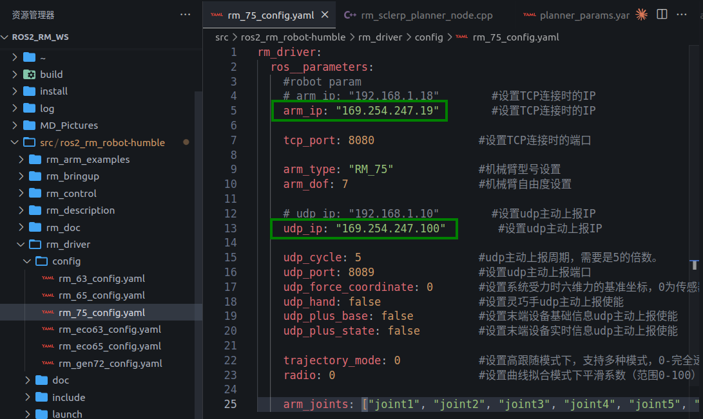
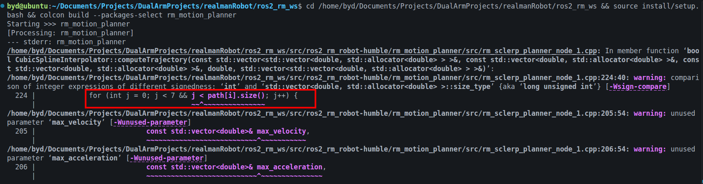

# rm_motion_planner 功能包开发说明

## 应用层节点开发记录

### 单臂控制节点（方案 1）

#### 简介

<span style="text-decoration:underline;">rm_sclerp_planner_node.cpp</span>

一个完整的 ROS 2 节点实现，具有参数配置和定时器功能。它支持通过参数配置起始和目标关节位置，并且可以从 URDF 文件中自动获取机器人链接名称。

只支持单臂控制，使用规划器 `sclerp_interface::ScLERPInterface::planMultiStageTrajectory`

#### 机械臂 IP 设置 💻




#### 通信链路 🪢

> rm_sclerp_planner_node -> rm_control -> rm_driver -> 机械臂硬件

整个通信流程：

1. **rm_sclerp_planner_node** (规划器)
   - 读取参数（服务器）中的起始和目标关节角度
   - 使用 `ScLERP` 算法进行路径规划
   - 通过 `/rm_group_controller/follow_joint_trajectory_action` 将轨迹发送给 rm_control
2. **rm_control**（控制器）
   - 接收来自 `rm_sclerp_planner_node` 的轨迹
   - 使用三次样条插值对轨迹进行细化处理
   - 以 20ms 周期将轨迹点逐一发布到 `/rm_driver/movej_canfd_cmd` 话题
3. **rm_driver**（驱动器）
   - 订阅 `/rm_driver/movej_canfd_cmd` 话题
   - 将接收到的关节角度（弧度）转换为角度值
   - 调用底层 `API （rm_movej_canfd ）` 将命令发送给机械臂


#### 启动流程 🔂

```bash
# 启动驱动
ros2 launch rm_driver rm_75_driver.launch.py

# 启动控制节点
ros2 launch rm_control rm_75_control.launch.py

# 启动运动规划器
ros2 launch rm_motion_planner test_sclerp_planner.launch.p
```


#### 遇到的问题 🙏

###### Q1：生成的轨迹点没有速度和加速度信息导致内存访问错误

**背景**：

在节点源文件中使用 `sclerp_interface::ScLERPInterface::solve` 接口生成的轨迹

```c++
void plan_trajectory(){
...

    // 使用 solve 方法生成轨迹数据
    trajectory_msgs::msg::JointTrajectory joint_trajectory;
    bool success = false;

    try {
        success = planner_interface_->solve(jointAngles_start, matrix_base2tcp_target, joint_trajectory);
    } catch (const std::exception& e) {
        RCLCPP_ERROR(this->get_logger(), "调用规划器solve方法时出错: %s", e.what());
        return;
    }

    if (success && !joint_trajectory.points.empty()) {
        RCLCPP_INFO(this->get_logger(), "规划成功，轨迹点数量: %ld", joint_trajectory.points.size());

        // 保存轨迹数据用于定时发布
        planned_trajectory_ = joint_trajectory;
        trajectory_point_index_ = 0;
        trajectory_executing_ = true;
        trajectory_planned_ = true;  // 标记轨迹已规划

        RCLCPP_INFO(this->get_logger(), "开始以20ms周期发布轨迹点到/rm_driver/movej_canfd_cmd");
    } else {
        RCLCPP_ERROR(this->get_logger(), "规划失败");
    }
        
}
```


**问题描述：**

> 依次启动了 `rm_driver`，`rm_control` 节点， 在启动 `rm_sclerp_planner_node` 前通过 `ro2 node list` 查看了两个节点均启动成功， 但是当启动 rm_sclerp_planner_node 节点后，发现 rm_control 节点被结束进程，且终端输出如下：
>
> ```bash
> [rm_control-1] [INFO] [1754555511.602866952] [rm_control]: First Move_group give us 95 points
> [ERROR] [rm_control-1]: process has died [pid 4085811, exit code -11, cmd '/home/byd/Documents/Projects/DualArmProjects/realmanRobot/ros2_rm_ws/install/rm_control/lib/rm_control/rm_control --ros-args --params-file /tmp/launch_params_768qzche --params-file /tmp/launch_params_3dtpmty8'].
> ```
>


**问题分析**

`rm_control` 节点在接收到轨迹后出现了段错误（Segmentation fault），退出码为-11。这是一个典型的内存访问错误，表明程序试图访问未分配或已释放的内存区域。

这表明：

- rm_control 成功接收到来自规划器的 95 个轨迹点

- 在处理这些轨迹点的过程中发生了段错误（Segmentation fault，退出码-11）

- 错误很可能发生在轨迹插值或处理阶段

  

**可能的原因**

- **轨迹点数据结构问题**：传入的轨迹点可能包含无效或不一致的数据，导致在插值计算时访问非法内存。
- **内存管理问题**：在轨迹处理或插值过程中存在内存访问越界、空指针解引用等问题。
- **参数配置问题**：某些参数配置不正确，导致在轨迹处理时出现异常。
- **第三方库兼容性问题**：使用的数学库或插值库与当前系统环境不兼容。
- 

**深入分析**

为了进一步分析和解决这个问题，查看 rm_control 节点的源代码，特别是处理轨迹的部分。

这个问题出现在 `execute_move` 函数中，具体原因如下：

1. **轨迹点数量不足导致的内存访问问题**：
   - `rm_sclerp_planner_node` 生成的轨迹点只有 95 个点
   - `rm_control` 中的 `execute_move` 函数有特殊处理逻辑：当轨迹点数大于 3 时进行三次样条插值，否则使用原始轨迹点
   - 问题出现在处理较少轨迹点（<= 3 个点）的分支中
2. **具体问题代码位置**： 在 `rm_control.cpp` 的 `execute_move` 函数中，当 `point_num <= 3` 时，会进入以下分支：

```c++
else if (point_num > 0)
{
    // 清空所有轨迹点向量
    p_joint1_.clear();
    // ... 其他向量清空操作
    
    // 直接从轨迹点复制数据
    for (int i = 0; i < point_num; i++) {
        p_joint1_.push_back(goal->trajectory.points[i].positions[0]);
        v_joint1_.push_back(goal->trajectory.points[i].velocities[0]);
        a_joint1_.push_back(goal->trajectory.points[i].accelerations[0]);
        // ... 其他关节数据
    }
    // ...
}
```


**问题根源**

通过查看代码和错误信息，我发现问题的根本原因如下：

1. **段错误（Segmentation Fault）**：rm_control 节点出现段错误（退出码-11），这通常是由于访问了无效的内存地址。

2. **轨迹点数据不完整**：在 rm_sclerp_planner_node 生成的轨迹中，只填充了关节位置（positions）数据，但没有填充速度（velocities）和加速度（accelerations）数据。

3. **rm_control 的访问错误**：rm_control 在处理轨迹点时，无论轨迹点数量多少，都会尝试访问所有数据字段，包括：

   ```c++
   v_joint1_.push_back(goal->trajectory.points[i].velocities[0]);
   a_joint1_.push_back(goal->trajectory.points[i].accelerations[0]);
   ```

   当这些字段为空时，访问它们会导致段错误。

   

**解决方案**

我在 rm_sclerp_planner_node.cpp 中添加了代码，确保所有轨迹点都包含有效的速度和加速度数据：

```c++
// 确保轨迹点包含速度和加速度数据，避免 rm_control 访问空数据导致段错误
for (auto& point : joint_trajectory.points) {
    if (point.velocities.empty()) {
        point.velocities.resize(point.positions.size(), 0.0);
    }
    if (point.accelerations.empty()) {
        point.accelerations.resize(point.positions.size(), 0.0);
    }
}
```

这段代码会检查每个轨迹点，如果速度或加速度数据为空，就用 0 值填充相应大小的向量。


###### Q2：

**新的问题**

> 按照上述建议重构代码并运行节点后，发现机械臂的几个关节进行了瞬间的阶跃运动，然后触发自身控制器报错而下使能停止运动。该现象是否与上述建议中添加的轨迹点的速度和加速度数据有关？
>
> 而且分析可知 sclerp 规划器所在的功能包（sclerp_motion_planner) 中是包含了轨迹点的速度和加速度的生成功能的， 但是 rm_sclerp_planner_node.cpp 中并没有使用该功能, 请索引查阅该功能的所在位置和具体实现，并在节点 cpp 文件中引入该功能。
>
> 此外，基于当前项目代码，分析 MoveIt 规划器输出的轨迹点中的速度和加速度数据是通过何种插值或其他方法求解得到的，如果能查到代码的话，请展示代码并详细说明


**机械臂异常运动原因分析**

根据您的描述和代码分析，机械臂出现异常运动（关节抖动并触发控制器报错）的原因与我们之前添加的轨迹点速度和加速度数据有关。

**问题分析**

1. **轨迹点数据不完整**：
   - ScLERP 规划器生成的轨迹点只有位置数据，没有速度和加速度数据
   - 我们之前尝试手动填充这些数据为 0，但这会导致机械臂控制器认为轨迹不连续，从而触发 "位置指令阶跃警告"
2. **ScLERP 规划器的轨迹生成功能**：
   - ScLERP 规划器内部确实具有生成完整轨迹数据（包括位置、速度、加速度）的能力
   - 但当前的 [rm_sclerp_planner_node.cpp](javascript:void(0))并未使用这些功能，只调用了基本的 [solve](javascript:void(0))方法


**MoveIt 轨迹生成机制**

通过代码搜索发现，MoveIt 使用时间参数化（Time Parameterization）来生成轨迹的速度和加速度数据。在 MoveIt 中：

1. **规划阶段**：
   - 首先生成只包含位置信息的路径点
   - 然后通过时间参数化算法为每个轨迹点计算速度和加速度
2. **时间参数化算法**：
   - MoveIt 通常使用如 `TimeOptimalTrajectoryGeneration` 等算法
   - 这些算法考虑机器人的速度和加速度限制，生成平滑的轨迹


**解决方案**

要解决机械臂异常运动的问题，我们需要：

1. **使用 ScLERP 规划器的完整轨迹生成功能**：
   - 修改代码以使用 [planMultiStageTrajectory](javascript:void(0))方法
   - 该方法能够生成完整的轨迹数据（位置、速度、加速度）
2. **正确处理轨迹数据**：
   - 不要手动填充 0 值到速度和加速度字段
   - 让 ScLERP 规划器生成完整的轨迹数据

由于 ScLERP 规划器的完整接口使用较为复杂，建议使用 MoveIt 作为轨迹规划器，它能生成更高质量的轨迹数据，避免机械臂的异常运动。


**总结**

机械臂出现异常运动的根本原因是轨迹数据不完整或不连续。通过正确使用 ScLERP 规划器的完整轨迹生成功能，或切换到 MoveIt 规划器，可以生成平滑连续的轨迹数据，从而避免机械臂的异常运动行为。


**修改说明**

1. **替换规划方法**：
   - 将原来的 `planner_interface_->solve()` 方法替换为 `planner_interface_->planMultiStageTrajectory()` 方法
   - 这个方法可以生成包含位置、速度和加速度的完整轨迹数据
2. **添加参数配置**：
   - 添加了关节最大速度和加速度限制参数
   - 设置了轨迹生成频率为 20Hz
   - 启用了重采样功能
3. **实现轨迹转换函数**：
   - 添加了 `convertTrajectoryToJointTrajectory` 函数，用于将 ScLERP 规划器生成的轨迹数据转换为 ROS 的 JointTrajectory 消息格式
   - 该函数正确处理位置、速度和加速度数据
4. **优化轨迹发送逻辑**：
   - 移除了之前手动填充速度和加速度为 0 的代码
   - 现在完全依赖规划器生成的完整轨迹数据
   - 

**技术细节**

[planMultiStageTrajectory](javascript:void(0))方法的优势：

- 生成完整的轨迹数据（位置、速度、加速度）
- 考虑了机械臂的物理限制（最大速度和加速度）
- 使用五次插值算法生成平滑轨迹
- 保证轨迹的时间一致性

通过这些修改，机械臂应该不会再出现由于轨迹数据不完整而导致的抖动和位置指令阶跃警告问题。规划器现在会生成完整且平滑的轨迹数据，这些数据包括了执行器需要的所有信息，从而确保机械臂能够平稳、精确地执行运动。


###### Q3：

> 1）在 rm_sclerp_planner_node.cpp 的 plan_and_execute 函数中，之前的代码使用 ScLERPInterface:: solve 函数时，调用方法为 planner_interface_.solve(...)（此处与 sclerp_motion_planner_test.cpp 中的方式一致);
>
> 而使用 ScLERPInterface:: planMultiStageTrajectory 函数时，调用方式却是 planner_interface_-> planMultiStageTrajectory(...), 为什么两个函数的调用方式不同？
>
> 2）在 rm_sclerp_planner_node.cpp 的 plan_and_execute 函数中，使用 ScLERPInterface:: solve 函数时，生成的轨迹点数为 95 ; 而使用 ScLERPInterface:: planMultiStageTrajectory 函数时，生成的轨迹点数是 74 。
>
> 为什么前者生成的数据量远大于后者？两者的区别是什么？如何选择？
>
> 3）在 rm_sclerp_planner_node.cpp 的 plan_and_execute 函数中，调用 planner_interface_-> planMultiStageTrajectory(...) 时， 频率参数为 20 是参考了 rm_control 的话题发布周期吗（）


**1) 为什么两个函数的调用方式不同？**

在 `rm_sclerp_planner_node.cpp` 中，`planner_interface_` 被定义为一个 `std::unique_ptr<sclerp_interface::ScLERPInterface>` 类型的智能指针，

在 `rm_sclerp_planner_test.cpp` 中，`planner_interface` 是直接实例化的对象。

让我们查看一下两处的定义：

在 [rm_sclerp_planner_node.cpp](javascript:void(0)) 中：

```c++
std::unique_ptr<sclerp_interface::ScLERPInterface> planner_interface_;
```

在 [rm_sclerp_planner_test.cpp](javascript:void(0)) 中：

```c++
sclerp_interface::ScLERPInterface planner_interface;
```

因此，

在 [rm_sclerp_planner_node.cpp](javascript:void(0)) 中需要使用 `->` 操作符来访问成员函数，

在 [rm_sclerp_planner_test.cpp](javascript:void(0)) 中使用 `.` 操作符。


**2）为什么轨迹点数不同？**

这两种方法生成的轨迹点数量不同，是因为它们采用了不同的轨迹规划算法：

- [solve()](javascript:void(0)) 方法：
  - 这是一个基础的路径规划方法
  - 生成 95 个轨迹点
  - 主要关注路径规划，不考虑时间参数化
  - 轨迹点数量取决于路径复杂度和插值算法
- [planMultiStageTrajectory()](javascript:void(0)) 方法：
  - 这是一个高级的轨迹规划方法
  - 生成 74 个轨迹点
  - 考虑了时间参数化（速度、加速度）
  - 根据运动学约束（最大速度、最大加速度）自适应生成轨迹点
  - 使用五次插值算法生成平滑轨迹

选择建议：

- 优先选择 planMultiStageTrajectory() 方法，因为它：

  - 生成完整的轨迹数据（位置、速度、加速度）

  - 考虑了机械臂的物理限制

  - 生成更平滑的轨迹

  - 更符合机械臂物理特性

    

**3) 频率参数 20 是否参考了 rm_control 的话题发布周期？**

是的，频率参数 20Hz 确实参考了 [rm_control](javascript:void(0)) 的话题发布周期。[rm_control](javascript:void(0)) 以 20ms 周期（即 50Hz）发布轨迹点到驱动，设置轨迹生成频率为 20Hz（50ms）是为了：

1. 确保轨迹点间隔大于控制器处理周期
2. 避免控制器出现数据饥饿
3. 提供足够的计算余量
4. 保证控制器有足够时间处理每个轨迹点，提高运动的稳定性和精度

这种设置平衡了轨迹精度和控制器处理能力，是工业机器人控制中的常见做法


###### Q4:

> 请贴出详细的代码实现来说明：`rm_sclerp_planner_node` 通过 `/rm_group_controller/follow_joint_trajectory action` 将轨迹发送给 `rm_control`

`rm_sclerp_planner_node` 通过动作 `action` 发送轨迹给 `rm_control` 的详细实现

**1. Action 客户端初始化**

在 `RmSclerpPlannerNode` 构造函数中，创建了与 `rm_control` 通信的 `action` 客户端：

```c++
// 创建 action 客户端，用于与 rm_control 通信
action_client_ptr_ = rclcpp_action::create_client<FollowJointTrajectory>(
    this->get_node_base_interface(),
    this->get_node_graph_interface(),
    this->get_node_logging_interface(),
    this->get_node_waitables_interface(),
    "/rm_group_controller/follow_joint_trajectory");
```


2. **等待 `Action` 服务器启动**

在 `timer_callback()` 函数中，等待 `rm_control` 的 `action` 服务器启动：

```c++
// 等待 action 服务器启动
if (!action_client_ptr_->wait_for_action_server(std::chrono::seconds(1))) {
    RCLCPP_INFO(this->get_logger(), "等待rm_control的action服务器启动...");
    return;
}
```


3. **发送轨迹到 `rm_control`**

在 `send_trajectory_to_control()` 函数中，将轨迹数据通过 `action` 发送给 `rm_control`：

```c++
void send_trajectory_to_control(const trajectory_msgs::msg::JointTrajectory & trajectory)
{
    // 创建目标消息
    auto goal_msg = FollowJointTrajectory::Goal();
    
    // 复制轨迹数据，包括位置、速度和加速度
    goal_msg.trajectory = trajectory;
    
    // 确保关节名称正确设置
    goal_msg.trajectory.joint_names = {"joint1", "joint2", "joint3", "joint4", "joint5", "joint6", "joint7"};
        
    // 确保轨迹点中包含速度和加速度数据
    for (auto & point : goal_msg.trajectory.points) {
        if (point.velocities.empty()) {
            point.velocities.resize(point.positions.size(), 0.0); // 默认速度为 0
        }
        if (point.accelerations.empty()) {
            point.accelerations.resize(point.positions.size(), 0.0); // 默认加速度为 0
        }
    }
    
    // 发送目标到 action 服务器
    RCLCPP_INFO(this->get_logger(), "发送轨迹到rm_control...");
    
    auto send_goal_options = rclcpp_action::Client<FollowJointTrajectory>::SendGoalOptions();
    send_goal_options.goal_response_callback = 
        [this](const GoalHandleFollowJointTrajectory::SharedPtr & goal_handle) {
            if (!goal_handle) {
                RCLCPP_ERROR(this->get_logger(), "目标被服务器拒绝");
            } else {
                RCLCPP_INFO(this->get_logger(), "目标被服务器接受，等待执行结果");
            }
        };
        
    send_goal_options.result_callback = 
        [this](const GoalHandleFollowJointTrajectory::WrappedResult & result) {
            switch (result.code) {
                case rclcpp_action::ResultCode::SUCCEEDED:
                    RCLCPP_INFO(this->get_logger(), "轨迹执行成功");
                    break;
                case rclcpp_action::ResultCode::ABORTED:
                    RCLCPP_ERROR(this->get_logger(), "目标被中止");
                    break;
                case rclcpp_action::ResultCode::CANCELED:
                    RCLCPP_ERROR(this->get_logger(), "目标被取消");
                    break;
                default:
                    RCLCPP_ERROR(this->get_logger(), "未知结果代码");
                    break;
            }
            rclcpp::shutdown();
        };

    auto goal_handle_future = action_client_ptr_->async_send_goal(goal_msg, send_goal_options);
}
```


**4. 整体流程**

整个流程如下：

- 在 [plan_and_execute()](javascript:void(0))函数中，使用 ScLERP 规划器生成完整的轨迹数据
- 调用 [convertTrajectoryToJointTrajectory()](javascript:void(0))函数将轨迹数据转换为 JointTrajectory 消息格式
- 调用 [send_trajectory_to_control()](javascript:void(0))函数将轨迹发送给 rm_control


5. **Action 通信细节**

- **Action 名称**：`/rm_group_controller/follow_joint_trajectory`
- **Action 类型**：`control_msgs::action::FollowJointTrajectory`
- **通信方式**：异步发送目标，注册回调函数处理响应和结果

6. **轨迹数据完整性保证**

在发送轨迹之前，确保轨迹数据的完整性：

```c++
// 确保轨迹点中包含速度和加速度数据
for (auto & point : goal_msg.trajectory.points) {
    if (point.velocities.empty()) {
        point.velocities.resize(point.positions.size(), 0.0); // 默认速度为 0
    }
    if (point.accelerations.empty()) {
        point.accelerations.resize(point.positions.size(), 0.0); // 默认加速度为 0
    }
}
```


**总结**

rm_sclerp_planner_node 通过以下步骤将轨迹发送给 rm_control：

1. 创建与 rm_control 通信的 action 客户端
2. 等待 rm_control 的 action 服务器启动
3. 使用 ScLERP 规划器生成包含位置、速度和加速度的完整轨迹数据
4. 将轨迹数据封装为 FollowJointTrajectory:: Goal 消息
5. 通过 async_send_goal()异步发送轨迹到 rm_control
6. 注册回调函数处理服务器响应和执行结果

这种设计实现了规划器与控制器的解耦，确保了系统的模块化和可扩展性


### 单臂控制节点 （方案 2）

rm_sclerp_planner_node_1.cpp

#### **应用背景**

> 当 <rm_sclerp_planner_node.cpp> 中调用 ScLERPInterface:: solve 函数时，生成的轨迹中只填充了关节位置（positions）数据，但没有填充速度（velocities）和加速度（accelerations）数据；根据当前节点的控制流程，这种轨迹数据传递给 rm_control 的时，会导致访问错误，终止 rm_control 节点。
>
> 为了解决上述问题，现决定对 rm_motion_planner 功能包作出如下几点改动：
>
> 1）建一个名为 rm_sclerp_planner_node_1.cpp 的节点源文件，整体框架与 rm_sclerp_planner_node.cpp 相似，不同之处见下文；
>
> 2）在 rm_sclerp_planner_node_1.cpp 中，用 ScLERPInterface:: solve 函数进行轨迹点的生成，并去除与 rm_control 通信的 action 客户端；同时增新一个类似 rm_control 中的定时器和回调函数，能够以 10ms 周期发布轨迹点到 /rm_driver/movej_canfd_cmd 话题，这样就能绕过 rm_control，直接实现 rm_sclerp_planner_node —> rm_driver 的控制流程；
>
> 3）新增名为 test_sclerp_planner_1.launch.py 的启动文件， 内容与 test_sclerp_planner.launch.py 相同，不同之处在于节点名称为 rm_sclerp_planner_node_1；
>
> 4）修改 CMakeLists.txt, 新增与 rm_sclerp_planner_node_1 节点相关的编译信

完成了以下四项改动：

1. 创建了新的节点源文件 [rm_sclerp_planner_node_1.cpp](javascript:void(0))

这个新文件基于原有的 [rm_sclerp_planner_node.cpp](javascript:void(0))，但做了以下关键改动：

- 移除了与 [rm_control](javascript:void(0)) 通信的 action 客户端
- 添加了直接向 `/rm_driver/movej_canfd_cmd` 话题发布轨迹点的功能
- 实现了 10ms 周期的定时器回调函数来发布轨迹点
- 使用 ScLERPInterface:: solve 方法生成轨迹数据

2. 创建了新的启动文件 `test_sclerp_planner_1.launch.py`

这个新启动文件与原来的 [test_sclerp_planner.launch.py](javascript:void(0)) 内容相同，但将节点名称改为 [rm_sclerp_planner_node_1](javascript:void(0))。

3. 更新了 `CMakeLists.txt` 文件

在 [CMakeLists.txt](javascript:void(0)) 中添加了对新节点 [rm_sclerp_planner_node_1](javascript:void(0)) 的编译支持：

- 添加了新的可执行文件目标
- 配置了必要的包含目录和链接库
- 将新节点添加到安装目标中

4. 成功编译了修改后的包

经过修复 ScLERPInterface:: solve 方法的参数使用问题后，整个 [rm_motion_planner](javascript:void(0)) 包成功编译。

新实现的特点

1. **绕过 rm_control**：新节点直接将轨迹点发布到 `/rm_driver/movej_canfd_cmd` 话题，绕过了 rm_control 节点。

2. **10ms 发布周期**：使用定时器以 10ms 的周期发布轨迹点，确保实时性。

3. **直接控制**：实现了从规划器到驱动器的直接控制链路

   

#### 通信链路 🚥

> rm_sclerp_planner_node_1 -> rm_driver -> 机械臂硬件

整个通信/执行流程：

1. **rm_sclerp_planner_node_1** 节点 (规划器)

   - 读取参数（服务器）中的起始和目标关节角度
   - 使用 `ScLERP` 算法进行路径规划

   - 以 20ms 周期将轨迹点逐一发布到 `/rm_driver/movej_canfd_cmd` 话题

2. **rm_driver** 节点（驱动器）

   - 订阅 `/rm_driver/movej_canfd_cmd` 话题
   - 将接收到的关节角度（弧度）转换为角度值
   - 调用底层 `API （rm_movej_canfd ）` 将命令发送给机械臂


#### 启动流程 🔂

只需要启动以下组件:

1. **单臂驱动节点** - 处理与机械臂的通信
2. **单臂规划节点** - 生成并发布轨迹

```bash
# 启动驱动
ros2 launch rm_driver rm_75_driver.launch.py

# 启动运动规划器
ros2 launch rm_motion_planner test_sclerp_planner_1.launch.py
```


#### 问题记录

##### Q1: 二次插值后轨迹点数量问题

> 在 rm_sclerp_planner_node_1.cpp 文件的 `plan_trajectory()` 函数中添加了与 `/sclerp_motion_planner/src/example_aubo_server.cpp` 中相同的二次插值处理代码后，运行节点，规划器中插值后的轨迹点数量为 809, 机械臂运动比较缓慢，比添加二次插值处理前的速度慢很多，为什么会这样？
>
> 是因为二次插值后的点数太多的原因吗？
>
> 是什么决定了插值点数量？
>
> 插值点数量与插值频率有关吗

**为什么添加二次插值处理后机械臂运动变慢了？**

是的，运动变慢确实与插值点数量过多有关。具体原因如下：

1. **插值点数量过多的原因**

在你的代码中，插值点数量主要由以下因素决定：

1. **插值频率设置过高**：你在代码中设置了 250Hz 的插值频率，这会产生大量的轨迹点。
2. **轨迹点发布频率与插值频率不匹配**：轨迹点以 20ms(50Hz)的频率发布，但插值是以 250Hz 生成的，导致大量轨迹点堆积。

**2. 影响插值点数量的因素**

根据对 [QuinticInterpolator](javascript:void(0))的分析，插值点数量主要由以下因素决定：

1. **插值频率(frequency)**：频率越高，生成的轨迹点越多
2. **路径段之间的时间间隔计算**：在 [computeTrajectory](javascript:void(0))函数中，会根据关节的最大速度和加速度限制计算每段路径所需的时间
3. **每段路径的时间被离散化为多个步骤**：`num_steps = static_cast<size_t>(std::ceil(T / dt))`

**3. 插值点数量与插值频率的关系**

是的，插值点数量与插值频率直接相关：

1. 插值频率越高，生成的轨迹点越多
2. 在你的例子中，250Hz 的插值频率意味着每秒生成 250 个轨迹点
3. 如果轨迹总时长为 3 秒，那么总共会生成约 750 个轨迹点，这与你观察到的 809 个点基本吻合

4. **解决方案**

为了提高运动速度，你可以尝试以下几种方法：

1. **降低插值频率**：将 250Hz 降低到更合适的值，如 100Hz 或 50Hz
2. **提高轨迹点发布频率**：将轨迹点发布频率从 20ms(50Hz)提高到更短的时间间隔
3. **调整最大速度和加速度参数**：增加 max_velocity 和 max_acceleration 的值

例如，你可以将代码修改为：

```cpp
// 降低插值频率
double frequency = 100;  // 从 250 改为 100

// 或者提高轨迹点发布频率
// 在构造函数中修改轨迹定时器
trajectory_timer_ = this->create_wall_timer(
    std::chrono::milliseconds(10),  // 从 20ms 改为 10ms
    std::bind(&RmSclerpPlannerNode1::trajectory_timer_callback, this));
```

这样可以显著减少轨迹执行时间，提高机械臂运动速度


##### Q2: 轨迹定时器发布频率

> 在构造函数中，除了轨迹定时器的发布频率从 20ms 改为 10ms 外，构造函数中的发布者，订阅者，定时器的（代码片段如下）周期是否也要同步改动？
>
> ```
> // 创建发布者，用于直接向 rm_driver 发送轨迹点
> 
> joint_pos_publisher_ = this-> create_publisher < rm_ros_interfaces::msg::Jointpos >( "/rm_driver/movej_canfd_cmd", 20);
> 
> // 创建订阅者，用于获取当前关节位置 // 修改订阅话题为/joint_states，这是 rm_driver 实际发布关节状态的话题 
> 
> joint_state_subscriber_ = this-> create_subscription < sensor_msgs::msg::JointState >( "/joint_states", 20, std:: bind(&RmSclerpPlannerNode1:: joint_state_callback, this, std::placeholders::_1));
> 
> // 创建定时器，用于周期性检查和执行任务 
> 
> timer_ = this-> create_wall_timer( std::chrono:: milliseconds(100), // 100ms 检查一次 std:: bind(&RmSclerpPlannerNode1:: timer_callback, this));
> 
> // 创建 10ms 定时器用于发布轨迹点
> 
> trajectory_timer_ = this-> create_wall_timer( std::chrono:: milliseconds(10), std:: bind(&RmSclerpPlannerNode1:: trajectory_timer_callback, this));
> ```
>
> 


不需要改动其他组件的参数。让我解释一下为什么：

1. **发布者队列大小**：发布者队列大小`（“/rm_driver/movej_canfd_cmd”, 20）`是消息队列的大小，不是发送频率。它表示在消息被发送前可以排队的消息数量（或是在消息处理不过来时可以缓存的消息数），与定时器频率无关。

   ```c++
   joint_pos_publisher_ = this->create_publisher<rm_ros_interfaces::msg::Jointpos>(
       "/rm_driver/movej_canfd_cmd", 20);
   ```

   

2. **订阅者队列大小**：订阅者队列大小（`/joint_states`, 20）同样也是消息队列的大小，不是接收频率。它表示在回调函数处理前可以排队的消息数量，与定时器频率无关。

   ```c++
   joint_state_subscriber_ = this->create_subscription<sensor_msgs::msg::JointState>(
       "/joint_states", 20,
       std::bind(&RmSclerpPlannerNode1::joint_state_callback, this, std::placeholders::_1));
   ```

   

3. **主定时器**：主定时器（100ms）用于周期性检查和执行任务，与轨迹执行无关，不需要改变。

只有轨迹定时器需要调整，因为它是控制轨迹点发布的频率。其他组件的参数与轨迹执行速度无关，保持原样即可。

```c++
timer_ = this->create_wall_timer(
    std::chrono::milliseconds(100),  // 100ms 检查一次
    std::bind(&RmSclerpPlannerNode1::timer_callback, this));
```


**不需要修改其他组件的原因**

1. **发布者队列大小** (`/rm_driver/movej_canfd_cmd`, 20)：
   - 这个参数是消息队列的大小，不是发送频率
   - 它决定了在消息被实际发送前可以缓存多少条消息
   - 与轨迹执行速度无关，不需要修改
2. **订阅者队列大小** (`/joint_states`, 20)：
   - 同样是消息队列大小参数，不是接收频率
   - 控制着在回调函数处理前可以缓存的消息数量
   - 与轨迹执行速度无关，不需要修改
3. **主定时器** (100ms)：
   - 用于周期性检查和执行任务（如检查是否需要规划）
   - 与轨迹执行本身无关，不需要修改

**只需修改轨迹定时器的原因**

轨迹定时器是直接影响轨迹点发布的频率：

- 原来的 20ms 意味着每秒发布 50 个轨迹点
- 修改后的 10ms 意味着每秒发布 100 个轨迹点
- 这会显著提高机械臂的运动响应速度

通过将轨迹定时器从 20ms 改为 10ms，配合之前降低插值频率的修改（从 250Hz 改为 100Hz 或适当值），可以有效解决机械臂运动缓慢的问题。

这样修改后，机械臂应该会有明显的速度提升，同时保持运动的平滑性。

###### Q2.1: 机械臂抖动不平稳的现象

> 按照上诉建议修改节点程序后重新编译运行节点，发现机械臂的速度虽然有所提升，但是运动过程存在抖动不平稳的现象，分析原因并给出解决办法

**可能的原因**

1. **插值频率与轨迹发布频率不匹配**：虽然我们将轨迹发布频率提高到 10ms，但如果插值点数量过多，仍可能导致运动不平滑。
2. **速度和加速度限制设置不合理**：我们在插值处理中设置了固定的速度和加速度限制，可能与机械臂的实际性能不匹配。
3. **插值算法参数设置不当**：五次多项式插值的参数可能需要调整以适应特定的机械臂特性。
4. **轨迹点之间的时间间隔设置问题**：轨迹点间的时间戳设置可能不准确。

**原因排查分析**

根据你的描述，机械臂在运动过程中出现抖动不平稳的现象，可能有以下几个原因：

1. 插值频率与轨迹发布频率不匹配

你将插值频率设置为 50Hz，但轨迹发布频率为 20ms（50Hz），两者刚好匹配。这是一个合理的设置。

2. 速度和加速度参数设置

我们已经将最大关节速度从 2.0 rad/s 降低到 1.0 rad/s，最大关节加速度从 10.0 rad/s² 降低到 3.0 rad/s²，这样可以确保运动更加平滑。

3. 轨迹点数量仍然过多

即使降低了插值频率到 50Hz，生成的轨迹点数量可能仍然较多，导致运动不够平滑。

4. 机械臂控制器特性

机械臂控制器可能对高频轨迹点的响应不够平滑，特别是在关节角度变化较大的情况下。

**解决方案总结**

我已经对代码进行了以下优化：

1. **降低插值频率**：从 100Hz 降低到 50Hz，减少轨迹点数量

2. 降低速度和加速度限制

   ：使运动更加平滑

   - 最大关节速度：从 2.0 rad/s 降低到 1.0 rad/s
   - 最大关节加速度：从 10.0 rad/s² 降低到 3.0 rad/s²

3. **调整轨迹发布频率**：将轨迹发布频率从 10ms 调整为 20ms，与插值频率更好地匹配

**进一步的建议**

如果调整后仍然存在抖动现象，可以尝试以下方法：

1. **进一步降低速度和加速度限制**
2. **进一步降低插值频率**：可以尝试将插值频率降低到 25Hz 或更低
3. **使用更平滑的插值算法**：考虑使用样条插值或其他更平滑的插值方法
4. **调整机械臂控制器参数**：检查机械臂控制器的增益参数是否合适
5. **增加滤波处理**：在插值后对轨迹进行滤波处，使用低通滤波器减少高频抖动

###### Q2.2：在二次插值后增加低通滤波功能

1. **滤波器实现**

我在插值处理之后添加了一个简单的移动平均低通滤波器：

- 使用 3 点移动平均窗口对轨迹进行平滑处理
- 对每个关节分别进行滤波处理
- 对边界点采用特殊处理确保轨迹完整性

2. **滤波算法细节**

- **内部点处理**：使用加权平均 `(prev + current*2 + next) / 4`
- **边界点处理**：使用加权平均 `(current*3 + next) / 4` 和 `(prev + current*3) / 4`
- 这种加权方式可以更好地保持轨迹的整体形状，同时减少高频抖动

3. **滤波效果**

- 减少轨迹点之间的突变，使关节运动更加平滑
- 保持轨迹的主要特征和目标位置不变
- 有效抑制高频噪声和抖动

4. **实现优势**

- 算法简单，计算量小，适合实时应用
- 不会显著增加轨迹执行时间
- 可以有效改善机械臂运动的平滑性

这个低通滤波器会在保持轨迹整体形状的同时，显著减少机械臂运动过程中的抖动现象，提高运动的平滑性和稳定性

```c++
// 轨迹平滑滤波 - 使用低通滤波器减少高频抖动
// 对轨迹进行低通滤波处理，平滑关节运动
if (trajectory.size() > 2) {
    // 创建滤波后的轨迹
    std::vector<std::vector<double>> filtered_trajectory = trajectory;
    
    // 对每个关节应用低通滤波器
    for (size_t joint = 0; joint < 7; ++joint) {
        // 简单的移动平均滤波器（窗口大小为 3）
        for (size_t i = 1; i < trajectory.size() - 1; ++i) {
            filtered_trajectory[i][joint] = (
                trajectory[i-1][joint] + 
                trajectory[i][joint] * 2.0 + 
                trajectory[i+1][joint]
            ) / 4.0;
        }
        
        // 处理边界点
        if (trajectory.size() > 1) {
            filtered_trajectory[0][joint] = (
                trajectory[0][joint] * 3.0 + 
                trajectory[1][joint]
            ) / 4.0;
            
            filtered_trajectory[trajectory.size()-1][joint] = (
                trajectory[trajectory.size()-2][joint] + 
                trajectory[trajectory.size()-1][joint] * 3.0
            ) / 4.0;
        }
    }
```


##### Q3：三次样条插值算法接口实现

###### Q3.1 编译警告



```bash
Starting >>> rm_motion_planner
[Processing: rm_motion_planner]                             
--- stderr: rm_motion_planner                                
/home/byd/Documents/Projects/DualArmProjects/realmanRobot/ros2_rm_ws/src/ros2_rm_robot-humble/rm_motion_planner/src/rm_sclerp_planner_node_1.cpp: In member function ‘boo
l CubicSplineInterpolator::computeTrajectory(const std::vector<std::vector<double, std::allocator<double> > >&, const std::vector<double, std::allocator<double> >&, const std::vector<double, std::allocator<double> >&, double, std::vector<std::vector<double, std::allocator<double> > >&)’:                                                  /home/byd/Documents/Projects/DualArmProjects/realmanRobot/ros2_rm_ws/src/ros2_rm_robot-humble/rm_motion_planner/src/rm_sclerp_planner_node_1.cpp:224:40: warning: compari
son of integer expressions of different signedness: ‘int’ and ‘std::vector<double, std::allocator<double> >::size_type’ {aka ‘long unsigned int’} [-Wsign-compare]         224 |             for (int j = 0; j < 7 && j < path[i].size(); j++) {
      |                                      ~~^~~~~~~~~~~~~~~~
/home/byd/Documents/Projects/DualArmProjects/realmanRobot/ros2_rm_ws/src/ros2_rm_robot-humble/rm_motion_planner/src/rm_sclerp_planner_node_1.cpp:205:54: warning: unused 
parameter ‘max_velocity’ [-Wunused-parameter]                                                                                                                              205 |                           const std::vector<double>& max_velocity,
      |                           ~~~~~~~~~~~~~~~~~~~~~~~~~~~^~~~~~~~~~~~
/home/byd/Documents/Projects/DualArmProjects/realmanRobot/ros2_rm_ws/src/ros2_rm_robot-humble/rm_motion_planner/src/rm_sclerp_planner_node_1.cpp:206:54: warning: unused 
parameter ‘max_acceleration’ [-Wunused-parameter]                                                                                                                          206 |                           const std::vector<double>& max_acceleration,
      |                           ~~~~~~~~~~~~~~~~~~~~~~~~~~~^~~~~~~~~~~~~~~~
---
Finished <<< rm_motion_planner [51.5s]

Summary: 1 package finished [54.1s]
  1 package had stderr output: rm_motion_planner

```

**警告解释**

1. **类型不匹配警告**：

   ```bash
   warning: comparison of integer expressions of different signedness: 'int' and 'std::vector<double, std::allocator<double> >::size_type'
   ```

   这个警告是因为在比较 `int` 类型的变量 `j` 和 `size_t` 类型的 `path[i].size()` 时，它们的符号性不同（一个是有符号整数，一个是无符号整数）。

2. **未使用参数警告**：

   ```bash
   warning: unused parameter 'max_velocity'
   warning: unused parameter 'max_acceleration'
   ```

   这些警告表明在 `computeTrajectory` 函数中声明了 `max_velocity` 和 `max_acceleration` 参数，但在函数体中没有使用它们。

**修复的警告问题**

1. 类型不匹配警告

**问题**：在循环中使用了 `int` 类型的索引变量 `j` 与 `size_t` 类型的 `path[i].size()` 进行比较，这会导致类型不匹配警告。

**解决方案**：

- 将所有的索引变量从 `int` 类型改为 `size_t` 类型
- 这样可以确保比较操作在相同类型的变量之间进行

2. 未使用参数警告

**问题**：函数声明了 `max_velocity` 和 `max_acceleration` 参数，但在函数体中没有使用它们。

**解决方案**：

- 使用 `(void)parameter_name;` 语法明确表示这些参数是有意不使用的
- 这样可以消除编译器警告，同时保留参数以保持函数接口的一致性
- 添加注释说明将来可能会使用这些参数

**具体修改内容**

1. **索引类型统一**：
   - 将所有循环索引变量从 `int` 改为 `size_t`
   - 这符合现代 C++的最佳实践，因为容器的 `size()` 方法返回的就是 `size_t` 类型
2. **参数使用声明**：
   - 添加 `(void)max_velocity;` 和 `(void)max_acceleration;` 语句
   - 这告诉编译器这些参数是有意不使用的，消除了警告
3. **类型转换**：
   - 在调用需要 `int` 类型参数的函数时，使用 `static_cast<int>(point_num)` 进行显式类型转换

这些修改确保了代码能够无警告地编译，同时保持了代码的清晰性和一致性。将来如果需要使用 `max_velocity` 和 `max_acceleration` 参数来限制插值轨迹的速度和加速度，可以很容易地添加相应的实现.


### 双臂控制节点

#### 简介

只支持双臂控制，使用规划器 `sclerp_interface::ScLERPInterface::solve`

在同一个节点中管理两个机械臂的规划和控制，这种方法的优点是资源利用效率高，便于协调双臂操作。


#### 通信链路 🚥

> rm_sclerp_planner_node -> rm_driver -> 机械臂硬件


#### 启动流程 🔂

**单独启动规划器节点**（用于测试）：

```bash
ros2 launch rm_motion_planner rm_dual_arm_sclerp_planner.launch.py
```

**启动完整双臂系统**：

```bash
ros2 launch rm_bringup rm_dual_arm_bringup.launch.py
```


#### 规划器节点源文件（cpp)

`rm_motion_planner/src/rm_dual_arm_sclerp_planner_node.cpp`

**参数配置**：为每个机械臂分别配置参

```c++
// 为左臂和右臂分别配置起始和目标位置
this->declare_parameter<std::string>("left_arm.start_joint_positions", "0.0,0.0,0.0,0.0,0.0,0.0,0.0");
this->declare_parameter<std::string>("right_arm.start_joint_positions", "0.0,0.0,0.0,0.0,0.0,0.0,0.0");
this->declare_parameter<std::string>("left_arm.target_joint_positions", "0.1,0.1,0.1,0.1,0.1,0.1,0.1");
this->declare_parameter<std::string>("right_arm.target_joint_positions", "0.1,0.1,0.1,0.1,0.1,0.1,0.1");
```

**规划器实例**：为每个机械臂创建独立的规划器实例：

```c++
// 左臂轨迹发布者
rclcpp::Publisher<rm_ros_interfaces::msg::Jointpos>::SharedPtr left_arm_publisher_;
// 右臂轨迹发布者
rclcpp::Publisher<rm_ros_interfaces::msg::Jointpos>::SharedPtr right_arm_publisher_;
```

**话题发布者**：为每个机械臂创建独立的话题发布者

```c++
// 左臂轨迹发布者
rclcpp::Publisher<rm_ros_interfaces::msg::Jointpos>::SharedPtr left_arm_publisher_;
// 右臂轨迹发布者
rclcpp::Publisher<rm_ros_interfaces::msg::Jointpos>::SharedPtr right_arm_publisher_;
```

**关节状态订阅**：订阅两个机械臂的关节状态

```c++
// 左臂关节状态订阅者
rclcpp::Subscription<sensor_msgs::msg::JointState>::SharedPtr left_joint_state_sub_;
// 右臂关节状态订阅者
rclcpp::Subscription<sensor_msgs::msg::JointState>::SharedPtr right_joint_state_sub_;
```

**轨迹执行**：

```c++
// 左臂轨迹执行相关变量
trajectory_msgs::msg::JointTrajectory left_planned_trajectory_;
bool left_trajectory_executing_ = false;
size_t left_trajectory_point_index_ = 0;

// 右臂轨迹执行相关变量
trajectory_msgs::msg::JointTrajectory right_planned_trajectory_;
bool right_trajectory_executing_ = false;
size_t right_trajectory_point_index_ = 0;
```


**话题命名规范**

根据对 rm_driver 的分析，需要为双臂使用不同的话题名称：

- 左臂控制话题：`/left_arm/movej_canfd_cmd`
- 右臂控制话题：`/right_arm/movej_canfd_cmd`
- 左臂状态话题：`/left_arm/joint_states`
- 右臂状态话题：`/right_arm/joint_states`


#### 规划器节点参数文件 (YAML)

`rm_motion_planner/config/rm_dual_arm_sclerp_planner_params.yaml`

```yaml
rm_dual_arm_sclerp_planner_node:
  ros__parameters:
    # 左臂起始关节角度 (弧度)
    left_arm.start_joint_positions: "-0.0509, 0.6369, 1.8329, 1.4736, -0.0057, 0.6149, -0.0495"
    
    # 左臂目标关节角度 (弧度)
    left_arm.target_joint_positions: "0.549, 0.594, 1.275, 1.294, 0.147, 0.454, -0.160"
    
    # 左臂URDF文件路径（如果为空，则使用MoveIt的robot_description参数）
    left_arm.urdf_path: "/home/byd/Documents/Projects/DualArmProjects/realmanRobot/ros2_rm_ws/src/ros2_rm_robot-humble/rm_description/urdf/rm_75_6fb.urdf"

    # 右臂起始关节角度 (弧度)
    right_arm.start_joint_positions: "0.0, 0.0, 0.0, 0.0, 0.0, 0.0, 0.0"
    
    # 右臂目标关节角度 (弧度)
    right_arm.target_joint_positions: "0.1, 0.1, 0.1, 0.1, 0.1, 0.1, 0.1"
    
    # 右臂URDF文件路径（如果为空，则使用MoveIt的robot_description参数）
    right_arm.urdf_path: "/home/byd/Documents/Projects/DualArmProjects/realmanRobot/ros2_rm_ws/src/ros2_rm_robot-humble/rm_description/urdf/rm_75_6fb.urdf"
```


#### 规划器节点启动文件 (launch)

`rm_motion_planner/launch/rm_dual_arm_sclerp_planner.launch.py`


#### 机械臂驱动节点配置文件 (config)

`rm_driver/config/rm_left_arm_config.yaml`

`rm_driver/config/rm_right_arm_config.yaml`


对于双臂系统，需要为每个机械臂创建独立的驱动配置。可以在 `rm_driver/config` 目录中创建 `left_arm_config.yaml` 和 `right_arm_config.yaml` 文件：

`left_arm_config.yaml` 内容：

```yaml
rm_driver:
  ros__parameters:
    #robot param
    arm_ip: "192.168.1.18"        # 左臂IP地址
    tcp_port: 8080                # TCP连接端口
    arm_type: "RM_75"             # 机械臂型号设置 
    arm_dof: 7                    # 机械臂自由度设置
    udp_ip: "192.168.1.100"       # UDP主动上报IP
    udp_cycle: 5                  # UDP主动上报周期
    udp_port: 8089                # UDP主动上报端口
    udp_force_coordinate: 0       # 六维力基准坐标
    udp_hand: false               # 灵巧手UDP主动上报使能
    udp_plus_base: false          # 末端设备基础信息UDP主动上报使能
    udp_plus_state: false         # 末端设备实时信息UDP主动上报使能
    trajectory_mode: 0            # 轨迹模式
    radio: 0                      # 平滑系数
    arm_joints: ["joint1", "joint2", "joint3", "joint4", "joint5", "joint6", "joint7"]
```

`right_arm_config.yaml` 内容：

```yaml
rm_driver:
  ros__parameters:
    #robot param
    arm_ip: "192.168.1.19"        # 右臂IP地址
    tcp_port: 8080                # TCP连接端口
    arm_type: "RM_75"             # 机械臂型号设置 
    arm_dof: 7                    # 机械臂自由度设置
    udp_ip: "192.168.1.100"       # UDP主动上报IP
    udp_cycle: 5                  # UDP主动上报周期
    udp_port: 8090                # UDP主动上报端口（与左臂不同）
    udp_force_coordinate: 0       # 六维力基准坐标
    udp_hand: false               # 灵巧手UDP主动上报使能
    udp_plus_base: false          # 末端设备基础信息UDP主动上报使能
    udp_plus_state: false         # 末端设备实时信息UDP主动上报使能
    trajectory_mode: 0            # 轨迹模式
    radio: 0                      # 平滑系数
    arm_joints: ["joint1", "joint2", "joint3", "joint4", "joint5", "joint6", "joint7"
```


#### 双臂驱动节点启动文件(launch)

`rm_driver/launch/rm_dual_arm_driver.launch.py`


#### 双臂系统整体启动文件 (launch)

`rm_bringup/launch/rm_ dual_arm_bringup.launch.py`

我们已经有了 [rm_dual_arm_sclerp_planner.launch.py](javascript:void(0)) 启动文件，它用于启动规划器节点。但是，为了完整运行双臂系统，我们还需要一个更高级别的启动文件来同时启动：

1. 左臂驱动节点
2. 右臂驱动节点
3. 双臂规划器节点


。