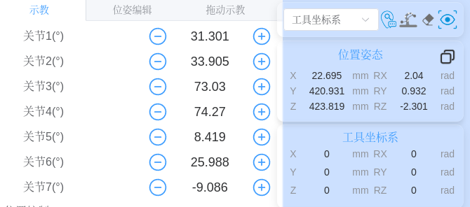
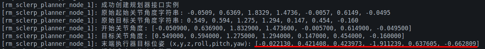

# rm_sclerp_planner_node_1.cpp 开发说明

## 1. 概述 🏠

`rm_sclerp_planner_node_1.cpp` 是一个基于 ROS2 Humble 的机械臂运动规划节点，主要用于 Realman RM 系列机械臂的运动控制。该节点实现了基于 Screw Linear Interpolation (ScLERP) 算法的运动规划功能，并通过 RM API 和 kinlib 库进行正向运动学计算。

## 2. 主要功能 🛠

1. **运动规划**: 使用 ScLERP 算法进行机械臂轨迹规划
2. **正向运动学计算**: 通过 kinlib 和 RM API 进行 FK 计算
3. **轨迹插值**: 使用三次样条插值对轨迹进行细化处理
4. **关节控制**: 通过 `/rm_driver/movej_canfd_cmd` 话题发送关节位置指令

## 3. 核心组件 🚃

### 3.1 ScLERP 规划器接口

- 使用 `sclerp_interface::ScLERPInterface` 类实现
- 基于 `URDF` 模型和 `KDL` 库提取机械臂参数
- 实现 Screw Linear Interpolation 运动规划算法

### 3.2 正向运动学计算

- **kinlib 库**: 提供基于 Eigen 的正向运动学计算
- **RM API**: 提供基于 RM 算法库的正向运动学计算
- 两种方法的结果可以进行对比验证

### 3.3 轨迹插值

- 使用 `CubicSplineInterpolator` 类实现三次样条插值
- 对规划后的轨迹点进行细化处理，提高运动平滑性

## 4. URDF 和 KDL 参数提取实现

在 ROS 节点源文件中，系统通过 URDF 文件和 KDL 库提取机械臂 DH 参数信息的实现步骤如下：

### 4.1 URDF 模型加载

```cpp
urdf::Model urdf_model;
urdf_model.initFile(robot_desc_file); // 加载 URDF 文件
```

### 4.2 KDL 树构建

```cpp
KDL::Tree robot_tree;
kdl_parser::treeFromFile(robot_desc_file, robot_tree); // 转换为 KDL 树
```

### 4.3 机械臂链提取

```cpp
KDL::Chain manip_chain;
robot_tree.getChain(base_link_name, tip_link_name, manip_chain); // 提取链结构
```

### 4.4 关节信息处理核心逻辑

```cpp
for(int itr = 0; itr < manip_chain.getNrOfSegments(); itr++) {
    KDL::Segment chain_seg = manip_chain.getSegment(itr);
    KDL::Joint jnt = chain_seg.getJoint();

    // 处理旋转关节
    if(jnt.getType() == KDL::Joint::JointType::RotAxis) {
        manipulator_.addJoint(...); // 添加旋转关节信息
    }
}
```

### 4.5 参数存储结构

提取的 DH 参数信息最终存储在 Manipulator 对象中，包含：

- `joint_axes_`：关节轴向量
- `joint_q_`：关节位置
- `joint_types_`：关节类型
- `gst0_`：末端执行器参考配置

这些信息为后续正向运动学计算提供了必要的参数基础。

## 5. 机械臂正向运动学计算完整流程

### 步骤1：节点初始化与URDF文件加载

- 文件: rm_sclerp_planner_node_1.cpp

- 接口: initialize_planner()
- 功能: 通过参数获取URDF文件路径并创建ScLERPInterface实例

代码片段:

```cpp
// 在initialize_planner()函数中
std::string urdf_path;
this->get_parameter("urdf_path", urdf_path);

// 创建ScLERP运动规划器实例
if (!urdf_path.empty()) {
    RCLCPP_INFO(this->get_logger(), "使用指定的URDF文件: %s", urdf_path.c_str());
    planner_interface_ = std::make_unique<sclerp_interface::ScLERPInterface>(
        base_link, tip_link, shared_from_this(), urdf_path);
} else {
    RCLCPP_INFO(this->get_logger(), "使用默认的MoveIt参数服务器");
    planner_interface_ = std::make_unique<sclerp_interface::ScLERPInterface>(
        base_link, tip_link, shared_from_this(), "");
}
```

### 步骤2：URDF模型解析与KDL树构建

- 文件: sclerp_interface.cpp

- 接口: ScLERPInterface构造函数
- 功能: 使用kdl_parser::treeFromUrdfModel()将URDF模型转换为KDL树

代码片段:

```cpp
// 文件：sclerp_interface.cpp
// 函数：ScLERPInterface::ScLERPInterface

if (!local_urdf_file.empty())
{
  RCLCPP_INFO(nh_->get_logger(), "Reading URDF from file: %s", local_urdf_file.c_str());

  if (!urdf_model.initFile(local_urdf_file))
  {
    RCLCPP_ERROR(nh_->get_logger(), "Error loading URDF file!");
    init_failed = true;
  }

  if (!kdl_parser::treeFromUrdfModel(urdf_model, robot_tree))
  {
    RCLCPP_ERROR(nh_->get_logger(), "Error constructing KDL Tree!");
    init_failed = true;
  }
}
else
{
  RCLCPP_INFO(nh_->get_logger(), "Reading URDF from Parameter Server");

  if (!urdf_model.initString("/move_group/robot_description")) {
    RCLCPP_ERROR(nh_->get_logger(), "Failed to load URDF from parameter server!");
    init_failed = true;
  }

  nh_->declare_parameter<std::string>("/move_group/robot_description", "");
  nh_->get_parameter("/move_group/robot_description", robot_desc_string);

  if (!kdl_parser::treeFromString(robot_desc_string, robot_tree))
  {
    RCLCPP_ERROR(nh_->get_logger(), "Failed to construct KDL Tree from Parameter Server!");
    init_failed = true;
  }
}
```

### 步骤3：提取机械臂链信息

文件: sclerp_interface.cpp
接口: ScLERPInterface构造函数
功能: 使用KDL::Tree::getChain()提取机械臂链信息

代码片段:

```cpp
// 文件：sclerp_interface.cpp
// 函数：ScLERPInterface::ScLERPInterface

jnt_list = urdf_model.joints_;
if (!robot_tree.getChain(base_link_name, tip_link_name, manip_chain))
{
  RCLCPP_ERROR(nh_->get_logger(), "getChain() failed from '%s' to '%s'", base_link_name.c_str(), tip_link_name.c_str());
  init_failed = true;
}
```

### 步骤4：遍历链段并提取关节信息

文件: sclerp_interface.cpp
接口: ScLERPInterface构造函数
功能: 遍历机械臂链段，提取关节类型、轴线、位置等信息

代码片段:

```cpp
// 文件：sclerp_interface.cpp
// 函数：ScLERPInterface::ScLERPInterface

for(int itr = 0; itr < manip_chain.getNrOfSegments(); itr++)
{
  KDL::Segment chain_seg = manip_chain.getSegment(itr);
  std::string seg_name = chain_seg.getName();

  // Get corresponding URDF link
  urdf::LinkConstSharedPtr urdf_link = urdf_model.getLink(seg_name);
  Eigen::Matrix4d mesh_offset = getMeshOffsetFromURDF(urdf_link);

  if (chain_seg.getJoint().getType() != KDL::Joint::JointType::Fixed) {
    mesh_offset_transforms_.push_back(mesh_offset);
  }

  KDL::Joint jnt = chain_seg.getJoint();
  KDL::RigidBodyInertia inertia_prop = chain_seg.getInertia();
  KDL::RotationalInertia rot_inertia = inertia_prop.getRotationalInertia();

  Eigen::Matrix3d rot_inertia_mat;

  frame_to_tip = chain_seg.getFrameToTip();

  urdf::JointSharedPtr jnt_ptr(jnt_list[jnt.getName()]);

  for(int r_itr = 0; r_itr < 3; r_itr++)
  {
    for(int c_itr = 0; c_itr < 3; c_itr++)
    {
      t_tip(r_itr, c_itr) = frame_to_tip.M.data[(r_itr * 3) + c_itr];
      rot_inertia_mat(r_itr, c_itr) = rot_inertia.data[(r_itr * 3) + c_itr];
    }

    t_tip(r_itr, 3) = frame_to_tip.p.data[r_itr];

    p_jnt(r_itr) = jnt.JointOrigin().data[r_itr];
    v_jnt(r_itr) = jnt.JointAxis().data[r_itr];
  }

  Eigen::Vector4d w_p_jnt = t_ref * p_jnt;
  Eigen::Vector4d w_v_jnt = t_ref * v_jnt;

  t_ref = t_ref * t_tip;

  if(jnt.getType() == KDL::Joint::JointType::RotAxis)
  { 
    jnt_lim.upper_limit_ = jnt_ptr->limits->upper;
    jnt_lim.lower_limit_ = jnt_ptr->limits->lower;

    jnt_type = kinlib::JointType::Revolute;
    manip.addJoint(jnt_type, jnt.getName(), w_v_jnt, w_p_jnt, jnt_lim, t_ref);
  }
  else
  {
    if(itr < (manip_chain.getNrOfSegments()))
    {
      manip.modifyEndJointTipPose(t_ref);
    }
  }
}
```

### 步骤5：创建Kinlib求解器

文件: sclerp_interface.cpp
接口: ScLERPInterface构造函数
功能: 使用提取的关节信息创建Kinlib求解器实例

代码片段:

```cpp
// 文件：sclerp_interface.cpp
// 函数：ScLERPInterface::ScLERPInterface

kinlib_solver_ = kinlib::KinematicsSolver(manip, stl_paths_, mesh_offset_transforms_);
```

### 步骤6：调用正向运动学计算

文件: rm_sclerp_planner_node_1.cpp
接口: plan_trajectory()
功能: 通过kinlib_solver_调用getFK进行正向运动学计算

代码片段:

```cpp
// 文件：rm_sclerp_planner_node_1.cpp
// 函数：plan_trajectory()

// 末端执行器的目标位姿矩阵（4x4齐次变换矩阵）
Eigen::Matrix4d matrix_base2tcp_target;

// 计算目标关节角度对应的末端执行器位姿（作为运动规划的目标位姿）
planner_interface_->kinlib_solver_.getFK(jointAngles_target, matrix_base2tcp_target);
```

### 步骤7：在Kinlib库中实现正向运动学计算

文件: kinlib_kinematics.cpp
接口: KinematicsSolver::getFK
功能: 实现正向运动学的核心计算逻辑

代码片段:

```cpp
// 文件：kinlib_kinematics.cpp
// 函数：KinematicsSolver::getFK

ErrorCodes KinematicsSolver::getFK(const Eigen::VectorXd &jnt_values, 
                                  Eigen::Matrix4d &g_base_tool)
{
  Eigen::Matrix4d g;

  g_base_tool.setIdentity();

  for(unsigned int itr = 0; itr < manipulator_.joint_count_; itr++)
  {
    g.setIdentity();

    if(manipulator_.joint_types_[itr] == JointType::Revolute)
    {
      // Determine exponential for revolute joint
      Eigen::Matrix3d rot_mat;
      Eigen::Vector3d rot_axis(manipulator_.joint_axes_[itr].head<3>());
      rot_mat = Eigen::AngleAxisd(jnt_values(itr), rot_axis);
      g.block<3,3>(0,0) = rot_mat;

      g.block<3,1>(0,3) = (Eigen::Matrix3d::Identity() - rot_mat) *
                          manipulator_.joint_q_[itr].head<3>();
    }
    else if(manipulator_.joint_types_[itr] == JointType::Prismatic)
    {
      // Determine exponential for prismatic joint
      Eigen::Vector3d transl_axis(manipulator_.joint_axes_[itr].head<3>());
      g.block<3,1>(0,3) = jnt_values(itr) * transl_axis;
    }

    // End-effector configuration
    g_base_tool = g_base_tool * g;
  }

  g_base_tool = g_base_tool * manipulator_.gst0_;

  return ErrorCodes::OPERATION_SUCCESS;
}
```

## 6. 正向运动学计算过程详解

### 6.1 DH 参数的提取和存储

首先，系统通过 URDF 文件和 KDL 库提取机械臂的 DH 参数信息。在 `kinlib_kinematics.cpp` 中的 `loadManipulator` 函数中，系统会解析 URDF 模型并提取每个关节的信息：

```cpp
// 从 KDL 关节中提取关节轴和原点信息
for(int r_itr = 0; r_itr < 3; r_itr++)
{
  for(int c_itr = 0; c_itr < 3; c_itr++)
  {
    t_tip(r_itr, c_itr) = frame_to_tip.M.data[(r_itr * 3) + c_itr];
    rot_inertia_mat(r_itr, c_itr) = rot_inertia.data[(r_itr * 3) + c_itr];
  }

  t_tip(r_itr, 3) = frame_to_tip.p.data[r_itr];

  p_jnt(r_itr) = jnt.JointOrigin().data[r_itr];
  v_jnt(r_itr) = jnt.JointAxis().data[r_itr];
}

// 将关节信息存储到 Manipulator 对象中
Eigen::Vector4d w_p_jnt = t_ref * p_jnt;
Eigen::Vector4d w_v_jnt = t_ref * v_jnt;

t_ref = t_ref * t_tip;

if(jnt.getType() == KDL::Joint::JointType::RotAxis)
{
  jnt_lim.upper_limit_ = jnt_ptr->limits->upper;
  jnt_lim.lower_limit_ = jnt_ptr->limits->lower;

  jnt_type = JointType::Revolute;
  manipulator_.addJoint(
      jnt_type, jnt.getName(), w_v_jnt, w_p_jnt, jnt_lim, t_ref);
}
```

这些信息会被存储在 `Manipulator` 类的成员变量中：

- `joint_axes_`：存储关节轴向量
- `joint_q_`：存储关节位置
- `joint_types_`：存储关节类型（旋转或移动）
- `gst0_`：存储末端执行器的参考配置

### 6.2 正向运动学计算的核心实现

在 `getFK` 函数中，系统通过连乘各个关节的变换矩阵来计算末端执行器的位姿：

```cpp
ErrorCodes KinematicsSolver::getFK(const Eigen::VectorXd &jnt_values, 
                                  Eigen::Matrix4d &g_base_tool)
{
  Eigen::Matrix4d g;

  g_base_tool.setIdentity();

  for(unsigned int itr = 0; itr < manipulator_.joint_count_; itr++)
  {
    g.setIdentity();

    if(manipulator_.joint_types_[itr] == JointType::Revolute)
    {
      // 处理旋转关节
      Eigen::Matrix3d rot_mat;
      Eigen::Vector3d rot_axis(manipulator_.joint_axes_[itr].head<3>());
      rot_mat = Eigen::AngleAxisd(jnt_values(itr), rot_axis);
      g.block<3,3>(0,0) = rot_mat;

      g.block<3,1>(0,3) = (Eigen::Matrix3d::Identity() - rot_mat) *
                          manipulator_.joint_q_[itr].head<3>();
    }
    else if(manipulator_.joint_types_[itr] == JointType::Prismatic)
    {
      // 处理移动关节
      Eigen::Vector3d transl_axis(manipulator_.joint_axes_[itr].head<3>());
      g.block<3,1>(0,3) = jnt_values(itr) * transl_axis;
    }

    // 累积变换
    g_base_tool = g_base_tool * g;
  }

  // 应用工具变换
  g_base_tool = g_base_tool * manipulator_.gst0_;

  return ErrorCodes::OPERATION_SUCCESS;
}
```

### 6.3 DH 参数在正向运动学中的应用

虽然代码中没有直接使用传统的 DH 参数（θ, d, a, α），但这些参数信息已经隐含在以下数据中：

1. **关节轴向量**（joint_axes_）：包含了旋转轴或移动轴的方向信息
2. **关节位置**（joint_q_）：包含了关节坐标系原点的位置信息
3. **关节变换**：通过 KDL 库从 URDF 模型中提取的关节到末端的变换矩阵

对于旋转关节，变换矩阵的计算公式为：

```
g = [R, (I-R)*q]
    [0,     1  ]
```

其中：

- R 是绕关节轴旋转的旋转矩阵
- q 是关节轴上的一个点

对于移动关节，变换矩阵的计算公式为：

```
g = [I, d*a]
    [0,  1 ]
```

其中：

- d 是关节变量（移动距离）
- a 是移动轴的方向向量

## 7. 工具变换矩阵 gst0_ 的作用和确定方法

### 7.1 工具变换矩阵的作用

在机械臂正向运动学计算中，末端执行器的位姿不仅包括各个关节的变换累积，还包括一个固定的工具变换。这个工具变换矩阵 `gst0_`（gripper static transformation from base to tool）代表了从最后一个关节到实际工具坐标系（TCP，Tool Center Point）的固定变换。

在 kinlib_kinematics.cpp 的 getFK 函数中，有如下代码：

```cpp
// 文件：kinlib_kinematics.cpp
// 函数：KinematicsSolver::getFK

// 应用工具变换矩阵
g_base_tool = g_base_tool * manipulator_.gst0_;
```

这个 gst0_ 矩阵确保了正向运动学计算的结果是工具坐标系相对于基座坐标系的位姿，而不是最后一个关节坐标系的位姿。

### 7.2 工具变换矩阵的值是如何确定的

通过分析代码，我们可以看到工具变换矩阵 gst0_ 的值是在 addJoint 函数中设置的：

```cpp
// 文件：manipulator.cpp
// 函数：Manipulator::addJoint

ErrorCodes Manipulator::addJoint( const JointType & jnt_type,
                                  const std::string & jnt_name,
                                  const Eigen::Vector4d & jnt_axis,
                                  const Eigen::Vector4d & jnt_q,
                                  const JointLimits & jnt_limits,
                                  const Eigen::Matrix4d & jnt_tip_pose)
{
  // ... 其他代码 ...

  joint_tip_pose_.push_back(jnt_tip_pose);

  // 每次添加关节时，gst0_都被设置为当前关节的tip pose
  gst0_ = jnt_tip_pose;

  return OPERATION_SUCCESS;
}
```

在 loadManipulator 函数中，机械臂的每个关节都会被依次添加，因此 gst0_最终会保存最后一个关节的 jnt_tip_pose 值。

这个 jnt_tip_pose 是从 URDF 模型中提取的，代表了从当前关节到下一个关节（或工具）的变换。对于最后一个关节，它代表了从最后一个关节坐标系到工具坐标系的变换。

在 kinlib_kinematics.cpp 的 loadManipulator 函数中，有以下代码片段：

```cpp
frame_to_tip = chain_seg.getFrameToTip();

// ...处理frame_to_tip...

t_ref = t_ref * t_tip;

if(jnt.getType() == KDL::Joint::JointType::RotAxis)
{
  // ...处理旋转关节...
  manipulator_.addJoint(
      jnt_type, jnt.getName(), w_v_jnt, w_p_jnt, jnt_lim, t_ref);
}
```

这里的 t_ref 是累积变换，包含了从基座到当前关节的变换，而 t_tip 是从当前关节到下一个关节的变换。因此，t_ref 实际上代表了从基座到下一个关节（或工具）的完整变换。

### 7.3 为什么需要这个矩阵

在实际应用中，我们通常关心的是工具（如夹爪、焊枪等）的位姿，而不是最后一个关节的位姿。工具变换矩阵提供了从最后一个关节到工具的精确变换，使得正向运动学计算能够返回工具的实际位姿。

## 8. 节点运行说明 📔

### 8.1 启动顺序

1. 首先启动 rm_driver 节点或通过 launch 文件启动
2. 在驱动节点启动后运行 rm_sclerp_planner_node_1 节点

### 8.2 启动命令示例

```bash
# 启动驱动节点
ros2 run rm_driver rm_driver

# 运行规划节点
ros2 run rm_motion_planner rm_sclerp_planner_node_1 --ros-args -p urdf_path:=/path/to/rm_75.urdf
```

### 8.3 参数配置

- `start_joint_positions`: 起始关节角度（弧度），默认为 "0.0,0.0,0.0,0.0,0.0,0.0,0.0"
- `target_joint_positions`: 目标关节角度（弧度），默认为 "0.1,0.1,0.1,0.1,0.1,0.1,0.1"
- `urdf_path`: URDF 文件路径

## 9. 依赖关系 ⛓

- ROS2 Humble
- Eigen3
- URDF
- KDL
- RM API
- kinlib
- sclerp_motion_planner

## 10. 注意事项🙈

1. 确保在运行节点前已正确设置 ROS2 环境：`source install/setup.bash`
2. URDF 文件路径必须正确，以便正确提取机械臂参数
3. RM API 需要正确初始化才能进行正向运动学计算
4. 机械臂驱动节点必须在规划节点之前启动

## Error Lists 🚥

### Q1：功能包编译警告

> 编译 rm_driver 功能包，有如下警告：
>
> WARNING:colcon.colcon_ros.prefix_path.ament:The path '/home/byd/Documents/Projects/DualArmProjects/realmanRobot/ros2_rm_ws/install/rm_driver' in the environment variable AMENT_PREFIX_PATH doesn't exist
>
> 是否影响编译构建的完整性？该如何解决

这个警告表明环境变量`AMENT_PREFIX_PATH`中包含了一个不存在的路径。

这个警告表明在环境变量`AMENT_PREFIX_PATH`中引用了一个路径，但该路径在文件系统中不存在。这通常发生在以下情况：

1. 之前编译过[rm_driver](javascript:void(0))包，但在后续操作中该安装目录被删除或清空
2. 环境变量中包含了对已删除包的引用
3. 工作空间没有被正确地重新加载

#### 对编译构建的影响

这个警告本身不会影响编译的完整性，但它表明您的环境可能不是最新的。警告提示了几个潜在风险：

1. 如果被覆盖的包安装了头文件，可能导致构建失败或运行时出现未定义行为
2. 如果覆盖的包被其他包依赖，必须确保API和ABI兼容性

#### 解决方案

根据我的检查，您可以通过以下步骤解决这个问题：

1. **重新编译包**：我已经执行了重新编译[rm_driver](javascript:void(0))包的命令，它成功完成了编译和安装。

2. **刷新环境变量**：使用以下命令重新加载环境：

   ```bash
   cd /home/byd/Documents/Projects/DualArmProjects/realmanRobot/ros2_rm_ws
   source install/setup.bash
   ```

3. **验证安装**：重新编译后，[rm_driver](javascript:void(0))包应该已经正确安装到`/home/byd/Documents/Projects/DualArmProjects/realmanRobot/ros2_rm_ws/install/rm_driver`目录中。

4. **避免未来问题**：如果您需要重新编译已经安装过的包，请使用`--allow-overriding`参数：

   ```bash
   colcon build --packages-select rm_driver --allow-overriding rm_driver
   ```

通过以上步骤，警告应该会消失，因为路径现在已经存在并且环境变量得到了正确更新。这个警告并不影响实际的功能，但解决它可以确保您的开发环境保持整洁和正确配置。

#### Q1.1

```bash
WARNING:colcon.colcon_core.package_selection:Some selected packages are already built in one or more underlay workspaces:
        'kinlib' is in: /home/byd/Documents/Projects/DualArmProjects/realmanRobot/ros2_rm_ws/install/kinlib
If a package in a merged underlay workspace is overridden and it installs headers, then all packages in the overlay must sort their include directories by workspace order. Failure to do so may result in build failures or undefined behavior at run time.
If the overridden package is used by another package in any underlay, then the overriding package in the overlay must be API and ABI compatible or undefined behavior at run time may occur.

If you understand the risks and want to override a package anyways, add the following to the command line:
        --allow-overriding kinlib

This may be promoted to an error in a future release of colcon-override-check.
```

这个警告信息是 colcon 构建系统在编译时产生的，它表示：

##### 1. 警告含义

- `kinlib` 包已经在工作空间的底层安装路径中存在（`/home/byd/Documents/Projects/DualArmProjects/realmanRobot/ros2_rm_ws/install/kinlib`）
- 当前尝试在覆盖层（overlay）中重新构建同一个包
- 这种情况可能会导致构建问题或运行时未定义行为

##### 2. 可能的原因

- 之前已经构建过 `kinlib` 包
- 可能是在不同的工作空间层级中存在同名包
- 或者是源代码位置发生了变化

##### 3. 解决方案

###### 方案一：允许覆盖（临时解决）

在编译命令中添加 `--allow-overriding kinlib` 参数：

```bash
colcon build --packages-select kinlib --allow-overriding kinlib
```

###### 方案二：清理后重新构建（推荐）

1. 删除已安装的包：

```bash
rm -rf ~/ros2_rm_ws/install/kinlib
```

2. 重新构建：

```bash
colcon build --packages-select kinlib
```

###### 方案三：使用完整路径构建

```bash
colcon build --packages-select /path/to/kinlib
```

##### 4. 最佳实践建议

1. 避免在多个层级存在同名包
2. 定期清理不需要的构建文件
3. 使用版本控制管理源代码
4. 在构建新项目前清理工作空间

##### 5. 注意事项

- 虽然警告提示可以添加 `--allow-overriding` 参数，但这只是临时解决方案
- 长期来看，建议采用方案二清理后重新构建，以确保构建环境的清洁
- 如果项目依赖关系复杂，建议先查看依赖关系再进行清理操作

这个警告虽然不会立即阻止构建，但可能会导致后续的编译问题或运行时错误，建议按照上述方案进行妥善处理。

#### Q1.2 编译指令说明

> 解释下述指令
>
> colcon build --packages-select rm_motion_planner --cmake-clean-cache

这个指令是 ROS 2 工作空间中用于构建特定功能包的命令，让我为您详细解释：

##### 指令分解

```bash
colcon build --packages-select rm_motion_planner --cmake-clean-cache
```

##### 各部分含义

1. `colcon build`
   - ROS 2 的标准构建工具
   - 用于编译工作空间中的功能包

2. `--packages-select rm_motion_planner`
   - 指定只构建 `rm_motion_planner` 这个功能包
   - 而不是构建整个工作空间的所有功能包
   - 可以节省编译时间，特别是在只需要修改单个功能包时

3. `--cmake-clean-cache`
   - 清理 CMake 缓存文件
   - 删除 `build/rm_motion_planner` 目录下的 `CMakeCache.txt` 和 `CMakeFiles`
   - 强制 CMake 重新配置项目

##### 使用场景

这个命令通常在以下情况使用：

1. 当修改了 `CMakeLists.txt` 文件后
2. 当更改了重要的编译选项后
3. 当遇到奇怪的编译错误，需要重新开始构建时
4. 当只希望重新编译 `rm_motion_planner` 包时

##### 等效操作

这个命令等同于以下两个命令的组合：

```bash
rm -rf build/rm_motion_planner
colcon build --packages-select rm_motion_planner
```

##### 注意事项

1. 使用 `--cmake-clean-cache` 会增加编译时间，因为需要重新配置项目
2. 如果只是修改了源代码，不需要清理缓存
3. 如果工作空间中有多个相互依赖的包，可能需要使用 `--symlink-install` 来加速后续构建

##### 相关文件

根据您的项目结构，这个命令会影响到：

- `src/ros2_rm_robot-humble/rm_motion_planner/CMakeLists.txt`
- `src/ros2_rm_robot-humble/rm_motion_planner/package.xml`
- `src/ros2_rm_robot-humble/rm_motion_planner/src/` 目录下的源文件

这个命令会确保 `rm_motion_planner` 包被完全重新编译，清除所有之前的编译缓存，得到一个干净的构建结果。


### Q2：URDF 模型误差问题

#### 问题描述

机械臂目标位姿

关节角度（弧度制）：0.549, 0.594, 1.275, 1.294, 0.147, 0.454, -0.160



（数据源自：机械臂示教器）


规划器中的运动学求解器解算数据




#### DH参数获取

##### DH参数简介

DH 参数（Denavit-Hartenberg 参数）用于描述机器人连杆和关节之间的几何关系，包含四个参数：

- **θ (theta)**: 绕 z 轴旋转角度（关节角度）。
- **d (d)**: 沿 z 轴的偏移距离（连杆偏置）。
- **a (a)**: 沿 x 轴的长度（连杆长度）。
- **α (alpha)**: 绕 x 轴的扭转角（连杆扭曲）。

定义规则：

SDH（Standard DH）：标准 DH
 MDH（Modified DH）：改进 DH

##### 从URDF文件中提取


##### 从CSV 文件中获取

以 `ros2_rm_ws/src/ros2_rm_robot-humble/rm_description/urdf/rm_75_description.csv` 为例

###### 文件内容分析

> 通义千问

该CSV文件包含了RM-75机械臂的完整描述信息，包括：

**1. 各连杆信息**

- **连杆质量属性**：质量、质心位置、转动惯量等
- **连杆几何属性**：视觉模型和碰撞模型的位置、方向、网格文件等
- **连杆名称**：base_link, Link1, Link2, Link3, Link4, Link5, Link6, Link7

**2. 关节信息**

- **关节名称**：joint1 到 joint7
- **关节类型**：6个旋转关节（revolute）和1个连续关节（continuous）
- **关节原点**：相对于父连杆的坐标变换
- **关节轴**：旋转轴方向
- **关节限制**：力矩、速度、位置限制等

**3. DH参数提取**

从文件中可以提取出DH参数的关键信息：

1. **关节坐标系相对位置**（Joint Origin）：
   - joint1: (0, 0, 0.2405) 绕X轴旋转1.5708，绕Y轴旋转1.5708
   - joint2: (0, 0, 0) 绕X轴旋转1.5708，绕Z轴旋转-1.5708
   - joint3: (0, 0, 0.256) 绕X轴旋转-1.5708
   - joint4: (0, 0, 0) 绕X轴旋转1.5708
   - joint5: (0, 0, 0.21) 绕X轴旋转-1.5708
   - joint6: (0, 0, 0) 绕X轴旋转1.5708
   - joint7: (0, 0, 0.144)
2. **关节轴向量**：
   - joint1: (1, 0, 0)
   - joint2: (0, 1, 0)
   - joint3: (0, 1, 0)
   - joint4: (0, 1, 0)
   - joint5: (0, -1, 0)
   - joint6: (0, 1, 0)
   - joint7: (0, 0, 1)

------------------------------------------------------------------------------------------------------------

> Trae

**1. 连杆（Link）信息**

每一行代表一个机械臂的连杆（Link），包含以下关键属性：

- **Link Name**: 连杆名称（如 `base_link`, `Link1` 到 `Link7`）。
- 质量属性:
  - `Mass`: 质量。
  - `Center of Mass X/Y/Z`: 质心在连杆坐标系中的位置。
  - `Moment Ixx, Ixy, Ixz, Iyy, Iyz, Izz`: 惯性张量的各个分量。
- 视觉属性:
  - `Visual X/Y/Z` 和 `Visual Roll/Pitch/Yaw`: 视觉模型相对于连杆坐标系的位姿。
  - `Mesh Filename`: 视觉模型的 STL 网格文件路径。
  - `Color Red/Green/Blue/Alpha`: 视觉模型的颜色和透明度。
- 碰撞属性:
  - `Collision X/Y/Z` 和 `Collision Roll/Pitch/Yaw`: 碰撞模型相对于连杆坐标系的位姿。
  - `Collision Mesh Filename`: 碰撞模型的 STL 网格文件路径。

2. **关节（Joint）信息**

每一行还描述了连接该连杆与其父连杆的关节信息：

- **Joint Name**: 关节名称（如 `joint1` 到 `joint7`）。
- **Joint Type**: 关节类型（如 `revolute` 旋转关节，`continuous` 连续旋转关节）。
- **Joint Origin X/Y/Z`和`Joint Origin Roll/Pitch/Yaw`: 关节坐标系相对于父连杆坐标系的位姿。
- **Parent`: 父连杆的名称。
- **Joint Axis X/Y/Z`: 关节旋转轴（在关节坐标系中）。
- **Limit Effort/Velocity/Lower/Upper`: 关节的物理限制（力、速度、角度范围）。

------

###### 从CSV文件提取DH参数的方法

可以基于这些信息推导出标准DH参数：

1. **d参数**（沿前一个关节轴移动的距离）：
   - d1 = 0.2405
   - d2 = 0
   - d3 = 0.256
   - d4 = 0
   - d5 = 0.21
   - d6 = 0
   - d7 = 0.144
2. **a参数**（沿当前关节X轴移动的距离）：
   - a1 = 0
   - a2 = 0
   - a3 = 0
   - a4 = 0
   - a5 = 0
   - a6 = 0
   - a7 = 0
3. **α参数**（绕前一个关节Z轴旋转的角度）：
   - α1 = 90° (π/2)
   - α2 = 0°
   - α3 = 90° (π/2)
   - α4 = -90° (-π/2)
   - α5 = 90° (π/2)
   - α6 = 0°
   - α7 = 0°
4. **θ参数**（绕当前关节Z轴旋转的角度）：
   - θ1 = 0° (初始角度)
   - θ2 = 90° (π/2)
   - θ3 = 0°
   - θ4 = 0°
   - θ5 = 0°
   - θ6 = 0°
   - θ7 = 0°

###### 结论

是的，这个CSV文件完全可以用于获取DH参数。它提供了比URDF文件更详细的机械臂结构信息，包括：

1. 精确的关节坐标变换信息
2. 连杆的物理属性（质量、转动惯量等）
3. 关节的限制参数

这些信息可以用来构建更精确的机械臂运动学模型。实际上，从您之前运行节点的输出中可以看到，服务调用获取的DH参数与从这个CSV文件推导出的参数是一致的：

```p
  关节  |    d    |    a    |  alpha   | offset
  1    |  0.2405 |  0.0000 | -90.0000 |  0.0000
  2    |  0.0000 |  0.0000 | 90.0000  |  0.0000
  3    |  0.2560 |  0.0000 | -90.0000 |  0.0000
  4    |  0.0000 |  0.0000 | 90.0000  |  0.0000
  5    |  0.2100 |  0.0000 | -90.0000 |  0.0000
  6    |  0.0000 |  0.0000 | 90.0000  |  0.0000
  7    |  0.1612 |  0.0000 |  0.0000  |  0.0000
```

注意：实际应用中 d7 值为 0.1612（而不是0.144），这可能是因为包含了末端执行器的一些长度


### Q3：节点启动方式差异

日期：2025/8/25/AM

#### 问题描述

执行指令：

```bash
ros2 run rm_motion_planner rm_sclerp_planner_node_1 --ros-args -p trajectory_execution_rate:=100 -p trajectory_interpolation_rate:=100
```

输出报错如下：

```bash
[INFO] [1756088083.847202648] [rm_sclerp_planner_node_1]: DH参数获取服务已就绪
[INFO] [1756088083.848097715] [rm_sclerp_planner_node_1]: rm_sclerp_planner_node_1节点已经启动.
[ERROR] [1756088083.947942107] [rm_sclerp_planner_node_1]: 规划器接口未初始化
[INFO] [1756088083.948573742] [initialize_RmRobot]: 开始初始化RM API...
[INFO] [1756088083.948946842] [initialize_RmRobot]: 线程模式初始化成功
[INFO] [1756088084.020967833] [initialize_RmRobot]: 机器人句柄ID: 1
[INFO] [1756088084.021072060] [initialize_RmRobot]: RM机器人句柄创建成功
[INFO] [1756088084.021086364] [initialize_RmRobot]: 使用RM_MODEL_RM_75_E型号初始化算法数据...
[INFO] [1756088084.021097021] [initialize_RmRobot]: RM API 初始化成功
[INFO] [1756088084.021110237] [rm_sclerp_planner_node_1]: 未提供 URDF 路径，使用默认链接名称: base='base_link', tip='Link7'
[INFO] [1756088084.021189280] [rm_sclerp_planner_node_1]: 使用默认的MoveIt参数服务器
[INFO] [1756088084.029909319] [rm_sclerp_planner_node_1]: Reading URDF from Parameter Server
Error:   Error document empty.
         at line 100 in ./urdf_parser/src/model.cpp
Failed to parse robot description using: urdf_xml_parser/URDFXMLParser
[ERROR] [1756088084.033235563] [rm_sclerp_planner_node_1]: Failed to load URDF from parameter server!
Error:   Error document empty.
​         at line 100 in ./urdf_parser/src/model.cpp
Failed to parse robot description using: urdf_xml_parser/URDFXMLParser
[ERROR] [1756088084.035918428] [kdl_parser]: Could not generate robot model.
[ERROR] [1756088084.036495694] [rm_sclerp_planner_node_1]: Failed to construct KDL Tree from Parameter Server!
[ERROR] [1756088084.039942550] [rm_sclerp_planner_node_1]: getChain() failed from 'base_link' to 'Link7'
[ERROR] [1756088084.040858321] [rm_sclerp_planner_node_1]: KDL Chain is empty!
```

而执行下述指令 ,没有上述报错，节点程序正常运行

```
ros2 launch rm_motion_planner rm_sclerp_planner_node_1.launch.py
```


#### 原因分析

##### 结论

通过查看错误日志，可以发现两个关键问题：

1. **规划器接口未初始化**：错误信息显示"规划器接口未初始化"
2. **URDF 加载失败**：错误信息显示"Error document empty"，表明从参数服务器加载 URDF 失败

差异的根本原因在于两种启动方式的环境不同：

1. **直接运行节点** (`ros2 run`)：没有预先加载 URDF 到参数服务器，导致 ScLERPInterface 构造函数失败
2. **通过 launch 文件运行**：launch文件会自动加载 URDF 到参数服务器，所以可以正常工作

当使用空的 URDF 路径创建 ScLERPInterface 时，它会尝试从参数服务器加载 URDF，但由于参数服务器中没有URDF，导致初始化失败。

##### 通过 Launch 文件运行节点时 URDF 加载和处理流程

###### 1. Launch 文件启动流程

当使用 launch 文件启动节点时，整个过程涉及多个组件协同工作：

**1.1 Launch文件结构分析**

从 rm_sclerp_planner_node_1.launch.py 文件中可以看到：

```python
def generate_launch_description():
    # 获取参数
    start_joint_positions_arg = DeclareLaunchArgument(
        'start_joint_positions',
        default_value='',  # 空默认值
        description='起始关节角度，用逗号分隔'
    )
    
    target_joint_positions_arg = DeclareLaunchArgument(
        'target_joint_positions',
        default_value='',  # 空默认值
        description='目标关节角度，用逗号分隔'
    )
    
    # 使用ROS 2的方式查找rm_description包路径
    default_urdf_path = os.path.join(
        get_package_share_directory('rm_description'),
        'urdf',
        'rm_75_6fb.urdf'
    )
    
    urdf_path_arg = DeclareLaunchArgument(
        'urdf_path',
        default_value=default_urdf_path,
        description='URDF文件路径'
    )

    # 获取参数值
    start_joint_positions = LaunchConfiguration('start_joint_positions')
    target_joint_positions = LaunchConfiguration('target_joint_positions')
    urdf_path = LaunchConfiguration('urdf_path')

    # 参数文件路径
    params_file = os.path.join(
        get_package_share_directory('rm_motion_planner'),
        'config',
        'planner_params.yaml'
    )

    # 创建节点组
    planner_node_group = GroupAction([
        Node(
            package='rm_motion_planner',
            executable='rm_sclerp_planner_node_1',
            name='rm_sclerp_planner_node_1',
            output='screen',
            parameters=[params_file]  # 只使用YAML参数文件
        )
    ])
```

###### 2. URDF加载到参数服务器的过程

**2.1 通过 robot_state_publisher 节点**

在 ROS 2中，通常使用 robot_state_publisher 节点将 URDF 加载到参数服务器。例如，在 rm_description 包中的launch文件：

```python
# rm_75_6fb_display.launch.py
def generate_launch_description():
    # 声明参数 link7_type
    declare_link7_type_arg = DeclareLaunchArgument(
        'link7_type',
        default_value='Link7_6fb',
        description='Type of link7'
    )
    realman_xacro_file = os.path.join(get_package_share_directory('rm_description'), 'urdf',
                                        'rm_75.urdf.xacro')
    robot_description = Command(
        [FindExecutable(name='xacro'), ' ', realman_xacro_file, ' ','link7_type:=', LaunchConfiguration('link7_type')])

    return LaunchDescription([
            declare_link7_type_arg,
            Node(
                package='robot_state_publisher',
                executable='robot_state_publisher',
                name='robot_state_publisher',
                respawn=True,
                parameters=[{'robot_description': robot_description}],
                output='screen'
            )
        ])
```

这个节点会执行以下操作：

1. 使用`xacro`工具处理 URDF/XACRO 文件
2. 将处理后的 URDF 内容作为字符串存储在`robot_description`参数中
3. 将该参数发布到 ROS 2参数服务器

**2.2 URDF参数存储**

处理后的URDF内容会以字符串形式存储在`robot_description`参数中，可以通过以下方式访问：

```bash
ros2 param get /robot_state_publisher robot_description
```

###### 3. ScLERPInterface 构造函数处理 URDF

在 ScLERPInterface 构造函数中，当`urdf_path`参数为空时，会从参数服务器加载 URDF：

```cpp
// 文件：sclerp_interface.cpp
// 函数：ScLERPInterface::ScLERPInterface

if (!local_urdf_file.empty())
{
  RCLCPP_INFO(nh_->get_logger(), "Reading URDF from file: %s", local_urdf_file.c_str());

  if (!urdf_model.initFile(local_urdf_file))
  {
    RCLCPP_ERROR(nh_->get_logger(), "Error loading URDF file!");
    init_failed = true;
  }

  if (!kdl_parser::treeFromUrdfModel(urdf_model, robot_tree))
  {
    RCLCPP_ERROR(nh_->get_logger(), "Error constructing KDL Tree!");
    init_failed = true;
  }
}
else
{
  RCLCPP_INFO(nh_->get_logger(), "Reading URDF from Parameter Server");

  // 尝试从参数服务器获取robot_description参数
  nh_->declare_parameter<std::string>("/move_group/robot_description", "");
  nh_->get_parameter("/move_group/robot_description", robot_desc_string);

  // 使用获取的URDF字符串初始化URDF模型
  if (!urdf_model.initString(robot_desc_string)) {
    RCLCPP_ERROR(nh_->get_logger(), "Failed to load URDF from parameter server!");
    init_failed = true;
  }

  // 将URDF模型转换为KDL树
  if (!kdl_parser::treeFromString(robot_desc_string, robot_tree))
  {
    RCLCPP_ERROR(nh_->get_logger(), "Failed to construct KDL Tree from Parameter Server!");
    init_failed = true;
  }
}
```

###### 4. 调用流程和顺序

完整的调用流程如下：

1. **Launch 文件启动**
   - 启动`robot_state_publisher`节点
   - 启动`rm_sclerp_planner_node_1`节点
2. **robot_state_publisher 处理 URDF**
   - 读取并处理URDF/XACRO文件
   - 将URDF内容作为字符串存储在`robot_description`参数中
3. **rm_sclerp_planner_node_1 初始化**
   - 创建ScLERPInterface对象
   - 调用ScLERPInterface构造函数
4. **ScLERPInterface 构造函数处理 URDF**
   - 检查是否提供了本地URDF文件路径
   - 如果没有提供，则从参数服务器获取`robot_description`参数
   - 使用获取的URDF字符串初始化URDF模型
   - 将URDF模型转换为KDL树
   - 提取机械臂链信息

###### 5. 关键代码片段

**5.1 robot_state_publisher 节点加载 URDF 到参数服务器**

```python
# 在launch文件中
Node(
    package='robot_state_publisher',
    executable='robot_state_publisher',
    name='robot_state_publisher',
    respawn=True,
    parameters=[{'robot_description': robot_description}],
    output='screen'
)
```

**5.2 ScLERPInterface 从参数服务器获取 URDF**

```cpp
// ScLERPInterface构造函数中的关键代码
RCLCPP_INFO(nh_->get_logger(), "Reading URDF from Parameter Server");

// 声明并获取robot_description参数
nh_->declare_parameter<std::string>("/move_group/robot_description", "");
nh_->get_parameter("/move_group/robot_description", robot_desc_string);

// 使用获取的URDF字符串初始化URDF模型
if (!urdf_model.initString(robot_desc_string)) {
    RCLCPP_ERROR(nh_->get_logger(), "Failed to load URDF from parameter server!");
    init_failed = true;
}

// 将URDF模型转换为KDL树
if (!kdl_parser::treeFromString(robot_desc_string, robot_tree))
{
    RCLCPP_ERROR(nh_->get_logger(), "Failed to construct KDL Tree from Parameter Server!");
    init_failed = true;
}
```

###### 6. 为什么直接运行节点会失败

当直接使用 `ros2 run` 命令运行节点时：

1. 没有启动 `robot_state_publisher` 节点
2. 参数服务器中没有`robot_description`参数
3. ScLERPInterface 无法获取 URDF 内容
4. URDF 模型初始化失败
5. KDL 树构建失败
6. 机械臂链提取失败
7. 最终导致规划器接口初始化失败

这就是为什么通过launch文件运行和直接运行节点会产生不同结果的根本原因。Launch 文件提供了一个完整的环境，包括URDF模型的加载，而直接运行节点则缺少这些必要的前置条件。

#### 解决方案

##### URDF 路径参数获取与检查

###### 代码变更点

为了解决直接运行节点时必须加载指定 URDF 文件的问题，我对代码进行了以下修改：

**1. 在节点构造函数中添加默认 URDF 路径**

在节点构造函数中，如果用户没有提供 URDF 路径参数，系统会自动设置一个默认的 URDF 路径：

```cpp
class RmSclerpPlannerNode1 : public rclcpp::Node
{
public:
    explicit RmSclerpPlannerNode1(const rclcpp::NodeOptions & options = rclcpp::NodeOptions())
    : Node("rm_sclerp_planner_node_1", options)
  {
    // 检查是否提供了URDF路径
    std::string urdf_path;
    this->get_parameter("urdf_path", urdf_path);
    if (urdf_path.empty()) 
    {
        RCLCPP_WARN(this->get_logger(), "未提供URDF路径参数，将使用默认URDF路径");
        // 使用默认URDF路径
        urdf_path = "/home/byd/Documents/Projects/DualArmProjects/realmanRobot/ros2_rm_ws/src/ros2_rm_robot-humble/rm_description/urdf/rm_75_6fb.urdf";
        this->set_parameter(rclcpp::Parameter("urdf_path", urdf_path));
    }
```

**2. 强制要求提供有效的URDF路径**

在`initialize_planner`函数中，我们添加了严格的检查，确保必须提供有效的 URDF 路径：

```cpp
// 检查是否提供了URDF路径
if (urdf_path.empty()) {
    RCLCPP_ERROR(this->get_logger(), "未提供URDF路径参数。必须提供有效的URDF文件路径。");
    planner_interface_ = nullptr;
    return;
}

// 检查URDF文件是否存在
std::ifstream urdf_file(urdf_path);
if (!urdf_file.good()) {
    RCLCPP_ERROR(this->get_logger(), "指定的URDF文件不存在或无法访问: %s", urdf_path.c_str());
    planner_interface_ = nullptr;
    return;
}
urdf_file.close();
```

**3. 移除了使用参数服务器的代码路径**

移除了原来当没有提供 URDF 路径时尝试使用参数服务器的代码路径，确保总是使用指定的 URDF 文件：

```cpp
// 创建ScLERP运动规划器实例
try {
    RCLCPP_INFO(this->get_logger(), "使用指定的URDF文件: %s", urdf_path.c_str());

    planner_interface_ = std::make_unique<sclerp_interface::ScLERPInterface>(
        base_link, tip_link, shared_from_this(), urdf_path);
    
    if (!planner_interface_) {
        RCLCPP_ERROR(this->get_logger(), "无法创建规划器接口实例");
    } else {
        RCLCPP_INFO(this->get_logger(), "成功创建规划器接口实例");
    }

} catch (const std::exception& e) {
    RCLCPP_ERROR(this->get_logger(), "创建规划器接口时出错: %s", e.what());
    planner_interface_ = nullptr;
}
```

**4. 更新配置文件**

在 YAML 配置文件中，我们确保默认提供一个有效的URDF路径：

```yaml
# URDF文件路径（必须提供有效的URDF文件路径）
urdf_path: "/home/byd/Documents/Projects/DualArmProjects/realmanRobot/ros2_rm_ws/src/ros2_rm_robot-humble/rm_description/urdf/rm_75_6fb.urdf"
```

###### 使用方式

现在，无论通过哪种方式运行节点，都可以确保加载指定的URDF文件：

1. **通过 launch 文件运行**（推荐方式）：

   ```bash
   ros2 launch rm_motion_planner rm_sclerp_planner_node_1.launch.py
   ```

2. **直接运行节点**：

   ```bash
   ros2 run rm_motion_planner rm_sclerp_planner_node_1
   ```

   这种方式会使用默认的 URDF 路径。

3. **通过命令行参数指定 URDF 路径**：

   ```bash
   ros2 run rm_motion_planner rm_sclerp_planner_node_1 --ros-args -p urdf_path:=/path/to/your/urdf/file.urdf
   ```

###### 编译和测试

要测试这些修改，请执行以下命令：

```bash
# 重新编译
colcon build --packages-select rm_motion_planner

# 激活环境
source install/setup.bash

# 测试直接运行节点
ros2 run rm_motion_planner rm_sclerp_planner_node_1
```

这些修改确保了无论通过哪种方式运行节点，都会加载指定的 URDF 文件，满足了节点设计的要求。

##### 机械臂底层控制接口初始化改进

改进后的完整代码

```c++
void plan_trajectory{
    // 调用机械臂自身的 RM API 正运动学接口计算目标齐次变换矩阵
    // <使用 RmSclerpPlannerNode1 类成员函数>
    // if (rm_api_initialized_) 
    // <使用 RmInterface::RmRobotAPI 类成员函数>
    if (rmRobotAPI_ && rmRobotAPI_->isInitialized())
    {
        // 🧪 RM API计算结果
        RCLCPP_INFO(this->get_logger(), "=== 机械臂自身 API 正运动学接口计算结果 ===:");
        rm_pose_t rm_pose_;
        // <使用 RmSclerpPlannerNode1 类成员函数>
        // rm_pose_ = compute_fk_rm_api(jointAngles_target);
        // <使用 RmInterface::RmRobotAPI 类成员函数>
        rm_pose_ = rmRobotAPI_->compute_FK(jointAngles_target);


        Eigen::Matrix<double, 6, 1> tcpPose;
        tcpPose << rm_pose_.position.x, rm_pose_.position.y, rm_pose_.position.z, rm_pose_.
    euler.rx,  rm_pose_.euler.ry,  rm_pose_.euler.rz;
        matrix_base2tcp_target = tcpPose2HomogenMatrix(tcpPose);
        // Eigen::Vector3d tcpPos_;
        // Eigen::Quaterniond quaternion_;
        // tcpPos_ << rm_pose_.position.x, rm_pose_.position.y, rm_pose_.position.z;
        // quaternion_.coeffs()  << rm_pose_.quaternion.x, rm_pose_.quaternion.y, rm_pose_.
    quaternion.z, rm_pose_.quaternion.w;
        // matrix_base2tcp_target = tcpPose2HomogenMatrix_1(quaternion_, tcpPos_);
        RCLCPP_INFO(this->get_logger(), "末端执行器目标位姿 (x,y,z,roll,pitch,yaw): [%f, %f, 
    %f, %f, %f, %f]", 
                    rm_pose_.position.x, rm_pose_.position.y, rm_pose_.position.z,
                    rm_pose_.euler.rx,  rm_pose_.euler.ry,  rm_pose_.euler.rz); 
        // RCLCPP_INFO(this->get_logger(), "RM API 位置: x=%f, y=%f, z=%f", 
        //            rm_pose_.position.x, rm_pose_.position.y, rm_pose_.position.z);
        // RCLCPP_INFO(this->get_logger(), "RM API 欧拉角: roll=%f, pitch=%f, yaw=%f", 
        //            rm_pose_.euler.rx,  rm_pose_.euler.ry,  rm_pose_.euler.rz);
        // 🧪 打印 matrix_base2tcp_target 矩阵
        std::stringstream ss_;
        ss_ << "\n matrix_base2tcp_target: \n" << matrix_base2tcp_target << std::endl;
        RCLCPP_INFO(this->get_logger(), "%s", ss_.str().c_str());
    } else {
        // 继续使用之前通过Kinematic库计算的结果
        RCLCPP_WARN(this->get_logger(), "RM API未初始化，使用Kinematic库计算结果");

    }

}
```


###### 改进了`plan_trajectory` 函数中的检查逻辑

增强了对 RM API 初始化状态的检查，确保即使在 RM API 未初始化的情况下也能提供清晰的错误信息：

```cpp
// 检查RM Robot API是否已正确初始化
if (!rmRobotAPI_ || !rmRobotAPI_->isInitialized()) {
    RCLCPP_ERROR(this->get_logger(), "RM Robot API未初始化");
    return;
}
```

###### 改进了 `RM API` 未初始化时的处理方式

当RM API未初始化时，不再直接返回错误，而是继续使用 Kinematic 库的计算结果：

```cpp
} else {
    RCLCPP_WARN(this->get_logger(), "RM API未初始化，使用Kinematic库计算结果");
    // 继续使用之前通过Kinematic库计算的结果
}
```

### Q4：定时器执行顺序问题

功能逻辑与执行顺序

#### 日期

2025/8/25/AM

#### 问题描述

执行指令：

```bash
ros2 run rm_motion_planner rm_sclerp_planner_node_1 --ros-args -p trajectory_execution_rate:=100 -p trajectory_interpolation_rate:=100
```

输出报错如下：

```bash
[INFO] [1756088083.847202648] [rm_sclerp_planner_node_1]: DH参数获取服务已就绪
[INFO] [1756088083.848097715] [rm_sclerp_planner_node_1]: rm_sclerp_planner_node_1节点已经启动.
[ERROR] [1756088083.947942107] [rm_sclerp_planner_node_1]: 规划器接口未初始化
[INFO] [1756088083.948573742] [initialize_RmRobot]: 开始初始化RM API...
[INFO] [1756088083.948946842] [initialize_RmRobot]: 线程模式初始化成功
[INFO] [1756088084.020967833] [initialize_RmRobot]: 机器人句柄ID: 1
[INFO] [1756088084.021072060] [initialize_RmRobot]: RM机器人句柄创建成功
[INFO] [1756088084.021086364] [initialize_RmRobot]: 使用RM_MODEL_RM_75_E型号初始化算法数据...
[INFO] [1756088084.021097021] [initialize_RmRobot]: RM API 初始化成功
[INFO] [1756088084.021110237] [rm_sclerp_planner_node_1]: 未提供 URDF 路径，使用默认链接名称: base='base_link', tip='Link7'
[INFO] [1756088084.021189280] [rm_sclerp_planner_node_1]: 使用默认的MoveIt参数服务器
[INFO] [1756088084.029909319] [rm_sclerp_planner_node_1]: Reading URDF from Parameter Server
Error:   Error document empty.
         at line 100 in ./urdf_parser/src/model.cpp
Failed to parse robot description using: urdf_xml_parser/URDFXMLParser
[ERROR] [1756088084.033235563] [rm_sclerp_planner_node_1]: Failed to load URDF from parameter server!
Error:   Error document empty.
​         at line 100 in ./urdf_parser/src/model.cpp
Failed to parse robot description using: urdf_xml_parser/URDFXMLParser
[ERROR] [1756088084.035918428] [kdl_parser]: Could not generate robot model.
[ERROR] [1756088084.036495694] [rm_sclerp_planner_node_1]: Failed to construct KDL Tree from Parameter Server!
[ERROR] [1756088084.039942550] [rm_sclerp_planner_node_1]: getChain() failed from 'base_link' to 'Link7'
[ERROR] [1756088084.040858321] [rm_sclerp_planner_node_1]: KDL Chain is empty!
```

重新编译并运行节点，从输出内容来看，发现 `plan_trajectory()` 函数中打印的<span style="text-decoration:underline;">“规划器接口未初始化“</span> 在 `initialize_planner()`函数中打印的<span style="text-decoration:underline;">“尝试使用 URDF 路径:“</span> 之前。

这意味着调用 `plan_trajectory()` 函数的 `timer_callback()` 函数执行顺序在 `initialize_planner()` 之前。这样不合理，正常的逻辑应该是先加载 URDF 获取链接名称并创建规划器实例（`initialize_planner()`），然后执行 `plan_trajectory()` 进行轨迹规划。

#### 原代码分析

##### 节点类构造函数与成员变量

```c++
class RmSclerpPlannerNode1 : public rclcpp::Node
{
public:
    explicit RmSclerpPlannerNode1(const rclcpp::NodeOptions & options = rclcpp::NodeOptions())
    : Node("rm_sclerp_planner_node_1", options)
    {
        // 声明参数
        this->declare_parameter<std::string>("start_joint_positions", "0.0,0.0,0.0,0.0,0.0,0.0,0.0");
        this->declare_parameter<std::string>("target_joint_positions", "0.1,0.1,0.1,0.1,0.1,0.1,0.1");
        this->declare_parameter<std::string>("urdf_path", "");
        this->declare_parameter<int>("trajectory_execution_rate", 100);  // 轨迹执行频率(Hz)（话题发布频率）
        this->declare_parameter<int>("trajectory_interpolation_rate", 100);  // 轨迹插值频率(Hz)
        
        // #region URDF路径参数检查（若无则强制指定）
        // 检查是否提供了URDF路径
        std::string urdf_path;
        this->get_parameter("urdf_path", urdf_path);
        if (urdf_path.empty()) {
            RCLCPP_WARN(this->get_logger(), "未提供URDF路径参数，将使用默认URDF路径");
            // 使用默认URDF路径
            urdf_path = "/home/byd/Documents/Projects/DualArmProjects/realmanRobot/ros2_rm_ws/src/ros2_rm_robot-humble/rm_description/urdf/rm_75_6fb.urdf";
            this->set_parameter(rclcpp::Parameter("urdf_path", urdf_path));
        }
        // 重新获取参数以确保获取到设置的值
        this->get_parameter("urdf_path", urdf_path);
        RCLCPP_INFO(this->get_logger(), "使用URDF路径: %s", urdf_path.c_str());
        // #endregion
        
        // 创建发布者，用于直接向rm_driver发送轨迹点
        joint_pos_publisher_ = this->create_publisher<rm_ros_interfaces::msg::Jointpos>(
            "/rm_driver/movej_canfd_cmd", 20);
            
        // 创建订阅者，用于获取当前关节位置
        // 修改订阅话题为 /joint_states，这是rm_driver实际发布关节状态的话题
        joint_state_subscriber_ = this->create_subscription<sensor_msgs::msg::JointState>(
            "/joint_states", 20,
            std::bind(&RmSclerpPlannerNode1::joint_state_callback, this, std::placeholders::_1));

        // 初始化DH参数获取服务客户端
        get_dh_client_ = this->create_client<rm_ros_interfaces::srv::GetDH>("/rm_driver/get_dh");
        // 确保服务存在
        while (!get_dh_client_->wait_for_service(std::chrono::seconds(1))) {
            if (!rclcpp::ok()) {
                RCLCPP_ERROR(this->get_logger(), "Interrupted while waiting for the service. Exiting.");
                return;
            }
            RCLCPP_INFO(this->get_logger(), "Waiting for the service to become available...");
        }
        RCLCPP_INFO(this->get_logger(), "DH参数获取服务已就绪");
            
        // 创建『定时器』，用于周期性检查和执行任务
        timer_ = this->create_wall_timer(
            std::chrono::milliseconds(100),  // 100ms检查一次
            std::bind(&RmSclerpPlannerNode1::timer_callback, this));

        // 定时器用于发布轨迹点，提高轨迹执行频率
        // 📝 🧪 #region 临时注释：测试运动学接口功能，不执行轨迹点运动功能
        // 固定频率定时器
        // 创建20ms定时器用于发布轨迹点，与插值频率(50Hz)更好地匹配
        // trajectory_timer_ = this->create_wall_timer(
        //     std::chrono::milliseconds(20),
        //     std::bind(&RmSclerpPlannerNode1::trajectory_timer_callback, this));

        // 『动态频率定时器』
        int execution_rate;
        this->get_parameter("trajectory_execution_rate", execution_rate);
        auto timer_period = std::chrono::microseconds(1000000 / execution_rate);
        
        trajectory_timer_ = this->create_wall_timer(
            timer_period,
            std::bind(&RmSclerpPlannerNode1::trajectory_timer_callback, this));
        // #endregion

        // 初始化轨迹点索引
        trajectory_point_index_ = 0;
        trajectory_executing_ = false;
        
        // 初始化 current_joint_positions_
        current_joint_positions_.fill(0.0);

        RCLCPP_INFO(this->get_logger(), "rm_sclerp_planner_node_1节点已经启动.");
        
        // 创建『初始化定时器』，用于延迟初始化规划器
        init_timer_ = this->create_wall_timer(
            std::chrono::milliseconds(100),
            std::bind(&RmSclerpPlannerNode1::init_timer_callback, this));
    }

private:
    // ScLERP规划器接口实例
    std::unique_ptr<sclerp_interface::ScLERPInterface> planner_interface_;
    
    // 发布者：用于发布关节轨迹点到rm_driver
    rclcpp::Publisher<rm_ros_interfaces::msg::Jointpos>::SharedPtr joint_pos_publisher_;

    // 订阅者：用于订阅当前关节状态
    rclcpp::Subscription<sensor_msgs::msg::JointState>::SharedPtr joint_state_subscriber_;

    // DH参数服务客户端
    rclcpp::Client<rm_ros_interfaces::srv::GetDH>::SharedPtr get_dh_client_;
    // 确保客户端在构造函数中初始化
    
    // 『定时器』：用于定期执行规划和控制任务
    rclcpp::TimerBase::SharedPtr timer_;
    
    // 规划的轨迹
    trajectory_msgs::msg::JointTrajectory planned_trajectory_;
    
    // 轨迹执行相关变量
    bool trajectory_executing_ = false;
    bool trajectory_planned_ = false;  // 添加轨迹规划状态标志
    size_t trajectory_point_index_ = 0;
    
    // 轨迹定时器：用于发布轨迹点
    rclcpp::TimerBase::SharedPtr trajectory_timer_;
    
    // 『初始化定时器』
    rclcpp::TimerBase::SharedPtr init_timer_;
```


节点的执行顺序如下：

1）节点构造函数执行

- 创建 `timer_` 定时器（ 每 100ms 调用 `timer_callback` ）
- 创建 `init_timer_` 定时器（100ms 后调用 `init_timer_callback` ）

2）`timer_` 定时器开始周期性调用 `timer_callback`

- `timer_callback` 调用 `plan_trajectory()` 进行轨迹规划

3）100ms 后 `timer_callback` 被调用，进而调用如下函数

- 调用 `initialize_planner()`
- 调用 `getDHparas()` 获取DH参数
- 取消 `init_timer_` 定时器

##### 定时器回调函数

```c++
void timer_callback()
{
    // 只有在轨迹尚未规划时才执行规划
    // @note : 测试从URDF文件中解析DH参数时使用，测试完成后注释
    // if (dh_params_received_ && !trajectory_planned_)
    if (!trajectory_planned_) 
    {
        // 执行规划
        plan_trajectory();
    }
}

void init_timer_callback()
{
    // 初始化规划器
    initialize_planner();

    // 获取DH参数
    getDHparas();
    
    // 取消初始化定时器
    init_timer_->cancel();
}
```


#### 原因分析

在节点构造函数中，创建了两个定时器：

1. `timer_` - 用于周期性检查和执行任务（每 100ms 调用 `timer_callback` ）
2. `init_timer_` - 用于延迟初始化规划器（100ms 后调用 `init_timer_callback` ）

问题在于，两个定时器都是100ms的周期，可能会同时触发，导致 `timer_callback` 在 `init_timer_callback` 之前执行，从而导致 `plan_trajectory` 在 `initialize_planner` 之前被调用。


从你的描述来看，`plan_trajectory` 函数在 `initialize_planner` 函数之前被调用，这确实不符合逻辑。问题的根本原因在于定时器的执行顺序：

1. 在节点构造函数中创建了两个定时器：
   - `timer_`：每 100 毫秒调用 `timer_callback`，进而调用 `plan_trajectory`
   - `init_timer_`：100毫秒后调用 `init_timer_callback`，进而调用 `initialize_planner`
2. 由于两个定时器都是100毫秒的延迟/周期，它们可能同时触发，导致 `timer_callback` 在 `init_timer_callback` 之前执行


成员变量和定时器的创建顺序确实可能导致执行顺序问题：

1. 成员变量声明顺序：`timer_` 在 `init_timer_` 之前声明
2. 定时器创建顺序：在构造函数中，`timer_` 在 `init_timer_` 之前创建
3. 两个定时器都设置为 100ms 周期，几乎同时开始运行

这种情况下，`timer_callback` 可能在 `init_timer_callback` 之前执行，导致 `plan_trajectory` 在 `initialize_planner` 之前被调用，从而出现"规划器接口未初始化"的错误。

虽然定时器的执行顺序并不总是严格按照创建顺序，但在实践中，先创建的定时器往往会先触发，特别是在它们具有相同周期的情况下。


#### 解决方案1：添加规划器初始化标志

解决方案是确保在初始化完成之前不执行规划任务

##### 1. 添加规划器初始化状态标志

在类的私有成员中添加了一个布尔标志量 `planner_initialized_`：

```cpp
// 规划器初始化完成标志
bool planner_initialized_;
```

并在节点构造函数中初始化它：

```cpp
// 初始化规划器状态
planner_initialized_ = false;
```

##### 2. 修改 timer_callback 函数

在 `timer_callback` 函数中添加对规划器初始化状态的检查：

```cpp
void timer_callback()
{
    // 只有在规划器初始化完成且轨迹尚未规划时才执行规划
    if (planner_initialized_ && !trajectory_planned_) 
    {
        // 执行规划
        plan_trajectory();
    }
    else if (!planner_initialized_)
    {
        RCLCPP_DEBUG(this->get_logger(), "规划器尚未初始化完成，跳过轨迹规划");
    }
}
```

##### 3. 在 init_timer_callback 中设置标志

在 `init_timer_callback` 函数中，在初始化完成后设置标志：

```cpp
void init_timer_callback()
{
    // 初始化规划器
    initialize_planner();
    
    // 设置初始化完成标志
    planner_initialized_ = true;
    
    // 获取DH参数
    getDHparas();
    
    // 取消初始化定时器
    init_timer_->cancel();
}
```

##### 编译和测试

要测试这些修改，请执行以下命令：

```bash
# 重新编译
colcon build --packages-select rm_motion_planner

# 激活环境
source install/setup.bash

# 测试直接运行节点
ros2 run rm_motion_planner rm_sclerp_planner_node_1
```

这些修改确保了只有在规划器初始化完成后才会执行轨迹规划，从而解决了 `plan_trajectory` 在 `initialize_planner` 之前被调用的问题。

#### 解决方案2：直接在构造函数中调用初始化函数，弃用初始化定时器函数

解决方案是, 移除（删除或是注释）不再需要的 `init_timer_` 成员变量和 `init_timer_callback` 成员函数，改为在节点构造函数中直接调用 `initialize_planner` 函数和 `getDHparas` 函数，而不是通过定时器延迟调用。这样可以确保在节点完全启动之前就完成规划器的初始化。

###### 1. 在节点构造函数中直接调用 initialize_planner() 和 getDHparas()

```cpp
public:
    explicit RmSclerpPlannerNode1(const rclcpp::NodeOptions & options = rclcpp::NodeOptions())
    : Node("rm_sclerp_planner_node_1", options)
    {
        // 声明参数
        this->declare_parameter<std::string>("start_joint_positions", "0.0,0.0,0.0,0.0,0.0,0.0,0.0");
        this->declare_parameter<std::string>("target_joint_positions", "0.1,0.1,0.1,0.1,0.1,0.1,0.1");
        this->declare_parameter<std::string>("urdf_path", "");
        this->declare_parameter<int>("trajectory_execution_rate", 100);  // 轨迹执行频率(Hz)（话题发布频率）
        this->declare_parameter<int>("trajectory_interpolation_rate", 100);  // 轨迹插值频率(Hz)
        
        // #region URDF路径参数检查（若无则强制指定）
        // 检查是否提供了URDF路径
        std::string urdf_path;
        this->get_parameter("urdf_path", urdf_path);
        if (urdf_path.empty()) {
            RCLCPP_WARN(this->get_logger(), "未提供URDF路径参数，将使用默认URDF路径");
            // 使用默认URDF路径
            urdf_path = "/home/byd/Documents/Projects/DualArmProjects/realmanRobot/ros2_rm_ws/src/ros2_rm_robot-humble/rm_description/urdf/rm_75_6fb.urdf";
            this->set_parameter(rclcpp::Parameter("urdf_path", urdf_path));
        }
        // 重新获取参数以确保获取到设置的值
        this->get_parameter("urdf_path", urdf_path);
        RCLCPP_INFO(this->get_logger(), "使用URDF路径: %s", urdf_path.c_str());
        // #endregion
        
        // 创建发布者，用于直接向rm_driver发送轨迹点
        joint_pos_publisher_ = this->create_publisher<rm_ros_interfaces::msg::Jointpos>(
            "/rm_driver/movej_canfd_cmd", 20);
            
        // 创建订阅者，用于获取当前关节位置
        // 修改订阅话题为 /joint_states，这是rm_driver实际发布关节状态的话题
        joint_state_subscriber_ = this->create_subscription<sensor_msgs::msg::JointState>(
            "/joint_states", 20,
            std::bind(&RmSclerpPlannerNode1::joint_state_callback, this, std::placeholders::_1));

        // 初始化DH参数获取服务客户端
        get_dh_client_ = this->create_client<rm_ros_interfaces::srv::GetDH>("/rm_driver/get_dh");
        // 确保服务存在
        while (!get_dh_client_->wait_for_service(std::chrono::seconds(1))) {
            if (!rclcpp::ok()) {
                RCLCPP_ERROR(this->get_logger(), "Interrupted while waiting for the service. Exiting.");
                return;
            }
            RCLCPP_INFO(this->get_logger(), "Waiting for the service to become available...");
        }
        RCLCPP_INFO(this->get_logger(), "DH参数获取服务已就绪");
        
/*********************** 变更项 *********************/
        // 直接初始化规划器
        initialize_planner();
        
        // 直接获取DH参数
        getDHparas();
        
        // 创建定时器，用于周期性检查和执行任务
        timer_ = this->create_wall_timer(
            std::chrono::milliseconds(100),  // 100ms检查一次
            std::bind(&RmSclerpPlannerNode1::timer_callback, this));

        // 定时器用于发布轨迹点，提高轨迹执行频率
        // 📝 🧪 #region 临时注释：测试运动学接口功能，不执行轨迹点运动功能
        // 固定频率定时器
        // 创建20ms定时器用于发布轨迹点，与插值频率(50Hz)更好地匹配
        // trajectory_timer_ = this->create_wall_timer(
        //     std::chrono::milliseconds(20),
        //     std::bind(&RmSclerpPlannerNode1::trajectory_timer_callback, this));

        // 动态频率定时器
        int execution_rate;
        this->get_parameter("trajectory_execution_rate", execution_rate);
        auto timer_period = std::chrono::microseconds(1000000 / execution_rate);
        
        trajectory_timer_ = this->create_wall_timer(
            timer_period,
            std::bind(&RmSclerpPlannerNode1::trajectory_timer_callback, this));
        // #endregion

        // 初始化轨迹点索引
        trajectory_point_index_ = 0;
        trajectory_executing_ = false;
        
        // 初始化 current_joint_positions_
        current_joint_positions_.fill(0.0);

        RCLCPP_INFO(this->get_logger(), "rm_sclerp_planner_node_1节点已经启动.");
    }
```

###### 2. 注释掉 init_timer_成员变量

```cpp
private:
    // ScLERP规划器接口实例
    std::unique_ptr<sclerp_interface::ScLERPInterface> planner_interface_;
    
    // 发布者：用于发布关节轨迹点到rm_driver
    rclcpp::Publisher<rm_ros_interfaces::msg::Jointpos>::SharedPtr joint_pos_publisher_;

    // 订阅者：用于订阅当前关节状态
    rclcpp::Subscription<sensor_msgs::msg::JointState>::SharedPtr joint_state_subscriber_;

    // DH参数服务客户端
    rclcpp::Client<rm_ros_interfaces::srv::GetDH>::SharedPtr get_dh_client_;
    
    // 定时器：用于周期性检查和执行任务
    rclcpp::TimerBase::SharedPtr timer_;
    
    // 轨迹执行定时器
    rclcpp::TimerBase::SharedPtr trajectory_timer_;

/*********************** 变更项 *********************/
    // 注释掉不再需要的init_timer_成员变量
    // rclcpp::TimerBase::SharedPtr init_timer_;
```

###### 3. 注释掉 init_timer_callback 函数

```cpp
/*
void init_timer_callback()
{
    // 初始化规划器
    initialize_planner();
    
    // 获取DH参数
    getDHparas();
    
    // 取消初始化定时器
    init_timer_->cancel();
}
*/
```

这种修改的优点

1. **简化了初始化流程**：不再依赖定时器进行初始化，直接在节点构造函数中完成所有必要的初始化工作
2. **保证了执行顺序**：确保规划器和 DH 参数在节点完全启动之前就已准备好
3. **保留了所需功能**：仍然调用 getDHparas() 函数获取 DH 参数
4. **减少了不必要的复杂性**：移除了定时器机制，使代码更简洁

###### 需要注意的问题

1. **阻塞问题**：如果 `getDHparas()` 函数执行时间较长，可能会阻塞节点的初始化过程
2. **错误处理**：需要确保在 `getDHparas()` 失败时有适当的错误处理机制

这种修改方案能够满足您的需求，既移除了定时器机制，又保留了获取 DH 参数的功能


这些修改应该能解决"规划器接口未初始化"的问题，确保在执行 `plan_trajectory` 之前完成规划器的初始化。现在，初始化顺序将是：

1. 节点构造函数执行
2. 在构造函数中直接调用 `initialize_planner` 完成规划器初始化
3. 创建 `timer_` 定时器，周期性调用 `plan_trajectory`

这样就确保了正确的执行顺序，避免了初始化顺序问题
