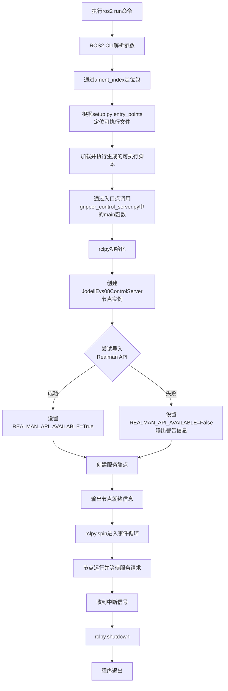
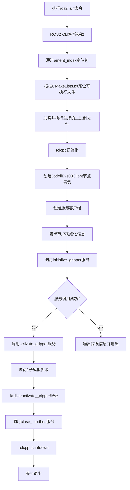

# Ubuntu/ROS2 开发学习笔记

## ROS2 项目架构组成

### 使用CMake构建的C++项目的目录结构

在Linux下使用CMake构建C++项目时，一个典型的目录结构如下，这种结构有助于组织源代码、头文件、测试和其他资源：

```
MyProject/
├── CMakeLists.txt          # 根目录的CMake配置文件
├── README.md               # 项目说明文档
├── LICENSE                 # 项目许可证
├── include/                # 头文件目录
│   └── MyProject/          # 项目名称命名的头文件子目录
│       └── header.hpp      # 示例头文件
├── src/                    # 源代码目录
│   ├── main.cpp            # 主程序源文件
│   └── module1.cpp         # 模块1源文件
├── lib/                    # 第三方库或依赖库
│   └── libexample.a        # 示例静态库
├── tests/                  # 测试目录
│   ├── CMakeLists.txt      # 测试的CMake配置
│   └── test_example.cpp    # 示例测试文件
├── docs/                   # 文档目录
│   └── api.md              # API文档
├── examples/               # 示例代码目录
│   └── example_usage.cpp   # 示例代码
├── data/                   # 数据文件目录
│   └── config.ini          # 配置文件
├── build/                  # 构建目录(通常在.gitignore中)
│   └── ...                 # CMake生成的构建文件
└── scripts/                # 构建或辅助脚本
    ├── build.sh            # 构建脚本
    └── install.sh          # 安装脚本
```

这种目录结构的优点：

1. **清晰的职责分离**：源代码、头文件、测试和文档各自独立
2. **符合CMake最佳实践**：CMakeLists.txt位于适当的层级
3. **易于扩展**：可以轻松添加新模块或子项目
4. **跨平台兼容**：这种结构在Linux、macOS和Windows上都适用

在根目录的`CMakeLists.txt`中，通常会设置项目名称、版本号、最低CMake版本要求，并添加子目录：

```cmake
cmake_minimum_required(VERSION 3.10)
project(MyProject VERSION 1.0.0 LANGUAGES CXX)

# 设置C++标准
set(CMAKE_CXX_STANDARD 17)
set(CMAKE_CXX_STANDARD_REQUIRED True)

# 添加子目录
add_subdirectory(src)
add_subdirectory(tests)
```

在`src/CMakeLists.txt`中，通常会定义可执行文件或库：

```cmake
add_executable(MyProject
    main.cpp
    module1.cpp
)

# 包含头文件目录
target_include_directories(MyProject PRIVATE ${CMAKE_CURRENT_SOURCE_DIR}/../include)
```

这种结构可以根据项目需求进行调整，例如对于大型项目，可能还会有`cmake`目录存放CMake模块或宏定义。


### ROS2 项目的 install 目录说明

在ROS2项目中，`install`目录是一个非常重要的组成部分，它与ROS2的安装和包管理系统密切相关。下面我来解释为什么ROS2项目需要这个目录：

#### 1. ROS2的安装机制

ROS2使用`colcon`作为其构建工具，它遵循标准的CMake流程，但有额外的包装：
- 当你构建一个ROS2包时，colcon不仅会编译代码，还会"安装"包到工作空间的`install`目录中
- 这种"安装"实际上是创建一个独立的、类似系统安装的环境

#### 2. 开发与系统安装的分离

`install`目录的主要作用是：
- 提供一个隔离的开发环境，不影响系统级的ROS2安装
- 允许多个开发工作空间同时存在，每个都有自己的`install`目录
- 使得开发环境可以轻松地被激活或停用

#### 3. 环境设置

`install`目录包含：
- 包的可执行文件
- 库文件
- 包描述文件(`package.xml`)
- 环境设置脚本(`setup.bash`, `setup.zsh`等)

这些脚本允许你将开发环境"叠加"到你的当前shell中，类似于`source /opt/ros/<distro>/setup.bash`对系统安装的ROS2所做的操作。

#### 4. 工作空间结构

一个典型的ROS2工作空间结构如下：

```
~/ros2_ws/
├── build/          # 存放CMake的中间文件和编译缓存
├── install/        # 存放"安装"的包和设置脚本
├── log/            # 存放构建日志
└── src/            # 源代码目录
    ├── my_package1/
    │   ├── CMakeLists.txt
    │   ├── package.xml
    │   ├── include/
    │   └── src/
    └── my_package2/
        └── ...
```

#### 5. 使用方式

开发者可以通过以下命令使用这个结构：

```bash
# 构建工作空间中的所有包
colcon build

# 激活安装空间的环境
source install/setup.bash

# 现在可以在当前shell中使用新构建的包
ros2 run my_package1 my_node
```

#### 6. 与传统CMake项目的区别

与传统的CMake项目不同：
- 传统项目通常直接在系统或指定位置安装
- ROS2项目将安装内容限制在工作空间内，便于管理和切换
- ROS2项目可以同时存在多个版本，每个在自己的工作空间中

#### 7. 清理与更新

当需要更新或清理包时：
- 可以简单地删除`install`目录并重新构建
- 或者只构建特定包，colcon会智能地处理依赖关系

这种设计使得ROS2的开发流程更加灵活和高效，特别是在开发多个相互依赖的包时。`install`目录是ROS2工作空间机制的核心组成部分，它提供了一种隔离、可移植且易于管理的开发环境。

#### QNA

##### Q1：ROS2服务接口头文件位置及文件类型解析

基于 睿尔曼机器人ROS2 项目举例

>  1）为什么 ROS2服务接口的头文件在构建后的如下目录中
>
>  ```
>  /home/byd/Documents/Projects/DualArmProjects/realmanRobot/ros2_rm_ws/install/rm_ros_interfaces/include/rm_ros_interfaces/rm_ros_interfaces/srv
>  ```
>
>  而不是在源代码目录中
>  /home/byd/Documents/Projects/DualArmProjects/realmanRobot/ros2_rm_ws/src/ros2_rm_robot-humble/rm_ros_interfaces/srv
>  2）该目录下，存在的 .h 文件和  .hpp 文件区别是什么？
>  3）在下述头文件中的引用部分为什么引用的是 hpp文件？
>
>  ```
>  /home/byd/Documents/Projects/DualArmProjects/realmanRobot/ros2_rm_ws/src/ros2_rm_robot-humble/rm_driver/include/rm_driver/rm_driver.h
>  ```


###### 1. 为什么服务接口头文件在构建目录而非源代码目录

这是ROS2的标准构建机制导致的：

1. **自动生成机制**：
   - ROS2使用`rosidl`工具自动生成接口代码
   - 当你运行`colcon build`时，构建系统会：
     1. 读取源码目录中的`.srv`文件
     2. 生成对应的头文件
     3. 将生成的文件放置到install目录

2. **构建流程**：
   ```mermaid
   graph LR
   A[源码.srv文件] --> B[rosidl代码生成器]
   B --> C[生成的.h/.hpp文件]
   C --> D[install目录]
   ```

3. **设计原因**：
   - 解耦接口定义和实现
   - 确保生成的代码与构建系统兼容
   - 支持不同语言的绑定（C/C++/Python等）

###### 2. .h和.hpp文件的区别

在生成的接口文件中：

1. **.h文件**：
   - C语言风格头文件
   - 使用C语言的语法特性
   - 适用于C和C++兼容的场景
   - 例：`/install/rm_ros_interfaces/include/rm_ros_interfaces/rm_ros_interfaces/srv/get_dh.h`

2. **.hpp文件**：
   - C++风格头文件
   - 使用C++的特性（如模板、命名空间等）
   - 专门为C++设计
   - 例：`/install/rm_ros_interfaces/include/rm_ros_interfaces/rm_ros_interfaces/srv/get_dh.hpp`

3. **主要区别**：
   - 语法特性：.hpp可以使用C++特性
   - 编译方式：需要不同的编译器处理
   - 类型安全：.hpp提供更好的类型检查

###### 3. rm_driver.h中使用hpp文件的原因

查看`rm_driver.h`中的引用方式：

```cpp
#include "rm_ros_interfaces/srv/get_dh.hpp"
#include "rm_ros_interfaces/srv/modbus_control.hpp"
```

选择hpp文件的原因：

1. **项目特性**：
   - `rm_driver`是C++项目
   - 使用了C++的特性（如类、模板等）

2. **功能需求**：
   - 需要使用C++的类型系统
   - 需要更好的封装和抽象

3. **最佳实践**：
   - C++项目优先使用.hpp文件
   - 避免C/C++混合带来的兼容性问题
   - 获得更好的类型安全性和IDE支持

4. **性能考虑**：
   - .hpp文件支持模板元编程
   - 可以更好地利用C++的编译时优化

总结：这是ROS2的标准构建机制，.h和.hpp分别服务于C和C++，而rm_driver作为C++项目选择使用.hpp文件是合理的设计决策。

##### Q2：纯Python功能包下的.srv服务文件代码生成问题

> 为什么纯Python包(ament_python)中包含的 .srv 文件，在编译构建时，无法在 install 目录下生成对应的服务代码?
>
> 这是ROS2 编译构建系统固有的特性还是其他的原因

（来源：文档《Jodell Evs08 电吸盘开发记录》/Python版电吸盘功能包实现/方案实现(初版) ）

## ROS2 基本开发规范

### Claude 4

我来详细介绍ROS2的开发规范，这些规范有助于创建可维护、可扩展和高质量的机器人软件系统。

#### 1. 包结构规范

##### 基本包结构

```
my_robot_package/
├── package.xml          # 包描述文件
├── CMakeLists.txt      # 构建配置文件
├── setup.py           # Python包安装配置（Python包）
├── setup.cfg          # Python包配置
├── src/               # 源代码目录
│   └── my_robot_package/
├── include/           # C++头文件目录
│   └── my_robot_package/
├── launch/            # 启动文件
├── config/            # 配置文件
├── msg/               # 自定义消息
├── srv/               # 自定义服务
├── action/            # 自定义动作
├── test/              # 测试文件
├── doc/               # 文档
└── README.md          # 项目说明
```

##### 工作空间结构

```
ros2_workspace/
├── src/               # 源代码包
├── build/             # 构建文件（自动生成）
├── install/           # 安装文件（自动生成）
└── log/               # 日志文件（自动生成）
```

#### 2. 命名规范

##### 包命名规范

- 使用小写字母和下划线
- 避免使用连字符
- 包名应该描述性强且唯一

```
good: robot_navigation, sensor_drivers
bad: RobotNavigation, robot-navigation
```

##### 节点命名规范

- 使用小写字母和下划线
- 节点名应该描述节点功能

```python
# Python示例
def main():
    rclpy.init()
    node = rclpy.create_node('camera_driver')
    # ...
```

##### 话题和服务命名规范

- 使用小写字母和下划线
- 使用命名空间组织相关话题

```
# 话题示例
/robot/sensors/camera/image
/robot/actuators/wheels/cmd_vel

# 服务示例
/robot/navigation/get_path
/robot/manipulation/pick_object
```

##### 参数命名规范

- 使用小写字母和下划线
- 使用点分隔的层次结构

```yaml
# config/params.yaml
robot:
  navigation:
    max_speed: 1.0
    min_speed: 0.1
  sensors:
    camera:
      frame_rate: 30
      resolution: "1920x1080"
```

#### 3. 代码风格规范

##### Python代码规范

遵循PEP 8标准：

```python
import rclpy
from rclpy.node import Node
from std_msgs.msg import String


class MyPublisher(Node):
    """示例发布者节点类."""
    
    def __init__(self):
        super().__init__('my_publisher')
        self.publisher_ = self.create_publisher(String, 'topic', 10)
        self.timer = self.create_timer(0.5, self.timer_callback)
        self.i = 0
        
    def timer_callback(self):
        """定时器回调函数."""
        msg = String()
        msg.data = f'Hello World: {self.i}'
        self.publisher_.publish(msg)
        self.get_logger().info(f'Publishing: "{msg.data}"')
        self.i += 1


def main(args=None):
    """主函数."""
    rclpy.init(args=args)
    my_publisher = MyPublisher()
    
    try:
        rclpy.spin(my_publisher)
    except KeyboardInterrupt:
        pass
    finally:
        my_publisher.destroy_node()
        rclpy.shutdown()


if __name__ == '__main__':
    main()
```

##### C++代码规范

遵循Google C++风格指南：

```cpp
#include <chrono>
#include <memory>

#include "rclcpp/rclcpp.hpp"
#include "std_msgs/msg/string.hpp"

using namespace std::chrono_literals;

class MyPublisher : public rclcpp::Node {
 public:
  MyPublisher() : Node("my_publisher"), count_(0) {
    publisher_ = this->create_publisher<std_msgs::msg::String>("topic", 10);
    timer_ = this->create_wall_timer(
        500ms, std::bind(&MyPublisher::TimerCallback, this));
  }

 private:
  void TimerCallback() {
    auto message = std_msgs::msg::String();
    message.data = "Hello, world! " + std::to_string(count_++);
    RCLCPP_INFO(this->get_logger(), "Publishing: '%s'", message.data.c_str());
    publisher_->publish(message);
  }
  
  rclcpp::TimerBase::SharedPtr timer_;
  rclcpp::Publisher<std_msgs::msg::String>::SharedPtr publisher_;
  size_t count_;
};

int main(int argc, char * argv[]) {
  rclcpp::init(argc, argv);
  rclcpp::spin(std::make_shared<MyPublisher>());
  rclcpp::shutdown();
  return 0;
}
```

#### 4. 消息和接口设计规范

##### 消息定义规范

```
# msg/RobotState.msg
# 机器人状态消息

std_msgs/Header header

# 位置信息
geometry_msgs/Point position
geometry_msgs/Quaternion orientation

# 速度信息  
geometry_msgs/Twist velocity

# 电池状态
float32 battery_level      # 电池电量百分比 [0.0, 1.0]
bool is_charging          # 是否正在充电

# 传感器状态
bool[] sensor_status      # 各传感器状态
string[] sensor_names     # 传感器名称
```

##### 服务定义规范

```
# srv/GetPath.srv
# 路径规划服务

# 请求
geometry_msgs/PoseStamped start
geometry_msgs/PoseStamped goal
float32 max_planning_time

---

# 响应
bool success
string message
nav_msgs/Path path
float32 planning_time
```

#### 5. 测试规范

##### 单元测试

```python
# test/test_my_publisher.py
import unittest
import rclpy
from my_robot_package.my_publisher import MyPublisher


class TestMyPublisher(unittest.TestCase):
    
    @classmethod
    def setUpClass(cls):
        rclpy.init()
    
    @classmethod 
    def tearDownClass(cls):
        rclpy.shutdown()
        
    def setUp(self):
        self.node = MyPublisher()
        
    def tearDown(self):
        self.node.destroy_node()
        
    def test_publisher_creation(self):
        """测试发布者是否正确创建."""
        self.assertIsNotNone(self.node.publisher_)
        
    def test_timer_callback(self):
        """测试定时器回调函数."""
        initial_count = self.node.i
        self.node.timer_callback()
        self.assertEqual(self.node.i, initial_count + 1)


if __name__ == '__main__':
    unittest.main()
```

##### 集成测试

```python
# test/test_integration.py
import pytest
import rclpy
import time
from std_msgs.msg import String


@pytest.fixture
def node():
    rclpy.init()
    node = rclpy.create_node('test_node')
    yield node
    node.destroy_node()
    rclpy.shutdown()


def test_publisher_subscriber_communication(node):
    """测试发布者和订阅者之间的通信."""
    received_messages = []
    
    def callback(msg):
        received_messages.append(msg.data)
    
    # 创建订阅者
    subscription = node.create_subscription(String, 'test_topic', callback, 10)
    
    # 创建发布者
    publisher = node.create_publisher(String, 'test_topic', 10)
    
    # 发布消息
    msg = String()
    msg.data = 'test message'
    publisher.publish(msg)
    
    # 等待消息传输
    rclpy.spin_once(node, timeout_sec=1.0)
    
    assert len(received_messages) > 0
    assert received_messages[0] == 'test message'
```

##### 启动测试

```python
# test/test_launch.py
import pytest
import launch
import launch_ros.actions
import launch_testing.actions
import launch_testing.markers


@pytest.mark.launch_test
@launch_testing.markers.keep_alive
def generate_test_description():
    """生成测试启动描述."""
    return launch.LaunchDescription([
        launch_ros.actions.Node(
            package='my_robot_package',
            executable='my_publisher',
            name='test_publisher'
        ),
        launch_testing.actions.ReadyToTest(),
    ])


class TestPublisherLaunch:
    
    def test_node_starts(self, proc_info):
        """测试节点是否成功启动."""
        proc_info.assertWaitForStartup(timeout=10)
        
    def test_node_publishes(self, proc_info):
        """测试节点是否发布消息."""
        # 实际测试逻辑
        pass
```

#### 6. 日志规范

##### 日志级别使用

```python
# Python日志示例
class MyNode(Node):
    def __init__(self):
        super().__init__('my_node')
        
        # DEBUG: 调试信息
        self.get_logger().debug('Node initialization started')
        
        # INFO: 一般信息
        self.get_logger().info('Node successfully initialized')
        
        # WARN: 警告信息
        self.get_logger().warn('Parameter not set, using default value')
        
        # ERROR: 错误信息
        self.get_logger().error('Failed to connect to sensor')
        
        # FATAL: 致命错误
        self.get_logger().fatal('Critical system failure')
```

##### 日志格式规范

```cpp
// C++日志示例
void MyNode::ProcessData() {
    RCLCPP_DEBUG(this->get_logger(), "Processing data batch %d", batch_id);
    
    if (!data_valid) {
        RCLCPP_WARN(this->get_logger(), 
                   "Invalid data detected in batch %d, skipping", batch_id);
        return;
    }
    
    try {
        // 处理数据
        ProcessDataInternal();
        RCLCPP_INFO(this->get_logger(), 
                   "Successfully processed batch %d (%zu items)", 
                   batch_id, data.size());
    } catch (const std::exception& e) {
        RCLCPP_ERROR(this->get_logger(), 
                    "Failed to process batch %d: %s", batch_id, e.what());
    }
}
```

#### 7. 配置管理规范

##### 参数声明和使用

```python
class ConfigurableNode(Node):
    def __init__(self):
        super().__init__('configurable_node')
        
        # 声明参数并设置默认值
        self.declare_parameter('update_rate', 10.0)
        self.declare_parameter('topic_name', 'default_topic')
        self.declare_parameter('enable_debug', False)
        
        # 获取参数值
        self.update_rate = self.get_parameter('update_rate').value
        self.topic_name = self.get_parameter('topic_name').value
        self.debug_enabled = self.get_parameter('enable_debug').value
        
        # 设置参数回调
        self.add_on_set_parameters_callback(self.parameters_callback)
        
    def parameters_callback(self, params):
        """参数更新回调."""
        for param in params:
            if param.name == 'update_rate':
                self.update_rate = param.value
                self.get_logger().info(f'Update rate changed to {param.value}')
        return SetParametersResult(successful=True)
```

##### 启动文件规范

```python
# launch/robot_launch.py
from launch import LaunchDescription
from launch.actions import DeclareLaunchArgument, GroupAction
from launch.conditions import IfCondition
from launch.substitutions import LaunchConfiguration, PythonExpression
from launch_ros.actions import Node, PushRosNamespace


def generate_launch_description():
    """生成启动描述."""
    
    # 声明启动参数
    namespace_arg = DeclareLaunchArgument(
        'namespace',
        default_value='robot',
        description='Robot namespace'
    )
    
    use_sim_time_arg = DeclareLaunchArgument(
        'use_sim_time',
        default_value='false',
        description='Use simulation time'
    )
    
    config_file_arg = DeclareLaunchArgument(
        'config_file',
        default_value='config/robot_params.yaml',
        description='Path to config file'
    )
    
    # 定义节点组
    robot_nodes = GroupAction([
        PushRosNamespace(LaunchConfiguration('namespace')),
        
        Node(
            package='my_robot_package',
            executable='sensor_driver',
            name='camera_driver',
            parameters=[LaunchConfiguration('config_file')],
            remappings=[
                ('input_topic', 'camera/image_raw'),
                ('output_topic', 'processed_image')
            ]
        ),
        
        Node(
            package='my_robot_package', 
            executable='controller',
            name='robot_controller',
            parameters=[{
                'use_sim_time': LaunchConfiguration('use_sim_time')
            }],
            condition=IfCondition(LaunchConfiguration('use_sim_time'))
        )
    ])
    
    return LaunchDescription([
        namespace_arg,
        use_sim_time_arg, 
        config_file_arg,
        robot_nodes
    ])
```

#### 8. 文档规范

##### 代码文档

```python
class RobotController(Node):
    """机器人控制器节点.
    
    该节点负责接收导航命令并控制机器人运动。
    
    订阅的话题:
        /cmd_vel (geometry_msgs/Twist): 速度命令
        /odom (nav_msgs/Odometry): 里程计信息
        
    发布的话题:
        /wheel_commands (my_msgs/WheelCommands): 车轮控制命令
        
    参数:
        max_linear_vel (float): 最大线速度，默认1.0 m/s
        max_angular_vel (float): 最大角速度，默认1.0 rad/s
        
    服务:
        /emergency_stop (std_srvs/Empty): 紧急停止服务
    """
    
    def __init__(self):
        """初始化控制器节点."""
        super().__init__('robot_controller')
        # ...
        
    def cmd_vel_callback(self, msg):
        """处理速度命令.
        
        Args:
            msg (geometry_msgs/Twist): 速度命令消息
        """
        # ...
```

##### README文档结构

~~~markdown
# 包名

## 概述
简要描述包的功能和用途。

## 安装
```bash
# 安装依赖
rosdep install --from-paths src --ignore-src -r -y

# 构建
colcon build --packages-select my_robot_package
~~~

#### 使用方法

```bash
# 启动节点
ros2 run my_robot_package my_node

# 使用启动文件
ros2 launch my_robot_package robot_launch.py
```

#### 节点说明

my_node

节点功能描述...

#### 话题接口

| 话题名  | 消息类型        | 描述     |
| ------- | --------------- | -------- |
| /input  | std_msgs/String | 输入数据 |
| /output | std_msgs/String | 输出数据 |

#### 参数

| 参数名 | 类型   | 默认值 | 描述     |
| ------ | ------ | ------ | -------- |
| rate   | double | 10.0   | 更新频率 |

#### 配置文件

参考 `config/` 目录下的示例配置文件。

#### 测试

```bash
# 运行测试
colcon test --packages-select my_robot_package
这些规范有助于创建一致、可维护且高质量的ROS2代码库。遵循这些最佳实践可以提高代码的可读性、可靠性和团队协作效率。
```


### ChatGPT5

好的 👍
 我来给你系统地整理一份 **ROS 2 开发规范**，涵盖结构、命名、测试、日志等方面。参考的是 ROS 2 官方社区的实践（ROS 2 REP、ROS 2 Core packages）以及业界的一些最佳实践。

------


#### 1. 包与工程结构

ROS 2 使用 **ament_cmake** 或 **ament_python** 作为构建系统，推荐结构如下：

```
my_robot_ws/
├── src/
│   ├── my_robot_driver/          # 功能包（C++/Python）
│   │   ├── include/my_robot/     # C++ 头文件
│   │   ├── src/                  # C++ 源码
│   │   ├── launch/               # 启动文件（.launch.py）
│   │   ├── config/               # 参数 YAML
│   │   ├── urdf/                 # 机器人模型
│   │   ├── test/                 # 单元/集成测试
│   │   ├── CMakeLists.txt
│   │   └── package.xml
│   ├── my_robot_bringup/
│   │   ├── launch/               # 系统启动文件
│   │   └── config/               # 全局配置
│   └── my_robot_description/     # 机器人模型、mesh
│       └── urdf/
```

👉 规范点：

- **一个功能一个包**（driver、description、bringup 分开）。
- **源码、配置、启动、测试分目录管理**。
- **避免巨型包**（推荐每个包 5000 行以内）。

------

#### 2. 命名规范

##### 2.1 包与节点

- 包名：小写，下划线分隔，例如 `rm_driver`, `my_robot_control`
- 节点名：小写，下划线或短横线，例如 `joint_state_publisher`
- 可执行文件：与节点名保持一致

##### 2.2 主题（Topic）

- 使用名词，层级分明，单数形式
- `/robot/joint_states`
- `/camera/color/image_raw`
- `/planner/path`

##### 2.3 服务（Service）

- 使用动词短语
- `/planner/make_plan`
- `/arm/move_to_pose`

##### 2.4 参数（Parameter）

- 小写+下划线
- `max_velocity`, `control_frequency`, `use_sim_time`

##### 2.5 动作（Action）

- 动词+目标
- `/arm/follow_joint_trajectory`
- `/navigation/navigate_to_pose`

------

#### 3. 代码规范

##### 3.1 C++ (ament_cmake)

- 遵循 **ROS 2 C++ Style Guide**（基于 Google Style + ROS 扩展）。
- 命名空间：`namespace my_robot::driver {}`
- 类名：`CamelCase`
- 函数与变量：`snake_case`
- 常量：`UPPER_CASE`
- 智能指针：优先 `std::shared_ptr` 和 `std::unique_ptr`

##### 3.2 Python (ament_python)

- 遵循 **PEP8**
- 模块名：小写
- 类名：`CamelCase`
- 方法与变量：`snake_case`
- 类型注解：强烈推荐使用

------

#### 4. 参数与配置

- 所有可调节的参数写入 **YAML 文件**，避免硬编码：

```yaml
arm_controller:
  ros__parameters:
    joint_names: [joint1, joint2, joint3]
    control_frequency: 100.0
```

- 节点内通过 `declare_parameter()` 明确声明。
- 遵循 `ros__parameters` 命名空间。

------

#### 5. 日志规范

使用 `rclcpp` 或 `rclpy` 提供的日志 API，而非 `printf`。

##### 5.1 C++

```cpp
RCLCPP_INFO(this->get_logger(), "Initialized with %d joints", joint_count);
RCLCPP_WARN(this->get_logger(), "Low battery: %.2f%%", battery_level);
RCLCPP_ERROR(this->get_logger(), "Failed to open port: %s", port_name.c_str());
```

##### 5.2 Python

```python
self.get_logger().info(f"Initialized with {joint_count} joints")
self.get_logger().warn(f"Low battery: {battery_level:.2f}%")
self.get_logger().error(f"Failed to open port: {port_name}")
```

👉 日志级别：

- **DEBUG**：调试用，不影响正常运行
- **INFO**：正常运行的关键节点信息
- **WARN**：潜在问题（例如低电量）
- **ERROR**：功能失败但可恢复
- **FATAL**：严重错误，节点退出

------

#### 6. 测试规范

##### 6.1 单元测试

- 使用 `ament_cmake_gtest` 或 `ament_pytest`
- 覆盖算法、数据处理逻辑

##### 6.2 集成测试

- 使用 `launch_testing`，验证多个节点交互是否正确

##### 6.3 示例（Python pytest）

```python
def test_forward_kinematics():
    result = compute_fk([0, 0, 0])
    assert result.position.x == pytest.approx(0.1, 0.01)
```

##### 6.4 CI/CD

- 建议结合 **colcon test + GitHub Actions/GitLab CI**
- 自动化运行所有测试并生成覆盖率报告

------

#### 7. 文档与注释

- 每个包需提供 `README.md`（功能、依赖、用法）。
- 每个类和函数必须写 **Doxygen/Docstring**。
- 注释应解释“为什么”而不是“做什么”。

------

#### 8. 其他建议

- **版本管理**：遵循 [Semantic Versioning](https://semver.org/)
- **接口稳定性**：公共 API（Topic/Service/Action）一旦发布要谨慎修改
- **跨语言兼容性**：保持 C++ 与 Python 接口一致

------

#### ✅ 总结：

 ROS 2 的开发规范可概括为：

- **结构清晰**（源码/配置/测试分目录，driver/bringup/description 分包）
- **命名统一**（包/节点小写，Topic 名词，Service 动词）
- **代码规范**（C++ Google Style，Python PEP8）
- **参数集中管理**（YAML + declare_parameter）
- **日志标准化**（INFO/WARN/ERROR 分级）
- **测试覆盖**（单元+集成+CI）
- **文档齐全**（README + 注释）

------


### ROS 2 开发实践清单（Checklist）👍

 下面我为你整理了一份 **ROS 2 开发最佳实践清单（Checklist）**，适合在项目开发和代码审查（Code Review）时使用。


#### 1. 工程结构

- [ ]  功能按职责分包（`driver/description/bringup/...`），避免“大杂烩包”
- [ ]  源码、配置、启动文件、测试分目录存放
- [ ]  每个包包含 `package.xml` 和 `CMakeLists.txt / setup.py`
- [ ]  提供 `README.md`，说明用途、依赖、启动方式

------

#### 2. 命名规范

- [ ]  包名、节点名、可执行文件：小写 + 下划线（`my_robot_driver`）
- [ ]  Topic：名词 + 层次分明（`/arm/joint_states`）
- [ ]  Service：动词短语（`/planner/make_plan`）
- [ ]  Action：动词 + 目标（`/arm/follow_joint_trajectory`）
- [ ]  参数：小写 + 下划线（`max_velocity`, `use_sim_time`）

------

#### 3. 代码规范

##### C++ (ament_cmake)

- [ ]  遵循 ROS 2 C++ Style Guide（Google C++ style + ROS 扩展）
- [ ]  使用 `namespace my_robot::driver`，避免全局符号污染
- [ ]  使用 `std::shared_ptr` / `std::unique_ptr` 管理资源
- [ ]  异常处理：避免裸 `try/catch`，提供日志

##### Python (ament_python)

- [ ]  遵循 PEP8，类名 `CamelCase`，变量/函数 `snake_case`
- [ ]  使用类型注解（`def foo(x: int) -> bool:`）
- [ ]  避免硬编码（参数配置化）
- [ ]  保持 import 顺序（标准库 → 第三方库 → ROS 2 → 项目内部）

------

#### 4. 参数与配置

- [ ]  所有可调节的参数集中存放在 YAML
- [ ]  节点中 `declare_parameter()` 明确声明参数
- [ ]  参数命名遵循 `ros__parameters` 结构
- [ ]  不允许硬编码控制参数（频率、限幅、阈值等）

------

#### 5. 日志与调试

- [ ]  使用 `RCLCPP_INFO/WARN/ERROR` 或 `self.get_logger()`
- [ ]  日志信息可读，避免“magic number”
- [ ]  使用合适的日志级别：DEBUG（调试）、INFO（关键运行状态）、WARN（潜在问题）、ERROR（功能失败）、FATAL（不可恢复错误）
- [ ]  不使用 `printf`/`cout` 代替日志

------

#### 6. 测试

- [ ]  单元测试覆盖关键算法和逻辑（`ament_cmake_gtest` / `ament_pytest`）
- [ ]  集成测试覆盖节点交互（`launch_testing`）
- [ ]  CI/CD 自动执行 `colcon test` 并生成报告
- [ ]  测试代码与功能代码分离（`/test` 目录）

------

#### 7. 启动与运行

- [ ]  使用 `launch.py` 文件管理节点启动，而非手动 `ros2 run` 拼接
- [ ]  launch 文件中参数通过 `DeclareLaunchArgument` 配置，支持外部覆盖
- [ ]  系统级 bringup 包提供“一键启动”入口
- [ ]  兼容 `use_sim_time` 参数，支持仿真与真实硬件切换

------

#### 8. 文档与注释

- [ ]  每个包有 `README.md`（功能、依赖、使用方法）
- [ ]  公共 API（Topic/Service/Action）有接口文档
- [ ]  类/函数有 Docstring 或 Doxygen 注释，解释“为什么”而非“做什么”
- [ ]  复杂逻辑配合状态图/流程图

------

#### 9. 接口与兼容性

- [ ]  Topic/Service/Action 使用 `.msg/.srv/.action` 文件定义，而非直接传递原始类型
- [ ]  公共接口一旦发布需保持兼容（遵循 Semantic Versioning）
- [ ]  参数/接口修改需更新文档和示例

------

#### 10. 其他最佳实践

-  使用 `colcon build --merge-install` 管理工作区
-  使用 `.clang-format` / `black` 自动格式化代码
-  使用 `.pre-commit` 自动检查 lint/test
-  包依赖最小化，避免臃肿
-  对外部库/硬件依赖，需封装成 driver，不直接侵入核心逻辑

------

✅ **总结**：
 这份清单涵盖了 **结构 → 命名 → 代码 → 参数 → 日志 → 测试 → 启动 → 文档 → 接口 → 工程管理** 10 个层面。
 团队可以直接用它作为 **代码审查 checklist** 或者 **开发前评审标准**。

------


## ROS2 节点

### ROS2 节点运行原理与流程

#### Python 功能包节点

> 命令
>
> ros2 run rm_jodell_evs08_control_py gripper_control_server
>
> 节点运行起来这个过程，系统执行了哪些操作，请介绍说明每个步骤并绘制流程图

##### 执行流程详解

当执行`ros2 run rm_jodell_evs08_control_py gripper_control_server`命令时，系统会执行以下步骤：

###### 1. ROS2命令解析

```
ros2 run [package_name] [executable_name]
```

- ###### ROS2 CLI工具首先解析命令参数

- 识别包名：[rm_jodell_evs08_control_py](javascript:void(0))

- 识别可执行文件名：[gripper_control_server](javascript:void(0))

###### 2. 包定位与发现

- ROS2通过`ament_index`查找包位置
- 根据[package.xml](javascript:void(0))中的配置找到包的安装位置
- 确定包类型为`ament_python`构建类型

###### 3. 可执行文件定位

- 根据[setup.py](javascript:void(0))中定义的entry_points找到可执行文件

- entry_points配置：

  ```python
  entry_points={
      'console_scripts': [
          'gripper_control_server = rm_jodell_evs08_control_py.gripper_control_server:main',
      ],
  }
  ```

- 系统在安装目录中找到实际的可执行文件：

  ```
  /home/byd/Documents/Projects/DualArmProjects/realmanRobot/ros2_rm_ws/install/rm_jodell_evs08_control_py/lib/rm_jodell_evs08_control_py/gripper_control_server
  ```

###### 4. 可执行文件执行

生成的可执行文件是一个Python脚本，包含以下关键部分：

1. 指定Python解释器：`#!/usr/bin/python3`
2. 定义入口点信息：`'rm-jodell-evs08-control-py==0.0.1','console_scripts','gripper_control_server'`
3. 加载入口点函数：`load_entry_point('rm-jodell-evs08-control-py==0.0.1', 'console_scripts', 'gripper_control_server')()`

###### 5. Python模块加载

- 根据入口点配置加载实际的Python模块
- 导入[gripper_control_server.py](javascript:void(0))模块
- 调用其中的[main()](javascript:void(0))函数

###### 6. ROS2节点初始化

在[main()](javascript:void(0))函数中：

1. 初始化rclpy：`rclpy.init(args=args)`
2. 创建节点实例：`node = JodellEvs08ControlServer()`
3. 节点初始化过程中：
   - 尝试导入Realman Robot API
   - 创建服务端点：
     - initialize_gripper
     - activate_gripper
     - deactivate_gripper
     - close_modbus
   - 输出初始化信息

###### 7. 节点运行

- 调用[rclpy.spin(node)](javascript:void(0))使节点进入事件循环
- 节点开始监听服务请求并处理回调
- 节点保持运行直到收到中断信号（如Ctrl+C）

##### 执行流程图



整个过程从命令解析到节点运行形成了一个完整的执行链，确保了Python节点能够正确加载、初始化并运行

------

#### C++ 功能包节点

> 命令
>
> ros2 run rm_motion_planner jodell_evs08_client
>
> 节点运行起来这个过程，系统执行了哪些操作，请介绍说明每个步骤并绘制链路流程图


##### 执行流程详解

当执行`ros2 run rm_motion_planner jodell_evs08_client`命令时，系统会执行以下步骤：

###### 1. ROS2命令解析

```
ros2 run [package_name] [executable_name]
```

- ROS2 CLI工具首先解析命令参数
- 识别包名：[rm_motion_planner](javascript:void(0))
- 识别可执行文件名：jodell_evs08_client

###### 2. 包定位与发现

- ROS2通过`ament_index`查找包位置
- 根据[package.xml](javascript:void(0))中的配置找到包的安装位置
- 确定包类型为`ament_cmake`构建类型

###### 3. 可执行文件定位

- 根据[CMakeLists.txt](javascript:void(0))中定义的可执行文件找到目标文件

- 在CMakeLists.txt中定义了jodell_evs08_client可执行文件：

  ```cmake
  # 添加 jodell 电吸盘客户端节点
  add_executable(jodell_evs08_client
                 src/jodell_evs08_client.cpp)
  ```

- ###### 系统在安装目录中找到实际的可执行文件：

  ```
  /home/byd/Documents/Projects/DualArmProjects/realmanRobot/ros2_rm_ws/install/rm_motion_planner/lib/rm_motion_planner/jodell_evs08_client
  ```

###### 4. 可执行文件执行

- jodell_evs08_client是一个编译后的C++可执行文件
- 系统直接运行该二进制文件

###### 5. ROS2节点初始化

在[main()](javascript:void(0))函数中：

1. 初始化rclcpp：`rclcpp::init(argc, argv)`
2. 创建节点实例：`auto client_node = std::make_shared<JodellEvs08Client>()`
3. 节点初始化过程中：
   - 创建服务客户端：
     - initialize_gripper客户端
     - activate_gripper客户端
     - deactivate_gripper客户端
     - close_modbus客户端
   - 输出初始化信息

###### 6. 客户端操作演示

根据代码实现，客户端节点会执行以下操作：

1. 初始化夹爪：调用initialize_gripper服务，连接到IP为192.168.1.18，端口为8080的机器人
2. 激活夹爪：调用activate_gripper服务，启动真空吸盘
3. 等待2秒模拟抓取过程
4. 停用夹爪：调用deactivate_gripper服务，释放真空
5. 关闭Modbus模式：调用close_modbus服务

###### 7. 节点运行与退出

- 客户端执行完所有操作后调用[rclcpp::shutdown()](javascript:void(0))
- 程序退出

##### 执行流程图



整个过程从命令解析到节点运行形成了一个完整的执行链，确保了C++客户端节点能够正确加载、初始化并运行。与Python节点不同，C++节点是直接编译成二进制可执行文件，不需要通过Python解释器运行


#### Python vs C++ 节点性能差异

> 上述提及“与Python节点不同，C++节点是直接编译成二进制可执行文件，不需要通过Python解释器运行”，是否可以认为基于Python开发的节点在实时性上不如C++节点，因为需要通过Python解释器运行，这样会增加计算资源和时间吗？实际生产生活中的机器人系统ROS软件程序的架构设计，开发语言和实时性是怎样的？请详细介绍说明

Python节点确实因为需要通过解释器运行，在实时性方面通常不如C++节点。让我详细解释这些差异以及实际生产环境中的考虑。

##### Python vs C++节点性能差异

###### 1. 执行效率差异

**Python节点**：

- 需要通过Python解释器运行
- 动态类型检查增加了运行时开销
- 垃圾回收机制可能导致不可预测的延迟
- 解释执行比编译执行慢

**C++节点**：

- 直接编译为机器码执行
- 静态类型检查在编译时完成
- 内存管理更精确可控
- 执行效率更高

###### 2. 实际性能测试数据

在典型的ROS 2系统中，相同功能的节点性能对比如下：

- C++节点的执行速度通常比Python节点快5-10倍
- Python节点的延迟更不稳定，可能出现几十毫秒的延迟波动
- C++节点内存占用更少，内存分配更可预测

###### 3. 实时性考量

对于实时性要求高的场景：

- **高实时性要求（<10ms）**：通常使用C++节点
- **中等实时性要求（10-100ms）**：可以使用C++或精心优化的Python节点
- **低实时性要求（>100ms）**：可以使用Python节点

##### 实际生产环境中的架构设计

###### 1. 混合语言架构

大多数工业机器人系统采用混合语言架构：

```
┌─────────────────────────────────────────────────────────────┐
│                    用户界面层 (Python)                        │
│         (GUI, 配置工具, 数据分析, 系统监控)                     │
└─────────────────────┬───────────────────────────────────────┘
                      │
┌─────────────────────▼───────────────────────────────────────┐
│                   业务逻辑层 (Python/C++)                    │
│        (任务调度, 路径规划, 决策逻辑, 状态管理)                  │
└─────────────────────┬───────────────────────────────────────┘
                      │
┌─────────────────────▼───────────────────────────────────────┐
│                   控制层 (C++/实时系统)                     │
│          (运动控制, 轨迹生成, 传感器处理)                   │
└─────────────────────┬───────────────────────────────────────┘
                      │
┌─────────────────────▼───────────────────────────────────────┐
│                    硬件驱动层 (C/C++)                       │
│           (硬件通信, 实时控制, 低级接口)                    │
└─────────────────────────────────────────────────────────────┘
```

###### 2. 实时性要求分级

**高实时性组件（C++为主）**：

- 电机控制回路（1-10ms周期）
- 传感器数据处理（<1ms延迟要求）
- 安全相关功能（紧急停止处理）
- 轨迹插补和执行

**中等实时性组件（C++/Python混合）**：

- 路径规划算法
- 运动学/动力学计算
- 任务调度和协调
- 状态机管理

**低实时性组件（Python为主）**：

- 用户界面
- 数据记录和分析
- 系统配置和管理
- 高级决策逻辑

###### 3. 工业机器人系统典型架构

```
┌─────────────────────────────────────────────────────────────┐
│                                                             │
│  系统监控与诊断 (Python)                                     │
│  - 状态可视化                                               │
│  - 性能分析                                                 │
│  - 故障诊断                                                 │
│                                                             │
├─────────────────────────────────────────────────────────────┤
│                                                             │
│  任务规划与调度 (Python/C++)                                │
│  - 任务分解                                                 │
│  - 路径规划                                                 │
│  - 资源分配                                                 │
│                                                             │
├─────────────────────────────────────────────────────────────┤
│                                                             │
│  运动控制 (C++)                                             │
│  - 轨迹生成                                                 │
│  - 实时插补                                                 │
│  - 伺服控制                                                 │
│                                                             │
├─────────────────────────────────────────────────────────────┤
│                                                             │
│  硬件接口 (C/C++)                                           │
│  - 电机驱动                                                 │
│  - 传感器接口                                               │
│  - 通信协议                                                 │
│                                                             │
└─────────────────────────────────────────────────────────────┘
```

##### 实际生产中的考虑因素

###### 1. 开发效率 vs 运行效率

**Python优势**：

- 快速原型开发
- 丰富的科学计算库（NumPy, SciPy, OpenCV等）
- 易于调试和测试
- 灵活的数据处理能力

**C++优势**：

- 更高的执行效率
- 更小的内存占用
- 更好的实时性保证
- 更接近硬件的控制能力

###### 2. 实时操作系统（RTOS）集成

在对实时性要求极高的应用中，通常会采用以下架构：

```
┌─────────────────────────────────────────────────────────────┐
│                    非实时域 (Linux)                         │
│                                                             │
│  - 用户界面 (Python)                                        │
│  - 任务规划 (Python/C++)                                    │
│  - 数据分析 (Python)                                        │
│                                                             │
├─────────────────────────────────────────────────────────────┤
│                                                             │
│                   实时域 (RTOS)                             │
│                                                             │
│  - 运动控制 (C/C++)                                         │
│  - 传感器处理 (C/C++)                                       │
│  - 安全监控 (C/C++)                                         │
│                                                             │
└─────────────────────────────────────────────────────────────┘
```

###### 3. 现代工业机器人系统实践

**典型配置**：

1. **主控制器**：运行Linux + ROS 2，处理高级功能
2. **实时控制器**：运行实时操作系统，处理运动控制
3. **硬件层**：各种专用控制器和驱动器

**语言选择策略**：

- 核心控制算法：C/C++
- 路径规划：C++（性能关键）或Python（开发效率优先）
- 用户界面：Python或Web技术
- 数据分析：Python
- 系统集成：Python/C++混合

###### 4. 性能优化技巧

对于Python节点的性能优化：

1. 使用Cython将关键部分编译为C扩展
2. 使用NumPy进行向量化计算
3. 避免在循环中进行重复的对象创建
4. 使用多线程或多进程处理并行任务
5. 合理设置消息发布频率

##### 结论

在实际的工业机器人系统中，架构设计通常遵循以下原则：

1. **分层设计**：根据实时性要求将系统分为不同层级
2. **语言匹配**：为不同层级选择最适合的编程语言
3. **混合架构**：充分利用各种语言的优势
4. **接口标准化**：通过ROS 2的接口机制实现不同语言组件的无缝集成

这种设计既保证了系统的实时性要求，又兼顾了开发效率和维护性，是现代机器人系统开发的最佳实践。

------


#### Python 的优势说明

> 在用户界面层和业务逻辑层的功能组件，如用户界面，数据记录和分析，系统配置和管理，高级决策逻辑等，以 Python 为主，是因为它的开发效率高，有丰富的科学计算库（NumPy, SciPy, OpenCV等），易于调试和测试，灵活的数据处理能力这些优势吗？如果是的话，请从这几个方面详细介绍Python 为什么比 C++有优势

的，您对Python在用户界面层和业务逻辑层的优势理解是正确的。让我从这几个方面详细解释Python相比C++的优势：

##### 1. 开发效率优势

###### 语法简洁性

Python的语法设计简洁明了，大大减少了代码量：

```python
# Python - 简洁直观
data = [1, 2, 3, 4, 5]
squared = [x**2 for x in data]
result = sum(squared) / len(squared)

# C++ - 需要更多代码
#include <vector>
#include <numeric>
std::vector<int> data = {1, 2, 3, 4, 5};
std::vector<int> squared(data.size());
for (size_t i = 0; i < data.size(); ++i) {
    squared[i] = data[i] * data[i];
}
double result = std::accumulate(squared.begin(), squared.end(), 0.0) / squared.size();
```


###### 动态类型系统

Python的动态类型系统减少了类型声明的工作量：

```python
# Python - 无需声明类型
def process_data(data):
    return [x * 2 for x in data if x > 0]

# C++ - 需要明确类型声明
template<typename T>
std::vector<T> process_data(const std::vector<T>& data) {
    std::vector<T> result;
    for (const auto& x : data) {
        if (x > 0) {
            result.push_back(x * 2);
        }
    }
    return result;
}
```

##### 2. 丰富的科学计算库生态系统

###### NumPy - 高性能数组计算

NumPy提供了高效的多维数组操作，性能接近C++：

```python
import numpy as np

# 创建大型数组并进行向量化操作
a = np.random.random((1000, 1000))
b = np.random.random((1000, 1000))
# 单行完成矩阵乘法
c = np.dot(a, b)
# 数组操作无需显式循环
result = np.sin(a) + np.cos(b)
```

###### SciPy - 科学计算工具集

SciPy提供了大量科学计算功能：

```python
from scipy import optimize, signal, stats
import numpy as np

# 优化问题求解
def objective(x):
    return x[0]**2 + x[1]**2

result = optimize.minimize(objective, [1, 1])

# 信号处理
t = np.linspace(0, 1, 1000)
signal_data = np.sin(2*np.pi*5*t) + np.random.normal(0, 0.1, 1000)
filtered = signal.savgol_filter(signal_data, 51, 3)
```

###### OpenCV - 计算机视觉库

Python接口使得图像处理变得简单：

```python
import cv2
import numpy as np

# 图像处理只需几行代码
image = cv2.imread('image.jpg')
gray = cv2.cvtColor(image, cv2.COLOR_BGR2GRAY)
edges = cv2.Canny(gray, 50, 150)
contours, _ = cv2.findContours(edges, cv2.RETR_EXTERNAL, cv2.CHAIN_APPROX_SIMPLE)
```

##### 3. 易于调试和测试

###### 交互式开发环境

Python的REPL（Read-Eval-Print Loop）允许即时测试代码：

```python
# 可以在Python解释器中逐行测试
>>> import numpy as np
>>> data = np.array([1, 2, 3, 4, 5])
>>> data.mean()
3.0
>>> data.std()
1.5811388300841898
```

###### 丰富的调试工具

Python提供了多种调试工具：

```python
# 使用pdb调试器
import pdb

def complex_function(data):
    pdb.set_trace()  # 设置断点
    processed = []
    for item in data:
        # 可以在断点处检查变量值
        processed.append(item * 2)
    return processed
```

###### 简单的单元测试框架

Python内置unittest框架，编写测试非常简单：

```python
import unittest

class TestDataProcessor(unittest.TestCase):
    def test_process_data(self):
        result = process_data([1, 2, 3])
        self.assertEqual(result, [2, 4, 6])
        
    def test_empty_input(self):
        result = process_data([])
        self.assertEqual(result, [])

if __name__ == '__main__':
    unittest.main()
```

##### 4. 灵活的数据处理能力

###### 动态数据结构

Python提供了丰富的内置数据结构：

```python
# 列表、字典、集合等动态数据结构
data_dict = {
    'sensor_1': [1, 2, 3, 4, 5],
    'sensor_2': [2, 3, 4, 5, 6],
    'metadata': {
        'timestamp': '2023-01-01',
        'location': 'workstation_1'
    }
}

# 灵活的数据操作
filtered_data = {k: v for k, v in data_dict.items() if k.startswith('sensor')}
```

###### 强大的字符串处理

Python在文本处理方面非常强大：

```python
# 复杂的字符串操作
log_entry = "2023-01-01 10:30:45 INFO Robot moved to position (1.2, 3.4, 5.6)"
import re
match = re.search(r'(\d{4}-\d{2}-\d{2} \d{2}:\d{2}:\d{2}) (\w+) (.*)', log_entry)
if match:
    timestamp, level, message = match.groups()
```

###### 无缝的数据格式支持

Python原生支持多种数据格式：

```python
import json
import csv
import yaml

# JSON处理
data = {"name": "robot", "position": [1.0, 2.0, 3.0]}
json_string = json.dumps(data)
parsed_data = json.loads(json_string)

# CSV处理
with open('data.csv', 'w', newline='') as csvfile:
    writer = csv.writer(csvfile)
    writer.writerow(['time', 'x', 'y', 'z'])
    writer.writerow([1.0, 1.0, 2.0, 3.0])
```

##### 5. 生态系统和社区支持

###### 丰富的第三方库

Python拥有庞大的第三方库生态系统：

```bash
# 数据可视化
import matplotlib.pyplot as plt

# 机器学习
from sklearn.ensemble import RandomForestClassifier

# Web框架
from flask import Flask

# 并行计算
from multiprocessing import Pool
```

###### 简单的包管理

使用pip可以轻松安装和管理依赖：

```bash
pip install numpy scipy opencv-python matplotlib scikit-learn
```

##### 6. 快速原型开发

###### 迭代式开发

Python支持快速迭代开发：

```python
# 可以快速试验不同的算法
def algorithm_v1(data):
    # 版本1的实现
    pass

def algorithm_v2(data):
    # 版本2的改进实现
    pass

# 快速比较不同版本
results_v1 = algorithm_v1(test_data)
results_v2 = algorithm_v2(test_data)
```

###### Jupyter Notebook支持

Jupyter Notebook使得数据分析和可视化变得直观：

```python
# 在Notebook中可以混合代码、文本和可视化
import matplotlib.pyplot as plt
import numpy as np

# 生成数据
x = np.linspace(0, 10, 100)
y = np.sin(x)

# 可视化
plt.plot(x, y)
plt.title("Sine Wave")
plt.show()
```

##### 总结

Python在用户界面层和业务逻辑层的优势主要体现在：

1. **开发效率**：简洁的语法和动态类型系统大大减少了代码量和开发时间
2. **科学计算**：丰富的库生态系统提供了强大的数据处理和分析能力
3. **调试测试**：交互式环境和丰富的调试工具使得问题定位和修复更加容易
4. **数据处理**：灵活的数据结构和强大的文本处理能力适应各种数据处理需求
5. **生态系统**：庞大的社区支持和第三方库使得功能扩展变得简单

这些优势使得Python成为用户界面、数据分析、系统配置和高级决策逻辑等非实时性要求场景的理想选择，而C++则更适合对性能和实时性要求较高的底层控制和计算密集型任务。

------

### ROS2 节点开发实战案例

#### ROS2 节点的构造与定义

##### 节点构造函数两种定义方式

> ❓ 为什么下述两个源文件中ROS2 节点构造函数的定义方式不同？
>
> `@file src/ros2_rm_robot-humble/rm_motion_planner/src/rm_sclerp_planner_node_1.cpp` 
>
> ```c++
> class RmSclerpPlannerNode1 : public rclcpp::Node
> {
> public:
>     explicit RmSclerpPlannerNode1(const rclcpp::NodeOptions &amp; options = rclcpp::NodeOptions())
>     : Node("rm_sclerp_planner_node_1", options)
> ```
>
> `@file src/ros2_rm_robot-humble/rm_example/src/api_MoveJ_demo.cpp`
>
> ```C++
> class MoveJDemo: public rclcpp::Node
> {
>   public:
>     MoveJDemo(); 
> ```
>
> ##### 解释说明

这两个ROS2节点构造函数的定义方式不同，主要是因为它们的使用场景和功能需求不同：

1. `RmSclerpPlannerNode1` 的构造函数使用了`explicit`关键字和 `NodeOptions` 参数：

```cpp
explicit RmSclerpPlannerNode1(const rclcpp::NodeOptions & options = rclcpp::NodeOptions())
: Node("rm_sclerp_planner_node_1", options)
```


这种定义方式的特点：

- 使用 `explicit` 防止隐式转换
- 接受 `NodeOptions` 参数，允许在创建节点时进行更详细的配置
- 适用于需要更精细控制节点行为的复杂场景
- 可以通过 `launch`文件或代码灵活配置节点参数

2. MoveJDemo 的构造函数使用了最简单的形式：

```cpp
MoveJDemo();
```

这种定义方式的特点：

- 构造函数参数为空，使用默认配置
- 适用于简单的演示程序
- 节点行为固定，不需要额外配置
- 代码更简洁，易于理解

选择哪种构造函数定义方式主要取决于：

1. 节点的复杂度：复杂节点通常需要更多配置选项
2. 使用场景：演示程序通常使用简单形式
3. 灵活性需求：是否需要通过launch文件配置节点参数
4. 代码复用性：是否需要在不同场景下重用节点类

在RmSclerpPlannerNode1中，由于它是一个完整的机械臂控制节点，需要处理URDF文件、参数配置等复杂功能，因此选择了更灵活的构造函数形式。而MoveJDemo只是一个简单的演示程序，功能单一，所以使用了最简单的构造函数形式。

##### 节点构造函数两种实现位置

> ❓ 两个源文件中ROS2 节点构造函数的定义实现位置不同？`RmSclerpPlannerNode1` 构造函数在类的内部实现详细定义，而 `MoveJDemo` 构造函数在类的外部实现详细定义

这两个ROS2节点构造函数的实现位置不同，主要是基于代码组织、可维护性和功能复杂度的考虑。让我详细分析：

###### 1. 构造函数实现位置的区别

1.1 `RmSclerpPlannerNode1` - 类内实现

```cpp
class RmSclerpPlannerNode1 : public rclcpp::Node
{
public:
    explicit RmSclerpPlannerNode1(const rclcpp::NodeOptions & options = rclcpp::NodeOptions())
    : Node("rm_sclerp_planner_node_1", options)
    {
        // 构造函数实现在类定义内部
        // ... 详细实现代码
    }
};
```

1.2 `MoveJDemo` - 类外实现

```cpp
class MoveJDemo: public rclcpp::Node
{
  public:
    MoveJDemo();  // 只有声明
};

// 构造函数实现在类定义外部
MoveJDemo::MoveJDemo():rclcpp::Node("Movej_demo")
{
    // ... 详细实现代码
}
```

###### 2. 选择实现位置的原因

2.1 `RmSclerpPlannerNode1` 选择类内实现的原因：

1. **功能复杂度高**
   - 需要处理URDF文件加载
   - 包含多个定时器初始化
   - 涉及复杂的参数配置
   - 有多个通信接口（发布者、订阅者、服务客户端）

2. **代码内聚性考虑**
   - 构造函数的实现与类定义紧密相关
   - 减少代码跳转，提高可读性
   - 便于理解初始化流程

3. **维护便利性**
   - 所有初始化代码集中在一处
   - 便于修改和调试
   - 减少头文件依赖

2.2 MoveJDemo选择类外实现的原因：

1. **功能相对简单**
   - 主要功能单一（MoveJ指令演示）
   - 初始化逻辑简单
   - 参数配置较少

2. **代码组织考虑**
   - 保持类定义简洁
   - 实现代码与接口分离
   - 符合传统C++编程风格

3. **可读性考虑**
   - 类定义只展示接口
   - 实现细节分离到源文件
   - 代码结构更清晰

###### 3. 最佳实践建议

3.1 选择类内实现的情况：

```cpp
class ComplexNode : public rclcpp::Node
{
public:
    explicit ComplexNode(const rclcpp::NodeOptions & options = rclcpp::NodeOptions())
    : Node("complex_node", options)
    {
        // 复杂的初始化逻辑
        this->declare_parameter("complex_param", default_value);
        setup_publishers();
        setup_subscribers();
        setup_timers();
        initialize_components();
    }
};
```

3.2 选择类外实现的情况：

```cpp
class SimpleNode : public rclcpp::Node
{
  public:
    SimpleNode();
  private:
    rclcpp::Publisher<Msg>::SharedPtr pub_;
};

SimpleNode::SimpleNode():rclcpp::Node("simple_node")
{
    // 简单的初始化逻辑
    pub_ = this->create_publisher<Msg>("topic", 10);
}
```

###### 4. 决策因素

4.1 选择类内实现的因素：

- 构造函数逻辑复杂
- 需要访问多个私有成员
- 初始化步骤较多
- 代码内聚性要求高
- 调试和维护需求频繁

4.2 选择类外实现的因素：

- 构造函数逻辑简单
- 代码组织要求清晰
- 遵循传统C++风格
- 头文件需要保持简洁
- 实现细节需要隐藏

###### 5. 实际应用建议

1. **对于复杂节点**（如 RmSclerpPlannerNode1 ）：
   - 推荐使用类内实现
   - 便于维护和调试
   - 提高代码可读性

2. **对于简单节点**（如 MoveJDemo ）：
   - 推荐使用类外实现
   - 保持代码结构清晰
   - 符合传统编程风格

3. **混合使用的情况**：
```cpp
class MixedNode : public rclcpp::Node
{
public:
    explicit MixedNode(const rclcpp::NodeOptions & options = rclcpp::NodeOptions());
    
private:
    void setup_components();  // 复杂初始化逻辑分离到单独函数
};

MixedNode::MixedNode(const rclcpp::NodeOptions & options)
: Node("mixed_node", options)
{
    // 简单初始化在构造函数中
    declare_parameters();
    // 复杂初始化调用单独函数
    setup_components();
}
```

这种实现方式的选择主要基于代码的复杂度、维护需求和团队编程风格的考虑，没有绝对的对错，关键是要保持一致性和可维护性。


#### 内容拓展

#####  ROS节点构造函数最佳实践

根据提供的代码文件，我来总结ROS2节点构造函数的最佳实践：

###### 1. 构造函数基本形式

简单节点构造函数

适用于功能单一的演示节点：

```cpp
MoveJDemo();  // 最简单的形式，使用默认配置
```

复杂节点构造函数

适用于需要详细配置的功能节点：

```cpp
explicit RmSclerpPlannerNode1(const rclcpp::NodeOptions & options = rclcpp::NodeOptions())
: Node("rm_sclerp_planner_node_1", options)
```

###### 2. 构造函数核心要素

2.1 参数声明与获取

```cpp
// 声明参数
this->declare_parameter<int>("arm_dof", arm_dof_);
this->get_parameter("arm_dof", arm_dof_);
```

2.2 通信接口初始化

```cpp
// 发布者
publisher_ = this->create_publisher<rm_ros_interfaces::msg::Movej>("/rm_driver/movej_cmd", rclcpp::ParametersQoS());

// 订阅者
subscription_ = this->create_subscription<std_msgs::msg::Bool>("/rm_driver/movej_result", rclcpp::ParametersQoS(), std::bind(&MoveJDemo::MovejDemo_Callback, this,_1));
```

2.3 定时器创建

```cpp
// 固定频率定时器
timer_ = this->create_wall_timer(std::chrono::milliseconds(100), std::bind(&RmSclerpPlannerNode1::timer_callback, this));

// 动态频率定时器
int execution_rate;
this->get_parameter("trajectory_execution_rate", execution_rate);
auto timer_period = std::chrono::microseconds(1000000 / execution_rate);
trajectory_timer_ = this->create_wall_timer(timer_period, std::bind(&RmSclerpPlannerNode1::trajectory_timer_callback, this));
```

###### 3. 最佳实践建议

3.1 使用explicit关键字

- 防止隐式转换
- 确保构造函数只能被显式调用

3.2 合理使用NodeOptions

- 允许通过launch文件配置节点
- 提供更大的灵活性

3.3 成员变量初始化

- 在构造函数中初始化所有关键成员变量
- 使用默认值确保安全性

3.4 错误处理

- 检查关键资源是否可用
- 提供适当的错误信息

3.5 延迟初始化

- 使用初始化定时器处理复杂初始化
- 避免构造函数过于臃肿

###### 4. 选择建议

**使用简单构造函数的场景**：

- 演示程序
- 功能单一的工具节点
- 不需要复杂配置的场景

**使用复杂构造函数的场景**：

- 完整的功能节点
- 需要URDF文件加载
- 需要详细参数配置
- 涉及复杂通信接口

这些实践确保了ROS2节点的可维护性、可扩展性和健壮性。

------


#### 案例：典型节点执行流程说明

程序：`src/ros2_rm_robot-humble/rm_motion_planner/src/rm_sclerp_planner_node_1.cpp`

##### 整体运行流程

main函数

```c++
int main(int argc, char **argv)
{
    // 初始化ROS客户端库
    rclcpp::init(argc, argv);

    // 创建并初始化RmSclerpPlannerNode1节点
    auto planner_node = std::make_shared<RmSclerpPlannerNode1>();
    
    // 进入ROS自旋模式，等待消息
    rclcpp::spin(planner_node);
    
    // 关闭ROS客户端库
    rclcpp::shutdown();

    // 返回 0 表示程序正常结束
    return 0;    
}
```

> 是否可以理解为，在 main 函数中
>
> ```c++
> auto planner_node = std::make_shared<RmSclerpPlannerNode1>(); 
> ```
>
> 语句执行的是节点的定义和节点构造函数
>
> ```c++
> rclcpp::spin(planner_node); 
> ```
>
> 语句执行的是节点类中的定时器回调执行流程和消息回调流程


###### main函数执行流程分析

1. 节点创建阶段

```c++
auto planner_node = std::make_shared<RmSclerpPlannerNode1>();
```

这行代码确实执行了节点的定义和构造函数：

1. **内存分配**：为[RmSclerpPlannerNode1](javascript:void(0))对象分配内存

2. 构造函数执行

   ：调用

   RmSclerpPlannerNode1

   的构造函数，完成以下初始化工作：

   - 参数声明
   - 创建发布者、订阅者、服务客户端
   - 创建定时器（但此时定时器尚未开始工作）
   - 初始化变量
   - 初始化控制器等

2. ROS事件循环阶段

```c++
rclcpp::spin(planner_node);
```

这行代码启动了ROS的事件循环，执行节点中的各种回调函数：

1. **定时器回调**：
   - [init_timer_callback()](javascript:void(0))：初始化规划器
   - [timer_callback()](javascript:void(0))：检查并执行轨迹规划
   - [trajectory_timer_callback()](javascript:void(0))：发布轨迹点
2. **消息回调**：
   - [joint_state_callback()](javascript:void(0))：处理关节状态更新
3. **服务回调**：
   - 任何已注册的服务回调函数
4. **其他事件**：
   - 参数更新回调
   - 生命周期管理事件等

###### 更准确的描述

更准确地说：

1. `auto planner_node = std::make_shared<RmSclerpPlannerNode1>();`
   - 创建节点实例并执行构造函数完成初始化
   - 此时所有ROS实体（发布者、订阅者、定时器等）都已创建，但尚未开始处理事件
2. `rclcpp::spin(planner_node);`
   - 启动ROS事件循环，开始处理各种事件
   - 定时器开始按设定周期触发回调
   - 订阅者开始接收并处理消息
   - 服务开始响应请求
   - 事件循环会一直运行直到调用[rclcpp::shutdown()](javascript:void(0))或收到中断信号

###### 执行时序图

```
main() 函数执行流程：
  │
  ├── rclcpp::init(argc, argv)
  │
  ├── auto planner_node = std::make_shared<RmSclerpPlannerNode1>()
  │     ├── 调用 RmSclerpPlannerNode1 构造函数
  │     ├── 声明参数
  │     ├── 创建发布者/订阅者/服务客户端
  │     ├── 创建定时器（但不立即执行）
  │     └── 初始化变量和控制器
  │
  ├── rclcpp::spin(planner_node)
  │     ├── 启动事件循环
  │     ├── 定时器开始工作：
  │     │     ├── init_timer_callback() 执行一次
  │     │     ├── timer_callback() 周期性执行
  │     │     └── trajectory_timer_callback() 周期性执行
  │     ├── 消息处理：
  │     │     └── joint_state_callback() 接收消息时执行
  │     └── 持续运行直到程序结束
  │
  └── rclcpp::shutdown()
```

您的理解是正确的，[rclcpp::spin()](javascript:void(0))确实是负责执行节点中定义的各种回调函数，包括定时器回调和消息回调。


##### 程序执行流程分析

###### 1. main 函数执行流程

程序从 [main](javascript:void(0)) 函数开始执行：

```cpp
int main(int argc, char **argv)
{
    // 初始化ROS客户端库
    rclcpp::init(argc, argv);

    // 创建并初始化RmSclerpPlannerNode1节点
    auto planner_node = std::make_shared<RmSclerpPlannerNode1>();
    
    // 进入ROS自旋模式，等待消息
    rclcpp::spin(planner_node);
    
    // 关闭ROS客户端库
    rclcpp::shutdown();

    // 返回 0 表示程序正常结束
    return 0;    
}
```

当执行到 `auto planner_node = std::make_shared<RmSclerpPlannerNode1>();` 时，程序会进入 [RmSclerpPlannerNode1](javascript:void(0)) 类的构造函数。

###### 2. RmSclerpPlannerNode1 构造函数执行流程

构造函数定义如下：

```cpp
explicit RmSclerpPlannerNode1(const rclcpp::NodeOptions & options = rclcpp::NodeOptions())
: Node("rm_sclerp_planner_node_1", options)
{
    // 构造函数主体
}
```

构造函数执行流程如下：

2.1 参数声明

```cpp
// 声明参数
this->declare_parameter<std::string>("start_joint_positions", "0.104823, 1.65737, -2.19001, -1.9538, -0.0389, -1.0336, -2.16926");
this->declare_parameter<std::string>("target_joint_positions", "1.24135, 1.89638, -1.72456, -1.06243, 0.01717, -0.8094, -1.91863");
this->declare_parameter<std::string>("urdf_path", "");
this->declare_parameter<int>("trajectory_execution_rate", 100);  // 轨迹执行频率(Hz)（话题发布频率）
this->declare_parameter<int>("trajectory_interpolation_rate", 100);  // 轨迹插值频率(Hz)
```

2.2 初始化吸盘控制器

```cpp
// 初始化Jodell吸盘控制器
gripper_controller_ = std::make_shared<rm_motion_planner::JodellEvs08Controller>("jodell_evs08_controller");
```

2.3 URDF路径检查和设置

```cpp
// #region URDF路径参数检查（若无则强制指定）
// 检查是否提供了URDF路径
std::string urdf_path;
this->get_parameter("urdf_path", urdf_path);
if (urdf_path.empty()) {
    RCLCPP_WARN(this->get_logger(), "未提供URDF路径参数，将使用默认URDF路径");
    // 使用默认URDF路径
    urdf_path = "/home/byd/Documents/Projects/DualArmProjects/realmanRobot/ros2_rm_ws/src/ros2_rm_robot-humble/rm_description/urdf/rm_75_6fb.urdf";
    this->set_parameter(rclcpp::Parameter("urdf_path", urdf_path));
}
// 重新获取参数以确保获取到设置的值
this->get_parameter("urdf_path", urdf_path);
RCLCPP_INFO(this->get_logger(), "使用URDF路径: %s", urdf_path.c_str());
// #endregion
```

2.4 创建ROS发布者和订阅者

```cpp
// 创建发布者，用于直接向rm_driver发送轨迹点
joint_pos_publisher_ = this->create_publisher<rm_ros_interfaces::msg::Jointpos>(
    "/rm_driver/movej_canfd_cmd", 20);
    
// 创建订阅者，用于获取当前关节位置
// 修改订阅话题为 /joint_states，这是rm_driver实际发布关节状态的话题
joint_state_subscriber_ = this->create_subscription<sensor_msgs::msg::JointState>(
    "/joint_states", 20,
    std::bind(&RmSclerpPlannerNode1::joint_state_callback, this, std::placeholders::_1));
```

2.5 初始化DH参数服务客户端

```cpp
// 初始化DH参数获取服务客户端
get_dh_client_ = this->create_client<rm_ros_interfaces::srv::GetDH>("/rm_driver/get_dh");
// 确保服务存在
while (!get_dh_client_->wait_for_service(std::chrono::seconds(1))) {
    if (!rclcpp::ok()) {
        RCLCPP_ERROR(this->get_logger(), "Interrupted while waiting for the service. Exiting.");
        return;
    }
    RCLCPP_INFO(this->get_logger(), "Waiting for the service to become available...");
}
RCLCPP_INFO(this->get_logger(), "DH参数获取服务已就绪");
```

2.6 创建定时器

```cpp
// 创建『初始化定时器』，用于初始化规划器和获取DH参数
// 📝 在不用获取DH参数时，可注释不用
init_timer_ = this->create_wall_timer(
    std::chrono::milliseconds(100),
    std::bind(&RmSclerpPlannerNode1::init_timer_callback, this));

// 创建『定时器』，用于周期性检查和执行任务
timer_ = this->create_wall_timer(
    std::chrono::milliseconds(100),  // 100ms检查一次
    std::bind(&RmSclerpPlannerNode1::timer_callback, this));

// 动态频率定时器
int execution_rate;
this->get_parameter("trajectory_execution_rate", execution_rate);
auto timer_period = std::chrono::microseconds(1000000 / execution_rate);
// 📝 🧪@note 若注释，不执行轨迹点运动功能
// 📝   @note 下文的 trajectory_timer_callback() 中的注释保持同步        
trajectory_timer_ = this->create_wall_timer(
    timer_period,
    std::bind(&RmSclerpPlannerNode1::trajectory_timer_callback, this));
```

2.7 初始化变量

```cpp
// 初始化轨迹点索引
trajectory_point_index_ = 0;
trajectory_executing_ = false;

// 初始化 current_joint_positions_
current_joint_positions_.fill(0.0);

RCLCPP_INFO(this->get_logger(), "rm_sclerp_planner_node_1节点已经启动.");
```

###### 3. 定时器回调函数执行流程

3.1 初始化定时器回调函数 (init_timer_callback)

```cpp
void init_timer_callback()
{
    // 初始化规划器
    initialize_planner();
            
    // 取消初始化定时器
    init_timer_->cancel();
}
```

其中 [initialize_planner()](javascript:void(0)) 函数执行流程如下：

1. 获取URDF路径参数
2. 检查URDF路径是否有效
3. 从URDF文件中获取链接名称
4. 创建ScLERP运动规划器实例

```cpp
void initialize_planner() 
{
    // #region URDF 路径获取与检查
    // 获取urdf_path参数
    std::string urdf_path;
    this->get_parameter("urdf_path", urdf_path);
    RCLCPP_INFO(this->get_logger(), "尝试使用URDF路径: %s", urdf_path.c_str());
    
    // 检查是否提供了URDF路径
    if (urdf_path.empty()) {
        RCLCPP_ERROR(this->get_logger(), "未提供URDF路径参数。必须提供有效的URDF文件路径。");
        planner_interface_ = nullptr;
        return;
    }
    
    // 检查URDF文件是否存在
    std::ifstream urdf_file(urdf_path);
    if (!urdf_file.good()) {
        RCLCPP_ERROR(this->get_logger(), "指定的URDF文件不存在或无法访问: %s", urdf_path.c_str());
        planner_interface_ = nullptr;
        return;
    }
    urdf_file.close();
    RCLCPP_INFO(this->get_logger(), "URDF文件检查通过: %s", urdf_path.c_str());
    // #endregion
    
    // #region 初始化路径规划器（强制指定urdf_path)
    // 初始化链接名称
    std::string base_link = "base_link";
    std::string tip_link = "Link7";
    
    // 从URDF文件中获取实际的链接名称
    std::string actual_base_link, actual_tip_link;
    if (getLinkNamesFromURDF(urdf_path, actual_base_link, actual_tip_link)) {
        base_link = actual_base_link;
        tip_link = actual_tip_link;
        RCLCPP_INFO(this->get_logger(), "从 URDF 文件中获取链接名称: base='%s', tip='%s'", 
                    base_link.c_str(), tip_link.c_str());
    } else {
        RCLCPP_WARN(this->get_logger(), "无法从 URDF 文件中获取链接名称，使用默认值: base='%s', tip='%s'", 
                    base_link.c_str(), tip_link.c_str());
    }

    // 创建ScLERP运动规划器实例
    try {
        RCLCPP_INFO(this->get_logger(), "使用指定的URDF文件: %s", urdf_path.c_str());

        planner_interface_ = std::make_unique<sclerp_interface::ScLERPInterface>(
            base_link, tip_link, shared_from_this(), urdf_path);
        
        if (!planner_interface_) {
            RCLCPP_ERROR(this->get_logger(), "无法创建规划器接口实例");
        } else {
            RCLCPP_INFO(this->get_logger(), "成功创建规划器接口实例");
        }

    } catch (const std::exception& e) {
        RCLCPP_ERROR(this->get_logger(), "创建规划器接口时出错: %s", e.what());
        planner_interface_ = nullptr;
    }
    // #endregion
}
```

3.2 定时器回调函数 (timer_callback)

```cpp
void timer_callback()
{
    // 只有在轨迹尚未规划时才执行规划
    if (!trajectory_planned_) 
    {
        // 执行规划
        plan_trajectory();
    }
}
```

[plan_trajectory()](javascript:void(0)) 函数执行流程：

1. 检查规划器接口是否已初始化
2. 获取起始和目标关节位置参数
3. 解析关节位置参数
4. 计算目标关节角度对应的末端执行器位姿
5. 使用solve方法生成轨迹数据
6. 将规划器生成的轨迹点复制到 planned_trajectory_ 中
7. 设置轨迹执行相关变量

3.3 轨迹定时器回调函数 (trajectory_timer_callback)

```cpp
void trajectory_timer_callback()
{
    // 如果正在执行轨迹
    if (trajectory_executing_ && !planned_trajectory_.points.empty()) 
    {
        // 检查是否还有轨迹点需要发布
        if (trajectory_point_index_ < planned_trajectory_.points.size()) 
        {
            // 获取当前轨迹点数据
            const auto& point = planned_trajectory_.points[trajectory_point_index_];
            
            // 创建消息并填充数据
            auto joint_msg = rm_ros_interfaces::msg::Jointpos();
            joint_msg.dof = 7;
            joint_msg.follow = true;
            joint_msg.expand = 0.0;
            
            // 填充关节位置数据
            if (point.positions.size() >= 7) 
            {
                joint_msg.joint.assign(point.positions.begin(), point.positions.begin() + 7);
                
                // 发布消息
                joint_pos_publisher_->publish(joint_msg);
                
                RCLCPP_DEBUG(this->get_logger(), "发布轨迹点[%d]: [%f, %f, %f, %f, %f, %f, %f]",
                            static_cast<int>(trajectory_point_index_),
                            joint_msg.joint[0], joint_msg.joint[1], joint_msg.joint[2],
                            joint_msg.joint[3], joint_msg.joint[4], joint_msg.joint[5],
                            joint_msg.joint[6]);
            }
            
            // 增加索引
            trajectory_point_index_++;
        } 
        else 
        {
            // 轨迹执行完成
            trajectory_executing_ = false;
            RCLCPP_INFO(this->get_logger(), "轨迹执行完成");
            
            // 发布最后一个轨迹点几次以确保到位
            if (!planned_trajectory_.points.empty()) 
            {
                const auto& last_point = planned_trajectory_.points.back();
                if (last_point.positions.size() >= 7) 
                {
                    auto joint_msg = rm_ros_interfaces::msg::Jointpos();
                    joint_msg.dof = 7;
                    joint_msg.follow = true;
                    joint_msg.expand = 0.0;
                    joint_msg.joint.assign(last_point.positions.begin(), last_point.positions.begin() + 7);
                    
                    // 发布5次最终位置以确保到位
                    for (int i = 0; i < 5; i++) {
                        joint_pos_publisher_->publish(joint_msg);
                        std::this_thread::sleep_for(std::chrono::milliseconds(10));
                    }
                }
            }
            
            // 等待一小段时间确保关节状态更新
            std::this_thread::sleep_for(std::chrono::milliseconds(100));
            
            // 获取并打印当前关节角度
            {
                std::lock_guard<std::mutex> lock(joint_state_mutex_);
                RCLCPP_INFO(this->get_logger(), "执行完成后的当前关节角度: [%f, %f, %f, %f, %f, %f, %f]",
                            current_joint_positions_[0], 
                            current_joint_positions_[1], 
                            current_joint_positions_[2],
                            current_joint_positions_[3], 
                            current_joint_positions_[4], 
                            current_joint_positions_[5],
                            current_joint_positions_[6] 
                        );
                // 停止轨迹执行
                // trajectory_executing_ = false;

                // 添加调试信息，检查是否有收到关节状态数据
                bool all_zeros = true;
                for (int i = 0; i < 7; i++) 
                {
                    if (current_joint_positions_[i] != 0.0) {
                        all_zeros = false;
                        break;
                    }
                }
                
                if (all_zeros)
                {
                    RCLCPP_WARN(this->get_logger(), "警告：当前关节角度全为零，可能未收到来自机械臂的关节状态更新");
                    RCLCPP_WARN(this->get_logger(), "请检查：1. rm_driver是否正常运行 2. /rm_driver/joint_pos话题是否发布数据");
                }
            }
            
            // 关闭节点
            rclcpp::shutdown();
        }
    }
}
```

4. 关节状态回调函数 (joint_state_callback)

当接收到关节状态消息时会调用此函数：

```cpp
void joint_state_callback(const sensor_msgs::msg::JointState::SharedPtr msg)
{
    // 检查消息中是否包含7个关节的位置数据
    if (msg->position.size() >= 7) 
    {
        std::lock_guard<std::mutex> lock(joint_state_mutex_);
        for (int i = 0; i < 7; i++) 
        {
            current_joint_positions_[i] = msg->position[i];
        }
        // 添加调试信息，确认收到关节状态更新
        RCLCPP_DEBUG(this->get_logger(), "收到关节状态更新: [%f, %f, %f, %f, %f, %f, %f]",
                    current_joint_positions_[0], current_joint_positions_[1], current_joint_positions_[2],
                    current_joint_positions_[3], current_joint_positions_[4], current_joint_positions_[5],
                    current_joint_positions_[6]);

    } else 
    {
        RCLCPP_WARN(this->get_logger(), "收到的关节状态数据不足7个关节，当前数量: %zu", msg->position.size());
    }
}
```

###### 总结

程序执行的整体流程如下：

1. [main](javascript:void(0)) 函数初始化ROS并创建节点实例
2. 节点构造函数执行初始化操作，包括参数声明、创建发布者/订阅者、创建定时器等
3. ROS自旋开始，定时器开始工作：
   - 初始化定时器调用 [initialize_planner()](javascript:void(0)) 初始化规划器
   - 定时器检查是否需要规划轨迹，如果需要则调用 [plan_trajectory()](javascript:void(0))
   - 轨迹定时器周期性发布轨迹点到机械臂
4. 当接收到关节状态消息时，调用 [joint_state_callback()](javascript:void(0)) 更新当前关节位置

整个程序是一个典型的ROS 2节点，通过定时器和回调函数机制实现机械臂轨迹规划和执行功能。

##### 总结

1. **程序启动流程**：
   - 从main函数开始，初始化ROS环境
   - 创建RmSclerpPlannerNode1节点实例
   - 调用节点构造函数进行初始化
2. **节点构造函数执行流程**：
   - 参数声明
   - 吸盘控制器初始化
   - URDF路径检查与设置
   - 创建发布者和订阅者
   - 创建服务客户端
   - 创建各类定时器
   - 初始化变量
3. **定时器回调执行流程**：
   - 初始化定时器（init_timer_callback）：负责初始化规划器
   - 主定时器（timer_callback）：检查并执行轨迹规划
   - 轨迹定时器（trajectory_timer_callback）：发布轨迹点到机械臂
4. **消息回调流程**：
   - 关节状态回调函数（joint_state_callback）：处理来自机械臂的关节状态更新
5. **核心功能模块**：
   - initialize_planner：规划器初始化
   - plan_trajectory：轨迹规划
   - 轨迹执行完成处理

整个程序采用事件驱动的方式运行，在ROS的spin循环中响应各种事件，包括定时器事件和消息事件。这种设计使得程序能够异步处理各种任务，提高执行效率。

------


### ROS2 节点初始化性能优化

根据代码仓库中的示例，我来总结ROS2节点初始化性能优化的最佳实践：

#### 1. 延迟初始化策略

##### 1.1 使用定时器延迟初始化
```cpp
class OptimizedNode : public rclcpp::Node
{
public:
    OptimizedNode() : Node("optimized_node")
    {
        // 基础参数声明
        declare_basic_parameters();
        
        // 创建初始化定时器，延迟执行复杂初始化
        init_timer_ = this->create_wall_timer(
            std::chrono::milliseconds(100),
            std::bind(&OptimizedNode::delayed_init, this));
    }

private:
    void delayed_init()
    {
        // 执行复杂初始化
        initialize_planner();
        initialize_communications();
        
        // 完成后取消定时器
        init_timer_->cancel();
    }
    
    rclcpp::TimerBase::SharedPtr init_timer_;
};
```

##### 1.2 分阶段初始化
```cpp
class PhasedInitNode : public rclcpp::Node
{
public:
    PhasedInitNode() : Node("phased_init_node")
    {
        // 第一阶段：基础初始化
        phase1_init();
        
        // 第二阶段定时器
        phase2_timer_ = this->create_wall_timer(
            std::chrono::milliseconds(500),
            [this]() {
                phase2_init();
                phase2_timer_->cancel();
            });
            
        // 第三阶段定时器
        phase3_timer_ = this->create_wall_timer(
            std::chrono::milliseconds(1000),
            [this]() {
                phase3_init();
                phase3_timer_->cancel();
            });
    }
};
```

#### 2. 资源管理优化

##### 2.1 智能指针管理
```cpp
class ResourceManagedNode : public rclcpp::Node
{
public:
    ResourceManagedNode() : Node("resource_managed_node")
    {
        // 使用智能指针管理资源
        planner_interface_ = nullptr;
        rm_api_handle_ = nullptr;
    }

private:
    void initialize_planner()
    {
        // 延迟创建规划器实例
        planner_interface_ = std::make_unique<sclerp_interface::ScLERPInterface>(
            base_link, tip_link, shared_from_this(), urdf_path);
    }
    
    std::unique_ptr<sclerp_interface::ScLERPInterface> planner_interface_;
    std::unique_ptr<RmApiHandle> rm_api_handle_;
};
```

##### 2.2 内存预分配
```cpp
class PreAllocatedNode : public rclcpp::Node
{
public:
    PreAllocatedNode() : Node("pre_allocated_node")
    {
        // 预分配消息内存
        movej_msg_ = std::make_shared<rm_ros_interfaces::msg::Movej>();
        joint_state_msg_ = std::make_shared<sensor_msgs::msg::JointState>();
        
        // 预分配向量空间
        joint_positions_.reserve(7);
    }

private:
    std::shared_ptr<rm_ros_interfaces::msg::Movej> movej_msg_;
    std::shared_ptr<sensor_msgs::msg::JointState> joint_state_msg_;
    std::vector<double> joint_positions_;
};
```

#### 3. 并发优化

##### 3.1 异步初始化
```cpp
class AsyncInitNode : public rclcpp::Node
{
public:
    AsyncInitNode() : Node("async_init_node")
    {
        // 基础初始化
        basic_init();
        
        // 异步执行复杂初始化
        std::thread init_thread(&AsyncInitNode::async_init, this);
        init_thread.detach();
    }

private:
    void async_init()
    {
        // 在独立线程中执行耗时初始化
        initialize_planner();
        initialize_rm_api();
        
        // 初始化完成后通知主线程
        initialization_complete_ = true;
    }
    
    std::atomic<bool> initialization_complete_{false};
};
```

##### 3.2 并行初始化
```cpp
class ParallelInitNode : public rclcpp::Node
{
public:
    ParallelInitNode() : Node("parallel_init_node")
    {
        // 并行执行多个初始化任务
        auto future1 = std::async(std::launch::async, 
            &ParallelInitNode::init_planner, this);
        auto future2 = std::async(std::launch::async,
            &ParallelInitNode::init_communications, this);
            
        // 等待所有初始化完成
        future1.wait();
        future2.wait();
    }
};
```

#### 4. 参数优化

##### 4.1 参数批量声明
```cpp
class BatchParamNode : public rclcpp::Node
{
public:
    BatchParamNode() : Node("batch_param_node")
    {
        // 批量声明参数
        std::vector<rclcpp::Parameter> params = {
            rclcpp::Parameter("arm_dof", 6),
            rclcpp::Parameter("trajectory_execution_rate", 100),
            rclcpp::Parameter("urdf_path", std::string(""))
        };
        
        this->declare_parameters("", params);
    }
};
```

##### 4.2 参数缓存
```cpp
class CachedParamNode : public rclcpp::Node
{
public:
    CachedParamNode() : Node("cached_param_node")
    {
        // 初始化时获取并缓存参数
        load_and_cache_parameters();
    }

private:
    void load_and_cache_parameters()
    {
        // 一次性获取所有参数
        cached_params_.arm_dof = this->get_parameter("arm_dof").as_int();
        cached_params_.trajectory_rate = this->get_parameter("trajectory_execution_rate").as_int();
        cached_params_.urdf_path = this->get_parameter("urdf_path").as_string();
    }
    
    struct CachedParams {
        int arm_dof;
        int trajectory_rate;
        std::string urdf_path;
    } cached_params_;
};
```

#### 5. 最佳实践建议

##### 5.1 初始化顺序优化
1. 先进行轻量级初始化
2. 延迟执行重量级初始化
3. 避免在构造函数中阻塞
4. 使用异步处理耗时操作

##### 5.2 错误处理优化
```cpp
class SafeInitNode : public rclcpp::Node
{
public:
    SafeInitNode() : Node("safe_init_node")
    {
        try {
            safe_init();
        } catch (const std::exception& e) {
            RCLCPP_ERROR(this->get_logger(), "Initialization failed: %s", e.what());
            // 进入安全模式
            enter_safe_mode();
        }
    }

private:
    void safe_init()
    {
        // 分步骤安全初始化
        if (!init_step1()) throw std::runtime_error("Step 1 failed");
        if (!init_step2()) throw std::runtime_error("Step 2 failed");
    }
};
```

这些优化策略可以显著提高ROS2节点的初始化性能，特别是在处理复杂系统时。


### ROS2 节点命名空间

在ROS 2中，节点命名空间（Node Namespace）是一个重要的概念，它可以帮助组织和隔离节点。以下是设置节点命名空间的几种方法：

##### 1. 在Launch文件中设置命名空间

在XML launch文件中，可以使用`<namespace>`**标签**来设置节点的命名空间：

```xml
<launch>
    <!-- 设置整个launch文件的默认命名空间 -->
    <group ns="robot1">
        <node name="controller" pkg="control" exec="controller_node"/>
        <node name="sensor" pkg="perception" exec="sensor_node"/>
    </group>
    
    <group ns="robot2">
        <node name="controller" pkg="control" exec="controller_node"/>
        <node name="sensor" pkg="perception" exec="sensor_node"/>
    </group>
</launch>
```

在这个例子中：
- `robot1`命名空间下的节点实际名称是`/robot1/controller`和`/robot1/sensor`
- `robot2`命名空间下的节点实际名称是`/robot2/controller`和`/robot2/sensor`

##### 2. 通过Node Options在代码中设置命名空间

在C++代码中，可以通过`NodeOptions`设置命名空间：

```cpp
#include "rclcpp/rclcpp.hpp"

int main(int argc, char** argv) {
    rclcpp::init(argc, argv);
    
    // 创建带有命名空间的节点选项
    rclcpp::NodeOptions options;
    options.append_parameter_override("namespace", "robot1");
    
    // 使用这些选项创建节点
    auto node = std::make_shared<rclcpp::Node>("my_node", options);
    
    rclcpp::spin(node);
    rclcpp::shutdown();
    return 0;
}
```

##### 3. 使用命令行参数设置命名空间

可以通过`__ns`参数在命令行中设置命名空间：

```bash
# 在启动节点时指定命名空间
ros2 run pkg_name executable_name __ns:=robot1
```

或者在launch文件中使用`<param>`来设置：

```xml
<node name="controller" pkg="control" exec="controller_node">
    <param name="__ns" value="robot1"/>
</node>
```

##### 4. 话题名称与命名空间的关系

命名空间会影响话题名称的解析：

```cpp
// 在命名空间为"robot1"的节点中创建发布者
auto publisher = node->create_publisher<std_msgs::msg::String>(
    "sensor_data", 10);  // 实际话题名为 /robot1/sensor_data
```

##### 5. 相对命名空间与绝对命名空间

- **相对命名空间**：不以`/`开头，相对于父命名空间
- **绝对命名空间**：以`/`开头，忽略所有父命名空间

```xml
<launch>
    <group ns="robot1">
        <!-- 相对命名空间，实际为 /robot1/arm -->
        <node name="arm_controller" pkg="control" exec="arm_controller">
            <param name="__ns" value="arm"/>
        </node>
        
        <!-- 绝对命名空间，实际为 /global_sensor -->
        <node name="sensor" pkg="perception" exec="sensor_node">
            <param name="__ns" value="/global_sensor"/>
        </node>
    </group>
</launch>
```

##### 6. 命名空间的最佳实践

1. **层次化命名**：
   - 使用有意义的层次结构，如`/robot1/arm/joint_controller`
   - 避免过深的嵌套（通常不超过3-4层）

2. **命名约定**：
   - 使用小写字母
   - 单词间用下划线分隔
   - 避免使用特殊字符

3. **冲突避免**：
   - 确保不同机器人或组件的命名空间不重叠
   - 使用唯一的标识符，如机器人ID、设备序列号等

4. **调试技巧**：
   - 使用`ros2 node info /full/node/path`查看节点的完整信息
   - 使用`ros2 topic list`查看所有话题的实际路径

通过合理使用命名空间，你可以：
- 管理多个相同类型的节点实例
- 避免名称冲突
- 组织复杂的机器人系统
- 简化多机器人的部署

## ROS2 项目配置

### ROS2 中使用 CMakeLists.txt 配置 install 目录

在ROS2项目中，`install`目录是通过CMakeLists.txt中的`install()`命令来配置的。这个目录用于存放构建后的文件，包括可执行文件、库文件、配置文件等。下面我将详细解释如何在ROS2项目中配置install目录：

#### 1. 基本install配置

在ROS2功能包中，基本的install配置通常包括：

```cmake
# 安装可执行文件
install(TARGETS
  your_executable_name
  DESTINATION lib/${PROJECT_NAME}
)

# 安装头文件
install(DIRECTORY include/
  DESTINATION include
)

# 安装launch文件
install(DIRECTORY launch/
  DESTINATION share/${PROJECT_NAME}
)

# 安装配置文件
install(DIRECTORY config/
  DESTINATION share/${PROJECT_NAME}
)
```

#### 2. 完整的CMakeLists.txt示例

```cmake
cmake_minimum_required(VERSION 3.8)
project(your_package_name)

# Default to C++14
if(NOT CMAKE_CXX_STANDARD)
  set(CMAKE_CXX_STANDARD 14)
endif()

if(CMAKE_COMPILER_IS_GNUCXX OR CMAKE_CXX_SOURCE_ID MATCHES "Clang")
  add_compile_options(-Wall -Wextra -Wpedantic)
endif()

# Find dependencies
find_package(ament_cmake REQUIRED)
find_package(rclcpp REQUIRED)
# 其他依赖...

# 声明消息/服务
find_package(rosidl_default_generators REQUIRED)

rosidl_generate_interfaces(${PROJECT_NAME}
  "msg/YourMessage.msg"
  "srv/YourService.srv"
  DEPENDENCIES std_msgs
)

# 创建可执行文件
add_executable(your_executable_name
  src/your_source_file.cpp
)

# 链接库
ament_target_dependencies(your_executable_name
  "rclcpp"
  "std_msgs"
  # 其他依赖...
)

# 安装规则
install(TARGETS
  your_executable_name
  DESTINATION lib/${PROJECT_NAME}
)

install(DIRECTORY include/
  DESTINATION include
)

install(DIRECTORY launch/
  DESTINATION share/${PROJECT_NAME}
)

install(DIRECTORY config/
  DESTINATION share/${PROJECT_NAME}
)

# 安装package.xml
install(DIRECTORY
  package.xml
  DESTINATION share/${PROJECT_NAME}
)

# ament_package()是必须的，它处理依赖关系并生成必要的元数据
ament_package()
```

#### 3. install目录的内容结构

当使用colcon build构建ROS2工作空间时，install目录会包含以下内容：

```
install/
├── lib/your_package_name/          # 可执行文件和库
├── share/your_package_name/        # 资源文件、launch文件、配置文件
├── include/your_package_name/      # 头文件
├── local_setup.sh                   # 环境设置脚本
└── setup.sh                        # 主环境设置脚本
```

#### 4. 特殊文件的安装

对于一些特殊文件，如Python模块：

```cmake
# 安装Python模块
install(DIRECTORY
  scripts/
  DESTINATION lib/${PROJECT_NAME}
)

# 安装Python包
install(PROGRAMS
  scripts/your_script.py
  DESTINATION lib/${PROJECT_NAME}
)
```

#### 5. 多个组件的安装

如果一个包包含多个组件，可以这样组织：

```cmake
# 安装第一个组件
install(TARGETS
  component1_executable
  DESTINATION lib/${PROJECT_NAME}/component1
)

install(DIRECTORY
  component1/
  DESTINATION share/${PROJECT_NAME}/component1
)

# 安装第二个组件
install(TARGETS
  component2_executable
  DESTINATION lib/${PROJECT_NAME}/component2
)

install(DIRECTORY
  component2/
  DESTINATION share/${PROJECT_NAME}/component2
)
```

#### 6. 使用colcon构建后的使用

构建完成后，可以通过以下命令使用install目录：

```bash
# 构建工作空间
colcon build

# 激活install空间
source install/setup.bash

# 现在可以使用包中的节点、launch文件等
ros2 run your_package_name your_executable_name
```

这种install机制使得ROS2项目能够保持开发环境与系统安装的分离，便于管理和维护多个项目版本。每个工作空间都有自己的install目录，互不干扰，同时可以通过简单的source命令来切换使用不同的开发环境。


### CMake 中配置 ROS2 包的依赖

在ROS2项目中，CMakeLists.txt文件是配置包依赖的核心文件。根据您的代码仓库，我将详细解释如何在CMake中配置ROS2包的依赖。

#### 1. 基本CMake配置

首先，每个ROS2包的CMakeLists.txt都需要包含基本配置：

```cmake
cmake_minimum_required(VERSION 3.8)
project(your_package_name)

# 设置C++标准
if(NOT CMAKE_CXX_STANDARD)
  set(CMAKE_CXX_STANDARD 14)
endif()
```

#### 2. 查找依赖包

使用`find_package`命令查找所需的依赖包：

```cmake
# 查找基础依赖
find_package(ament_cmake REQUIRED)
find_package(rclcpp REQUIRED)
find_package(std_msgs REQUIRED)
find_package(geometry_msgs REQUIRED)
find_package(sensor_msgs REQUIRED)
```

#### 3. 特殊依赖配置

对于消息/服务接口包，需要特殊的配置：

```cmake
# 查找消息/服务生成依赖
find_package(rosidl_default_generators REQUIRED)

# 生成接口
rosidl_generate_interfaces(${PROJECT_NAME}
  "msg/YourMessage.msg"
  "srv/YourService.srv"
  DEPENDENCIES std_msgs geometry_msgs
)
```

#### 4. 可执行文件配置

创建可执行文件时需要链接依赖：

```cmake
# 添加可执行文件
add_executable(your_executable_name
  src/your_source_file.cpp
)

# 链接依赖
ament_target_dependencies(your_executable_name
  "rclcpp"
  "std_msgs"
  "rm_ros_interfaces"
)
```

#### 5. 安装规则配置

配置文件的安装规则：

```cmake
# 安装可执行文件
install(TARGETS
  your_executable_name
  DESTINATION lib/${PROJECT_NAME}
)

# 安装其他文件
install(DIRECTORY launch/
  DESTINATION share/${PROJECT_NAME})
install(DIRECTORY config/
  DESTINATION share/${PROJECT_NAME})
```

#### 6. 包的导出和完成

最后，使用`ament_package()`完成包的配置：

```cmake
# 完成包的配置
ament_package()
```

#### 7. 完整示例

以您的`rm_ros_interfaces`包为例：

```cmake
cmake_minimum_required(VERSION 3.5)
project(rm_ros_interfaces)

# 设置C标准
if(NOT CMAKE_C_STANDARD)
  set(CMAKE_C_STANDARD 99)
endif()

# 设置C++标准
if(NOT CMAKE_CXX_STANDARD)
  set(CMAKE_CXX_STANDARD 14)
endif()

# 查找依赖
find_package(ament_cmake REQUIRED)
find_package(std_msgs REQUIRED)
find_package(geometry_msgs REQUIRED)
find_package(sensor_msgs REQUIRED)
find_package(builtin_interfaces REQUIRED)
find_package(rosidl_default_generators REQUIRED)

# 生成接口
rosidl_generate_interfaces(${PROJECT_NAME}
  "msg/Armcurrentstatus.msg"
  "msg/Armoriginalstate.msg"
  # 其他消息...
  "srv/ModbusControl.srv"
  "srv/GetDH.srv"
  DEPENDENCIES std_msgs geometry_msgs sensor_msgs builtin_interfaces
)

# 导出依赖
ament_export_dependencies(rosidl_default_runtime)

# 完成包的配置
ament_package()
```

#### 8. package.xml中的依赖

除了CMakeLists.txt，package.xml文件也需要配置依赖：

```xml
<?xml version="1.0"?>
<package format="3">
  <name>rm_ros_interfaces</name>
  <version>0.0.0</version>
  
  <!-- 构建工具依赖 -->
  <buildtool_depend>ament_cmake</buildtool_depend>
  
  <!-- 编译依赖 -->
  <build_depend>rosidl_default_generators</build_depend>
  <depend>std_msgs</depend>
  <depend>geometry_msgs</depend>
  <depend>sensor_msgs</depend>
  <depend>builtin_interfaces</depend>
  
  <!-- 运行依赖 -->
  <exec_depend>rosidl_default_runtime</exec_depend>
  
  <!-- 测试依赖 -->
  <test_depend>ament_lint_auto</test_depend>
  <test_depend>ament_lint_common</test_depend>
  
  <!-- 导出 -->
  <export>
    <build_type>ament_cmake</build_type>
  </export>
</package>
```

#### 9. 依赖类型说明

在ROS2中，有几种不同类型的依赖：

1. **buildtool_depend**: 构建工具依赖（如ament_cmake）
2. **build_depend**: 编译时依赖
3. **exec_depend**: 运行时依赖
4. **test_depend**: 测试依赖

#### 10. 最佳实践

1. 优先使用相对路径引用同一工作空间中的包
2. 对于系统级包，使用完整名称
3. 保持CMakeLists.txt和package.xml中的依赖同步
4. 使用`find_package`时总是指定`REQUIRED`参数
5. 对于消息/服务接口，确保在两个文件中都正确声明依赖

通过以上配置，您可以正确地在ROS2项目中管理和使用各种依赖包，确保包能够正确构建和运行。 


### CMake 中配置 ROS2 的 C++ 依赖

在ROS2项目中，CMakeLists.txt是配置C++依赖的核心文件。根据您的代码仓库，我将详细介绍如何在CMake中配置ROS2的C++依赖。

#### 1. 基本CMake配置

每个ROS2包的CMakeLists.txt都需要包含基本配置：

```cmake
cmake_minimum_required(VERSION 3.5)  # ROS2 Humble需要CMake 3.5+
project(your_package_name)

# 设置C++标准
if(NOT CMAKE_CXX_STANDARD)
  set(CMAKE_CXX_STANDARD 14)  # 或17，根据项目需求
endif()

# 编译选项
if(CMAKE_COMPILER_IS_GNUCXX OR CMAKE_CXX_COMPILER_ID MATCHES "Clang")
  add_compile_options(-Wall -Wextra -Wpedantic)
endif()
```

#### 2. 查找依赖包

使用`find_package`命令查找所需的依赖包：

```cmake
# 基础依赖
find_package(ament_cmake REQUIRED)
find_package(rclcpp REQUIRED)
find_package(std_msgs REQUIRED)

# 特定功能依赖
find_package(geometry_msgs REQUIRED)
find_package(sensor_msgs REQUIRED)
find_package(builtin_interfaces REQUIRED)
```

#### 3. 特殊依赖配置

对于消息/服务接口包，需要特殊配置：

```cmake
# 查找消息/服务生成依赖
find_package(rosidl_default_generators REQUIRED)

# 生成接口
rosidl_generate_interfaces(${PROJECT_NAME}
  "msg/YourMessage.msg"
  "srv/YourService.srv"
  DEPENDENCIES std_msgs geometry_msgs
)
```

#### 4. 库和可执行文件配置

创建库或可执行文件时需要链接依赖：

```cmake
# 添加库
add_library(${PROJECT_NAME} SHARED
  src/source1.cpp
  src/source2.cpp
)

# 添加可执行文件
add_executable(your_executable_name
  src/your_source_file.cpp
)

# 链接依赖
ament_target_dependencies(your_executable_name
  "rclcpp"
  "std_msgs"
  "rm_ros_interfaces"
)
```

#### 5. 包含目录配置

设置头文件包含路径：

```cmake
target_include_directories(${PROJECT_NAME} PUBLIC
  $<BUILD_INTERFACE:${CMAKE_CURRENT_SOURCE_DIR}/include>
  $<INSTALL_INTERFACE:include>
)
```

#### 6. 安装规则配置

配置文件的安装规则：

```cmake
# 安装库
install(TARGETS ${PROJECT_NAME}
  ARCHIVE DESTINATION lib
  LIBRARY DESTINATION lib
  RUNTIME DESTINATION bin
)

# 安装头文件
install(DIRECTORY include/
  DESTINATION include)

# 安装其他文件
install(DIRECTORY launch/
  DESTINATION share/${PROJECT_NAME})
install(DIRECTORY config/
  DESTINATION share/${PROJECT_NAME})
```

#### 7. 导出依赖和完成包配置

```cmake
# 导出依赖
ament_export_dependencies(${DEPENDENCIES})

# 导出包含目录
ament_export_include_directories(include)

# 导出库
ament_export_libraries(${PROJECT_NAME})

# 完成包的配置
ament_package()
```

#### 8. 完整示例

以您的`rm_driver`包为例：

```cmake
cmake_minimum_required(VERSION 3.5)
project(rm_driver)

# 设置C标准
if(NOT CMAKE_C_STANDARD)
  set(CMAKE_C_STANDARD 99)
endif()

# 设置C++标准
if(NOT CMAKE_CXX_STANDARD)
  set(CMAKE_CXX_STANDARD 14)
endif()

# 编译选项
if(CMAKE_COMPILER_IS_GNUCXX OR CMAKE_CXX_COMPILER_ID MATCHES "Clang")
  add_compile_options(-Wall -Wextra -Wpedantic)
endif()

# 查找依赖
find_package(ament_cmake REQUIRED)
find_package(rclcpp REQUIRED)
find_package(std_msgs REQUIRED)
find_package(sensor_msgs REQUIRED)
find_package(geometry_msgs REQUIRED)
find_package(rm_ros_interfaces REQUIRED)

# 包含目录
include_directories(
  ${PROJECT_SOURCE_DIR}  
  ${PROJECT_SOURCE_DIR}/include
  ${PROJECT_SOURCE_DIR}/include/${PROJECT_NAME}
)

# 添加可执行文件
add_executable(rm_driver src/rm_driver.cpp)

# 链接依赖
ament_target_dependencies(rm_driver 
  rclcpp 
  std_msgs 
  sensor_msgs 
  geometry_msgs
  rm_ros_interfaces
)

# 链接RM_Service库
target_link_libraries(rm_driver
  ${CMAKE_CURRENT_SOURCE_DIR}/lib/libapi_cpp.so
)

# 安装规则
install(TARGETS rm_driver DESTINATION lib/${PROJECT_NAME})
install(DIRECTORY launch/ DESTINATION share/${PROJECT_NAME}/)
install(DIRECTORY config/ DESTINATION share/${PROJECT_NAME}/)
install(DIRECTORY lib/ DESTINATION share/${PROJECT_NAME}/)
install(DIRECTORY include/${PROJECT_NAME}/ DESTINATION include/${PROJECT_NAME}/)

# 完成包的配置
ament_package()
```

#### 9. package.xml中的依赖

除了CMakeLists.txt，package.xml文件也需要配置依赖：

```xml
<?xml version="1.0"?>
<package format="3">
  <name>rm_driver</name>
  <version>0.0.0</version>
  
  <!-- 构建工具依赖 -->
  <buildtool_depend>ament_cmake</buildtool_depend>
  
  <!-- 编译依赖 -->
  <depend>rclcpp</depend>
  <depend>std_msgs</depend>
  <depend>sensor_msgs</depend>
  <depend>geometry_msgs</depend>
  <depend>rm_ros_interfaces</depend>
  
  <!-- 测试依赖 -->
  <test_depend>ament_lint_auto</test_depend>
  <test_depend>ament_lint_common</test_depend>
  
  <!-- 导出 -->
  <export>
    <build_type>ament_cmake</build_type>
  </export>
</package>
```

#### 10. 依赖类型说明

在ROS2中，有几种不同类型的依赖：

1. **buildtool_depend**: 构建工具依赖（如ament_cmake）
2. **build_depend**: 编译时依赖
3. **exec_depend**: 运行时依赖
4. **test_depend**: 测试依赖

通过以上配置，您可以正确地在ROS2项目中管理和使用各种C++依赖包，确保包能够正确构建和运行。


###  ROS2 中配置 C++ 和 Python 的接口

根据您的代码仓库，我将详细介绍如何在ROS2中配置C++和Python接口。您的项目包含了丰富的ROS2接口配置示例，特别是`rm_ros_interfaces`包中定义了大量的消息和服务接口。

#### 1. C++ 接口配置

##### 1.1 消息和服务定义

在ROS2中，首先需要在`msg`和`srv`目录下定义消息和服务：

```bash
# 消息定义 (msg/YourMessage.msg)
# 服务定义 (srv/YourService.srv)
```

##### 1.2 CMakeLists.txt 配置

```cmake
# 查找依赖
find_package(ament_cmake REQUIRED)
find_package(rosidl_default_generators REQUIRED)

# 生成接口
rosidl_generate_interfaces(${PROJECT_NAME}
  "msg/YourMessage.msg"
  "srv/YourService.srv"
  DEPENDENCIES std_msgs geometry_msgs
)

# 导出依赖
ament_export_dependencies(rosidl_default_runtime)
```

##### 1.3 package.xml 配置

```xml
<buildtool_depend>ament_cmake</buildtool_depend>
<build_depend>rosidl_default_generators</build_depend>
<exec_depend>rosidl_default_runtime</exec_depend>
```

##### 1.4 C++ 中使用接口

```cpp
#include "rm_ros_interfaces/msg/your_message.hpp"
#include "rm_ros_interfaces/srv/your_service.hpp"

// 创建发布者
auto publisher = node->create_publisher<rm_ros_interfaces::msg::YourMessage>("topic_name");

// 创建客户端
auto client = node->create_client<rm_ros_interfaces::srv::YourService>("service_name");

// 创建订阅者
auto subscription = node->create_subscription<rm_ros_interfaces::msg::YourMessage>(
  "topic_name", 10, [](rm_ros_interfaces::msg::YourMessage::SharedPtr msg) {
    // 回调函数
  });
```

#### 2. Python接口配置

##### 2.1 setup.py配置

```python
import os
from glob import glob
from setuptools import setup

package_name = 'your_package_name'

setup(
    name=package_name,
    version='0.0.0',
    packages=[package_name],
    data_files=[
        ('share/ament_index/resource_index/packages',
            ['resource/' + package_name]),
        ('share/' + package_name, ['package.xml']),
        (os.path.join('share', package_name, 'msg'), glob(os.path.join('msg', '*.msg'))),
        (os.path.join('share', package_name, 'srv'), glob(os.path.join('srv', '*.srv'))),
    ],
    install_requires=['setuptools'],
    zip_safe=True,
    maintainer='your_name',
    maintainer_email='your_email@example.com',
    description='Your package description',
    license='Apache License 2.0',
    tests_require=['pytest'],
    entry_points={
        'console_scripts': [
            'your_node = your_package.your_module:main',
        ],
    },
)
```

##### 2.2 Python中使用接口

```python
from your_package.msg import YourMessage
from your_package.srv import YourService

# 创建发布者
publisher = node.create_publisher(YourMessage, 'topic_name', 10)

# 创建客户端
client = node.create_client(YourService, 'service_name')

# 创建订阅者
def subscription_callback(msg):
    # 回调函数
    pass

subscription = node.create_subscription(YourMessage, 'topic_name', subscription_callback, 10)
```

#### 3. 双语言接口示例

根据您的代码仓库，以`rm_ros_interfaces`包为例：

##### 3.1 消息定义示例

```cpp
// msg/armcurrentstatus.msg
uint8 arm_id
uint8 arm_current_status
```

##### 3.2 服务定义示例

```cpp
// srv/modbus_control.srv
uint8 slave_id
uint8 function_code
uint16 address
---
bool success
string message
```

##### 3.3 C++实现示例

```cpp
// 在rm_driver.cpp中
#include "rm_ros_interfaces/msg/armcurrentstatus.hpp"
#include "rm_ros_interfaces/srv/modbus_control.hpp"

// 创建服务
auto modbus_control_service = node->create_service<rm_ros_interfaces::srv::ModbusControl>(
  "modbus_control",
  [](const std::shared_ptr<rm_ros_interfaces::srv::ModbusControl::Request> request,
     std::shared_ptr<rm_ros_interfaces::srv::ModbusControl::Response> response) {
    // 服务处理逻辑
  });
```

##### 3.4 Python实现示例

```python
# 在Python节点中
from rm_ros_interfaces.srv import ModbusControl

async def modbus_control_callback(request, response):
    # 服务处理逻辑
    pass

modbus_control_service = node.create_service('modbus_control', modbus_control_callback)
```

#### 4. 最佳实践

1. **接口设计**：
   - 保持消息和服务定义简洁明了
   - 使用有意义的字段名称和类型
   - 考虑添加字段注释

2. **性能优化**：
   - 对于高频数据，考虑使用更小的数据类型
   - 避免在消息中存储大型数据结构

3. **错误处理**：
   - 在服务调用中添加适当的错误处理
   - 使用响应字段返回状态信息

4. **文档**：
   - 为每个消息和服务添加详细注释
   - 说明字段含义和单位

5. **测试**：
   - 编写单元测试验证消息序列化和反序列化
   - 测试服务端和客户端的交互

通过以上配置，您可以在ROS2项目中同时使用C++和Python接口，实现跨语言的通信和功能扩展。您的`rm_ros_interfaces`包已经展示了如何定义丰富的消息和服务接口，这些接口可以被C++和Python节点同时使用。

###  ROS2 中配置 C++ 和 Python 的包


根据您的代码仓库，我将详细介绍如何在ROS2中配置C++和Python包。您的项目包含了丰富的ROS2包配置示例，特别是`rm_driver`包展示了C++接口配置，而`rm_ros_interfaces`包同时支持C++和Python接口。

#### 1. C++包配置

##### 1.1 CMakeLists.txt配置

以`rm_driver`包为例：

```cmake
cmake_minimum_required(VERSION 3.5)
project(rm_driver)

# 设置C标准
if(NOT CMAKE_C_STANDARD)
  set(CMAKE_C_STANDARD 99)
endif()

# 设置C++标准
if(NOT CMAKE_CXX_STANDARD)
  set(CMAKE_CXX_STANDARD 14)
endif()

# 编译选项
if(CMAKE_COMPILER_IS_GNUCXX OR CMAKE_CXX_COMPILER_ID MATCHES "Clang")
  add_compile_options(-Wall -Wextra -Wpedantic)
endif()

# 查找依赖
find_package(ament_cmake REQUIRED)
find_package(rclcpp REQUIRED)
find_package(std_msgs REQUIRED)
find_package(sensor_msgs REQUIRED)
find_package(geometry_msgs REQUIRED)
find_package(rm_ros_interfaces REQUIRED)

# 包含目录
include_directories(
  ${PROJECT_SOURCE_DIR}  
  ${PROJECT_SOURCE_DIR}/include
  ${PROJECT_SOURCE_DIR}/include/${PROJECT_NAME}
)

# 添加可执行文件
add_executable(rm_driver src/rm_driver.cpp)

# 链接依赖
ament_target_dependencies(rm_driver 
  rclcpp 
  std_msgs 
  sensor_msgs 
  geometry_msgs
  rm_ros_interfaces
)

# 链接外部库
target_link_libraries(rm_driver
  ${CMAKE_CURRENT_SOURCE_DIR}/lib/libapi_cpp.so
)

# 安装规则
install(TARGETS rm_driver DESTINATION lib/${PROJECT_NAME})
install(DIRECTORY launch/ DESTINATION share/${PROJECT_NAME}/)
install(DIRECTORY config/ DESTINATION share/${PROJECT_NAME}/)
install(DIRECTORY lib/ DESTINATION share/${PROJECT_NAME}/)
install(DIRECTORY include/${PROJECT_NAME}/ DESTINATION include/${PROJECT_NAME}/)

# 完成包的配置
ament_package()
```

##### 1.2 package.xml配置

```xml
<?xml version="1.0"?>
<?xml-model href="http://download.ros.org/schema/package_format3.xsd" schematypens="http://www.w3.org/2001/XMLSchema"?>
<package format="3">
  <name>rm_driver</name>
  <version>0.0.0</version>
  <description>RealMan ROS2 Driver</description>
  <maintainer email="136070547@qq.com">wukong</maintainer>
  <license>Apache License 2.0</license>

  <buildtool_depend>ament_cmake</buildtool_depend>
  
  <!-- 编译依赖 -->
  <depend>rclcpp</depend>
  <depend>std_msgs</depend>
  <depend>sensor_msgs</depend>
  <depend>geometry_msgs</depend>
  <depend>rm_ros_interfaces</depend>
  
  <!-- 运行时依赖 -->
  <exec_depend>rm_driver</exec_depend>
  
  <!-- 测试依赖 -->
  <test_depend>ament_lint_auto</test_depend>
  <test_depend>ament_lint_common</test_depend>
  
  <export>
    <build_type>ament_cmake</build_type>
  </export>
</package>
```

#### 2. Python包配置

##### 2.1 setup.py配置

以`rm_ros_interfaces`包为例：

```python
import os
from glob import glob
from setuptools import setup

package_name = 'rm_ros_interfaces'

setup(
    name=package_name,
    version='0.0.0',
    packages=[package_name],
    data_files=[
        ('share/ament_index/resource_index/packages',
            ['resource/' + package_name]),
        ('share/' + package_name, ['package.xml']),
        (os.path.join('share', package_name, 'msg'), glob(os.path.join('msg', '*.msg'))),
        (os.path.join('share', package_name, 'srv'), glob(os.path.join('srv', '*.srv'))),
    ],
    install_requires=['setuptools'],
    zip_safe=True,
    maintainer='wukong',
    maintainer_email='136070547@qq.com',
    description='RealMan ROS2 Interfaces',
    license='Apache License 2.0',
    tests_require=['pytest'],
    entry_points={
        'console_scripts': [
            'rm_driver = rm_driver.rm_driver:main',
        ],
    },
)
```

##### 2.2 package.xml配置

```xml
<?xml version="1.0"?>
<?xml-model href="http://download.ros.org/schema/package_format3.xsd" schematypens="http://www.w3.org/2001/XMLSchema"?>
<package format="3">
  <name>rm_ros_interfaces</name>
  <version>0.0.0</version>
  <description>RealMan ROS2 Interfaces</description>
  <maintainer email="136070547@qq.com">wukong</maintainer>
  <license>Apache License 2.0</license>

  <buildtool_depend>ament_cmake</buildtool_depend>
  <build_depend>rosidl_default_generators</build_depend>
  <depend>std_msgs</depend>
  <depend>geometry_msgs</depend>
  <depend>sensor_msgs</depend>
  <depend>builtin_interfaces</depend>
  <exec_depend>rosidl_default_runtime</exec_depend>
  <test_depend>ament_lint_auto</test_depend>
  <test_depend>ament_lint_common</test_depend>

  <member_of_group>rosidl_interface_packages</member_of_group>
  <export>
    <build_type>ament_cmake</build_type>
  </export>
</package>
```

#### 3. 混合语言包配置

对于需要同时支持C++和Python的包，如`rm_ros_interfaces`：

##### 3.1 CMakeLists.txt配置

```cmake
cmake_minimum_required(VERSION 3.5)
project(rm_ros_interfaces)

# 设置C标准
if(NOT CMAKE_C_STANDARD)
  set(CMAKE_C_STANDARD 99)
endif()

# 设置C++标准
if(NOT CMAKE_CXX_STANDARD)
  set(CMAKE_CXX_STANDARD 14)
endif()

if(CMAKE_COMPILER_IS_GNUCXX OR CMAKE_CXX_COMPILER_ID MATCHES "Clang")
  add_compile_options(-Wall -Wextra -Wpedantic)
endif()

# 查找依赖
find_package(ament_cmake REQUIRED)
find_package(std_msgs REQUIRED)
find_package(geometry_msgs REQUIRED)
find_package(sensor_msgs REQUIRED)
find_package(builtin_interfaces REQUIRED)
find_package(rosidl_default_generators REQUIRED)

# 生成接口
rosidl_generate_interfaces(${PROJECT_NAME}
  "msg/Armcurrentstatus.msg"
  "msg/Armoriginalstate.msg"
  "msg/Armsoftversion.msg"
  "msg/Armstate.msg"
  "msg/Cartepos.msg"
  "msg/Carteposcustom.msg"
  "msg/Forcepositionmovejoint.msg"
  "msg/Forcepositionmovepose.msg"
  "msg/Getallframe.msg"
  "msg/Gripperpick.msg"
  "msg/Gripperset.msg"
  "msg/Handangle.msg"
  "msg/Handforce.msg"
  "msg/Handposture.msg"
  "msg/Handseq.msg"
  "msg/Handspeed.msg"
  "msg/Handstatus.msg"
  "msg/Jointcurrent.msg"
  "msg/Jointenflag.msg"
  "msg/Jointerrclear.msg"
  "msg/Jointerrorcode.msg"
  "msg/Jointpos.msg"
  "msg/Jointposcustom.msg"
  "msg/Jointposeeuler.msg"
  "msg/Jointspeed.msg"
  "msg/Jointteach.msg"
  "msg/Jointtemperature.msg"
  "msg/Jointvoltage.msg"
  "msg/Liftheight.msg"
  "msg/Liftspeed.msg"
  "msg/Liftstate.msg"
  "msg/Movec.msg"
  "msg/Movej.msg"
  "msg/Movejp.msg"
  "msg/Movel.msg"
  "msg/Ortteach.msg"
  "msg/Posteach.msg"
  "msg/Rmerr.msg"
  "msg/Rmplusbase.msg"
  "msg/Rmplusstate.msg"
  "msg/Setforceposition.msg"
  "msg/Setrealtimepush.msg"
  "msg/Sixforce.msg"
  "srv/ModbusControl.srv"
  "srv/GetDH.srv"
  DEPENDENCIES std_msgs geometry_msgs sensor_msgs builtin_interfaces
)

ament_export_dependencies(rosidl_default_runtime)

ament_package()
```

##### 3.2 Python模块配置

在`rm_ros_interfaces`包中，Python接口自动生成在以下位置：

```
install/rm_ros_interfaces/local/lib/python3.10/dist-packages/rm_ros_interfaces/
├── __init__.py
├── msg/
│   ├── _armcurrentstatus.py
│   ├── _armoriginalstate.py
│   └── ...
├── srv/
│   ├── _get_dh.py
│   └── _modbus_control.py
└── _rm_ros_interfaces_s.ep.rosidl_typesupport_*.c
```

#### 4. 最佳实践

1. **包结构组织**：
   - C++包通常包含`include`、`src`、`launch`、`config`等目录
   - Python包通常包含`scripts`、`launch`、`config`等目录
   - 混合语言包需要同时考虑两种语言的接口定义

2. **依赖管理**：
   - 在`package.xml`中明确声明构建依赖、编译依赖和运行时依赖
   - 使用`ament_target_dependencies`管理C++依赖
   - 使用`install_requires`管理Python依赖

3. **接口定义**：
   - 在`msg`和`srv`目录下定义接口
   - 使用`rosidl_generate_interfaces`自动生成C++和Python接口
   - 确保接口定义清晰、完整

4. **编译配置**：
   - 设置合适的C/C++标准
   - 添加必要的编译选项
   - 配置正确的安装规则

5. **测试配置**：
   - 添加单元测试和集成测试
   - 使用`ament_lint_auto`进行代码检查
   - 确保测试覆盖率

通过以上配置，您可以创建同时支持C++和Python的ROS2包，实现跨语言的通信和功能扩展。您的`rm_ros_interfaces`包已经展示了如何定义丰富的消息和服务接口，这些接口可以被C++和Python节点同时使用。


### ROS2 中配置 C++ 和 Python 混合语言包

根据您的代码仓库，我将详细介绍如何在ROS2中配置C++和Python混合语言包。您的项目已经包含了丰富的混合语言包配置示例，特别是`rm_ros_interfaces`包同时支持C++和Python接口。

#### 1. 混合语言包的基本结构

一个典型的ROS2混合语言包包含以下目录结构：

```
your_package/
├── CMakeLists.txt          # C++构建配置
├── package.xml             # 包依赖声明
├── setup.py               # Python构建配置
├── include/               # C++头文件
├── src/                   # C++源文件
├── scripts/              # Python脚本
├── msg/                  # 消息定义
└── srv/                  # 服务定义
```

#### 2. C++ 和 Python 接口配置

##### 2.1 C++ 接口配置

以`rm_ros_interfaces`包为例：

###### CMakeLists.txt 配置

```cmake
cmake_minimum_required(VERSION 3.5)
project(rm_ros_interfaces)

# 设置C标准
if(NOT CMAKE_C_STANDARD)
  set(CMAKE_C_STANDARD 99)
endif()

# 设置C++标准
if(NOT CMAKE_CXX_STANDARD)
  set(CMAKE_CXX_STANDARD 14)
endif()

# 查找依赖
find_package(ament_cmake REQUIRED)
find_package(std_msgs REQUIRED)
find(geometry_msgs REQUIRED)
find(sensor_msgs REQUIRED)
find(builtin_interfaces REQUIRED)
find(rosidl_default_generators REQUIRED)

# 生成接口
rosidl_generate_interfaces(${PROJECT_NAME}
  "msg/YourMessage.msg"
  "srv/YourService.srv"
  DEPENDENCIES std_msgs geometry_msgs sensor_msgs builtin_interfaces
)

ament_export_dependencies(rosidl_default_runtime)
ament_package()
```

###### package.xml 配置

```xml
<?xml version="1.0"?>
<?xml-model href="http://download.ros.org/schema/package_format3.xsd" schematypens="http://www.w3.org/2001/XMLSchema"?>
<package format="3">
  <name>rm_ros_interfaces</name>
  <version>0.0.0</version>
  <description>RealMan ROS2 Interfaces</description>
  <maintainer email="136070547@qq.com">wukong</maintainer>
  <license>Apache License 2.0</license>

  <buildtool_depend>ament_cmake</buildtool_depend>
  <build_depend>rosidl_default_generators</build_depend>
  <depend>std_msgs</depend>
  <depend>geometry_msgs</depend>
  <depend>sensor_msgs</depend>
  <depend>builtin_interfaces</depend>
  <exec_depend>rosidl_default_runtime</exec_depend>
  
  <member_of_group>rosidl_interface_packages</member_of_group>
  <export>
    <build_type>ament_cmake</build_type>
  </export>
</package>
```

#### 2.2 Python 接口配置

###### setup.py 配置

```python
import os
from glob import glob
from setuptools import setup

package_name = 'rm_ros_interfaces'

setup(
    name=package_name,
    version='0.0.0',
    packages=[package_name],
    data_files=[
        ('share/ament_index/resource_index/packages',
            ['resource/' + package_name]),
        ('share/' + package_name, ['package.xml']),
        (os.path.join('share', package_name, 'msg'), glob(os.path.join('msg', '*.msg'))),
        (os.path.join('share', package_name, 'srv'), glob(os.path.join('srv', '*.srv'))),
    ],
    install_requires=['setuptools'],
    zip_safe=True,
    maintainer='wukong',
    maintainer_email='136070547@qq.com',
    description='RealMan ROS2 Interfaces',
    license='Apache License 2.0',
    tests_require=['pytest'],
    entry_points={
        'console_scripts': [
            'rm_driver = rm_driver.rm_driver:main',
        ],
    },
)
```

#### 3. 消息和服务定义

##### 3.1 消息定义示例

```cpp
// msg/armcurrentstatus.msg
uint8 arm_id
uint8 arm_current_status
```

##### 3.2 服务定义示例

```cpp
// srv/modbus_control.srv
uint8 slave_id
uint8 function_code
uint16 address
---
bool success
string message
```

#### 4. C++ 和 Python使用接口

##### 4.1 C++ 中使用接口

```cpp
#include "rm_ros_interfaces/msg/armcurrentstatus.hpp"
#include "rm_ros_interfaces/srv/modbus_control.hpp"

// 创建发布者
auto publisher = node->create_publisher<rm_ros_interfaces::msg::Armcurrentstatus>("topic_name");

// 创建客户端
auto client = node->create_client<rm_ros_interfaces::srv::ModbusControl>("service_name");

// 创建订阅者
auto subscription = node->create_subscription<rm_ros_interfaces::msg::Armcurrentstatus>(
  "topic_name", 10, [](rm_ros_interfaces::msg::Armcurrentstatus::SharedPtr msg) {
    // 回调函数
  });
```

##### 4.2 Python 中使用接口

```python
from rm_ros_interfaces.msg import Armcurrentstatus
from rm_ros_interfaces.srv import ModbusControl

# 创建发布者
publisher = node.create_publisher(Armcurrentstatus, 'topic_name', 10)

# 创建客户端
client = node.create_client(ModbusControl, 'service_name')

# 创建订阅者
def subscription_callback(msg):
    # 回调函数
    pass

subscription = node.create_subscription(Armcurrentstatus, 'topic_name', subscription_callback, 10)
```

#### 5. 最佳实践

1. **接口设计**：
   - 保持消息和服务定义简洁明了
   - 使用有意义的字段名称和类型
   - 考虑添加字段注释

2. **性能优化**：
   - 对于高频数据，考虑使用更小的数据类型
   - 避免在消息中存储大型数据结构

3. **错误处理**：
   - 在服务调用中添加适当的错误处理
   - 使用响应字段返回状态信息

4. **文档**：
   - 为每个消息和服务添加详细注释
   - 说明字段含义和单位

5. **测试**：
   - 编写单元测试验证消息序列化和反序列化
   - 测试服务端和客户端的交互

通过以上配置，您可以创建同时支持C++和Python的ROS2包，实现跨语言的通信和功能扩展。您的`rm_ros_interfaces`包已经展示了如何定义丰富的消息和服务接口，这些接口可以被C++和Python节点同时使用。


### ROS2 中管理 C++ 和 Python 依赖

根据您的代码仓库，我将详细介绍如何在ROS2中管理C++和Python的依赖。您的项目已经包含了丰富的依赖管理示例，特别是在`rm_ros_interfaces`包中。

#### 1. C++依赖管理

##### 1.1 CMakeLists.txt中的依赖配置

以`rm_driver`包为例：

```cmake
# 查找依赖
find_package(ament_cmake REQUIRED)
find_package(rclcpp REQUIRED)
find_package(std_msgs REQUIRED)
find_package(sensor_msgs REQUIRED)
find_package(geometry_msgs REQUIRED)
find_package(rm_ros_interfaces REQUIRED)

# 链接依赖
ament_target_dependencies(rm_driver 
  rclcpp 
  std_msgs 
  sensor_msgs 
  geometry_msgs
  rm_ros_interfaces
)
```

##### 1.2 package.xml中的依赖声明

```xml
<?xml version="1.0"?>
<?xml-model href="http://download.ros.org/schema/package_format3.xsd" schematypens="http://www.w3.org/2001/XMLSchema"?>
<package format="3">
  <buildtool_depend>ament_cmake</buildtool_depend>
  
  <!-- 编译依赖 -->
  <depend>rclcpp</depend>
  <depend>std_msgs</depend>
  <depend>sensor_msgs</depend>
  <depend>geometry_msgs</depend>
  <depend>rm_ros_interfaces</depend>
  
  <!-- 运行时依赖 -->
  <exec_depend>rm_driver</exec_depend>
  
  <!-- 测试依赖 -->
  <test_depend>ament_lint_auto</test_depend>
  <test_depend>ament_lint_common</test_depend>
</package>
```

#### 2. Python依赖管理

##### 2.1 setup.py中的依赖配置

```python
import os
from glob import glob
from setuptools import setup

package_name = 'rm_ros_interfaces'

setup(
    name=package_name,
    version='0.0.0',
    packages=[package_name],
    data_files=[
        ('share/ament_index/resource_index/packages',
            ['resource/' + package_name]),
        ('share/' + package_name, ['package.xml']),
        (os.path.join('share', package_name, 'msg'), glob(os.path.join('msg', '*.msg'))),
        (os.path.join('share', package_name, 'srv'), glob(os.path.join('srv', '*.srv'))),
    ],
    install_requires=['setuptools'],
    zip_safe=True,
    maintainer='wukong',
    maintainer_email='136070547@qq.com',
    description='RealMan ROS2 Interfaces',
    license='Apache License 2.0',
    tests_require=['pytest'],
    entry_points={
        'console_scripts': [
            'rm_driver = rm_driver.rm_driver:main',
        ],
    },
)
```

##### 2.2 package.xml中的依赖声明

```xml
<?xml version="1.0"?>
<?xml-model href="http://download.ros.org/schema/package_format3.xsd" schematypens="http://www.w3.org/2001/XMLSchema"?>
<package format="3">
  <buildtool_depend>ament_cmake</buildtool_depend>
  <build_depend>rosidl_default_generators</build_depend>
  <depend>std_msgs</depend>
  <depend>geometry_msgs</depend>
  <depend>sensor_msgs</depend>
  <depend>builtin_interfaces</depend>
  <exec_depend>rosidl_default_runtime</exec_depend>
  
  <member_of_group>rosidl_interface_packages</member_of_group>
  <export>
    <build_type>ament_cmake</build_type>
  </export>
</package>
```

#### 3. 混合语言包的依赖管理

##### 3.1 接口定义的依赖管理

在`rm_ros_interfaces`包中，接口定义需要同时支持C++和Python：

```cmake
# CMakeLists.txt
find_package(ament_cmake REQUIRED)
find_package(std_msgs REQUIRED)
find_package(geometry_msgs REQUIRED)
find_package(sensor_msgs REQUIRED)
find_package(builtin_interfaces REQUIRED)
find_package(rosidl_default_generators REQUIRED)

rosidl_generate_interfaces(${PROJECT_NAME}
  "msg/YourMessage.msg"
  "srv/YourService.srv"
  DEPENDENCIES std_msgs geometry_msgs sensor_msgs builtin_interfaces
)

ament_export_dependencies(rosidl_default_runtime)
```

##### 3.2 Python绑定依赖

在`kinlib`包中，Python绑定使用pybind11：

```cmake
# CMakeLists.txt
find_package(pybind11 REQUIRED)
find_package(Python3 COMPONENTS Interpreter Development REQUIRED)

pybind11_add_module(kinlib_py ${BINDING_SRCS})
target_include_directories(kinlib_py PRIVATE include)
```

#### 4. 最佳实践

1. **依赖分类管理**：
   - 将依赖分为构建依赖、编译依赖和运行时依赖
   - 使用`<buildtool_depend>`声明构建工具依赖
   - 使用`<depend>`声明编译依赖
   - 使用`<exec_depend>`声明运行时依赖

2. **版本控制**：
   - 在package.xml中明确声明依赖版本
   - 使用`<version>`标签声明包版本
   - 使用`<export>`标签导出构建类型

3. **接口定义**：
   - 使用`rosidl_generate_interfaces`自动生成接口
   - 在CMakeLists.txt中明确声明接口依赖
   - 使用`ament_export_dependencies`导出运行时依赖

4. **Python包管理**：
   - 在setup.py中正确配置data_files
   - 使用entry_points定义可执行脚本
   - 在package.xml中声明Python特定的依赖

5. **测试依赖**：
   - 使用`<test_depend>`声明测试依赖
   - 集成`ament_lint_auto`进行代码检查
   - 使用`ament_lint_common`进行通用检查

通过以上方法，您可以有效地在ROS2中管理C++和Python的依赖，确保包的正确构建和运行。您的`rm_ros_interfaces`包已经展示了如何同时支持C++和Python接口的依赖管理。


## ROS2 通信理论与实践

### ROS2 通信模式简介

#### ChatGPT

在ROS2中，**话题（Topics）**、**服务（Services）**、**参数（Parameters）**和**动作（Actions）**是四种主要的通信机制，它们各自有不同的特点和应用场景：

##### **1. 话题（Topics）**

- **特点**：
  - 基于**发布-订阅（Publish-Subscribe）**模式。
  - 数据流是**单向的**，即发布者（Publisher）将消息发送到话题，订阅者（Subscriber）接收消息。
  - 通信是**异步**的，发布者和订阅者不需要同时存在。
  - 适合**连续数据流**的场景。
- **应用场景**：
  - 传感器数据（如相机图像、激光雷达点云、IMU数据）。
  - 实时状态更新（如机器人位置、速度）。
  - 机器人控制命令（如速度控制指令）。

##### **2. 服务（Services）**

- **特点**：
  - 基于**请求-响应（Request-Response）**模式。
  - 数据流是**双向的**，客户端（Client）发送请求，服务端（Server）处理请求并返回响应。
  - 通信是**同步**的，客户端需要等待服务端的响应。
  - 适合**一次性任务**或**短时间操作**。
- **应用场景**：
  - 机器人初始化（如连接设备、设置参数）。
  - 控制操作（如启动或停止某个功能）。
  - 查询状态（如获取当前电池电量）。

##### **3. 参数（Parameters）**

- **特点**：
  - 用于存储和管理**全局配置数据**。
  - 参数是**键值对**，可以在运行时动态修改。
  - 通信是**同步的**，节点可以通过参数服务器获取或设置参数值。
  - 适合**静态配置**或**少量动态调整**。
- **应用场景**：
  - 配置机器人运行参数（如PID控制器的增益值、传感器的校准参数）。
  - 设置运行模式（如自动驾驶模式、手动模式）。
  - 存储系统配置（如网络地址、端口号）。

##### **4. 动作（Actions）**

- **特点**：
  - 基于**目标-反馈-结果（Goal-Feedback-Result）**模式。
  - 支持**长时间运行的任务**，并且可以在任务执行过程中提供反馈。
  - 客户端可以**取消任务**。
  - 适合**复杂任务**或**需要中途反馈的操作**。
- **应用场景**：
  - 机器人导航（如移动到目标位置）。
  - 机械臂操作（如抓取物体、放置物体）。
  - 图像处理（如目标检测、图像拼接）。

------

##### **总结对比**：

| 特性         | 话题（Topics） | 服务（Services） | 参数（Parameters） | 动作（Actions） |
| ------------ | -------------- | ---------------- | ------------------ | --------------- |
| **通信模式** | 发布-订阅      | 请求-响应        | 键值对             | 目标-反馈-结果  |
| **方向**     | 单向           | 双向             | 单向               | 双向            |
| **同步性**   | 异步           | 同步             | 同步               | 异步            |
| **适用场景** | 连续数据流     | 一次性任务       | 配置数据           | 长时间任务      |
| **示例**     | 传感器数据     | 初始化设备       | PID参数            | 机器人导航      |

根据具体需求选择合适的通信机制，可以更高效地实现机器人系统的功能

------

#### Kimi-K2

在 ROS2 中，**话题（Topic）**、**服务（Service）**、**参数（Parameter）**和**动作（Action）**是四种核心的通信机制，它们各有特点，适用于不同的场景。下面按“是什么 → 区别 → 典型应用”的顺序做一张速查表，帮助你快速掌握。

| 通信机制           | 通信模型                               | 实时性 | 是否持续数据流       | 是否异步 | 典型应用场景举例                                |
| :----------------- | :------------------------------------- | :----- | :------------------- | :------- | :---------------------------------------------- |
| **话题 Topic**     | 发布/订阅（Pub/Sub）                   | 高     | ✅ 持续               | ✅        | 激光雷达点云、图像、关节状态等传感器数据        |
| **服务 Service**   | 请求/响应（Req/Rep）                   | 中     | ❌ 单次               | ❌ 阻塞   | 开关夹爪、拍照、计算逆解等“一问一答”            |
| **参数 Parameter** | 全局键值对                             | 低     | ❌ 配置               | ❌        | PID 增益、IP 地址、最大速度等“启动或运行时可调” |
| **动作 Action**    | 目标/反馈/结果（Goal/Feedback/Result） | 高     | ✅ 可取消、可监控进度 | ✅        | 机械臂移动到目标位姿、无人机起飞、导航到某点    |

------

##### 1. 话题（Topic）

- 特点：

  - 单向数据流，发布者（Publisher）把数据“广播”给所有订阅者（Subscriber）。
  - 适合**高频、持续**的数据，如传感器、日志。

- **QoS**：可配置可靠性（Best Effort / Reliable）、持久化（Transient Local）等。

- 示例：

  ```bash
  ros2 topic pub /scan sensor_msgs/LaserScan ...
  ros2 topic echo /camera/image_raw
  ```

------

##### 2. 服务（Service）

- 特点：

  - 客户端发一次请求，服务端返回一次响应；调用是**阻塞**的，适合**轻量级、一次性**任务。
  - 没有反馈（feedback）机制，无法中途取消。

- 示例：

  ```bash
  ros2 service call /initialize_gripper rm_ros_interfaces/srv/InitializeGripper ...
  ```

------

##### 3. 参数（Parameter）

- 特点：

  - 全局可查询、可设置，类似“分布式配置中心”。
  - 节点启动时加载，运行中也可动态修改（需节点声明为“reparameterize”）。

- 示例：

  

  ```bash
  ros2 param set /move_group max_velocity_scaling 0.3
  ros2 param get /my_node ip_address
  ```

------

##### 4. 动作（Action）

- 特点：

  - 比服务多两个维度：**长时间运行** + **可取消/监控进度**。
  - 三部分接口：Goal（目标）、Feedback（周期反馈）、Result（最终结果）。

- 示例：

  

  ```bash
  ros2 action send_goal /move_arm control_msgs/action/FollowJointTrajectory ...
  ```

------

##### 一句话总结

- **持续流数据** → 用**话题**；
- **一问一答** → 用**服务**；
- **配置/调参** → 用**参数**；
- **长时间任务且需反馈** → 用**动作**。

在你当前的 `jodell_evs08_client.cpp` 里，`initialize_gripper`、`activate_gripper` 等都是典型的 `“一次性请求-响应”` 场景，因此选择了 **服务** 通信。

------


### ROS2 通信模式实现

ROS2提供了多种节点间通信机制，主要包括话题(Topic)、服务(Service)、动作(Action)和参数(Parameter)。下面我将详细介绍这些通信方式的实现方法。

#### 1. 基于话题的通信

话题是ROS2中最常用的异步通信方式，适合于持续数据流的传输。

##### 1.1 创建发布者

```cpp
#include "rclcpp/rclcpp.hpp"
#include "std_msgs/msg/string.hpp"

class SimplePublisher : public rclcpp::Node
{
public:
    SimplePublisher() : Node("simple_publisher")
    {
        publisher_ = this->create_publisher<std_msgs::msg::String>("topic_name", 10);
        timer_ = this->create_wall_timer(
            500ms, std::bind(&SimplePublisher::timer_callback, this));
    }

private:
    void timer_callback()
    {
        auto message = std_msgs::msg::String();
        message.data = "Hello, ROS2!";
        publisher_->publish(message);
    }

    rclcpp::Publisher<std_msgs::msg::String>::SharedPtr publisher_;
    rclcpp::TimerBase::SharedPtr timer_;
};
```

##### 1.2 创建订阅者

```cpp
#include "rclcpp/rclcpp.hpp"
#include "std_msgs/msg/string.hpp"

class SimpleSubscriber : public rclcpp::Node
{
public:
    SimpleSubscriber() : Node("simple_subscriber")
    {
        subscription_ = this->create_subscription<std_msgs::msg::String>(
            "topic_name", 10, std::bind(&SimpleSubscriber::topic_callback, this, std::placeholders::_1));
    }

private:
    void topic_callback(const std_msgs::msg::String::SharedPtr msg) const
    {
        RCLCPP_INFO(this->get_logger(), "I heard: '%s'", msg->data.c_str());
    }

    rclcpp::Subscription<std_msgs::msg::String>::SharedPtr subscription_;
};
```

#### 2. 基于服务的通信

服务是同步通信方式，适用于请求-响应模式的交互。

##### 2.1 创建服务服务器

```cpp
#include "rclcpp/rclcpp.hpp"
#include "example_interfaces/srv/add_two_ints.hpp"

class MinimalService : public rclcpp::Node
{
public:
    MinimalService() : Node("minimal_service")
    {
        service_ = this->create_service<example_interfaces::srv::AddTwoInts>(
            "add_two_ints",
            std::bind(&MinimalService::add, this, std::placeholders::_1, std::placeholders::_2));
    }

private:
    void add(const std::shared_ptr<example_interfaces::srv::AddTwoInts::Request> request,
             std::shared_ptr<example_interfaces::srv::AddTwoInts::Response> response)
    {
        response->sum = request->a + request->b;
        RCLCPP_INFO(this->get_logger(), "Incoming request\na: %ld" " b: %ld", request->a, request->b);
    }

    rclcpp::Service<example_interfaces::srv::AddTwoInts>::SharedPtr service_;
};
```

##### 2.2 创建服务客户端

```cpp
#include "rclcpp/rclcpp.hpp"
#include "example_interfaces/srv/add_two_ints.hpp"

class MinimalClient : public rclcpp::Node
{
public:
    MinimalClient() : Node("minimal_client")
    {
        client_ = this->create_client<example_interfaces::srv::AddTwoInts>("add_two_ints");
    }

    void request(int a, int b)
    {
        auto request = std::make_shared<example_interfaces::srv::AddTwoInts::Request>();
        request->a = a;
        request->b = b;

        while (!client_->wait_for_service(1s)) {
            RCLCPP_INFO(this->get_logger(), "service not available, waiting again...");
        }

        auto result = client_->async_send_request(request);
        // Wait for the result
        if (rclcpp::spin_until_future_complete(this->get_node_base_interface(), result) == 
            rclcpp::FutureReturnCode::SUCCESS) 
        {
            RCLCPP_INFO(this->get_logger(), "Sum: %ld", result.get()->sum);
        } else {
            RCLCPP_ERROR(this->get_logger(), "Failed to call service");
        }
    }

private:
    rclcpp::Client<example_interfaces::srv::AddTwoInts>::SharedPtr client_;
};
```

#### 3. 基于动作的通信

动作是用于长时间运行的任务，具有反馈、取消和目标更新等功能。

##### 3.1 创建动作服务器

```cpp
#include "rclcpp/rclcpp.hpp"
#include "rclcpp_action/rclcpp_action.hpp"
#include "action_msgs/msg/goal_status.hpp"

class FibonacciActionServer : public rclcpp::Node
{
public:
    using Fibonacci = rclcpp_action::Fibonacci;
    using GoalHandleFibonacci = rclcpp_action::ServerGoalHandle<Fibonacci>;
    using GoalFibonacci = Fibonacci::Goal;
    using ResultFibonacci = Fibonacci::Result;

    explicit FibonacciActionServer(const rclcpp::NodeOptions & options = rclcpp::NodeOptions())
    : Node("fibonacci_action_server", options)
    {
        this->action_server_ = rclcpp_action::create_server<Fibonacci>(
            this,
            "fibonacci",
            std::bind(&FibonacciActionServer::handle_goal, this, std::placeholders::_1, std::placeholders::_2),
            std::bind(&FibonacciActionServer::handle_cancel, this, std::placeholders::_1),
            std::bind(&FibonacciActionServer::handle_accepted, this, std::placeholders::_1));
    }

private:
    rclcpp_action::Server<Fibonacci>::SharedPtr action_server_;

    rclcpp_action::GoalResponse handle_goal(
        const rclcpp_action::GoalUUID & uuid,
        std::shared_ptr<const GoalFibonacci> goal)
    {
        RCLCPP_INFO(this->get_logger(), "Received goal request");
        return rclcpp_action::GoalResponse::ACCEPT_AND_EXECUTE;
    }

    rclcpp_action::CancelResponse handle_cancel(
        const std::shared_ptr<GoalHandleFibonacci> goal_handle)
    {
        RCLCPP_INFO(this->get_logger(), "Received request to cancel goal");
        return rclcpp_action::CancelResponse::ACCEPT;
    }

    void handle_accepted(const std::shared_ptr<GoalHandleFibonacci> goal_handle)
    {
        std::thread{std::bind(&FibonacciActionServer::execute, this, std::placeholders::_1), goal_handle}.detach();
    }

    void execute(const std::shared_ptr<GoalHandleFibonacci> goal_handle)
    {
        rclcpp::Rate loop_rate(1);
        const auto goal = goal_handle->get_goal();
        auto feedback = std::make_shared<Fibonacci::Feedback>();
        auto result = std::make_shared<ResultFibonacci>();

        int32_t x0 = 0;
        int32_t x1 = 1;
        feedback->partial_sequence.push_back(x0);
        feedback->partial_sequence.push_back(x1);

        for (int i = 1; (i <= goal->order) && rclcpp::ok(); ++i) {
            if (goal_handle->is_canceling()) {
                result->sequence = feedback->partial_sequence;
                goal_handle->canceled(result);
                RCLCPP_INFO(this->get_logger(), "Goal was canceled");
                return;
            }

            if (i > 1) {
                int32_t x2 = x0 + x1;
                feedback->partial_sequence.push_back(x2);
                x0 = x1;
                x1 = x2;
            }

            goal_handle->publish_feedback(feedback);
            RCLCPP_INFO(this->get_logger(), "Publishing feedback");

            loop_rate.sleep();
        }

        if (rclcpp::ok()) {
            result->sequence = feedback->partial_sequence;
            goal_handle->succeed(result);
            RCLCPP_INFO(this->get_logger(), "Goal succeeded");
        }
    }
};
```

##### 3.2 创建动作客户端

```cpp
#include "rclcpp/rclcpp.hpp"
#include "rclcpp_action/rclcpp_action.hpp"
#include "action_msgs/msg/goal_status.hpp"

class FibonacciActionClient : public rclcpp::Node
{
public:
    using Fibonacci = rclcpp_action::Fibonacci;
    using GoalHandleFibonacci = rclcpp_action::ClientGoalHandle<Fibonacci>;

    explicit FibonacciActionClient(const rclcpp::NodeOptions & options = rclcpp::NodeOptions())
    : Node("fibonacci_action_client", options)
    {
        this->client_ptr_ = rclcpp_action::create_client<Fibonacci>(
            this,
            "fibonacci");

        this->timer_ = this->create_wall_timer(
            std::chrono::milliseconds(500),
            std::bind(&FibonacciActionClient::send_goal, this));
    }

    void send_goal()
    {
        using namespace std::placeholders;

        if (!this->client_ptr_->wait_for_action_server(10s)) {
            RCLCPP_ERROR(this->get_logger(), "Action server not available after waiting");
            rclcpp::shutdown();
            return;
        }

        auto goal_msg = Fibonacci::Goal();
        goal_msg.order = 20;

        RCLCPP_INFO(this->get_logger(), "Sending goal");

        auto send_goal_options = rclcpp_action::Client<Fibonacci>::SendGoalOptions();
        send_goal_options.goal_response_callback =
            std::bind(&FibonacciActionClient::goal_response_callback, this, _1);
        send_goal_options.feedback_callback =
            std::bind(&FibonacciActionClient::feedback_callback, this, _1, _2);
        send_goal_options.result_callback =
            std::bind(&FibonacciActionClient::result_callback, this, _1);

        this->client_ptr_->async_send_goal(goal_msg, send_goal_options);
    }

private:
    rclcpp_action::Client<Fibonacci>::SharedPtr client_ptr_;
    rclcpp::TimerBase::SharedPtr timer_;

    void goal_response_callback(const GoalHandleFibonacci::SharedPtr & goal_handle)
    {
        if (!goal_handle) {
            RCLCPP_INFO(this->get_logger(), "Goal was rejected by server");
        } else {
            RCLCPP_INFO(this->get_logger(), "Goal accepted by server, waiting for result");
        }
    }

    void feedback_callback(
        GoalHandleFibonacci::SharedPtr,
        const std::shared_ptr<const Fibonacci::Feedback> feedback)
    {
        RCLCPP_INFO(this->get_logger(), "Next number in sequence received: %d", feedback->partial_sequence.back());
    }

    void result_callback(const GoalHandleFibonacci::WrappedResult & result)
    {
        switch (result.code) {
            case rclcpp_action::ResultCode::SUCCEEDED:
                break;
            case rclcpp_action::ResultCode::ABORTED:
                RCLCPP_INFO(this->get_logger(), "Goal was aborted");
                return;
            case rclcpp_action::ResultCode::CANCELED:
                RCLCPP_INFO(this->get_logger(), "Goal was canceled");
                return;
            default:
                RCLCPP_ERROR(this->get_logger(), "Unknown result code");
                return;
        }
        RCLCPP_INFO(this->get_logger(), "Result received");
        rclcpp::shutdown();
    }
};
```

#### 4. 参数通信

参数用于节点间的配置共享。

##### 4.1 设置和获取参数

```cpp
#include "rclcpp/rclcpp.hpp"

class ParameterNode : public rclcpp::Node
{
public:
    ParameterNode() : Node("parameter_node")
    {
        this->declare_parameter("my_parameter", "world");
    }

    void get_parameter()
    {
        std::string parameter_value = this->get_parameter("my_parameter").as_string();
        RCLCPP_INFO(this->get_logger(), "Parameter value: %s", parameter_value.c_str());
    }

    void set_parameter()
    {
        this->set_parameter(rclcpp::Parameter("my_parameter", "hello"));
    }
};
```

#### 5. 多线程执行器

为了处理多个节点和回调，可以使用多线程执行器：

```cpp
int main(int argc, char ** argv)
{
    rclcpp::init(argc, argv);

    rclcpp::executors::MultiThreadedExecutor executor;
    auto node1 = std::make_shared<SimplePublisher>();
    auto node2 = std::make_shared<SimpleSubscriber>();
    
    executor.add_node(node1);
    executor.add_node(node2);
    executor.spin();
    
    rclcpp::shutdown();
    return 0;
}
```

#### 最佳实践

1. **话题通信**：
   - 适合高频、持续的数据传输
   - 使用QoS(服务质量)策略优化传输
   - 合理设置队列大小

2. **服务通信**：
   - 适合请求-响应模式的交互
   - 注意同步调用可能阻塞主线程
   - 考虑使用异步服务调用

3. **动作通信**：
   - 适合长时间运行的任务
   - 提供进度反馈和取消功能
   - 支持目标更新

4. **参数通信**：
   - 适合配置共享
   - 支持参数描述和验证
   - 可以动态更新

5. **执行器选择**：
   - 单线程执行器：适合简单应用
   - 多线程执行器：适合需要并发的复杂应用
   - 线程安全：确保共享数据的访问安全

以上是ROS2中节点间通信的主要实现方式，根据具体应用场景选择合适的通信机制。


### ROS2 通信理论 · （1）通信基础

ROS2的通信机制设计基于分布式系统理论和现代机器人应用需求，其核心思想来源于以下几个方面：

#### 1. 分布式系统理论

##### 1.1 发布-订阅模式

- **思想来源**：消息队列系统（如MQTT、RabbitMQ）
- **核心概念**：解耦生产者和消费者，通过中间件传递消息
- **ROS2实现**：话题（Topic）通信
  ```cpp
  // 发布者示例
  auto publisher = node->create_publisher<std_msgs::msg::String>("topic", 10);
  
  // 订阅者示例
  auto subscription = node->create_subscription<std_msgs::msg::String>(
      "topic", 10, [](const std_msgs::msg::String::SharedPtr msg) {...});
  ```

##### 1.2 客户端-服务器模式

- **思想来源**：传统的RPC（远程过程调用）
- **核心概念**：请求-响应的同步通信
- **ROS2实现**：服务（Service）通信
  ```cpp
  // 服务端示例
  auto server = node->create_service<std_srvs::srv::Empty>(
      "service", [](const std::shared_ptr<...> request, std::shared_ptr<...> response) {...});
  
  // 客户端示例
  auto client = node->create_client<std_srvs::srv::Empty>("service");
  auto result = client->async_send_request(...);
  ```

#### 2. 实时系统理论

##### 2.1 动作（Action）通信

- **思想来源**：实时控制系统和任务调度
- **核心概念**：长时间运行的任务，支持反馈、取消和目标更新
- **ROS2实现**：动作（Action）通信
  ```cpp
  // 动作服务器示例
  auto action_server = rclcpp_action::create_server<Fibonacci>(
      node, "fibonacci",
      std::bind(&handle_goal, ...),
      std::bind(&handle_cancel, ...),
      std::bind(&handle_accepted, ...));
  ```

##### 2.2 服务质量（QoS）

- **思想来源**：实时系统中的资源管理和可靠性保证
- **核心概念**：根据应用需求调整通信策略
- **ROS2实现**：QoS策略配置
  ```cpp
  // QoS配置示例
  auto qos = rclcpp::QoS(rclcpp::QoSInitialization::from_rmw(rmw_qos_profile_sensor_data));
  auto publisher = node->create_publisher<sensor_msgs::msg::Image>("topic", qos);
  ```

#### 3. 机器人应用需求

##### 3.1 参数通信

- **思想来源**：机器人系统的配置管理需求
- **核心概念**：集中式参数存储和动态更新
- **ROS2实现**：参数（Parameter）系统
  ```cpp
  // 参数设置示例
  node->declare_parameter("my_parameter", "default_value");
  node->set_parameter(rclcpp::Parameter("my_parameter", "new_value"));
  ```

##### 3.2 服务发现

- **思想来源**：动态环境下的系统灵活性需求
- **核心概念**：自动发现和连接服务
- **ROS2实现**：DDS（Data Distribution Service）的发现机制
  ```cpp
  // 服务发现示例
  auto client = node->create_client<example_interfaces::srv::AddTwoInts>("add_two_ints");
  while (!client->wait_for_service(1s)) {...}
  ```

#### 4. 现代软件架构思想

##### 4.1 组件化设计

- **思想来源**：现代软件工程的模块化思想
- **核心概念**：节点作为独立组件，通过标准接口通信
- **ROS2实现**：节点（Node）和接口定义
  ```cpp
  // 节点示例
  class MyNode : public rclcpp::Node {
      public:
          MyNode() : Node("my_node") {...}
  };
  ```

##### 4.2 中间件抽象

- **思想来源**：分布式系统的中间件模式
- **核心概念**：通过中间件实现跨平台通信
- **ROS2实现**：基于DDS的中间件
  ```cpp
  // 中间件配置示例
  rclcpp::init(argc, argv, rclcpp::InitOptions()
      .set_allocator(std::make_shared<DefaultAllocator>()));
  ```

#### 5. 总结

ROS2的通信机制设计融合了多种理论和技术：

1. **理论基础**：
   - 分布式系统理论
   - 实时系统理论
   - 软件工程理论

2. **实践需求**：
   - 机器人系统的实时性要求
   - 动态环境下的灵活性需求
   - 模块化开发的可维护性需求

3. **技术实现**：
   - DDS中间件
   - 现代C++特性
   - QoS策略
   - 服务发现机制

这种设计使得ROS2能够适应从简单到复杂的各种机器人应用场景，提供了灵活、可靠、高效的通信机制。


### ROS2 通信理论 · （2）中间件简介

分布式系统中间件通俗解析

#### 什么是中间件？

想象一下，中间件就像是餐厅里的服务员：

1. **没有中间件的情况**：
   - 厨师（发送方）需要记住每个客人（接收方）的位置
   - 厨师要直接跑到客人面前送菜
   - 客人想点菜也要直接跑到厨房
   - 这样效率极低，而且餐厅一多就乱套了

2. **有中间件的情况**：
   - 客人只需要告诉服务员（中间件）想要什么
   - 服务员记录订单并传递给厨房
   - 厨师做好菜交给服务员
   - 服务员再把菜送到客人面前
   - 这样即使餐厅换了位置、换了厨师，客人都不需要关心

这就是中间件的核心作用：**让应用程序不用关心底层的通信细节**。


#### 中间件如何实现跨平台通信？

##### 1. 统一的"语言"（接口标准）

中间件定义了一套大家都遵守的"沟通规则"：

```python
# 伪代码示例：统一的接口
class Middleware:
    def send(self, message):
        # 内部处理各种平台差异
        # 转换成平台A能理解的格式
        # 或者转换成平台B能理解的格式
        pass
    
    def receive(self):
        # 自动处理不同平台的消息格式
        pass
```

就像我们说中文的人可以和说英文的人通过翻译（中间件）交流，双方都不需要学习对方的语言。

##### 2. 标准化的数据格式

中间件使用标准化的数据格式，比如：

```json
{
  "header": {
    "timestamp": "2023-01-01T12:00:00",
    "frame_id": "map"
  },
  "data": {
    "position": [1.0, 2.0, 3.0],
    "orientation": [0, 0, 0, 1]
  }
}
```

无论底层是Windows、Linux还是Mac，都使用这种通用的数据结构。

##### 3. 抽象的通信机制

中间件隐藏了底层的网络细节：

```cpp
// 应用层代码（简单直接）
publisher->publish(message);

// 中间件内部处理（复杂但透明）
// 1. 序列化消息
// 2. 选择合适的传输协议
// 3. 处理网络错误
// 4. 确保消息到达
```

#### 为什么ROS2选择基于DDS的中间件？

##### 1. DDS的核心优势

DDS（Data Distribution Service）就像是"超级服务员"，特别适合机器人这种复杂场景：

#### a) 发布-订阅模式
```cpp
// 发布者只需要告诉中间件："我有这些数据"
publisher = node.create_publisher<std_msgs::msg::String>("topic", 10);

// 订阅者只需要告诉中间件："我要这些数据"
subscriber = node.create_subscription<std_msgs::msg::String>(
    "topic", 10, callback);
```

#### b) 服务质量（QoS）控制
就像快递公司可以选择不同的服务：
- 普通快递（尽力而为）
- 加急快递（可靠但可能延迟）
- 特快专递（最快但不保证100%到达）

```cpp
// ROS2中的QoS配置示例
auto qos_profile = rclcpp::QoS(rclcpp::QoSInitialization::from_rmw(rmw_qos_profile_sensor_data));
```

#### c) 发现机制
自动发现网络中的节点，就像自动发现新加入的餐厅。

##### 2. DDS与机器人需求的契合点

#### a) 实时性
机器人需要快速响应，DDS提供：
- 低延迟通信
- 可预测的传输时间

```cpp
// 实时通信配置
auto qos = rclcpp::QoS(rclcpp::QoSInitialization::from_rmw(rmw_qos_profile_default));
qos.reliability(RMW_QOS_POLICY_RELIABILITY_RELIABLE);
qos.durability(RMW_QOS_POLICY_DURABILITY_VOLATILE);
```

#### b) 可靠性
机器人不能丢失关键数据，DDS提供：
- 数据保证送达
- 错误检测和恢复

#### c) 灵活性
机器人系统经常变化，DDS提供：
- 动态发现新节点
- 运行时配置调整

##### 3. DDS的技术优势

#### a) 高性能
- 零拷贝技术
- 高效的序列化/反序列化
- 并发处理

#### b) 可扩展性
- 支持大规模分布式系统
- 良好的横向扩展能力

#### c) 标准化
- OMG（对象管理组织）标准
- 多厂商实现
- 丰富的生态系统

#### 总结

ROS2选择DDS作为中间件，是因为：

1. **需求匹配**：DDS的实时性、可靠性和灵活性完美契合机器人系统的需求

2. **技术先进**：DDS提供了现代分布式系统所需的所有特性

3. **生态成熟**：DDS有多个开源实现（如Fast DDS、OpenSplice），社区支持好

4. **标准化**：作为行业标准，保证了长期稳定性和互操作性

通过DDS中间件，ROS2实现了：
- 跨平台通信（Windows、Linux、macOS等）
- 跨语言支持（C++、Python、Lisp等）
- 高性能、低延迟的数据传输
- 灵活的系统架构设计

这使得开发者可以专注于机器人应用逻辑，而不必关心底层的通信细节。


### ROS2 通信理论 · （3） DDS 的实时性

ROS2中DDS**中间件的实时性保障机制**

ROS2选择DDS作为中间件，其中一个重要原因就是DDS提供了强大的实时性保障机制。这些机制从多个层面确保了机器人系统所需的实时性能。

#### 1. 数据传输层面的实时性保障

##### 1.1 高效的序列化/反序列化

DDS使用高效的二进制序列化方式，相比文本格式（如JSON、XML）大幅减少处理时间：

```cpp
// DDS内置的高效序列化
auto message = std::make_shared<std_msgs::msg::String>();
message->data = "Hello, DDS!";
publisher->publish(*message);  // 快速序列化并发送
```

##### 1.2 零拷贝技术

DDS支持零拷贝数据传输，避免数据在内存中的多次复制：

```cpp
// 零拷贝示例
void callback(const std::shared_ptr<const sensor_msgs::msg::Image>& msg) {
    // 直接访问原始数据，无需复制
    const uint8_t* data = msg->data.data();
    // 处理数据...
}
```

##### 1.3 优先级传输

DDS支持基于优先级的数据传输，确保关键数据优先处理：

```cpp
// 设置传输优先级
rmw_qos_profile_t qos_profile = rmw_qos_profile_default;
qos_profile.depth = 10;
qos_profile.reliability = RMW_QOS_POLICY_RELIABILITY_RELIABLE;
qos_profile.priority = 1;  // 1为最高优先级

auto publisher = node->create_publisher<std_msgs::msg::String>(
    "topic", rclcpp::QoS(rclcpp::QoSInitialization::from_rmw(qos_profile)));
```

#### 2. 调度层面的实时性保障

##### 2.1 实时线程调度

DDS可以在实时线程中运行，确保关键任务及时执行：

```cpp
// 在实时线程中执行
rclcpp::executors::StaticSingleThreadedExecutor executor;
rclcpp::Node::SharedPtr node = std::make_shared<rclcpp::Node>("realtime_node");
executor.add_node(node);
executor.spin();
```

##### 2.2 线程池管理

DDS使用专门的线程池处理网络通信，避免与应用线程竞争资源：

```cpp
// 配置DDS线程池
rmw_dds_common::msg::ParticipantEntitiesInfo info;
// 设置线程池参数...
```

##### 2.3 死锁预防

DDS内置死锁检测和预防机制，确保系统不会因资源竞争而停滞：

```cpp
// 死锁预防配置
rmw_qos_profile_t qos_profile = rmw_qos_profile_default;
qos_profile.avoid_ros_namespace_conventions = false;  // 避免命名冲突
```

#### 3. 网络层面的实时性保障

##### 3.1 优化的网络传输

DDS使用UDP协议进行数据传输，减少开销并提高速度：

```cpp
// 配置UDP传输
rmw_qos_profile_t qos_profile = rmw_qos_profile_sensor_data;
qos_profile.durability = RMW_QOS_POLICY_DURABILITY_VOLATILE;
qos_profile.reliability = RMW_QOS_POLICY_RELIABILITY_BEST_EFFORT;
```

##### 3.2 多播支持

DDS支持多播通信，一对多发送数据，减少网络负载：

```cpp
// 多播发布者
auto publisher = node->create_publisher<std_msgs::msg::Float32>(
    "multicast_topic", 
    rclcpp::QoS(rclcpp::QoSInitialization::from_rmw(rmw_qos_profile_default))
    .reliable()
    .transient_local()
);
```

##### 3.3 带宽管理

DDS提供带宽管理机制，防止网络拥塞：

```cpp
// 带宽限制配置
rmw_qos_profile_t qos_profile = rmw_qos_profile_default;
qos_profile.depth = 10;  // 限制队列深度
```

#### 4. 时间同步层面的实时性保障

##### 4.1 精确时间戳

DDS使用高精度时间戳，确保数据时间同步：

```cpp
// 使用精确时间戳
auto msg = std::make_shared<std_msgs::msg::Header>();
msg->stamp = node->now();  // 获取高精度时间
```

##### 4.2 时钟同步

DDS支持网络时钟同步，确保分布式系统时间一致：

```cpp
// 配置时钟同步
rclcpp::Clock clock(RCL_ROS_TIME);
auto node = std::make_shared<rclcpp::Node>("synced_node", rclcpp::NodeOptions().clock(clock));
```

#### 5. 资源管理层面的实时性保障

##### 5.1 内存池预分配

DDS使用预分配的内存池，避免动态内存分配的开销：

```cpp
// 内存池配置
rmw_dds_common::msg::ParticipantEntitiesInfo info;
// 设置内存池大小...
```

##### 5.2 资源限制

DDS提供资源限制机制，防止资源耗尽：

```cpp
// 资源限制配置
rmw_qos_profile_t qos_profile = rmw_qos_profile_default;
qos_profile.depth = 10;  // 限制队列大小
```

#### 6. QoS策略层面的实时性保障

##### 6.1 可靠性策略

```cpp
// 可靠性配置
auto qos = rclcpp::QoS(rclcpp::QoSInitialization::from_rmw(rmw_qos_profile_default));
qos.reliability(RMW_QOS_POLICY_RELIABILITY_RELIABLE);  // 确保数据到达
```

##### 6.2 时效性策略

```cpp
// 时效性配置
auto qos = rclcpp::QoS(rclcpp::QoSInitialization::from_rmw(rmw_qos_profile_default));
qos.durability(RMW_QOS_POLICY_DURABILITY_VOLATILE);  // 不保留历史数据
```

##### 6.3 历史记录策略

```cpp
// 历史记录配置
auto qos = rclcpp::QoS(rclcpp::QoSInitialization::from_rmw(rmw_qos_profile_default));
qos.history(RMW_QOS_POLICY_HISTORY_KEEP_LAST);  // 只保留最新数据
qos.depth(10);  // 保留10条最新数据
```

#### 实时性保障的最佳实践

1. **合理配置QoS**
   ```cpp
   // 关键控制数据的QoS配置
   auto control_qos = rclcpp::QoS(rclcpp::QoSInitialization::from_rmw(rmw_qos_profile_sensor_data));
   control_qos.reliability(RMW_QOS_POLICY_RELIABILITY_RELIABLE);
   control_qos.durability(RMW_QOS_POLICY_DURABILITY_VOLATILE);
   control_qos.depth(1);  // 最小队列深度
   ```

2. **使用专用线程**
   ```cpp
   // 为关键节点创建专用线程
   rclcpp::executors::SingleThreadedExecutor executor;
   executor.add_node(control_node);
   executor.spin();
   ```

3. **避免阻塞操作**
   ```cpp
   // 避免在回调中进行耗时操作
   void callback(const std::shared_ptr<const sensor_msgs::msg::Image>& msg) {
       // 快速处理数据
       // 将耗时任务放到单独的线程中
   }
   ```

4. **监控实时性能**
   ```cpp
   // 监控端到端延迟
   auto start_time = node->now();
   // 处理数据...
   auto end_time = node->now();
   auto latency = (end_time - start_time).nanoseconds() / 1000.0;  // 微秒
   ```

通过这些机制，ROS2中的DDS中间件能够为机器人系统提供强大的实时性保障，确保关键数据能够及时、可靠地传输和处理。


### ROS2 通信 🔛 话题

#### 话题名称命名规则

在ROS 2中，话题名称（Topic Name）遵循特定的命名规则和约定。了解这些规则对于创建清晰、可维护的系统非常重要。以下是ROS 2话题名称的详细命名规则：

###### 1. 基本命名规则

1.1 路径格式

- 话题名称使用类似文件系统的路径格式
- 使用斜杠（`/`）作为分隔符
- 以斜杠（`/`）开头，表示绝对路径

```bash
# 正确的例子
/robot/sensor/scan
/global_position
/arm/joint_states

# 错误的例子
robot/sensor/scan  # 缺少开头的斜杠
```

1.2 字符限制

- 可以包含字母（a-z, A-Z）
- 可以包含数字（0-9）
- 可以包含下划线（_）
- 可以包含斜杠（/）
- 不能包含空格
- 不能包含特殊字符（如 @, #, $, %, ^, &, *, +, =, ?, ~, ! 等）

```bash
# 正确的例子
/robot_1/scan_data
/arm_controller/joint_1
/navigation/path

# 错误的例子
/robot@home/scan  # 包含特殊字符@
/my sensor/data  # 包含空格
```

###### 2. 命名约定

2.1 层次结构

- 使用有意义的层次结构
- 通常格式为`/namespace/namespace/topic_name`
- 避免过深的嵌套（通常不超过3-4层）

```bash
# 推荐的层次结构
/robot1/sensor/laser/scan
/robot2/arm/joint_states
/global_planner/path
/local_planner/velocity_cmd

# 避免过深的嵌套
/robot/floor1/section3/subarea2/sensor_group1/sensor_type2/data  # 太深
```

2.2 命名风格

- 使用小写字母
- 单词间用下划线分隔（snake_case）
- 保持名称简洁但具有描述性

```bash
# 推荐的命名
/robot/scan_data
/arm/joint_states
/navigation/path

# 不推荐的命名
/RobotScanData  # 首字母大写
/robot/ScanData  # 混合大小写
/robot/scandata  # 缺少下划线分隔
```

###### 3. 特殊规则

3.1 全局与私有话题

- 全局话题：以`/`开头
- 私有话题：以`~/`开头，相对于节点命名空间

```cpp
// 全局话题
auto pub_global = node->create_publisher<std_msgs::msg::String>(
    "/global_topic", 10);

// 私有话题（实际为 /node_name/global_topic）
auto pub_private = node->create_publisher<std_msgs::msg::String>(
    "~/private_topic", 10);
```

3.2 参数话题

- 参数相关话题有特定的命名约定
- 通常以`/parameter_events`和`/rosout`开头

```bash
# 系统参数话题
/parameter_events
/rosout
```

3.3 保留前缀

- 某些前缀有特殊含义，应该避免使用
- `/ros` - ROS系统内部使用
- `/_` - ROS内部使用

```bash
# 应该避免的命名
/ros/my_topic  # 保留前缀
/_internal/topic  # 保留前缀
```

###### 4. 常见话题命名模式

4.1 传感器数据

```bash
# 激光雷达
/robot/sensor/laser/scan
/robot/sensor/laser/points

# 摄像头
/robot/sensor/camera/image_raw
/robot/sensor/camera/depth/image
/robot/sensor/camera/color/image

# IMU
/robot/sensor/imu/data
/robot/sensor/imu/mag
```

4.2 控制命令

```bash
# 速度控制
/cmd_vel
/robot/cmd_vel

# 关节控制
/robot/arm/joint_cmd
/robot/wheel/velocity_cmd

# 路径规划
/navigation/path
/navigation/trajectory
```

4.3 状态信息

```bash
# 机器人状态
/robot/state
/robot/battery/state

# 关节状态
/robot/arm/joint_states
/robot/wheel/joint_states

# 诊断信息
/diagnostics
/robot/status
```

###### 5. 命名最佳实践

5.1 避免冲突

- 使用唯一的命名空间
- 避免使用过于通用的名称

```bash
# 不推荐
/data
/info
/status

# 推荐
/robot1/sensor/laser/scan
/robot2/sensor/laser/scan
```

5.2 文档记录

- 为每个话题创建文档
- 说明话题的用途、消息类型和频率

```markdown
## /robot/sensor/laser/scan

**用途**: 发布激光雷达扫描数据

**消息类型**: sensor_msgs/msg/LaserScan

**频率**: 10 Hz

**描述**: 
- 包含2D激光雷达扫描数据
- 角度范围: -π/2 到 π/2
- 最大距离: 6.0 米
```

5.3 版本控制

- 对于可能变化的话题，考虑添加版本号

```bash
# 初始版本
/robot/v1/sensor/data

# 更新版本
/robot/v2/sensor/data
```

5.4 环境区分

- 为不同环境使用不同的命名空间

```bash
# 开发环境
/dev/robot/sensor/scan

# 测试环境
/test/robot/sensor/scan

# 生产环境
/prod/robot/sensor/scan
```

###### 6. 验证和调试

6.1 检查话题名称

```bash
# 查看所有话题
ros2 topic list

# 查看话题信息
ros2 topic info /topic_name

# 验证话题名称格式
ros2 topic echo /topic_name
```

6.2 常见错误

```bash
# 错误1: 缺少开头的斜杠
robot/sensor/scan  # 错误
/robot/sensor/scan  # 正确

# 错误2: 使用特殊字符
/robot@home/scan  # 错误
/robot_home/scan  # 正确

# 错误3: 使用空格
/my topic/data  # 错误
/my_topic/data  # 正确
```

遵循这些命名规则和最佳实践可以帮助你：
1. 创建清晰、可维护的系统架构
2. 避免命名冲突和歧义
3. 提高团队协作效率
4. 简化系统调试和故障排除

#### 话题名称与节点名称的区别


话题名称（Topic Name）和节点名称（Node Name）是ROS 2中两个完全不同的概念，它们在系统中扮演不同的角色。让我详细解释它们的区别：

##### 1. 基本概念

###### 话题名称（Topic Name）
- **定义**：节点间数据传输的通道
- **作用**：用于数据通信的发布/订阅模式
- **类型**：类似于消息总线或管道
- **示例**：
  ```bash
  /cmd_vel
  /robot/scan
  /planner/path
  ```

###### 节点名称（Node Name）
- **定义**：ROS图中的基本执行单元，是一个独立的进程
- **作用**：标识一个独立的ROS进程
- **类型**：类似于进程或服务
- **示例**：
  ```bash
  /robot_state_publisher
  /controller_node
  /sensor_driver
  ```

##### 2. 功能区别

| 特性         | 话题名称                         | 节点名称                         |
| ------------ | -------------------------------- | -------------------------------- |
| **用途**     | 数据传输通道                     | 进程标识符                       |
| **通信方式** | 发布/订阅模式                    | 服务调用、动作执行               |
| **生命周期** | 持续存在（只要有发布者或订阅者） | 与进程生命周期相同               |
| **数量关系** | 一个节点可以发布/订阅多个话题    | 一个话题可以有多个发布者和订阅者 |
| **查看命令** | `ros2 topic list`                | `ros2 node list`                 |

##### 3. 命名规则对比

###### 话题名称规则
- 必须以`/`开头
- 使用路径格式（`/namespace/topic_name`）
- 全局唯一（在整个ROS图中）
- 可以使用字母、数字、下划线和斜杠

```bash
# 正确的话题名称
/robot/sensor/scan
/global_position
/arm/joint_states

# 错误的话题名称
robot/sensor/scan  # 缺少开头的斜杠
```

###### 节点名称规则
- 可以以`/`开头（绝对名称）或省略（相对名称）
- 通常使用小写字母和下划线
- 在同一命名空间内必须唯一
- 可以使用字母、数字和下划线

```bash
# 正确的节点名称
/robot_node
controller_node
sensor_driver

# 相对节点名称（相对于父命名空间）
node_name  # 在group ns="robot"下，实际为/robot/node_name
```

##### 4. 实际应用示例

###### 4.1 简单系统
```cpp
// 节点1：发布者
class PublisherNode : public rclcpp::Node {
public:
    PublisherNode() : Node("publisher_node") {
        publisher_ = this->create_publisher<std_msgs::msg::String>(
            "/data_topic", 10);
    }
private:
    rclcpp::Publisher<std_msgs::msg::String>::SharedPtr publisher_;
};

// 节点2：订阅者
class SubscriberNode : public rclcpp::Node {
public:
    SubscriberNode() : Node("subscriber_node") {
        subscription_ = this->create_subscription<std_msgs::msg::String>(
            "/data_topic", 10, callback);
    }
private:
    static void callback(const std_msgs::msg::String::SharedPtr msg) {
        // 处理消息
    }
    rclcpp::Subscription<std_msgs::msg::String>::SharedPtr subscription_;
};
```

在这个例子中：
- 节点名称：`/publisher_node`和`/subscriber_node`
- 话题名称：`/data_topic`

###### 4.2 复杂系统
```xml
<launch>
    <group ns="robot1">
        <!-- 节点名称：/robot1/controller -->
        <node name="controller" pkg="control" exec="controller_node">
            <!-- 发布到话题：/robot1/cmd_vel -->
            <remap from="cmd_vel" to="cmd_vel"/>
        </node>
        
        <!-- 节点名称：/robot1/sensor -->
        <node name="sensor" pkg="sensors" exec="sensor_node">
            <!-- 发布到话题：/robot1/scan -->
            <remap from="scan" to="scan"/>
        </node>
    </group>
    
    <group ns="robot2">
        <!-- 节点名称：/robot2/controller -->
        <node name="controller" pkg="control" exec="controller_node">
            <!-- 发布到话题：/robot2/cmd_vel -->
            <remap from="cmd_vel" to="cmd_vel"/>
        </node>
        
        <!-- 节点名称：/robot2/sensor -->
        <node name="sensor" pkg="sensors" exec="sensor_node">
            <!-- 发布到话题：/robot2/scan -->
            <remap from="scan" to="scan"/>
        </node>
    </group>
</launch>
```

在这个例子中：
- 节点名称：`/robot1/controller`、`/robot1/sensor`、`/robot2/controller`、`/robot2/sensor`
- 话题名称：`/robot1/cmd_vel`、`/robot1/scan`、`/robot2/cmd_vel`、`/robot2/scan`

##### 5. 关系和交互

###### 5.1 节点与话题的关系
- 一个节点可以发布多个话题
- 一个节点可以订阅多个话题
- 一个话题可以有多个发布者和订阅者

```cpp
class MultiTopicNode : public rclcpp::Node {
public:
    MultiTopicNode() : Node("multi_topic_node") {
        // 发布多个话题
        pub1_ = create_publisher<std_msgs::msg::String>("/topic1", 10);
        pub2_ = create_publisher<std_msgs::msg::Float32>("/topic2", 10);
        
        // 订阅多个话题
        sub1_ = create_subscription<std_msgs::msg::String>(
            "/topic3", 10, &MultiTopicNode::callback1, this);
        sub2_ = create_subscription<std_msgs::msg::Float32>(
            "/topic4", 10, &MultiTopicNode::callback2, this);
    }
private:
    // 发布者
    rclcpp::Publisher<std_msgs::msg::String>::SharedPtr pub1_;
    rclcpp::Publisher<std_msgs::msg::Float32>::SharedPtr pub2_;
    
    // 订阅者
    rclcpp::Subscription<std_msgs::msg::String>::SharedPtr sub1_;
    rclcpp::Subscription<std_msgs::msg::Float32>::SharedPtr sub2_;
};
```

###### 5.2 查询关系
```bash
# 查看所有节点
ros2 node list

# 查看特定节点的话题
ros2 node info /node_name

# 查看所有话题
ros2 topic list

# 查看特定话题的节点
ros2 topic info /topic_name
```

##### 6. 最佳实践

###### 6.1 节点命名
- 使用描述性的名称
- 避免使用过于通用的名称如"node"或"service"
- 考虑使用应用程序或组件的名称作为前缀

```bash
# 推荐的节点命名
/robot_controller
/sensor_driver
/path_planner

# 不推荐的节点命名
/node1
/service
/thing
```

###### 6.2 话题命名
- 使用有意义的层次结构
- 遵循一致的命名约定
- 避免使用过于通用的名称

```bash
# 推荐的话题命名
/robot/sensor/scan
/robot/arm/joint_states
/navigation/path

# 不推荐的话题名称
/data
/info
/status
```

##### 7. 调试和故障排除

###### 7.1 常见问题

- **话题不存在**：检查话题名称是否正确
- **节点未连接**：检查节点名称和命名空间
- **数据不流动**：检查发布者和订阅者是否正确配置

###### 7.2 调试命令

```bash
# 检查节点
ros2 node list
ros2 node info /node_name

# 检查话题
ros2 topic list
ros2 topic info /topic_name
ros2 topic echo /topic_name

# 检查连接
ros2 topic echo /topic_name --once
```

总结来说，节点名称和话题名称是ROS 2中两个核心但不同的概念：
- 节点名称标识"谁在通信"
- 话题名称标识"通信什么内容"

理解它们的区别和关系对于设计和维护ROS 2系统至关重要。

#### 话题名称的唯一性说明

在ROS 2中，话题名称（Topic Name）在同一个ROS域（domain）内必须是全局唯一的，这是ROS 2的一个基本原则。让我详细解释这个规则和相关的例外情况：

##### 1. 话题名称的唯一性规则

- **全局唯一**：在整个ROS图中，话题名称必须是唯一的
- **绝对路径**：话题名称以`/`开头，表示绝对路径
- **完整标识**：话题的完整标识包括名称、类型和QoS配置

```bash
# 查看当前所有话题
ros2 topic list
```

##### 2. 重复话题名称的后果

如果尝试创建两个同名的话题，ROS 2会报错：

```bash
# 第一个节点成功创建 /cmd_vel 话题
ros2 run pkg1 node1

# 第二个节点尝试创建同名话题会失败
ros2 run pkg2 node2
```

错误信息类似：
```
Failed to create publisher: topic name already in use
```

##### 3. 例外情况和变通方法

虽然话题名称必须唯一，但有几种特殊情况需要考虑：

3.1 类型不同的话题

虽然名称相同，但如果数据类型不同，实际上是不同的话题：

```cpp
// 节点1
auto pub1 = node->create_publisher<geometry_msgs::msg::Twist>(
    "/cmd_vel", 10);

// 节点2
auto pub2 = node->create_publisher<std_msgs::msg::String>(
    "/cmd_vel", 10);
```

这两个话题可以共存，因为它们的数据类型不同。

3.2 服务（Service）和动作（Action）

服务和动作也有名称空间，与话题名称分开：

```cpp
// 服务名称
auto service = node->create_service<std_srvs::srv::SetBool>(
    "/service_name", callback);

// 动作名称
auto action_server = rclcpp::action::create_server<MoveAction>(
    node, "/action_name", ...);
```

3.3 不同域（Domain）的话题

在不同的ROS域中，话题名称可以相同：

```bash
# 在域1中
ROS_DOMAIN_ID=1 ros2 run pkg node

# 在域2中
ROS_DOMAIN_ID=2 ros2 run pkg node
```

##### 4. 解决话题冲突的方法

4.1 使用重映射

```xml
<launch>
    <node name="node1" pkg="pkg1" exec="node1">
        <remap from="topic" to="/robot1/topic"/>
    </node>
    <node name="node2" pkg="pkg2" exec="node2">
        <remap from="topic" to="/robot2/topic"/>
    </node>
</launch>
```

4.2 使用命名空间

```xml
<launch>
    <group ns="robot1">
        <node name="node" pkg="pkg" exec="node"/>
    </group>
    <group ns="robot2">
        <node name="node" pkg="pkg" exec="node"/>
    </group>
</launch>
```

4.3 使用参数化配置

```yaml
# config.yaml
robot1:
  topic_name: "/robot1/sensor_data"
robot2:
  topic_name: "/robot2/sensor_data"
```

```cpp
// 在代码中使用配置
std::string topic_name = this->get_parameter("topic_name").as_string();
auto publisher = node->create_publisher<SensorMsg>(topic_name, 10);
```

###### 5. 最佳实践

1. **命名约定**：
   - 使用有意义的层次结构，如`/robot/sensor/scan`
   - 避免使用过于通用的名称如`/data`或`/info`

2. **避免冲突**：
   - 使用唯一标识符，如机器人ID、设备序列号
   - 在团队中建立统一的命名规范

3. **调试技巧**：
   - 使用`ros2 topic info /topic_name`查看话题详情
   - 使用`ros2 topic echo /topic_name`验证数据流
   - 使用`ros2 node info /node_name`查看节点连接的话题

4. **文档记录**：
   - 维护系统的话题图
   - 记录每个话题的用途、格式和数据流

###### 6. 特殊话题

ROS 2有一些保留的特殊话题，应该避免使用：

```bash
# ROS 2系统话题
/rosout
/parameter_events
/tf
/tf_static
```

这些话题由ROS 2系统使用，重用它们可能会导致系统问题。

总结来说，虽然ROS 2要求话题名称全局唯一，但通过合理使用重映射、命名空间和参数化配置，可以有效地管理多个节点的话题通信，避免冲突并保持系统的清晰结构。


#### 话题名称重映射

##### 话题重映射的背景

话题重映射（Topic Remapping）是ROS 2中的一个重要功能，它提供了极大的灵活性和便利性。以下是进行话题重映射的主要原因和场景：

###### 1. 避免命名冲突

在复杂系统中，多个节点可能需要使用相同的话题名称，这会导致冲突：

```xml
<launch>
    <!-- 两个控制器都试图使用 /cmd_vel -->
    <node name="controller1" pkg="control" exec="controller_node"/>
    <node name="controller2" pkg="control" exec="controller_node"/>
    <!-- 这会导致冲突 -->
    
    <!-- 使用重映射解决冲突 -->
    <node name="controller1" pkg="control" exec="controller_node">
        <remap from="cmd_vel" to="/robot1/cmd_vel"/>
    </node>
    <node name="controller2" pkg="control" exec="controller_node">
        <remap from="cmd_vel" to="/robot2/cmd_vel"/>
    </node>
</launch>
```

###### 2. 系统集成和兼容性

当集成不同开发者的组件时，可能需要统一不同的话题命名：

```xml
<launch>
    <!-- 组件A使用 /input_data -->
    <node name="component_a" pkg="package_a" exec="component_a">
        <remap from="input_data" to="/unified/input"/>
    </node>
    
    <!-- 组件B使用 /sensor_input -->
    <node name="component_b" pkg="package_b" exec="component_b">
        <remap from="sensor_input" to="/unified/input"/>
    </node>
</launch>
```

###### 3. 调试和测试

在开发和调试阶段，重映射可以帮助隔离和监控系统：

```xml
<launch>
    <!-- 正常模式 -->
    <node name="filter_node" pkg="filter" exec="filter_node">
        <remap from="input" to="/robot/scan"/>
        <remap from="output" to="/robot/scan_filtered"/>
    </node>
    
    <!-- 调试模式 - 使用独立的话题 -->
    <node name="debug_filter" pkg="filter" exec="filter_node">
        <remap from="input" to="/debug/scan"/>
        <remap from="output" to="/debug/scan_filtered"/>
    </node>
</launch>
```

###### 4. 多机器人系统

在多机器人环境中，重映射可以帮助组织和管理不同机器人的话题：

```xml
<launch>
    <!-- Robot 1 -->
    <group ns="robot1">
        <node name="sensor" pkg="perception" exec="sensor_node">
            <remap from="scan" to="/scan"/>
        </node>
        <node name="controller" pkg="control" exec="controller_node">
            <remap from="cmd_vel" to="/cmd_vel"/>
        </node>
    </group>
    
    <!-- Robot 2 -->
    <group ns="robot2">
        <node name="sensor" pkg="perception" exec="sensor_node">
            <remap from="scan" to="/scan"/>
        </node>
        <node name="controller" pkg="control" exec="controller_node">
            <remap from="cmd_vel" to="/cmd_vel"/>
        </node>
    </group>
</launch>
```

###### 5. 模块化和可重用性

重映射使组件更加模块化，可以在不同场景中重用：

```cpp
// 组件代码 - 使用通用话题名
class SensorNode : public rclcpp::Node {
public:
    SensorNode() : Node("sensor_node") {
        publisher_ = this->create_publisher<std_msgs::msg::String>(
            "data", 10);  // 使用通用话题名
    }
private:
    rclcpp::Publisher<std_msgs::msg::String>::SharedPtr publisher_;
};
```

```xml
<!-- 在不同系统中重用 -->
<launch>
    <!-- 系统1 -->
    <node name="temperature_sensor" pkg="sensors" exec="sensor_node">
        <remap from="data" to="/system1/temperature"/>
    </node>
    
    <!-- 系统2 -->
    <node name="pressure_sensor" pkg="sensors" exec="sensor_node">
        <remap from="data" to="/system2/pressure"/>
    </node>
</launch>
```

###### 6. 性能优化和负载均衡

重映射可以帮助实现数据分流和负载均衡：

```xml
<launch>
    <!-- 原始发布者 -->
    <node name="data_producer" pkg="producer" exec="producer_node">
        <remap from="output" to="/raw_data"/>
    </node>
    
    <!-- 多个消费者处理不同数据子集 -->
    <node name="processor1" pkg="processor" exec="processor_node">
        <remap from="input" to="/raw_data_subset1"/>
    </node>
    <node name="processor2" pkg="processor" exec="processor_node">
        <remap from="input" to="/raw_data_subset2"/>
    </node>
</launch>
```

###### 7. 系统配置管理

通过重映射，可以在不修改代码的情况下改变系统行为：

```yaml
# system_config.yaml
topic_mappings:
  - from: "/default/input"
    to: "/production/input"
  - from: "/default/output"
    to: "/production/output"
```

```xml
<launch>
    <rosparam file="config/system_config.yaml"/>
    <node name="system_node" pkg="system" exec="system_node"/>
</launch>
```

###### 8. 向后兼容性

当系统升级或重构时，重映射可以保持向后兼容：

```xml
<launch>
    <!-- 新系统使用新话题名 -->
    <node name="new_controller" pkg="new_control" exec="controller_node">
        <remap from="commands" to="/legacy/cmd_vel"/>
    </node>
    
    <!-- 旧系统继续工作 -->
    <node name="old_controller" pkg="old_control" exec="controller_node"/>
</launch>
```

###### 9. 安全和隔离

在关键系统中，重映射可以帮助实现数据隔离和安全控制：

```xml
<launch>
    <!-- 公开数据 -->
    <node name="public_sensor" pkg="sensors" exec="sensor_node">
        <remap from="raw_data" to="/public/sensor_data"/>
    </node>
    
    <!-- 私有数据 -->
    <node name="private_sensor" pkg="sensors" exec="sensor_node">
        <remap from="raw_data" to="/private/sensor_data"/>
    </node>
</launch>
```

###### 10. 实验和A/B测试

重映射可以方便地进行实验和A/B测试：

```xml
<launch>
    <!-- 版本A -->
    <node name="algorithm_a" pkg="algorithms" exec="algorithm_node">
        <remap from="input" to="/test/algorithm_a/input"/>
        <remap from="output" to="/test/algorithm_a/output"/>
    </node>
    
    <!-- 版本B -->
    <node name="algorithm_b" pkg="algorithms" exec="algorithm_node">
        <remap from="input" to="/test/algorithm_b/input"/>
        <remap from="output" to="/test/algorithm_b/output"/>
    </node>
</launch>
```

总结来说，话题重映射的主要优势包括：

1. **灵活性**：在不修改代码的情况下改变系统行为
2. **可维护性**：使组件更加模块化和可重用
3. **可扩展性**：便于系统扩展和重构
4. **可测试性**：简化测试和调试过程
5. **可配置性**：支持不同环境和场景的配置
6. **安全性**：实现数据隔离和控制
7. **兼容性**：保持向后兼容

通过合理使用话题重映射，可以构建更加灵活、可维护和可扩展的ROS 2系统。

##### 重映射话题的方法

在ROS 2中，话题重映射（Topic Remapping）是一种非常有用的功能，允许你在不修改源代码的情况下改变节点使用的默认话题名称。以下是几种重映射话题的方法：

###### 1. 在Launch文件中重映射

使用`<remap>`标签

```xml
<launch>
    <!-- 基本重映射：将默认话题"/input"重映射到"/filtered_input" -->
    <node name="filter_node" pkg="filter" exec="filter_node">
        <remap from="input" to="/filtered_input"/>
    </node>
    
    <!-- 使用绝对路径重映射 -->
    <node name="controller" pkg="control" exec="controller_node">
        <remap from="/cmd_vel" to="/robot1/cmd_vel"/>
    </node>
</launch>
```

###### 使用参数方式

```xml
<launch>
    <node name="publisher" pkg="demo" exec="publisher_node">
        <param name="topic_name" value="/custom_topic"/>
    </node>
    
    <node name="subscriber" pkg="demo" exec="subscriber_node">
        <param name="topic_name" value="/custom_topic"/>
    </node>
</launch>
```

###### 2. 命令行重映射

使用 `__topic` 参数

```bash
# 启动节点时直接重映射话题
ros2 run pkg_name executable_name __topic:=new_topic_name
```

组合使用多个重映射

```bash
# 同时重映射多个话题
ros2 run pkg_name executable_name \
    __topic:=new_topic \
    __topic:=another_topic:=new_another_topic
```

###### 3. 在代码中重映射

使用 `NodeOptions`

```cpp
#include "rclcpp/rclcpp.hpp"

int main(int argc, char** argv) {
    rclcpp::init(argc, argv);
    
    rclcpp::NodeOptions options;
    
    // 重映射话题
    options.topic_overrides().insert(
        "original_topic",
        rclcpp::TopicEndpointInfo{
            "remapped_topic",
            rmw_qos_profile_default
        });
    
    auto node = std::make_shared<rclcpp::Node>("my_node", options);
    rclcpp::spin(node);
    rclcpp::shutdown();
    return 0;
}
```

###### 4. 常见重映射场景

1. 多个节点使用相同话题

```xml
<launch>
    <!-- 节点1发布到 /cmd_vel -->
    <node name="controller1" pkg="control" exec="controller_node">
        <remap from="output" to="/cmd_vel"/>
    </node>
    
    <!-- 节点2也发布到 /cmd_vel -->
    <node name="controller2" pkg="control" exec="controller_node">
        <remap from="output" to="/cmd_vel"/>
    </node>
    
    <!-- 节点3订阅 /cmd_vel -->
    <node name="motor_driver" pkg="motor" exec="driver_node">
        <remap from="input" to="/cmd_vel"/>
    </node>
</launch>
```

2. 调试时使用不同话题

```xml
<launch>
    <!-- 正常模式使用 /robot/scan -->
    <node name="laser_scan" pkg="sensors" exec="laser_node">
        <remap from="scan" to="/robot/scan"/>
    </node>
    
    <!-- 调试模式使用 /debug/scan -->
    <node name="laser_scan_debug" pkg="sensors" exec="laser_node">
        <remap from="scan" to="/debug/scan"/>
    </node>
</launch>
```

3. 话题名称规范化

```xml
<launch>
    <!-- 将不同命名空间下的节点统一使用相同话题 -->
    <group ns="robot1">
        <node name="sensor" pkg="perception" exec="sensor_node">
            <remap from="data" to="/robot_data"/>
        </node>
    </group>
    
    <group ns="robot2">
        <node name="sensor" pkg="perception" exec="sensor_node">
            <remap from="data" to="/robot_data"/>
        </node>
    </group>
</launch>
```

###### 5. 重映射的最佳实践

1. **明确的重映射**：
   - 使用有意义的重映射名称
   - 避免使用过于简短的名称如"in"或"out"

2. **文档记录**：
   - 在launch文件中注释重映射的目的
   - 维护一个系统的话题映射文档

3. **避免循环**：
   - 确保重映射不会创建循环依赖
   - 例如：A重映射到B，B又重映射到A

4. **调试技巧**：
   - 使用`ros2 topic info /topic_name`查看话题信息
   - 使用`ros2 topic echo /topic_name`验证数据流

5. **参数化配置**：
   - 将重映射配置放在单独的YAML文件中
   - 根据不同环境（开发、测试、生产）加载不同的配置

```yaml
# topics.yaml
- from: /input
  to: /filtered_input
- from: /output
  to: /processed_output
```

然后在launch文件中加载：

```xml
<launch>
    <rosparam file="config/topics.yaml"/>
    <node name="processor" pkg="processing" exec="processor_node"/>
</launch>
```

通过合理使用话题重映射，你可以：

- 在不修改代码的情况下改变系统配置
- 简化多机器人系统的部署
- 方便地进行系统调试和测试
- 创建更灵活和模块化的系统架构


### ROS2 通信 🛰服务实践：


#### 创建和使用消息和服务

##### 创建自定义消息

1. **创建消息包**:
   ```bash
   cd ~/ros2_ws/src
   ros2 pkg create --build-type ament_cmake my_msgs_pkg
   ```

2. **创建消息定义文件**:
   在`my_msgs_pkg/msg`目录下创建`MyMessage.msg`文件:
   ```
   string message_name
   int32 message_id
   float64[3] position
   ```

3. **修改CMakeLists.txt**:
   ```cmake
   find_package(rosidl_default_generators REQUIRED)
   rosidl_generate_interfaces(${PROJECT_NAME}
     "msg/MyMessage.msg"
   )
   ```

4. **修改package.xml**:
   ```xml
   <buildtool_depend>rosidl_default_generators</buildtool_depend>
   <exec_depend>rosidl_default_runtime</exec_depend>
   ```

5. **构建工作空间**:
   ```bash
   cd ~/ros2_ws
   colcon build
   source install/setup.bash
   ```

##### 创建自定义服务

1. **在消息包中创建服务定义**:
   在`my_msgs_pkg/srv`目录下创建`MyService.srv`文件:
   ```
   ---
   string input_text
   ---
   string output_text
   int32 processing_time
   ```

2. **更新CMakeLists.txt**:
   ```cmake
   rosidl_generate_interfaces(${PROJECT_NAME}
     "msg/MyMessage.msg"
     "srv/MyService.srv"
   )
   ```

3. **重新构建工作空间**:
   ```bash
   colcon build
   source install/setup.bash
   ```

##### 使用自定义消息和服务

###### Python版本

发布者节点示例 (Python)

```python
#!/usr/bin/env python3
import rclpy
from rclpy.node import Node
from my_msgs_pkg.msg import MyMessage

class MessagePublisher(Node):
    def __init__(self):
        super().__init__('message_publisher')
        self.publisher = self.create_publisher(MyMessage, 'my_topic', 10)
        timer_period = 1.0  # 1秒
        self.timer = self.create_timer(timer_period, self.timer_callback)
        
    def timer_callback(self):
        msg = MyMessage()
        msg.message_name = "Test Message"
        msg.message_id = 1
        msg.position = [1.0, 2.0, 3.0]
        self.publisher.publish(msg)
        self.get_logger().info('Publishing: "%s"' % msg.message_name)

def main(args=None):
    rclpy.init(args=args)
    message_publisher = MessagePublisher()
    rclpy.spin(message_publisher)
    message_publisher.destroy_node()
    rclpy.shutdown()

if __name__ == '__main__':
    main()
```

订阅者节点示例 (Python)

```python
#!/usr/bin/env python3
import rclpy
from rclpy.node import Node
from my_msgs_pkg.msg import MyMessage

class MessageSubscriber(Node):
    def __init__(self):
        super().__init__('message_subscriber')
        self.subscription = self.create_subscription(
            MyMessage,
            'my_topic',
            self.listener_callback,
            10)
        self.subscription  # 防止被当作未使用的变量删除

    def listener_callback(self, msg):
        self.get_logger().info('I heard: "%s" with ID: %d' % (msg.message_name, msg.message_id))

def main(args=None):
    rclpy.init(args=args)
    message_subscriber = MessageSubscriber()
    rclpy.spin(message_subscriber)
    message_subscriber.destroy_node()
    rclpy.shutdown()

if __name__ == '__main__':
    main()
```

服务服务器节点示例 (Python)

```python
#!/usr/bin/env python3
import rclpy
from rclpy.node import Node
from my_msgs_pkg.srv import MyService

class ServiceServer(Node):
    def __init__(self):
        super().__init__('service_server')
        self.srv = self.create_service(MyService, 'my_service', self.service_callback)

    def service_callback(self, request, response):
        self.get_logger().info('Incoming request: "%s"' % request.input_text)
        response.output_text = 'Processed: ' + request.input_text
        response.processing_time = 42  # 模拟处理时间
        return response

def main(args=None):
    rclpy.init(args=args)
    service_server = ServiceServer()
    rclpy.spin(service_server)
    rclpy.shutdown()

if __name__ == '__main__':
    main()
```

服务客户端节点示例 (Python)

```python
#!/usr/bin/env python3
import rclpy
from rclpy.node import Node
from my_msgs_pkg.srv import MyService

class ServiceClient(Node):
    def __init__(self):
        super().__init__('service_client')
        self.cli = self.create_client(MyService, 'my_service')
        while not self.cli.wait_for_service(timeout_sec=1.0):
            self.get_logger().info('Service not available, waiting again...')
        self.req = MyService.Request()

    def send_request(self, text):
        self.req.input_text = text
        self.future = self.cli.call_async(self.req)
        rclpy.spin_until_future_complete(self, self.future)
        return self.future.result()

def main(args=None):
    rclpy.init(args=args)
    service_client = ServiceClient()
    response = service_client.send_request('Hello ROS2')
    service_client.get_logger().info(
        'Result of service call: %d, %s' % (response.processing_time, response.output_text))
    rclpy.shutdown()

if __name__ == '__main__':
    main()
```


###### C++版本

发布者节点示例

```c++
#include "rclcpp/rclcpp.hpp"
#include "rm_ros_interfaces/msg/my_message.hpp"  // 替换为你的消息头文件

class MessagePublisher : public rclcpp::Node
{
public:
    MessagePublisher() : Node("message_publisher")
    {
        publisher_ = this->create_publisher<rm_ros_interfaces::msg::MyMessage>(
            "my_topic", 10);
        
        timer_ = this->create_wall_timer(
            std::chrono::seconds(1),
            std::bind(&MessagePublisher::timer_callback, this));
    }

private:
    void timer_callback()
    {
        auto message = rm_ros_interfaces::msg::MyMessage();
        message.message_name = "Test Message";
        message.message_id = 1;
        message.position = {1.0, 2.0, 3.0};
        
        RCLCPP_INFO(this->get_logger(), "Publishing: '%s'", message.message_name.c_str());
        publisher_->publish(message);
    }

    rclcpp::Publisher<rm_ros_interfaces::msg::MyMessage>::SharedPtr publisher_;
    rclcpp::TimerBase::SharedPtr timer_;
};

int main(int argc, char * argv[])
{
    rclcpp::init(argc, argv);
    rclcpp::spin(std::make_shared<MessagePublisher>());
    rclcpp::shutdown();
    return 0;
}
```


订阅者节点示例

```c++
#include "rclcpp/rclcpp.hpp"
#include "rm_ros_interfaces/msg/my_message.hpp"  // 替换为你的消息头文件

class MessageSubscriber : public rclcpp::Node
{
public:
    MessageSubscriber() : Node("message_subscriber")
    {
        subscription_ = this->create_subscription<rm_ros_interfaces::msg::MyMessage>(
            "my_topic", 10, std::bind(&MessageSubscriber::topic_callback, this, std::placeholders::_1));
    }

private:
    void topic_callback(const rm_ros_interfaces::msg::MyMessage::SharedPtr msg) const
    {
        RCLCPP_INFO(this->get_logger(), "I heard: '%s' with ID: %d", 
                   msg->message_name.c_str(), msg->message_id);
    }

    rclcpp::Subscription<rm_ros_interfaces::msg::MyMessage>::SharedPtr subscription_;
};

int main(int argc, char * argv[])
{
    rclcpp::init(argc, argv);
    rclcpp::spin(std::make_shared<MessageSubscriber>());
    rclcpp::shutdown();
    return 0;
}
```


服务服务器节点示例

```c++
#include "rclcpp/rclcpp.hpp"
#include "rm_ros_interfaces/srv/my_service.hpp"  // 替换为你的服务头文件

class ServiceServer : public rclcpp::Node
{
public:
    ServiceServer() : Node("service_server")
    {
        service_ = this->create_service<rm_ros_interfaces::srv::MyService>(
            "my_service",
            std::bind(&ServiceServer::service_callback, this, 
                     std::placeholders::_1, std::placeholders::_2));
    }

private:
    void service_callback(
        const std::shared_ptr<rm_ros_interfaces::srv::MyService::Request> request,
        std::shared_ptr<rm_ros_interfaces::srv::MyService::Response> response)
    {
        RCLCPP_INFO(this->get_logger(), "Incoming request: '%s'", request->input_text.c_str());
        response->output_text = "Processed: " + request->input_text;
        response->processing_time = 42;  // 模拟处理时间
    }

    rclcpp::Service<rm_ros_interfaces::srv::MyService>::SharedPtr service_;
};

int main(int argc, char * argv[])
{
    rclcpp::init(argc, argv);
    rclcpp::spin(std::make_shared<ServiceServer>());
    rclcpp::shutdown();
    return 0;
}
```


服务客户端节点示例

```c++
#include "rclcpp/rclcpp.hpp"
#include "rm_ros_interfaces/srv/my_service.hpp"  // 替换为你的服务头文件

class ServiceClient : public rclcpp::Node
{
public:
    ServiceClient() : Node("service_client")
    {
        client_ = this->create_client<rm_ros_interfaces::srv::MyService>("my_service");
        
        while (!client_->wait_for_service(std::chrono::seconds(1))) {
            RCLCPP_INFO(this->get_logger(), "Service not available, waiting again...");
        }
        
        request_ = std::make_shared<rm_ros_interfaces::srv::MyService::Request>();
    }

    void send_request(const std::string & text)
    {
        request_->input_text = text;
        auto result = client_->async_send_request(request_);
        
        // 等待服务响应
        if (rclcpp::spin_until_future_complete(this, result) == 
            rclcpp::FutureReturnCode::SUCCESS) 
        {
            auto response = result.get();
            RCLCPP_INFO(this->get_logger(), 
                       "Result of service call: %d, '%s'", 
                       response->processing_time, 
                       response->output_text.c_str());
        } else {
            RCLCPP_ERROR(this->get_logger(), "Failed to call service");
        }
    }

private:
    rclcpp::Client<rm_ros_interfaces::srv::MyService>::SharedPtr client_;
    rm_ros_interfaces::srv::MyService::Request::SharedPtr request_;
};

int main(int argc, char * argv[])
{
    rclcpp::init(argc, argv);
    auto client = std::make_shared<ServiceClient>();
    client->send_request("Hello ROS2");
    rclcpp::shutdown();
    return 0;
}
```


##### 运行节点

1. 确保已构建并 sourced 工作空间
2. 在三个不同的终端中分别运行:
   ```bash
   ros2 run my_msgs_pkg message_publisher
   ```
   ```bash
   ros2 run my_msgs_pkg message_subscriber
   ```
   ```bash
   ros2 run my_msgs_pkg service_server
   ```
3. 在第四个终端运行客户端:
   ```bash
   ros2 run my_msgs_pkg service_client
   ```

这样你就完成了在ROS2中创建和使用自定义消息和服务的全过程。


##### 在现有项目中的应用

从代码仓库中可以看到，`rm_ros_interfaces`包已经定义了多种消息和服务类型，例如：

- 消息类型：

  - `Armstate` - 机械臂状态
  - `Jointpos` - 关节位置
  - `Cartepos` - 笛卡尔位置
  - `Sixforce` - 六维力数据

- 服务类型：

  - `ModbusControl` - Modbus控制

  - `GetDH` - 获取DH参数

这些消息和服务可以直接在你的节点中使用，只需包含相应的头文件并按照上述示例进行实现。


------


## ROS2 开发常用终端指令

在ROS2项目中，colcon是标准的构建工具，它提供了许多命令行选项来控制构建过程。以下是一些常用的colcon构建命令和选项：

### 构建指令

#### 基本构建命令

##### 1. 构建整个工作空间

```
colcon build
```

应用场景：首次构建整个工作空间或进行全面重新构建。

##### 2. 构建特定包

```
colcon build --packages-select <package_name1> <package_name2>
```

应用场景：只构建指定的功能包，节省构建时间，适用于只修改了部分包的情况。

##### 3. 构建包及其依赖

```
colcon build --packages-up-to <package_name>
```

应用场景：构建指定包及其所有依赖项，确保依赖关系正确构建。

##### 4. 构建依赖于指定包的包

```
colcon build --packages-above <package_name>
```

应用场景：构建依赖于指定包的所有包，适用于修改了基础包后需要重新构建依赖它的包。

#### 常用选项

##### 1. 覆盖现有包

```bash
colcon build --allow-overriding <package_name>
```

应用场景：当工作空间中存在同名包时，强制覆盖已安装的包。通常用于开发和测试阶段，当需要替换系统已安装的包时使用。

##### 2. 清理CMake缓存

```bash
colcon build --cmake-clean-cache
```

应用场景：当CMake配置发生重大更改时，清理CMake缓存以确保重新配置。

##### 3. 清理构建目录

```bash
colcon build --cmake-force-configure
```

应用场景：强制重新配置CMake项目，适用于CMakeLists.txt文件被修改后需要重新配置的情况。

##### 4. 并行构建

```bash
colcon build --parallel-workers <number>
```

应用场景：指定并行构建的工作线程数，可以加快构建速度。默认情况下colcon会自动确定并行数。

##### 5. 跳过已安装的包

```bash
colcon build --packages-skip <package_name1> <package_name2>
```

应用场景：构建时跳过指定的包，适用于某些包暂时不需要构建或存在问题的情况。

##### 6. 跳过测试

```bash
colcon build --cmake-args -DBUILD_TESTING=OFF
```

应用场景：构建时不包含测试代码，可以减少构建时间和资源消耗。

##### 7. 指定构建类型

```bash
colcon build --cmake-args -DCMAKE_BUILD_TYPE=Release
colcon build --cmake-args -DCMAKE_BUILD_TYPE=Debug
```

应用场景：

- Release：构建优化版本，适用于生产环境
- Debug：构建调试版本，适用于开发和调试阶段

#### 高级选项

##### 1. 指定安装目录

```bash
colcon build --install-base <path>
```

应用场景：将构建结果安装到指定目录，而不是默认的install目录。

##### 2. 指定构建目录

```bash
colcon build --build-base <path>
```

应用场景：将构建文件放置在指定目录，而不是默认的build目录。

##### 3. 指定日志目录

```bash
colcon build --log-base <path>
```

应用场景：将构建日志保存到指定目录，便于管理和分析。

##### 4. 显示详细输出

```bash
colcon build --event-handlers console_direct+
```

应用场景：显示详细的构建输出信息，适用于调试构建问题。

##### 5. 静默模式

```bash
colcon build --quiet
```

应用场景：减少输出信息，只显示错误和警告。

#### 组合使用示例

##### 1. 重新构建特定包及其依赖

```bash
colcon build --packages-up-to <package_name> --cmake-clean-cache
```

##### 2. 并行构建特定包并跳过测试

```bash
colcon build --packages-select <package_name> --parallel-workers 4 --cmake-args -DBUILD_TESTING=OFF
```

##### 3. 构建调试版本并允许覆盖

```bash
colcon build --packages-select <package_name> --allow-overriding <package_name> --cmake-args -DCMAKE_BUILD_TYPE=Debug
```

#### 总结：应用场景

1. **日常开发**：使用`colcon build --packages-select <package_name>`只构建修改过的包，提高开发效率。
2. **依赖管理**：当修改了基础库时，使用`colcon build --packages-up-to <package_name>`确保所有依赖项正确构建。
3. **测试验证**：使用`colcon build --packages-above <package_name>`在修改基础包后构建所有依赖它的包进行测试。
4. **发布部署**：使用`colcon build --cmake-args -DCMAKE_BUILD_TYPE=Release`构建优化版本用于生产环境。
5. **问题调试**：使用`colcon build --event-handlers console_direct+`获取详细输出信息帮助调试构建问题。

这些命令和选项可以根据具体需求组合使用，以满足不同的开发、测试和部署场景。

------


## ROS2 机械臂开发记录

### 功能实现：创建功能包

> 创建功能包子目录命令： mkdir -p /home/byd/Documents/Projects/DualArmProjects/realmanRobot/ros2_rm_ws/src/ros2_rm_robot-humble/rm_JodellEnvs08_control/{msg,src,launch,include/include/rm_JodellEnvs08_control}
>
> 与下述的命令 cd /home/byd/Documents/Projects/DualArmProjects/realmanRobot/ros2_rm_ws/src/ros2_rm_robot-humble ros2 pkg create rm_JodellEnvs08_control -build-type ament_cmake --dependencies rclcpp
>
> 并不相同，谁才是符合 ROS2 标准的最佳实践呢

分析这两种创建ROS2功能包的方法。

#### 两种方法的比较

##### 方法1：手动创建目录结构

```
bash

mkdir -p /home/byd/Documents/Projects/DualArmProjects/realmanRobot/ros2_rm_ws/src/ros2_rm_robot-humble/rm_JodellEnvs08_control/{msg,src,launch,include/include/rm_JodellEnvs08_control}
```

这种方法的问题：

1. 创建了嵌套的`include/include/`目录结构，这是不符合ROS2标准的
2. 需要手动创建所有必要的文件（CMakeLists.txt、package.xml等）
3. 容易出错，如我们之前遇到的目录结构问题

##### 方法2：使用ROS2工具创建

```
bashcd /home/byd/Documents/Projects/DualArmProjects/realmanRobot/ros2_rm_ws/src/ros2_rm_robot-humble
ros2 pkg create rm_JodellEnvs08_control --build-type ament_cmake --dependencies rclcpp
```

这种方法的优势：

1. 自动生成标准的ROS2功能包结构
2. 自动创建正确的CMakeLists.txt和package.xml文件
3. 遵循ROS2的最佳实践和规范
4. 不容易出错，目录结构标准统一

#### ROS2标准的最佳实践

使用`ros2 pkg create`命令是创建ROS2功能包的标准方法。它会自动生成以下标准结构：

```
rm_JodellEnvs08_control/
├── CMakeLists.txt
├── package.xml
├── include/
│   └── rm_JodellEnvs08_control/
├── src/
└── README.md
```

#### 为什么方法2更好

1. **标准化**：`ros2 pkg create`遵循ROS2官方标准，确保目录结构和文件配置正确
2. **自动化**：自动生成必要的构建文件，避免手动编写可能引入的错误
3. **依赖管理**：自动处理依赖关系声明
4. **一致性**：与ROS2社区的其他项目保持一致，便于其他开发者理解和维护

#### 我们当前的情况

我们之前使用的是方法1，并且在过程中出现了错误（创建了嵌套的`include/include/`目录）。虽然我们后来手动修复了这些问题，但这正说明了手动创建容易出错。

#### 建议

对于未来的ROS2功能包开发，强烈推荐使用`ros2 pkg create`命令，这是ROS2官方推荐的标准做法。对于已经创建的功能包，我们的修改已经使其符合标准结构，所以可以正常使用。

总结：**方法2（使用`ros2 pkg create`）是符合ROS2标准的最佳实践**


### **功能实现：获取机械臂DH**

#### 问题描述

背景：基于 睿尔曼机器人ROS2 项目

> 已知睿尔曼机械臂获取DH参数的c++ API 接口说明如下网址
>
>  [https://develop.realman-robotics.com/robot/apic/classes/armTipVelocityParameters/#%E8%8E%B7%E5%8F%96dh%E5%8F%82%E6%95%B0rm-get-dh-data](https://develop.realman-robotics.com/robot/apic/classes/armTipVelocityParameters/#获取dh参数rm-get-dh-data)
>
> 我该如何在当前的节点cpp文件中实现一个名为getDHparas函数，该函数功能如下：
>
> 1）封装了睿尔曼机械臂DH参赛获取的C++ API 接口，获取DH 参数并打印出来
>
> 2）从RM75的URDF 文件中解析出 DH 参数，并打印出来

#### 具体实现

##### 1. 添加了`getDHparas()`函数

该函数实现了两个功能：

1. **通过睿尔曼机械臂API获取DH参数**：
   - 由于当前节点是ROS2节点，不能直接访问底层API句柄，所以我在代码中提供了API调用的示例代码
   - 展示了如何使用[rm_get_DH_data()](javascript:void(0))函数获取DH参数
   - 显示了获取成功和失败时的处理方式
2. **从URDF文件中解析DH参数**：
   - 从指定的URDF文件路径加载机器人模型
   - 遍历关节信息，提取关节变换参数
   - 根据RM75机械臂的结构特点，推导出近似的DH参数
   - 以表格形式打印所有关节的DH参数

##### 2. 在初始化函数中调用

修改了[initialize_planner()](javascript:void(0))函数，在初始化规划器后调用`getDHparas()`函数，这样在节点启动时就会自动获取并打印DH参数。

需要注意的是，从URDF文件中提取的DH参数是基于关节变换信息的近似值。实际的DH参数计算可能需要更复杂的算法来准确转换。

#### 关键点说明

> 为什么 ROS2 节点，不能直接访问底层API句柄

在ROS2中，节点(Node)和底层API句柄(Handle)是两个不同的概念，让我解释一下为什么当前ROS2节点不能直接访问底层API句柄：

1. **架构分离**：

   - ROS2节点是基于ROS2框架构建的应用层组件，负责通信、参数管理、生命周期等
   - 底层API句柄是直接与机械臂硬件通信的C/C++接口，属于驱动层
   - 这种分层架构是为了实现关注点分离和模块化设计

2. **通信方式不同**：

   - ROS2节点通过发布/订阅、服务调用、动作接口等方式与其他节点通信
   - 底层API句柄通过TCP/IP、UDP或串口等直接与机械臂硬件通信

3. **封装性**：

   - 底层API句柄通常被封装在驱动节点中，例如[rm_driver](javascript:void(0)) 中，[robot_handle](javascript:void(0))是通过`Rm_Api.rm_create_robot_arm()`创建的，这是底层API的一部分；实际的API调用如`Rm_Api.rm_movej()`、`Rm_Api.rm_get_DH_data()`等都在驱动节点中使用
   - 应用节点通过ROS2接口与驱动节点通信，而不是直接访问硬件
   - 驱动节点通过ROS2接口（如话题订阅）接收来自应用节点的指令

4. **设计模式**：

   ```
   应用节点(如rm_sclerp_planner_node_1) 
     ↓ (ROS2话题/服务通信)
   驱动节点(rm_driver)
     ↓ (底层API调用)
   机械臂硬件
   ```


**如何在应用节点中访问底层API**

- 方式1：通过服务接口（推荐），在rm_driver中创建一个服务来获取DH参数：
- 方式2：**修改节点架构**,将应用逻辑集成到驱动节点中，或者创建一个新的复合节点。
- 方式3：直接在应用节点中创建API句柄（不推荐），在应用节点中直接创建和使用底层API句柄，但这会破坏ROS2的架构设计原则。

**为什么当前实现不能直接访问句柄**

您当前的[rm_sclerp_planner_node_1](javascript:void(0))节点是一个独立的应用节点，它通过ROS2话题与驱动节点通信。这种设计有以下优点：

1. **模块化**：应用逻辑和硬件驱动分离
2. **可重用性**：应用节点可以与不同的驱动节点配合使用
3. **安全性**：避免多个节点同时直接访问硬件造成冲突
4. **可测试性**：可以在没有硬件的情况下测试应用逻辑

所以，如果需要获取DH参数，最佳做法是**在rm_driver中添加相应的服务接口，然后在应用节点中通过服务调用来获取DH参数**。这符合ROS2的设计原则和架构模式。

### 问题修复：源文件中的 msg 引用解惑

#### 问题描述

> 在 cpp文件和hpp的头文件引用部分均存在如下内容
>
> ```c++
> #include "rm_JodellEnvs08_control/msg/jodell_evs08_control.hpp" 
> 
> #include "rm_JodellEnvs08_control/msg/jodell_evs08_status.hpp"
> ```
>
> 存在错误，因为 rm_jodell_evs08_control/msg下根本不存在 hpp 类型的文件，只有 msg 类型文件，是否要将两个文件中的上述部分引用的文件类型改为 .msg ？

#### 问题解惑

不，不应该将引用改为`.msg`文件。这是一个常见的误解。在ROS2中，`.msg`文件在编译时会自动生成对应的C++头文件（`.hpp`文件），所以我们需要包含的是生成的`.hpp`文件，而不是原始的`.msg`文件。

让我解释一下ROS2消息系统的工作原理：

##### ROS2消息系统工作机制

1. **定义阶段**：我们创建`.msg`文件（如[jodell_evs08_control.msg](javascript:void(0))）
2. **编译阶段**：ROS2构建系统会自动生成对应的C++头文件（`.hpp`）
3. **使用阶段**：我们在代码中包含生成的`.hpp`文件

##### 正确的文件引用方式

在CMakeLists.txt中，我们有以下配置：

```cmake
rosidl_generate_interfaces(${PROJECT_NAME}
  "msg/jodell_evs08_control.msg"
  "msg/jodell_evs08_status.msg"
  DEPENDENCIES std_msgs
)
```

这会生成对应的C++头文件，路径为：

- `rm_jodell_evs08_control/msg/jodell_evs08_control.hpp`
- `rm_jodell_evs08_control/msg/jodell_evs08_status.hp`

##### ROS2消息文件处理机制

在ROS2中，`.msg`文件会被自动编译成对应的C++头文件（`.hpp`），这就是为什么我们需要包含`.hpp`文件而不是`.msg`文件的原因。

例如，当我们定义了[jodell_evs08_control.msg](javascript:void(0))文件后，ROS2会自动生成`jodell_evs08_control.hpp`头文件，这就是我们在代码中需要包含的文件。

##### 当前代码状态

通过检查，我确认当前代码中的头文件引用是正确的：

1. **[jodell_evs08_control_node.cpp](javascript:void(0))** 中的引用：

   ```cpp
   #include "rm_jodell_evs08_control/msg/jodell_evs08_control.hpp"
   #include "rm_jodell_evs08_control/msg/jodell_evs08_status.hpp"
   ```

2. **[jodell_evs08_driver.hpp](javascript:void(0))** 中的引用：

   ```
   cpp#include "rm_jodell_evs08_control/msg/jodell_evs08_control.hpp"
   #include "rm_jodell_evs08_control/msg/jodell_evs08_status.hpp"
   ```

这些引用是正确的，因为：

1. 我们引用的是编译后生成的`.hpp`文件，而不是原始的`.msg`文件
2. 包名已正确更新为小写格式`rm_jodell_evs08_control`
3. 路径结构符合ROS2标准

##### 验证方法

当您编译这个包时，ROS2将会：

1. 处理[msg/jodell_evs08_control.msg](javascript:void(0))和[msg/jodell_evs08_status.msg](javascript:void(0))文件
2. 自动生成对应的C++头文件
3. 使得我们的`#include`语句能够正确找到这些生成的头文件

因此，当前的头文件引用是正确的，不需要修改为`.msg`扩展名