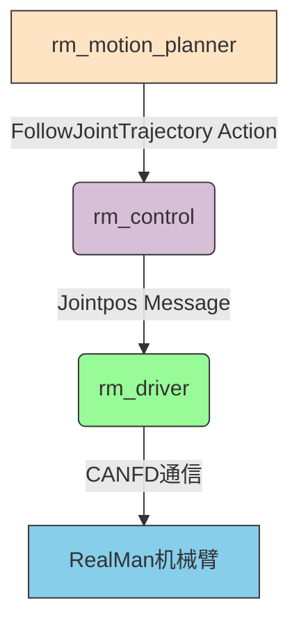

# RM Motion Planner

RM Motion Planner 是一个基于ScLERP算法的机械臂运动规划器，它可以生成轨迹并通过ROS 2 action接口发送给rm_control节点，最终控制RealMan机械臂执行运动。

## 功能说明

该功能包实现了以下功能：

1. 使用ScLERP算法进行路径规划
2. 通过`/rm_group_controller/follow_joint_trajectory` action与rm_control通信
3. rm_control接收轨迹后进行插值处理，并以20ms周期将轨迹点发布到`/rm_driver/movej_canfd_cmd`话题
4. rm_driver订阅该话题并控制机械臂执行相应的关节运动

## 文件结构

```
rm_motion_planner/
├── src/
│   ├── rm_sclerp_planner_test.cpp     # 简单测试程序
│   └── rm_sclerp_planner_node.cpp     # 完整的规划器节点
├── config/
│   ├── planner_params.yaml            # 默认参数文件
│   └── planner_params_example.yaml    # 示例参数文件
├── launch/
│   └── test_sclerp_planner.launch.py  # 启动文件
├── CMakeLists.txt                     # 编译配置
└── package.xml                        # 包依赖声明
```

## 编译

在工作空间根目录执行：

```bash
colcon build --packages-select rm_motion_planner
```

## 使用方法

1. 启动rm_driver:
```bash
ros2 launch rm_driver rm_75_driver.launch.py
```

2. 启动rm_control:
```bash
ros2 launch rm_control rm_75_control.launch.py
```

3. 运行rm_motion_planner:
```bash
ros2 launch rm_motion_planner test_sclerp_planner.launch.py
```

### 参数配置方式

#### 1. 通过YAML参数文件配置（推荐）

系统提供了默认的参数文件 [config/planner_params.yaml](config/planner_params.yaml)：

```yaml
rm_sclerp_planner_node:
  ros__parameters:
    start_joint_positions: "0.0,0.0,0.0,0.0,0.0,0.0,0.0"
    target_joint_positions: "0.1,0.1,0.1,0.1,0.1,0.1,0.1"
    # URDF文件路径（如果为空，则使用MoveIt的robot_description参数）
    urdf_path: "$(find rm_description)/urdf/rm_75_6fb.urdf"
```

还可以参考 [config/planner_params_example.yaml](config/planner_params_example.yaml) 创建自定义参数文件。

目标机械臂的URDF模型路径示例：
```
$(find rm_description)/urdf/rm_75_6fb.urdf
```
或者绝对路径：
```
/home/byd/Documents/Projects/DualArmProjects/realmanRobot/ros2_rm_ws/src/ros2_rm_robot-humble/rm_description/urdf/rm_75_6fb.urdf
```

#### 2. 通过launch参数配置

可选参数：
- `start_joint_positions`: 起始关节角度（弧度），默认为"0.0,0.0,0.0,0.0,0.0,0.0,0.0"
- `target_joint_positions`: 目标关节角度（弧度），默认为"0.1,0.1,0.1,0.1,0.1,0.1,0.1"
- `urdf_path`: URDF文件路径，如果为空则使用MoveIt的`/move_group/robot_description`参数，默认为空

示例：
```bash
ros2 launch rm_motion_planner test_sclerp_planner.launch.py \
  start_joint_positions:="0.0,0.0,0.0,0.0,0.0,0.0,0.0" \
  target_joint_positions:="0.2,0.2,0.2,0.2,0.2,0.2,0.2" \
  urdf_path:="/path/to/rm_75.urdf"
```

#### 3. 通过命令行直接运行节点并指定参数文件

```bash
ros2 run rm_motion_planner rm_sclerp_planner_node --ros-args --params-file /path/to/your/params.yaml
```

## 工作流程



## 详细说明

### 1. rm_motion_planner节点

该节点负责：
- 使用ScLERP算法进行路径规划
- 生成轨迹点序列
- 通过`/rm_group_controller/follow_joint_trajectory` action将轨迹发送给rm_control

### 2. rm_control节点

该节点负责：
- 接收来自rm_motion_planner的轨迹
- 对轨迹进行三次样条插值处理
- 以20ms周期将轨迹点逐一发布到`/rm_driver/movej_canfd_cmd`话题

### 3. rm_driver节点

该节点负责：
- 订阅`/rm_driver/movej_canfd_cmd`话题
- 将接收到的关节角度（弧度）转换为角度值
- 调用底层API `rm_movej_canfd` 将命令发送给机械臂
- 机械臂执行相应的关节运动

## URDF模型加载方式

ScLERP规划器支持两种URDF模型加载方式：

1. **依赖MoveIt方式（默认）**：
   - 不指定`urdf_path`参数或将其设置为空字符串
   - 从MoveIt的`/move_group/robot_description`参数加载URDF模型
   - 需要启动MoveIt相关配置包

2. **独立运行方式**：
   - 指定`urdf_path`参数为URDF文件的完整路径
   - 直接从指定文件加载URDF模型
   - 无需启动MoveIt，可独立运行

这种方式提供了更大的灵活性，用户可以根据需要选择是否依赖MoveIt系统。

### 自动链接名称检测

当提供了有效的`urdf_path`时，程序会自动尝试从URDF文件中解析基座链接和末端链接名称：
- 基座链接：URDF模型的根链接
- 末端链接：URDF模型中没有子链接的链接（通常是最末端的链接）

如果自动解析失败，将使用默认链接名称（base_link 和 Link7）。

### 运行方式说明

无论参数文件中的`urdf_path`是否为空，都可以使用以下命令运行：

```bash
ros2 launch rm_motion_planner test_sclerp_planner.launch.py
```