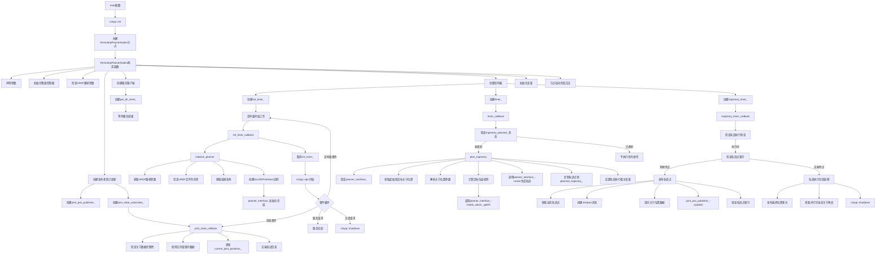

# RM Motion Planner 程序执行流程图

```mermaid
graph TD
    A[main函数] --> B[rclcpp::init]
    B --> C[创建RmSclerpPlannerNode1节点]
    C --> D[RmSclerpPlannerNode1构造函数]
    
    D --> D1[声明参数]
    D --> D2[初始化吸盘控制器]
    D --> D3[检查URDF路径参数]
    D --> D4[创建发布者和订阅者]
    D --> D5[创建服务客户端]
    D --> D6[创建定时器]
    D --> D7[初始化变量]
    D --> D8[节点启动完成日志]
    
    D4 --> D4A[创建joint_pos_publisher_]
    D4 --> D4B[创建joint_state_subscriber_]
    
    D5 --> D5A[创建get_dh_client_]
    D5A --> D5B[等待服务就绪]
    
    D6 --> D6A[创建init_timer_]
    D6 --> D6B[创建timer_]
    D6 --> D6C[创建trajectory_timer_]
    
    D6A --> E[定时器开始工作]
    E --> E1[init_timer_callback]
    E1 --> E1A[initialize_planner]
    E1A --> E1A1[获取URDF路径参数]
    E1A --> E1A2[检查URDF文件存在性]
    E1A --> E1A3[获取链接名称]
    E1A --> E1A4[创建ScLERPInterface实例]
    E1A4 --> E1A5[planner_interface_初始化完成]
    E1 --> E1B[取消init_timer_]
    
    D6B --> F[timer_callback]
    F --> F1[检查trajectory_planned_状态]
    F1 -- 未规划 --> F2[plan_trajectory]
    F1 -- 已规划 --> F3[不执行任何操作]
    
    F2 --> F2A[检查planner_interface_]
    F2 --> F2B[获取起始和目标关节位置]
    F2 --> F2C[解析关节位置参数]
    F2 --> F2D[计算目标位姿矩阵]
    F2D --> F2D1[调用planner_interface_->kinlib_solver_.getFK]
    F2 --> F2E[调用planner_interface_->solve生成轨迹]
    F2 --> F2F[复制轨迹点到planned_trajectory_]
    F2 --> F2G[设置轨迹执行相关变量]
    
    D6C --> G[trajectory_timer_callback]
    G --> G1[检查轨迹执行状态]
    G1 -- 执行中 --> G2[检查轨迹点索引]
    G2 -- 有剩余点 --> G3[发布轨迹点]
    G3 --> G3A[获取当前轨迹点]
    G3 --> G3B[创建Jointpos消息]
    G3 --> G3C[填充关节位置数据]
    G3 --> G3D[joint_pos_publisher_->publish]
    G3 --> G3E[增加轨迹点索引]
    G2 -- 无剩余点 --> G4[轨迹执行完成处理]
    G4 --> G4A[发布最终位置多次]
    G4 --> G4B[获取并打印当前关节角度]
    G4 --> G4C[rclcpp::shutdown]
    
    D4B --> H[joint_state_callback]
    H --> H1[检查关节数据完整性]
    H --> H2[使用互斥锁保护数据]
    H --> H3[更新current_joint_positions_]
    H --> H4[记录调试信息]
    
    E1B --> I[rclcpp::spin开始]
    I --> J{事件循环}
    J -->|定时器事件| E
    J -->|消息事件| H
    J -->|服务请求| K[服务回调]
    J -->|关闭请求| L[rclcpp::shutdown]
```